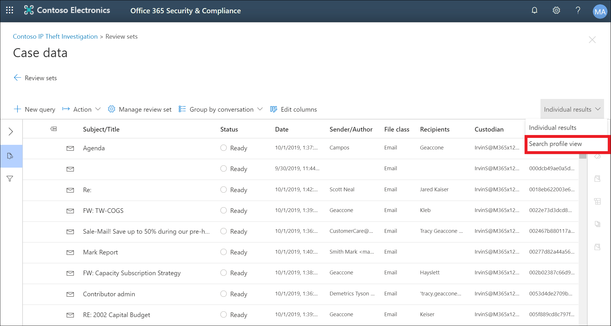

# Erweitertes eDiscovery-Dashboard für Überprüfungs SätzeAdvanced eDiscovery dashboard for review sets

In einigen Fällen in Advanced eDiscovery ist möglicherweise eine große Menge an Dokumenten und e-Mail-Nachrichten vorhanden, die überprüft werden müssen.For some cases in Advanced eDiscovery, you may have a large volume of documents and email messages that need to be reviewed. Bevor Sie mit dem Überprüfungsprozess beginnen, können Sie Ihren Korpus schnell analysieren, um Trends oder wichtige Statistiken zu identifizieren, die Sie bei der Entwicklung ihrer Überprüfungsstrategie unterstützen sollen.Before you start the review process, you may want to quickly analyze your corpus to identify trends or key statistics that will help you develop your review strategy. Zu diesem Zweck können Sie das erweiterte eDiscovery-Dashboard für Überprüfungs Sätze verwenden, um Ihren Korpus schnell zu analysieren.To do this, you can use the Advanced eDiscovery dashboard for review sets to quickly analyze your corpus.

## Schritt 1: Erstellen eines Widgets im Dashboard für Überprüfungs SätzeStep 1: Create a widget on the review set dashboard

1. Wechseln Sie im Security & Compliance Center zu **eDiscovery > Advanced eDiscovery** , um die Liste der Fälle in Ihrer Organisation anzuzeigen.In the Security & Compliance Center, go to **eDiscovery > Advanced eDiscovery** to display the list of cases in your organization.
  
2. Wählen Sie einen vorhandenen Fall aus.Select an existing case.
  
3. Klicken Sie auf die Registerkarte **Überarbeitungs Gruppe** , und wählen Sie dann einen Überprüfungs Sätze aus.Click the **Review Set** tab, and then select a review set.
  
4. Klicken Sie in der Dropdownliste **einzelne Ergebnisse** auf **Suchprofil Ansicht**.In the **Individual results** dropdown list, click **Search profile view**. 

   

   Die Seite **Suchprofil Ansicht** wird angezeigt; Wenn Sie diese Seite zum ersten Mal anzeigen, werden drei Standard-Widgets angezeigt.The **Search profile view** page is displayed; the first time you display this page, three default widgets are displayed.

   
  
5. Klicken Sie auf das **neue Widget** , und wählen Sie dann eines der folgenden Elemente aus:Click the **New  widget** and then select one of the following items:

   

   - **Wählen Sie aus Bibliothek:** Zeigt eine Standardbibliothek von Widgets an.**Choose from library:** Displays a default library of widgets. Klicken Sie auf ein Widget, und klicken Sie dann auf **Hinzufügen** , um es zu den Widgets auf der Seite **Suchprofil Ansicht** hinzuzufügen.You click a widget and then click **Add** to add it to the widgets on the **Search profile view** page.
  
   - **Benutzerdefiniertes Widget erstellen:** Zeigt eine Flyout-Seite an, mit der Sie ein benutzerdefiniertes Widget einrichten können.**Create custom widget:** Displays a flyout page that you can use to set up a custom widget. 

6. Um ein benutzerdefiniertes Widget zu erstellen, gehen Sie auf der Seite Widget-Flyout **Hinzufügen** wie folgt vor:To create a custom widget, do the following on the **Add widget** flyout page:

   

    a.a. Geben Sie einen Namen für das Widget ein, der in der Titelleiste des Widgets angezeigt wird.Type a name for the widget, which is displayed in the widget title bar. Das Benennen eines Widgets ist erforderlich, es ist jedoch hilfreich, die widgetdaten zu identifizieren.Naming a widget is required, but it's helpful to identify the widget data.

    b.b. Wählen Sie in der Dropdownliste **Pivot auswählen** eine Eigenschaft aus, die für die Widget-Daten verwendet wird.Select a property in the **Choose pivot** dropdown list that will be used for the widget data. Die Elemente in dieser Liste sind die durchsuchbaren Eigenschaften für die Elemente in der Überprüfungsgruppe.The items in this list are the searchable properties for the items in the review set. Eine Beschreibung dieser Eigenschaften finden Sie unter [Document Metadata fields in Advanced eDiscovery](document-metadata-fields-in-Advanced-eDiscovery.md).For a description of these properties, see [Document metadata fields in Advanced eDiscovery](document-metadata-fields-in-Advanced-eDiscovery.md). Die Pivot-Optionen für das Widget werden in der Spalte **durchsuchbarer Feldname** in diesem Thema aufgeführt.The pivot options for the widget are listed in the **Searchable field name** column in this topic.

    c.c. Auswählen eines Diagrammtyps zum Anzeigen der Daten aus der ausgewählten Pivot-Eigenschaft.Select a chart type to display the data from the selected pivot property.

  6. Klicken Sie auf **Hinzufügen** , um das benutzerdefinierte Widget zu erstellen und es auf der Seite **Suchprofil Ansicht** anzuzeigen.Click **Add** to create the custom widget and display it on the **Search profile view** page.

## Schritt 2: Erstellen einer Suchabfrage für Überprüfungs SätzeStep 2: Create a review set search query

1. Klicken Sie auf der Titelleiste des Widgets auf **...** , und klicken Sie dann auf **Bedingung anwenden**.Click **...** in the widget title bar, and then click **Apply condition**.

   

2. Klicken Sie auf der Flyout-Seite auf ein Element in der Widget-Taste oder im Widget-Diagramm, um einen Filter zu erstellen.On the flyout page, click an element on the widget key or widget chart to create a filter.

   

3. Wiederholen Sie die Schritte 1-2 für andere Widgets mehrere Widgets.Repeat steps 1-2 for other widgets multiple widgets. 

4. Wenn Sie fertig sind, klicken Sie auf **als Abfrage speichern** , um Ihre Bedingungen als neue Suchabfrage für die Überprüfungsgruppe zu speichern.When you're done, click **Save as query** to save your conditions as a new search query for the review set.

   

5. Schließen Sie die **Suchprofil Ansicht** , um zur Suchergebnis Ansicht zurückzukehren.Close the **Search profile view** to return to the search results view.

   Wenn Sie visuelle Filter erstellt haben, wird die resultierende Abfrage auf die angezeigten Suchergebnisse angewendet, und die in Schritt 4 gespeicherte Suchabfrage wird unter **gespeicherte Abfragen**angezeigt.If you have created any visual filters, the resulting query is applied to the search results that are displayed, and the search query that you saved in step 4 is displayed under **Saved queries**. Weitere Informationen zum Überprüfen von Mengen Abfragen finden Sie unter [Abfragen der Daten in einem Überprüfungs Satzes](review-set-search.md).For more information about review set queries, see [Query the data in a review set](review-set-search.md).
