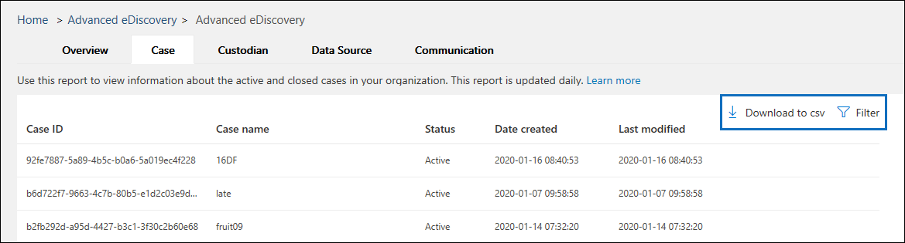

# Erweiterte eDiscovery-Berichte (Vorschau)

Erweiterte eDiscovery-Berichte unterstützen Sie bei der Aggregation von Falldaten in Ihrer Organisation, um die Datenanalyse und die Unternehmensberichterstattung zu optimieren. Das Feature für erweiterte eDiscovery-Berichte enthält mehrere integrierte Berichte, die Sie bei der Beantwortung von Fragen wie folgt unterstützen:

- Wie viele aktive depotverwalter gibt es für alle Fälle in meiner Organisation?

- Wie viele Datenquellen werden für alle Fälle in meiner Organisation aufbewahrt?

- Wie viele Aufbewahrungs Benachrichtigungen wurden im letzten Monat für alle Fälle in meiner Organisation ausgestellt?

- Wie viele aktive und abgeschlossene Fälle gibt es in meiner Organisation?

## Vorabinformationen

- Um auf Erweiterte eDiscovery-Berichte zugreifen zu können, müssen Sie Mitglied der Rollengruppe "eDiscovery-Administrator" sein. Als Mitglied dieser Rollengruppe erhalten Sie die erforderlichen Berechtigungen zum Anzeigen, Filtern und Exportieren der Daten in den Berichten. Weitere Informationen finden Sie unter [Zuweisen von eDiscovery-Berechtigungen](assign-ediscovery-permissions.md).

- Erweiterte eDiscovery-Berichte werden täglich aktualisiert. Dadurch kann es zu Verzögerungen kommen, wenn neue Fälle, depotverwalter, Datenquellen und Kommunikationen erstellt werden und wenn Sie im entsprechenden Bericht angezeigt werden.

So greifen Sie auf die erweiterten eDiscovery-Berichte zu:

1. Wechseln Sie zu https://protection.office.com.
  
2. Melden Sie sich bei Office 365 mit ihrem geschäftlichen oder Schulkonto an.
  
3. Klicken Sie im Security & Compliance Center auf **eDiscovery > Advanced eDiscovery**.
  
   Auf der **erweiterten eDiscovery** -Startseite werden die Registerkarten Case, Depot, Datenquelle und Kommunikationsbericht am oberen Rand der Seite angezeigt. 
  
   

5. Wenn Sie einen Bericht anzeigen möchten, klicken Sie auf eine Registerkarte Bericht, und führen Sie bei Bedarf eine der folgenden Aktionen aus:

   

   a. Klicken Sie auf **Filter** , um die Berichtsdaten einzugrenzen. Sie können nach verschiedenen Eigenschaften für jeden Bericht filtern.
  
   b. Klicken Sie auf **in CSV herunterladen** , um die Berichtsdaten in eine CSV-Datei zu exportieren.

## Fallbericht

Der Fallbericht aggregiert Informationen zu aktiven und geschlossenen vorab-eDiscovery-Fällen in Ihrer Organisation.

|Spalte        |Beschreibung|
|:-------------|:-------------|
|Case-ID | Der eindeutige Bezeichner für jeden Fall.| 
|Case-Name | Benutzerdefinierter Name des Falls.|
|Status | Gibt an, ob die Groß-/Kleinschreibung aktiv oder geschlossen ist.|
|Erstellungsdatum |Th Datum, an dem der Fall erstellt wurde. Datumsangaben liegen im UTC-Format vor.|
|Zuletzt geändert |Das Datum, an dem der Fall geschlossen oder zuletzt aktualisiert wurde. Datumsangaben liegen im UTC-Format vor.| 
|||

## Depot Bericht

Im eDiscovery-Workflow werden Personen, die Gegenstandeines rechts Falls oder einer Untersuchung sind, als *Datenverwalter* (oder nur *Verwalter*) bezeichnet und als "Personen mit administrativer Kontrolle über ein Dokument oder eine elektronische Datei" definiert. Der Depot Bericht hilft Ihnen, alle Verwalter zu identifizieren, deren Datenquellen für alle Fälle in Ihrer Organisation aufbewahrt werden.

|Spalte         |Beschreibung|
|:-------------|:-------------|
|Name des Depotinhabers| Der Name der depotverwalter in Active Directory.|
|Depotverwalter UPN | Der Benutzerprinzipalname der Depotbank.|
|Depot-ID | Der eindeutige Bezeichner für die Depotbank in einem bestimmten Fall. |
|Case-Name | Der benutzerdefinierte Name des Falls.|
|Haltestatus | Gibt an, ob die Depotbank derzeit in der Warteschleife ist oder ob Sie von der Anfrage freigegeben wurde.|
|Case-ID | Der eindeutige Bezeichner für den Fall.|
|Kommunikationsstatus |Gibt an, ob die Depotbank eine rechtliche Aufbewahrungs Benachrichtigung ausgestellt hat oder nicht. |
|Depot hinzugefügt | Das Datum, an dem die Depotbank dem Fall hinzugefügt wurde. Datumsangaben liegen im UTC-Format vor.|
|||

## Datenquellenbericht

Sie können einen erweiterten eDiscovery-Fall zum Erstellen von Haltebereichen verwenden, um Inhalte beizubehalten, die möglicherweise für den Fall relevant sind. Mithilfe der erweiterten eDiscovery-Aufbewahrungsfunktionen können Sie Aufbewahrungen und deren Datenquellen platzieren. Außerdem können Sie Postfächern und OneDrive für Unternehmen Konten einen Aufbewahrungs freien Speicherplatz hinzufügen. Sie können den Berichtdaten Quellen verwenden, um Details zu Inhaltsspeicherorten für alle Fälle in Ihrer Organisation zusammenzufassen.

|Spalte        |Beschreibung|
| -------------|-------------|
|Case-ID |Der eindeutige Bezeichner für jeden Fall. |
|Arbeitslast |Gibt den Typ des Inhaltsspeichers an, der in der Warteschleife gespeichert wird (beispielsweise Exchange oder SharePoint).
|Speicherort Name |Gibt die SMTP-Adresse (für Exchange-Postfächer) oder die URL (für SharePoint-Websites) des Inhaltsspeicherorts an. | 
|Depot-ID |Wenn die Datenquelle einer Depotbank angehört, wird in dieser Spalte der eindeutige Bezeichner für die Depotbank in einem bestimmten Fall angezeigt. Diese Spalte ist für Speicherorte ohne Freiheitsentzug NULL.|
|Name des Depotinhabers |Der Name der depotverwalter in Active Directory.| 
|Case-Name |Der benutzerdefinierte Name des Falls.| 
|Status |Gibt an, ob der Speicherort des Inhalts aktuell gespeichert ist. | 
|Aufbewahrungsrichtlinien-ID |Der eindeutige Bezeichner für den Haltebereich, der den Speicherort des Inhalts enthält. | 
|Erstelltes Datum speichern |Gibt das Datum an, an dem die Aufbewahrungsrichtlinie erstellt wurde. Datumsangaben liegen im UTC-Format vor. | 
|Aufbewahrungsrichtlinien Name |Der Name des haltebereichs, der den Speicherort des Inhalts enthält. |
|Änderungsdatum des haltebereichs |Das Datum, an dem der Haltestatus zuletzt geändert wurde. Datumsangaben liegen im UTC-Format vor.| 
|Halten zuletzt geändert von|Der Name des Benutzers, der die Aufbewahrung zuletzt geändert hat.| 
|||

## Kommunikationsbericht

Ihre Organisation kann rechtliche Aufbewahrungs Vermerke ausgeben, um die Verwalter über ihre Verpflichtung zur Wahrung relevanter Informationen im Rahmen eines Rechts Falls oder einer Untersuchung zu informieren. Sie können den Bericht Kommunikation verwenden, um aggregierte Daten zu Bestätigungen, Erinnerungen, Eskalationen und anderen Arten von Kommunikation anzuzeigen.

|Spalte         |Beschreibung|
| -------------|-------------|
|Case-ID | Der eindeutige Bezeichner für den Fall.|
|Case-Name | Benutzerdefinierter Name des Falls.|
|Depot-ID |Der eindeutige Bezeichner für die Depotbank in einem bestimmten Fall.|
|Name des Depotinhabers |Der Name der Depotbank.|
|Notice-Typ |Gibt die Art der Benachrichtigung an, die für die Depotbank ausgestellt wurde.|
|Ausstellenden Offizier |Der Name des Benutzers, der die rechtliche Aufbewahrungs Benachrichtigung ausgestellt hat.|
|Benachrichtigungsereignis|Gibt die an den Benutzer gesendete Benachrichtigungsnachricht für das rechtliche Aufbewahrungs Recht an. Mögliche Werte sind: Erinnerung, Eskalation, Bestätigung und Aufbewahrungs Ausstellung.|
|Gesendet am-Datum |Das Datum, an dem die Kommunikation ausgegeben wurde. Für Bestätigungen gibt diese Spalte die Zeit an, zu der der Hinweis von der Depotbank bestätigt wurde. Datumsangaben liegen im UTC-Format vor.|
|||
