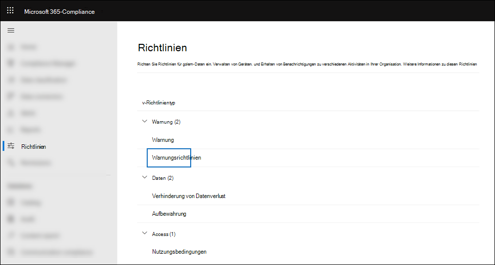

# <a name="alert-policies-in-the-microsoft-365-compliance-center"></a><span data-ttu-id="e226d-103">Warnungsrichtlinien im Microsoft 365 Compliance Center</span><span class="sxs-lookup"><span data-stu-id="e226d-103">Alert policies in the Microsoft 365 compliance center</span></span>

<span data-ttu-id="e226d-104">Sie können die Warnungsrichtlinie und die Warnungsdashboardtools im Microsoft 365 Compliance Center verwenden, um Warnungsrichtlinien zu erstellen und dann die Warnungen anzuzeigen, die generiert werden, wenn Benutzer Aktivitäten ausführen, die den Bedingungen einer Warnungsrichtlinie entsprechen.</span><span class="sxs-lookup"><span data-stu-id="e226d-104">You can use the alert policy and alert dashboard tools in the Microsoft 365 compliance center to create alert policies and then view the alerts generated when users perform activities that match the conditions of an alert policy.</span></span> <span data-ttu-id="e226d-105">Es gibt mehrere Standardwarnungsrichtlinien, mit denen Sie Aktivitäten überwachen können, z. B. das Zuweisen von Administratorrechten in Exchange Online, Schadsoftwareangriffe, Phishingkampagnen und ungewöhnliche Ebenen von Dateilöschungen und externer Freigabe.</span><span class="sxs-lookup"><span data-stu-id="e226d-105">There are several default alert policies that help you monitor activities such as assigning admin privileges in Exchange Online, malware attacks, phishing campaigns, and unusual levels of file deletions and external sharing.</span></span>

<span data-ttu-id="e226d-106">Mit Warnungsrichtlinien können Sie die Warnungen kategorisieren, die durch eine Richtlinie ausgelöst werden, die Richtlinie auf alle Benutzer in Ihrer Organisation anwenden, einen Schwellenwert für den Zeitpunkt festlegen, an dem eine Warnung ausgelöst wird, und entscheiden, ob E-Mail-Benachrichtigungen empfangen werden sollen, wenn Warnungen ausgelöst werden.</span><span class="sxs-lookup"><span data-stu-id="e226d-106">Alert policies let you categorize the alerts that are triggered by a policy, apply the policy to all users in your organization, set a threshold level for when an alert is triggered, and decide whether to receive email notifications when alerts are triggered.</span></span> <span data-ttu-id="e226d-107">Es gibt auch eine Seite **"Warnungen"** im Compliance Center, auf der Sie Warnungen anzeigen und filtern, einen Warnungsstatus festlegen können, der Ihnen bei der Verwaltung von Warnungen hilft, und warnungen schließen können, nachdem Sie den zugrunde liegenden Vorfall behoben oder behoben haben.</span><span class="sxs-lookup"><span data-stu-id="e226d-107">There's also a **Alerts** page in the compliance center where you can view and filter alerts, set an alert status to help you manage alerts, and then dismiss alerts after you've addressed or resolved the underlying incident.</span></span>

> [!NOTE]
> <span data-ttu-id="e226d-108">Warnungsrichtlinien sind für Organisationen mit einem Microsoft 365 Enterprise-, Office 365 Enterprise- oder Office 365 US Government E1/F1/G1-, E3/F3/G3- oder E5/G5-Abonnement verfügbar.</span><span class="sxs-lookup"><span data-stu-id="e226d-108">Alert policies are available for organizations with a Microsoft 365 Enterprise, Office 365 Enterprise, or Office 365 US Government E1/F1/G1, E3/F3/G3, or E5/G5 subscription.</span></span> <span data-ttu-id="e226d-109">Erweiterte Funktionen sind nur für Organisationen mit einem E5/G5-Abonnement oder für Organisationen mit einem E1/F1/G1- oder E3/F3/G3-Abonnement und einem Microsoft Defender für Office 365 P2 oder einem Microsoft 365 E5 Compliance oder einem E5 eDiscovery- und Audit-Add-On-Abonnement verfügbar.</span><span class="sxs-lookup"><span data-stu-id="e226d-109">Advanced functionality is only available for organizations with an E5/G5 subscription, or for organizations that have an E1/F1/G1 or E3/F3/G3 subscription and a Microsoft Defender for Office 365 P2 or a Microsoft 365 E5 Compliance or an E5 eDiscovery and Audit add-on subscription.</span></span> <span data-ttu-id="e226d-110">Die Funktionalität, die ein E5/G5- oder Add-On-Abonnement erfordert, wird in diesem Thema hervorgehoben.</span><span class="sxs-lookup"><span data-stu-id="e226d-110">The functionality that requires an E5/G5 or add-on subscription is highlighted in this topic.</span></span> <span data-ttu-id="e226d-111">Beachten Sie außerdem, dass Warnungsrichtlinien in Office 365 GCC-, GCC High- und DoD-US-Behördenumgebungen verfügbar sind.</span><span class="sxs-lookup"><span data-stu-id="e226d-111">Also note that alert policies are available in Office 365 GCC, GCC High, and DoD US government environments.</span></span>

## <a name="how-alert-policies-work"></a><span data-ttu-id="e226d-112">Funktionsweise von Warnungsrichtlinien</span><span class="sxs-lookup"><span data-stu-id="e226d-112">How alert policies work</span></span>

<span data-ttu-id="e226d-113">Hier finden Sie eine kurze Übersicht über die Funktionsweise von Warnungsrichtlinien und die Warnungen, die ausgelöst werden, wenn Benutzer- oder Administratoraktivitäten den Bedingungen einer Warnungsrichtlinie entsprechen.</span><span class="sxs-lookup"><span data-stu-id="e226d-113">Here's a quick overview of how alert policies work and the alerts that are triggers when user or admin activity matches the conditions of an alert policy.</span></span>


1. <span data-ttu-id="e226d-115">Ein Administrator in Ihrer Organisation erstellt, konfiguriert und aktiviert eine Warnungsrichtlinie mithilfe der Seite **"Warnungsrichtlinien"** im Compliance Center.</span><span class="sxs-lookup"><span data-stu-id="e226d-115">An admin in your organization creates, configures, and turns on an alert policy by using the **Alert policies** page in the compliance center.</span></span> <span data-ttu-id="e226d-116">Sie können Warnungsrichtlinien auch mit dem Cmdlet ["New-ProtectionAlert"](/powershell/module/exchange/new-protectionalert) in Security & Compliance Center PowerShell erstellen.</span><span class="sxs-lookup"><span data-stu-id="e226d-116">You can also create alert policies by using the [New-ProtectionAlert](/powershell/module/exchange/new-protectionalert) cmdlet in Security & Compliance Center PowerShell.</span></span>

   <span data-ttu-id="e226d-117">Um Warnungsrichtlinien zu erstellen, müssen Sie der Rolle "Warnungen verwalten" oder der Rolle "Organisationskonfiguration" im Compliance Center zugewiesen werden.</span><span class="sxs-lookup"><span data-stu-id="e226d-117">To create alert policies, you have to be assigned the Manage Alerts role or the Organization Configuration role in the compliance center.</span></span>

   > [!NOTE]
   > <span data-ttu-id="e226d-118">Es dauert bis zu 24 Stunden nach dem Erstellen oder Aktualisieren einer Warnungsrichtlinie, bevor Warnungen durch die Richtlinie ausgelöst werden können.</span><span class="sxs-lookup"><span data-stu-id="e226d-118">It takes up to 24 hours after creating or updating an alert policy before alerts can be triggered by the policy.</span></span> <span data-ttu-id="e226d-119">Dies liegt daran, dass die Richtlinie mit dem Warnungserkennungsmodul synchronisiert werden muss.</span><span class="sxs-lookup"><span data-stu-id="e226d-119">This is because the policy has to be synced to the alert detection engine.</span></span>

2. <span data-ttu-id="e226d-120">Ein Benutzer führt eine Aktivität aus, die den Bedingungen einer Warnungsrichtlinie entspricht.</span><span class="sxs-lookup"><span data-stu-id="e226d-120">A user performs an activity that matches the conditions of an alert policy.</span></span> <span data-ttu-id="e226d-121">Bei Schadsoftwareangriffen lösen infizierte E-Mail-Nachrichten, die an Benutzer in Ihrer Organisation gesendet werden, eine Warnung aus.</span><span class="sxs-lookup"><span data-stu-id="e226d-121">In the case of malware attacks, infected email messages sent to users in your organization trigger an alert.</span></span>

3. <span data-ttu-id="e226d-122">Microsoft 365 generiert eine Warnung, die auf der Seite **"Warnungen"** in Microsoft 365 Compliance Center angezeigt wird.</span><span class="sxs-lookup"><span data-stu-id="e226d-122">Microsoft 365 generates an alert that's displayed on the **Alerts** page in Microsoft 365 compliance center.</span></span> <span data-ttu-id="e226d-123">Wenn E-Mail-Benachrichtigungen für die Warnungsrichtlinie aktiviert sind, sendet Microsoft außerdem eine Benachrichtigung an eine Liste von Empfängern.</span><span class="sxs-lookup"><span data-stu-id="e226d-123">Also, if email notifications are enabled for the alert policy, Microsoft sends a notification to a list of recipients.</span></span> <span data-ttu-id="e226d-124">Die Warnungen, die ein Administrator oder andere Benutzer sehen können, die auf der Seite "Warnungen" durch die Rollen bestimmt werden, die dem Benutzer zugewiesen sind.</span><span class="sxs-lookup"><span data-stu-id="e226d-124">The alerts that an admin or other users can see that on the Alerts page is determined by the roles assigned to the user.</span></span> <span data-ttu-id="e226d-125">Weitere Informationen finden Sie unter [RBAC-Berechtigungen, die zum Anzeigen von Warnungen erforderlich sind.](#rbac-permissions-required-to-view-alerts)</span><span class="sxs-lookup"><span data-stu-id="e226d-125">For more information, see [RBAC permissions required to view alerts](#rbac-permissions-required-to-view-alerts).</span></span>

4. <span data-ttu-id="e226d-126">Ein Administrator verwaltet Warnungen im Compliance Center.</span><span class="sxs-lookup"><span data-stu-id="e226d-126">An admin manages alerts in the compliance center.</span></span> <span data-ttu-id="e226d-127">Das Verwalten von Warnungen besteht darin, einen Warnungsstatus zuzuweisen, um untersuchungen nachzuverfolgen und zu verwalten.</span><span class="sxs-lookup"><span data-stu-id="e226d-127">Managing alerts consists of assigning an alert status to help track and manage any investigation.</span></span>

## <a name="alert-policy-settings"></a><span data-ttu-id="e226d-128">Warnungsrichtlinieneinstellungen</span><span class="sxs-lookup"><span data-stu-id="e226d-128">Alert policy settings</span></span>

<span data-ttu-id="e226d-129">Eine Warnungsrichtlinie besteht aus einer Reihe von Regeln und Bedingungen, die die Benutzer- oder Administratoraktivität definieren, die eine Warnung generiert, eine Liste der Benutzer, die die Warnung auslösen, wenn sie die Aktivität ausführen, und einen Schwellenwert, der definiert, wie oft die Aktivität auftreten muss, bevor eine Warnung ausgelöst wird.</span><span class="sxs-lookup"><span data-stu-id="e226d-129">An alert policy consists of a set of rules and conditions that define the user or admin activity that generates an alert, a list of users who trigger the alert if they perform the activity, and a threshold that defines how many times the activity has to occur before an alert is triggered.</span></span> <span data-ttu-id="e226d-130">Außerdem kategorisieren Sie die Richtlinie und weisen ihr einen Schweregrad zu.</span><span class="sxs-lookup"><span data-stu-id="e226d-130">You also categorize the policy and assign it a severity level.</span></span> <span data-ttu-id="e226d-131">Diese beiden Einstellungen helfen Ihnen bei der Verwaltung von Warnungsrichtlinien (und der Warnungen, die ausgelöst werden, wenn die Richtlinienbedingungen erfüllt werden), da Sie beim Verwalten von Richtlinien und Anzeigen von Warnungen im Compliance Center nach diesen Einstellungen filtern können.</span><span class="sxs-lookup"><span data-stu-id="e226d-131">These two settings help you manage alert policies (and the alerts that are triggered when the policy conditions are matched) because you can filter on these settings when managing policies and viewing alerts in the compliance center.</span></span> <span data-ttu-id="e226d-132">Sie können z. B. Warnungen anzeigen, die den Bedingungen derselben Kategorie entsprechen, oder Warnungen mit demselben Schweregrad anzeigen.</span><span class="sxs-lookup"><span data-stu-id="e226d-132">For example, you can view alerts that match the conditions from the same category or view alerts with the same severity level.</span></span>

<span data-ttu-id="e226d-133">**So zeigen Sie Warnungsrichtlinien an und erstellen sie:**</span><span class="sxs-lookup"><span data-stu-id="e226d-133">**To view and create alert policies:**</span></span>

<span data-ttu-id="e226d-134">Wechseln Sie zu <https://compliance.microsoft.com> und wählen Sie richtlinien   >    >  **warnungswarnungsrichtlinien** aus.</span><span class="sxs-lookup"><span data-stu-id="e226d-134">Go to <https://compliance.microsoft.com> and then select **Policies** > **Alert** > **Alert policies**.</span></span> <span data-ttu-id="e226d-135">Alternativ können Sie direkt zu <https://compliance.microsoft.com/alertpolicies> .</span><span class="sxs-lookup"><span data-stu-id="e226d-135">Alternatively, you can go directly to <https://compliance.microsoft.com/alertpolicies>.</span></span>



<span data-ttu-id="e226d-137">Eine Warnungsrichtlinie besteht aus den folgenden Einstellungen und Bedingungen.</span><span class="sxs-lookup"><span data-stu-id="e226d-137">An alert policy consists of the following settings and conditions.</span></span>

- <span data-ttu-id="e226d-138">**Aktivität, die die Warnung verfolgt.**</span><span class="sxs-lookup"><span data-stu-id="e226d-138">**Activity the alert is tracking**.</span></span> <span data-ttu-id="e226d-139">Sie erstellen eine Richtlinie zum Nachverfolgen einer Aktivität oder in einigen Fällen einige verwandte Aktivitäten, z. B. das Freigeben einer Datei für einen externen Benutzer, das Zuweisen von Zugriffsberechtigungen oder das Erstellen eines anonymen Links.</span><span class="sxs-lookup"><span data-stu-id="e226d-139">You create a policy to track an activity or in some cases a few related activities, such a sharing a file with an external user by sharing it, assigning access permissions, or creating an anonymous link.</span></span> <span data-ttu-id="e226d-140">Wenn ein Benutzer die durch die Richtlinie definierte Aktivität ausführt, wird basierend auf den Einstellungen für den Warnungsschwellenwert eine Warnung ausgelöst.</span><span class="sxs-lookup"><span data-stu-id="e226d-140">When a user performs the activity defined by the policy, an alert is triggered based on the alert threshold settings.</span></span>

    > [!NOTE]
    > <span data-ttu-id="e226d-141">Welche Aktivitäten Sie nachverfolgen können, hängt vom plan ihrer Organisation Office 365 Enterprise oder Office 365 US Government ab.</span><span class="sxs-lookup"><span data-stu-id="e226d-141">The activities that you can track depend on your organization's Office 365 Enterprise or Office 365 US Government plan.</span></span> <span data-ttu-id="e226d-142">Im Allgemeinen erfordern Aktivitäten im Zusammenhang mit Schadsoftwarekampagnen und Phishingangriffen ein E5/G5-Abonnement oder ein E1/F1/G1- oder E3/F3/G3-Abonnement mit einem [Defender for Office 365](../security/office-365-security/defender-for-office-365.md) Plan 2-Add-On-Abonnement.</span><span class="sxs-lookup"><span data-stu-id="e226d-142">In general, activities related to malware campaigns and phishing attacks require an E5/G5 subscription or an E1/F1/G1 or E3/F3/G3 subscription with an [Defender for Office 365](../security/office-365-security/defender-for-office-365.md) Plan 2 add-on subscription.</span></span>

- <span data-ttu-id="e226d-143">**Aktivitätsbedingungen**.</span><span class="sxs-lookup"><span data-stu-id="e226d-143">**Activity conditions**.</span></span> <span data-ttu-id="e226d-144">Für die meisten Aktivitäten können Sie zusätzliche Bedingungen definieren, die erfüllt sein müssen, um eine Warnung auszulösen.</span><span class="sxs-lookup"><span data-stu-id="e226d-144">For most activities, you can define additional conditions that must be met to trigger an alert.</span></span> <span data-ttu-id="e226d-145">Häufige Bedingungen sind IP-Adressen (damit eine Warnung ausgelöst wird, wenn der Benutzer die Aktivität auf einem Computer mit einer bestimmten IP-Adresse oder innerhalb eines IP-Adressbereichs ausführt), ob eine Warnung ausgelöst wird, wenn ein bestimmter Benutzer diese Aktivität ausführt, und ob die Aktivität unter einem bestimmten Dateinamen oder einer bestimmten URL ausgeführt wird.</span><span class="sxs-lookup"><span data-stu-id="e226d-145">Common conditions include IP addresses (so that an alert is triggered when the user performs the activity on a computer with a specific IP address or within an IP address range), whether an alert is triggered if a specific user or users perform that activity, and whether the activity is performed on a specific file name or URL.</span></span> <span data-ttu-id="e226d-146">Sie können auch eine Bedingung konfigurieren, die eine Warnung auslöst, wenn die Aktivität von einem beliebigen Benutzer in Ihrer Organisation ausgeführt wird.</span><span class="sxs-lookup"><span data-stu-id="e226d-146">You can also configure a condition that triggers an alert when the activity is performed by any user in your organization.</span></span> <span data-ttu-id="e226d-147">Die verfügbaren Bedingungen sind von der ausgewählten Aktivität abhängig.</span><span class="sxs-lookup"><span data-stu-id="e226d-147">The available conditions are dependent on the selected activity.</span></span>

- <span data-ttu-id="e226d-148">**Wenn die Warnung ausgelöst wird.**</span><span class="sxs-lookup"><span data-stu-id="e226d-148">**When the alert is triggered**.</span></span> <span data-ttu-id="e226d-149">Sie können eine Einstellung konfigurieren, die definiert, wie oft eine Aktivität auftreten kann, bevor eine Warnung ausgelöst wird.</span><span class="sxs-lookup"><span data-stu-id="e226d-149">You can configure a setting that defines how often an activity can occur before an alert is triggered.</span></span> <span data-ttu-id="e226d-150">Auf diese Weise können Sie eine Richtlinie einrichten, um eine Warnung jedes Mal zu generieren, wenn eine Aktivität den Richtlinienbedingungen entspricht, wenn ein bestimmter Schwellenwert überschritten wird oder wenn das Auftreten der Aktivität, die die Warnung nachzeichnet, für Ihre Organisation ungewöhnlich wird.</span><span class="sxs-lookup"><span data-stu-id="e226d-150">This allows you to set up a policy to generate an alert every time an activity matches the policy conditions, when a certain threshold is exceeded, or when the occurrence of the activity the alert is tracking becomes unusual for your organization.</span></span>

    

    <span data-ttu-id="e226d-152">Wenn Sie die Einstellung basierend auf ungewöhnlichen Aktivitäten auswählen, richtet Microsoft einen Basiswert ein, der die normale Häufigkeit für die ausgewählte Aktivität definiert.</span><span class="sxs-lookup"><span data-stu-id="e226d-152">If you select the setting based on unusual activity, Microsoft establishes a baseline value that defines the normal frequency for the selected activity.</span></span> <span data-ttu-id="e226d-153">Es dauert bis zu sieben Tage, bis dieser Basisplan erstellt wird, während dem keine Warnungen generiert werden.</span><span class="sxs-lookup"><span data-stu-id="e226d-153">It takes up to seven days to establish this baseline, during which alerts won't be generated.</span></span> <span data-ttu-id="e226d-154">Nachdem der Basisplan eingerichtet wurde, wird eine Warnung ausgelöst, wenn die Häufigkeit der aktivität, die von der Warnungsrichtlinie nachverfolgt wird, den Basiswert erheblich überschreitet.</span><span class="sxs-lookup"><span data-stu-id="e226d-154">After the baseline is established, an alert is triggered when the frequency of the activity tracked by the alert policy greatly exceeds the baseline value.</span></span> <span data-ttu-id="e226d-155">Für überwachungsbezogene Aktivitäten (z. B. Datei- und Ordneraktivitäten) können Sie eine Basislinie basierend auf einem einzelnen Benutzer oder basierend auf allen Benutzern in Ihrer Organisation einrichten. für Aktivitäten im Zusammenhang mit Schadsoftware können Sie eine Basislinie basierend auf einer einzelnen Schadsoftwarefamilie, einem einzelnen Empfänger oder allen Nachrichten in Ihrer Organisation einrichten.</span><span class="sxs-lookup"><span data-stu-id="e226d-155">For auditing-related activities (such as file and folder activities), you can establish a baseline based on a single user or based on all users in your organization; for malware-related activities, you can establish a baseline based on a single malware family, a single recipient, or all messages in your organization.</span></span>

    > [!NOTE]
    > <span data-ttu-id="e226d-156">Die Möglichkeit, Warnungsrichtlinien basierend auf einem Schwellenwert oder basierend auf ungewöhnlichen Aktivitäten zu konfigurieren, erfordert ein E5/G5-Abonnement oder ein E1/F1/G1- oder E3/F3/G3-Abonnement mit einem Microsoft Defender für Office 365 P2-, Microsoft 365 E5 Compliance- oder Microsoft 365 eDiscovery- und Überwachungs-Add-On-Abonnement.</span><span class="sxs-lookup"><span data-stu-id="e226d-156">The ability to configure alert policies based on a threshold or based on unusual activity requires an E5/G5 subscription, or an E1/F1/G1 or E3/F3/G3 subscription with a Microsoft Defender for Office 365 P2, Microsoft 365 E5 Compliance, or Microsoft 365 eDiscovery and Audit add-on subscription.</span></span> <span data-ttu-id="e226d-157">Organisationen mit einem E1/F1/G1- und E3/F3/G3-Abonnement können nur Warnungsrichtlinien erstellen, bei denen bei jedem Auftreten einer Aktivität eine Warnung ausgelöst wird.</span><span class="sxs-lookup"><span data-stu-id="e226d-157">Organizations with an E1/F1/G1 and E3/F3/G3 subscription can only create alert policies where an alert is triggered every time that an activity occurs.</span></span>

- <span data-ttu-id="e226d-158">**Warnungskategorie**.</span><span class="sxs-lookup"><span data-stu-id="e226d-158">**Alert category**.</span></span> <span data-ttu-id="e226d-159">Um die von einer Richtlinie generierten Warnungen nachzuverfolgen und zu verwalten, können Sie einer Richtlinie eine der folgenden Kategorien zuweisen.</span><span class="sxs-lookup"><span data-stu-id="e226d-159">To help with tracking and managing the alerts generated by a policy, you can assign one of the following categories to a policy.</span></span>

  - <span data-ttu-id="e226d-160">Verhinderung von Datenverlust</span><span class="sxs-lookup"><span data-stu-id="e226d-160">Data loss prevention</span></span>

  - <span data-ttu-id="e226d-161">Informationsgovernance</span><span class="sxs-lookup"><span data-stu-id="e226d-161">Information governance</span></span>

  - <span data-ttu-id="e226d-162">Nachrichtenübermittlung</span><span class="sxs-lookup"><span data-stu-id="e226d-162">Mail flow</span></span>

  - <span data-ttu-id="e226d-163">Berechtigungen</span><span class="sxs-lookup"><span data-stu-id="e226d-163">Permissions</span></span>

  - <span data-ttu-id="e226d-164">Bedrohungsverwaltung</span><span class="sxs-lookup"><span data-stu-id="e226d-164">Threat management</span></span>

  - <span data-ttu-id="e226d-165">Sonstige</span><span class="sxs-lookup"><span data-stu-id="e226d-165">Others</span></span>

  <span data-ttu-id="e226d-166">Wenn eine Aktivität auftritt, die den Bedingungen der Warnungsrichtlinie entspricht, wird die generierte Warnung mit der in dieser Einstellung definierten Kategorie gekennzeichnet.</span><span class="sxs-lookup"><span data-stu-id="e226d-166">When an activity occurs that matches the conditions of the alert policy, the alert that's generated is tagged with the category defined in this setting.</span></span> <span data-ttu-id="e226d-167">Auf diese Weise können Sie Warnungen mit derselben Kategorieeinstellung auf der Seite **"Warnungen"** im Compliance Center nachverfolgen und verwalten, da Sie Warnungen basierend auf der Kategorie sortieren und filtern können.</span><span class="sxs-lookup"><span data-stu-id="e226d-167">This allows you to track and manage alerts that have the same category setting on the **Alerts** page in the compliance center because you can sort and filter alerts based on category.</span></span>

- <span data-ttu-id="e226d-168">**Warnungsschweregrad**.</span><span class="sxs-lookup"><span data-stu-id="e226d-168">**Alert severity**.</span></span> <span data-ttu-id="e226d-169">Ähnlich wie bei der Warnungskategorie weisen Sie Warnungsrichtlinien ein Schweregradattribut (**Niedrig**, **Mittel**, **Hoch** oder **Information )** zu.</span><span class="sxs-lookup"><span data-stu-id="e226d-169">Similar to the alert category, you assign a severity attribute (**Low**, **Medium**, **High**, or **Informational**) to alert policies.</span></span> <span data-ttu-id="e226d-170">Wenn eine Aktivität auftritt, die den Bedingungen der Warnungsrichtlinie entspricht, wird die generierte Warnung wie die Warnungskategorie mit demselben Schweregrad gekennzeichnet, der für die Warnungsrichtlinie festgelegt ist.</span><span class="sxs-lookup"><span data-stu-id="e226d-170">Like the alert category, when an activity occurs that matches the conditions of the alert policy, the alert that's generated is tagged with the same severity level that's set for the alert policy.</span></span> <span data-ttu-id="e226d-171">Auch hier können Sie Warnungen mit demselben Schweregrad auf der Seite **"Warnungen"** nachverfolgen und verwalten.</span><span class="sxs-lookup"><span data-stu-id="e226d-171">Again, this allows you to track and manage alerts that have the same severity setting on the **Alerts** page.</span></span> <span data-ttu-id="e226d-172">Sie können z. B. die Liste der Warnungen filtern, sodass nur Warnungen mit **hohem** Schweregrad angezeigt werden.</span><span class="sxs-lookup"><span data-stu-id="e226d-172">For example, you can filter the list of alerts so that only alerts with a **High** severity are displayed.</span></span>

    > [!TIP]
    > <span data-ttu-id="e226d-173">Beim Einrichten einer Warnungsrichtlinie sollten Sie aktivitäten, die zu schwerwiegenden negativen Folgen führen können, einen höheren Schweregrad zuweisen, z. B. die Erkennung von Schadsoftware nach der Übermittlung an Benutzer, das Anzeigen vertraulicher oder klassifizierter Daten, das Teilen von Daten mit externen Benutzern oder andere Aktivitäten, die zu Datenverlusten oder Sicherheitsbedrohungen führen können.</span><span class="sxs-lookup"><span data-stu-id="e226d-173">When setting up an alert policy, consider assigning a higher severity to activities that can result in severely negative consequences, such as detection of malware after delivery to users, viewing of sensitive or classified data, sharing data with external users, or other activities that can result in data loss or security threats.</span></span> <span data-ttu-id="e226d-174">Dies kann Ihnen helfen, Warnungen und die Maßnahmen zu priorisieren, die Sie ergreifen, um die zugrunde liegenden Ursachen zu untersuchen und zu beheben.</span><span class="sxs-lookup"><span data-stu-id="e226d-174">This can help you prioritize alerts and the actions you take to investigate and resolve the underlying causes.</span></span>

- <span data-ttu-id="e226d-175">**E-Mail-Benachrichtigungen**.</span><span class="sxs-lookup"><span data-stu-id="e226d-175">**Email notifications**.</span></span> <span data-ttu-id="e226d-176">Sie können die Richtlinie so einrichten, dass E-Mail-Benachrichtigungen an eine Liste von Benutzern gesendet (oder nicht gesendet) werden, wenn eine Warnung ausgelöst wird.</span><span class="sxs-lookup"><span data-stu-id="e226d-176">You can set up the policy so that email notifications are sent (or not sent) to a list of users when an alert is triggered.</span></span> <span data-ttu-id="e226d-177">Sie können auch ein tägliches Benachrichtigungslimit festlegen, sodass nach Erreichen der maximalen Anzahl von Benachrichtigungen an diesem Tag keine weiteren Benachrichtigungen für die Warnung gesendet werden.</span><span class="sxs-lookup"><span data-stu-id="e226d-177">You can also set a daily notification limit so that once the maximum number of notifications has been reached, no more notifications are sent for the alert during that day.</span></span> <span data-ttu-id="e226d-178">Zusätzlich zu E-Mail-Benachrichtigungen können Sie oder andere Administratoren die Warnungen anzeigen, die durch eine Richtlinie auf der Seite **"Warnungen"** ausgelöst werden.</span><span class="sxs-lookup"><span data-stu-id="e226d-178">In addition to email notifications, you or other administrators can view the alerts that are triggered by a policy on the **Alerts** page.</span></span> <span data-ttu-id="e226d-179">Erwägen Sie die Aktivierung von E-Mail-Benachrichtigungen für Warnungsrichtlinien einer bestimmten Kategorie oder mit einer Einstellung mit höherem Schweregrad.</span><span class="sxs-lookup"><span data-stu-id="e226d-179">Consider enabling email notifications for alert policies of a specific category or that have a higher severity setting.</span></span>

## <a name="default-alert-policies"></a><span data-ttu-id="e226d-180">Standardwarnungsrichtlinien</span><span class="sxs-lookup"><span data-stu-id="e226d-180">Default alert policies</span></span>

<span data-ttu-id="e226d-181">Microsoft bietet integrierte Warnungsrichtlinien, mit denen Exchange Missbrauch von Administratorberechtigungen, Schadsoftwareaktivitäten, potenziellen externen und internen Bedrohungen und Informationsgovernancerisiken identifiziert werden können.</span><span class="sxs-lookup"><span data-stu-id="e226d-181">Microsoft provides built-in alert policies that help identify Exchange admin permissions abuse, malware activity, potential external and internal threats, and information governance risks.</span></span> <span data-ttu-id="e226d-182">Auf der Seite **"Warnungsrichtlinien"** sind die Namen dieser integrierten Richtlinien fett formatiert, und der Richtlinientyp wird als **System** definiert.</span><span class="sxs-lookup"><span data-stu-id="e226d-182">On the **Alert policies** page, the names of these built-in policies are in bold and the policy type is defined as **System**.</span></span> <span data-ttu-id="e226d-183">Diese Richtlinien sind standardmäßig aktiviert.</span><span class="sxs-lookup"><span data-stu-id="e226d-183">These policies are turned on by default.</span></span> <span data-ttu-id="e226d-184">Sie können diese Richtlinien deaktivieren (oder erneut aktivieren), eine Liste der Empfänger einrichten, an die E-Mail-Benachrichtigungen gesendet werden sollen, und ein tägliches Benachrichtigungslimit festlegen.</span><span class="sxs-lookup"><span data-stu-id="e226d-184">You can turn off these policies (or back on again), set up a list of recipients to send email notifications to, and set a daily notification limit.</span></span> <span data-ttu-id="e226d-185">Die anderen Einstellungen für diese Richtlinien können nicht bearbeitet werden.</span><span class="sxs-lookup"><span data-stu-id="e226d-185">The other settings for these policies can't be edited.</span></span>

<span data-ttu-id="e226d-186">In der folgenden Tabelle sind die verfügbaren Standardwarnungsrichtlinien und die Kategorie, der jede Richtlinie zugewiesen ist, aufgeführt und beschrieben.</span><span class="sxs-lookup"><span data-stu-id="e226d-186">The following table lists and describes the available default alert policies and the category each policy is assigned to.</span></span> <span data-ttu-id="e226d-187">Die Kategorie wird verwendet, um zu bestimmen, welche Warnungen ein Benutzer auf der Seite "Warnungen" anzeigen kann.</span><span class="sxs-lookup"><span data-stu-id="e226d-187">The category is used to determine which alerts a user can view on the Alerts page.</span></span> <span data-ttu-id="e226d-188">Weitere Informationen finden Sie unter [RBAC-Berechtigungen, die zum Anzeigen von Warnungen erforderlich sind.](#rbac-permissions-required-to-view-alerts)</span><span class="sxs-lookup"><span data-stu-id="e226d-188">For more information, see [RBAC permissions required to view alerts](#rbac-permissions-required-to-view-alerts).</span></span>

<span data-ttu-id="e226d-189">In der Tabelle sind auch die Office 365 Enterprise und Office 365 US Government-Pläne aufgeführt, die für jeden erforderlich sind.</span><span class="sxs-lookup"><span data-stu-id="e226d-189">The table also indicates the Office 365 Enterprise and Office 365 US Government plan required for each one.</span></span> <span data-ttu-id="e226d-190">Einige Standardwarnungsrichtlinien sind verfügbar, wenn Ihre Organisation zusätzlich zu einem E1/F1/G1- oder E3/F3/G3-Abonnement über das entsprechende Add-On-Abonnement verfügt.</span><span class="sxs-lookup"><span data-stu-id="e226d-190">Some default alert policies are available if your organization has the appropriate add-on subscription in addition to an E1/F1/G1 or E3/F3/G3 subscription.</span></span>

| <span data-ttu-id="e226d-191">Standardwarnungsrichtlinie</span><span class="sxs-lookup"><span data-stu-id="e226d-191">Default alert policy</span></span> | <span data-ttu-id="e226d-192">Beschreibung</span><span class="sxs-lookup"><span data-stu-id="e226d-192">Description</span></span> | <span data-ttu-id="e226d-193">Kategorie</span><span class="sxs-lookup"><span data-stu-id="e226d-193">Category</span></span> | <span data-ttu-id="e226d-194">Enterprise-Abonnement</span><span class="sxs-lookup"><span data-stu-id="e226d-194">Enterprise subscription</span></span> |
|:-----|:-----|:-----|:-----|
|<span data-ttu-id="e226d-195">**Ein potenziell schädlicher URL-Klick wurde erkannt.**</span><span class="sxs-lookup"><span data-stu-id="e226d-195">**A potentially malicious URL click was detected**</span></span>|<span data-ttu-id="e226d-196">Generiert eine Warnung, wenn ein Benutzer, der durch [Tresor Links](../security/office-365-security/safe-links.md) in Ihrer Organisation geschützt ist, auf einen bösartigen Link klickt.</span><span class="sxs-lookup"><span data-stu-id="e226d-196">Generates an alert when a user protected by [Safe Links](../security/office-365-security/safe-links.md) in your organization clicks a malicious link.</span></span> <span data-ttu-id="e226d-197">Dieses Ereignis wird ausgelöst, wenn Änderungen an der URL-Bewertung von Microsoft Defender für Office 365 identifiziert werden oder wenn Benutzer die Tresor Links-Seiten außer Kraft setzen (basierend auf der Microsoft 365 for Business Tresor Links-Richtlinie Ihrer Organisation).</span><span class="sxs-lookup"><span data-stu-id="e226d-197">This event is triggered when URL verdict changes are identified by Microsoft Defender for Office 365 or when users override the Safe Links pages (based on your organization's Microsoft 365 for business Safe Links policy).</span></span> <span data-ttu-id="e226d-198">Diese Warnungsrichtlinie hat die Einstellung **"Hoher** Schweregrad".</span><span class="sxs-lookup"><span data-stu-id="e226d-198">This alert policy has a **High** severity setting.</span></span> <span data-ttu-id="e226d-199">Für Defender für Office 365 P2-, E5-, G5-Kunden löst diese Warnung automatisch [eine automatisierte Untersuchung und Reaktion in Office 365](../security/office-365-security/office-365-air.md)aus.</span><span class="sxs-lookup"><span data-stu-id="e226d-199">For Defender for Office 365 P2, E5, G5 customers, this alert automatically triggers [automated investigation and response in Office 365](../security/office-365-security/office-365-air.md).</span></span> <span data-ttu-id="e226d-200">Weitere Informationen zu Ereignissen, die diese Warnung auslösen, finden Sie unter [Einrichten Tresor Verknüpfungsrichtlinien.](../security/office-365-security/set-up-safe-links-policies.md)</span><span class="sxs-lookup"><span data-stu-id="e226d-200">For more information on events that trigger this alert, see [Set up Safe Links policies](../security/office-365-security/set-up-safe-links-policies.md).</span></span>|<span data-ttu-id="e226d-201">Bedrohungsverwaltung</span><span class="sxs-lookup"><span data-stu-id="e226d-201">Threat management</span></span>|<span data-ttu-id="e226d-202">E5/G5 oder Defender für Office 365 P2-Add-On-Abonnement</span><span class="sxs-lookup"><span data-stu-id="e226d-202">E5/G5 or Defender for Office 365 P2 add-on subscription</span></span>|
|<span data-ttu-id="e226d-203">**Ergebnis Administrator-Übermittlung abgeschlossen**</span><span class="sxs-lookup"><span data-stu-id="e226d-203">**Admin Submission result completed**</span></span>|<span data-ttu-id="e226d-204">Generiert eine Warnung, wenn eine [Administratorübermittlung](../security/office-365-security/admin-submission.md) den erneuten Scan der übermittelten Entität abgeschlossen hat.</span><span class="sxs-lookup"><span data-stu-id="e226d-204">Generates an alert when an [Admin Submission](../security/office-365-security/admin-submission.md) completes the rescan of the submitted entity.</span></span> <span data-ttu-id="e226d-205">Eine Warnung wird jedes Mal ausgelöst, wenn ein erneutes Scanergebnis aus einer Administratorübermittlung gerendert wird.</span><span class="sxs-lookup"><span data-stu-id="e226d-205">An alert will be triggered every time a rescan result is rendered from an Admin Submission.</span></span> <span data-ttu-id="e226d-206">Diese Warnungen sollen Sie daran erinnern, [die Ergebnisse vorheriger Übermittlungen](https://protection.office.com/reportsubmission)zu überprüfen, von Benutzern gemeldete Nachrichten zu übermitteln, um die neuesten Richtlinienüberprüfungen und Neuscanbewertungen zu erhalten, und Ihnen helfen, festzustellen, ob die Filterrichtlinien in Ihrer Organisation die beabsichtigten Auswirkungen haben.</span><span class="sxs-lookup"><span data-stu-id="e226d-206">These alerts are meant to remind you to [review the results of previous submissions](https://protection.office.com/reportsubmission), submit user reported messages to get the latest policy check and rescan verdicts, and help you determine if the filtering policies in your organization are having the intended impact.</span></span> <span data-ttu-id="e226d-207">Diese Richtlinie weist eine Einstellung für den **Schweregrad "Information"** auf.</span><span class="sxs-lookup"><span data-stu-id="e226d-207">This policy has a **Informational** severity setting.</span></span>|<span data-ttu-id="e226d-208">Bedrohungsverwaltung</span><span class="sxs-lookup"><span data-stu-id="e226d-208">Threat management</span></span>|<span data-ttu-id="e226d-209">E1/F1, E3/F3 oder E5</span><span class="sxs-lookup"><span data-stu-id="e226d-209">E1/F1, E3/F3, or E5</span></span>|
|<span data-ttu-id="e226d-210">**Der Administrator hat eine manuelle Untersuchung von E-Mails ausgelöst**</span><span class="sxs-lookup"><span data-stu-id="e226d-210">**Admin triggered manual investigation of email**</span></span>|<span data-ttu-id="e226d-211">Generiert eine Warnung, wenn ein Administrator die manuelle Untersuchung einer E-Mail aus dem Bedrohungs-Explorer auslöst.</span><span class="sxs-lookup"><span data-stu-id="e226d-211">Generates an alert when an admin triggers the manual investigation of an email from Threat Explorer.</span></span> <span data-ttu-id="e226d-212">Weitere Informationen finden Sie unter [Beispiel: Ein Sicherheitsadministrator löst eine Untersuchung aus dem Bedrohungs-Explorer aus.](../security/office-365-security/automated-investigation-response-office.md#example-a-security-administrator-triggers-an-investigation-from-threat-explorer)</span><span class="sxs-lookup"><span data-stu-id="e226d-212">For more information, see [Example: A security administrator triggers an investigation from Threat Explorer](../security/office-365-security/automated-investigation-response-office.md#example-a-security-administrator-triggers-an-investigation-from-threat-explorer).</span></span> <span data-ttu-id="e226d-213">Diese Warnung benachrichtigt Ihre Organisation, dass die Untersuchung gestartet wurde.</span><span class="sxs-lookup"><span data-stu-id="e226d-213">This alert notifies your organization that the investigation was started.</span></span> <span data-ttu-id="e226d-214">Die Warnung enthält Informationen darüber, wer sie ausgelöst hat, und enthält einen Link zur Untersuchung.</span><span class="sxs-lookup"><span data-stu-id="e226d-214">The alert provides information about who triggered it and includes a link to the investigation.</span></span> <span data-ttu-id="e226d-215">Diese Richtlinie weist eine Einstellung für den **Schweregrad "Information"** auf.</span><span class="sxs-lookup"><span data-stu-id="e226d-215">This policy has an **Informational** severity setting.</span></span>|<span data-ttu-id="e226d-216">Bedrohungsverwaltung</span><span class="sxs-lookup"><span data-stu-id="e226d-216">Threat management</span></span>| <span data-ttu-id="e226d-217">E5/G5 oder Microsoft Defender für Office 365 P2-Add-On-Abonnement</span><span class="sxs-lookup"><span data-stu-id="e226d-217">E5/G5 or Microsoft Defender for Office 365 P2 add-on subscription</span></span>| 
|<span data-ttu-id="e226d-218">**Erstellung einer Weiterleitungs-/Umleitungsregel**</span><span class="sxs-lookup"><span data-stu-id="e226d-218">**Creation of forwarding/redirect rule**</span></span>|<span data-ttu-id="e226d-219">Generiert eine Warnung, wenn eine Person in Ihrer Organisation eine Posteingangsregel für ihr Postfach erstellt, die Nachrichten an ein anderes E-Mail-Konto weiterleitet oder umleitet.</span><span class="sxs-lookup"><span data-stu-id="e226d-219">Generates an alert when someone in your organization creates an inbox rule for their mailbox that forwards or redirects messages to another email account.</span></span> <span data-ttu-id="e226d-220">Diese Richtlinie verfolgt nur Posteingangsregeln nach, die mit Outlook im Web (früher als Outlook Web App bezeichnet) oder Exchange Online PowerShell erstellt werden.</span><span class="sxs-lookup"><span data-stu-id="e226d-220">This policy only tracks inbox rules that are created using Outlook on the web (formerly known as Outlook Web App) or Exchange Online PowerShell.</span></span> <span data-ttu-id="e226d-221">Diese Richtlinie weist eine Einstellung für den **Schweregrad "Information"** auf.</span><span class="sxs-lookup"><span data-stu-id="e226d-221">This policy has a **Informational** severity setting.</span></span> <span data-ttu-id="e226d-222">Weitere Informationen zur Verwendung von Posteingangsregeln zum Weiterleiten und Umleiten von E-Mails in Outlook im Web finden Sie unter [Verwenden von Regeln in Outlook im Web, um Nachrichten automatisch an ein anderes Konto weiterzuleiten.](https://support.office.com/article/1433e3a0-7fb0-4999-b536-50e05cb67fed)</span><span class="sxs-lookup"><span data-stu-id="e226d-222">For more information about using inbox rules to forward and redirect email in Outlook on the web, see [Use rules in Outlook on the web to automatically forward messages to another account](https://support.office.com/article/1433e3a0-7fb0-4999-b536-50e05cb67fed).</span></span>|<span data-ttu-id="e226d-223">Bedrohungsverwaltung</span><span class="sxs-lookup"><span data-stu-id="e226d-223">Threat management</span></span>|<span data-ttu-id="e226d-224">E1/F1/G1, E3/F3/G3 oder E5/G5</span><span class="sxs-lookup"><span data-stu-id="e226d-224">E1/F1/G1, E3/F3/G3, or E5/G5</span></span>|
|<span data-ttu-id="e226d-225">**eDiscovery-Suche gestartet oder exportiert**</span><span class="sxs-lookup"><span data-stu-id="e226d-225">**eDiscovery search started or exported**</span></span>|<span data-ttu-id="e226d-226">Generiert eine Warnung, wenn jemand das Tool für die Inhaltssuche im Security and Compliance Center verwendet.</span><span class="sxs-lookup"><span data-stu-id="e226d-226">Generates an alert when someone uses the Content search tool in the Security and compliance center.</span></span> <span data-ttu-id="e226d-227">Eine Warnung wird ausgelöst, wenn die folgenden Inhaltssucheaktivitäten ausgeführt werden:</span><span class="sxs-lookup"><span data-stu-id="e226d-227">An alert is triggered when the following content search activities are performed:</span></span> <br/><br/><span data-ttu-id="e226d-228">\* Eine Inhaltssuche wird gestartet</span><span class="sxs-lookup"><span data-stu-id="e226d-228">\* A content search is started</span></span><br/><span data-ttu-id="e226d-229">\* Die Ergebnisse einer Inhaltssuche werden exportiert.</span><span class="sxs-lookup"><span data-stu-id="e226d-229">\* The results of a content search are exported</span></span><br/><span data-ttu-id="e226d-230">\* Ein Inhaltssuchbericht wird exportiert</span><span class="sxs-lookup"><span data-stu-id="e226d-230">\* A content search report is exported</span></span><br/><br/><span data-ttu-id="e226d-231">Warnungen werden auch ausgelöst, wenn die vorherigen Inhaltssuche-Aktivitäten in Verbindung mit einem eDiscovery-Fall ausgeführt werden.</span><span class="sxs-lookup"><span data-stu-id="e226d-231">Alerts are also triggered when the previous content search activities are performed in association with an eDiscovery case.</span></span> <span data-ttu-id="e226d-232">Diese Richtlinie weist eine Einstellung für den **Schweregrad "Information"** auf.</span><span class="sxs-lookup"><span data-stu-id="e226d-232">This policy has a **Informational** severity setting.</span></span> <span data-ttu-id="e226d-233">Weitere Informationen zu Inhaltssuchaktivitäten finden Sie unter [Suchen nach eDiscovery-Aktivitäten im Überwachungsprotokoll.](search-for-ediscovery-activities-in-the-audit-log.md#ediscovery-activities)</span><span class="sxs-lookup"><span data-stu-id="e226d-233">For more information about content search activities, see [Search for eDiscovery activities in the audit log](search-for-ediscovery-activities-in-the-audit-log.md#ediscovery-activities).</span></span>|<span data-ttu-id="e226d-234">Bedrohungsverwaltung</span><span class="sxs-lookup"><span data-stu-id="e226d-234">Threat management</span></span>|<span data-ttu-id="e226d-235">E1/F1/G1, E3/F3/G3 oder E5/G5</span><span class="sxs-lookup"><span data-stu-id="e226d-235">E1/F1/G1, E3/F3/G3, or E5/G5</span></span>|
|<span data-ttu-id="e226d-236">**Erhöhung Exchange Administratorrechte**</span><span class="sxs-lookup"><span data-stu-id="e226d-236">**Elevation of Exchange admin privilege**</span></span>|<span data-ttu-id="e226d-237">Generiert eine Warnung, wenn jemand Administratorberechtigungen in Ihrer Exchange Online Organisation zugewiesen sind.</span><span class="sxs-lookup"><span data-stu-id="e226d-237">Generates an alert when someone is assigned administrative permissions in your Exchange Online organization.</span></span> <span data-ttu-id="e226d-238">Beispielsweise, wenn ein Benutzer der Rollengruppe "Organisationsverwaltung" in Exchange Online hinzugefügt wird.</span><span class="sxs-lookup"><span data-stu-id="e226d-238">For example, when a user is added to the Organization Management role group in Exchange Online.</span></span> <span data-ttu-id="e226d-239">Diese Richtlinie hat die Einstellung **"Niedriger** Schweregrad".</span><span class="sxs-lookup"><span data-stu-id="e226d-239">This policy has a **Low** severity setting.</span></span>|<span data-ttu-id="e226d-240">Berechtigungen</span><span class="sxs-lookup"><span data-stu-id="e226d-240">Permissions</span></span>|<span data-ttu-id="e226d-241">E1/F1/G1, E3/F3/G3 oder E5/G5</span><span class="sxs-lookup"><span data-stu-id="e226d-241">E1/F1/G1, E3/F3/G3, or E5/G5</span></span>|
|<span data-ttu-id="e226d-242">**E-Mail-Nachrichten mit Schadsoftware wurden nach der Zustellung entfernt**</span><span class="sxs-lookup"><span data-stu-id="e226d-242">**Email messages containing malware removed after delivery**</span></span>|<span data-ttu-id="e226d-243">Generiert eine Warnung, wenn Nachrichten mit Schadsoftware an Postfächer in Ihrer Organisation übermittelt werden.</span><span class="sxs-lookup"><span data-stu-id="e226d-243">Generates an alert when any messages containing malware are delivered to mailboxes in your organization.</span></span> <span data-ttu-id="e226d-244">Wenn dieses Ereignis auftritt, entfernt Microsoft die infizierten Nachrichten aus Exchange Online Postfächern mithilfe der [automatischen Bereinigung zur Nullstunde.](../security/office-365-security/zero-hour-auto-purge.md)</span><span class="sxs-lookup"><span data-stu-id="e226d-244">If this event occurs, Microsoft removes the infected messages from Exchange Online mailboxes using [Zero-hour auto purge](../security/office-365-security/zero-hour-auto-purge.md).</span></span> <span data-ttu-id="e226d-245">Diese Richtlinie hat eine Einstellung für den **Schweregrad "Information"** und löst automatisch [eine automatisierte Untersuchung und Reaktion in Office 365](../security/office-365-security/office-365-air.md)aus.</span><span class="sxs-lookup"><span data-stu-id="e226d-245">This policy has an **Informational** severity setting and automatically triggers [automated investigation and response in Office 365](../security/office-365-security/office-365-air.md).</span></span>|<span data-ttu-id="e226d-246">Bedrohungsverwaltung</span><span class="sxs-lookup"><span data-stu-id="e226d-246">Threat management</span></span>|<span data-ttu-id="e226d-247">E5/G5 oder Microsoft Defender für Office 365 P2-Add-On-Abonnement</span><span class="sxs-lookup"><span data-stu-id="e226d-247">E5/G5 or Microsoft Defender for Office 365 P2 add-on subscription</span></span>|
|<span data-ttu-id="e226d-248">**E-Mail-Nachrichten mit Phishing-URLs wurden nach der Zustellung entfernt**</span><span class="sxs-lookup"><span data-stu-id="e226d-248">**Email messages containing phish URLs removed after delivery**</span></span>|<span data-ttu-id="e226d-249">Generiert eine Warnung, wenn Nachrichten mit Phishing an Postfächer in Ihrer Organisation übermittelt werden.</span><span class="sxs-lookup"><span data-stu-id="e226d-249">Generates an alert when any messages containing phish are delivered to mailboxes in your organization.</span></span> <span data-ttu-id="e226d-250">Wenn dieses Ereignis auftritt, entfernt Microsoft die infizierten Nachrichten aus Exchange Online Postfächern mithilfe der [automatischen Bereinigung zur Nullstunde.](../security/office-365-security/zero-hour-auto-purge.md)</span><span class="sxs-lookup"><span data-stu-id="e226d-250">If this event occurs, Microsoft removes the infected messages from Exchange Online mailboxes using [Zero-hour auto purge](../security/office-365-security/zero-hour-auto-purge.md).</span></span> <span data-ttu-id="e226d-251">Diese Richtlinie hat eine Einstellung für den **Schweregrad "Information"** und löst automatisch [eine automatisierte Untersuchung und Reaktion in Office 365](../security/office-365-security/office-365-air.md)aus.</span><span class="sxs-lookup"><span data-stu-id="e226d-251">This policy has an **Informational** severity setting and automatically triggers [automated investigation and response in Office 365](../security/office-365-security/office-365-air.md).</span></span>|<span data-ttu-id="e226d-252">Bedrohungsverwaltung</span><span class="sxs-lookup"><span data-stu-id="e226d-252">Threat management</span></span>|<span data-ttu-id="e226d-253">E5/G5 oder Defender für Office 365 P2-Add-On-Abonnement</span><span class="sxs-lookup"><span data-stu-id="e226d-253">E5/G5 or Defender for Office 365 P2 add-on subscription</span></span>|
|<span data-ttu-id="e226d-254">**Vom Benutzer als Schadsoftware oder Phishing-Mail gemeldete E-Mails**</span><span class="sxs-lookup"><span data-stu-id="e226d-254">**Email reported by user as malware or phish**</span></span>|<span data-ttu-id="e226d-255">Generiert eine Warnung, wenn Benutzer in Ihrer Organisation Nachrichten mithilfe des Add-Ins "Nachricht melden" als Phishing-E-Mail melden.</span><span class="sxs-lookup"><span data-stu-id="e226d-255">Generates an alert when users in your organization  report messages as phishing email using the Report Message add-in.</span></span> <span data-ttu-id="e226d-256">Diese Richtlinie hat die Einstellung **"Niedriger** Schweregrad".</span><span class="sxs-lookup"><span data-stu-id="e226d-256">This policy has an **Low** severity setting.</span></span> <span data-ttu-id="e226d-257">Weitere Informationen zu diesem Add-In finden Sie unter [Verwenden des Add-Ins "Nachricht melden".](https://support.office.com/article/b5caa9f1-cdf3-4443-af8c-ff724ea719d2)</span><span class="sxs-lookup"><span data-stu-id="e226d-257">For more information about this add-in, see [Use the Report Message add-in](https://support.office.com/article/b5caa9f1-cdf3-4443-af8c-ff724ea719d2).</span></span> <span data-ttu-id="e226d-258">Für Defender für Office 365 P2-, E5-, G5-Kunden löst diese Warnung automatisch [eine automatisierte Untersuchung und Reaktion in Office 365](../security/office-365-security/office-365-air.md)aus.</span><span class="sxs-lookup"><span data-stu-id="e226d-258">For Defender for Office 365 P2, E5, G5 customers, this alert automatically triggers [automated investigation and response in Office 365](../security/office-365-security/office-365-air.md).</span></span>|<span data-ttu-id="e226d-259">Bedrohungsverwaltung</span><span class="sxs-lookup"><span data-stu-id="e226d-259">Threat management</span></span>|<span data-ttu-id="e226d-260">E1/F1/G1, E3/F3/G3 oder E5/G5</span><span class="sxs-lookup"><span data-stu-id="e226d-260">E1/F1/G1, E3/F3/G3, or E5/G5</span></span>|
|<span data-ttu-id="e226d-261">**E-Mail-Sendegrenzwert überschritten**</span><span class="sxs-lookup"><span data-stu-id="e226d-261">**Email sending limit exceeded**</span></span>|<span data-ttu-id="e226d-262">Generiert eine Warnung, wenn eine Person in Ihrer Organisation mehr E-Mails gesendet hat, als gemäß der Richtlinie für ausgehende Spamnachrichten zulässig sind.</span><span class="sxs-lookup"><span data-stu-id="e226d-262">Generates an alert when someone in your organization has sent more mail than is allowed by the outbound spam policy.</span></span> <span data-ttu-id="e226d-263">Dies ist in der Regel ein Hinweis darauf, dass der Benutzer zu viele E-Mails sendet oder dass das Konto möglicherweise kompromittiert ist.</span><span class="sxs-lookup"><span data-stu-id="e226d-263">This is usually an indication the user is sending too much email or that the account may be compromised.</span></span> <span data-ttu-id="e226d-264">Diese Richtlinie hat eine Einstellung **für den mittleren** Schweregrad.</span><span class="sxs-lookup"><span data-stu-id="e226d-264">This policy has a **Medium** severity setting.</span></span> <span data-ttu-id="e226d-265">Wenn Sie eine Warnung erhalten, die von dieser Warnungsrichtlinie generiert wird, sollten Sie [überprüfen, ob das Benutzerkonto kompromittiert ist.](../security/office-365-security/responding-to-a-compromised-email-account.md)</span><span class="sxs-lookup"><span data-stu-id="e226d-265">If you get an alert generated by this alert policy, it's a good idea to [check whether the user account is compromised](../security/office-365-security/responding-to-a-compromised-email-account.md).</span></span>|<span data-ttu-id="e226d-266">Bedrohungsverwaltung</span><span class="sxs-lookup"><span data-stu-id="e226d-266">Threat management</span></span>|<span data-ttu-id="e226d-267">E1/F1/G1, E3/F3/G3 oder E5/G5</span><span class="sxs-lookup"><span data-stu-id="e226d-267">E1/F1/G1, E3/F3/G3, or E5/G5</span></span>|
|<span data-ttu-id="e226d-268">**Formular aufgrund eines potenziellen Phishingversuchs blockiert**</span><span class="sxs-lookup"><span data-stu-id="e226d-268">**Form blocked due to potential phishing attempt**</span></span>|<span data-ttu-id="e226d-269">Generiert eine Warnung, wenn eine Person in Ihrer Organisation aufgrund eines erkannten wiederholten Phishingversuchs auf die Freigabe von Formularen und das Sammeln von Antworten mitHilfe von Microsoft Forms eingeschränkt wurde.</span><span class="sxs-lookup"><span data-stu-id="e226d-269">Generates an alert when someone in your organization has been restricted from sharing forms and collecting responses using Microsoft Forms due to detected repeated phishing attempt behavior.</span></span> <span data-ttu-id="e226d-270">Diese Richtlinie hat die Einstellung **"Hoher Schweregrad".**</span><span class="sxs-lookup"><span data-stu-id="e226d-270">This policy has a **High severity** setting.</span></span>|<span data-ttu-id="e226d-271">Bedrohungsverwaltung</span><span class="sxs-lookup"><span data-stu-id="e226d-271">Threat management</span></span>|<span data-ttu-id="e226d-272">E1, E3/F3 oder E5</span><span class="sxs-lookup"><span data-stu-id="e226d-272">E1, E3/F3, or E5</span></span>|
|<span data-ttu-id="e226d-273">**Formular als Phishing gekennzeichnet und bestätigt**</span><span class="sxs-lookup"><span data-stu-id="e226d-273">**Form flagged and confirmed as phishing**</span></span>|<span data-ttu-id="e226d-274">Generiert eine Warnung, wenn ein in Microsoft Forms erstelltes Formular innerhalb Ihrer Organisation als potenzielles Phishing durch "Bericht missbraucht" erkannt und von Microsoft als Phishing bestätigt wurde.</span><span class="sxs-lookup"><span data-stu-id="e226d-274">Generates an alert when a form created in Microsoft Forms from within your organization has been identified as potential phishing through Report Abuse and confirmed as phishing by Microsoft.</span></span> <span data-ttu-id="e226d-275">Diese Richtlinie hat die Einstellung **"Hoher** Schweregrad".</span><span class="sxs-lookup"><span data-stu-id="e226d-275">This policy has a **High** severity setting.</span></span>|<span data-ttu-id="e226d-276">Bedrohungsverwaltung</span><span class="sxs-lookup"><span data-stu-id="e226d-276">Threat management</span></span>|<span data-ttu-id="e226d-277">E1, E3/F3 oder E5</span><span class="sxs-lookup"><span data-stu-id="e226d-277">E1, E3/F3, or E5</span></span>|
|<span data-ttu-id="e226d-278">**Nachrichten wurden verzögert**</span><span class="sxs-lookup"><span data-stu-id="e226d-278">**Messages have been delayed**</span></span>|<span data-ttu-id="e226d-279">Generiert eine Warnung, wenn Microsoft keine E-Mail-Nachrichten mithilfe eines Connectors an Ihre lokale Organisation oder einen Partnerserver übermitteln kann.</span><span class="sxs-lookup"><span data-stu-id="e226d-279">Generates an alert when Microsoft can't deliver email messages to your on-premises organization or a partner server by using a connector.</span></span> <span data-ttu-id="e226d-280">In diesem Fall wird die Nachricht in Office 365 in die Warteschlange eingereiht.</span><span class="sxs-lookup"><span data-stu-id="e226d-280">When this happens, the message is queued in Office 365.</span></span> <span data-ttu-id="e226d-281">Diese Warnung wird ausgelöst, wenn mindestens 2.000 Nachrichten länger als eine Stunde in die Warteschlange gestellt wurden.</span><span class="sxs-lookup"><span data-stu-id="e226d-281">This alert is triggered when there are 2,000 messages or more that have been queued for more than an hour.</span></span> <span data-ttu-id="e226d-282">Diese Richtlinie hat die Einstellung **"Hoher** Schweregrad".</span><span class="sxs-lookup"><span data-stu-id="e226d-282">This policy has a **High** severity setting.</span></span>|<span data-ttu-id="e226d-283">Nachrichtenübermittlung</span><span class="sxs-lookup"><span data-stu-id="e226d-283">Mail flow</span></span>|<span data-ttu-id="e226d-284">E1/F1/G1, E3/F3/G3 oder E5/G5</span><span class="sxs-lookup"><span data-stu-id="e226d-284">E1/F1/G1, E3/F3/G3, or E5/G5</span></span>|
|<span data-ttu-id="e226d-285">**Schadsoftwarekampagne nach der Zustellung erkannt**</span><span class="sxs-lookup"><span data-stu-id="e226d-285">**Malware campaign detected after delivery**</span></span>|<span data-ttu-id="e226d-286">Generiert eine Warnung, wenn ungewöhnlich viele Nachrichten mit Schadsoftware an Postfächer in Ihrer Organisation übermittelt werden.</span><span class="sxs-lookup"><span data-stu-id="e226d-286">Generates an alert when an unusually large number of messages containing malware are delivered to mailboxes in your organization.</span></span> <span data-ttu-id="e226d-287">Wenn dieses Ereignis auftritt, entfernt Microsoft die infizierten Nachrichten aus Exchange Online Postfächern.</span><span class="sxs-lookup"><span data-stu-id="e226d-287">If this event occurs, Microsoft removes the infected messages from Exchange Online mailboxes.</span></span> <span data-ttu-id="e226d-288">Diese Richtlinie hat die Einstellung **"Hoher** Schweregrad".</span><span class="sxs-lookup"><span data-stu-id="e226d-288">This policy has a **High** severity setting.</span></span>|<span data-ttu-id="e226d-289">Bedrohungsverwaltung</span><span class="sxs-lookup"><span data-stu-id="e226d-289">Threat management</span></span>|<span data-ttu-id="e226d-290">E5/G5 oder Microsoft Defender für Office 365 P2-Add-On-Abonnement</span><span class="sxs-lookup"><span data-stu-id="e226d-290">E5/G5 or Microsoft Defender for Office 365 P2 add-on subscription</span></span>|
|<span data-ttu-id="e226d-291">**Schadsoftwarekampagne erkannt und blockiert**</span><span class="sxs-lookup"><span data-stu-id="e226d-291">**Malware campaign detected and blocked**</span></span>|<span data-ttu-id="e226d-292">Generiert eine Warnung, wenn jemand versucht hat, eine ungewöhnlich große Anzahl von E-Mail-Nachrichten mit einer bestimmten Art von Schadsoftware an Benutzer in Ihrer Organisation zu senden.</span><span class="sxs-lookup"><span data-stu-id="e226d-292">Generates an alert when someone has attempted to send an unusually large number of email messages containing a certain type of malware to users in your organization.</span></span> <span data-ttu-id="e226d-293">Wenn dieses Ereignis auftritt, werden die infizierten Nachrichten von Microsoft blockiert und nicht an Postfächer übermittelt.</span><span class="sxs-lookup"><span data-stu-id="e226d-293">If this event occurs, the infected messages are blocked by Microsoft and not delivered to mailboxes.</span></span> <span data-ttu-id="e226d-294">Diese Richtlinie hat die Einstellung **"Niedriger** Schweregrad".</span><span class="sxs-lookup"><span data-stu-id="e226d-294">This policy has a **Low** severity setting.</span></span>|<span data-ttu-id="e226d-295">Bedrohungsverwaltung</span><span class="sxs-lookup"><span data-stu-id="e226d-295">Threat management</span></span>|<span data-ttu-id="e226d-296">E5/G5 oder Defender für Office 365 P2-Add-On-Abonnement</span><span class="sxs-lookup"><span data-stu-id="e226d-296">E5/G5 or Defender for Office 365 P2 add-on subscription</span></span>|
|<span data-ttu-id="e226d-297">**In SharePoint und OneDrive erkannte Schadsoftwarekampagne**</span><span class="sxs-lookup"><span data-stu-id="e226d-297">**Malware campaign detected in SharePoint and OneDrive**</span></span>|<span data-ttu-id="e226d-298">Generiert eine Warnung, wenn eine ungewöhnlich große Menge an Schadsoftware oder Viren in Dateien erkannt wird, die sich auf SharePoint Websites oder OneDrive Konten in Ihrer Organisation befinden.</span><span class="sxs-lookup"><span data-stu-id="e226d-298">Generates an alert when an unusually high volume of malware or viruses is detected in files located in SharePoint sites or OneDrive accounts in your organization.</span></span> <span data-ttu-id="e226d-299">Diese Richtlinie hat die Einstellung **"Hoher** Schweregrad".</span><span class="sxs-lookup"><span data-stu-id="e226d-299">This policy has a **High** severity setting.</span></span>|<span data-ttu-id="e226d-300">Bedrohungsverwaltung</span><span class="sxs-lookup"><span data-stu-id="e226d-300">Threat management</span></span>|<span data-ttu-id="e226d-301">E5/G5 oder Defender für Office 365 P2-Add-On-Abonnement</span><span class="sxs-lookup"><span data-stu-id="e226d-301">E5/G5 or Defender for Office 365 P2 add-on subscription</span></span>|
|<span data-ttu-id="e226d-302">**Schadsoftware nicht angespippt, weil ZAP deaktiviert ist**</span><span class="sxs-lookup"><span data-stu-id="e226d-302">**Malware not zapped because ZAP is disabled**</span></span>| <span data-ttu-id="e226d-303">Generiert eine Warnung, wenn Microsoft die Zustellung einer Schadsoftwarenachricht an ein Postfach erkennt, da Zero-Hour automatische Bereinigung für Phishingnachrichten deaktiviert ist.</span><span class="sxs-lookup"><span data-stu-id="e226d-303">Generates an alert when Microsoft detects delivery of a malware message to a mailbox because Zero-Hour Auto Purge for Phish messages is disabled.</span></span> <span data-ttu-id="e226d-304">Diese Richtlinie weist eine Einstellung für den **Schweregrad "Information"** auf.</span><span class="sxs-lookup"><span data-stu-id="e226d-304">This policy has an **Informational** severity setting.</span></span> |<span data-ttu-id="e226d-305">Bedrohungsverwaltung</span><span class="sxs-lookup"><span data-stu-id="e226d-305">Threat management</span></span>|<span data-ttu-id="e226d-306">E5/G5 oder Defender für Office 365 P2-Add-On-Abonnement</span><span class="sxs-lookup"><span data-stu-id="e226d-306">E5/G5 or Defender for Office 365 P2 add-on subscription</span></span>|
|<span data-ttu-id="e226d-307">**Zugestellte Phishingnachrichten, da der Junk-E-Mail-Ordner eines Benutzers deaktiviert ist**</span><span class="sxs-lookup"><span data-stu-id="e226d-307">**Phish delivered because a user's Junk Mail folder is disabled**</span></span>|<span data-ttu-id="e226d-308">Generiert eine Warnung, wenn Microsoft erkennt, dass der Junk-E-Mail-Ordner eines Benutzers deaktiviert ist, sodass eine Phishingnachricht mit hoher Vertrauenswürdigkeit an ein Postfach gesendet werden kann.</span><span class="sxs-lookup"><span data-stu-id="e226d-308">Generates an alert when Microsoft detects a user’s Junk Mail folder is disabled, allowing delivery of a high confidence phishing message to a mailbox.</span></span> <span data-ttu-id="e226d-309">Diese Richtlinie weist eine Einstellung für den **Schweregrad "Information"** auf.</span><span class="sxs-lookup"><span data-stu-id="e226d-309">This policy has an **Informational** severity setting.</span></span>|<span data-ttu-id="e226d-310">Bedrohungsverwaltung</span><span class="sxs-lookup"><span data-stu-id="e226d-310">Threat management</span></span>|<span data-ttu-id="e226d-311">E5/G5 oder Defender für Office 365 P1- oder P2-Add-On-Abonnement</span><span class="sxs-lookup"><span data-stu-id="e226d-311">E5/G5 or Defender for Office 365 P1 or P2 add-on subscription</span></span>|
|<span data-ttu-id="e226d-312">**Phish, der aufgrund einer ETR-Außerkraftsetzung bereitgestellt wird**</span><span class="sxs-lookup"><span data-stu-id="e226d-312">**Phish delivered due to an ETR override**</span></span>|<span data-ttu-id="e226d-313">Generiert eine Warnung, wenn Microsoft eine Exchange Transport Rule (ETR) erkennt, die die Zustellung einer Phishingnachricht mit hoher Vertrauenswürdigkeit an ein Postfach ermöglicht.</span><span class="sxs-lookup"><span data-stu-id="e226d-313">Generates an alert when Microsoft detects an Exchange Transport Rule (ETR) that allowed delivery of a high confidence phishing message to a mailbox.</span></span> <span data-ttu-id="e226d-314">Diese Richtlinie weist eine Einstellung für den **Schweregrad "Information"** auf.</span><span class="sxs-lookup"><span data-stu-id="e226d-314">This policy has an **Informational** severity setting.</span></span> <span data-ttu-id="e226d-315">Weitere Informationen zu Exchange Transportregeln (Nachrichtenflussregeln) finden Sie unter [Nachrichtenflussregeln (Transportregeln) in Exchange Online](/exchange/security-and-compliance/mail-flow-rules/mail-flow-rules).</span><span class="sxs-lookup"><span data-stu-id="e226d-315">For more information about Exchange Transport Rules (Mail flow rules), see [Mail flow rules (transport rules) in Exchange Online](/exchange/security-and-compliance/mail-flow-rules/mail-flow-rules).</span></span>|<span data-ttu-id="e226d-316">Bedrohungsverwaltung</span><span class="sxs-lookup"><span data-stu-id="e226d-316">Threat management</span></span>|<span data-ttu-id="e226d-317">E5/G5 oder Defender für Office 365 P1- oder P2-Add-On-Abonnement</span><span class="sxs-lookup"><span data-stu-id="e226d-317">E5/G5 or Defender for Office 365 P1 or P2 add-on subscription</span></span>|
|<span data-ttu-id="e226d-318">**Aufgrund einer IP-Zulassungsrichtlinie übermittelte Phishing-Daten**</span><span class="sxs-lookup"><span data-stu-id="e226d-318">**Phish delivered due to an IP allow policy**</span></span>|<span data-ttu-id="e226d-319">Generiert eine Warnung, wenn Microsoft eine IP-Zulassungsrichtlinie erkennt, die die Übermittlung einer Phishingnachricht mit hoher Vertrauenswürdigkeit an ein Postfach erlaubt.</span><span class="sxs-lookup"><span data-stu-id="e226d-319">Generates an alert when Microsoft detects an IP allow policy that allowed delivery of a high confidence phishing message to a mailbox.</span></span> <span data-ttu-id="e226d-320">Diese Richtlinie weist eine Einstellung für den **Schweregrad "Information"** auf.</span><span class="sxs-lookup"><span data-stu-id="e226d-320">This policy has an **Informational** severity setting.</span></span> <span data-ttu-id="e226d-321">Weitere Informationen zur IP-Zulassungsrichtlinie (Verbindungsfilterung) finden Sie unter [Konfigurieren der Standardverbindungsfilterrichtlinie – Office 365](../security/office-365-security/configure-the-connection-filter-policy.md).</span><span class="sxs-lookup"><span data-stu-id="e226d-321">For more information about the IP allow policy (connection filtering), see [Configure the default connection filter policy - Office 365](../security/office-365-security/configure-the-connection-filter-policy.md).</span></span>|<span data-ttu-id="e226d-322">Bedrohungsverwaltung</span><span class="sxs-lookup"><span data-stu-id="e226d-322">Threat management</span></span>|<span data-ttu-id="e226d-323">E5/G5 oder Defender für Office 365 P1- oder P2-Add-On-Abonnement</span><span class="sxs-lookup"><span data-stu-id="e226d-323">E5/G5 or Defender for Office 365 P1 or P2 add-on subscription</span></span>|
|<span data-ttu-id="e226d-324">**Phishing nicht abgespippt, da ZAP deaktiviert ist**</span><span class="sxs-lookup"><span data-stu-id="e226d-324">**Phish not zapped because ZAP is disabled**</span></span>| <span data-ttu-id="e226d-325">Generiert eine Warnung, wenn Microsoft die Zustellung einer Phishingnachricht mit hoher Vertrauenswürdigkeit an ein Postfach erkennt, da Zero-Hour automatische Bereinigung für Phishingnachrichten deaktiviert ist.</span><span class="sxs-lookup"><span data-stu-id="e226d-325">Generates an alert when Microsoft detects delivery of a high confidence phishing message to a mailbox because Zero-Hour Auto Purge for Phish messages is disabled.</span></span> <span data-ttu-id="e226d-326">Diese Richtlinie weist eine Einstellung für den **Schweregrad "Information"** auf.</span><span class="sxs-lookup"><span data-stu-id="e226d-326">This policy has an **Informational** severity setting.</span></span>|<span data-ttu-id="e226d-327">Bedrohungsverwaltung</span><span class="sxs-lookup"><span data-stu-id="e226d-327">Threat management</span></span>|<span data-ttu-id="e226d-328">E5/G5 oder Defender für Office 365 P2-Add-On-Abonnement</span><span class="sxs-lookup"><span data-stu-id="e226d-328">E5/G5 or Defender for Office 365 P2 add-on subscription</span></span>|
|<span data-ttu-id="e226d-329">**Phishing-Phishing aufgrund von Mandanten- oder Benutzerüberschreibung**<sup>1</sup></span><span class="sxs-lookup"><span data-stu-id="e226d-329">**Phish delivered due to tenant or user override**<sup>1</sup></span></span>|<span data-ttu-id="e226d-330">Generiert eine Warnung, wenn Microsoft erkennt, dass eine Administrator- oder Benutzerüberschreibung die Zustellung einer Phishingnachricht an ein Postfach zugelassen hat.</span><span class="sxs-lookup"><span data-stu-id="e226d-330">Generates an alert when Microsoft  detects an admin or user override allowed the delivery of a phishing message to a mailbox.</span></span> <span data-ttu-id="e226d-331">Beispiele für Außerkraftsetzungen sind eine Posteingangs- oder Nachrichtenflussregel, die Nachrichten von einem bestimmten Absender oder einer Bestimmten Domäne zulässt, oder eine Antispamrichtlinie, die Nachrichten von bestimmten Absendern oder Domänen zulässt.</span><span class="sxs-lookup"><span data-stu-id="e226d-331">Examples of overrides include an inbox or mail flow rule that allows messages from a specific sender or domain, or an anti-spam policy that allows messages from specific senders or domains.</span></span> <span data-ttu-id="e226d-332">Diese Richtlinie hat die Einstellung **"Hoher** Schweregrad".</span><span class="sxs-lookup"><span data-stu-id="e226d-332">This policy has a **High** severity setting.</span></span>|<span data-ttu-id="e226d-333">Bedrohungsverwaltung</span><span class="sxs-lookup"><span data-stu-id="e226d-333">Threat management</span></span>|<span data-ttu-id="e226d-334">E5/G5 oder Defender für Office 365 P2-Add-On-Abonnement</span><span class="sxs-lookup"><span data-stu-id="e226d-334">E5/G5 or Defender for Office 365 P2 add-on subscription</span></span>|
|<span data-ttu-id="e226d-335">**Verdächtige E-Mail-Weiterleitunsaktivitäten**</span><span class="sxs-lookup"><span data-stu-id="e226d-335">**Suspicious email forwarding activity**</span></span>|<span data-ttu-id="e226d-336">Generiert eine Warnung, wenn jemand in Ihrer Organisation automatisch E-Mails an ein verdächtiges externes Konto gesendet hat.</span><span class="sxs-lookup"><span data-stu-id="e226d-336">Generates an alert when someone in your organization has autoforwarded email to a suspicious external account.</span></span> <span data-ttu-id="e226d-337">Dies ist eine frühe Warnung für Verhalten, das darauf hindeuten kann, dass das Konto kompromittiert ist, aber nicht schwerwiegend genug, um den Benutzer einzuschränken.</span><span class="sxs-lookup"><span data-stu-id="e226d-337">This is an early warning for behavior that may indicate the account is compromised, but not severe enough to restrict the user.</span></span> <span data-ttu-id="e226d-338">Diese Richtlinie hat die Einstellung **"Hoher** Schweregrad".</span><span class="sxs-lookup"><span data-stu-id="e226d-338">This policy has a **High** severity setting.</span></span> <span data-ttu-id="e226d-339">Obwohl dies selten ist, kann eine von dieser Richtlinie generierte Warnung eine Anomalie sein.</span><span class="sxs-lookup"><span data-stu-id="e226d-339">Although it's rare, an alert generated by this policy may be an anomaly.</span></span> <span data-ttu-id="e226d-340">Es empfiehlt sich zu [überprüfen, ob das Benutzerkonto kompromittiert ist.](../security/office-365-security/responding-to-a-compromised-email-account.md)</span><span class="sxs-lookup"><span data-stu-id="e226d-340">It's a good idea to [check whether the user account is compromised](../security/office-365-security/responding-to-a-compromised-email-account.md).</span></span>|<span data-ttu-id="e226d-341">Bedrohungsverwaltung</span><span class="sxs-lookup"><span data-stu-id="e226d-341">Threat management</span></span>|<span data-ttu-id="e226d-342">E1/F1/G1, E3/F3/G3 oder E5/G5</span><span class="sxs-lookup"><span data-stu-id="e226d-342">E1/F1/G1, E3/F3/G3, or E5/G5</span></span>|
|<span data-ttu-id="e226d-343">**Verdächtige E-Mail-Sendemuster erkannt**</span><span class="sxs-lookup"><span data-stu-id="e226d-343">**Suspicious email sending patterns detected**</span></span>|<span data-ttu-id="e226d-344">Generiert eine Warnung, wenn jemand in Ihrer Organisation verdächtige E-Mails gesendet hat und das Risiko besteht, dass das Senden von E-Mails eingeschränkt wird.</span><span class="sxs-lookup"><span data-stu-id="e226d-344">Generates an alert when someone in your organization has sent suspicious email and is at risk of being restricted from sending email.</span></span> <span data-ttu-id="e226d-345">Dies ist eine frühe Warnung für Verhaltensweisen, die möglicherweise darauf hindeuten, dass das Konto kompromittiert ist, aber nicht schwerwiegend genug ist, um den Benutzer einzuschränken.</span><span class="sxs-lookup"><span data-stu-id="e226d-345">This is an early warning for behavior that may indicate that the account is compromised, but not severe enough to restrict the user.</span></span> <span data-ttu-id="e226d-346">Diese Richtlinie hat eine Einstellung **für den mittleren** Schweregrad.</span><span class="sxs-lookup"><span data-stu-id="e226d-346">This policy has a **Medium** severity setting.</span></span> <span data-ttu-id="e226d-347">Obwohl dies selten ist, kann eine von dieser Richtlinie generierte Warnung eine Anomalie sein.</span><span class="sxs-lookup"><span data-stu-id="e226d-347">Although it's rare, an alert generated by this policy may be an anomaly.</span></span> <span data-ttu-id="e226d-348">Es empfiehlt sich jedoch zu [überprüfen, ob das Benutzerkonto kompromittiert ist.](../security/office-365-security/responding-to-a-compromised-email-account.md)</span><span class="sxs-lookup"><span data-stu-id="e226d-348">However, it's a good idea to [check whether the user account is compromised](../security/office-365-security/responding-to-a-compromised-email-account.md).</span></span>|<span data-ttu-id="e226d-349">Bedrohungsverwaltung</span><span class="sxs-lookup"><span data-stu-id="e226d-349">Threat management</span></span>|<span data-ttu-id="e226d-350">E1/F1/G1, E3/F3/G3 oder E5/G5</span><span class="sxs-lookup"><span data-stu-id="e226d-350">E1/F1/G1, E3/F3/G3, or E5/G5</span></span>  |
|<span data-ttu-id="e226d-351">**Mandant kann keine E-Mails senden**</span><span class="sxs-lookup"><span data-stu-id="e226d-351">**Tenant restricted from sending email**</span></span>|<span data-ttu-id="e226d-352">Generiert eine Warnung, wenn der großteil des E-Mail-Datenverkehrs aus Ihrer Organisation als verdächtig erkannt wurde und Microsoft Ihre Organisation am Senden von E-Mails gehindert hat.</span><span class="sxs-lookup"><span data-stu-id="e226d-352">Generates an alert when most of the email traffic from your organization has been detected as suspicious and Microsoft has restricted your organization from sending email.</span></span> <span data-ttu-id="e226d-353">Untersuchen Sie potenziell kompromittierte Benutzer- und Administratorkonten, neue Connectors oder offene Relays, und wenden Sie sich dann an den Microsoft-Support, um die Blockierung Ihrer Organisation aufzuheben.</span><span class="sxs-lookup"><span data-stu-id="e226d-353">Investigate any potentially compromised user and admin accounts, new connectors, or open relays, and then contact Microsoft Support to unblock your organization.</span></span> <span data-ttu-id="e226d-354">Diese Richtlinie hat die Einstellung **"Hoher** Schweregrad".</span><span class="sxs-lookup"><span data-stu-id="e226d-354">This policy has a **High** severity setting.</span></span> <span data-ttu-id="e226d-355">Weitere Informationen dazu, warum Organisationen blockiert werden, finden Sie unter Beheben von Problemen bei der [E-Mail-Zustellung für Fehlercode 5.7.7xx in Exchange Online](/Exchange/mail-flow-best-practices/non-delivery-reports-in-exchange-online/fix-error-code-5-7-700-through-5-7-750).</span><span class="sxs-lookup"><span data-stu-id="e226d-355">For more information about why organizations are blocked, see [Fix email delivery issues for error code 5.7.7xx in Exchange Online](/Exchange/mail-flow-best-practices/non-delivery-reports-in-exchange-online/fix-error-code-5-7-700-through-5-7-750).</span></span>|<span data-ttu-id="e226d-356">Bedrohungsverwaltung</span><span class="sxs-lookup"><span data-stu-id="e226d-356">Threat management</span></span>|<span data-ttu-id="e226d-357">E1/F1/G1, E3/F3/G3 oder E5/G5</span><span class="sxs-lookup"><span data-stu-id="e226d-357">E1/F1/G1, E3/F3/G3, or E5/G5</span></span>|
|<span data-ttu-id="e226d-358">**Ungewöhnliche Externe Benutzerdateiaktivität**</span><span class="sxs-lookup"><span data-stu-id="e226d-358">**Unusual external user file activity**</span></span>|<span data-ttu-id="e226d-359">Generiert eine Warnung, wenn ungewöhnlich viele Aktivitäten für Dateien in SharePoint oder OneDrive von Benutzern außerhalb Ihrer Organisation ausgeführt werden.</span><span class="sxs-lookup"><span data-stu-id="e226d-359">Generates an alert when an unusually large number of activities are performed on files in SharePoint or OneDrive by users outside of your organization.</span></span> <span data-ttu-id="e226d-360">Dies umfasst Aktivitäten wie den Zugriff auf Dateien, das Herunterladen von Dateien und das Löschen von Dateien.</span><span class="sxs-lookup"><span data-stu-id="e226d-360">This includes activities such as accessing files, downloading files, and deleting files.</span></span> <span data-ttu-id="e226d-361">Diese Richtlinie hat die Einstellung **"Hoher** Schweregrad".</span><span class="sxs-lookup"><span data-stu-id="e226d-361">This policy has a **High** severity setting.</span></span>|<span data-ttu-id="e226d-362">Informationsgovernance</span><span class="sxs-lookup"><span data-stu-id="e226d-362">Information governance</span></span>|<span data-ttu-id="e226d-363">E5/G5, Microsoft Defender für Office 365 P2 oder Microsoft 365 E5-Add-On-Abonnement</span><span class="sxs-lookup"><span data-stu-id="e226d-363">E5/G5, Microsoft Defender for Office 365 P2, or Microsoft 365 E5 add-on subscription</span></span>|
|<span data-ttu-id="e226d-364">**Ungewöhnliches Volumen der externen Dateifreigabe**</span><span class="sxs-lookup"><span data-stu-id="e226d-364">**Unusual volume of external file sharing**</span></span>|<span data-ttu-id="e226d-365">Generiert eine Warnung, wenn ungewöhnlich viele Dateien in SharePoint oder OneDrive für Benutzer außerhalb Ihrer Organisation freigegeben werden.</span><span class="sxs-lookup"><span data-stu-id="e226d-365">Generates an alert when an unusually large number of files in SharePoint or OneDrive are shared with users outside of your organization.</span></span> <span data-ttu-id="e226d-366">Diese Richtlinie hat eine Einstellung **für den mittleren** Schweregrad.</span><span class="sxs-lookup"><span data-stu-id="e226d-366">This policy has a **Medium** severity setting.</span></span>|<span data-ttu-id="e226d-367">Informationsgovernance</span><span class="sxs-lookup"><span data-stu-id="e226d-367">Information governance</span></span>|<span data-ttu-id="e226d-368">E5/G5, Defender für Office 365 P2 oder Microsoft 365 E5-Add-On-Abonnement</span><span class="sxs-lookup"><span data-stu-id="e226d-368">E5/G5, Defender for Office 365 P2, or Microsoft 365 E5 add-on subscription</span></span>|
|<span data-ttu-id="e226d-369">**Ungewöhnliches Volumen des Löschens von Dateien**</span><span class="sxs-lookup"><span data-stu-id="e226d-369">**Unusual volume of file deletion**</span></span>|<span data-ttu-id="e226d-370">Generiert eine Warnung, wenn ungewöhnlich viele Dateien innerhalb eines kurzen Zeitraums in SharePoint oder OneDrive gelöscht werden.</span><span class="sxs-lookup"><span data-stu-id="e226d-370">Generates an alert when an unusually large number of files are deleted in SharePoint or OneDrive within a short time frame.</span></span> <span data-ttu-id="e226d-371">Diese Richtlinie hat eine Einstellung **für den mittleren** Schweregrad.</span><span class="sxs-lookup"><span data-stu-id="e226d-371">This policy has a **Medium** severity setting.</span></span>|<span data-ttu-id="e226d-372">Informationsgovernance</span><span class="sxs-lookup"><span data-stu-id="e226d-372">Information governance</span></span>|<span data-ttu-id="e226d-373">E5/G5, Defender für Office 365 P2 oder Microsoft 365 E5-Add-On-Abonnement</span><span class="sxs-lookup"><span data-stu-id="e226d-373">E5/G5, Defender for Office 365 P2, or Microsoft 365 E5 add-on subscription</span></span>|
|<span data-ttu-id="e226d-374">**Ungewöhnliche Zunahme von E-Mails, die als Phishing-Mails gemeldet wurden**</span><span class="sxs-lookup"><span data-stu-id="e226d-374">**Unusual increase in email reported as phish**</span></span>|<span data-ttu-id="e226d-375">Generiert eine Warnung, wenn die Anzahl der Personen in Ihrer Organisation, die das Add-In "Nachricht melden" in Outlook zum Melden von Nachrichten als Phishing-E-Mail verwenden, erheblich zunimmt.</span><span class="sxs-lookup"><span data-stu-id="e226d-375">Generates an alert when there's a significant increase in the number of people in your organization using the Report Message add-in in Outlook to report messages as phishing mail.</span></span> <span data-ttu-id="e226d-376">Diese Richtlinie hat eine Einstellung **für den mittleren** Schweregrad.</span><span class="sxs-lookup"><span data-stu-id="e226d-376">This policy has a **Medium** severity setting.</span></span> <span data-ttu-id="e226d-377">Weitere Informationen zu diesem Add-In finden Sie unter [Verwenden des Add-Ins "Nachricht melden".](https://support.office.com/article/b5caa9f1-cdf3-4443-af8c-ff724ea719d2)</span><span class="sxs-lookup"><span data-stu-id="e226d-377">For more information about this add-in, see [Use the Report Message add-in](https://support.office.com/article/b5caa9f1-cdf3-4443-af8c-ff724ea719d2).</span></span>|<span data-ttu-id="e226d-378">Bedrohungsverwaltung</span><span class="sxs-lookup"><span data-stu-id="e226d-378">Threat management</span></span>|<span data-ttu-id="e226d-379">E5/G5 oder Defender für Office 365 P2-Add-On-Abonnement</span><span class="sxs-lookup"><span data-stu-id="e226d-379">E5/G5 or Defender for Office 365 P2 add-on subscription</span></span>|
|<span data-ttu-id="e226d-380">**Benutzeridentitätsphishing, übermittelt an Posteingang/Ordner**<sup>1,</sup><sup>2</sup></span><span class="sxs-lookup"><span data-stu-id="e226d-380">**User impersonation phish delivered to inbox/folder**<sup>1,</sup><sup>2</sup></span></span>|<span data-ttu-id="e226d-381">Generiert eine Warnung, wenn Microsoft erkennt, dass eine Administrator- oder Benutzerüberschreibung die Zustellung einer Phishingnachricht mit Benutzeridentitätswechsel an den Posteingang (oder einen anderen ordner, auf den der Benutzer zugreifen kann) eines Postfachs zugelassen hat.</span><span class="sxs-lookup"><span data-stu-id="e226d-381">Generates an alert when Microsoft detects that an admin or user override has allowed the delivery of a user impersonation phishing message to the inbox (or other user-accessible folder) of a mailbox.</span></span> <span data-ttu-id="e226d-382">Beispiele für Außerkraftsetzungen sind eine Posteingangs- oder Nachrichtenflussregel, die Nachrichten von einem bestimmten Absender oder einer Bestimmten Domäne zulässt, oder eine Antispamrichtlinie, die Nachrichten von bestimmten Absendern oder Domänen zulässt.</span><span class="sxs-lookup"><span data-stu-id="e226d-382">Examples of overrides include an inbox or mail flow rule that allows messages from a specific sender or domain, or an anti-spam policy that allows messages from specific senders or domains.</span></span> <span data-ttu-id="e226d-383">Diese Richtlinie hat eine Einstellung **für den mittleren** Schweregrad.</span><span class="sxs-lookup"><span data-stu-id="e226d-383">This policy has a **Medium** severity setting.</span></span>|<span data-ttu-id="e226d-384">Bedrohungsverwaltung</span><span class="sxs-lookup"><span data-stu-id="e226d-384">Threat management</span></span>|<span data-ttu-id="e226d-385">E5/G5 oder Defender für Office 365 P2-Add-On-Abonnement</span><span class="sxs-lookup"><span data-stu-id="e226d-385">E5/G5 or Defender for Office 365 P2 add-on subscription</span></span>|
|<span data-ttu-id="e226d-386">**Benutzer, der das Senden von E-Mails eingeschränkt hat**</span><span class="sxs-lookup"><span data-stu-id="e226d-386">**User restricted from sending email**</span></span>|<span data-ttu-id="e226d-387">Generiert eine Warnung, wenn eine Person in Ihrer Organisation auf das Senden ausgehender E-Mails beschränkt ist.</span><span class="sxs-lookup"><span data-stu-id="e226d-387">Generates an alert when someone in your organization is restricted from sending outbound mail.</span></span> <span data-ttu-id="e226d-388">Dies führt in der Regel dazu, dass ein Konto kompromittiert wird und der Benutzer auf der Seite **"Eingeschränkte Benutzer"** im Microsoft 365 Compliance Center aufgeführt wird.</span><span class="sxs-lookup"><span data-stu-id="e226d-388">This typically results when an account is compromised, and the user is listed on the **Restricted Users** page in the Microsoft 365 compliance center.</span></span> <span data-ttu-id="e226d-389">(To access this page, go to **Threat Management > Review > Restricted Users**).</span><span class="sxs-lookup"><span data-stu-id="e226d-389">(To access this page, go to **Threat management > Review > Restricted Users**).</span></span> <span data-ttu-id="e226d-390">Diese Richtlinie hat die Einstellung **"Hoher** Schweregrad".</span><span class="sxs-lookup"><span data-stu-id="e226d-390">This policy has a **High** severity setting.</span></span> <span data-ttu-id="e226d-391">Weitere Informationen zu eingeschränkten Benutzern finden Sie unter [Entfernen eines Benutzers, einer Domäne oder einer IP-Adresse aus einer Sperrliste nach dem Senden von Spam-E-Mails.](/office365/securitycompliance/removing-user-from-restricted-users-portal-after-spam)</span><span class="sxs-lookup"><span data-stu-id="e226d-391">For more information about restricted users, see [Removing a user, domain, or IP address from a block list after sending spam email](/office365/securitycompliance/removing-user-from-restricted-users-portal-after-spam).</span></span>|<span data-ttu-id="e226d-392">Bedrohungsverwaltung</span><span class="sxs-lookup"><span data-stu-id="e226d-392">Threat management</span></span>|<span data-ttu-id="e226d-393">E1/F1/G1, E3/F3/G3 oder E5/G5</span><span class="sxs-lookup"><span data-stu-id="e226d-393">E1/F1/G1, E3/F3/G3, or E5/G5</span></span>|
|<span data-ttu-id="e226d-394">**Benutzer, die die Freigabe von Formularen und das Sammeln von Antworten eingeschränkt haben**</span><span class="sxs-lookup"><span data-stu-id="e226d-394">**User restricted from sharing forms and collecting responses**</span></span>|<span data-ttu-id="e226d-395">Generiert eine Warnung, wenn eine Person in Ihrer Organisation aufgrund eines erkannten wiederholten Phishingversuchs auf die Freigabe von Formularen und das Sammeln von Antworten mitHilfe von Microsoft Forms eingeschränkt wurde.</span><span class="sxs-lookup"><span data-stu-id="e226d-395">Generates an alert when someone in your organization has been restricted from sharing forms and collecting responses using Microsoft Forms due to detected repeated phishing attempt behavior.</span></span> <span data-ttu-id="e226d-396">Diese Richtlinie hat die Einstellung **"Hoher** Schweregrad".</span><span class="sxs-lookup"><span data-stu-id="e226d-396">This policy has a **High** severity setting.</span></span>|<span data-ttu-id="e226d-397">Bedrohungsverwaltung</span><span class="sxs-lookup"><span data-stu-id="e226d-397">Threat management</span></span>|<span data-ttu-id="e226d-398">E1, E3/F3 oder E5</span><span class="sxs-lookup"><span data-stu-id="e226d-398">E1, E3/F3, or E5</span></span>|
|||||

> [!NOTE]
> <span data-ttu-id="e226d-399"><sup>1</sup> Wir haben diese Standardmäßige Warnungsrichtlinie aufgrund des Kundenfeedbacks vorübergehend entfernt.</span><span class="sxs-lookup"><span data-stu-id="e226d-399"><sup>1</sup> We've temporarily removed this default alert policy based on customer feedback.</span></span> <span data-ttu-id="e226d-400">Wir arbeiten daran, es zu verbessern, und werden es in Kürze durch eine neue Version ersetzen.</span><span class="sxs-lookup"><span data-stu-id="e226d-400">We're working to improve it, and will replace it with a new version in the near future.</span></span> <span data-ttu-id="e226d-401">Bis dahin können Sie eine benutzerdefinierte Warnungsrichtlinie erstellen, um diese Funktionalität mithilfe der folgenden Einstellungen zu ersetzen:</span><span class="sxs-lookup"><span data-stu-id="e226d-401">Until then, you can create a custom alert policy to replace this functionality by using the following settings:</span></span><br/><span data-ttu-id="e226d-402">&nbsp; \* Aktivität ist Phishing-E-Mail, die zum Zeitpunkt der Zustellung erkannt wurde</span><span class="sxs-lookup"><span data-stu-id="e226d-402">&nbsp; \* Activity is Phish email detected at time of delivery</span></span><br/><span data-ttu-id="e226d-403">&nbsp; \* E-Mail ist nicht ZAP'd</span><span class="sxs-lookup"><span data-stu-id="e226d-403">&nbsp; \* Mail is not ZAP'd</span></span><br/><span data-ttu-id="e226d-404">&nbsp; \* E-Mail-Richtung ist eingehend</span><span class="sxs-lookup"><span data-stu-id="e226d-404">&nbsp; \* Mail direction is Inbound</span></span><br/><span data-ttu-id="e226d-405">&nbsp; \* E-Mail-Zustellungsstatus wird zugestellt</span><span class="sxs-lookup"><span data-stu-id="e226d-405">&nbsp; \* Mail delivery status is Delivered</span></span><br/><span data-ttu-id="e226d-406">&nbsp; \* Erkennungstechnologie ist bösartige URL-Aufbewahrung, URL-Detonation, Erweiterter Phishingfilter, Allgemeiner Phishingfilter, Domänenidentitätswechsel, Benutzeridentitätswechsel und Markenidentitätswechsel</span><span class="sxs-lookup"><span data-stu-id="e226d-406">&nbsp; \* Detection technology is Malicious URL retention, URL detonation, Advanced phish filter, General phish filter, Domain impersonation, User impersonation, and Brand impersonation</span></span><br/><br/><span data-ttu-id="e226d-407">&nbsp;&nbsp;&nbsp;Weitere Informationen zum Antiphishing in Office 365 finden Sie unter ["Einrichten von Antiphishing- und Antiphishingrichtlinien".](../security/office-365-security/set-up-anti-phishing-policies.md)</span><span class="sxs-lookup"><span data-stu-id="e226d-407">&nbsp;&nbsp;&nbsp;For more information about anti-phishing in Office 365, see [Set up anti-phishing and anti-phishing policies](../security/office-365-security/set-up-anti-phishing-policies.md).</span></span><br/><br/><span data-ttu-id="e226d-408"><sup>2</sup> Um diese Warnungsrichtlinie neu zu erstellen, folgen Sie den Anweisungen in der vorherigen Fußnote, wählen Sie jedoch den Identitätswechsel des Benutzers als einzige Erkennungstechnologie aus.</span><span class="sxs-lookup"><span data-stu-id="e226d-408"><sup>2</sup> To recreate this alert policy, follow the guidance in the previous footnote, but choose User impersonation as the only Detection technology.</span></span>

<span data-ttu-id="e226d-409">Die ungewöhnliche Aktivität, die von einigen der integrierten Richtlinien überwacht wird, basiert auf demselben Prozess wie die zuvor beschriebene Einstellung des Warnungsschwellenwerts.</span><span class="sxs-lookup"><span data-stu-id="e226d-409">The unusual activity monitored by some of the built-in policies is based on the same process as the alert threshold setting that was previously described.</span></span> <span data-ttu-id="e226d-410">Microsoft richtet einen Basiswert ein, der die normale Häufigkeit für "normale" Aktivitäten definiert.</span><span class="sxs-lookup"><span data-stu-id="e226d-410">Microsoft establishes a baseline value that defines the normal frequency for "usual" activity.</span></span> <span data-ttu-id="e226d-411">Warnungen werden dann ausgelöst, wenn die Häufigkeit von Aktivitäten, die von der integrierten Warnungsrichtlinie nachverfolgt werden, den Basiswert erheblich überschreitet.</span><span class="sxs-lookup"><span data-stu-id="e226d-411">Alerts are then triggered when the frequency of activities tracked by the built-in alert policy greatly exceeds the baseline value.</span></span>

## <a name="viewing-alerts"></a><span data-ttu-id="e226d-412">Anzeigen von Warnungen</span><span class="sxs-lookup"><span data-stu-id="e226d-412">Viewing alerts</span></span>

<span data-ttu-id="e226d-413">Wenn eine von Benutzern in Ihrer Organisation ausgeführte Aktivität den Einstellungen einer Warnungsrichtlinie entspricht, wird eine Warnung generiert und auf der Seite **"Warnungen"** im Compliance Center angezeigt.</span><span class="sxs-lookup"><span data-stu-id="e226d-413">When an activity performed by users in your organization matches the settings of an alert policy, an alert is generated and displayed on the **Alerts** page in the compliance center.</span></span> <span data-ttu-id="e226d-414">Abhängig von den Einstellungen einer Warnungsrichtlinie wird auch eine E-Mail-Benachrichtigung an eine Liste der angegebenen Benutzer gesendet, wenn eine Warnung ausgelöst wird.</span><span class="sxs-lookup"><span data-stu-id="e226d-414">Depending on the settings of an alert policy, an email notification is also sent to a list of specified users when an alert is triggered.</span></span> <span data-ttu-id="e226d-415">Für jede Warnung zeigt das Dashboard auf der Seite **"Warnungen"** den Namen der entsprechenden Warnungsrichtlinie, den Schweregrad und die Kategorie für die Warnung (in der Warnungsrichtlinie definiert) und die Anzahl der Male an, mit denen eine Aktivität aufgetreten ist, die zur Generierung der Warnung geführt hat.</span><span class="sxs-lookup"><span data-stu-id="e226d-415">For each alert, the dashboard on the **Alerts** page displays the name of the corresponding alert policy, the severity and category for the alert (defined in the alert policy), and the number of times an activity has occurred that resulted in the alert being generated.</span></span> <span data-ttu-id="e226d-416">Dieser Wert basiert auf der Schwellenwerteinstellung der Warnungsrichtlinie.</span><span class="sxs-lookup"><span data-stu-id="e226d-416">This value is based on the threshold setting of the alert policy.</span></span> <span data-ttu-id="e226d-417">Das Dashboard zeigt auch den Status für jede Warnung an.</span><span class="sxs-lookup"><span data-stu-id="e226d-417">The dashboard also shows the status for each alert.</span></span> <span data-ttu-id="e226d-418">Weitere Informationen zur Verwendung der Statuseigenschaft zum Verwalten von Warnungen finden Sie unter [Verwalten von Warnungen.](#managing-alerts)</span><span class="sxs-lookup"><span data-stu-id="e226d-418">For more information about using the status property to manage alerts, see [Managing alerts](#managing-alerts).</span></span>

<span data-ttu-id="e226d-419">Um Warnungen anzuzeigen, wechseln Sie zu <https://compliance.microsoft.com> und wählen Sie dann **Warnungen** aus.</span><span class="sxs-lookup"><span data-stu-id="e226d-419">To view alerts, go to <https://compliance.microsoft.com> and then select **Alerts**.</span></span> <span data-ttu-id="e226d-420">Alternativ können Sie direkt zu <https://compliance.microsoft.com/compliancealerts> .</span><span class="sxs-lookup"><span data-stu-id="e226d-420">Alternatively, you can go directly to <https://compliance.microsoft.com/compliancealerts>.</span></span>


<span data-ttu-id="e226d-422">Sie können die folgenden Filter verwenden, um eine Teilmenge aller Warnungen auf der Seite **"Warnungen"** anzuzeigen.</span><span class="sxs-lookup"><span data-stu-id="e226d-422">You can use the following filters to view a subset of all the alerts on the **Alerts** page.</span></span>

- <span data-ttu-id="e226d-423">**Status.**</span><span class="sxs-lookup"><span data-stu-id="e226d-423">**Status.**</span></span> <span data-ttu-id="e226d-424">Verwenden Sie diesen Filter, um Warnungen anzuzeigen, denen ein bestimmter Status zugewiesen ist.</span><span class="sxs-lookup"><span data-stu-id="e226d-424">Use this filter to show alerts that are assigned a particular status.</span></span> <span data-ttu-id="e226d-425">Der Standardstatus ist **Aktiv**.</span><span class="sxs-lookup"><span data-stu-id="e226d-425">The default status is **Active**.</span></span> <span data-ttu-id="e226d-426">Sie oder andere Administratoren können den Statuswert ändern.</span><span class="sxs-lookup"><span data-stu-id="e226d-426">You or other administrators can change the status value.</span></span>

- <span data-ttu-id="e226d-427">**Politik.**</span><span class="sxs-lookup"><span data-stu-id="e226d-427">**Policy.**</span></span> <span data-ttu-id="e226d-428">Verwenden Sie diesen Filter, um Warnungen anzuzeigen, die der Einstellung einer oder mehrerer Warnungsrichtlinien entsprechen.</span><span class="sxs-lookup"><span data-stu-id="e226d-428">Use this filter to show alerts that match the setting of one or more alert policies.</span></span> <span data-ttu-id="e226d-429">Sie können auch alle Warnungen für alle Warnungsrichtlinien anzeigen.</span><span class="sxs-lookup"><span data-stu-id="e226d-429">Or you can display all alerts for all alert policies.</span></span>

- <span data-ttu-id="e226d-430">**Zeitbereich.**</span><span class="sxs-lookup"><span data-stu-id="e226d-430">**Time range.**</span></span> <span data-ttu-id="e226d-431">Verwenden Sie diesen Filter, um Warnungen anzuzeigen, die innerhalb eines bestimmten Datums- und Uhrzeitbereichs generiert wurden.</span><span class="sxs-lookup"><span data-stu-id="e226d-431">Use this filter to show alerts that were generated within a specific date and time range.</span></span>

- <span data-ttu-id="e226d-432">**Schweregrad.**</span><span class="sxs-lookup"><span data-stu-id="e226d-432">**Severity.**</span></span> <span data-ttu-id="e226d-433">Verwenden Sie diesen Filter, um Warnungen anzuzeigen, denen ein bestimmter Schweregrad zugewiesen ist.</span><span class="sxs-lookup"><span data-stu-id="e226d-433">Use this filter to show alerts that are assigned a specific severity.</span></span>

- <span data-ttu-id="e226d-434">**Kategorie.**</span><span class="sxs-lookup"><span data-stu-id="e226d-434">**Category.**</span></span> <span data-ttu-id="e226d-435">Verwenden Sie diesen Filter, um Warnungen aus einer oder mehreren Warnungskategorien anzuzeigen.</span><span class="sxs-lookup"><span data-stu-id="e226d-435">Use this filter to show alerts from one or more alert categories.</span></span>

- <span data-ttu-id="e226d-436">**Schilder.**</span><span class="sxs-lookup"><span data-stu-id="e226d-436">**Tags.**</span></span> <span data-ttu-id="e226d-437">Verwenden Sie diesen Filter, um Warnungen von einem oder mehreren Benutzertags anzuzeigen.</span><span class="sxs-lookup"><span data-stu-id="e226d-437">Use this filter to show alerts from one or more user tags.</span></span> <span data-ttu-id="e226d-438">Tags werden basierend auf markierten Postfächern oder Benutzern, die in den Warnungen angezeigt werden, wiedergegeben.</span><span class="sxs-lookup"><span data-stu-id="e226d-438">Tags are reflected based on tagged mailboxes or users that appear in the alerts.</span></span> <span data-ttu-id="e226d-439">Weitere Informationen finden Sie [unter Benutzertags in Office 356 ATP.](../security/office-365-security/user-tags.md)</span><span class="sxs-lookup"><span data-stu-id="e226d-439">See [User tags in Office 356 ATP](../security/office-365-security/user-tags.md) to learn more.</span></span>

- <span data-ttu-id="e226d-440">**Quelle.**</span><span class="sxs-lookup"><span data-stu-id="e226d-440">**Source.**</span></span> <span data-ttu-id="e226d-441">Verwenden Sie diesen Filter, um Warnungen anzuzeigen, die durch Warnungsrichtlinien im Compliance Center ausgelöst werden, oder Warnungen, die durch Office 365 Cloud App Security Richtlinien ausgelöst werden, oder beides.</span><span class="sxs-lookup"><span data-stu-id="e226d-441">Use this filter to show alerts triggered by alert policies in the compliance center or alerts triggered by Office 365 Cloud App Security policies, or both.</span></span> <span data-ttu-id="e226d-442">Weitere Informationen zu Office 365 Cloud App Security Warnungen finden Sie unter [Anzeigen Cloud App Security Warnungen.](#viewing-cloud-app-security-alerts)</span><span class="sxs-lookup"><span data-stu-id="e226d-442">For more information about Office 365 Cloud App Security alerts, see [Viewing Cloud App Security alerts](#viewing-cloud-app-security-alerts).</span></span>

> [!IMPORTANT]
> <span data-ttu-id="e226d-443">Das Filtern und Sortieren nach Benutzertags befindet sich derzeit in der öffentlichen Vorschau.</span><span class="sxs-lookup"><span data-stu-id="e226d-443">Filtering and sorting by user tags is currently in public preview.</span></span>
> <span data-ttu-id="e226d-444">Sie kann vor der kommerziellen Veröffentlichung erheblich geändert werden.</span><span class="sxs-lookup"><span data-stu-id="e226d-444">It may be substantially modified before it's commercially released.</span></span> <span data-ttu-id="e226d-445">Microsoft übernimmt keine Garantie, weder ausdrücklich noch konkludent, in Bezug auf die bereitgestellten Informationen.</span><span class="sxs-lookup"><span data-stu-id="e226d-445">Microsoft makes no warranties, express or implied, with respect to the information provided about it.</span></span>

## <a name="alert-aggregation"></a><span data-ttu-id="e226d-446">Warnungsaggregation</span><span class="sxs-lookup"><span data-stu-id="e226d-446">Alert aggregation</span></span>

<span data-ttu-id="e226d-447">Wenn mehrere Ereignisse, die den Bedingungen einer Warnungsrichtlinie entsprechen, innerhalb eines kurzen Zeitraums auftreten, werden sie einer vorhandenen Warnung durch einen Prozess namens *Warnungsaggregation* hinzugefügt.</span><span class="sxs-lookup"><span data-stu-id="e226d-447">When multiple events that match the conditions of an alert policy occur with a short period of time, they are added to an existing alert by a process called *alert aggregation*.</span></span> <span data-ttu-id="e226d-448">Wenn ein Ereignis eine Warnung auslöst, wird die Warnung generiert und auf der **Warnungsseite** angezeigt, und es wird eine Benachrichtigung gesendet.</span><span class="sxs-lookup"><span data-stu-id="e226d-448">When an event triggers an alert, the alert is generated and displayed on the **Alerts** page and a notification is sent.</span></span> <span data-ttu-id="e226d-449">Wenn dasselbe Ereignis innerhalb des Aggregationsintervalls auftritt, fügt Microsoft 365 der vorhandenen Warnung Details zum neuen Ereignis hinzu, anstatt eine neue Warnung auszulösen.</span><span class="sxs-lookup"><span data-stu-id="e226d-449">If the same event occurs within the aggregation interval, then Microsoft 365 adds details about the new event to the existing alert instead of triggering a new alert.</span></span> <span data-ttu-id="e226d-450">Das Ziel der Warnungsaggregation besteht darin, die Warnungs-"Ermüdung" zu reduzieren und Ihnen zu ermöglichen, sich auf weniger Warnungen für dasselbe Ereignis zu konzentrieren und maßnahmen zu ergreifen.</span><span class="sxs-lookup"><span data-stu-id="e226d-450">The goal of alert aggregation is to help reduce alert "fatigue" and let you focus and take action on fewer alerts for the same event.</span></span>

<span data-ttu-id="e226d-451">Die Länge des Aggregationsintervalls hängt von Ihrem Office 365 oder Microsoft 365 Abonnement ab.</span><span class="sxs-lookup"><span data-stu-id="e226d-451">The length of the aggregation interval depends on your Office 365 or Microsoft 365 subscription.</span></span>

|<span data-ttu-id="e226d-452">Abonnement</span><span class="sxs-lookup"><span data-stu-id="e226d-452">Subscription</span></span>|<span data-ttu-id="e226d-453">Aggregationsintervall</span><span class="sxs-lookup"><span data-stu-id="e226d-453">Aggregation interval</span></span>|
|:---------|:---------:|
|<span data-ttu-id="e226d-454">Office 365 oder Microsoft 365 E5/G5</span><span class="sxs-lookup"><span data-stu-id="e226d-454">Office 365 or Microsoft 365 E5/G5</span></span>|<span data-ttu-id="e226d-455">1 Minute</span><span class="sxs-lookup"><span data-stu-id="e226d-455">1 minute</span></span>|
|<span data-ttu-id="e226d-456">Microsoft Defender für Office 365 Plan 2</span><span class="sxs-lookup"><span data-stu-id="e226d-456">Defender for Office 365 Plan 2</span></span> |<span data-ttu-id="e226d-457">1 Minute</span><span class="sxs-lookup"><span data-stu-id="e226d-457">1 minute</span></span>|
|<span data-ttu-id="e226d-458">E5 Compliance-Add-On oder E5 Discovery- und Audit-Add-On</span><span class="sxs-lookup"><span data-stu-id="e226d-458">E5 Compliance add-on or E5 Discovery and Audit add-on</span></span>|<span data-ttu-id="e226d-459">1 Minute</span><span class="sxs-lookup"><span data-stu-id="e226d-459">1 minute</span></span>|
|<span data-ttu-id="e226d-460">Office 365 oder Microsoft 365 E1/F1/G1 oder E3/F3/G3</span><span class="sxs-lookup"><span data-stu-id="e226d-460">Office 365 or Microsoft 365 E1/F1/G1 or E3/F3/G3</span></span>|<span data-ttu-id="e226d-461">15 Minuten</span><span class="sxs-lookup"><span data-stu-id="e226d-461">15 minutes</span></span>|
|<span data-ttu-id="e226d-462">Defender für Office 365 Plan 1 oder Exchange Online Protection</span><span class="sxs-lookup"><span data-stu-id="e226d-462">Defender for Office 365 Plan 1 or Exchange Online Protection</span></span>|<span data-ttu-id="e226d-463">15 Minuten</span><span class="sxs-lookup"><span data-stu-id="e226d-463">15 minutes</span></span>|
|||

<span data-ttu-id="e226d-464">Wenn Ereignisse, die mit derselben Warnungsrichtlinie übereinstimmen, innerhalb des Aggregationsintervalls auftreten, werden der ursprünglichen Warnung Details zu dem nachfolgenden Ereignis hinzugefügt.</span><span class="sxs-lookup"><span data-stu-id="e226d-464">When events that match the same alert policy occur within the aggregation interval, details about the subsequent event are added to the original alert.</span></span> <span data-ttu-id="e226d-465">Für alle Ereignisse werden Informationen zu aggregierten Ereignissen im Detailfeld angezeigt, und die Häufigkeit, mit der ein Ereignis mit dem Aggregationsintervall aufgetreten ist, wird im Feld "Aktivitäts-/Trefferanzahl" angezeigt.</span><span class="sxs-lookup"><span data-stu-id="e226d-465">For all events, information about aggregated events is displayed in the details field and the number of times an event occurred with the aggregation interval is displayed in the activity/hit count field.</span></span> <span data-ttu-id="e226d-466">Sie können weitere Informationen zu allen aggregierten Ereignisinstanzen anzeigen, indem Sie die Aktivitätsliste anzeigen.</span><span class="sxs-lookup"><span data-stu-id="e226d-466">You can view more information about all aggregated events instances by viewing the activity list.</span></span>

<span data-ttu-id="e226d-467">Der folgende Screenshot zeigt eine Warnung mit vier aggregierten Ereignissen.</span><span class="sxs-lookup"><span data-stu-id="e226d-467">The following screenshot shows an alert with four aggregated events.</span></span> <span data-ttu-id="e226d-468">Die Aktivitätsliste enthält Informationen zu den vier E-Mail-Nachrichten, die für die Warnung relevant sind.</span><span class="sxs-lookup"><span data-stu-id="e226d-468">The activity list contains information about the four email messages relevant to the alert.</span></span>


<span data-ttu-id="e226d-470">Beachten Sie bei der Aggregation von Warnungen die folgenden Punkte:</span><span class="sxs-lookup"><span data-stu-id="e226d-470">Keep the following things in mind about alert aggregation:</span></span>

- <span data-ttu-id="e226d-471">Warnungen, die durch den **Klick auf eine potenziell schädliche URL** ausgelöst wurden, wurden als [Standardwarnungsrichtlinie](#default-alert-policies) erkannt und werden nicht aggregiert.</span><span class="sxs-lookup"><span data-stu-id="e226d-471">Alerts triggered by the **A potentially malicious URL click was detected** [default alert policy](#default-alert-policies) are not aggregated.</span></span> <span data-ttu-id="e226d-472">Dies liegt daran, dass durch diese Richtlinie ausgelöste Warnungen für jeden Benutzer und jede E-Mail-Nachricht eindeutig sind.</span><span class="sxs-lookup"><span data-stu-id="e226d-472">This is because alerts triggered by this policy are unique to each user and email message.</span></span>

- <span data-ttu-id="e226d-473">Zu diesem Zeitpunkt gibt die Warnungseigenschaft **"Trefferanzahl"** nicht die Anzahl der aggregierten Ereignisse für alle Warnungsrichtlinien an.</span><span class="sxs-lookup"><span data-stu-id="e226d-473">At this time, the **Hit count** alert property doesn't indicate the number of aggregated events for all alert policies.</span></span> <span data-ttu-id="e226d-474">Für Warnungen, die durch diese Warnungsrichtlinien ausgelöst werden, können Sie die aggregierten Ereignisse anzeigen, indem Sie auf **"Nachrichtenliste anzeigen"** oder **"Aktivität anzeigen"** in der Warnung klicken.</span><span class="sxs-lookup"><span data-stu-id="e226d-474">For alerts triggered by these alert policies, you can view the aggregated events by clicking **View message list** or **View activity** on the alert.</span></span> <span data-ttu-id="e226d-475">Wir arbeiten daran, die Anzahl der aggregierten Ereignisse, die in der Warnungseigenschaft **"Trefferanzahl"** aufgelistet sind, für alle Warnungsrichtlinien verfügbar zu machen.</span><span class="sxs-lookup"><span data-stu-id="e226d-475">We're working to make the number of aggregated events listed in the **Hit count** alert property available for all alert policies.</span></span>

## <a name="rbac-permissions-required-to-view-alerts"></a><span data-ttu-id="e226d-476">Zum Anzeigen von Warnungen erforderliche RBAC-Berechtigungen</span><span class="sxs-lookup"><span data-stu-id="e226d-476">RBAC permissions required to view alerts</span></span>

<span data-ttu-id="e226d-477">Die Rollenbasierte Zugriffssteuerungsberechtigungen (Role Based Access Control, RBAC), die Benutzern in Ihrer Organisation zugewiesen sind, bestimmen, welche Warnungen einem Benutzer auf der Seite **"Warnungen"** angezeigt werden.</span><span class="sxs-lookup"><span data-stu-id="e226d-477">The Role Based Access Control (RBAC) permissions assigned to users in your organization determine which alerts a user can see on the **Alerts** page.</span></span> <span data-ttu-id="e226d-478">Wie wird dies erreicht?</span><span class="sxs-lookup"><span data-stu-id="e226d-478">How is this accomplished?</span></span> <span data-ttu-id="e226d-479">Die Den Benutzern zugewiesenen Verwaltungsrollen (basierend auf ihrer Mitgliedschaft in Rollengruppen im Microsoft 365 Compliance Center) bestimmen, welche Warnungskategorien ein Benutzer auf der Seite **"Warnungen"** sehen kann.</span><span class="sxs-lookup"><span data-stu-id="e226d-479">The management roles assigned to users (based on their membership in role groups in the Microsoft 365 compliance center) determine which alert categories a user can see on the **Alerts** page.</span></span> <span data-ttu-id="e226d-480">Im Folgenden finden Sie einige Beispiele:</span><span class="sxs-lookup"><span data-stu-id="e226d-480">Here are some examples:</span></span>

- <span data-ttu-id="e226d-481">Mitglieder der Rollengruppe "Datensatzverwaltung" können nur die Warnungen anzeigen, die von Warnungsrichtlinien generiert werden, denen die Kategorie **"Informationsgovernance"** zugewiesen ist.</span><span class="sxs-lookup"><span data-stu-id="e226d-481">Members of the Records Management role group can view only the alerts that are generated by alert policies that are assigned the **Information governance** category.</span></span>

- <span data-ttu-id="e226d-482">Mitglieder der Rollengruppe "Complianceadministrator" können keine Warnungen anzeigen, die von Warnungsrichtlinien generiert werden, denen die Kategorie **"Bedrohungsverwaltung"** zugewiesen ist.</span><span class="sxs-lookup"><span data-stu-id="e226d-482">Members of the Compliance Administrator  role group can't view alerts that are generated by alert policies that are assigned the **Threat management** category.</span></span>

- <span data-ttu-id="e226d-483">Mitglieder der Rollengruppe "eDiscovery-Manager" können keine Warnungen anzeigen, da keine der zugewiesenen Rollen die Berechtigung zum Anzeigen von Warnungen aus einer Warnungskategorie bereitstellt.</span><span class="sxs-lookup"><span data-stu-id="e226d-483">Members of the eDiscovery Manager role group can't view any alerts because none of the assigned roles provide permission to view alerts from any alert category.</span></span>

<span data-ttu-id="e226d-484">Mit diesem Design (basierend auf RBAC-Berechtigungen) können Sie bestimmen, welche Warnungen von Benutzern in bestimmten Rollen in Ihrer Organisation angezeigt (und verwaltet) werden können.</span><span class="sxs-lookup"><span data-stu-id="e226d-484">This design (based on RBAC permissions) lets you determine which alerts can be  viewed (and managed) by users in specific job roles in your organization.</span></span>

<span data-ttu-id="e226d-485">In der folgenden Tabelle sind die Rollen aufgeführt, die zum Anzeigen von Warnungen aus den sechs verschiedenen Warnungskategorien erforderlich sind.</span><span class="sxs-lookup"><span data-stu-id="e226d-485">The following table lists the roles that are required to view alerts from the six different alert categories.</span></span> <span data-ttu-id="e226d-486">In der ersten Spalte der Tabellen sind alle Rollen im Microsoft 365 Compliance Center aufgeführt.</span><span class="sxs-lookup"><span data-stu-id="e226d-486">The first column in the tables lists all roles in the Microsoft 365 compliance center.</span></span>  <span data-ttu-id="e226d-487">Ein Häkchen gibt an, dass ein Benutzer, dem diese Rolle zugewiesen ist, Warnungen aus der entsprechenden Warnungskategorie anzeigen kann, die in der obersten Zeile aufgeführt ist.</span><span class="sxs-lookup"><span data-stu-id="e226d-487">A check mark indicates that a user who is assigned that role can view alerts from the corresponding alert category listed in the top row.</span></span>

<span data-ttu-id="e226d-488">Informationen dazu, welcher Kategorie eine Standardwarnungsrichtlinie zugewiesen ist, finden Sie in der Tabelle in den [Standardwarnungsrichtlinien.](#default-alert-policies)</span><span class="sxs-lookup"><span data-stu-id="e226d-488">To see which category a default alert policy is assigned to, see the table in [Default alert policies](#default-alert-policies).</span></span>

|<span data-ttu-id="e226d-489">Rolle</span><span class="sxs-lookup"><span data-stu-id="e226d-489">Role</span></span>|<span data-ttu-id="e226d-490">Informationsgovernance</span><span class="sxs-lookup"><span data-stu-id="e226d-490">Information governance</span></span>|<span data-ttu-id="e226d-491">Verhinderung von Datenverlust</span><span class="sxs-lookup"><span data-stu-id="e226d-491">Data loss prevention</span></span>|<span data-ttu-id="e226d-492">Nachrichtenübermittlung</span><span class="sxs-lookup"><span data-stu-id="e226d-492">Mail flow</span></span>|<span data-ttu-id="e226d-493">Berechtigungen</span><span class="sxs-lookup"><span data-stu-id="e226d-493">Permissions</span></span>|<span data-ttu-id="e226d-494">Bedrohungsverwaltung</span><span class="sxs-lookup"><span data-stu-id="e226d-494">Threat management</span></span>|<span data-ttu-id="e226d-495">Sonstige</span><span class="sxs-lookup"><span data-stu-id="e226d-495">Others</span></span>|
|:---------|:---------:|:---------:|:---------:|:---------:|:---------:|:---------:|
|<span data-ttu-id="e226d-496">Überwachungsprotokolle</span><span class="sxs-lookup"><span data-stu-id="e226d-496">Audit Logs</span></span>|||||||
|<span data-ttu-id="e226d-497">Fallverwaltung</span><span class="sxs-lookup"><span data-stu-id="e226d-497">Case Management</span></span>|||||||
|<span data-ttu-id="e226d-498">Complianceadministrator</span><span class="sxs-lookup"><span data-stu-id="e226d-498">Compliance Administrator</span></span>|||||||
|<span data-ttu-id="e226d-503">Compliance-Suche</span><span class="sxs-lookup"><span data-stu-id="e226d-503">Compliance Search</span></span>|||||||
|<span data-ttu-id="e226d-504">Geräteverwaltung</span><span class="sxs-lookup"><span data-stu-id="e226d-504">Device Management</span></span>|||||||
|<span data-ttu-id="e226d-505">Dispositionsverwaltung</span><span class="sxs-lookup"><span data-stu-id="e226d-505">Disposition Management</span></span>|||||||
|<span data-ttu-id="e226d-506">DLP-Complianceverwaltung</span><span class="sxs-lookup"><span data-stu-id="e226d-506">DLP Compliance Management</span></span>|||||||
|<span data-ttu-id="e226d-508">Exportieren</span><span class="sxs-lookup"><span data-stu-id="e226d-508">Export</span></span>|||||||
|<span data-ttu-id="e226d-509">Hold</span><span class="sxs-lookup"><span data-stu-id="e226d-509">Hold</span></span>|||||||
|<span data-ttu-id="e226d-510">Benachrichtigungen verwalten</span><span class="sxs-lookup"><span data-stu-id="e226d-510">Manage Alerts</span></span>|||||||
|<span data-ttu-id="e226d-512">Organisationskonfiguration</span><span class="sxs-lookup"><span data-stu-id="e226d-512">Organization Configuration</span></span>|||||||
|<span data-ttu-id="e226d-514">Vorschau</span><span class="sxs-lookup"><span data-stu-id="e226d-514">Preview</span></span>|||||||
|<span data-ttu-id="e226d-515">Datensatzverwaltung</span><span class="sxs-lookup"><span data-stu-id="e226d-515">Record Management</span></span>|||||||
|<span data-ttu-id="e226d-517">Aufbewahrungsverwaltung</span><span class="sxs-lookup"><span data-stu-id="e226d-517">Retention Management</span></span>|||||||
|<span data-ttu-id="e226d-519">Überprüfung</span><span class="sxs-lookup"><span data-stu-id="e226d-519">Review</span></span>|||||||
|<span data-ttu-id="e226d-520">RMS Decrypt</span><span class="sxs-lookup"><span data-stu-id="e226d-520">RMS Decrypt</span></span>|||||||
|<span data-ttu-id="e226d-521">Rollenverwaltung</span><span class="sxs-lookup"><span data-stu-id="e226d-521">Role Management</span></span>|||||||
|<span data-ttu-id="e226d-523">Suchen und Löschen</span><span class="sxs-lookup"><span data-stu-id="e226d-523">Search And Purge</span></span>|||||||
|<span data-ttu-id="e226d-524">Sicherheitsadministrator</span><span class="sxs-lookup"><span data-stu-id="e226d-524">Security Administrator</span></span>|||||||
|<span data-ttu-id="e226d-529">Sicherheitsleseberechtigter</span><span class="sxs-lookup"><span data-stu-id="e226d-529">Security Reader</span></span>||||||
|<span data-ttu-id="e226d-534">Service Assurance-Ansicht</span><span class="sxs-lookup"><span data-stu-id="e226d-534">Service Assurance View</span></span>|||||||
|<span data-ttu-id="e226d-535">Administrator der Aufsichtsüberprüfung</span><span class="sxs-lookup"><span data-stu-id="e226d-535">Supervisory Review Administrator</span></span>|||||||
|<span data-ttu-id="e226d-536">Überwachungsprotokolle nur anzeigen</span><span class="sxs-lookup"><span data-stu-id="e226d-536">View-Only Audit Logs</span></span>|||||||
|<span data-ttu-id="e226d-537">View-Only Geräteverwaltung</span><span class="sxs-lookup"><span data-stu-id="e226d-537">View-Only Device Management</span></span>|||||||
|<span data-ttu-id="e226d-538">View-Only DLP Compliance Management</span><span class="sxs-lookup"><span data-stu-id="e226d-538">View-Only DLP Compliance Management</span></span>|||||||
|<span data-ttu-id="e226d-540">View-Only Verwalten von Warnungen</span><span class="sxs-lookup"><span data-stu-id="e226d-540">View-Only Manage Alerts</span></span>|||||||
|<span data-ttu-id="e226d-542">Schreibgeschützte Empfänger</span><span class="sxs-lookup"><span data-stu-id="e226d-542">View-Only Recipients</span></span>|||||||
|<span data-ttu-id="e226d-544">View-Only Datensatzverwaltung</span><span class="sxs-lookup"><span data-stu-id="e226d-544">View-Only Record Management</span></span>|||||||
|<span data-ttu-id="e226d-546">View-Only-Aufbewahrungsverwaltung</span><span class="sxs-lookup"><span data-stu-id="e226d-546">View-Only Retention Management</span></span>|||||||
|||||||

> [!TIP]
> <span data-ttu-id="e226d-548">Um die Rollen anzuzeigen, die den einzelnen Standardrollengruppen zugewiesen sind, führen Sie die folgenden Befehle in Security & Compliance Center PowerShell aus:</span><span class="sxs-lookup"><span data-stu-id="e226d-548">To view the roles that are assigned to each of the default role groups, run the following commands in Security & Compliance Center PowerShell:</span></span>
> 
> ```powershell
> $RoleGroups = Get-RoleGroup
> ```
> 
> ```powershell
> $RoleGroups | foreach {Write-Output -InputObject `r`n,$_.Name,"-----------------------"; Get-RoleGroup $_.Identity | Select-Object -ExpandProperty Roles}
> ```
>
> <span data-ttu-id="e226d-549">Sie können auch die Rollen anzeigen, die einer Rollengruppe im Microsoft 365 Compliance Center zugewiesen sind.</span><span class="sxs-lookup"><span data-stu-id="e226d-549">You can also view the roles assigned to a role group in the Microsoft 365 compliance center.</span></span> <span data-ttu-id="e226d-550">Wechseln Sie zur Seite **"Berechtigungen",** und wählen Sie eine Rollengruppe aus.</span><span class="sxs-lookup"><span data-stu-id="e226d-550">Go to the **Permissions** page, and select a role group.</span></span> <span data-ttu-id="e226d-551">Die zugewiesenen Rollen werden auf der Flyoutseite aufgelistet.</span><span class="sxs-lookup"><span data-stu-id="e226d-551">The assigned roles are listed on the flyout page.</span></span>

## <a name="managing-alerts"></a><span data-ttu-id="e226d-552">Verwalten von Warnungen</span><span class="sxs-lookup"><span data-stu-id="e226d-552">Managing alerts</span></span>

<span data-ttu-id="e226d-553">Nachdem Warnungen generiert und auf der Seite **"Warnungen"** im Compliance Center angezeigt wurden, können Sie sie selektieren, untersuchen und beheben.</span><span class="sxs-lookup"><span data-stu-id="e226d-553">After alerts have been generated and displayed on the **Alerts** page in the compliance center, you can triage, investigate, and resolve them.</span></span> <span data-ttu-id="e226d-554">Hier sind einige Aufgaben, die Sie zum Verwalten von Warnungen ausführen können.</span><span class="sxs-lookup"><span data-stu-id="e226d-554">Here are some tasks you can perform to manage alerts.</span></span>

- <span data-ttu-id="e226d-555">**Weisen Sie Warnungen einen Status zu.**</span><span class="sxs-lookup"><span data-stu-id="e226d-555">**Assign a status to alerts.**</span></span> <span data-ttu-id="e226d-556">Sie können Warnungen einen der folgenden Status zuweisen: **Aktiv** (Standardwert), **Investigating**, **Resolved** oder **Dismissed**.</span><span class="sxs-lookup"><span data-stu-id="e226d-556">You can assign one of the following statuses to alerts: **Active** (the default value), **Investigating**, **Resolved**, or **Dismissed**.</span></span> <span data-ttu-id="e226d-557">Anschließend können Sie nach dieser Einstellung filtern, um Warnungen mit derselben Statuseinstellung anzuzeigen.</span><span class="sxs-lookup"><span data-stu-id="e226d-557">Then, you can filter on this setting to display alerts with the same status setting.</span></span> <span data-ttu-id="e226d-558">Mit dieser Statuseinstellung kann der Prozess der Verwaltung von Warnungen nachverfolgt werden.</span><span class="sxs-lookup"><span data-stu-id="e226d-558">This status setting can help track the process of managing alerts.</span></span>

- <span data-ttu-id="e226d-559">**Anzeigen von Warnungsdetails.**</span><span class="sxs-lookup"><span data-stu-id="e226d-559">**View alert details.**</span></span> <span data-ttu-id="e226d-560">Sie können eine Warnung auswählen, um eine Flyoutseite mit Details zur Warnung anzuzeigen.</span><span class="sxs-lookup"><span data-stu-id="e226d-560">You can select an alert to display a flyout page with details about the alert.</span></span> <span data-ttu-id="e226d-561">Die detaillierten Informationen hängen von der entsprechenden Warnungsrichtlinie ab, umfassen jedoch in der Regel Folgendes:</span><span class="sxs-lookup"><span data-stu-id="e226d-561">The detailed information depends on the corresponding alert policy, but it typically includes the following:</span></span>

  - <span data-ttu-id="e226d-562">Der Name des tatsächlichen Vorgangs, der die Warnung ausgelöst hat, z. B. ein Cmdlet oder ein Überwachungsprotokollvorgang.</span><span class="sxs-lookup"><span data-stu-id="e226d-562">The name of the actual operation that triggered the alert, such as a cmdlet or an audit log operation.</span></span>

  - <span data-ttu-id="e226d-563">Eine Beschreibung der Aktivität, die die Warnung ausgelöst hat.</span><span class="sxs-lookup"><span data-stu-id="e226d-563">A description of the activity that triggered the alert.</span></span>

  - <span data-ttu-id="e226d-564">Der Benutzer (oder die Liste der Benutzer), der die Warnung ausgelöst hat.</span><span class="sxs-lookup"><span data-stu-id="e226d-564">The user (or list of users) who triggered the alert.</span></span> <span data-ttu-id="e226d-565">Dies gilt nur für Warnungsrichtlinien, die so eingerichtet sind, dass ein einzelner Benutzer oder eine einzelne Aktivität nachverfolgt wird.</span><span class="sxs-lookup"><span data-stu-id="e226d-565">This is included only for alert policies that are set up to track a single user or a single activity.</span></span>

  - <span data-ttu-id="e226d-566">Gibt an, wie oft die von der Warnung nachverfolgte Aktivität ausgeführt wurde.</span><span class="sxs-lookup"><span data-stu-id="e226d-566">The number of times the activity tracked by the alert was performed.</span></span> <span data-ttu-id="e226d-567">Diese Anzahl stimmt möglicherweise nicht mit der tatsächlichen Anzahl verwandter Warnungen überein, die auf der Seite "Warnungen" aufgeführt sind, da möglicherweise mehr Warnungen ausgelöst wurden.</span><span class="sxs-lookup"><span data-stu-id="e226d-567">This number may not match that actual number of related alerts listed on the Alerts page because more alerts may have been triggered.</span></span>

  - <span data-ttu-id="e226d-568">Ein Link zu einer Aktivitätsliste, die ein Element für jede Aktivität enthält, die ausgeführt wurde, die die Warnung ausgelöst hat.</span><span class="sxs-lookup"><span data-stu-id="e226d-568">A link to an activity list that includes an item for each activity that was performed that triggered the alert.</span></span> <span data-ttu-id="e226d-569">Jeder Eintrag in dieser Liste gibt an, wann die Aktivität aufgetreten ist, den Namen des tatsächlichen Vorgangs (z. B. "FileDeleted"), den Benutzer, der die Aktivität ausgeführt hat, das Objekt (z. B. eine Datei, einen eDiscovery-Fall oder ein Postfach), für den die Aktivität ausgeführt wurde, und die IP-Adresse des Computers des Benutzers.</span><span class="sxs-lookup"><span data-stu-id="e226d-569">Each entry in this list identifies when the activity occurred, the name of the actual operation (such as "FileDeleted"), the user who performed the activity, the object (such as a file, an eDiscovery case, or a mailbox) that the activity was performed on, and the IP address of the user's computer.</span></span> <span data-ttu-id="e226d-570">Bei Benachrichtigungen im Zusammenhang mit Schadsoftware verweist dies auf eine Nachrichtenliste.</span><span class="sxs-lookup"><span data-stu-id="e226d-570">For malware-related alerts, this links to a message list.</span></span>

  - <span data-ttu-id="e226d-571">Der Name (und Link) der entsprechenden Warnungsrichtlinie.</span><span class="sxs-lookup"><span data-stu-id="e226d-571">The name (and link) of the corresponding alert policy.</span></span>

- <span data-ttu-id="e226d-572">**E-Mail-Benachrichtigungen unterdrücken.**</span><span class="sxs-lookup"><span data-stu-id="e226d-572">**Suppress email notifications.**</span></span> <span data-ttu-id="e226d-573">Sie können E-Mail-Benachrichtigungen auf der Flyoutseite für eine Warnung deaktivieren (oder unterdrücken).</span><span class="sxs-lookup"><span data-stu-id="e226d-573">You can turn off (or suppress) email notifications from the flyout page for an alert.</span></span> <span data-ttu-id="e226d-574">Wenn Sie E-Mail-Benachrichtigungen unterdrücken, sendet Microsoft keine Benachrichtigungen, wenn Aktivitäten oder Ereignisse auftreten, die den Bedingungen der Warnungsrichtlinie entsprechen.</span><span class="sxs-lookup"><span data-stu-id="e226d-574">When you suppress email notifications, Microsoft won't send notifications when activities or events that match the conditions of the alert policy occur.</span></span> <span data-ttu-id="e226d-575">Warnungen werden jedoch ausgelöst, wenn von Benutzern ausgeführte Aktivitäten den Bedingungen der Warnungsrichtlinie entsprechen.</span><span class="sxs-lookup"><span data-stu-id="e226d-575">But alerts will be triggered when activities performed by users match the conditions of the alert policy.</span></span> <span data-ttu-id="e226d-576">Sie können E-Mail-Benachrichtigungen auch deaktivieren, indem Sie die Warnungsrichtlinie bearbeiten.</span><span class="sxs-lookup"><span data-stu-id="e226d-576">You can also turn off email notifications by editing the alert policy.</span></span>

- <span data-ttu-id="e226d-577">**Auflösen von Warnungen.**</span><span class="sxs-lookup"><span data-stu-id="e226d-577">**Resolve alerts.**</span></span> <span data-ttu-id="e226d-578">Sie können eine Warnung auf der Flyoutseite für eine Warnung als aufgelöst markieren (wodurch der Status der Warnung auf **"Gelöst"** festgelegt wird).</span><span class="sxs-lookup"><span data-stu-id="e226d-578">You can mark an alert as resolved on the flyout page for an alert (which sets the status of the alert to **Resolved**).</span></span> <span data-ttu-id="e226d-579">Wenn Sie den Filter nicht ändern, werden aufgelöste Warnungen nicht auf der Seite **"Warnungen"** angezeigt.</span><span class="sxs-lookup"><span data-stu-id="e226d-579">Unless you change the filter, resolved alerts aren't displayed on the **Alerts** page.</span></span>

## <a name="viewing-cloud-app-security-alerts"></a><span data-ttu-id="e226d-580">Anzeigen Cloud App Security Warnungen</span><span class="sxs-lookup"><span data-stu-id="e226d-580">Viewing Cloud App Security alerts</span></span>

<span data-ttu-id="e226d-581">Warnungen, die durch Office 365 Cloud App Security Richtlinien ausgelöst werden, werden jetzt auf der Seite **"Warnungen"** im Compliance Center angezeigt.</span><span class="sxs-lookup"><span data-stu-id="e226d-581">Alerts that are triggered by Office 365 Cloud App Security policies are now displayed on the **Alerts** page in the compliance center.</span></span> <span data-ttu-id="e226d-582">Dazu gehören Warnungen, die durch Aktivitätsrichtlinien ausgelöst werden, und Warnungen, die durch Anomalieerkennungsrichtlinien in Office 365 Cloud App Security ausgelöst werden.</span><span class="sxs-lookup"><span data-stu-id="e226d-582">This includes alerts that are triggered by activity policies and alerts that are triggered by anomaly detection policies in Office 365 Cloud App Security.</span></span> <span data-ttu-id="e226d-583">Dies bedeutet, dass Sie alle Warnungen im Compliance Center anzeigen können.</span><span class="sxs-lookup"><span data-stu-id="e226d-583">This means you can view all alerts in the compliance center.</span></span> <span data-ttu-id="e226d-584">Office 365 Cloud App Security ist nur für Organisationen mit einem Office 365 Enterprise E5- oder Office 365 US Government G5-Abonnement verfügbar.</span><span class="sxs-lookup"><span data-stu-id="e226d-584">Office 365 Cloud App Security is only available for organizations with an Office 365 Enterprise E5 or Office 365 US Government G5 subscription.</span></span> <span data-ttu-id="e226d-585">Weitere Informationen finden Sie unter [Übersicht über Cloud App Security](/cloud-app-security/what-is-cloud-app-security).</span><span class="sxs-lookup"><span data-stu-id="e226d-585">For more information, see [Overview of Cloud App Security](/cloud-app-security/what-is-cloud-app-security).</span></span>

<span data-ttu-id="e226d-586">Organisationen, die als Teil eines Enterprise Mobility + Security E5-Abonnements oder als eigenständiger Dienst Microsoft Cloud App Security haben, können auch Cloud App Security Warnungen anzeigen, die sich auf Microsoft 365 Apps und Dienste im Microsoft 365 Compliance Center beziehen.</span><span class="sxs-lookup"><span data-stu-id="e226d-586">Organizations that have Microsoft Cloud App Security as part of an Enterprise Mobility + Security E5 subscription or as a standalone service can also view Cloud App Security alerts that are related to Microsoft 365 apps and services in the Microsoft 365 compliance center.</span></span>

<span data-ttu-id="e226d-587">Um nur Cloud App Security Warnungen im Compliance Center anzuzeigen, verwenden Sie den **Quellfilter,** und wählen Sie **Cloud App Security** aus.</span><span class="sxs-lookup"><span data-stu-id="e226d-587">To display only Cloud App Security alerts in the compliance center, use the **Source** filter and select **Cloud App Security**.</span></span>


<span data-ttu-id="e226d-589">Ähnlich wie bei einer Warnung, die durch eine Warnungsrichtlinie im Compliance Center ausgelöst wird, können Sie eine Cloud App Security Warnung auswählen, um eine Flyoutseite mit Details zur Warnung anzuzeigen.</span><span class="sxs-lookup"><span data-stu-id="e226d-589">Similar to an alert triggered by an alert policy in the compliance center, you can select a Cloud App Security alert to display a flyout page with details about the alert.</span></span> <span data-ttu-id="e226d-590">Die Warnung enthält einen Link zum Anzeigen der Details und zum Verwalten der Warnung im Cloud App Security-Portal sowie einen Link zu der entsprechenden Cloud App Security Richtlinie, die die Warnung ausgelöst hat.</span><span class="sxs-lookup"><span data-stu-id="e226d-590">The alert includes a link to view the details and manage the alert in the Cloud App Security portal and a link to the corresponding Cloud App Security policy that triggered the alert.</span></span> <span data-ttu-id="e226d-591">Siehe ["Überwachen von Warnungen" in Cloud App Security.](/cloud-app-security/monitor-alerts)</span><span class="sxs-lookup"><span data-stu-id="e226d-591">See [Monitor alerts in Cloud App Security](/cloud-app-security/monitor-alerts).</span></span>


> [!IMPORTANT]
> <span data-ttu-id="e226d-593">Wenn Sie den Status einer Cloud App Security Warnung im Compliance Center ändern, wird der Auflösungsstatus für dieselbe Warnung im Cloud App Security-Portal nicht aktualisiert.</span><span class="sxs-lookup"><span data-stu-id="e226d-593">Changing the status of a Cloud App Security alert in the compliance center won't update the resolution status for the same alert in the Cloud App Security portal.</span></span> <span data-ttu-id="e226d-594">Wenn Sie beispielsweise den Status der Warnung im Compliance Center als **aufgelöst** markieren, ist der Status der Warnung im Cloud App Security-Portal unverändert.</span><span class="sxs-lookup"><span data-stu-id="e226d-594">For example, if you mark the status of the alert as **Resolved** in the compliance center, the status of the alert in the Cloud App Security portal is unchanged.</span></span> <span data-ttu-id="e226d-595">Um eine Cloud App Security Warnung aufzulösen oder zu schließen, verwalten Sie die Warnung im Cloud App Security Portal.</span><span class="sxs-lookup"><span data-stu-id="e226d-595">To resolve or dismiss a Cloud App Security alert, manage the alert in the Cloud App Security portal.</span></span>
