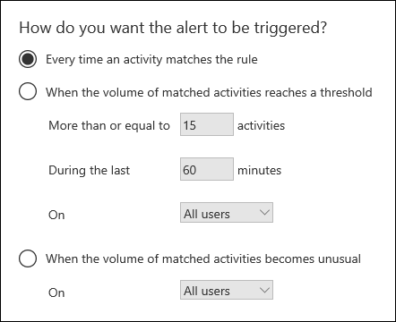

# <a name="alert-policies-in-the-security-and-compliance-center"></a>Warnungsrichtlinien im Security & Compliance Center

Sie können die Tools für Warnungsrichtlinien und Benachrichtigungsdashboards in den Microsoft 365-Sicherheits- und Compliancecentern verwenden, um Warnungsrichtlinien zu erstellen und dann die Warnungen anzuzeigen, die generiert werden, wenn Benutzer Aktivitäten ausführen, die den Bedingungen einer Warnungsrichtlinie entsprechen. Es gibt mehrere Standardbenachrichtigungsrichtlinien, mit deren Hilfe Sie Aktivitäten überwachen können, z. B. das Zuweisen von Administratorrechten in Exchange Online, Schadsoftwareangriffe, Phishingkampagnen und ungewöhnliche Ebenen von Dateilöschungen und externer Freigabe.

Mit Warnungsrichtlinien können Sie die von einer Richtlinie ausgelösten Warnungen kategorisieren, die Richtlinie auf alle Benutzer in Ihrer Organisation anwenden, einen Schwellenwert für den Auslösen einer Warnung festlegen und entscheiden, ob E-Mail-Benachrichtigungen empfangen werden sollen, wenn Warnungen ausgelöst werden. Es gibt auch  eine Seite Warnungen anzeigen im Security and Compliance Center, auf der Sie Warnungen anzeigen und filtern, einen Warnungsstatus festlegen können, um Warnungen zu verwalten, und dann Warnungen schließen, nachdem Sie den zugrunde liegenden Vorfall behoben oder behoben haben.

> [!NOTE]
> Warnungsrichtlinien sind für Organisationen mit einem Microsoft 365 Enterprise-, Office 365 Enterprise- oder Office 365 US Government E1/F1/G1, E3/F3/G3 oder E5/G5-Abonnement verfügbar. Erweiterte Funktionen sind nur für Organisationen mit einem E5/G5-Abonnement oder für Organisationen verfügbar, die über ein E1/F1/G1- oder E3/F3/G3-Abonnement und ein Microsoft Defender für Office 365 P2 oder Microsoft 365 E5 Compliance oder ein E5 eDiscovery- und Audit-Add-On-Abonnement verfügen. Die Funktionalität, die ein E5/G5- oder Add-On-Abonnement erfordert, wird in diesem Thema hervorgehoben. Beachten Sie außerdem, dass Warnungsrichtlinien in Office 365 GCC, GCC High und DoD US Government Environments verfügbar sind.

## <a name="how-alert-policies-work"></a>Funktionsweise von Warnungsrichtlinien

Hier finden Sie eine kurze Übersicht über die Funktionsweise von Warnungsrichtlinien und die Warnungen, die ausgelöst werden, wenn Benutzer- oder Administratoraktivitäten den Bedingungen einer Warnungsrichtlinie entspricht.


1. Ein Administrator in Ihrer Organisation erstellt, konfiguriert und aktiviert  eine Warnungsrichtlinie mithilfe der Seite Warnungsrichtlinien im Security and Compliance Center. Sie können auch Warnungsrichtlinien erstellen, indem Sie das [Cmdlet New-ProtectionAlert](/powershell/module/exchange/new-protectionalert) in Security & Compliance Center PowerShell verwenden.

   Zum Erstellen von Warnungsrichtlinien müssen Sie im Security and Compliance Center die Rolle Benachrichtigungen verwalten oder die Rolle Organisationskonfiguration zugewiesen werden.

   > [!NOTE]
   > Es dauert bis zu 24 Stunden nach dem Erstellen oder Aktualisieren einer Warnungsrichtlinie, bis Warnungen von der Richtlinie ausgelöst werden können. Dies liegt daran, dass die Richtlinie mit dem Warnungserkennungsmodul synchronisiert werden muss.

2. Ein Benutzer führt eine Aktivität aus, die den Bedingungen einer Warnungsrichtlinie entspricht. Bei Schadsoftwareangriffen lösen infizierte E-Mail-Nachrichten, die an Benutzer in Ihrer Organisation gesendet werden, eine Warnung aus.

3. Microsoft 365 generiert eine Warnung, die auf der  Seite Benachrichtigungen anzeigen im Security & Compliance Center angezeigt wird. Wenn E-Mail-Benachrichtigungen für die Warnungsrichtlinie aktiviert sind, sendet Microsoft außerdem eine Benachrichtigung an eine Liste von Empfängern. Die Warnungen, die ein Administrator oder andere Benutzer auf der Seite Benachrichtigungen anzeigen sehen können, werden durch die Rollen bestimmt, die dem Benutzer zugewiesen sind. Weitere Informationen finden Sie unter [RBAC-Berechtigungen, die zum Anzeigen von Warnungen erforderlich sind.](#rbac-permissions-required-to-view-alerts)

4. Ein Administrator verwaltet Warnungen im Security and Compliance Center. Die Verwaltung von Warnungen besteht darin, einen Warnungsstatus zuzuordnen, um jede Untersuchung nachverfolgt und zu verwalten.

## <a name="alert-policy-settings"></a>Warnungsrichtlinieneinstellungen

Eine Warnungsrichtlinie besteht aus einer Reihe von Regeln und Bedingungen, die die Benutzer- oder Administratoraktivität definieren, die eine Warnung generiert, eine Liste der Benutzer, die die Warnung auslösen, wenn sie die Aktivität ausführen, und einem Schwellenwert, der definiert, wie oft die Aktivität stattfinden muss, bevor eine Warnung ausgelöst wird. Außerdem kategorisieren Sie die Richtlinie und weisen ihr einen Schweregrad zu. Diese beiden Einstellungen helfen Ihnen bei der Verwaltung von Warnungsrichtlinien (und den Warnungen, die ausgelöst werden, wenn die Richtlinienbedingungen erfüllt werden), da Sie beim Verwalten von Richtlinien und Anzeigen von Warnungen im Security and Compliance Center nach diesen Einstellungen filtern können. Sie können beispielsweise Warnungen anzeigen, die den Bedingungen in derselben Kategorie entsprechen, oder Warnungen mit demselben Schweregrad anzeigen.

Um Warnungsrichtlinien anzuzeigen und zu erstellen, wechseln Sie [https://protection.office.com](https://protection.office.com) zu, und wählen Sie dann  \> **Warnungsbenachrichtigungsrichtlinien aus.**


Eine Warnungsrichtlinie besteht aus den folgenden Einstellungen und Bedingungen.

- Aktivität, die die Warnung **verfolgt–** Sie erstellen eine Richtlinie zum Nachverfolgen einer Aktivität oder in einigen Fällen einiger verwandter Aktivitäten, z. B. das Freigeben einer Datei für einen externen Benutzer, indem Sie sie freigeben, Zugriffsberechtigungen zuweisen oder einen anonymen Link erstellen. Wenn ein Benutzer die durch die Richtlinie definierte Aktivität ausführt, wird eine Warnung basierend auf den Einstellungen für den Warnungsschwellenwert ausgelöst.

    > [!NOTE]
    > Die Aktivitäten, die Sie nachverfolgen können, hängen vom Office 365 Enterprise oder Office 365 us Government Plan ab. Im Allgemeinen erfordern Aktivitäten im Zusammenhang mit Schadsoftwarekampagnen und Phishingangriffen ein E5/G5-Abonnement oder ein E1/F1/G1- oder E3/F3/G3-Abonnement mit [einem Defender for Office 365](../security/office-365-security/defender-for-office-365.md) Plan 2-Add-On-Abonnement.

- **Aktivitätsbedingungen** – Für die meisten Aktivitäten können Sie zusätzliche Bedingungen definieren, die erfüllt sein müssen, um eine Warnung auszulösen. Allgemeine Bedingungen sind IP-Adressen (sodass eine Warnung ausgelöst wird, wenn der Benutzer die Aktivität auf einem Computer mit einer bestimmten IP-Adresse oder innerhalb eines IP-Adressbereichs ausführt), ob eine Warnung ausgelöst wird, wenn ein bestimmter Benutzer oder Benutzer diese Aktivität ausführt, und ob die Aktivität für einen bestimmten Dateinamen oder eine bestimmte URL ausgeführt wird. Sie können auch eine Bedingung konfigurieren, die eine Warnung auslöst, wenn die Aktivität von einem beliebigen Benutzer in Ihrer Organisation ausgeführt wird. Die verfügbaren Bedingungen hängen von der ausgewählten Aktivität ab.

- **Wenn die Warnung ausgelöst wird:** Sie können eine Einstellung konfigurieren, die definiert, wie oft eine Aktivität auftreten kann, bevor eine Warnung ausgelöst wird. Auf diese Weise können Sie eine Richtlinie einrichten, um eine Warnung jedes Mal zu generieren, wenn eine Aktivität den Richtlinienbedingungen entspricht, wenn ein bestimmter Schwellenwert überschritten wird oder wenn das Auftreten der Aktivität, die die Warnung verfolgt, für Ihre Organisation ungewöhnlich wird.

    

    Wenn Sie die Einstellung basierend auf ungewöhnlichen Aktivitäten auswählen, legt Microsoft einen Basiswert fest, der die normale Häufigkeit für die ausgewählte Aktivität definiert. Es dauert bis zu sieben Tage, bis diese Basislinie erstellt wird, während der keine Warnungen generiert werden. Nachdem der Basisplan eingerichtet wurde, wird eine Warnung ausgelöst, wenn die Häufigkeit der aktivität, die von der Warnungsrichtlinie nachverfolgt wird, den Basiswert erheblich überschreitet. Für Überwachungsaktivitäten (z. B. Datei- und Ordneraktivitäten) können Sie einen Basisplan auf der Grundlage eines einzelnen Benutzers oder aller Benutzer in Ihrer Organisation einrichten. Für Schadsoftwareaktivitäten können Sie einen Basisplan basierend auf einer einzelnen Schadsoftwarefamilie, einem einzelnen Empfänger oder allen Nachrichten in Ihrer Organisation einrichten.

    > [!NOTE]
    > Die Möglichkeit, Warnungsrichtlinien basierend auf einem Schwellenwert oder auf einer ungewöhnlichen Aktivität zu konfigurieren, erfordert ein E5/G5-Abonnement oder ein E1/F1/G1- oder E3/F3/G3-Abonnement mit einem Microsoft Defender für Office 365 P2, Microsoft 365 E5 Compliance oder Microsoft 365 eDiscovery- und Audit-Add-On-Abonnement. Organisationen mit einem E1/F1/G1- und E3/F3/G3-Abonnement können nur Warnungsrichtlinien erstellen, bei denen bei jedem Auftreten einer Aktivität eine Warnung ausgelöst wird.

- **Warnungskategorie** : Um die Nachverfolgung und Verwaltung der von einer Richtlinie generierten Warnungen zu unterstützen, können Sie einer Richtlinie eine der folgenden Kategorien zuweisen.

  - Verhinderung von Datenverlust

  - Informationsverwaltung

  - Nachrichtenübermittlung

  - Berechtigungen

  - Bedrohungsverwaltung

  - Sonstige

  Wenn eine Aktivität auftritt, die den Bedingungen der Warnungsrichtlinie entspricht, wird die generierte Warnung mit der in dieser Einstellung definierten Kategorie markiert. Auf diese Weise können Sie Warnungen nachverfolgen und  verwalten, die auf der Seite Warnungen anzeigen im Security and Compliance Center dieselbe Kategorieeinstellung haben, da Sie Warnungen nach Kategorie sortieren und filtern können.

- **Warnungsschweregrad** – Ähnlich wie bei der Warnungskategorie weisen Sie Benachrichtigungsrichtlinien ein Schweregradattribut (**Niedrig,** **Mittel,** Hoch **oder** **Information)** zu. Wenn wie bei der Warnungskategorie eine Aktivität auftritt, die den Bedingungen der Warnungsrichtlinie entspricht, wird die generierte Warnung mit demselben Schweregrad markiert, der für die Warnungsrichtlinie festgelegt ist. Auch hier können Sie Warnungen mit der gleichen Schweregradeinstellung auf der Seite Warnungen anzeigen nachverfolgen **und** verwalten. Beispielsweise können Sie die Liste der Warnungen so  filtern, dass nur Warnungen mit einem hohen Schweregrad angezeigt werden.

    > [!TIP]
    > Wenn Sie eine Warnungsrichtlinie einrichten, sollten Sie Aktivitäten, die schwerwiegende negative Folgen haben können, einen höheren Schweregrad zuweisen, z. B. das Erkennen von Schadsoftware nach der Übermittlung an Benutzer, das Anzeigen vertraulicher oder klassifizierter Daten, das Freigeben von Daten für externe Benutzer oder andere Aktivitäten, die zu Datenverlust oder Sicherheitsbedrohungen führen können. Dies kann Ihnen helfen, Warnungen und die Aktionen zu priorisieren, die Sie zum Untersuchen und Beheben der zugrunde liegenden Ursachen ergreifen.

-  E-Mail-Benachrichtigungen : Sie können die Richtlinie so einrichten, dass E-Mail-Benachrichtigungen an eine Liste von Benutzern gesendet (oder nicht gesendet) werden, wenn eine Warnung ausgelöst wird. Sie können auch einen täglichen Benachrichtigungsgrenzwert festlegen, sodass nach Erreichen der maximalen Anzahl von Benachrichtigungen an diesem Tag keine weiteren Benachrichtigungen für die Warnung gesendet werden. Zusätzlich zu E-Mail-Benachrichtigungen können Sie oder andere Administratoren die Warnungen anzeigen, die von einer Richtlinie auf der Seite Benachrichtigungen **anzeigen ausgelöst** werden. Erwägen Sie, E-Mail-Benachrichtigungen für Warnungsrichtlinien einer bestimmten Kategorie oder mit einer Einstellung mit höherem Schweregrad zu aktivieren.

## <a name="default-alert-policies"></a>Standardbenachrichtigungsrichtlinien

Microsoft bietet integrierte Warnungsrichtlinien, mit denen Exchange Missbrauch von Administratorberechtigungen, Schadsoftwareaktivitäten, potenziellen externen und internen Bedrohungen sowie Risiken der Informationsverwaltung identifiziert werden können. Auf der **Seite Warnungsrichtlinien** sind die Namen dieser integrierten Richtlinien fett formatiert, und der Richtlinientyp wird als **System definiert.** Diese Richtlinien sind standardmäßig aktiviert. Sie können diese Richtlinien deaktivieren (oder erneut aktivieren), eine Liste von Empfängern einrichten, an die E-Mail-Benachrichtigungen gesendet werden sollen, und ein tägliches Benachrichtigungslimit festlegen. Die anderen Einstellungen für diese Richtlinien können nicht bearbeitet werden.

In der folgenden Tabelle sind die verfügbaren Standardbenachrichtigungsrichtlinien und die Kategorie aufgeführt, der jede Richtlinie zugewiesen ist. Die Kategorie wird verwendet, um zu bestimmen, welche Warnungen ein Benutzer auf der Seite Benachrichtigungen anzeigen kann. Weitere Informationen finden Sie unter [RBAC-Berechtigungen, die zum Anzeigen von Warnungen erforderlich sind.](#rbac-permissions-required-to-view-alerts)

In der Tabelle sind auch die Office 365 Enterprise und Office 365 us Government Plan aufgeführt, die für jeden einzelnen Plan erforderlich sind. Einige Standardbenachrichtigungsrichtlinien sind verfügbar, wenn Ihre Organisation über das entsprechende Add-On-Abonnement zusätzlich zu einem E1/F1/G1- oder E3/F3/G3-Abonnement verfügt.

| Standardwarnungsrichtlinie | Beschreibung | Kategorie | Enterprise Abonnement |
|:-----|:-----|:-----|:-----|
|**Ein potenziell schädlicher URL-Klick wurde erkannt.**|Generiert eine Warnung, wenn ein durch sichere Links [in](../security/office-365-security/safe-links.md) Ihrer Organisation geschützter Benutzer auf einen schädlichen Link klickt. Dieses Ereignis wird ausgelöst, wenn Änderungen am URL-Urteil von Microsoft Defender für Office 365 identifiziert werden oder Wenn Benutzer die Seiten für sichere Links außer Kraft setzen (basierend auf der Microsoft 365 for Business Safe Links-Richtlinie Ihrer Organisation). Diese Warnungsrichtlinie hat eine **Einstellung mit** hohem Schweregrad. Für Defender Office 365 P2-, E5-, G5-Kunden löst diese Warnung automatisch automatisierte Untersuchungen und [Reaktionen in](../security/office-365-security/office-365-air.md)Office 365. Weitere Informationen zu Ereignissen, die diese Warnung auslösen, finden Sie unter [Set up Safe Links policies](../security/office-365-security/set-up-safe-links-policies.md).|Bedrohungsverwaltung|E5/G5 oder Defender für Office 365 P2-Add-On-Abonnement|
|**Ergebnis Administrator-Übermittlung abgeschlossen**|Generiert eine Warnung, wenn eine [Admin-Übermittlung](../security/office-365-security/admin-submission.md) den Erneutscan der übermittelten Entität abgeschlossen hat. Eine Warnung wird jedes Mal ausgelöst, wenn ein erneutes Scanergebnis aus einer Admin-Übermittlung gerendert wird. Diese Warnungen sollen Sie daran erinnern, die Ergebnisse früherer Übermittlungen zu [überprüfen,](https://protection.office.com/reportsubmission)vom Benutzer gemeldete Nachrichten zu übermitteln, um die neueste Richtlinienüberprüfung zu erhalten und Die Ergebnisse erneut zu überprüfen, und Ihnen dabei helfen zu ermitteln, ob die Filterrichtlinien in Ihrer Organisation die beabsichtigten Auswirkungen haben. Diese Richtlinie hat eine **Einstellung mit** niedrigem Schweregrad.|Bedrohungsverwaltung|E1/F1, E3/F3 oder E5|
|**Administrator hat manuelle Untersuchung von E-Mails ausgelöst**|Generiert eine Warnung, wenn ein Administrator die manuelle Untersuchung einer E-Mail aus dem Bedrohungs-Explorer auslöst. Weitere Informationen finden Sie unter [Beispiel: Ein Sicherheitsadministrator löst eine Untersuchung aus dem Bedrohungs-Explorer aus] ( https://docs.microsoft.com/microsoft-365/security/office-365-security/automated-investigation-response-office#example-a-security-administrator-triggers-an-investigation-from-threat-explorer) . Diese Warnung benachrichtigt Ihre Organisation, dass die Untersuchung gestartet wurde. Die Warnung enthält Informationen dazu, wer sie ausgelöst hat, und enthält einen Link zur Untersuchung. Diese Richtlinie hat eine Einstellung für den Informationsschweregrad. |Bedrohungsverwaltung| E5/G5 oder Microsoft Defender für Office 365 P2-Add-On-Abonnement| 
|**Erstellung einer Weiterleitungs-/Umleitungsregel**|Generiert eine Warnung, wenn eine Person in Ihrer Organisation eine Posteingangsregel für ihr Postfach erstellt, die Nachrichten an ein anderes E-Mail-Konto weiterleite oder umleite. Diese Richtlinie verfolgt nur Posteingangsregeln, die mithilfe von Outlook im Web (früher als Outlook Web App bezeichnet) oder Exchange Online PowerShell erstellt werden. Diese Richtlinie hat eine **Einstellung mit** niedrigem Schweregrad. Weitere Informationen zur Verwendung von Posteingangsregeln zum Weiterleiten und Umleiten von E-Mails in Outlook im Web finden Sie unter Verwenden von Regeln in Outlook im Web, um Nachrichten automatisch an ein anderes Konto [weiterzuleiten.](https://support.office.com/article/1433e3a0-7fb0-4999-b536-50e05cb67fed)|Bedrohungsverwaltung|E1/F1/G1, E3/F3/G3 oder E5/G5|
|**eDiscovery-Suche gestartet oder exportiert**|Generiert eine Warnung, wenn jemand das Inhaltssuchtool im Security and Compliance Center verwendet. Eine Warnung wird ausgelöst, wenn die folgenden Inhaltssuchaktivitäten ausgeführt werden: <br/><br/>* Eine Inhaltssuche wird gestartet<br/>* Die Ergebnisse einer Inhaltssuche werden exportiert.<br/>* Ein Inhaltssuchbericht wird exportiert<br/><br/>Warnungen werden auch ausgelöst, wenn die vorherigen Inhaltssuchaktivitäten in Verbindung mit einem eDiscovery-Fall ausgeführt werden. Diese Richtlinie hat eine **Einstellung für den mittleren** Schweregrad. Weitere Informationen zu Inhaltssuchaktivitäten finden Sie unter [Suchen nach eDiscovery-Aktivitäten im Überwachungsprotokoll](search-for-ediscovery-activities-in-the-audit-log.md#ediscovery-activities).|Bedrohungsverwaltung|E1/F1/G1, E3/F3/G3 oder E5/G5|
|**Erhöhung der Exchange Administratorrechte**|Generiert eine Warnung, wenn einer Person administrative Berechtigungen in Ihrer Organisation Exchange Online werden. Wenn beispielsweise ein Benutzer der Rollengruppe Organisationsverwaltung in der Exchange Online. Diese Richtlinie hat eine **Einstellung mit** niedrigem Schweregrad.|Berechtigungen|E1/F1/G1, E3/F3/G3 oder E5/G5|
|**E-Mail-Nachrichten mit Schadsoftware wurden nach der Zustellung entfernt**|Generiert eine Warnung, wenn Nachrichten, die Schadsoftware enthalten, an Postfächer in Ihrer Organisation zugestellt werden. Wenn dieses Ereignis auftritt, entfernt Microsoft die infizierten Nachrichten aus Exchange Online Postfächern mithilfe der automatischen [Null-Stunden-Bereinigung](../security/office-365-security/zero-hour-auto-purge.md). Diese Richtlinie hat eine **Einstellung für den** Informationsschweregrad und löst automatisch eine automatisierte Untersuchung und Reaktion in [Office 365.](../security/office-365-security/office-365-air.md)|Bedrohungsverwaltung|E5/G5 oder Microsoft Defender für Office 365 P2-Add-On-Abonnement|
|**E-Mail-Nachrichten mit Phishing-URLs wurden nach der Zustellung entfernt**|Generiert eine Warnung, wenn Nachrichten, die Phish enthalten, an Postfächer in Ihrer Organisation zugestellt werden. Wenn dieses Ereignis auftritt, entfernt Microsoft die infizierten Nachrichten aus Exchange Online Postfächern mithilfe der automatischen [Null-Stunden-Bereinigung](../security/office-365-security/zero-hour-auto-purge.md). Diese Richtlinie hat eine **Einstellung für den** Informationsschweregrad und löst automatisch eine automatisierte Untersuchung und Reaktion in [Office 365.](../security/office-365-security/office-365-air.md)|Bedrohungsverwaltung|E5/G5 oder Defender für Office 365 P2-Add-On-Abonnement|
|**Vom Benutzer als Schadsoftware oder Phishing-Mail gemeldete E-Mails**|Generiert eine Warnung, wenn Benutzer in Ihrer Organisation Nachrichten mithilfe des Berichtsnachrichten-Add-Ins als Phishing-E-Mail melden. Diese Richtlinie hat eine Einstellung für den Informationsschweregrad.  Weitere Informationen zu diesem Add-In finden Sie unter [Use the Report Message add-in](https://support.office.com/article/b5caa9f1-cdf3-4443-af8c-ff724ea719d2). Für Defender Office 365 P2-, E5-, G5-Kunden löst diese Warnung automatisch automatisierte Untersuchungen und [Reaktionen in](../security/office-365-security/office-365-air.md)Office 365.|Bedrohungsverwaltung|E1/F1/G1, E3/F3/G3 oder E5/G5|
|**Grenzwert für das Senden von E-Mails überschritten**|Generiert eine Warnung, wenn eine Person in Ihrer Organisation mehr E-Mails gesendet hat, als in der Richtlinie für ausgehende Spamnachrichten zulässig ist. Dies ist in der Regel ein Hinweis darauf, dass der Benutzer zu viele E-Mails sendet oder das Konto möglicherweise gefährdet ist. Diese Richtlinie hat eine **Einstellung für den mittleren** Schweregrad. Wenn Sie eine Warnung erhalten, die von dieser Warnungsrichtlinie generiert wird, sollten Sie überprüfen, ob das [Benutzerkonto gefährdet ist.](../security/office-365-security/responding-to-a-compromised-email-account.md)|Bedrohungsverwaltung|E1/F1/G1, E3/F3/G3 oder E5/G5|
|**Formular aufgrund eines potenziellen Phishingversuchs blockiert**|Generiert eine Warnung, wenn jemand in Ihrer Organisation aufgrund des erkannten wiederholten Phishingversuchsverhaltens die Freigabe von Formularen und das Sammeln von Antworten mithilfe von Microsoft Forms eingeschränkt hat. Diese Richtlinie hat eine **Einstellung mit hohem Schweregrad.**|Bedrohungsverwaltung|E1, E3/F3 oder E5|
|**Formular als Phishing gekennzeichnet und bestätigt**|Generiert eine Warnung, wenn ein in Microsoft Forms erstelltes Formular in Ihrer Organisation als potenzielles Phishing durch Missbrauch von Berichten identifiziert und von Microsoft als Phishing bestätigt wurde. Diese Richtlinie hat eine **Einstellung mit** hohem Schweregrad.|Bedrohungsverwaltung|E1, E3/F3 oder E5|
|**Nachrichten wurden verzögert**|Generiert eine Warnung, wenn Microsoft keine E-Mail-Nachrichten über einen Connector an Ihre lokale Organisation oder einen Partnerserver senden kann. In diesem Fall wird die Nachricht in der Warteschlange Office 365. Diese Warnung wird ausgelöst, wenn mehr als 2.000 Nachrichten in die Warteschlange eingereiht wurden. Diese Richtlinie hat eine **Einstellung mit** hohem Schweregrad.|Nachrichtenübermittlung|E1/F1/G1, E3/F3/G3 oder E5/G5|
|**Schadsoftwarekampagne nach Zustellung erkannt**|Generiert eine Warnung, wenn eine ungewöhnlich große Anzahl von Nachrichten mit Schadsoftware an Postfächer in Ihrer Organisation zugestellt wird. Wenn dieses Ereignis auftritt, entfernt Microsoft die infizierten Nachrichten aus Exchange Online Postfächern. Diese Richtlinie hat eine **Einstellung mit** hohem Schweregrad.|Bedrohungsverwaltung|E5/G5 oder Microsoft Defender für Office 365 P2-Add-On-Abonnement|
|**Schadsoftwarekampagne erkannt und blockiert**|Generiert eine Warnung, wenn jemand versucht hat, eine ungewöhnlich große Anzahl von E-Mail-Nachrichten mit einer bestimmten Art von Schadsoftware an Benutzer in Ihrer Organisation zu senden. Wenn dieses Ereignis auftritt, werden die infizierten Nachrichten von Microsoft blockiert und nicht an Postfächer zugestellt. Diese Richtlinie hat eine **Einstellung mit** niedrigem Schweregrad.|Bedrohungsverwaltung|E5/G5 oder Defender für Office 365 P2-Add-On-Abonnement|
|**Schadsoftwarekampagne in SharePoint und OneDrive**|Generiert eine Warnung, wenn ein ungewöhnlich hohes Volumen an Schadsoftware oder Viren in Dateien in SharePoint websites oder OneDrive in Ihrer Organisation erkannt wird. Diese Richtlinie hat eine **Einstellung mit** hohem Schweregrad.|Bedrohungsverwaltung|E5/G5 oder Defender für Office 365 P2-Add-On-Abonnement|
|**Schadsoftware wird nicht gezappt, da ZAP deaktiviert ist**| Generiert eine Warnung, wenn Microsoft die Zustellung einer Schadsoftwarenachricht an ein Postfach erkennt, da Zero-Hour automatisches Löschen für Phish-Nachrichten deaktiviert ist. Diese Richtlinie hat eine Einstellung für den Informationsschweregrad.  |Bedrohungsverwaltung|E5/G5 oder Defender für Office 365 P2-Add-On-Abonnement|
|**Phish zugestellt, da der Junk-E-Mail-Ordner eines Benutzers deaktiviert ist**|Generiert eine Warnung, wenn Microsoft erkennt, dass der Junk-E-Mail-Ordner eines Benutzers deaktiviert ist, sodass eine Phishingnachricht mit hoher Vertrauensstellung an ein Postfach gesendet werden kann. Diese Richtlinie hat eine Einstellung für den Informationsschweregrad. |Bedrohungsverwaltung|E5/G5 oder Defender für Office 365 P1- oder P2-Add-On-Abonnement|
|**Phish aufgrund einer ETR-Außerkraftsetzung zugestellt**|Generiert eine Warnung, wenn Microsoft eine Exchange Transport Rule (ETR) erkennt, die die Zustellung einer Phishingnachricht mit hoher Vertrauensstellung an ein Postfach ermöglicht. Diese Richtlinie hat eine Einstellung für den Informationsschweregrad.  Weitere Informationen zu Exchange Transportregeln (Nachrichtenflussregeln) finden Sie unter [Nachrichtenflussregeln (Transportregeln) in Exchange Online](/exchange/security-and-compliance/mail-flow-rules/mail-flow-rules).|Bedrohungsverwaltung|E5/G5 oder Defender für Office 365 P1- oder P2-Add-On-Abonnement|
|**Phish, der aufgrund einer Ip-Allow-Richtlinie zugestellt wurde**|Generiert eine Warnung, wenn Microsoft eine RICHTLINIE für zugelassene IP-Adressen erkennt, die die Zustellung einer Phishingnachricht mit hoher Vertrauensstellung an ein Postfach ermöglicht. Diese Richtlinie hat eine Einstellung für den Informationsschweregrad.  Weitere Informationen zur Ip-Allow-Richtlinie (Verbindungsfilterung) finden Sie unter [Configure the default connection filter policy - Office 365](../security/office-365-security/configure-the-connection-filter-policy.md).|Bedrohungsverwaltung|E5/G5 oder Defender für Office 365 P1- oder P2-Add-On-Abonnement|
|**Phish nicht zappt, da ZAP deaktiviert ist**| Generiert eine Warnung, wenn Microsoft die Zustellung einer Phishingnachricht mit hoher Vertrauensstellung an ein Postfach erkennt, da Zero-Hour automatisches Löschen für Phish-Nachrichten deaktiviert ist. Diese Richtlinie hat eine Einstellung für den Informationsschweregrad. |Bedrohungsverwaltung|E5/G5 oder Defender für Office 365 P2-Add-On-Abonnement|
|**Phish, der aufgrund von Mandanten- oder Benutzerüberschreibung**<sup>1</sup> zugestellt wurde|Generiert eine Warnung, wenn Microsoft erkennt, dass ein Administrator oder benutzerüberschreiben die Zustellung einer Phishingnachricht an ein Postfach zugelassen hat. Beispiele für Außerkraftsetzungen sind ein Posteingang oder eine Nachrichtenflussregel, die Nachrichten von einem bestimmten Absender oder einer bestimmten Domäne zulässt, oder eine Antispamrichtlinie, die Nachrichten von bestimmten Absendern oder Domänen zulässt. Diese Richtlinie hat eine **Einstellung mit** hohem Schweregrad.|Bedrohungsverwaltung|E5/G5 oder Defender für Office 365 P2-Add-On-Abonnement|
|**Verdächtige E-Mail-Weiterleitunsaktivitäten**|Generiert eine Warnung, wenn eine Person in Ihrer Organisation automatisch E-Mails an ein verdächtiges externes Konto gesendet hat. Dies ist eine frühzeitige Warnung für das Verhalten, das darauf hinweist, dass das Konto gefährdet ist, aber nicht streng genug, um den Benutzer einzuschränken. Diese Richtlinie hat eine **Einstellung für den mittleren** Schweregrad. Obwohl es selten ist, kann eine von dieser Richtlinie generierte Warnung eine Anomalie sein. Es ist eine gute Idee, [zu überprüfen, ob das Benutzerkonto gefährdet ist.](../security/office-365-security/responding-to-a-compromised-email-account.md)|Bedrohungsverwaltung|E1/F1/G1, E3/F3/G3 oder E5/G5|
|**Verdächtige E-Mail-Sendemuster erkannt**|Generiert eine Warnung, wenn jemand in Ihrer Organisation verdächtige E-Mails gesendet hat und das Risiko besteht, dass das Senden von E-Mails eingeschränkt wird. Dies ist eine frühe Warnung für verhalten, die darauf hinweisen kann, dass das Konto gefährdet ist, aber nicht streng genug, um den Benutzer einzuschränken. Diese Richtlinie hat eine **Einstellung für den mittleren** Schweregrad. Obwohl es selten ist, kann eine von dieser Richtlinie generierte Warnung eine Anomalie sein. Es ist jedoch eine gute Idee, zu überprüfen, ob [das Benutzerkonto gefährdet ist.](../security/office-365-security/responding-to-a-compromised-email-account.md)|Bedrohungsverwaltung|E1/F1/G1, E3/F3/G3 oder E5/G5  |
|**Mandant vom Senden von E-Mails eingeschränkt**|Generiert eine Warnung, wenn der großteil des E-Mail-Datenverkehrs aus Ihrer Organisation als verdächtig erkannt wurde und Microsoft Ihre Organisation am Senden von E-Mails beschränkt hat. Untersuchen Sie potenziell gefährdete Benutzer- und Administratorkonten, neue Connectors oder offene Relays, und wenden Sie sich dann an den Microsoft-Support, um die Sperrung Ihrer Organisation zu aufheben. Diese Richtlinie hat eine **Einstellung mit** hohem Schweregrad. Weitere Informationen dazu, warum Organisationen blockiert werden, finden Sie unter Beheben von Problemen mit der E-Mail-Zustellung für [Fehlercode 5.7.7xx in Exchange Online](/Exchange/mail-flow-best-practices/non-delivery-reports-in-exchange-online/fix-error-code-5-7-700-through-5-7-750).|Bedrohungsverwaltung|E1/F1/G1, E3/F3/G3 oder E5/G5|
|**Ungewöhnliche Externe Benutzerdateiaktivität**|Generiert eine Warnung, wenn eine ungewöhnlich große Anzahl von Aktivitäten für Dateien in SharePoint oder OneDrive von Benutzern außerhalb Ihrer Organisation ausgeführt wird. Dies umfasst Aktivitäten wie den Zugriff auf Dateien, das Herunterladen von Dateien und das Löschen von Dateien. Diese Richtlinie hat eine **Einstellung mit** hohem Schweregrad.|Informationsverwaltung|E5/G5, Microsoft Defender für Office 365 P2 oder Microsoft 365 E5 Add-On-Abonnement|
|**Ungewöhnliches Volumen der externen Dateifreigabe**|Generiert eine Warnung, wenn eine ungewöhnlich große Anzahl von Dateien in SharePoint oder OneDrive für Benutzer außerhalb Ihrer Organisation freigegeben werden. Diese Richtlinie hat eine **Einstellung für den mittleren** Schweregrad.|Informationsverwaltung|E5/G5, Defender für Office 365 P2 oder Microsoft 365 E5 Add-On-Abonnement|
|**Ungewöhnliches Volumen des Löschens von Dateien**|Generiert eine Warnung, wenn eine ungewöhnlich große Anzahl von Dateien in einem SharePoint oder OneDrive innerhalb eines kurzen Zeitrahmens gelöscht wird. Diese Richtlinie hat eine **Einstellung für den mittleren** Schweregrad.|Informationsverwaltung|E5/G5, Defender für Office 365 P2 oder Microsoft 365 E5 Add-On-Abonnement|
|**Ungewöhnliche Zunahme von E-Mails, die als Phishing-Mails gemeldet wurden**|Generiert eine Warnung, wenn die Anzahl der Personen in Ihrer Organisation mit dem Add-In Nachricht melden in Outlook nachrichten als Phishing-E-Mail gemeldet wird. Diese Richtlinie hat eine **Einstellung mit** hohem Schweregrad. Weitere Informationen zu diesem Add-In finden Sie unter [Use the Report Message add-in](https://support.office.com/article/b5caa9f1-cdf3-4443-af8c-ff724ea719d2).|Bedrohungsverwaltung|E5/G5 oder Defender für Office 365 P2-Add-On-Abonnement|
|**An Posteingang/Ordner**<sup>1, 2</sup><sup></sup> übermittelter Identitätswechsel|Generiert eine Warnung, wenn Microsoft erkennt, dass ein Administrator oder eine Benutzerüberschreibung die Zustellung einer Phishingnachricht für den Identitätswechsel an den Posteingang (oder einen anderen Ordner, auf den der Benutzer zugreifen kann) eines Postfachs zugelassen hat. Beispiele für Außerkraftsetzungen sind ein Posteingang oder eine Nachrichtenflussregel, die Nachrichten von einem bestimmten Absender oder einer bestimmten Domäne zulässt, oder eine Antispamrichtlinie, die Nachrichten von bestimmten Absendern oder Domänen zulässt. Diese Richtlinie hat eine **Einstellung für den mittleren** Schweregrad.|Bedrohungsverwaltung|E5/G5 oder Defender für Office 365 P2-Add-On-Abonnement|
|**Benutzer, der vom Senden von E-Mails eingeschränkt ist**|Generiert eine Warnung, wenn jemand in Ihrer Organisation am Senden ausgehender E-Mails eingeschränkt ist. Dies führt in der Regel dazu, dass ein  Konto gefährdet ist und der Benutzer auf der Seite Eingeschränkte Benutzer im Security & Compliance Center aufgeführt wird. (Wenn Sie auf diese Seite zugreifen möchten, wechseln Sie zu **Bedrohungsverwaltung > Überprüfen > eingeschränkter Benutzer**). Diese Richtlinie hat eine **Einstellung mit** hohem Schweregrad. Weitere Informationen zu eingeschränkten Benutzern finden Sie unter Entfernen eines Benutzers, einer Domäne oder einer IP-Adresse aus einer Sperrliste nach dem Senden [von Spam-E-Mails.](/office365/securitycompliance/removing-user-from-restricted-users-portal-after-spam)|Bedrohungsverwaltung|E1/F1/G1, E3/F3/G3 oder E5/G5|
|**Benutzer, der auf die Freigabe von Formularen und das Sammeln von Antworten beschränkt ist**|Generiert eine Warnung, wenn jemand in Ihrer Organisation aufgrund des erkannten wiederholten Phishingversuchsverhaltens die Freigabe von Formularen und das Sammeln von Antworten mithilfe von Microsoft Forms eingeschränkt hat. Diese Richtlinie hat eine **Einstellung mit** hohem Schweregrad.|Bedrohungsverwaltung|E1, E3/F3 oder E5|
|||||

> [!NOTE]
> <sup>1</sup> Wir haben diese Standardwarnungsrichtlinie basierend auf Kundenfeedback vorübergehend entfernt. Wir arbeiten daran, sie zu verbessern und werden sie in naher Zukunft durch eine neue Version ersetzen. Bis dahin können Sie eine benutzerdefinierte Warnungsrichtlinie erstellen, um diese Funktionalität mithilfe der folgenden Einstellungen zu ersetzen:<br/>&nbsp; * Activity is Phish email detected at time of delivery<br/>&nbsp; * E-Mail ist nicht ZAP'd<br/>&nbsp; * E-Mail-Richtung ist eingehenden Nachrichten<br/>&nbsp; * Der Status der E-Mail-Zustellung ist zugestellt.<br/>&nbsp; * Erkennungstechnologie ist bösartige URL-Aufbewahrung, URL-Detonation, Erweiterter Phishingfilter, Allgemeiner Phishingfilter, Domänenwechsel, Benutzerwechsel und Markenwechsel<br/><br/>&nbsp;&nbsp;&nbsp;Weitere Informationen zu Antiphishing in Office 365 finden Sie unter [Einrichten von Antiphishing- und Antiphishingrichtlinien](../security/office-365-security/set-up-anti-phishing-policies.md).<br/><br/><sup>2 Um</sup> diese Warnungsrichtlinie neu zu erstellen, folgen Sie den Anweisungen in der vorherigen Fußnote, wählen Sie jedoch Benutzerwechsel als einzige Erkennungstechnologie aus.

Die ungewöhnliche Aktivität, die von einigen der integrierten Richtlinien überwacht wird, basiert auf demselben Prozess wie die zuvor beschriebene Warnungsschwelleneinstellung. Microsoft richtet einen Basiswert ein, der die normale Häufigkeit für "übliche" Aktivitäten definiert. Warnungen werden dann ausgelöst, wenn die Häufigkeit von Aktivitäten, die von der integrierten Warnungsrichtlinie nachverfolgt werden, den Basiswert erheblich überschreitet.

## <a name="viewing-alerts"></a>Anzeigen von Warnungen

Wenn eine von Benutzern in Ihrer Organisation ausgeführte Aktivität den Einstellungen einer Warnungsrichtlinie entspricht, wird eine Warnung generiert und auf der Seite Benachrichtigungen anzeigen im Security and Compliance Center angezeigt.  Je nach den Einstellungen einer Warnungsrichtlinie wird auch eine E-Mail-Benachrichtigung an eine Liste der angegebenen Benutzer gesendet, wenn eine Warnung ausgelöst wird. Für jede Warnung zeigt  das Dashboard auf der Seite Warnungen anzeigen den Namen der entsprechenden Warnungsrichtlinie, den Schweregrad und die Kategorie für die Warnung (definiert in der Warnungsrichtlinie) und die Häufigkeit an, mit der eine Aktivität aufgetreten ist, die zur Benachrichtigung geführt hat. Dieser Wert basiert auf der Schwellenwerteinstellung der Warnungsrichtlinie. Das Dashboard zeigt außerdem den Status für jede Warnung an. Weitere Informationen zur Verwendung der status-Eigenschaft zum Verwalten von Warnungen finden Sie unter [Managing alerts](#managing-alerts).

Um Warnungen anzuzeigen, wechseln Sie [https://protection.office.com](https://protection.office.com) zu, und wählen Sie dann Warnungen  \> **anzeigen Warnungen aus.**


Sie können die folgenden Filter verwenden, um eine Teilmenge aller Warnungen auf der Seite Warnungen **anzeigen anzuzeigen.**

- **Status.** Verwenden Sie diesen Filter, um Warnungen anzuzeigen, denen ein bestimmter Status zugewiesen ist. Der Standardstatus ist **Active**. Sie oder andere Administratoren können den Statuswert ändern.

- **Richtlinie.** Verwenden Sie diesen Filter, um Warnungen anzuzeigen, die der Einstellung einer oder mehreren Warnungsrichtlinien entsprechen. Sie können auch alle Warnungen für alle Warnungsrichtlinien anzeigen.

- **Zeitbereich.** Verwenden Sie diesen Filter, um Warnungen anzuzeigen, die innerhalb eines bestimmten Datums- und Zeitbereichs generiert wurden.

- **Schweregrad.** Verwenden Sie diesen Filter, um Warnungen anzuzeigen, denen ein bestimmter Schweregrad zugewiesen ist.

- **Kategorie.** Verwenden Sie diesen Filter, um Warnungen aus einer oder mehreren Warnungskategorien anzuzeigen.

- **Tags.** Verwenden Sie diesen Filter, um Warnungen von einem oder mehreren Benutzertags anzuzeigen. Tags werden basierend auf markierten Postfächern oder Benutzern angezeigt, die in den Warnungen angezeigt werden. Weitere Informationen finden Sie unter Benutzertags [in Office 356 ATP.](../security/office-365-security/user-tags.md)

- **Quelle.** Verwenden Sie diesen Filter, um Warnungen anzuzeigen, die durch Warnungsrichtlinien im Security and Compliance Center ausgelöst wurden, oder Warnungen, die durch Office 365 Cloud App Security oder beides ausgelöst wurden. Weitere Informationen zu Office 365 Cloud App Security Warnungen finden Sie unter [Anzeigen Cloud App Security Warnungen](#viewing-cloud-app-security-alerts).

> [!IMPORTANT]
> Das Filtern und Sortieren nach Benutzertags befindet sich derzeit in der öffentlichen Vorschau.
> Es kann erheblich geändert werden, bevor es kommerziell veröffentlicht wird. Microsoft gibt keine ausdrücklichen oder impliziten Garantien in Bezug auf die informationen, die darüber bereitgestellt werden.

## <a name="alert-aggregation"></a>Benachrichtigungsaggregation

Wenn mehrere Ereignisse, die den Bedingungen einer Warnungsrichtlinie entsprechen, mit einem kurzen Zeitraum auftreten, werden sie einer vorhandenen Warnung durch einen Prozess namens *Warnungsaggregation hinzugefügt.* Wenn ein Ereignis eine Warnung auslöst, wird die  Warnung generiert und auf der Seite Warnungen anzeigen angezeigt, und eine Benachrichtigung wird gesendet. Wenn das gleiche Ereignis innerhalb des Aggregationsintervalls auftritt, fügt Microsoft 365 der vorhandenen Warnung Details zum neuen Ereignis hinzu, anstatt eine neue Warnung auszulösen. Das Ziel der Warnungsaggregation ist es, die Warnung "Ermüdung" zu reduzieren und Sie auf weniger Warnungen für dasselbe Ereignis konzentrieren und Maßnahmen ergreifen zu können.

Die Länge des Aggregationsintervalls hängt von Ihrer Office 365 oder Microsoft 365 ab.

|Abonnement|Aggregationsintervall|
|:---------|:---------:|
|Office 365 oder Microsoft 365 E5/G5|1 Minute|
|Microsoft Defender für Office 365 Plan 2 |1 Minute|
|E5 Compliance-Add-On oder E5 Discovery- und Audit-Add-On|1 Minute|
|Office 365 oder Microsoft 365 E1/F1/G1 oder E3/F3/G3|15 Minuten|
|Defender für Office 365 Plan 1 oder Exchange Online Protection|15 Minuten|
|||

Wenn Ereignisse, die derselben Warnungsrichtlinie entsprechen, innerhalb des Aggregationsintervalls auftreten, werden Details zum nachfolgenden Ereignis der ursprünglichen Warnung hinzugefügt. Für alle Ereignisse werden Informationen zu aggregierten Ereignissen im Detailfeld angezeigt, und die Anzahl der Ereignisse, die mit dem Aggregationsintervall aufgetreten sind, wird im Feld Aktivität/Trefferanzahl angezeigt. Sie können weitere Informationen zu allen aggregierten Ereignisinstanzen anzeigen, indem Sie die Aktivitätsliste anzeigen.

Der folgende Screenshot zeigt eine Warnung mit vier aggregierten Ereignissen. Die Aktivitätsliste enthält Informationen zu den vier E-Mail-Nachrichten, die für die Warnung relevant sind.


Beachten Sie die folgenden Punkte bei der Warnungsaggregation:

- Warnungen, die durch den Klick auf eine potenziell schädliche URL ausgelöst **wurden, wurden erkannt, dass** [die Standardwarnungsrichtlinie](#default-alert-policies) nicht aggregiert wurde. Dies liegt daran, dass von dieser Richtlinie ausgelöste Warnungen für jeden Benutzer und jede E-Mail-Nachricht eindeutig sind.

- Zu diesem Zeitpunkt gibt die **Warnungseigenschaft Trefferanzahl** nicht die Anzahl der aggregierten Ereignisse für alle Warnungsrichtlinien an. Bei Warnungen, die durch diese Warnungsrichtlinien ausgelöst  werden, können Sie die aggregierten Ereignisse anzeigen, indem Sie auf Nachrichtenliste anzeigen oder Aktivität **in** der Warnung anzeigen klicken. Wir arbeiten daran, die Anzahl der aggregierten Ereignisse, die in der **Warnungseigenschaft Trefferanzahl** aufgeführt sind, für alle Warnungsrichtlinien verfügbar zu machen.

## <a name="rbac-permissions-required-to-view-alerts"></a>Zum Anzeigen von Warnungen erforderliche RBAC-Berechtigungen

Die Rollenbasierten Zugriffssteuerungsberechtigungen (Role Based Access Control, RBAC), die Benutzern in Ihrer Organisation zugewiesen sind, bestimmen, welche Warnungen einem Benutzer auf der Seite Benachrichtigungen **anzeigen angezeigt** werden können. Wie wird dies erreicht? Die Den Benutzern zugewiesenen Verwaltungsrollen (basierend auf ihrer Mitgliedschaft in Rollengruppen im Security & Compliance Center) bestimmen, welche Warnungskategorien einem Benutzer auf der Seite Benachrichtigungen anzeigen **angezeigt** werden können. Hier sind einige Beispiele:

- Mitglieder der Rollengruppe Datensatzverwaltung können nur die Warnungen anzeigen, die von Warnungsrichtlinien generiert werden, denen die Kategorie **Information Governance zugewiesen** ist.

- Mitglieder der Rollengruppe "Complianceadministrator" können keine Warnungen anzeigen, die von Warnungsrichtlinien generiert werden, denen die Kategorie **Bedrohungsverwaltung zugewiesen** ist.

- Mitglieder der Rollengruppe eDiscovery-Manager können keine Warnungen anzeigen, da keine der zugewiesenen Rollen die Berechtigung zum Anzeigen von Warnungen aus einer Warnungskategorie bietet.

Mit diesem Entwurf (basierend auf RBAC-Berechtigungen) können Sie bestimmen, welche Warnungen von Benutzern in bestimmten Auftragsrollen in Ihrer Organisation angezeigt (und verwaltet) werden können.

In der folgenden Tabelle sind die Rollen aufgeführt, die zum Anzeigen von Warnungen aus den sechs verschiedenen Warnungskategorien erforderlich sind. In der ersten Spalte in den Tabellen sind alle Rollen im Security & Compliance Center aufgeführt.  Ein Häkchen gibt an, dass ein Benutzer, dem diese Rolle zugewiesen ist, Warnungen aus der entsprechenden Warnungskategorie anzeigen kann, die in der obersten Zeile aufgeführt ist.

Informationen dazu, welcher Kategorie eine Standardwarnungsrichtlinie zugewiesen ist, finden Sie in der Tabelle unter [Standardwarnungsrichtlinien](#default-alert-policies).

|Rolle|Informationsverwaltung|Verhinderung von Datenverlust|Nachrichtenübermittlung|Berechtigungen|Bedrohungsverwaltung|Sonstige|
|:---------|:---------:|:---------:|:---------:|:---------:|:---------:|:---------:|
|Überwachungsprotokolle|||||||
|Fallverwaltung|||||||
|Complianceadministrator|||||||
|Compliance-Suche|||||||
|Geräteverwaltung|||||||
|Dispositionsverwaltung|||||||
|DLP-Complianceverwaltung|||||||
|Exportieren|||||||
|Hold|||||||
|Benachrichtigungen verwalten|||||||
|Organisationskonfiguration|||||||
|Vorschau|||||||
|Datensatzverwaltung|||||||
|Aufbewahrungsverwaltung|||||||
|Überprüfung|||||||
|RMS-Entschlüsselung|||||||
|Rollenverwaltung|||||||
|Suchen und Löschen|||||||
|Sicherheitsadministrator|||||||
|Sicherheitsleseberechtigter||||||
|Service Assurance-Ansicht|||||||
|Aufsichtsüberprüfungsadministrator|||||||
|Überwachungsprotokolle nur anzeigen|||||||
|View-Only Geräteverwaltung|||||||
|View-Only DLP Compliance Management|||||||
|View-Only Verwalten von Warnungen|||||||
|Schreibgeschützte Empfänger|||||||
|View-Only Datensatzverwaltung|||||||
|View-Only Aufbewahrungsverwaltung|||||||
|||||||

> [!TIP]
> Führen Sie die folgenden Befehle in Security & Compliance Center PowerShell aus, um die Rollen anzuzeigen, die den einzelnen Standardrollengruppen zugewiesen sind:
> 
> ```powershell
> $RoleGroups = Get-RoleGroup
> ```
> 
> ```powershell
> $RoleGroups | foreach {Write-Output -InputObject `r`n,$_.Name,"-----------------------"; Get-RoleGroup $_.Identity | Select-Object -ExpandProperty Roles}
> ```
> 
> Sie können auch die Rollen anzeigen, die einer Rollengruppe im Security & Compliance Center zugewiesen sind. Wechseln Sie zur **Seite Berechtigungen,** und wählen Sie eine Rollengruppe aus. Die zugewiesenen Rollen werden auf der Flyoutseite aufgeführt.

## <a name="managing-alerts"></a>Verwalten von Warnungen

Nachdem Warnungen generiert und auf  der Seite Benachrichtigungen anzeigen im Security and Compliance Center angezeigt wurden, können Sie sie verdingen, untersuchen und auflösen. Hier sind einige Aufgaben, die Sie zum Verwalten von Warnungen ausführen können.

- **Weisen Sie Warnungen einen Status zu.** Sie können Warnungen einen der folgenden Status zuweisen: **Aktiv** (Standardwert), **Investigating**, **Resolved** oder **Dismissed**. Anschließend können Sie nach dieser Einstellung filtern, um Warnungen mit derselben Statuseinstellung anzuzeigen. Mit dieser Statuseinstellung können Sie den Prozess der Verwaltung von Warnungen nachverfolgen.

- **Anzeigen von Warnungsdetails.** Sie können eine Warnung auswählen, um eine Flyoutseite mit Details zur Warnung anzuzeigen. Die detaillierten Informationen hängen von der entsprechenden Warnungsrichtlinie ab, umfassen jedoch in der Regel Folgendes: den Namen des tatsächlichen Vorgangs, der die Warnung ausgelöst hat (z. B. ein Cmdlet), eine Beschreibung der Aktivität, die die Warnung ausgelöst hat, den Benutzer (oder die Liste der Benutzer), die die Warnung ausgelöst haben, und den Namen (und Link zu) der entsprechenden Warnungsrichtlinie.

  - Der Name des tatsächlichen Vorgangs, der die Warnung ausgelöst hat, z. B. ein Cmdlet oder ein Überwachungsprotokollvorgang.

  - Eine Beschreibung der Aktivität, die die Warnung ausgelöst hat.

  - Der Benutzer, der die Warnung ausgelöst hat. Dies ist nur für Warnungsrichtlinien enthalten, die zum Nachverfolgen eines einzelnen Benutzers oder einer einzelnen Aktivität eingerichtet sind.

  - Die Anzahl der Von der Warnung nachverfolgten Aktivitäten. Diese Anzahl ist möglicherweise nicht mit der tatsächlichen Anzahl verwandter Warnungen auf der Seite Warnungen anzeigen übereinstimmen, da möglicherweise weitere Warnungen ausgelöst wurden.

  - Ein Link zu einer Aktivitätsliste, die ein Element für jede Aktivität enthält, die ausgeführt wurde, die die Warnung ausgelöst hat. Jeder Eintrag in dieser Liste gibt an, wann die Aktivität stattgefunden hat, den Namen des tatsächlichen Vorgangs (z. B. "FileDeleted"), den Benutzer, der die Aktivität ausgeführt hat, das Objekt (z. B. eine Datei, ein eDiscovery-Fall oder ein Postfach), für das die Aktivität ausgeführt wurde, und die #A0 des Computers des Benutzers. Bei schadsoftwarebezogenen Warnungen wird dies mit einer Nachrichtenliste verknüpft.

  - Der Name (und Link zu) der entsprechenden Warnungsrichtlinie.

- **Unterdrücken von E-Mail-Benachrichtigungen.** Sie können E-Mail-Benachrichtigungen von der Flyoutseite für eine Warnung deaktivieren (oder unterdrücken). Wenn Sie E-Mail-Benachrichtigungen unterdrücken, sendet Microsoft keine Benachrichtigungen, wenn Aktivitäten oder Ereignisse den Bedingungen der Warnungsrichtlinie entsprechen. Warnungen werden jedoch ausgelöst, wenn aktivitäten, die von Benutzern ausgeführt werden, den Bedingungen der Warnungsrichtlinie entsprechen. Sie können E-Mail-Benachrichtigungen auch deaktivieren, indem Sie die Warnungsrichtlinie bearbeiten.

- **Warnungen auflösen.** Sie können eine Warnung als aufgelöst auf der Flyoutseite für eine Warnung markieren (die den Status der Warnung auf **Aufgelöst legt).** Wenn Sie den Filter nicht ändern, werden aufgelöste Warnungen nicht auf der Seite Warnungen **anzeigen** angezeigt.

## <a name="viewing-cloud-app-security-alerts"></a>Anzeigen Cloud App Security Warnungen

Warnungen, die durch Office 365 Cloud App Security ausgelöst werden, werden  jetzt auf der Seite Warnungen anzeigen im Security and Compliance Center angezeigt. Dies umfasst Warnungen, die durch Aktivitätsrichtlinien und Warnungen ausgelöst werden, die durch Richtlinien zur Erkennung von Anomalien in Office 365 Cloud App Security. Dies bedeutet, dass Sie alle Warnungen im Security and Compliance Center anzeigen können. Office 365 Cloud App Security ist nur für Organisationen mit einem Office 365 Enterprise E5- oder Office 365 US Government G5-Abonnement verfügbar. Weitere Informationen finden Sie unter [Overview of Cloud App Security](/cloud-app-security/what-is-cloud-app-security).

Organisationen mit Microsoft Cloud App Security als Teil eines Enterprise Mobility + Security E5-Abonnements oder als eigenständiger Dienst können im Security & Compliance Center auch Cloud App Security-Warnungen im Zusammenhang mit Office 365-Apps und -Diensten anzeigen.

Um nur Cloud App Security Warnungen im Security and Compliance Center anzuzeigen, verwenden Sie den **Quellfilter,** und wählen Sie **Cloud App Security**.


Ähnlich wie bei einer Warnung, die durch eine Warnungsrichtlinie im Security and Compliance Center ausgelöst wird, können Sie eine Cloud App Security-Warnung auswählen, um eine Flyoutseite mit Details zur Warnung anzuzeigen. Die Warnung enthält einen Link zum Anzeigen der Details und zum Verwalten der Warnung im Cloud App Security-Portal sowie einen Link zur entsprechenden Cloud App Security, die die Warnung ausgelöst hat. Weitere Informationen finden Sie unter [Monitor alerts in Cloud App Security](/cloud-app-security/monitor-alerts).


> [!IMPORTANT]
> Wenn Sie den Status einer Cloud App Security im Security and Compliance Center ändern, wird der Lösungsstatus für dieselbe Warnung im Cloud App Security aktualisiert. Wenn Sie beispielsweise den Status der Warnung im Security and Compliance Center als **Aufgelöst** markieren, bleibt der Status der Warnung im Cloud App Security unverändert. Um eine Benachrichtigung Cloud App Security zu beheben oder zu schließen, verwalten Sie die Warnung im Cloud App Security Portal.
