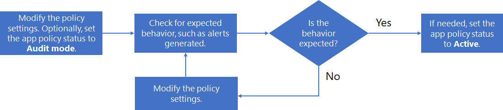

# Verwalten von App-Richtlinien

>*[Microsoft 365-Lizenzierungsleitfaden für Sicherheit und Compliance](https://aka.ms/ComplianceSD).*

Um mit den neuesten Apps, die Ihr Unternehmen verwendet, Schritt zu halten, auf neue App-basierte Angriffe zu reagieren und die laufenden Änderungen an Ihren App-Complianceanforderungen umzusetzen, müssen Sie Ihre App-Richtlinien möglicherweise auf diese Weise verwalten:

- Erstellen neuer Richtlinien für neue Apps
- Ändern des Status einer vorhandenen Richtlinie (aktiv, inaktiv, Überwachungsmodus)
- Ändern der Bedingungen einer vorhandenen Richtlinie
- Ändern der Aktionen einer vorhandenen Richtlinie für die automatische Korrektur bei Warnungen

Hier ist ein Beispiel für einen Prozess zum Verwalten einer vorhandenen Richtlinie:

1. Bearbeiten der Richtlinie:

  - Ändern Sie die Einstellungen der Richtlinie.
  - Ändern Sie bei Bedarf den Status zum Testen in **Überwachungsmodus**.

2. Überprüfen Sie auf erwartetes Verhalten, z. B. generierte Warnungen.
1. Wenn das Verhalten nicht den Erwartungen entspricht, fahren Sie mit Schritt 1 fort.
1. Wenn das Verhalten den Erwartungen entspricht, bearbeiten Sie die Richtlinie, und ändern Sie ihren Status ggf. in „Aktiv“.

## Bearbeiten einer App-Richtlinienkonfiguration

So ändern Sie die Konfiguration einer vorhandenen App-Richtlinie

- Wählen Sie die Richtlinie in der Richtlinienliste und dann im Bereich „App-Richtlinie“ die Option **Bearbeiten** aus.
- Wählen Sie die vertikalen Auslassungspunkte für die Richtlinie in der Liste und dann **Bearbeiten** aus.

Gehen Sie auf der Seite **Richtlinie bearbeiten** schrittweise durch die Optionen, und nehmen Sie die entsprechenden Änderungen vor:

- **Beschreibung**: Ändern Sie die Beschreibung, um den Zweck der Richtlinie besser verständlich zu machen.
- **Schweregrad**
- **Richtlinieneinstellungen**: Ändern Sie den Satz von Apps, auf die die Richtlinie angewendet wird. Sie können die vorhandenen Bedingungen verwenden oder die Bedingungen ändern.
- **Aktionen**: Ändern automatischen Korrekturmaßnahmen für die Warnungen, die von der Richtlinie generiert werden.
- **Status**: Ändern Sie den Richtlinienstatus.

## Löschen einer App-Richtlinie

Zum Löschen einer App-Richtlinie haben Sie folgende Möglichkeiten:

- Wählen Sie die Richtlinie in der Richtlinienliste und dann im Bereich „App-Richtlinie“ die Option **Löschen** aus.
- Wählen Sie die vertikalen Auslassungspunkte für die Richtlinie in der Liste und dann **Löschen** aus.

Eine Alternative zum Löschen einer App-Richtlinie besteht darin, ihren Status in „Inaktiv“ zu ändern. Sobald sie inaktiv ist, werden keine Warnungen mehr generiert. Anstatt beispielsweise eine App-Richtlinie für eine App mit einem bestimmten Satz von Bedingungen, die für eine zukünftige Richtlinie nützlich sind, zu löschen, können Sie die App-Richtlinie umbenennen, um deren Nützlichkeit zu verdeutlichen, und ihren Status auf inaktiv festlegen. So können Sie später zur Richtlinie zurückkehren, sie für eine ähnliche App anpassen und ihren Status auf „Überwachungsmodus“ oder „Inaktiv“ festlegen.
