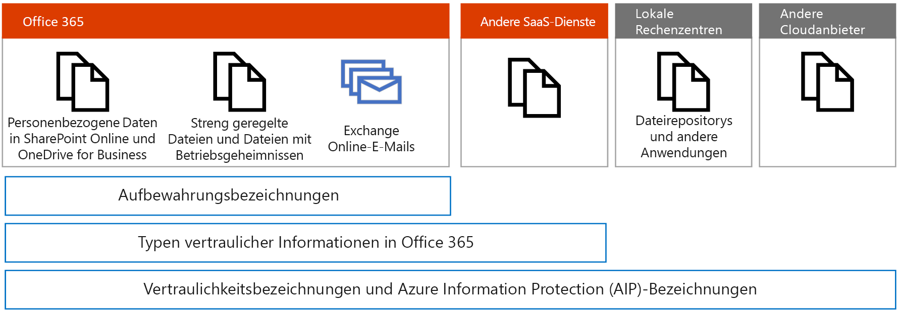
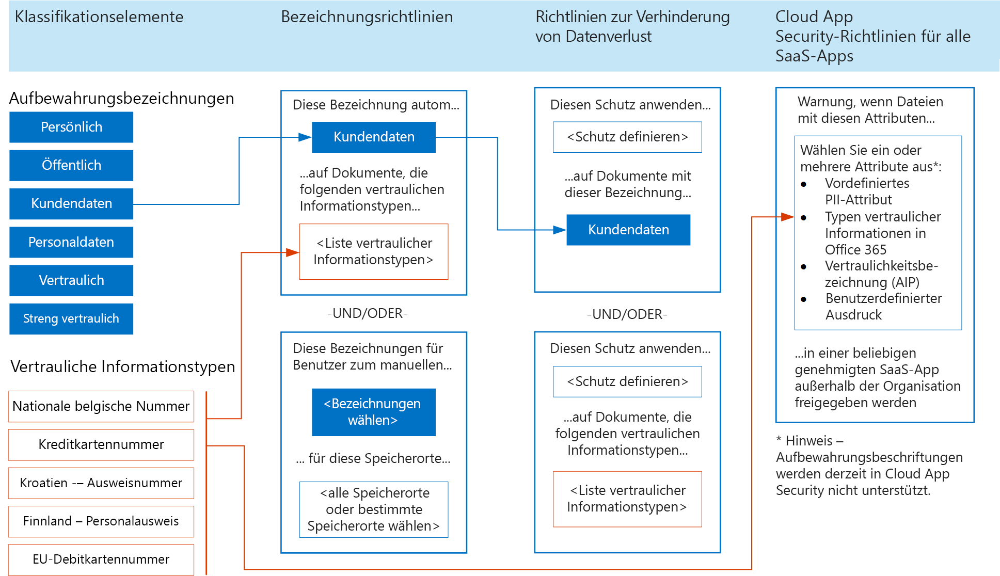
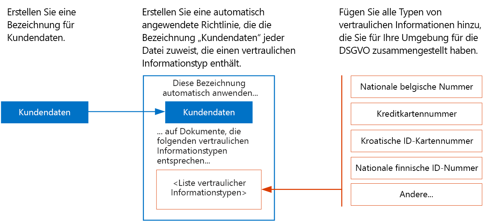

# Anwenden von Bezeichnungen auf personenbezogene DatenApply labels to personal data

 Verwenden Sie dieses Thema, wenn Sie im Rahmen Ihres DSGVO-Schutzplans Klassifizierungsbezeichnungen verwenden.Use this topic if you're using classification labels as part of your GDPR protection plan. 

Wenn Sie Bezeichnungen zum Schutz persönlicher Daten in Microsoft 365 verwenden, empfiehlt Microsoft, mit [Aufbewahrungsbezeichnungen](retention.md#retention-labels) zu beginnen.If you're using labels for protection of personal data in Microsoft 365, Microsoft recommends you start with [retention labels](retention.md#retention-labels). Mit Aufbewahrungsbezeichnungen können Sie Folgendes:With retention labels, you can:
- Verwenden Sie die Erweiterte Datenkontrolle, um Bezeichnungen automatisch auf vertrauliche Informationstypen oder andere Kriterien anzuwenden.Use Advanced Data Governance to automatically apply labels based on sensitive information types or other criteria.
- Verwenden Sie Aufbewahrungsbezeichnungen mit der Verhinderung von Datenverlust, um einen Schutz anzuwenden.Use retention labels with data loss prevention to apply protection. 
- Verwenden Sie Bezeichnungen mit eDiscovery und der Inhaltssuche.Use labels with eDiscovery and Content Search. 

Cloud App Security unterstützt derzeit keine Aufbewahrungsbezeichnungen, aber Sie können Microsoft 365-Typen für vertrauliche Informationen mit Cloud App Security verwenden, um personenbezogene Daten zu überwachen, die in anderen SaaS-Apps gespeichert sind.Cloud App Security doesn't currently support retention labels, but you can use Microsoft 365 sensitive information types with Cloud App Security to monitor personal data that resides in other SaaS apps.

[Vertraulichkeitsbezeichnungen](sensitivity-labels.md) werden derzeit empfohlen, um Bezeichnungen auf lokale Dateien und Dateien in anderen Cloud-Diensten und bei anderen Anbietern anzuwenden.[Sensitivity labels](sensitivity-labels.md) are currently recommended for applying labels to files on premises and in other cloud services and providers. Sie werden ebenfalls empfohlen für Dateien in Microsoft 365, die für den Datenschutz eine Azure Informationen Protection-Verschlüsselung benötigen, wie z. B. Dateien mit Betriebsgeheimnissen.These are also recommended for files in Microsoft 365 that require Azure Information Protection encryption for data protection, such as trade secret files.

Zu diesem Zeitpunkt wird die Verwendung der Azure Information Protection-Verschlüsselung nicht für Dateien in Microsoft 365 empfohlen, die der DSGVO unterliegen.At this time, using Azure Information Protection to apply encryption is not recommended for files in Microsoft 365 with data that is subject to the GDPR. Microsoft 365-Dienste können derzeit keine AIP-verschlüsselten Dateien lesen.Microsoft 365 services currently cannot read into AIP-encrypted files. Aus diesem Grund findet der Dienst keine vertraulichen Daten in diesen Dateien.Therefore, the service can't find sensitive data in these files.

Aufbewahrungsbezeichnungen können in Exchange Online auf E-Mail-Nachrichten angewendet werden, und diese Bezeichnungen verwenden den Schutz vor Datenverlust von Microsoft 365.Retention labels can be applied to mail in Exchange Online and these labels work with Microsoft 365 data loss prevention. 

In der Abbildung sehen Sie Folgendes:In the illustration:

-   Verwenden von Aufbewahrungsbezeichnungen für personenbezogene Daten und streng geregelte Dateien sowie Dateien mit Betriebsgeheimnissen in SharePoint Online und OneDrive for Business.Use retention labels for personal data and for highly regulated and trade secret files in SharePoint Online and OneDrive for Business.
-   Sie können Microsoft 365-Typen für vertrauliche Informationen in Microsoft 365 und mit Cloud App Security verwenden, um personenbezogene Daten zu überwachen, die in anderen SaaS-Apps gespeichert sind.Microsoft 365 sensitive information types can be used within Microsoft 365 and with Cloud App Security to monitor personal data that resides in other SaaS apps.
-   Verwenden von Vertraulichkeitsbezeichnungen für streng geregelte Dateien sowie Dateien mit Betriebsgeheimnissen, Exchange Online-E-Mails, Dateien in anderen SaaS-Diensten, Dateien in lokalen Rechenzentren und Dateien in anderen Cloudanbietern.Use sensitivity labels for highly regulated and trade secret files, Exchange Online email, files in other SaaS services, files in on-premises datacenters, and files in other cloud providers.

## Verwenden von Aufbewahrungsbezeichnungen und vertraulichen Informationstypen in Microsoft 365 zum Schutz von InformationenUse retention labels and sensitive information types across Microsoft 365 for information protection

Die folgende Abbildung zeigt, wie Aufbewahrungsbezeichnungen und vertrauliche Informationstypen in Bezeichnungsrichtlinien, DLP-Richtlinien und mit Cloud App Security-Richtlinien verwendet werden können.The following illustration shows how retention labels and sensitive information types can be used in label policies, data loss prevention policies, and with Cloud App Security policies.

Für Zwecke der Barrierefreiheit enthält die folgende Tabelle die gleichen Beispiele wie die Abbildung.For accessibility, the following table provides the same examples in the illustration.

<table>
<thead>
<tr class="header">
<th align="left"><strong>Klassifikationselemente</strong><strong>Classification elements</strong></th>
<th align="left"><strong>Bezeichnungsrichtlinien – 2 Beispiele</strong><strong>Label policies — 2 examples</strong></th>
<th align="left"><strong>DLP-Richtlinien – 2 Beispiele</strong><strong>Data loss prevention policies — 2 examples</strong></th>
<th align="left"><strong>Cloud App Security-Richtlinien für alle SaaS-Apps – 1 Beispiel</strong><strong>Cloud App Security policies for all SaaS apps — 1 example</strong></th>
</tr>
</thead>
<tbody>
<tr class="odd">
<td align="left">AufbewahrungsbezeichnungenRetention labels. Beispiele: „Privat“, „Öffentlich“, „Kundendaten“, „Personaldaten“, „Vertraulich“, „Streng vertraulich“Examples: Personal, Public, Customer data, HR data, Confidential, Highly confidential</td>
<td align="left">
Auto apply this label .Auto apply this label . .. ..

KundendatenCustomer data

.. .. .. to documents that match these sensitive information types .to documents that match these sensitive information types . .. ..

&lt;Liste der Beispiele für vertrauliche Informationstypen&gt;&lt;list of example sensitive information types&gt;
</td>
<td align="left">
Apply this protection .Apply this protection . .. ..

&lt;Schutz definieren&gt;&lt;define protection&gt;

.. .. .. to documents with this label .to documents with this label . .. ..

KundendatenCustomer data
</td>
<td align="left">
Alert when files with these attributes .Alert when files with these attributes . .. ..

Wählen Sie ein oder mehrere Attribute aus: vordefiniertes PII-Attribut, Microsoft 365-Typ für vertrauliche Informationen, Vertraulichkeitsbezeichnung (AIP), benutzerdefinierter AusdruckChoose one or more attributes: predefined PII attribute, Microsoft 365 sensitive information type, sensitivity label (AIP), custom expression

.. .. .. in einer beliebigen genehmigten SaaS-App außerhalb der Organisation freigegeben werdenin any sanctioned SaaS app are shared outside the organization

Hinweis: Aufbewahrungsbezeichnungen werden derzeit in Cloud App Security nicht unterstützt.Note: Retention labels are currently not supported in Cloud App Security.</td>
</tr>
<tr class="even">
<td align="left">Sensitive information types.Sensitive information types. Examples: Belgium National Number, Credit Card Number, Croatia Identity Cart Number, Finland National IDExamples: Belgium National Number, Credit Card Number, Croatia Identity Cart Number, Finland National ID</td>
<td align="left">
Publish these labels for users to manually apply .Publish these labels for users to manually apply . .. ..

&lt;Bezeichnungen wählen&gt;&lt;select labels&gt;

.. .. .. to these locations .to these locations . .. ..

&lt;alle Speicherorte oder bestimmte Speicherorte wählen&gt;&lt;all locations or choose specific locations&gt;
</td>
<td align="left">
Apply this protection .Apply this protection . .. ..

&lt;Schutz definieren&gt;&lt;define protection&gt;

.. .. .. to documents that match these sensitive information types&gt;to documents that match these sensitive information types&gt;
</td>
<td align="left"></td>
</tr>
</tbody>
</table>

## Priorisieren automatisch angewendeter BezeichnungsrichtlinienPrioritize auto-apply label policies

For personal data that is subject to GDPR, Microsoft recommends auto-applying labels by using the sensitive information types you curated for your environment.For personal data that is subject to GDPR, Microsoft recommends auto-applying labels by using the sensitive information types you curated for your environment. It is important that auto-apply label policies are well designed and tested to ensure the intended behavior occurs.It is important that auto-apply label policies are well designed and tested to ensure the intended behavior occurs.

The order that auto-apply policies are created and whether users are also applying these labels affect the result.The order that auto-apply policies are created and whether users are also applying these labels affect the result. So, it's important to carefully plan the roll-out. Here's what you need to know.So, it's important to carefully plan the roll-out. Here's what you need to know.

### Jeweils nur eine BezeichnungOne label at a time

Sie können einem Dokument jeweils nur eine Bezeichnung zuweisen.You can only assign one label to a document.

### Ältere automatisch anzuwendende Richtlinien gelten zuerstOlder auto-apply policies win

If there are multiple rules that assign an auto-apply label and content meets the conditions of multiple rules, the label for the oldest rule is assigned.If there are multiple rules that assign an auto-apply label and content meets the conditions of multiple rules, the label for the oldest rule is assigned. For this reason, it's important to plan the label policies carefully before configuring them.For this reason, it's important to plan the label policies carefully before configuring them. If an organization requires a change to the priority of the label policies, they'll need to delete and recreate them.If an organization requires a change to the priority of the label policies, they'll need to delete and recreate them.

### Manuell von Benutzern angewendete Bezeichnungen sind wichtiger als automatisch angewendete BezeichnungenManual user-applied labels trump auto-applied labels

Manual user applied labels trump auto-applied labels.Manual user applied labels trump auto-applied labels. Auto-apply policies can't replace a label that is already applied by a user.Auto-apply policies can't replace a label that is already applied by a user. Users can replace labels that are auto-applied.Users can replace labels that are auto-applied.

### Automatisch zugewiesene Bezeichnungen können aktualisiert werdenAuto-assigned labels can be updated

Automatisch zugewiesene Bezeichnungen können entweder durch neuere Bezeichnungsrichtlinien oder durch Aktualisierungen vorhandener Richtlinien aktualisiert werden.Auto-assigned labels can be updated by either newer label policies or by updates to existing policies.

Achten Sie darauf, dass Ihr Plan für die Implementierung von Bezeichnungen Folgendes umfasst:Be sure your plan for implementing labels includes:

- Priorisieren der Reihenfolge, in der automatisch angewendete Richtlinien erstellt werden.Prioritizing the order that auto-apply policies are created.

- Allowing enough time for labels to be automatically applied before rolling these out for users to manually apply.Allowing enough time for labels to be automatically applied before rolling these out for users to manually apply. It can take up to seven days for the labels to be applied to all content that matches the conditions.It can take up to seven days for the labels to be applied to all content that matches the conditions.

### Beispiel für Priorität für das Erstellen von automatisch angewendeten RichtlinienExample priority for creating the auto-apply policies

<table>
<thead>
<tr class="header">
<th align="left"><strong>Bezeichnungen</strong><strong>Labels</strong></th>
<th align="left"><strong>Prioritätsreihenfolge beim Erstellen von automatisch angewendeten Richtlinien</strong><strong>Priority order to create auto-apply policies</strong></th>
</tr>
</thead>
<tbody>
<tr class="odd">
<td align="left">Personaldaten – MitarbeiterdatenHuman Resources — Employee Data</td>
<td align="left">11</td>
</tr>
<tr class="even">
<td align="left">KundendatenCustomer Data</td>
<td align="left">22</td>
</tr>
<tr class="odd">
<td align="left">Streng vertraulichHighly Confidential</td>
<td align="left">33</td>
</tr>
<tr class="even">
<td align="left">Personaldaten – GehaltsdatenHuman Resources — Salary Data</td>
<td align="left">44</td>
</tr>
<tr class="odd">
<td align="left">VertraulichConfidential</td>
<td align="left">55</td>
</tr>
<tr class="even">
<td align="left">ÖffentlichPublic</td>
<td align="left">66</td>
</tr>
<tr class="odd">
<td align="left">PrivatPersonal</td>
<td align="left">Keine automatisch angewendete RichtlinieNo auto-apply policy</td>
</tr>
</tbody>
</table>

## Erstellen von Bezeichnungen und automatisch angewendeten BezeichnungsrichtlinienCreate labels and auto-apply label policies

Erstellen Sie Bezeichnungen und Richtlinien im Security Center oder Compliance Center.Create labels and policies in the security center or the compliance center.

<table>
<thead>
<tr class="header">
<th align="left"><strong>Schritt</strong><strong>Step</strong></th>
<th align="left"><strong>Beschreibung</strong><strong>Description</strong></th>
</tr>
</thead>
<tbody>
<tr class="odd">
<td align="left">
Gewähren von Berechtigungen für Mitglieder Ihres ComplianceteamsGive permissions to members of your compliance team.
</td>
<td align="left">
Die Mitglieder Ihres Complianceteams, die Bezeichnungen erstellen sollen, benötigen Berechtigungen für das Security Center und/oder das Compliance Center.Members of your compliance team who will create labels need permissions to use the security center and/or the compliance center. Gehen Sie im Security Center oder im Compliance Center zu „Berechtigungen“ und ändern Sie die Mitglieder der Gruppe „Complianceadministrator“.Go to Permissions in the security center or the compliance center and modify the members of the Compliance Administrator group.

Einzelheiten hierzu finden Sie unter <a href="https://docs.microsoft.com/microsoft-365/security/office-365-security/grant-access-to-the-security-and-compliance-center">Gewähren des Zugriffs auf das Security Center und/oder Compliance Center</a>.See <a href="https://docs.microsoft.com/microsoft-365/security/office-365-security/grant-access-to-the-security-and-compliance-center">Give users access to the security center and/or the compliance center</a>.
</td>
</tr>
<tr class="even">
<td align="left">
Erstellen Sie Aufbewahrungsbezeichnungen.Create retention labels.
</td>
<td align="left">Wechseln Sie im Security Center oder Compliance Center zu „Klassifizierungen“, wählen Sie „Aufbewahrungsbezeichnungen“, und erstellen Sie die Bezeichnungen für Ihre Umgebung.Go to Classifications in the Security center or the Compliance center, choose Retention labels, and create the labels for your environment.</td>
</tr>
<tr class="odd">
<td align="left">
Erstellen automatisch angewendeter Richtlinien für BezeichnungenCreate auto-apply policies for labels.
</td>
<td align="left">Wechseln Sie im Security Center oder Compliance Center zu „Klassifizierungen“, wählen Sie „Bezeichnungsrichtlinien“, und erstellen Sie die Richtlinien für das automatische Anwenden von Bezeichnungen.Go to Classification in security center or the compliance center, choose Label policies, and create the policies for auto-applying labels. Achten Sie darauf, diese Richtlinien in der priorisierten Reihenfolge zu erstellen.Be sure to create these policies in the prioritized order.</td>
</tr>
</tbody>
</table>

Die folgende Abbildung zeigt, wie Sie eine automatisch angewendete Bezeichnung für die Bezeichnung „Kundendaten“ erstellen können.The following illustration shows how to create an auto-apply label for the Customer data label.

In der Abbildung sehen Sie Folgendes:In the illustration:

- Die Bezeichnung „Kundendaten“ wird erstellt.The "Customer data" label is created.

- Die gewünschten vertraulichen Informationstypen für die DSGVO werden aufgeführt: Nationale belgische Nummer, Kreditkartennummer, Kroatische ID-Kartennummer, nationale finnische ID-Nummer.The desired sensitive information types for GDPR are listed: Belgium National Number, Credit Card Number, Croatia Identity Card Number, Finland National ID.

- Erstellen einer automatisch angewendeten Richtlinie, die die Bezeichnung „Kundendaten“ jeder Datei zuweist, die einen der vertraulichen Informationstypen enthält, die der Richtlinie hinzugefügt wurde.Create an auto-apply policy assigns the label "Customer data" to any file that includes one of the sensitive information types that you add to the policy.
