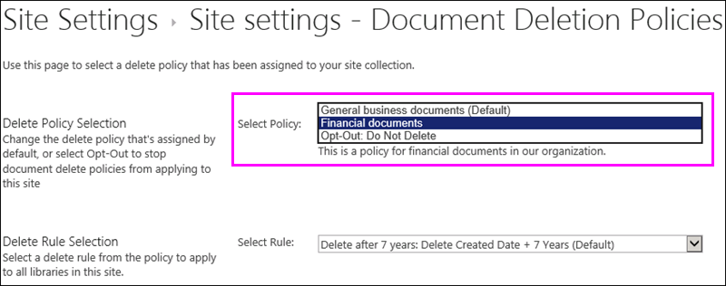

# Anwenden oder Entfernen einer Dokumentlöschrichtlinie für eine WebsiteApply or remove a document deletion policy for a site

Unternehmen unterliegen häufig compliancebezogenen, rechtlichen oder anderen Vorschriften, nach denen sie Dokumente eine bestimmte Zeit lang aufbewahren müssen.Organizations are often subject to compliance, legal, or other regulations that require them to retain documents for a certain period of time. Werden Dokumente jedoch länger als erforderlich aufbewahrt, kann dies für das Unternehmen ein rechtliches Risiko darstellen.However, retaining documents for longer than required can expose the organization to legal risk. Aus diesem Grund hat Ihre Organisation möglicherweise eine Richtlinie zum Löschen von Dokumenten&mdash;für Ihre Website erstellt. beispielsweise können allgemeine Geschäftsdokumente fünf Jahre nach ihrer Erstellung gelöscht werden.For this reason, your organization may have created a document deletion policy for your site&mdash;for example, general business documents might be required to be deleted five years after they were created.
  
Abhängig von Ihrem Unternehmen kann eine Dokumentlöschrichtlinie eine der folgenden Eigenschaften aufweisen:Depending on your organization, a document deletion policy might be:
  
- **Obligatorisch** Ein Websitebesitzer kann keine obligatorische Richtlinie deaktivieren, die automatisch auf die Website angewendet wird.**Mandatory** A site owner can't opt out of a mandatory policy, which is automatically applied to the site. 
    
- **Standardmäßig** Eine Standardrichtlinie wird automatisch auf eine Website angewendet. Ein Websiteeigentümer hat jedoch folgende Möglichkeiten:**Default** A default policy is automatically applied to a site, but a site owner can: 
    
  - Auswählen einer anderen Richtlinie, sofern verfügbar.Choose another policy if available.
    
  - Deaktivieren Sie die Richtlinie vollständig, wenn Sie für den Inhalt der Website nicht relevant ist.Opt out of the policy entirely if it isn't relevant to the content in the site.
    
- **Weder verpflichtend noch standardmäßig** In diesem Fall wird auf die Website keine Richtlinie automatisch angewendet, und der Websiteeigentümer muss Maßnahmen ergreifen, um eine Richtlinie anzuwenden.**Neither mandatory nor default** In this case, no policy is automatically applied to the site, and the site owner needs to take action to apply one. 
    
Eine Richtlinie zum Löschen von Dokumenten enthält möglicherweise mehrere Regeln&mdash;, beispielsweise kann eine Regel sagen, Löschen von Dokumenten ein Jahr nach ihrer Erstellung, aber eine andere Regel könnte sagen, Löschen von Dokumenten ein Jahr nach ihrer letzten Änderung.A document deletion policy may contain more than one rule&mdash;for example, one rule might say delete documents one year after they were created, but another rule might say delete documents one year after they were last modified. Wenn eine Richtlinie mehr als eine Regel enthält, können Sie die Regel auswählen, die am besten für Ihre Website gilt.If a policy contains more than one rule, you can select the rule that best applies to your site. Die Delete-Regel wird auf alle Bibliotheken innerhalb der Website angewendet.The delete rule will be applied to all libraries within the site. In einer Website kann jeweils immer nur eine Richtlinie und eine Regel aktiv sein.Only one policy and one rule can be active in a site at one time. Wie eine Richtlinie kann eine Regel als Standard festgelegt werden, sodass Sie automatisch angewendet wird, wenn die Richtlinie angewendet wird.Like a policy, a rule can be set as default, so that it's applied automatically when the policy is applied.
  
Außerdem werden Dokumentlöschrichtlinien vererbt. Wenn Sie eine Richtlinie oder Regel für Ihre Website auswählen, wird diese Auswahl von allen Unterwebsites geerbt. Der Besitzer einer Website kann die Vererbung allerdings durch Auswahl einer anderen Richtlinie oder Regel unterbrechen. Berücksichtigen Sie bei der Auswahl einer Richtlinie oder Regel die Inhalte aller Unterwebsites unterhalb Ihrer Website.Finally, document deletion policies are inherited. When you select a policy or rule for your site, that selection is inherited by all subsites, although an owner of a subsite can break inheritance by selecting a different policy or rule. When you select a policy or rule, consider the content of any subsites below your site.
  
## Anzeigen der in einer Websitesammlung verfügbaren DokumentlöschrichtlinienView the document deletion policies available in a site collection

Ihr Unternehmen kann unterschiedlichen Websitesammlungen unterschiedliche Richtlinien zuweisen. Auf Ebene der Websitesammlung kann der Besitzer einer Websitesammlung alle Dokumentlöschrichtlinien anzeigen, die für diese Websitesammlung verfügbar sind. Die Richtlinien wurden möglicherweise für die Websitesammlungsvorlage (und somit für alle mit dieser Vorlage erstellten Websitesammlungen) oder für diese bestimmte Websitesammlung verfügbar gemacht.Your organization may assign different policies to different site collections. At the site collection level, an owner of a site collection can view all of the document deletion policies that are available to that site collection. The policies may have been made available to the site collection template (and therefore all site collections created from this template) or to this specific site collection.
  
1. Wählen Sie auf der Website auf oberster Ebene in der Websitesammlung in der oberen rechten Ecke **Einstellungen** [Zahnradsymbol] \> **Websiteeinstellungen**aus.In the top-level site in the site collection, in the upper-right corner, choose **Settings** [gear icon] \> **Site Settings**.
    
2. **Dokument Löschungsrichtlinien**unter **Websitesammlungsverwaltung** \> .Under **Site Collection Administration** \> **Document Deletion Policies**.
    
    > [!NOTE]
    > Der Link **Dokument Löschungsrichtlinien** wird nur angezeigt, wenn der Websitesammlung Richtlinien zugewiesen wurden.The **Document Deletion Policies** link won't appear unless policies have been assigned to the site collection. Außerdem wird der Link nicht unmittelbar nach dem Zuweisen von Richtlinien zur Website angezeigt – es kann bis zu 24 Stunden dauern, bis die Richtlinien zugewiesen sind, wenn der Link **Dokument Löschungsrichtlinien** angezeigt wird.Also, the link doesn't appear immediately after policies have been assigned to the site — it can take up to 24 hours from when the policies are assigned to when the **Document Deletion Policies** link appears. 
  
3. Auf dieser Seite können Sie Folgendes anzeigen:On this page you can view:
    
  - Die aktuell zugewiesenen Richtlinien und die zugehörigen Regeln. Wählen Sie eine Richtlinie aus, um die Regeln im rechten Fenster anzuzeigen.The currently assigned policies and the associated rules. Select a policy to view the rules in the right pane.
    
  - Bei der Standardrichtlinie, falls vorhanden, steht in der Spalte **Standard\*\*\*\*Ja**.The default policy, if any, displays **Yes** in the **Default** column. 
    
  - Unterhalb der Liste wird eine Meldung angezeigt, wenn die Richtlinie als **Verpflichtend** zugewiesen wurde.A message is displayed below the list if the policy has been assigned as **Mandatory**.
    
Diese Liste ist schreibgeschützt und dient dem Websitesiteeigentümer dazu, alle verfügbaren Richtlinien und Regeln anzuzeigen. Informationen zum Anwenden einer Richtlinie finden Sie im nächsten Abschnitt.This list is view only, for the site collection owner to see all of the available policies and rules. To apply a policy, see the next section.
  

  
## Anwenden oder Entfernen einer Dokumentlöschrichtlinie für eine WebsiteApply or remove a document deletion policy for a site

Für Sie als Besitzer einer Website oder Websitesammlung gibt es in Ihrem Unternehmen möglicherweise Richtlinien, die Sie auf Ihre Website anwenden oder komplett abwählen können.As a site owner or site collection owner, your organization may have created policies that you can either apply to your site or opt out of entirely.
  
1. Wählen Sie in der oberen rechten Ecke **Einstellungen** [Zahnradsymbol] \> **Websiteeinstellungen**aus.In the upper-right corner, choose **Settings** [gear icon] \> **Site Settings**.
    
2. **Dokument Löschungsrichtlinien**unter **Websiteverwaltung** \> .Under **Site Administration** \> **Document Deletion Policies**.
    
    > [!NOTE]
    > Der Link **Dokument Löschungsrichtlinien** wird nur angezeigt, wenn der Websitesammlung Richtlinien zugewiesen wurden.The **Document Deletion Policies** link won't appear unless policies have been assigned to the site collection. Außerdem wird der Link nicht unmittelbar nach dem Zuweisen von Richtlinien zur Website angezeigt – es kann bis zu 24 Stunden dauern, bis die Richtlinien zugewiesen sind, wenn der Link **Dokument Löschungsrichtlinien** angezeigt wird.Also, the link doesn't appear immediately after policies have been assigned to the site — it can take up to 24 hours from when the policies are assigned to when the **Document Deletion Policies** link appears. 
  
3. Führen Sie einen der folgenden Schritte aus:Do one of the following:
    
  - **So wenden Sie eine Richtlinie an** Wählen Sie eine \> Richtlinie aus wählen Sie eine \> Regel in dieser Richtlinie **Speichern**aus.**To apply a policy** Select a policy \> select a rule in that policy \> **Save**.
    
    In einer Website kann jeweils immer nur eine Richtlinie und eine Regel aktiv sein. Ihr Unternehmen stellt möglicherweise mehrere Richtlinien und Regeln zur Auswahl oder nur eine Richtlinie oder Regel bereit.Only one policy and one rule can be active in a site at one time. Your organization may provide several policies and rules to choose from, or only one policy or rule.
    
    
  
  - **So deaktivieren Sie eine Richtlinie** Wählen Sie **Opt-out: Do Note DELETE** \> **Save**.**To opt out of a policy** Choose **Opt-Out: Do Note Delete** \> **Save**.
    
    Als Websitebesitzer können Sie eine Richtlinie für das Löschen von Dokumenten deaktivieren, wenn Sie feststellen, dass die Richtlinie nicht für den Inhalt Ihrer Website gilt.As a site owner, you can opt out of a document deletion policy if you determine that the policy isn't applicable to the content in your site. Sie können jedoch keine Richtlinie deaktivieren, die als **obligatorisch**gekennzeichnet wurde.However, you can't opt out of a policy that has been marked as **Mandatory**.
    
    
  
## Dokumentlöschrichtlinien haben Vorrang vor anderen RichtlinienDocument deletion policies override other policies

Eine Website verwendet möglicherweise andere Richtlinie für die Aufbewahrung und Löschung von Inhalten:A site may use other policies for retaining and deleting content:
  
- Inhaltstyprichtlinien für die Websitesammlung.Content type policies for the site collection.
    
- Informationsverwaltungsrichtlinien für eine Liste oder Bibliothek.Information management policies for a list or library.
    
Wenn Sie eine Dokumentlöschrichtlinie auf eine Website anwenden, die für eine Liste oder Bibliothek bereits Inhaltstyp- oder Informationsverwaltungsrichtlinien verwendet, werden diese Richtlinien ignoriert, während die Dokumentlöschrichtlinie angewendet wird.If you apply a document deletion policy to a site that already uses content type policies or information management policies for a list or library, those policies are ignored while the document deletion policy is in effect. Wenn andere Richtlinien ignoriert werden, wird die Meldung "Inhalt auf dieser Website verwendet Dokument Löschungsrichtlinien" angezeigt.If other policies are ignored, you'll see the message "Content on this site uses Document Deletion Policies".
  
Das bedeutet, dass Sie für eine Website nur Richtlinien verwenden sollten, die für strukturierte Inhalte (Informationsverwaltungs- und Inhaltstyprichtlinien) oder unstrukturierte Inhalte (Dokumentlöschungsrichtlinien) gedacht sind, und nicht beide Arten von Richtlinien.This means you should plan for a site to use only policies meant for structured content (information management policies and content type policies) or unstructured content (document deletion policies), not both. Wenn Sie eine Richtlinie für das Löschen von Dokumenten ablehnen, wird die Warnung nicht angezeigt, und andere Richtlinientypen funktionieren weiterhin.If you opt out of a document deletion policy, the warning won't be displayed and other types of policies will continue to work.
  
Websiterichtlinien sind von Dokumentlöschungsrichtlinien nicht betroffen.Site policies are not affected by document deletion policies.
  
### Prüfen, ob Inhaltstyprichtlinien ignoriert werdenDetermine if content type policies are being ignored

Wenn Ihre Website Inhaltstyprichtlinien verwendet hat und nun diese Meldung angezeigt wird, werden diese Richtlinien nicht mehr angewendet.If your site was using content type policies and you now see this message, those policies are no longer in effect. Wenn Sie die Richtlinien für den Inhaltstyp wiederherstellen möchten, können Sie die Richtlinie für das Löschen von Dokumenten aus Ihrer Website entfernen (siehe oben beschrieben), wenn eine Opt-out-Option zur Verfügung steht.To restore the content type policies, you can remove the document deletion policy from your site, as described earlier, if there's an opt-out option available. Wenn keine Option zum Deaktivieren vorhanden ist, ist die Richtlinie für das Löschen von Dokumenten zwingend erforderlich, und Sie müssen sich an den Compliance Officer in Ihrer Organisation wenden.If there's no option to opt out, the document deletion policy is mandatory, and you need to contact the compliance officer in your organization.
  
1. Wählen Sie in der oberen rechten Ecke **Einstellungen** [Zahnradsymbol] \> **Websiteeinstellungen**aus.In the upper-right corner, choose **Settings** [gear icon] \> **Site Settings**.
    
2. Unter **Inhaltstyp Richtlinienvorlagen**für **Websiteverwaltung** \> .Under **Site Administration** \> **Content Type Policy Templates**.
    
    
  
### Prüfen, ob Informationsverwaltungsrichtlinien ignoriert werdenDetermine if information management policies are being ignored

Wenn Ihre Website Informationsverwaltungsrichtlinien verwendet hat und nun diese Meldung angezeigt wird, werden diese Richtlinien nicht mehr angewendet.If your site was using information management policies and you now see this message, those policies are no longer in effect. Um die Richtlinien für die Informationsverwaltung wiederherzustellen, können Sie die Dokument Löschungs Richtlinie wie oben beschrieben aus Ihrer Website entfernen, wenn eine Opt-out-Option zur Verfügung steht.To restore the information management policies, you can remove the document deletion policy from your site, as described earlier, if there's an opt-out option available. Wenn keine Option zum Deaktivieren vorhanden ist, ist die Richtlinie für das Löschen von Dokumenten zwingend erforderlich, und Sie müssen sich an den Compliance Officer in Ihrer Organisation wenden.If there's no option to opt out, the document deletion policy is mandatory, and you need to contact the compliance officer in your organization.
  
- Für eine Liste oder Bibliothek auf der Registerkarte \> **Library** \> **Bibliothekseinstellungen** \> der Menü Bandbibliothek unter **Berechtigungen und Verwaltungs** \> **Informationsverwaltungsrichtlinien Einstellungen**.For a list or library, on the Ribbon \> **Library** tab \> **Library Settings** \> under **Permissions and Management** \> **Information Management Policy Settings**.
    
    
  
## Siehe auchSee also

[Übersicht über DokumentlöschrichtlinienOverview of document deletion policies](document-deletion-policies.md)
  
[Erstellen einer DokumentlöschrichtlinieCreate a document deletion policy](create-a-document-deletion-policy.md)

