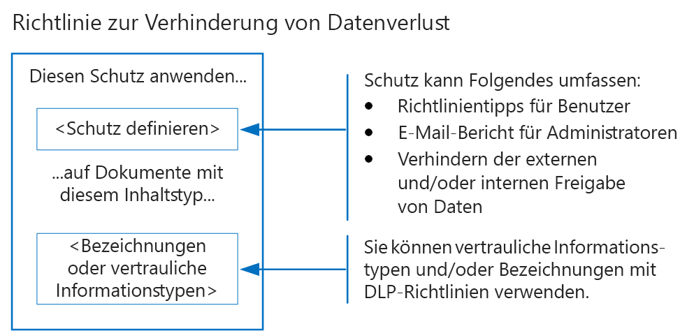
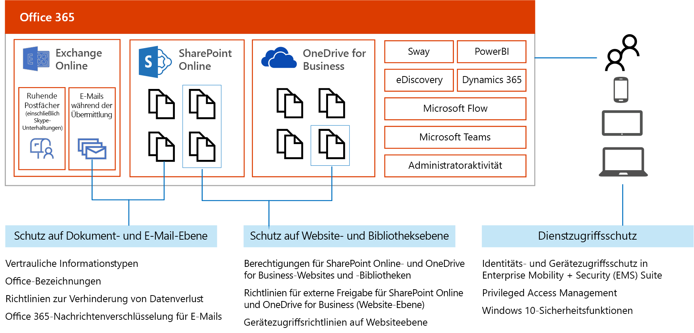
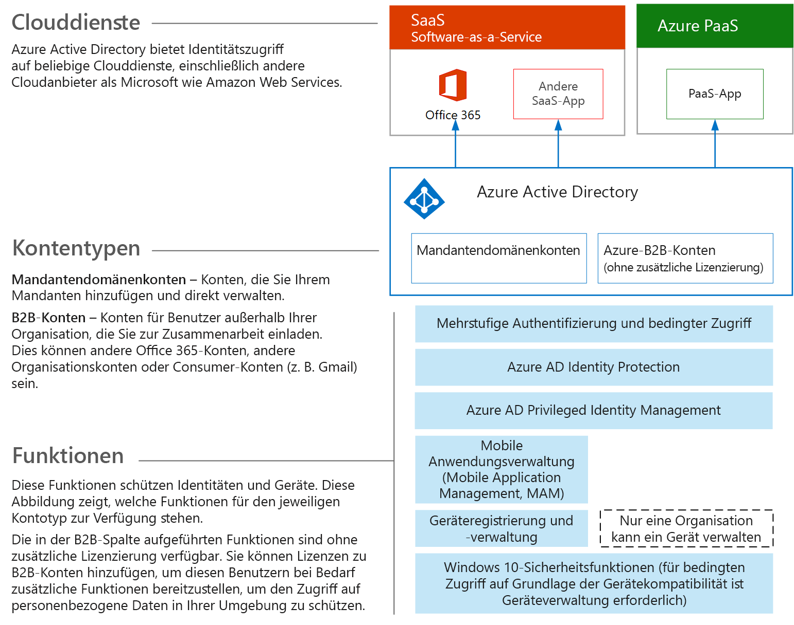

# Anwenden des Schutzes auf personenbezogene Daten

Zum Schutz von personenbezogenen Informationen in Microsoft 365 gehören Funktionen zur Verhinderung von Datenverlust. Mithilfe von Richtlinien zur Verhinderung von Datenverlust (Data Loss Prevention, DLP) im Compliance Center können Sie vertrauliche Informationen in Microsoft 365 identifizieren, überwachen und automatisch schützen lassen.

In diesem Thema wird die Verwendung von DLP zum Schutz personenbezogener Daten erläutert. Dieses Thema beinhaltet auch andere Schutzfunktionen, die verwendet werden können, um die Einhaltung der DSGVO zu gewährleisten, u. a. Festlegen von Berechtigungen in SharePoint-Bibliotheken und Verwenden von Gerätezugriffsrichtlinien.

## Anwenden des Schutzes mithilfe von DLP in Microsoft 365

Mit DLP können Sie Folgendes:

-   Vertrauliche Daten über viele Speicherorte hinweg identifizieren

-   Verhindern, dass vertrauliche Informationen unbeabsichtigt freigegeben werden

-   Benutzern dabei helfen, zu erfahren, wie sie die Anforderungen erfüllen, ohne dabei ihren Arbeitsablauf unterbrechen zu müssen

-   Anzeigen von DLP-Berichten mit Inhalten, die mit den DLP-Richtlinien Ihrer Organisation übereinstimmen.

Weitere Informationen finden Sie unter [Übersicht über die Richtlinien zur Verhinderung von Datenverlust](https://support.office.com/article/Overview-of-data-loss-prevention-policies-1966b2a7-d1e2-4d92-ab61-42efbb137f5e).

Diese Abbildung zeigt die Optionen für das Erstellen einer DLP-Richtlinie:

-   Wählen Sie Schutz, den Sie anwenden möchten. Schutz kann Folgendes umfassen:

    -   Richtlinientipps für Benutzer

    -   E-Mail-Bericht für Administratoren

    -   Verhindern der externen und/oder internen Freigabe von Daten

-   Wählen Sie die Kriterien zum Anwenden des Schutzes. Wenden Sie den Schutz auf Dokumente mit diesem Inhaltstyp an: Sie können die Richtlinie für die Verwendung vertraulicher Informationstypen und/oder -bezeichnungen verwenden.

### Verwenden von DLP für die Einhaltung der DSGVO

Einer der primären Verwendungszwecke von Microsoft 365 DLP besteht darin, personenbezogene Daten, die Personen innerhalb der EU betreffen, in Ihrer Microsoft 365-Umgebung zu identifizieren. Microsoft 365 DLP kann Ihren Complianceteams melden, wo personenbezogene Informationen in SharePoint Online und OneDrive for Business gespeichert wurden oder wenn Benutzer E-Mails senden, die personenbezogene Informationen enthalten. DLP kann auch Richtlinientipps für Ihre Mitarbeiter bei der Arbeit mit personenbezogenen Informationen bereitstellen, die EU-Bürger betreffen.

Die Aufklärung und Bewusstseinsbildung in Bezug auf Daten von EU-Bürgern, die in Ihrer Umgebung gespeichert werden, sowie den Umgang Ihrer Mitarbeiter damit stellen eine Ebene des Informationsschutzes unter Verwendung von Office 365 DLP dar. In vielen Fällen benötigen Mitarbeiter, die bereits Zugriff auf diese Informationsart haben, diesen Zugriff für ihre täglichen Aufgaben. Für die Erzwingung von DLP-Richtlinien zur Einhaltung der DSGVO ist nicht unbedingt eine Einschränkung des Zugriffs erforderlich.

Jedoch beinhaltet die Einhaltung der DSGVO in der Regel eine Risikobewertung der Organisation, sowohl aus rechtlicher Sicht als auch aus der Sicht der Informationssicherheit, die Identifizierung von Typen und Speicherorten von personenbezogenen Informationen, sowie, ob es eine Rechtsgrundlage für die Speicherung und Verarbeitung dieser Informationen gibt. Basierend auf dieser Bewertung, kann es für die Implementierung von Richtlinien zum Schutz der Organisation und zur Einhaltung der DSGVO erforderlich sein, den Zugriff von Mitarbeitern auf Dokumente mit personenbezogenen Daten zu entfernen, die EU-Bürger betreffen. In Fällen, in denen weiterer Schutz erforderlich ist, kann zusätzlicher DLP-Schutz konfiguriert werden.

Die folgende Tabelle enthält drei Konfigurationen des zunehmenden Schutzes mithilfe von DLP. Die erste Konfiguration, Bewusstsein, kann als Ausgangspunkt und Mindestmaß an Schutz für die DSGVO verwendet werden.

### Beispielschutzebenen, die mit DLP-Richtlinien konfiguriert und zur Einhaltung der DSGVO verwendet werden

<table>
<thead>
<tr class="header">
<th align="left"><strong>Schutzebene</strong></th>
<th align="left"><strong>DLP-Konfiguration für Dokumente mit personenbezogenen Informationen im Zusammenhang mit EU-Bürgern</strong></th>
<th align="left"><strong>Vorteile und Risiken</strong></th>
</tr>
</thead>
<tbody>
<tr class="odd">
<td align="left">Bewusstsein</td>
<td align="left">
Senden von E-Mail-Benachrichtigungen an Complianceteams, wenn diese Daten in Dokumenten in SharePoint Online und OneDrive for Business erkannt werden.

Anpassen und Anzeigen von Richtlinientipps für Mitarbeiter in SharePoint und OneDrive for Business, wenn auf Dokumente mit diesen Daten zugegriffen wird.

Erkennen und melden, wenn diese Daten freigegeben werden.
</td>
<td align="left">
Bewusstseinsbildung bei Complianceteams und Mitarbeitern im Hinblick darauf, wo diese Daten gespeichert werden.

Aufklärung von Mitarbeitern im Hinblick auf die Unternehmensrichtlinie zur Verarbeitung von Dokumenten, die diese Daten enthalten.

Verhindert nicht, dass Mitarbeiter diese Daten intern oder extern freigeben.

Sie können DLP-Berichte für freigegebene Daten überprüfen und entscheiden, ob Sie den Schutz erhöhen müssen.
</td>
</tr>
<tr class="even">
<td align="left">Verhindern der externen Freigabe</td>
<td align="left">
Beschränken des Zugriffs auf Dokumente, die diese Daten in SharePoint Online und OneDrive for Business enthalten, wenn diese Inhalte für externe Benutzer freigegeben werden.

Verhindern, dass E-Mails mit Dokumenten mit diesen Daten an externe Empfänger gesendet werden.

Erkennen und melden, wenn diese Daten freigegeben werden.
</td>
<td align="left">
Verhindert die externe Freigabe von Daten und ermöglicht Mitarbeitern, intern mit diesen Daten zu arbeiten.

Sie können DLP-Berichte für intern freigegebene Daten überprüfen und entscheiden, ob Sie den Schutz erhöhen müssen.
</td>
</tr>
<tr class="odd">
<td align="left">Verhindern der internen und externen Freigabe</td>
<td align="left">
Beschränken des Zugriffs auf Dokumente, die diese Daten in SharePoint Online und OneDrive for Business enthalten, wenn diese Inhalte intern oder extern freigegeben werden.

Verhindern, dass E-Mails mit diesen Daten an interne und externe Empfänger gesendet werden.
</td>
<td align="left">
Verhindern der internen und externen Freigabe dieser Daten.

Mitarbeiter können möglicherweise nicht die Aufgaben ausführen, für die die Arbeit mit diesen Daten erforderlich ist.

Sie können DLP-Berichte für intern oder extern freigegebene Daten überprüfen und entscheiden, ob ein Training für Endbenutzer erforderlich ist.
</td>
</tr>
</tbody>
</table>

Hinweis: Mit zunehmender Schutzebene nimmt bei Benutzern die Möglichkeit ab, auf Informationen zuzugreifen, und könnte potenziell ihre Produktivität oder die Ausführung der täglichen Aufgaben beeinträchtigen. Die Erhöhung der Schutzebenen durch die Implementierung von Richtlinien, die sich auf Mitarbeiter auswirken, wird in der Regel von einer Endbenutzerschulung und Schulung von Benutzern zu neuen Sicherheitsrichtlinien und Vorgehensweisen begleitet, damit diese in einer sicheren Umgebung weiterhin produktiv sein können.

### Beispiel für DLP-Richtlinie für DSGVO – Bewusstsein 

Name: Bewusstsein für personenbezogene Daten, die der DSGVO unterliegen.

Beschreibung: Anzeigen von Richtlinientipps für Mitarbeiter, Benachrichtigen von Complianceteams, wenn diese Daten in Dokumenten in SharePoint Online und OneDrive for Business gefunden werden, Ermitteln und Melden, wenn diese Daten außerhalb Ihrer Organisation freigegeben werden.

<table>
<thead>
<tr class="header">
<th align="left"><strong>Steuerelement</strong></th>
<th align="left"><strong>Einstellungen</strong></th>
</tr>
</thead>
<tbody>
<tr class="odd">
<td align="left">Die zu schützenden Informationen auswählen</td>
<td align="left">Wählen Sie eine benutzerdefinierte Richtlinienvorlage.</td>
</tr>
<tr class="even">
<td align="left">Standorte</td>
<td align="left">Alle Speicherorte in Microsoft 365</td>
</tr>
<tr class="odd">
<td align="left">Nach Inhalten suchen, die Folgendes enthalten</td>
<td align="left">Klicken Sie auf „Bearbeiten“, und fügen Sie alle Typen von vertraulichen Informationen hinzu, die Sie für Ihre Umgebung zusammengestellt haben.</td>
</tr>
<tr class="even">
<td align="left">Erkennen, wenn diese Inhalte freigegeben werden</td>
<td align="left">Aktivieren Sie dieses Kontrollkästchen, und wählen Sie „Für Personen außerhalb meiner Organisation“ aus.</td>
</tr>
<tr class="odd">
<td align="left">Benutzer benachrichtigen, wenn Inhalte den Richtlinieneinstellungen entsprechen</td>
<td align="left">
Aktivieren Sie dieses Kontrollkästchen („Richtlinientipps für Benutzer anzeigen und eine E-Mail-Benachrichtigung senden“.).

Klicken Sie auf „Tipp und E-Mail anpassen“, und aktualisieren Sie sie für Ihre Umgebung. Die standardmäßigen Benachrichtigungen finden Sie in diesem Artikel: <a href="https://support.office.com/article/Send-email-notifications-and-show-policy-tips-for-DLP-policies-87496bc5-9601-4473-8021-cb05c71369c1?ui=en-US&amp;rs=en-US&amp;ad=US">Senden von E-Mail-Benachrichtigungen und Anzeigen von Richtlinientipps für DLP-Richtlinien</a>.
</td>
</tr>
<tr class="even">
<td align="left">Erkennen, wenn eine bestimmte Menge personenbezogener Informationen auf einmal freigegeben wird</td>
<td align="left">
„Erkennen, wenn Inhalte, die freigegeben werden Folgendes enthalten: Mindestens ____ Instanzen desselben Typs vertraulicher Informationen“ – Legen Sie diese Einstellung auf „1“ fest.

„Schadensberichte per E-Mail senden“ – Aktivieren Sie dieses Kontrollkästchen. Klicken Sie auf „Auswählen, was der Bericht enthalten und an wen er gesendet werden soll“. Außerdem müssen Sie Ihr Complianceteam hinzufügen.

„Zugriff auf Inhalte einschränken und die Richtlinie außer Kraft setzen“ – Deaktivieren Sie dieses Kontrollkästchen, um Benachrichtigungen zu vertraulichen Informationen zu erhalten, ohne dass Benutzer am Zugriff darauf gehindert werden.
</td>
</tr>
</tbody>
</table>

Alle Speicherorte umfasst:

- SharePoint Online

- OneDrive for Business-Konten

- Exchange-Postfächer

Weil die Inhaltssuche das Testen vertraulicher Informationstypen mit E-Mails derzeit nicht unterstützt, sollten Sie ggf. separate Richtlinien für Exchange mit einer Teilmenge von vertraulichen Informationstypen in jeder Richtlinie erstellen und die Einführung dieser Richtlinien überwachen.

## Zusätzlicher Schutz, den Sie zum Schutz personenbezogener Daten in Microsoft 365 anwenden können

Mit vertraulichen Informationstypen, Bezeichnungen und DLP-Richtlinien können Dokumente mit bestimmten Daten erkannt und entsprechender Schutz für diese angewendet werden. Diese Schutzfunktionen hängen jedoch von geeigneten Berechtigungen ab, die für den Zugriff auf Daten festgelegt sind, von Benutzern mit Konten, die nicht kompromittiert sind, und Geräten, die ordnungsgemäß ausgeführt werden.

Die folgende Abbildung zeigt zusätzliche Schutzfunktionen im Detail, die Sie zum Schutz personenbezogener Daten anwenden können.

Für Zwecke der Barrierefreiheit enthält die folgende Tabelle die gleichen Informationen wie die Abbildung.

<table>
<thead>
<tr class="header">
<th align="left"><strong>Umfang des Schutzes</strong></th>
<th align="left"><strong>Funktionen</strong></th>
</tr>
</thead>
<tbody>
<tr class="odd">
<td align="left">Schutz auf Dokument- und E-Mail-Ebene (darunter E-Mails während der Übertragung, jedoch nicht derzeit ruhende Postfächer)</td>
<td align="left">
Typen vertraulicher Informationen

Office-Bezeichnungen

Richtlinien zur Verhinderung von Datenverlust

Microsoft 365-Nachrichtenverschlüsselung für E-Mails
</td>
</tr>
<tr class="even">
<td align="left">Schutz auf Website- und Bibliotheksebene (darunter SharePoint Online- und OneDrive for Business-Websites)</td>
<td align="left">
Berechtigungen für SharePoint Online- und OneDrive for Business-Websites und -Bibliotheken

Richtlinien für externe Freigabe für SharePoint Online und OneDrive for Business (Website-Ebene)

Gerätezugriffsrichtlinien auf Websiteebene
</td>
</tr>
<tr class="odd">
<td align="left">Dienstzugriffsschutz (darunter Zugriff auf alle Dienste in Microsoft 365)</td>
<td align="left">
Identitäts- und Gerätezugriffsschutz in Enterprise Mobility + Security (EMS) Suite

Privileged Access Management

Windows 10-Sicherheitsfunktionen
</td>
</tr>
</tbody>
</table>

Im restlichen Teil dieses Artikels finden Sie weitere Informationen über jede dieser Schutzkategorien.

### Funktionen, die mit der DSGVO verwendet werden können

Sie können die folgenden Funktionen in einer Umgebung verwenden, die für die Einhaltung der DSGVO konfiguriert ist. Diese Funktionen sind nicht für die Einhaltung der DSGVO erforderlich, sie können jedoch verwendet werden, ohne dass Ihre Möglichkeiten für die Ermittlung, für den Schutz, für die Überwachung und für die Benachrichtigungen zu Daten im Zusammenhang mit der Einhaltung der DSGVO beeinträchtigt werden.

Kundenschlüssel – Ermöglicht Kunden Kontrolle über die Verschlüsselungsschlüssel, die für die Verschlüsselung von ruhenden Daten in Microsoft 365 verwendet werden. Empfohlen nur für Kunden mit gesetzlichen Anforderungen, eigene Verschlüsselungsschlüssel zu verwalten.

Kunden-Lockbox – Mit Kunden-Lockbox können Sie den Zugriff auf Ihre Daten durch einen Microsoft-Supporttechniker fallbasiert steuern, wenn dies zur Behebung eines technischen Problems erforderlich ist. Sie können steuern, ob der Supporttechniker Zugriff auf Ihre Daten erhält oder nicht. Ein Ablaufdatum wird bei jeder Anforderung bereitgestellt.

## Schutz auf Website- und Bibliotheksebene

### Berechtigungen für SharePoint und OneDrive for Business-Bibliotheken

Verwenden Sie Berechtigungen in SharePoint, um Benutzerzugriff auf die Website oder deren Inhalte zu gewähren bzw. einzuschränken. Fügen Sie einzelne Benutzer oder Azure Active Directory-Gruppen zu standardmäßigen SharePoint-Gruppen hinzu. Sie können auch eine benutzerdefinierte Gruppe für differenziertere Steuerung erstellen.

Die Abbildung enthält die Berechtigungsstufen von „Vollzugriff“ bis hin zu „Nur anzeigen“. Die folgende Tabelle enthält die gleichen Informationen.

<table>
<thead>
<tr class="header">
<th align="left"><strong>Vollzugriff</strong></th>
<th align="left"><strong>Entwerfen</strong></th>
<th align="left"><strong>Bearbeiten</strong></th>
<th align="left"><strong>Mitwirken</strong></th>
<th align="left"><strong>Lesen</strong></th>
<th align="left"><strong>Nur Anzeigen</strong></th>
</tr>
</thead>
<tbody>
<tr class="odd">
<td align="left"></td>
<td align="left">Mitwirken + genehmigen und anpassen</td>
<td align="left">Mitwirken + Listen hinzufügen, bearbeiten und löschen (nicht nur Listenelemente)</td>
<td align="left">Listenelemente und Dokumente anzeigen, hinzufügen, aktualisieren und löschen</td>
<td align="left">Anzeigen und herunterladen</td>
<td align="left">Anzeigen, kein Herunterladen</td>
</tr>
</tbody>
</table>

Weitere Informationen:

-   [Grundlegendes zu Berechtigungsstufen in SharePoint](https://support.office.com/de-DE/article/Understanding-permission-levels-in-SharePoint-87ecbb0e-6550-491a-8826-c075e4859848)

-   [Grundlegendes zu SharePoint-Gruppen](https://support.office.com/de-DE/article/Understanding-SharePoint-groups-94d9b261-161e-4ace-829e-eca1c8cd2eb8)

### Richtlinien für externe Freigabe für SharePoint- und OneDrive for Business-Bibliotheken

In vielen Organisationen ist die externe Freigabe für die Zusammenarbeit zulässig. Erfahren Sie, wie Ihre mandantenweiten Einstellungen konfiguriert werden. Überprüfen Sie dann die Einstellungen für externe Freigaben für Websites, die personenbezogene Daten enthalten.

Ein externer Benutzer ist eine Person außerhalb Ihrer Organisation, die eingeladen wird, auf Ihre SharePoint Online-Websites und -Dokumente zuzugreifen, die jedoch keine Lizenz für Ihr SharePoint Online- oder Microsoft 365-Abonnement hat.

Richtlinien für externe Freigabe gelten sowohl für SharePoint Online als auch OneDrive for Business.

-   Sie müssen ein SharePoint Online-Administrator sein, um die Freigaberichtlinien zu konfigurieren.

-   Sie müssen der Websitebesitzer sein oder über Berechtigungen für den Vollzugriff verfügen, um eine Website oder ein Dokument für externe Benutzer freizugeben.

Die folgende Tabelle enthält die Steuerelemente, die Sie konfigurieren können.

<table>
<thead>
<tr class="header">
<th align="left"><strong>Steuerelementkategorie</strong></th>
<th align="left"><strong>Optionen</strong></th>
</tr>
</thead>
<tbody>
<tr class="odd">
<td align="left">Art der Freigabe</td>
<td align="left">
Freigabe außerhalb Ihrer Organisation nicht zulassen (kann für einzelne Websitesammlungen festgelegt werden)

Freigabe nur für authentifizierte externe Benutzer zulassen (neue zulassen oder vorhandene einschränken, kann für einzelne Websitesammlungen festgelegt werden)*

Freigabe für externe Benutzer mit einem Link für anonymen Zugriff zulassen (kann für einzelne Websitesammlungen festgelegt werden)

Externe Freigabe mithilfe von Domänen einschränken (Liste „Zulassen“ und „Verweigern“)

Standardlinktyp auswählen (anonym, Freigabe im Unternehmen möglich oder eingeschränkt)

</td>
</tr>
<tr class="even">
<td align="left">Aktionen, die externe Benutzer ausführen können</td>
<td align="left">
Verhindern, dass externe Benutzer Dateien, Ordner und Websites freigeben, die sie nicht besitzen

Festlegen, dass externe Benutzer Freigabeeinladungen mit demselben Konto akzeptieren müssen, an das die Einladung gesendet wurde
</td>
</tr>
<tr class="odd">
<td align="left">Benachrichtigungen</td>
<td align="left">
Zurzeit nur in OneDrive for Business verfügbar. Besitzer benachrichtigen, wenn:

- 
Benutzer weitere externe Benutzer für freigegebene Dateien einladen

- 
Externe Benutzer Einladungen für den Zugriff auf Dateien akzeptieren

- 
Ein Link für anonymen Zugriff erstellt oder geändert wird
</td>
</tr>
</tbody>
</table>

Weitere Informationen:

-   [Verwalten der externen Freigabe für Ihre SharePoint-Online-Umgebung](https://support.office.com/article/Manage-external-sharing-for-your-SharePoint-Online-environment-C8A462EB-0723-4B0B-8D0A-70FEAFE4BE85?ui=en-US&rs=en-US&ad=US)

-   [Freigeben von Websites oder Dokumenten für Personen außerhalb Ihrer Organisation](https://support.office.com/de-DE/article/Share-sites-or-documents-with-people-outside-your-organization-80e49744-e30f-44db-8d51-16661b1d4232)

### Gerätezugriffsrichtlinien auf Websiteebene

In SharePoint Online und OneDrive for Business können Sie Richtlinien für de Gerätezugriff konfigurieren. Damit können Sie höheren Schutz für Websites mit vertraulichen Daten konfigurieren.

Wenn Sie Richtlinien für Gerätezugriff auf Websiteebene konfigurieren, sollten Sie unbedingt diese mit Richtlinien auf Mandantenebene und mit Zugriffsrichtlinien koordinieren, die in Azure Active Directory, Intune und Intune App Management konfiguriert sind.

Für Gerätezugriffsrichtlinien für SharePoint und OneDrive for Business sind je nach implementiertem Szenario unterstützende Richtlinien in Azure Active Directory und Microsoft Intune erforderlich. Die folgenden Tabelle enthält eine Zusammenfassung der Ziele, die Sie mit Gerätezugriffsrichtlinien erreichen können, und gibt an, welche Produkte unterstützende Richtlinien erfordern.

<table>
<thead>
<tr class="header">
<th align="left"></th>
<th align="left">Nur Zugriff von bestimmten IP-Adressen zulassen</th>
<th align="left">Verhindern, dass Benutzer Dateien auf nicht der Domäne beigetretene Geräte herunterladen</th>
<th align="left">Zugriff auf nicht der Domäne beigetretenen Geräten blockieren</th>
<th align="left">Verhindern, dass Benutzer Dateien auf nicht kompatiblen Geräten herunterladen</th>
<th align="left">Zugriff auf nicht kompatiblen Geräten blockieren</th>
</tr>
</thead>
<tbody>
<tr class="odd">
<td align="left">SharePoint Admin Center</td>
<td align="left">Ja</td>
<td align="left">Ja</td>
<td align="left">Ja</td>
<td align="left">Ja</td>
<td align="left">Ja</td>
</tr>
<tr class="even">
<td align="left">Azure Active Directory</td>
<td align="left"></td>
<td align="left">Ja</td>
<td align="left">Ja</td>
<td align="left">Ja</td>
<td align="left">Ja</td>
</tr>
<tr class="odd">
<td align="left">Microsoft Intune</td>
<td align="left"></td>
<td align="left"></td>
<td align="left"></td>
<td align="left">Ja</td>
<td align="left">Ja</td>
</tr>
</tbody>
</table>

Weitere Informationen: [SharePoint Online Admin Center: Steuern des Zugriffs von nicht verwalteten Geräten](https://support.office.com/article/Control-access-from-unmanaged-devices-5ae550c4-bd20-4257-847b-5c20fb053622?ui=en-US&rs=en-US&ad=US).

## Dienstzugriffsschutz für Identitäten und Geräte

Microsoft empfiehlt, den Schutz für Identitäten und Geräte zu konfigurieren, die auf den Dienst zugreifen. Die Arbeit, die Sie in den Schutz des Zugriffs auf Microsoft 365-Dienste gesteckt haben, kann auch für den Schutz des Zugriffs auf andere SaaS-Dienste, PaaS-Dienste und sogar Apps anderer Cloudanbieter genutzt werden.

Zugriffsschutz für Identitäten und Geräte bietet einen Basisschutz, um sicherzustellen, dass Identitäten nicht kompromittiert werden, Geräte sicher und Unternehmensdaten, auf die auf Geräten zugegriffen wird, isoliert und geschützt sind.

Empfehlungen zu den Ansatzpunkten und Konfigurationsanweisungen finden Sie unter [Microsoft-Sicherheitsleitfaden für politische Kampagnen, gemeinnützige Organisationen und andere agile Organisationen](https://docs.microsoft.com/microsoft-365-enterprise/microsoft-security-guidance).

Informationen zu Hybrididentitätsumgebungen mit AD FS finden Sie unter [Empfohlene Sicherheitsrichtlinien und Konfigurationen](https://docs.microsoft.com/microsoft-365-enterprise/microsoft-security-guidance).

Die folgende Abbildung zeigt die Beziehungen zwischen Clouddiensten (SaaS, PaaS), Kontotypen (Mandantendomänenkonten und B2B-Konten) sowie Funktionen für den Dienstzugriff. Es ist wichtig zu wissen, welche Funktionen bei B2B-Konten verwendet werden können.

Für Zwecke der Barrierefreiheit wird im übrigen Teil dieses Abschnitts die obige Abbildung beschrieben.

### Clouddienste

Azure Active Directory bietet Identitätszugriff auf jeden beliebigen Clouddienst, darunter auch andere Anbieter als Microsoft wie z. B. Amazon Web Services. Die Abbildung zeigt Microsoft 365, „Andere SaaS-App“ und „PaaS-App“. Die Pfeile zeigen von Azure Active Directory auf jeden dieser Dienste und geben somit an, dass Azure Active Directory für die Authentifizierung für alle diese App-Typen verwendet werden kann.

### Kontentypen

Mandantendomänenkonten sind Konten, die Sie zu Ihrem Mandanten hinzufügen und direkt verwalten. B2B-Konten sind Konten für Benutzer außerhalb Ihrer Organisation, die Sie zur Zusammenarbeit einladen. Dies können andere Microsoft 365-Konten, andere Organisationskonten oder Endbenutzerkonten (z. B. Gmail) sein. Die Abbildung zeigt die beiden Kontotypen in Azure Active Directory.

### Funktionen

Die Funktionen in der folgenden Tabelle schützen Identitäten und Geräte. Die Tabelle zeigt, welche Funktionen auch mit B2B-Konten verwendet werden können, ähnlich wie in der Abbildung.

<table>
<thead>
<tr class="header">
<th align="left"><strong>Funktion</strong></th>
<th align="left"><strong>Für Mandantendomänenkonten geeignet</strong></th>
<th align="left"><strong>Für Azure-B2B-Konten geeignet (ohne zusätzliche Lizenzierung)</strong></th>
</tr>
</thead>
<tbody>
<tr class="odd">
<td align="left">Mehrstufige Authentifizierung und bedingter Zugriff</td>
<td align="left">Ja</td>
<td align="left">Ja</td>
</tr>
<tr class="even">
<td align="left">Azure AD Identity Protection</td>
<td align="left">Ja</td>
<td align="left">Ja</td>
</tr>
<tr class="odd">
<td align="left">Azure AD Privileged Identity Management</td>
<td align="left">Ja</td>
<td align="left"></td>
</tr>
<tr class="even">
<td align="left">Mobile Anwendungsverwaltung (Mobile Application Management, MAM)</td>
<td align="left">Ja</td>
<td align="left"></td>
</tr>
<tr class="odd">
<td align="left">Geräteregistrierung und -verwaltung</td>
<td align="left">Ja</td>
<td align="left">Nur eine Organisation kann ein Gerät verwalten</td>
</tr>
<tr class="even">
<td align="left">Windows 10-Sicherheitsfunktionen (für bedingten Zugriff auf Grundlage der Gerätekompatibilität ist Geräteverwaltung erforderlich)</td>
<td align="left">Ja</td>
<td align="left">Ja</td>
</tr>
</tbody>
</table>

Sie können Lizenzen zu B2B-Konten hinzufügen, um diesen Benutzern bei Bedarf zusätzliche Funktionen bereitzustellen, um den Zugriff auf personenbezogene Daten in Ihrer Umgebung zu schützen.
