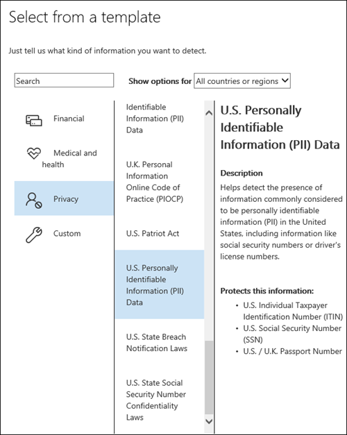

# Aufbewahrungsbezeichnungen automatisch anwenden, um Inhalte beizubehalten oder zu löschenAutomatically apply a retention label to retain or delete content

>*[Microsoft 365-Lizenzierungsleitfaden für Sicherheit und Compliance](https://aka.ms/ComplianceSD).**[Microsoft 365 licensing guidance for security & compliance](https://aka.ms/ComplianceSD).*

Eines der leistungsstärksten Features von [Aufbewahrungsbezeichnungen](retention.md) ist die Möglichkeit, diese automatisch auf Inhalte anzuwenden, die bestimmte Bedingungen erfüllen.One of the most powerful features of [retention labels](retention.md) is the ability to apply them automatically to content that matches specified conditions. In diesem Fall müssen die Personen in Ihrer Organisation die Bezeichnungen nicht selber anwenden.In this case, people in your organization don't need to apply the retention labels. Das wird von Microsoft 365 erledigt.Microsoft 365 does the work for them.
  
Das automatische Anwenden von Aufbewahrungsbezeichnungen ist aus den folgenden Gründen besonders effektiv:Auto-applying retention labels are powerful because:
  
- Sie müssen die Benutzer nicht schulen, damit sie alle Ihre Klassifizierungen kennen.You don't need to train your users on all of your classifications.
    
- Sie müssen sich nicht darauf verlassen, dass die Benutzer alle Inhalte richtig klassifizieren.You don't need to rely on users to classify all content correctly.
    
- Benutzer müssen nicht mehr über Governance-Richtlinien Bescheid wissen, sondern können sich stattdessen auf ihre Arbeit konzentrieren.Users no longer need to know about data governance policies - they can focus on their work.
    
Sie können Aufbewahrungsbezeichnungen automatisch auf Inhalte anwenden, wenn diese Inhalte vertrauliche Informationen, Schlüsselwörter oder durchsuchbare Eigenschaften aufweisen oder [trainierbaren Klassifizierungsmerkmalen](classifier-get-started-with.md) entsprechen.You can apply retention labels to content automatically when that content contains sensitive information, keywords or searchable properties, or a match for [trainable classifiers](classifier-get-started-with.md).

Folgende Prozesse können eine Aufbewahrungsbezeichnung entsprechend dieser Bedingungen automatisch anwenden:The processes to automatically apply a retention label based on these conditions:

Befolgen Sie für die beiden Administratorschritte die nachfolgenden Anweisungen.Use the following instructions for the two admin steps.

> [!NOTE]
> Automatische Richtlinien verwenden dienstseitige Bezeichnungen mit Bedingungen, um Aufbewahrungsbezeichnungen automatisch anzuwenden.Auto-policies use service-side labeling with conditions to automatically apply retention labels. Sie können eine Aufbewahrungsbezeichnung auch automatisch mit einer Bezeichnungsrichtlinie anwenden. Gehen Sie dazu folgendermaßen vor:You can also automatically apply a retention label with a label policy when you do the following: 
>
> - Wenden Sie eine Standardaufbewahrungsbezeichnung auf eine SharePoint-Bibliothek, einen Ordner oder eine Dokumentenmappe an, damit nicht beschriftete Inhalte in diesem Container automatisch gekennzeichnet werdenApply a default retention label to a SharePoint library, folder, or document set so that unlabeled content in that container is automatically labeled
>- Automatisches Anwenden einer Aufbewahrungsbezeichnung auf E-Mails mithilfe von RegelnAutomatically applying a retention label to email by using rules
>
> Informationen zu diesen Szenarien finden Sie unter [Erstellen und Anwenden von Aufbewahrungsbezeichnungen in Apps](create-apply-retention-labels.md).For these scenarios, see [Create and apply retention labels in apps](create-apply-retention-labels.md).

## Bevor Sie beginnenBefore you begin

Der globale Administrator Ihrer Organisation verfügt über umfassende Berechtigungen zum Erstellen und Bearbeiten von Aufbewahrungsbezeichnungen und deren Richtlinien.The global admin for your organization has full permissions to create and edit retention labels and their policies. Wenn Sie sich nicht als globaler Administrator anmelden, lesen Sie [Notwendige Berechtigungen zum Erstellen und Verwalten von Aufbewahrungsrichtlinien und Aufbewahrungsbezeichnungen](get-started-with-retention.md#permissions-required-to-create-and-manage-retention-policies-and-retention-labels).If you aren't signing in as a global admin, see [Permissions required to create and manage retention policies and retention labels](get-started-with-retention.md#permissions-required-to-create-and-manage-retention-policies-and-retention-labels).

## Aufbewahrungsbezeichnungen automatisch anwendenHow to auto-apply a retention label

Erstellen Sie zunächst Ihre Aufbewahrungsbezeichnung.First, create your retention label. Erstellen Sie anschließend eine automatische Richtlinie, um diese Bezeichnung anzuwenden.Then create an auto-policy to apply that label. Wenn Sie Ihre Aufbewahrungsbezeichnung bereits erstellt haben, wechseln Sie zu [Erstellen einer automatischen Richtlinie](#step-2-create-an-auto-apply-policy).If you have already created your retention label, skip to [creating an auto-policy](#step-2-create-an-auto-apply-policy).

Die Navigationsanweisungen sind davon abhängig, ob Sie die [Datensatzverwaltung](records-management.md)verwenden oder nicht.Navigation instructions depend on whether you're using [records management](records-management.md) or not. Es werden Anweisungen für beide Szenarios bereitgestellt.Instructions are provided for both scenarios.

### Schritt 1: Erstellen einer Aufbewahrungsbezeichnung.Step 1: Create a retention label

1. Navigieren Sie im [Microsoft 365 Compliance Center](https://compliance.microsoft.com/) zu einem der folgenden Orte:In the [Microsoft 365 compliance center](https://compliance.microsoft.com/), navigate to one of the following locations:
    
    - Wenn Sie die Datensatzverwaltung verwenden:If you are using records management:
        - **Lösungen** > **Datensatzverwaltung** >  Registerkarte **Dateiplan** > **+ Bezeichnung erstellen** > **Aufbewahrungsbezeichnung****Solutions** > **Records management** > **File plan** tab > **+ Create a label** > **Retention label**
        
    - Wenn Sie die Datensatzverwaltung nicht verwenden:If you are not using records management:
       - **Lösungen** > **Informationsgovernance** >  Registerkarte **Bezeichnungen** > + **Bezeichnung erstellen****Solutions** > **Information governance** > **Labels** tab > + **Create a label**
    
    Sehen Sie nicht sofort die gewünschte Option?Don't immediately see your option? Wählen Sie zuerst **Alle anzeigen** aus.First select **Show all**. 

2. Folgen Sie den Anweisungen des Assistenten.Follow the prompts in the wizard. Wenn Sie die Datensatzverwaltung verwenden:If you are using records management:
    
    - Informationen zu den Dateiplanbeschreibungen finden Sie unter [Verwenden des Dateiplans zum Verwalten von Aufbewahrungsbezeichnungen](file-plan-manager.md).For information about the file plan descriptors, see [Use file plan to manage retention labels](file-plan-manager.md)
    
    - Wenn Sie die Aufbewahrungsbezeichnung verwenden möchten, um einen [Datensatz](records-management.md#records) zu deklarieren, aktivieren Sie die Option **Elemente als Datensatz kennzeichnen**.To use the retention label to declare a [record](records-management.md#records), enable the option **Mark items as a record**.

3. Nachdem Sie die Bezeichnung erstellt haben und Ihnen die Optionen zum Veröffentlichen der Bezeichnung, zum automatischen Anwenden der Bezeichnung oder zum Speichern der Bezeichnung angezeigt werden: Wählen Sie **Diese Bezeichnung automatisch auf einen bestimmten Inhaltstyp anwenden** und dann **Fertig** aus, um den Assistenten zum Erstellen automatischer Bezeichnungen zu starten, der Sie direkt zu Schritt 2 des folgenden Verfahrens führt.After you have created the label and you see the options to publish the label, auto-apply the label, or just save the label: Select **Auto-apply this label to a specific type of content**, and then select **Done** to start the Create auto-labeling wizard that takes you directly to step 2 in the following procedure.

Wenn Sie eine vorhandene Bezeichnung bearbeiten möchten, markieren Sie sie, und wählen Sie dann **Bezeichnung bearbeiten** aus, um den Assistenten zum Bearbeiten der Aufbewahrungsrichtlinie zu starten, mit dem Sie die Bezeichnungsbeschreibungen und alle [zutreffenden Einstellungen](#updating-retention-labels-and-their-policies) aus Schritt 2 ändern können.To edit an existing label, select it, and then select the **Edit label** option to start the Edit retention wizard that lets you change the label descriptions and any [eligible settings](#updating-retention-labels-and-their-policies) from step 2.

### Schritt 2: Erstellen einer Richtlinie für die automatische AnwendungStep 2: Create an auto-apply policy

Wenn Sie eine Richtlinie für die automatische Anwendung erstellen, wird eine gewählte Aufbewahrungsbezeichnung automatisch anhand festgelegter Bedingungen auf Inhalte angewendet.When you create an auto-apply policy, you select a retention label to automatically apply to content, based on the conditions that you specify.

1. Navigieren Sie im [Microsoft 365 Compliance Center](https://compliance.microsoft.com/) zu einem der folgenden Orte:In the [Microsoft 365 compliance center](https://compliance.microsoft.com/), navigate to one of the following locations:
    
    - Wenn Sie die Datensatzverwaltung verwenden: **Informationsgovernance**:If you are using records management: **Information governance**:
        - **Lösungen** > **Datensatzverwaltung** >  Registerkarte **Bezeichnungsrichtlinien** > **Bezeichnung automatisch anwenden****Solutions** > **Records management** > **Label policies** tab > **Auto-apply a label**
    
    - Wenn Sie die Datensatzverwaltung nicht verwenden:If you are not using records management:
        - **Lösungen** > **Informationgovernance** >  Registerkarte **Bezeichnungsrichtlinien** > **Bezeichnung automatisch anwenden****Solutions** > **Information governance** > **Label policies** tab > **Auto-apply a label**
    
    Sehen Sie nicht sofort die gewünschte Option?Don't immediately see your option? Wählen Sie zuerst **Alle anzeigen** aus.First select **Show all**. 

2. Folgen Sie den Eingabeaufforderungen im Assistenten zum Erstellen automatischer Bezeichnungen.Follow the prompts in the Create auto-labeling wizard.
    
    Informationen zum Konfigurieren der Bedingungen, die zur automatischen Anwendung der Aufbewahrungsbezeichnung führen, finden Sie im Abschnitt [Konfigurieren der Bedingungen für automatisch angewendete Aufbewahrungsbezeichnungen](#configuring-conditions-for-auto-apply-retention-labels) auf dieser Seite.For information about configuring the conditions that automatically apply the retention label, see the [Configuring conditions for auto-apply retention labels](#configuring-conditions-for-auto-apply-retention-labels) section on this page.
    
    Informationen über die von Aufbewahrungsbezeichnungen unterstützten Speicherorte finden Sie im Abschnitt [Aufbewahrungsbezeichnungen und -speicherorte](retention.md#retention-label-policies-and-locations).For information about the locations supported by retention labels, see the [Retention labels and locations](retention.md#retention-label-policies-and-locations) section.

Wenn Sie eine vorhandene Richtlinie zum automatischen Anwenden von Bezeichnungen bearbeiten möchten, wählen Sie sie aus, um den Assistenten zum Bearbeiten der Aufbewahrungsrichtlinie zu starten, mit dem Sie die ausgewählte Aufbewahrungsrichtlinie und alle [zutreffenden Einstellungen](#updating-retention-labels-and-their-policies) aus Schritt 2 ändern können.To edit an existing auto-apply policy, select it to start the Edit retention policy wizard that lets you change the selected retention label and any [eligible settings](#updating-retention-labels-and-their-policies) from step 2.

### Konfigurieren der Bedingungen für automatisch angewendete AufbewahrungsbezeichnungenConfiguring conditions for auto-apply retention labels

Aufbewahrungsbezeichnungen können automatisch auf Inhalte angewendet werden, wenn diese folgende Bedingungen erfüllen:You can apply retention labels to content automatically when that content contains:

- [Der Inhalt enthält bestimmte vertrauliche Informationen.Specific types of sensitive information](#auto-apply-labels-to-content-with-specific-types-of-sensitive-information)

- [Der Inhalt enthält bestimmte Stichwörter oder durchsuchbare Eigenschaften, die einer von Ihnen erstellten Abfrage entsprechenSpecific keywords or searchable properties that match a query you create](#auto-apply-labels-to-content-with-keywords-or-searchable-properties)

- [Eine Übereinstimmung für trainierbare KlassifizierungenA match for trainable classifiers](#auto-apply-labels-to-content-by-using-trainable-classifiers)

#### Automatisches Anwenden von Bezeichnungen auf Inhalte mit bestimmten Typen von vertraulichen InformationenAuto-apply labels to content with specific types of sensitive information

Wenn Sie automatisch angewendete Aufbewahrungsbezeichnungen für vertrauliche Informationen erstellen, wird dieselbe Liste von Richtlinienvorlagen wie beim Erstellen einer DLP-Richtlinie (Data Loss Prevention, Verhinderung von Datenverlust) angezeigt.When you create auto-apply retention labels for sensitive information, you see the same list of policy templates as when you create a data loss prevention (DLP) policy. Jede Vorlage ist für die Suche nach bestimmten Typen vertraulicher Informationen vorkonfiguriert.Each template is preconfigured to look for specific types of sensitive information. Die hier gezeigte Vorlage sucht beispielsweise nach US ITIN-, SSN- und Reisepassnummern aus der **Datenschutz**-Kategorie und der Vorlage **USA – Daten mit persönlich identifizierbaren Informationen (PII)**:For example, the template shown here looks for U.S. ITIN, SSN, and passport numbers from the **Privacy** category, and **U.S Personally Identifiable Information (PII) Data template**:

Weitere Informationen zu Typen vertraulicher Informationen finden Sie unter [Entitätsdefinitionen für Typen vertraulicher Informationen](sensitive-information-type-entity-definitions.md).To learn more about the sensitivity information types, see [Sensitive information type entity definitions](sensitive-information-type-entity-definitions.md).

Nach der Auswahl einer Richtlinienvorlage können Sie beliebige Typen vertraulicher Informationen hinzufügen oder entfernen, und Sie können die Instanzenzahl und die Übereinstimmungsgenauigkeit ändern.After you select a policy template, you can add or remove any types of sensitive information, and you can change the instance count and match accuracy. Im folgenden Beispielscreenshot wird eine Aufbewahrungsbezeichnung nur dann automatisch angewendet, wenn Folgendes zutrifft:In the example screenshot shown next, a retention label will be auto-applied only when:
  
- Der erkannte Typ vertraulicher Informationen hat eine Übereinstimmungsgenauigkeit (oder eine Zuverlässigkeitsstufe) von mindestens 75.The type of sensitive information that's detected has a match accuracy (or confidence level) of at least 75. Viele vertrauliche Informationstypen werden mit mehreren Mustern definiert. Dabei erfordert ein Muster mit einer höheren Übereinstimmungsgenauigkeit mehr Nachweise, um gefunden zu werden (z. B. Stichwörter, Datumsangaben oder Adressen), während ein Muster mit einer niedrigeren Übereinstimmungsgenauigkeit weniger Nachweise erfordert. Many sensitive information types are defined with multiple patterns, where a pattern with a higher match accuracy requires more evidence to be found (such as keywords, dates, or addresses), while a pattern with a lower match accuracy requires less evidence. Je niedriger die **minimale** Übereinstimmungsgenauigkeit, desto einfacher können Inhalte die Bedingung erfüllen.The lower the **min** match accuracy, the easier it is for content to match the condition.

- Der Inhalt besteht aus zwischen einer und neun Instanzen von einem dieser drei vertraulichen Informationstypen.The content contains between 1 and 9 instances of any of these three sensitive information types. Sie können den **bis**-Wert löschen, sodass er in **Beliebig** geändert wird.You can delete the **to** value so that it changes to **Any**.

Weitere Informationen zu diesen Optionen finden Sie in der folgenden Anleitung aus der DLP-Dokumentation [Optimieren von Regeln, um Übereinstimmungen zu vereinfachen oder zu erschweren](data-loss-prevention-policies.md#tuning-rules-to-make-them-easier-or-harder-to-match).For more information about these options, see the following guidance from the DLP documentation [Tuning rules to make them easier or harder to match](data-loss-prevention-policies.md#tuning-rules-to-make-them-easier-or-harder-to-match).
    

  
#### Automatisches Anwenden von Bezeichnungen auf Inhalte mit Stichwörtern oder durchsuchbare EigenschaftenAuto-apply labels to content with keywords or searchable properties

Sie können automatische Bezeichnungen auf Inhalte mithilfe einer Abfrage anwenden, die bestimmte Wörter, Ausdrücke oder durchsuchbare Eigenschaften enthält. Sie können Ihre Abfrage mithilfe von Suchoperatoren wie UND, ODER und NICHT verfeinern.You can auto-apply labels to content by using a query that contains specific words, phrases, or values of searchable properties. You can refine your query by using search operators such as AND, OR, and NOT.

Weitere Informationen zur Abfragesyntax, bei der die Keyword Query Language (KQL) angewendet wird, finden Sie unter [Syntaxreferenz für die Keyword Query Language (KQL)](https://docs.microsoft.com/sharepoint/dev/general-development/keyword-query-language-kql-syntax-reference).For more information about the query syntax that uses Keyword Query Language (KQL), see [Keyword Query Language (KQL) syntax reference](https://docs.microsoft.com/sharepoint/dev/general-development/keyword-query-language-kql-syntax-reference).

Abfragebasierte Bezeichnungen verwenden den Suchindex, um Inhalte zu identifizieren.Query-based labels use the search index to identify content. Weitere Informationen zu den durchsuchbaren Eigenschaften, die Sie verwenden können, finden Sie unter:For more information about the searchable properties that you can use, see:

- [Stichwortabfragen und Suchbedingungen für die InhaltssucheKeyword queries and search conditions for Content Search](keyword-queries-and-search-conditions.md)
- [Übersicht über durchforstete und verwaltete Eigenschaften in SharePoint ServerOverview of crawled and managed properties in SharePoint Server](https://docs.microsoft.com/SharePoint/technical-reference/crawled-and-managed-properties-overview)

> [!NOTE]
> Obwohl bei den in SharePoint verwalteten Eigenschaften Aliase unterstützt werden, sollten Sie diese bei der Konfiguration von Aufbewahrungsbezeichnungen nicht verwenden.Although SharePoint managed properties support aliases, don't use these when you configure your retention labels. Sie müssen immer den tatsächlichen Namen der verwalteten Eigenschaft angeben, z. B „RefinableString01“.Always specify the actual name of the managed property, for example, "RefinableString01".

Beispiele für Abfragen:Examples queries:

| ArbeitslastWorkload | BeispielExample |
|:-----|:-----|
|ExchangeExchange   | `subject:"Quarterly Financials"` |
|ExchangeExchange   | `recipients:garthf@contoso.com` |
|SharePointSharePoint | `contenttype:contract` |
|SharePointSharePoint | `site:https://contoso.sharepoint.com/sites/teams/procurement AND contenttype:contract`|

#### Automatisches Anwenden von Bezeichnungen auf Inhalte mithilfe von trainierbare KlassifizierungenAuto-apply labels to content by using trainable classifiers

Wenn Sie die Option für eine trainierbare Klassifizierung auswählen, können Sie eine der integrierten Klassifizierungen oder eine benutzerdefinierte Klassifizierung auswählen.When you choose the option for a trainable classifier, you can select one of the built-in classifiers, or a custom classifier. Zu den integrierten Klassifizierungen gehören **Lebensläufe**, **Quellcode**, **Gezielte Belästigung**, **Vulgäre Ausdrücke** und **Drohungen**:The built-in classifiers include **Resumes**, **SourceCode**, **Targeted Harassment**, **Profanity**, and **Threat**:

> [!CAUTION]
> Die integrierte Klassifizierung **Anstößige Sprache** wird eingestellt, da sie eine große Anzahl falsch positiver Ergebnisse erzeugt hat.We are deprecating the **Offensive Language** built-in classifier because it has been producing a high number of false positives. Verwenden Sie diese integrierte Klassifizierung nicht mehr, und ändern Sie Ihre Geschäftsprozesse entsprechend, falls sie derzeit noch verwendet wird.Don't use this built-in classifier and if you are currently using it, you should move your business processes off it. Wir empfehlen stattdessen die Verwendung der integrierten Klassifizierungen **Gezielte Belästigung**, **Obszönitäten** und **Bedrohung**.We recommend using the **Targeted Harassment**, **Profanity**, and **Threat** built-in classifiers instead.

Wenn Sie eine Bezeichnung mithilfe dieser Option automatisch anwenden möchten, müssen SharePoint-Websites und -Postfächer mindestens 10 MB Daten umfassen.To automatically apply a label by using this option, SharePoint sites and mailboxes must have at least 10 MB of data.

Weitere Informationen über trainierbare Klassifizierer finden Sie unter [Weitere Informationen zu trainierbaren Klassifizierern (Vorschau)](classifier-learn-about.md).For more information about trainable classifiers, see [Learn about trainable classifiers (preview)](classifier-learn-about.md).

> [!TIP]
> Wenn Sie trainierbare Klassifizierungsmerkmale für Exchange verwenden, lesen Sie die kürzlich veröffentlichte [Anleitung zum Neutrainieren einer Klassifizierung im Inhaltsexplorer (Vorschau)](classifier-how-to-retrain-content-explorer.md).If you use trainable classifiers for Exchange, see the recently released [How to retrain a classifier in content explorer (preview)](classifier-how-to-retrain-content-explorer.md).

## Wie lange es dauert, bis Aufbewahrungsbezeichnungen wirksam werdenHow long it takes for retention labels to take effect

Wenn Sie Aufbewahrungsbezeichnungen automatisch anwenden, kann es bis zu sieben Tage dauern, bevor die Aufbewahrungsbezeichnungen auf alle vorhandenen Inhalte angewendet werden, die diesen Kriterien entsprechen.When you auto-apply retention labels, it can take up to seven days for the retention labels to be applied to all existing content that matches the conditions.
  

  
## Aktualisieren von Aufbewahrungsbezeichnungen und der entsprechenden RichtlinienUpdating retention labels and their policies

Wenn Sie eine Aufbewahrungsbezeichnung oder eine Richtlinie für die automatische Anwendung bearbeiten, und die Aufbewahrungsbezeichnung bereits auf Inhalte angewendet wird, werden Ihre aktualisierten Einstellungen automatisch zusätzlich auf diese Inhalte sowie auf neu identifizierte Inhalte angewendet.When you edit a retention label or auto-apply policy, and the retention label is already applied to content, your updated settings will automatically be applied to this content in addition to content that's newly identified.

Einige Einstellungen können nicht geändert werden, nachdem die Bezeichnung oder Richtlinie erstellt und gespeichert wurde. Dazu gehören:Some settings can't be changed after the label or policy is created and saved, which include:
- Die Aufbewahrungseinstellungen außer dem Aufbewahrungszeitraum, es sei denn, Sie haben die Bezeichnung so konfiguriert, dass der Inhalt basierend auf dem Zeitpunkt der Erstellung beibehalten oder gelöscht wird.The retention settings except the retention period, unless you've configured the label to retain or delete the content based on when it was created.
- Die Option zum Markieren von Elementen als Datensatz.The option to mark items as a record.

## Nächste SchritteNext steps

Unter [Verwenden von Aufbewahrungsbezeichnungen zum Verwalten des Lebenszyklus von in SharePoint gespeicherten Dokumenten](auto-apply-retention-labels-scenario.md) finden Sie ein Beispielszenario, in dem eine automatisch angewendete Richtlinie mit verwalteten Eigenschaften in SharePoint und die ereignisbasierte Aufbewahrung zum Starten des Aufbewahrungszeitraums verwendet wird.See [Use retention labels to manage the lifecycle of documents stored in SharePoint](auto-apply-retention-labels-scenario.md) for an example scenario that uses an auto-apply policy with managed properties in SharePoint, and event-based retention to start the retention period.
