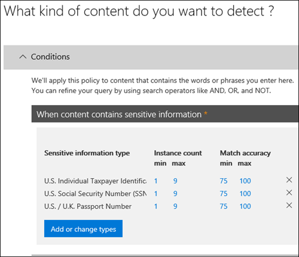

# Aufbewahrungsbezeichnungen automatisch anwenden, um Inhalte beizubehalten oder zu löschenAutomatically apply a retention label to retain or delete content

>*[Microsoft 365-Lizenzierungsleitfaden für Sicherheit und Compliance](https://aka.ms/ComplianceSD).**[Microsoft 365 licensing guidance for security & compliance](https://aka.ms/ComplianceSD).*

Eines der leistungsstärksten Features von [Aufbewahrungsbezeichnungen](retention.md) ist die Möglichkeit, diese automatisch auf Inhalte anzuwenden, die bestimmte Bedingungen erfüllen.One of the most powerful features of [retention labels](retention.md) is the ability to apply them automatically to content that matches specified conditions. In diesem Fall müssen die Personen in Ihrer Organisation die Bezeichnungen nicht selber anwenden.In this case, people in your organization don't need to apply the retention labels. Das wird von Microsoft 365 erledigt.Microsoft 365 does the work for them.
  
Das automatische Anwenden von Aufbewahrungsbezeichnungen ist aus den folgenden Gründen besonders effektiv:Auto-applying retention labels are powerful because:
  
- Sie müssen die Benutzer nicht schulen, damit sie alle Ihre Klassifizierungen kennen.You don't need to train your users on all of your classifications.
    
- Sie müssen sich nicht darauf verlassen, dass die Benutzer alle Inhalte richtig klassifizieren.You don't need to rely on users to classify all content correctly.
    
- Benutzer müssen nicht mehr über Governance-Richtlinien Bescheid wissen, sondern können sich stattdessen auf ihre Arbeit konzentrieren.Users no longer need to know about data governance policies - they can focus on their work.
    
Sie können Aufbewahrungsbezeichnungen automatisch auf Inhalte anwenden, wenn diese Inhalte vertrauliche Informationen oder Schlüsselwörter aufweisen oder [trainierbaren Klassifizierungsmerkmalen](classifier-getting-started-with.md) entsprechen.You can apply retention labels to content automatically when that content contains sensitive information, keywords, or a match for [trainable classifiers](classifier-getting-started-with.md).
    
Folgende Prozesse können eine Aufbewahrungsbezeichnung entsprechend dieser Bedingungen automatisch anwenden:The processes to automatically apply a retention label based on these conditions:

Befolgen Sie für die beiden Administratorschritte die nachfolgenden Anweisungen.Use the following instructions for the two admin steps.

> [!NOTE]
> Automatische Richtlinien verwenden dienstseitige Bezeichnungen mit Bedingungen, um Aufbewahrungsbezeichnungen automatisch anzuwenden.Auto-policies use service-side labeling with conditions to automatically apply retention labels. Sie können eine Aufbewahrungsbezeichnung auch automatisch mit einer Bezeichnungsrichtlinie anwenden. Gehen Sie dazu folgendermaßen vor:You can also automatically apply a retention label with a label policy when you do the following: 
>
> - Wenden Sie eine Standardaufbewahrungsbezeichnung auf eine SharePoint-Bibliothek, einen Ordner oder eine Dokumentenmappe an, damit nicht beschriftete Inhalte in diesem Container automatisch gekennzeichnet werdenApply a default retention label to a SharePoint library, folder, or document set so that unlabeled content in that container is automatically labeled
>- Automatisches Anwenden einer Aufbewahrungsbezeichnung auf E-Mails mithilfe von RegelnAutomatically applying a retention label to email by using rules
>
> Informationen zu diesen Szenarien finden Sie unter [Erstellen und Anwenden von Aufbewahrungsbezeichnungen in Apps](create-apply-retention-labels.md).For these scenarios, see [Create and apply retention labels in apps](create-apply-retention-labels.md).

## Bevor Sie beginnenBefore you begin

Der globale Administrator Ihrer Organisation verfügt über umfassende Berechtigungen zum Erstellen und Bearbeiten von Aufbewahrungsbezeichnungen und deren Richtlinien.The global admin for your organization has full permissions to create and edit retention labels and their policies. Wenn Sie sich nicht als globaler Administrator anmelden, lesen Sie [Notwendige Berechtigungen zum Erstellen und Verwalten von Aufbewahrungsrichtlinien und Aufbewahrungsbezeichnungen](get-started-with-retention.md#permissions-required-to-create-and-manage-retention-policies-and-retention-labels).If you aren't signing in as a global admin, see [Permissions required to create and manage retention policies and retention labels](get-started-with-retention.md#permissions-required-to-create-and-manage-retention-policies-and-retention-labels).

## Aufbewahrungsbezeichnungen automatisch anwendenHow to auto-apply a retention label

Erstellen Sie zunächst Ihre Aufbewahrungsbezeichnung.First, create your retention label. Erstellen Sie anschließend eine automatische Richtlinie, um diese Bezeichnung anzuwenden.Then create an auto-policy to apply that label. Wenn Sie Ihre Aufbewahrungsbezeichnung bereits erstellt haben, wechseln Sie zu [Erstellen einer automatischen Richtlinie](#step-2-create-an-auto-apply-policy).If you have already created your retention label, skip to [creating an auto-policy](#step-2-create-an-auto-apply-policy).

Die Navigationsanweisungen sind davon abhängig, ob Sie die [Datensatzverwaltung](records-management.md)verwenden oder nicht.Navigation instructions depend on whether you're using [records management](records-management.md) or not. Es werden Anweisungen für beide Szenarios bereitgestellt.Instructions are provided for both scenarios.

### Schritt 1: Erstellen einer Aufbewahrungsbezeichnung.Step 1: Create a retention label

1. Navigieren Sie im [Microsoft 365 Compliance Center](https://compliance.microsoft.com/) zu einem der folgenden Orte:In the [Microsoft 365 compliance center](https://compliance.microsoft.com/), navigate to one of the following locations:
    
    - Wenn Sie die Datensatzverwaltung verwenden:If you are using records management:
        - **Lösungen** > **Datensatzverwaltung** >  Registerkarte **Dateiplan** > **+ Bezeichnung erstellen** > **Aufbewahrungsbezeichnung****Solutions** > **Records management** > **File plan** tab > **+ Create a label** > **Retention label**
        
    - Wenn Sie die Datensatzverwaltung nicht verwenden:If you are not using records management:
       - **Lösungen** > **Informationsgovernance** >  Registerkarte **Bezeichnungen** > + **Bezeichnung erstellen****Solutions** > **Information governance** > **Labels** tab > + **Create a label**
    
    Sehen Sie nicht sofort die gewünschte Option?Don't immediately see your option? Wählen Sie zuerst **Alle anzeigen** aus.First select **Show all**. 

2. Folgen Sie den Anweisungen des Assistenten.Follow the prompts in the wizard. Wenn Sie die Datensatzverwaltung verwenden:If you are using records management:
    
    - Informationen zu den Dateiplanbeschreibungen finden Sie unter [Verwenden des Dateiplans zum Verwalten von Aufbewahrungsbezeichnungen](file-plan-manager.md).For information about the file plan descriptors, see [Use file plan to manage retention labels](file-plan-manager.md)
    
    - Wenn Sie mithilfe der Aufbewahrungsbezeichnung Inhalt als Datensatz deklarieren möchten, aktivieren Sie das Kontrollkästchen **Bezeichnung zum Klassifizieren von Inhalt als Datensatz verwenden**.To use the retention label to declare content as a record, enable the checkbox **Use label to classify content as a "Record"**.

Wenn Sie eine vorhandene Bezeichnung bearbeiten möchten, wählen Sie sie aus, und wählen Sie dann **Bezeichnung bearbeiten** aus, um den gleichen Assistenten zu starten, mit dem Sie die Beschreibungen der Bezeichnung und alle [zutreffenden Einstellungen](#updating-retention-labels-and-their-policies) aus Schritt 2 ändern können.To edit an existing label, select it, and then select **Edit label** to start the same wizard that lets you change the label descriptions and any [eligible settings](#updating-retention-labels-and-their-policies) from step 2. Wählen Sie alternativ eine der verfügbaren **Bearbeitungsoptionen** aus, um direkt zur entsprechenden Seite zu wechseln und die Aktualisierung vorzunehmen.Alternatively, select any of the available **Edit** options to go directly to the relevant page to make your update.

### Schritt 2: Erstellen einer Richtlinie für die automatische AnwendungStep 2: Create an auto-apply policy

Wenn Sie eine Richtlinie für die automatische Anwendung erstellen, wird eine gewählte Aufbewahrungsbezeichnung automatisch anhand festgelegter Bedingungen auf Inhalte angewendet.When you create an auto-apply policy, you select a retention label to automatically apply to content, based on the conditions that you specify.

1. Navigieren Sie im [Microsoft 365 Compliance Center](https://compliance.microsoft.com/) zu einem der folgenden Orte:In the [Microsoft 365 compliance center](https://compliance.microsoft.com/), navigate to one of the following locations:
    
    - Wenn Sie die Datensatzverwaltung verwenden: **Informationsgovernance**:If you are using records management: **Information governance**:
        - **Lösungen** > **Datensatzverwaltung** >  Registerkarte **Bezeichnungsrichtlinien** > **Bezeichnung automatisch anwenden****Solutions** > **Records management** > **Label policies** tab > **Auto-apply label**
    
    - Wenn Sie die Datensatzverwaltung nicht verwenden:If you are not using records management:
        - **Lösungen** > **Informationgovernance** >  Registerkarte **Bezeichnungsrichtlinien** > **Bezeichnung automatisch anwenden****Solutions** > **Information governance** > **Label policies** tab > **Auto-apply label**
    
    Sehen Sie nicht sofort die gewünschte Option?Don't immediately see your option? Wählen Sie zuerst **Alle anzeigen** aus.First select **Show all**. 

2. Folgen Sie den Anweisungen des Assistenten.Follow the prompts in the wizard.
    
    Informationen zum Konfigurieren der Bedingungen, die zur automatischen Anwendung der Aufbewahrungsbezeichnung führen, finden Sie im Abschnitt [Konfigurieren der Bedingungen für automatisch angewendete Aufbewahrungsbezeichnungen](#configuring-conditions-for-auto-apply-retention-labels) auf dieser Seite.For information about configuring the conditions that automatically apply the retention label, see the [Configuring conditions for auto-apply retention labels](#configuring-conditions-for-auto-apply-retention-labels) section on this page.
    
    Informationen über die von Aufbewahrungsbezeichnungen unterstützten Speicherorte finden Sie im Abschnitt [Aufbewahrungsbezeichnungen und -speicherorte](retention.md#retention-label-policies-and-locations).For information about the locations supported by retention labels, see the [Retention labels and locations](retention.md#retention-label-policies-and-locations) section.

Wenn Sie eine vorhandene Richtlinie zum automatischen Anwenden von Bezeichnungen bearbeiten möchten, wählen Sie sie aus, und wählen Sie dann **Richtlinie bearbeiten** aus, um den gleichen Assistenten zu starten, mit dem Sie die Richtlinienbeschreibung und alle [zutreffenden Einstellungen](#updating-retention-labels-and-their-policies) aus Schritt 2 ändern können.To edit an existing auto-apply label policy, select it, and then select **Edit policy** to start the same wizard that lets you change the policy description and any [eligible settings](#updating-retention-labels-and-their-policies) from step 2. Wählen Sie alternativ eine der verfügbaren **Bearbeitungsoptionen** aus, um direkt zur entsprechenden Seite zu wechseln und die Aktualisierung vorzunehmen.Alternatively, select any of the available **Edit** options to go directly to the relevant page to make your update.

### Konfigurieren der Bedingungen für automatisch angewendete AufbewahrungsbezeichnungenConfiguring conditions for auto-apply retention labels

Aufbewahrungsbezeichnungen können automatisch auf Inhalte angewendet werden, wenn diese folgende Bedingungen erfüllen:You can apply retention labels to content automatically when that content contains:

- [Der Inhalt enthält bestimmte vertrauliche Informationen.Specific types of sensitive information](#auto-apply-labels-to-content-with-specific-types-of-sensitive-information)

- [Der Inhalt enthält bestimmte Stichwörter, die einer von Ihnen erstellten Abfrage entsprechen.Specific keywords that match a query you create](#auto-apply-labels-to-content-with-keywords-or-searchable-properties)

- [Eine Übereinstimmung für trainierbare KlassifizierungenA match for trainable classifiers](#auto-apply-labels-to-content-by-using-trainable-classifiers)

#### Automatisches Anwenden von Bezeichnungen auf Inhalte mit bestimmten Typen von vertraulichen InformationenAuto-apply labels to content with specific types of sensitive information

Wenn Sie automatisch angewendete Aufbewahrungsbezeichnungen für vertrauliche Informationen erstellen, wird dieselbe Liste von Richtlinienvorlagen wie beim Erstellen einer DLP-Richtlinie (Data Loss Prevention, Verhinderung von Datenverlust) angezeigt.When you create auto-apply retention labels for sensitive information, you see the same list of policy templates as when you create a data loss prevention (DLP) policy. Jede Richtlinienvorlage ist für die Suche nach bestimmten Typen vertraulicher Informationen vorkonfiguriert.Each policy template is preconfigured to look for specific types of sensitive information. Die hier wiedergegebene Vorlage sucht beispielsweise nach US-amerikanischen Steuernummern für Privatpersonen (ITIN), Sozialversicherungsnummern (SSN) und Reisepassnummern.For example, the template shown here looks for U.S. ITIN, SSN, and passport numbers. Weitere Informationen zu DLP finden Sie unter [Übersicht über Richtlinien zur Verhinderung von Datenverlust](data-loss-prevention-policies.md).To learn more about DLP, see [Overview of data loss prevention policies](data-loss-prevention-policies.md).
  

  
Nach der Auswahl einer Richtlinienvorlage können Sie alle Arten von vertraulichen Informationen hinzufügen oder entfernen, und Sie können die Instanzenanzahl ändern und die Genauigkeit abgleichen. Im hier gezeigten Beispiel wird eine Aufbewahrungsbezeichnung nur dann automatisch angewendet, wenn Folgendes zutrifft:After you select a policy template, you can add or remove any types of sensitive information, and you can change the instance count and match accuracy. In the example shown here, a retention label will be auto-applied only when:
  
- Der Inhalt besteht aus 1 bis 9 Instanzen einer der drei folgenden Typen von vertraulichen Informationen. Sie können den **max**-Wert löschen, sodass er sich in **any** ändert.The content contains between 1 and 9 instances of any of these three sensitive information types. You can delete the **max** value so that it changes to **any**.
    
- Der erkannte Typ vertraulicher Informationen hat eine Übereinstimmungsgenauigkeit (oder eine Zuverlässigkeitsstufe) von mindestens 75.The type of sensitive information that's detected has a match accuracy (or confidence level) of at least 75. Viele vertrauliche Informationstypen werden mit mehreren Mustern definiert. Dabei erfordert ein Muster mit einer höheren Übereinstimmungsgenauigkeit mehr Nachweise, um gefunden zu werden (z. B. Stichwörter, Datumsangaben oder Adressen), während ein Muster mit einer niedrigeren Übereinstimmungsgenauigkeit weniger Nachweise erfordert. Many sensitive information types are defined with multiple patterns, where a pattern with a higher match accuracy requires more evidence to be found (such as keywords, dates, or addresses), while a pattern with a lower match accuracy requires less evidence. Je niedriger die **minimale** Übereinstimmungsgenauigkeit, desto einfacher können Inhalte die Bedingung erfüllen.The lower the **min** match accuracy, the easier it is for content to match the condition. 
    
Weitere Informationen zu diesen Optionen finden Sie unter [Optimieren von Regeln, um die Übereinstimmung zu vereinfachen oder zu erschweren](data-loss-prevention-policies.md#tuning-rules-to-make-them-easier-or-harder-to-match).For more information on these options, see [Tuning rules to make them easier or harder to match](data-loss-prevention-policies.md#tuning-rules-to-make-them-easier-or-harder-to-match).
    

  
#### Automatisches Anwenden von Bezeichnungen auf Inhalte mit Stichwörtern oder durchsuchbare EigenschaftenAuto-apply labels to content with keywords or searchable properties

Sie können automatische Bezeichnungen auf Inhalte anwenden, die bestimmte Kriterien erfüllen. Die derzeit verfügbaren Bedingungen unterstützen das Anwenden einer Bezeichnung auf Inhalte, die bestimmte Wörter, Ausdrücke oder durchsuchbare Eigenschaften enthalten. Sie können Ihre Abfrage mithilfe von Suchoperatoren wie UND, ODER und NICHT verfeinern.You can auto-apply labels to content that satisfies certain conditions. The conditions now available support applying a label to content that contains specific words, phrases, or values of searchable properties. You can refine your query by using search operators like AND, OR, and NOT.

Weitere Informationen zur Abfragesyntax finden Sie unter:For more information on query syntax, see:

- [Syntaxreferenz für die Keyword Query Language (KQL)Keyword Query Language (KQL) syntax reference](https://docs.microsoft.com/sharepoint/dev/general-development/keyword-query-language-kql-syntax-reference)

Abfragebasierte Bezeichnungen verwenden den Suchindex zum Identifizieren von Inhalten. Weitere Informationen zu gültigen durchsuchbaren Eigenschaften finden Sie unter:Query-based labels use the search index to identify content. For more information on valid searchable properties, see:

- [Stichwortabfragen und Suchbedingungen für die InhaltssucheKeyword queries and search conditions for Content Search](keyword-queries-and-search-conditions.md)
- [Übersicht über durchforstete und verwaltete Eigenschaften in SharePoint ServerOverview of crawled and managed properties in SharePoint Server](https://docs.microsoft.com/SharePoint/technical-reference/crawled-and-managed-properties-overview)

Beispiele für Abfragen:Examples queries:

- ExchangeExchange
    - Betreff: „Vierteljährliche Finanzdaten“subject:"Quarterly Financials"
    - recipients:garthfrecipients:garthf<!--nolink-->@contoso.com@contoso.com
- SharePoint und OneDriveSharePoint and OneDrive
    - contenttype:contractcontenttype:contract
    - site:httpssite:https<!--nolink-->://contoso.sharepoint.com/sites/teams/procurement AND contenttype:contract://contoso.sharepoint.com/sites/teams/procurement AND contenttype:contract

#### Automatisches Anwenden von Bezeichnungen auf Inhalte mithilfe von trainierbare KlassifizierungenAuto-apply labels to content by using trainable classifiers

Wenn Sie die Option für eine trainierbare Klassifizierung auswählen, können Sie eine der integrierten Klassifizierungen oder eine benutzerdefinierte Klassifizierung auswählen.When you choose the option for a trainable classifier, you can select one of the built-in classifiers, or a custom classifier. Zu den integrierten Klassifizierungen gehören **Lebensläufe**, **Quellcode**, **Gezielte Belästigung**, **Vulgäre Ausdrücke** und **Drohungen**:The built-in classifiers include **Resumes**, **SourceCode**, **Targeted Harassment**, **Profanity**, and **Threat**:

> [!CAUTION]
> Die integrierte Klassifizierung **Anstößige Sprache** wird eingestellt, da sie eine große Anzahl falsch positiver Ergebnisse erzeugt hat.We are deprecating the **Offensive Language** built-in classifier because it has been producing a high number of false positives. Verwenden Sie diese integrierte Klassifizierung nicht mehr, und ändern Sie Ihre Geschäftsprozesse entsprechend, falls sie derzeit noch verwendet wird.Don't use this built-in classifier and if you are currently using it, you should move your business processes off it. Wir empfehlen stattdessen die Verwendung der integrierten Klassifizierungen **Gezielte Belästigung**, **Obszönitäten** und **Bedrohung**.We recommend using the **Targeted Harassment**, **Profanity**, and **Threat** built-in classifiers instead.

Wenn Sie eine Bezeichnung mithilfe dieser Option automatisch anwenden möchten, müssen SharePoint Online-Websites und -Postfächer mindestens 10 MB Daten umfassen.To automatically apply a label by using this option, SharePoint Online sites and mailboxes must have at least 10 MB of data.

Weitere Informationen zu trainierbaren Klassifizierungen finden Sie unter [Erste Schritte mit trainierbaren Klassifizierungen (Vorschau)](classifier-getting-started-with.md).For more information about trainable classifiers, see [Getting started with trainable classifiers (preview)](classifier-getting-started-with.md).

Eine Beispielkonfiguration finden Sie unter [Vorbereiten und Verwenden einer eingebauten Klassifizierung](classifier-using-a-ready-to-use-classifier.md#how-to-verify-that-a-built-in-classifier-will-meet-your-needs).For an example configuration, see [How to prepare for and use a built-in classifier](classifier-using-a-ready-to-use-classifier.md#how-to-verify-that-a-built-in-classifier-will-meet-your-needs).

## Wie lange es dauert, bis Aufbewahrungsbezeichnungen wirksam werdenHow long it takes for retention labels to take effect

Wenn Sie Aufbewahrungsbezeichnungen automatisch anwenden, kann es bis zu sieben Tage dauern, bevor die Aufbewahrungsbezeichnungen auf alle vorhandenen Inhalte angewendet werden, die diesen Kriterien entsprechen.When you auto-apply retention labels, it can take up to seven days for the retention labels to be applied to all existing content that matches the conditions.
  

  
## Aktualisieren von Aufbewahrungsbezeichnungen und der entsprechenden RichtlinienUpdating retention labels and their policies

Wenn Sie eine Aufbewahrungsbezeichnung oder eine Richtlinie für die automatische Anwendung bearbeiten, und die Aufbewahrungsbezeichnung bereits auf Inhalte angewendet wird, werden Ihre aktualisierten Einstellungen automatisch zusätzlich auf diese Inhalte sowie auf neu identifizierte Inhalte angewendet.When you edit a retention label or auto-apply policy, and the retention label is already applied to content, your updated settings will automatically be applied to this content in addition to content that's newly identified.

Einige Einstellungen können nicht geändert werden, nachdem die Bezeichnung oder Richtlinie erstellt und gespeichert wurde. Dazu gehören:Some settings can't be changed after the label or policy is created and saved, which include:
- Die Aufbewahrungseinstellungen außer dem Aufbewahrungszeitraum, es sei denn, Sie haben die Bezeichnung so konfiguriert, dass der Inhalt basierend auf dem Zeitpunkt der Erstellung beibehalten oder gelöscht wird.The retention settings except the retention period, unless you've configured the label to retain or delete the content based on when it was created.
- Die Option zum Klassifizieren als Datensatz.The option to classify as a record.

## Nächste SchritteNext steps

Unter [Verwenden von Aufbewahrungsbezeichnungen zum Verwalten des Lebenszyklus von in SharePoint gespeicherten Dokumenten](auto-apply-retention-labels-scenario.md) finden Sie ein Beispielszenario, in dem eine automatisch angewendete Richtlinie mit verwalteten Eigenschaften in SharePoint und die ereignisbasierte Aufbewahrung zum Starten des Aufbewahrungszeitraums verwendet wird.See [Use retention labels to manage the lifecycle of documents stored in SharePoint](auto-apply-retention-labels-scenario.md) for an example scenario that uses an auto-apply policy with managed properties in SharePoint, and event-based retention to start the retention period.