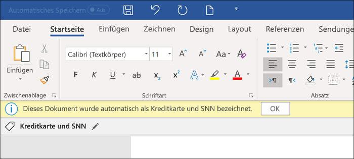

# Automatisches Anwenden einer Vertraulichkeitsbezeichnung auf InhalteApply a sensitivity label to content automatically

>*[Microsoft 365-Lizenzierungsleitfaden für Sicherheit & Compliance](https://aka.ms/ComplianceSD).**[Microsoft 365 licensing guidance for security & compliance](https://aka.ms/ComplianceSD).*

Wenn Sie ein Vertraulichkeitsbezeichnung erstellen, können Sie dieses Etikett automatisch zu Inhalt zuweisen, wenn er den von Ihnen angegebenen Bedingungen entspricht.When you create a sensitivity label, you can automatically assign that label to content when it matches conditions that you specify.

Die Möglichkeit, Vertraulichkeitsbezeichnungen automatisch auf Inhalte anzuwenden, ist aus den folgenden Gründen wichtig:The ability to apply sensitivity labels to content automatically is important because:

- Sie müssen die Benutzer nicht schulen, wann sie Ihre Klassifizierungen verwenden sollen.You don't need to train your users when to use each of your classifications.

- Sie müssen sich nicht darauf verlassen, dass die Benutzer alle Inhalte richtig klassifizieren.You don't need to rely on users to classify all content correctly.

- Benutzer müssen nicht mehr über Ihre Richtlinien Bescheid wissen, sondern können sich stattdessen auf ihre Arbeit konzentrieren.Users no longer need to know about your policies — they can instead focus on their work.

Es gibt zwei unterschiedliche Methoden für die automatische Anwendung einer Vertraulichkeitsbezeichnung:There are two different methods for automatically applying a sensitivity label:

- **Clientseitige Bezeichnung, wenn Benutzer Dokumente bearbeiten oder E-Mails verfassen (auch beantworten oder weiterleiten)**: Verwenden Sie ein Label, das für die automatische Bezeichnung für Office-Anwendungen (Word, Excel, PowerPoint und Outlook) konfiguriert ist.**Client-side labeling when users edit documents or compose (also reply or forward) emails**: Use a label that's configured for auto-labeling for Office apps (Word, Excel, PowerPoint, and Outlook). 
    
    Diese Methode unterstützt das Empfehlen einer Bezeichnung für Benutzer sowie das automatische Anwenden einer Bezeichnung.This method supports recommending a label to users, as well as automatically applying a label. In beiden Fällen entscheidet der Benutzer aber, ob die Bezeichnung angenommen oder abgelehnt werden soll, um die richtige Bezeichnung von Inhalten zu gewährleisten.But in both cases, the user decides whether to accept or reject the label, to help ensure the correct labeling of content. Diese clientseitige Beschriftung hat nur minimale Verzögerungen für Dokumente, da die Bezeichnung noch vor dem Speichern des Dokuments angewendet werden kann.This client-side labeling has minimal delay for documents because the label can be applied even before the document is saved. Allerdings unterstützen nicht alle Client-Apps die automatische Bezeichnung.However, not all client apps support auto-labeling. Diese Fähigkeit wird durch den Assistent für einheitliche Bezeichnungen von Azure Information Protection und [einige Versionen von Office](sensitivity-labels-office-apps.md#support-for-sensitivity-label-capabilities-in-apps) unterstützt.This capability is supported by the Azure Information Protection unified labeling client, and [some versions of Office](sensitivity-labels-office-apps.md#support-for-sensitivity-label-capabilities-in-apps). 
    
    Konfigurationsanweisungen finden Sie unter [Konfigurieren der automatischen Bezeichnung von Office-Apps](#how-to-configure-auto-labeling-for-office-apps) auf dieser Seite.For configuration instructions, see [How to configure auto-labeling for Office apps](#how-to-configure-auto-labeling-for-office-apps) on this page.

- **Dienstseitige Kennzeichnung, wenn der Inhalt bereits gespeichert (in SharePoint Online oder OneDrive for Business) oder per E-Mail versandt (von Exchange Online verarbeitet) wurde**: Verwenden Sie eine automatische Bezeichnungsrichtlinie – aktuell in der Vorschau.**Service-side labeling when content is already saved (in SharePoint Online or OneDrive for Business) or emailed (processed by Exchange Online)**: Use an auto-labeling policy—currently in preview. 
    
    > [!NOTE]
    > Sehen Sie sich die Ankündigung der Vorschau an, die die [Public Preview der automatischen Klassifizierung mit Vertraulichkeitsbezeichnungen in Microsoft 365-Diensten ankündigt](https://techcommunity.microsoft.com/t5/security-privacy-and-compliance/announcing-public-preview-of-auto-classification-with/ba-p/1279961).See the preview announcement, [Announcing public preview of auto classification with sensitivity labels in Microsoft 365 services](https://techcommunity.microsoft.com/t5/security-privacy-and-compliance/announcing-public-preview-of-auto-classification-with/ba-p/1279961).
    
    Diese Methode wird Autoklassifizierung mit Vertraulichkeitsbezeichnungen genannt.This method is referred to as auto classification with sensitivity labels. Möglicherweise wird sie auch als automatische Bezeichnung für ruhende Daten (Dokumente in Microsoft Office SharePoint Online und OneDrive) und Daten im Transit (E-Mails, die von Exchange gesendet oder empfangen werden).You might also hear it referred to as auto-labeling for data at rest (documents in SharePoint and OneDrive) and data in transit (email that is sent or received by Exchange). Bei Exchange sind keine ruhenden E-Mail-Nachrichten enthalten (Postfächer).For Exchange, it doesn't include emails at rest (mailboxes). 
    
    Da diese Bezeichnung eher von Diensten als von Anwendungen angewendet wird, müssen Sie sich keine Gedanken darüber machen, welche Apps-Benutzer über welche Version verfügen.Because this labeling is applied by services rather than by applications, you don't need to worry about what apps users have and what version. Dies hat zur Folge, dass diese Funktion sofort in ihrer gesamten Organisation zur Verfügung steht, und sie eignet sich für Bezeichnungen jeder Größe.As a result, this capability is immediately available throughout your organization and suitable for labeling at scale. Richtlinien zum automatischen Bezeichnen unterstützen die empfohlene Bezeichnung nicht, da der Benutzer nicht mit dem Bezeichnungsprozess interagiert.Auto-labeling policies don't support recommended labeling because the user doesn't interact with the labeling process. Stattdessen führt der Administrator die Richtlinien im Simulationsmodus aus, um sicherzustellen, dass der Inhalt korrekt bezeichnet wird, bevor die Bezeichnung tatsächlich angewendet wird.Instead, the administrator runs the policies in simulation mode to help ensure the correct labeling of content before actually applying the label.
    
    Konfigurationsanweisungen finden Sie unter [Konfigurieren von Richtlinien zum automatischen Bezeichnen für Microsoft Office SharePoint Online, OneDrive und Exchange](#how-to-configure-auto-labeling-policies-for-sharepoint-onedrive-and-exchange) auf dieser Seite.For configuration instructions, see [How to configure auto-labeling policies for SharePoint, OneDrive, and Exchange](#how-to-configure-auto-labeling-policies-for-sharepoint-onedrive-and-exchange) on this page.
    
    Speziell für die automatische Bezeichnung von Microsoft Office SharePoint Online und OneDrive gilt:Specific to auto-labeling for SharePoint and OneDrive:
    - maximale Anzahl von 25.000 Dateien (Word, PowerPoint oder Excel) in Ihrem Mandanten pro TagMaximum number of 25,000 files (Word, PowerPoint, or Excel) in your tenant per day
    - maximale Anzahl von 10 Websitesammlungen in allen RichtlinienMaximum number of 10 sites collections across all policies
    - maximale Anzahl von 10 Richtlinien für den gesamten MandantenMaximum number of 10 policies across your tenant

    Spezifisch für die automatische Bezeichnung für Exchange gilt:Specific to auto-labeling for Exchange:
    - Im Gegensatz zur manuellen oder automatischen Bezeichnung von Office-Apps werden Office-Anlagen ebenfalls auf die Bedingungen überprüft, die Sie in der Richtlinie zur automatischen Bezeichnung angeben.Unlike manual labeling or auto-labeling with Office apps, Office attachments are also scanned for the conditions you specify in your auto-labeling policy. Wenn es eine Übereinstimmung gibt, wird die E-Mail-Adresse, aber nicht die Anlage bezeichnet.When there is a match, the email is labeled but not the attachment.
    - Wenn Sie über Exchange-Mailflussregeln oder DLP-Richtlinien (Verhinderung von Datenverlust) verfügen, welche die IRM-Verschlüsselung anwenden: Wenn Inhalte durch diese Regeln oder Richtlinien und eine Richtlinie zum automatischen Bezeichnen identifiziert werden, wird die Bezeichnung angewendet.If you have Exchange mail flow rules or data loss prevention (DLP) policies that apply IRM encryption: When content is identified by these rules or policies and an auto-labeling policy, the label is applied. Wenn diese Bezeichnung Verschlüsselung anwendet, werden die IRM-Einstellungen aus den Exchange-E-Mail-Flussregeln oder DLP-Richtlinien ignoriert.If that label applies encryption, the IRM settings from the Exchange mail flow rules or DLP policies are ignored. Wenn diese Bezeichnung jedoch keine Verschlüsselung anwendet, werden die IRM-Einstellungen aus den E-Mail-Flussregeln oder DLP-Richtlinien zusätzlich zu der Bezeichnung angewendet.However, if that label doesn't apply encryption, the IRM settings from the mail flow rules or DLP policies are applied in addition to the label.
    - E-Mails, die eine IRM-Verschlüsselung ohne Bezeichnung haben, werden durch eine Bezeichnung mit beliebigen Verschlüsselungseinstellungen ersetzt, wenn eine Übereinstimmung durch die Verwendung automatischer Bezeichnung vorliegt.Email that has IRM encryption with no label will be replaced by a label with any encryption settings when there is a match by using auto-labeling.
    - Eingehende E-Mails werden bezeichnet, wenn eine Übereinstimmung mit den Bedingungen für die automatische Bezeichnung vorliegt.Incoming email is labeled when there is a match with your auto-labeling conditions. Wenn die Bezeichnung für die Verschlüsselung konfiguriert ist, wird diese Verschlüsselung jedoch nicht angewendet.However, if the label is configured for encryption, that encryption isn't applied.
    

## Vergleichen Sie das automatische Bezeichnen für Office-Anwendungen mit den Richtlinien für das automatische BezeichnenCompare auto-labeling for Office apps with auto-labeling policies

Verwenden Sie die folgende Tabelle, um die Unterschiede im Verhalten der beiden sich ergänzenden, automatischen Bezeichnungsmethoden zu erkennen:Use the following table to help you identify the differences in behavior for the two complementary automatic labeling methods:

|Feature oder VerhaltenFeature or behavior|Bezeichnungseinstellung: automatisches Bezeichnen für Office-AnwendungenLabel setting: Auto-labeling for Office apps |Richtlinie: automatisches BezeichnenPolicy: Auto-labeling|
|:-----|:-----|:-----|:-----|
|App-AbhängigkeitApp dependency|[JaYes](sensitivity-labels-office-apps.md#support-for-sensitivity-label-capabilities-in-apps) |NeinNo |
|Nach Speicherort einschränkenRestrict by location|NeinNo |JaYes |
|Bedingungen: trainierbare KlassifiziererConditions: Trainable classifers|Ja (beschränkte Vorschau)Yes (limited preview) |NeinNo |
|Bedingungen: Freigabeoptionen und zusätzliche E-Mail-OptionenConditions: Sharing options and additional options for email|NeinNo |JaYes |
|Empfehlungen, Richtlinien-Tooltipps und Benutzer-AußerkraftsetzungenRecommendations, policy tooltip, and user overrides|JaYes |NeinNo |
|SimulationsmodusSimulation mode|NeinNo |JaYes |
|Exchange-Anlagen auf Bedingungen geprüftExchange attachments checked for conditions|NeinNo | JaYes|
|Visuelle Markierungen anwendenApply visual markings |JaYes |Ja (nur E-Mail)Yes (email only) |
|Außerkraftsetzen der IRM-Verschlüsselung ohne Bezeichnung angewendetOverride IRM encryption applied without a label|Ja, wenn der Benutzer das Mindestnutzungsrecht des Exportierens hatYes if the user has the minimum usage right of Export |Ja (nur E-Mail)Yes (email only) |
|Bezeichnen eingehender E-MailsLabel incoming email|NeinNo |Ja (Verschlüsselung nicht angewendet)Yes (encryption not applied) |

> [!NOTE]
> Wenn der Inhalt manuell bezeichnet wurde, wird diese Bezeichnung niemals durch automatisches Bezeichnen ersetzt.When content has been manually labeled, that label will never be replaced by automatic labeling. Richtlinien der automatischen Bezeichnung können jedoch eine [Bezeichnung niedrigerer Priorität](sensitivity-labels.md#label-priority-order-matters) ersetzen, das durch die Verwendung der automatischen Bezeichnung für Office-Anwendungen angewendet wurde.However, auto-labeling policies can replace a [lower priority label](sensitivity-labels.md#label-priority-order-matters) that was applied by using auto-labeling for Office apps.

## Auswerten mehrerer Kriterien, wenn sie für mehr als eine Bezeichnung zutreffenHow multiple conditions are evaluated when they apply to more than one label

Die Bezeichnungen werden je nach Position, die Sie in der Richtlinie festlegen, sortiert: die Bezeichnung an erster Stelle hat die niedrigste Position (am wenigsten vertraulich) und die Bezeichnung an letzter Stelle hat die höchste Position (am meisten vertraulich). Weitere Informationen zur Priorität finden Sie unter [Priorität der Bezeichnungen (Reihenfolge wesentlich)](sensitivity-labels.md#label-priority-order-matters).The labels are ordered for evaluation according to their position that you specify in the policy: The label positioned first has the lowest position (least sensitive) and the label positioned last has the highest position (most sensitive). For more information on priority, see [Label priority (order matters)](sensitivity-labels.md#label-priority-order-matters).

## Konfigurieren Sie keine übergeordnete Bezeichnung, die automatisch angewendet oder empfohlen wird.Don't configure a parent label to be applied automatically or recommended

Denken Sie daran, dass Sie eine übergeordnete Bezeichnung (eine Bezeichnung mit Unterbezeichnungen) nicht auf Inhalt anwenden können.Remember, you can't apply a parent label (a label with sublabels) to content. Stellen Sie sicher, dass Sie eine übergeordnete Bezeichnung nicht so konfigurieren, dass sie automatisch angewendet oder empfohlen wird, da die übergeordnete Bezeichnung nicht auf Inhalt in Office-Apps angewendet wird, die den Azure Information Protection-Client mit einheitlichen Bezeichnungen verwenden.Make sure that you don't configure a parent label to be auto-applied or recommended, because the parent label won't be applied to content in Office apps that use the Azure Information Protection unified labeling client. Weitere Informationen zu übergeordneten Bezeichnungen und Unterbezeichnungen finden Sie unter [Unterbezeichnungen (Gruppierungsbezeichnungen)](sensitivity-labels.md#sublabels-grouping-labels).For more information on parent labels and sublabels, see [Sublabels (grouping labels)](sensitivity-labels.md#sublabels-grouping-labels).

## Konfigurieren der automatischen Bezeichnung für Office-AppsHow to configure auto-labeling for Office apps

Die automatische Zuweisung von Bezeichnungen in Office-Apps für Windows wird durch den Client mit einheitlichen Bezeichnungen von Azure Information Protection unterstützt.Automatic labeling in Office apps for Windows is supported by the Azure Information Protection unified labeling client. Für integrierte Bezeichnungen in Office-Apps befindet sich diese Funktion [für einigen Apps in der Vorschau](sensitivity-labels-office-apps.md#support-for-sensitivity-label-capabilities-in-apps).For built-in labeling in Office apps, this capability is [in preview for some apps](sensitivity-labels-office-apps.md#support-for-sensitivity-label-capabilities-in-apps).

Die Einstellungen für automatische Zuweisung von Bezeichnungen für Office-Apps sind verfügbar, wenn Sie [eine Vertraulichkeitsbezeichnung erstellen oder bearbeiten](create-sensitivity-labels.md):The auto-labeling settings for Office apps are available when you [create or edit a sensitivity label](create-sensitivity-labels.md):

Sie können sich dafür entscheiden, Inhalten automatisch Vertraulichkeitsbezeichnungen zuzuordnen, wenn diese Inhalte bestimmte Arten von sensiblen Informationen enthalten.You can choose to apply sensitivity labels to content automatically when that content contains specific types of sensitive information. Wählen Sie aus einer Liste von Arten von sensiblen Informationen oder Klassifizierungen:Choose from a list of sensitive info types or classifers:

> [!NOTE]
> Derzeit befindet sich die Option für **Klassifizierungen** in einer begrenzten Vorschau und erfordert, dass Sie ein Formular an Microsoft senden, um diese Funktion für Ihren Mandanten zu aktivieren.Currently, the option for **Classifers** is in limited preview and requires you to submit a form to Microsoft to enable this capability for your tenant. Weitere Informationen finden Sie im Blogbeitrag [Announcing automatic labeling in Office Apps using built-in classifiers – Limited Preview](https://techcommunity.microsoft.com/t5/security-privacy-and-compliance/announcing-automatic-labeling-in-office-apps-using-built-in/ba-p/1192889) (Ankündigung der automatischen Zuweisung von Bezeichnungen in Office-Apps mit integrierten Klassifizierungen – begrenzte Vorschau).For more information, see the blog post [Announcing automatic labeling in Office Apps using built-in classifiers - Limited Preview](https://techcommunity.microsoft.com/t5/security-privacy-and-compliance/announcing-automatic-labeling-in-office-apps-using-built-in/ba-p/1192889).

Wenn eine Vertraulichkeitsbezeichnung automatisch angewendet wird, wird dem Benutzer eine Benachrichtigung in der Office-App angezeigt.When this sensitivity label is automatically applied, the user sees a notification in their Office app. Zum Beispiel:For example:

### Konfigurieren von Typen vertraulicher Informationen für eine BezeichnungConfiguring sensitive info types for a label

Wenn Sie die Option **Typen vertraulicher Informationen** auswählen, wird dieselbe Liste von vertraulichen Informationen wie beim Erstellen einer DLP-Richtlinie (Data Loss Prevention, Verhinderung von Datenverlust) angezeigt.When you select the **Sensitive info types** option, you see the same list of sensitive information types as when you create a data loss prevention (DLP) policy. So können Sie z. B. auf alle Inhalte, die persönlich identifizierbare Informationen (PII) von Kunden enthalten, wie z. B. Kreditkartennummern oder Sozialversicherungsnummern, automatisch die Bezeichnung "Streng vertraulich" anwenden:So you can, for example, automatically apply a Highly Confidential label to any content that contains customers' personally identifiable information (PII), such as credit card numbers or social security numbers:

Nachdem Sie die Typen vertraulicher Informationen ausgewählt haben, können Sie die Kriterien eingrenzen, indem Sie die Instanzenanzahl oder Übereinstimmungsgenauigkeit ändern.After you select your sensitive information types, you can refine your condition by changing the instance count or match accuracy. Weitere Informationen finden Sie unter [Optimieren von Regeln, um die Übereinstimmung zu vereinfachen oder zu erschweren](data-loss-prevention-policies.md#tuning-rules-to-make-them-easier-or-harder-to-match).For more information, see [Tuning rules to make them easier or harder to match](data-loss-prevention-policies.md#tuning-rules-to-make-them-easier-or-harder-to-match).

Darüber hinaus können Sie auswählen, ob eine Bedingung alle vertraulichen Informationstypen oder nur einen dieser Typen erkennen muss.Further, you can choose whether a condition must detect all sensitive information types, or just one of them. Und um Ihre Bedingungen flexibler oder komplexer zu gestalten, können Sie Gruppen hinzufügen und logische Operatoren zwischen den Gruppen verwenden.And to make your conditions more flexible or complex, you can add groups and use logical operators between the groups. Weitere Informationen finden Sie unter [Gruppieren und logische Operatoren](data-loss-prevention-policies.md#grouping-and-logical-operators).For more information, see [Grouping and logical operators](data-loss-prevention-policies.md#grouping-and-logical-operators).

### Konfigurieren von Klassifizierungen für eine BezeichnungConfiguring classifers for a label

Wenn Sie die Option **Klassifizierungen** auswählen, wählen Sie eine oder mehrere der integrierten Klassifizierungen aus:When you select the **Classifers** option, select one or more of the built-in classifiers:

Weitere Informationen zu diesen Klassifizierungen finden Sie unter [Erste Schritte mit trainierbaren Klassifizierungen (Vorschau)](classifier-getting-started-with.md).For more information about these classifers, see [Getting started with trainable classifiers (preview)](classifier-getting-started-with.md).

Während des Vorschauzeitraums unterstützen die folgenden Apps Klassifizierungen für Vertraulichkeitsbezeichnungen:During the preview period, the following apps support classifers for sensitivity labels:

- Office 365 ProPlus-Desktop-Apps für Windows, von [Office Insider](https://office.com/insider):Office 365 ProPlus desktop apps for Windows, from [Office Insider](https://office.com/insider):
    - WordWord
    - ExcelExcel
    - PowerPointPowerPoint

- Office für das Web-Apps, wenn Sie über [aktivierte Vertraulichkeitsbezeichnungen für Office-Dateien in SharePoint und OneDrive (öffentliche Vorschau)](sensitivity-labels-sharepoint-onedrive-files.md) verfügen:Office for the web apps, when you have [enabled sensitivity labels for Office files in SharePoint and OneDrive (public preview)](sensitivity-labels-sharepoint-onedrive-files.md):
    - WordWord
    - ExcelExcel
    - PowerPointPowerPoint
    - OutlookOutlook

### Empfehlen des Anwendens einer Vertraulichkeitsbezeichnung in Office-AppsRecommend that the user applies a sensitivity label in Office apps

Wenn Sie es vorziehen, können Sie Ihren Benutzern empfehlen, die Bezeichnung anzuwenden.If you prefer, you can recommend to your users that they apply the label. Mithilfe dieser Option können Ihre Benutzer die Klassifizierung und alle zugehörigen Schutzmaßnahmen akzeptieren oder die Empfehlung zurückweisen, wenn die Bezeichnung für ihre Inhalte ungeeignet ist.With this option, your users can accept the classification and any associated protection, or dismiss the recommendation if the label isn't suitable for their content.

Im Folgenden finden Sie ein Beispiel für eine Aufforderung des Azure Information Protection-Clients mit einheitlichen Bezeichnungen, wenn Sie eine Bedingung zum Anwenden einer Bezeichnung als empfohlene Aktion konfigurieren, und einen benutzerdefinierten Richtlinientipp.Here's an example of a prompt from the Azure Information Protection unified labeling client when you configure a condition to apply a label as a recommended action, with a custom policy tip. Sie können den Text festlegen, der im Richtlinientipp angezeigt wird.You can choose what text is displayed in the policy tip.

### Wenn automatische oder empfohlene Bezeichnungen in Office-Anwendungen angewendet werdenWhen automatic or recommended labels are applied in Office apps

Die Implementierung der automatischen und empfohlenen Bezeichnung in Office-Apps hängt davon ab, ob Sie eine in Office integrierte Bezeichnung oder den Azure Information Protection-Client mit einheitlichen Bezeichnungen verwenden.The implementation of automatic and recommended labeling in Office apps depend on whether you're using labeling that's built into Office, or the Azure Information Protection unified labeling client. In beiden Fällen gilt jedoch:In both cases, however:

- Sie können keine automatische Zuweisung von Bezeichnungen für Dokumente und E-Mails verwenden, die zuvor manuell bezeichnet oder automatisch mit einer höheren Vertraulichkeit gekennzeichnet wurden.You can't use automatic labeling for documents and emails that were previously manually labeled, or previously automatically labeled with a higher sensitivity. Denken Sie daran, dass Sie einem Dokument oder einer E-Mail-Nachricht nur eine einzige Vertraulichkeitsbezeichnung zuweisen können (zusätzlich zu einer einzigen Aufbewahrungsbezeichnung).Remember, you can only apply a single sensitivity label to a document or email (in addition to a single retention label).

- Sie können die empfohlenen Bezeichnungen für Dokumente oder E-Mails, die zuvor mit einer höheren Vertraulichkeit gekennzeichnet wurden, nicht verwenden.You can't use recommended labeling for documents or emails that were previously labeled with a higher sensitivity. Wenn der Inhalt bereits mit einer höheren Vertraulichkeit gekennzeichnet ist, wird dem Benutzer die Eingabeaufforderung mit der Empfehlung und dem Richtlinientipp nicht angezeigt.When the content's already labeled with a higher sensitivity, the user won't see the prompt with the recommendation and policy tip.

Spezifisch für integrierte Bezeichnungen:Specific to built-in labeling:

- Nicht alle Office-Apps unterstützen automatische (und empfohlene) Bezeichnungen.Not all Office apps support automatic (and recommended) labeling. Weitere Informationen finden Sie unter [Unterstützung der Funktion Vertraulichkeitsbezeichnungen in Apps](sensitivity-labels-office-apps.md#support-for-sensitivity-label-capabilities-in-apps).For more information, see [Support for sensitivity label capabilities in apps](sensitivity-labels-office-apps.md#support-for-sensitivity-label-capabilities-in-apps).

- Bei empfohlenen Bezeichnungen in den Desktopversionen von Word wird der sensible Inhalt, der die Empfehlung ausgelöst hat, markiert, sodass Benutzer den sensiblen Inhalt überprüfen und entfernen können, anstatt die empfohlene Vertraulichkeitsbezeichnung anzuwenden.For recommended labels in the desktop versions of Word, the sensitive content that triggered the recommendation is flagged so that users can review and remove the sensitive content instead of applying the recommended sensitivity label.

- Ausführliche Informationen dazu, wie diese Bezeichnungen in Office-Apps angewendet werden, Beispielscreenshots und wie vertrauliche Informationen erkannt werden, finden Sie unter [Automatisches Anwenden oder Empfehlen von Vertraulichkeitsbezeichnungen für Ihre Dateien und E-Mails in Office](https://support.office.com/en-us/article/automatically-apply-or-recommend-sensitivity-labels-to-your-files-and-emails-in-office-622e0d9c-f38c-470a-bcdb-9e90b24d71a1).For details about how these labels are applied in Office apps, example screenshots, and how sensitive information is detected, see [Automatically apply or recommend sensitivity labels to your files and emails in Office](https://support.office.com/en-us/article/automatically-apply-or-recommend-sensitivity-labels-to-your-files-and-emails-in-office-622e0d9c-f38c-470a-bcdb-9e90b24d71a1).

Spezifisch für Azure Information Protection-Clients mit einheitlichen Bezeichnungen:Specific to the Azure Information Protection unified labeling client:

-  Automatische und empfohlene Bezeichnungen gelten für Word, Excel und PowerPoint beim Speichern eines Dokuments, und für Outlook beim Senden einer E-Mail.Automatic and recommended labeling applies to Word, Excel, and PowerPoint when you save a document, and to Outlook when you send an email.

- Damit Outlook die empfohlenen Bezeichnungen unterstützt, müssen Sie zunächst eine [erweiterte Richtlinieneinstellung](https://docs.microsoft.com/azure/information-protection/rms-client/clientv2-admin-guide-customizations#enable-recommended-classification-in-outlook) konfigurieren.For Outlook to support recommended labeling, you must first configure an [advanced policy setting](https://docs.microsoft.com/azure/information-protection/rms-client/clientv2-admin-guide-customizations#enable-recommended-classification-in-outlook).

- Vertrauliche Informationen können im Text von Dokumenten und E-Mails sowie in Kopf- und Fußzeilen, aber nicht in der Betreffzeile oder E-Mail-Anlagen erkannt werden.Sensitive information can be detected in the body text in documents and emails, and to headers and footers — but not in the subject line or attachments of email.

## Konfigurieren von Richtlinien für die automatische Bezeichnung von Microsoft Office SharePoint Online, OneDrive und ExchangeHow to configure auto-labeling policies for SharePoint, OneDrive, and Exchange
> [!NOTE]
> Richtlinien der automatischen Bezeichnung werden nach und nach in Public Preview und vorbehaltlich Änderungen an Mandanten bereitgestellt.Auto-labeling policies are gradually rolling out to tenants in public preview and subject to change.

### Voraussetzungen für Richtlinien der automatischen BezeichnungPrerequisites for auto-labeling policies

- Die Überwachung von Office 365 muss für den Simulationsmodus aktiviert sein.Auditing for Office 365 must be turned on for simulation mode. Wenn Sie die Überwachung aktivieren oder sich nicht sicher sind, ob die Überwachung bereits aktiviert ist, lesen Sie [Aktivieren oder Deaktivieren der Office 365-Überwachungsprotokollsuche](turn-audit-log-search-on-or-off.md).If you need to turn on auditing or you're not sure whether auditing is already on, see [Turn Office 365 audit log search on or off](turn-audit-log-search-on-or-off.md).

- Automatisches Bezeichnen von Dateien in Microsoft Office SharePoint Online und OneDrive:To auto-label files in SharePoint and OneDrive:
    - Sie haben [Vertraulichkeitsbezeichnungen für Office-Dateien in Microsoft Office SharePoint Online und OneDrive (Public Preview) aktiviert](sensitivity-labels-sharepoint-onedrive-files.md).You have [enabled sensitivity labels for Office files in SharePoint and OneDrive (public preview)](sensitivity-labels-sharepoint-onedrive-files.md).
    - Zum Zeitpunkt der Ausführung der Richtlinie zum automatischen Bezeichnen darf die Datei nicht von einem anderen Prozess oder Benutzer geöffnet sein.At the time the auto-labeling policy runs, the file mustn't be open by another process or user.

- Wenn Sie vorhaben, anstelle der integrierten Vertraulichkeitstypen [benutzerdefinierte sensible Informationstypen](custom-sensitive-info-types.md) zu verwenden:If you plan to use [custom sensitive information types](custom-sensitive-info-types.md) rather than the built-in sensitivity types: 
    - Benutzerdefinierte Vertraulichkeitsinformationstypen werden für Inhalte ausgewertet, die nach dem Speichern der benutzerdefinierten Vertraulichkeitsinformationstypen erstellt werden.Custom sensitivity information types are evaluated for content that is created after the custom sensitivity information types are saved. 
    - Um neue benutzerdefinierte Typen sensibler Informationen zu testen, erstellen Sie diese, bevor Sie Ihre Richtlinie zum automatischen Bezeichnen erstellen, und erstellen Sie dann neue Dokumente mit Beispieldaten zum Testen.To test new custom sensitive information types, create them before you create your auto-labeling policy, and then create new documents with sample data for testing.

- Eine oder mehrere Vertraulichkeitsbezeichnungen [erstellt und veröffentlicht](create-sensitivity-labels.md) (für mindestens einen Benutzer), die Sie für Ihre Richtlinie der automatischen Bezeichnung auswählen können.One or more sensitivity labels [created and published](create-sensitivity-labels.md) (to at least one user) that you can select for your auto-labeling policy. Für diese Bezeichnungen:For these labels:
    - Es spielt keine Rolle, ob das automatische Bezeichnen in den Bezeichnungseinstellungen der Office-Anwendungen ein- oder ausgeschaltet ist, da diese Bezeichnungseinstellungen die Richtlinien für die automatische Bezeichnung ergänzen, wie in der Einführung erläutert.It doesn't matter if the auto-labeling in Office apps label setting is turned on or off, because that label setting supplements auto-labeling policies, as explained in the introduction. 
    - Wenn die Etiketten, die Sie für die automatische Bezeichung verwenden möchten, für die Verwendung visueller Markierungen (Kopf- und Fußzeilen, Wasserzeichen) konfiguriert sind, beachten Sie, dass diese nicht auf Dokumente angewendet werden.If the labels you want to use for auto-labeling are configured to use visual markings (headers, footers, watermarks), note that these are not applied to documents.

### Informationen zum SimulationsmodusLearn about simulation mode

Der Simulationsmodus ist einzigartig für Richtlinien zum automatischen Bezeichnen und in den Arbeitsablauf eingearbeitet.Simulation mode is unique to auto-labeling policies and woven into the workflow. Sie können Dokumente und E-Mails erst dann automatisch bezeichnen, wenn Ihre Richtlinie mindestens eine Simulation ausgeführt hat.You can't automatically label documents and emails until your policy has run at least one simulation.

Workflow für die Richtlinie zum automatischen Bezeichnen:Workflow for an auto-labeling policy:

1. Erstellen und Konfigurieren einer Richtlinie zum automatischen BezeichnenCreate and configure an auto-labeling policy

2. Führen Sie die Richtlinie im Simulationsmodus aus und warten Sie mindestens 24 Stunden.Run the policy in simulation mode and wait at least 24 hours

3. Überprüfen Sie die Ergebnisse, und verfeinern Sie, falls erforderlich, Ihre Richtlinie, führen Sie den Simulationsmodus erneut durch, und warten Sie mindestens 24 Stunden.Review the results, and if necessary, refine your policy, rerun simulation mode and wait at least 24 hours

4. Wiederholen Sie Schritt 3 nach Bedarf.Repeat step 3 as needed

5. Bereitstellen in der ProduktionDeploy in production

Die simulierte Bereitstellung wird wie der WhatIf-Parameter für PowerShell ausgeführt.The simulated deployment runs like the WhatIf parameter for PowerShell. Die Ergebnisse werden so gemeldet, als ob die Richtlinie zum automatischen Bezeichnen Ihre ausgewählte Bezeichnung unter Verwendung der von Ihnen definierten Regeln angewendet hätte.You see results reported as if the auto-labeling policy had applied your selected label, using the rules that you defined. Sie können dann bei Bedarf Ihre Genauigkeitsregeln verfeinern und die Simulation erneut ausführen.You can then refine your rules for accuracy if needed, and rerun the simulation. Da die automatische Bezeichnung für Exchange für E-Mails gilt, die gesendet und empfangen werden, und nicht für E-Mails, die in Postfächern gespeichert sind, erwarten Sie jedoch nicht, dass die Ergebnisse für E-Mails in einer Simulation konsistent sind, es sei denn, Sie sind in der Lage, genau die gleichen E-Mail-Nachrichten zu senden und zu empfangen.However, because auto-labeling for Exchange applies to emails that are sent and received, rather than emails stored in mailboxes, don't expect results for email in a simulation to be consistent unless you're able to send and receive the exact same email messages.

Mit dem Simulationsmodus können Sie auch den Umfang Ihrer Richtlinie zum automatischen Bezeichnen vor dem Einsatz schrittweise vergrößern.Simulation mode also lets you gradually increase the scope of your auto-labeling policy before deployment. Sie können z. B. mit einem einzigen Ort, wie z. B. einer Microsoft Office SharePoint Online-Website, mit einer einzigen Dokumentbibliothek beginnen.For example, you might start with a single location, such as a SharePoint site, with a single document library. Erweitern Sie dann mit iterativen Änderungen den Geltungsbereich auf mehrere Standorte und dann auf einen anderen Standort, z. B. OneDrive.Then, with iterative changes, increase the scope to multiple sites, and then to another location, such as OneDrive.

Schließlich können Sie den Simulationsmodus verwenden, um einen Näherungswert für die Zeit zu erhalten, die für die Ausführung Ihrer Richtlinie zum automatischen Bezeichnen benötigt wird, um Ihnen bei der Planung und Terminierung zu helfen, wann diese ohne Simulationsmodus ausgeführt werden soll.Finally, you can use simulation mode to provide an approximation of the time needed to run your auto-labeling policy, to help you plan and schedule when to run it without simulation mode.

### Erstellen einer Richtlinie für die automatische BezeichnungCreating an auto-labeling policy

1. Navigieren Sie im [Microsoft 365 Compliance Center](https://compliance.microsoft.com/) zu Vertraulichkeitsbezeichnungen:In the [Microsoft 365 compliance center](https://compliance.microsoft.com/), navigate to sensitivity labels:
    
    - **Lösungen** > **Informationsschutz****Solutions** > **Information protection**
    
    Wenn diese Option nicht sofort angezeigt wird, wählen Sie zunächst **Alle anzeigen** aus.If you don't immediately see this option, first select **Show all**.

2. Wählen Sie die Registerkarte **Automatisches Bezeichnen (Vorschau)** aus:Select the **Auto-labeling (preview)** tab:
    
    

3. Wählen Sie **+ Richtlinie erstellen** aus.Select **+ Create policy**.

4. Wählen Sie für die Seite **Informationen auswählen, auf die diese Bezeichnung angewendet werden soll**, eine der Vorlagen aus, z. B. **Finanzen** oder **Datenschutz**.For the page **Choose info you want this label applied to**: Select one of the templates, such as **Financial** or **Privacy**. Sie können die Suche verfeinern, indem Sie die Dropdownliste **Optionen anzeigen für** verwenden.You can refine your search by using the **Show options for** dropdown. Sie können aber auch **Benutzerdefinierte Richtlinie** auswählen, wenn die Vorlagen Ihren Anforderungen nicht entsprechen.Or, select **Custom policy** if the templates don't meet your requirements. Wählen Sie **Weiter** aus.Select **Next**.

5. Für die Seite **Benennen Sie Ihre Richtlinie zum automatischen Bezeichnen**: Geben Sie einen eindeutigen Namen und optional eine Beschreibung an, um die automatisch angewandte Bezeichnung, die Speicherorte und Bedingungen zu identifizieren, die den zu bezeichnenden Inhalt identifizieren.For the page **Name your auto-labeling policy**: Provide a unique name, and optionally a description to help identify the automatically applied label, locations, and conditions that identify the content to label.

6. Für die Seite **Wählen Sie Orte aus, an denen Sie die Bezeichnung anwenden möchten**: Wählen und geben Sie Orte für Exchange, Microsoft Office SharePoint Online-Websites und OneDrive an.For the page **Choose locations where you want to apply the label**: Select and specify locations for Exchange, SharePoint sites, and OneDrive. Wählen Sie dann **Weiter** aus.Then select **Next**.

7. Für die **Richtlinieneinstellungen definieren** Seite: Behalten Sie die Standardeinstellung **Inhalte suchen, der enthält** bei, um Regeln zu definieren, mit denen zu bezeichnende Inhalte für alle ausgewählten Speicherorte identifiziert werden.For the **Define policy settings** page: Keep the default of **Find content that contains** to define rules that identify content to label across all your selected locations. Wenn Sie pro Speicherort unterschiedliche Regeln benötigen, wählen Sie **Erweiterte Einstellungen** aus.If you need different rules per location, select **Advanced settings**. Wählen Sie dann **Weiter** aus.Then select **Next**.
    
    Die Regeln verwenden Bedingungen, die sensible Informationstypen und Freigabeoptionen umfassen:The rules use conditions that include sensitive information types and sharing options:
    - Sie können integrierte und benutzerdefinierte Typen für vertrauliche Informationen auswählen.For sensitive information types, you can select both built-in and custom sensitive information types.
    - Bei den freigegebenen Optionen können Sie **nur für Personen in meiner Organisation** oder **mit Personen außerhalb meiner Organisation** auswählen.For the shared options, you can choose **only with people inside my organization** or **with people outside my organization**.
    
    Wenn Ihr einziger Speicherort \*\*Exchange \*\* ist oder Sie **Erweiterte Einstellungen** auswählen, können Sie zusätzliche Bedingungen auswählen:If your only location is **Exchange**, or if you select **Advanced settings**, there are additional conditions that you can select:
    - IP-Adresse des Absenders lautetSender IP address is
    - Empfängerdomäne lautetRecipient domain is
    - Empfänger lautetRecipient is
    - Dateierweiterung der Anlage lautetAttachment's file extension is
    - Anlage ist passwortgeschütztAttachment is password protected
    - Dokumenteigenschaft lautetDocument property is
    - Der Inhalt einer E-Mail-Anlage konnte nicht vollständig gescannt werdenAny email attachment's content could not be scanned
    - Der Inhalt einer E-Mail-Anlage wurde nicht vollständig gescanntAny email attachment's content didn't complete scanning

8. Für die Seite **Regeln einrichten, um zu definieren, welche Inhalte bezeichnet werden**: Wählen Sie **+ Regel erstellen** und dann **Nächste** aus.For the **Set up rules to define what content is labeled** page: Select **+ Create rule** and then select **Next**.

9. Benennen und definieren Sie auf der Seite **Regel erstellen** die Regel unter Verwendung von sensibler Informationstypen oder der Freigabeoption, und wählen Sie dann **Speichern** aus.On the **Create rule** page, name and define your rule, using sensitive information types or the sharing option, and then select **Save**.
    
    Die Konfigurationsoptionen für Typen sensibler Informationen sind die gleichen wie die, die Sie für das automatische Bezeichnen von Office-Anwendungen auswählen.The configuration options for sensitive information types are the same as those you select for auto-labeling for Office apps. Wenn Sie weitere Informationen benötigen, lesen Sie [Konfigurieren sensibler Informationstypen für eine Bezeichnung](#configuring-sensitive-info-types-for-a-label).If you need more information, see [Configuring sensitive info types for a label](#configuring-sensitive-info-types-for-a-label).

10. Zurück zur Seite **Regeln einrichten, um zu definieren, welche Inhalte bezeichnet werden**: Wählen Sie erneut **+ Regel erstellen** aus, wenn Sie eine weitere Regel benötigen, um den zu bezeichnenden Inhalt zu identifizieren, und wiederholen Sie den vorherigen Schritt.Back on the **Set up rules to define what content is labeled** page: Select **+ Create rule** again if you need another rule to identify the content to label, and repeat the previous step. Wenn Sie alle erforderlichen Regeln definiert und bestätigt haben, dass der Status aktiviert ist, wählen Sie **nächsten**aus.When you have defined all the rules you need, and confirmed their status is on, select **Next**.

11. Für die Seite **Wählen Sie eine Bezeichnung zum automatischen Bezeichnen aus**: Wählen Sie **+ Wählen Sie eine Bezeichnung aus**, eine Bezeichnung aus dem Bereich **Wählen Sie ein Vertraulichkeitsbezeichnung** und dann **Weiter** aus.For the **Choose a label to auto-apply** page: Select **+ Choose a label**, select a label from the **Choose a sensitivity label** pane, and then select **Next**.

12. Wählen Sie für die Seite **Wählen Sie einen Modus für die Richtlinie aus** **Probieren Sie ihn aus** aus, wenn Sie die Richtlinie für die automatische Bezeichnung jetzt im Simulationsmodus ausführen möchten.For the **Choose a mode for the policy** page: Select **Test it out** if you're ready to run the auto-labeling policy now, in simulation mode. Andernfalls wählen Sie **Deaktiviert lassen** aus.Otherwise, select **Leave it turned off**. Wählen Sie **Weiter** aus.Select **Next**. 

13. Auf der Seite **Zusammenfassung**: Überprüfen Sie die Konfiguration der Richtlinie für die automatische Bezeichnung, nehmen Sie die erforderlichen Änderungen vor, und schließen Sie den Assistenten ab.For the **Summary** page: Review the configuration of the your auto-labeling policy and make any changes that needed, and complete the wizard.
    
    Im Gegensatz zur automatischen Bezeichnung für Office-Anwendungen gibt es keine separate Veröffentlichungsoption.Unlike auto-labeling for Office apps, there's no separate publish option. Wie bei Veröffentlichungsbezeichnungen sollten Sie jedoch bis zu 24 Stunden Zeit einräumen, damit sich die Richtlinie für die automatische Bezeichnung in Ihrer gesamten Organisation replizieren kann.However, as with publishing labels, allow up to 24 hours for the auto-labeling policy to replicate throughout your organization.

Auf der Seite **Informationsschutz** der Registerkarte **Automatische Bezeichnung (Vorschau)** wird die Richtlinie zur automatischen Bezeichnung im Abschnitt **Test** angezeigt.Now on the **Information protection** page, **Auto-labeling (preview)** tab, you see your auto-labeling policy in the **Testing** section. Wählen Sie Ihre Richtlinie aus, um die Details der Konfiguration und des Status zu sehen (z. B. "wird noch getestet" oder "Test abgeschlossen").Select your policy to see the details of the configuration and status (for example, still testing or test complete). Wählen Sie die Registerkarte **Übereinstimmende Elemente** aus, um zu sehen, welche E-Mails oder Dokumente den von Ihnen festgelegten Regeln entsprechen.Select the **Matched items** tab to see which emails or documents matched the rules that you specified.

Sie können Ihre Richtlinie direkt über diese Benutzeroberfläche ändern, indem Sie oben auf der Seite die Option **Bearbeiten** auswählen.You can modify your policy directly from this interface by selecting the **Edit** option at the top of the page.

Wenn Sie die Richtlinie ohne Simulation ausführen möchten, wählen Sie die Option **Aktivieren** aus.When you're ready to run the policy without simulation, select the **Turn On** option.

Sie können die Ergebnisse der Richtlinie für die automatische Bezeichnung auch anzeigen, indem Sie [Inhalts-Explorer](data-classification-content-explorer.md) verwenden, wenn Sie über die entsprechenden [Berechtigungen](data-classification-content-explorer.md#permissions) verfügen:You can also see the results of your auto-labeling policy by using [content explorer](data-classification-content-explorer.md) when you have the appropriate [permissions](data-classification-content-explorer.md#permissions):
- In der **Inhalts-Explorer-Listenanzeige** können Sie die Bezeichnung einer Datei anzeigen, aber nicht den Inhalt der Datei.**Content Explorer List viewer** lets you see a file's label but not the file's contents.
- **Inhalts-Explorer-Inhaltsanzeige** können Sie den Inhalt der Datei anzeigen.**Content Explorer Content viewer** lets you see the file's contents.

> [!TIP]
> Sie können den Inhalts-Explorer auch verwenden, um Speicherorte zu identifizieren, die nicht bezeichnete Dokumente mit sensiblen Informationen enthalten.You can also use content explorer to identify locations that have unlabeled documents that contain sensitive information. Anhand dieser Informationen können Sie diese Speicherorte ihrer Richtlinie zur automatischen Bezeichnung hinzufügen und die identifizierten Typen vertraulicher Informationen als Regeln aufnehmen.Using this information, consider adding these locations to your auto-labeling policy, and include the identified sensitive information types as rules.

