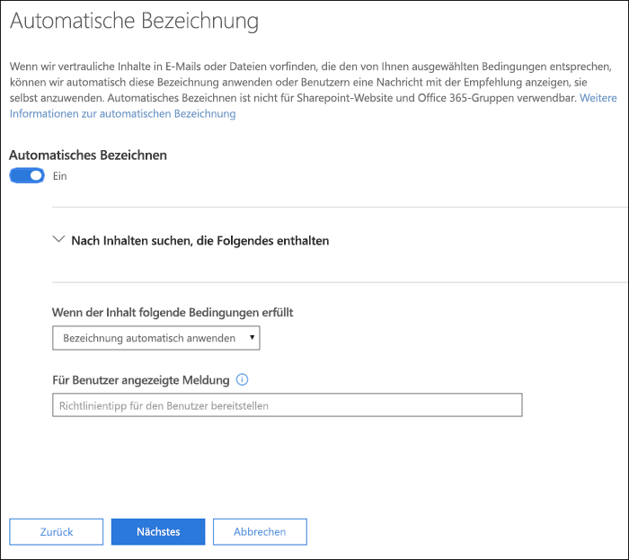
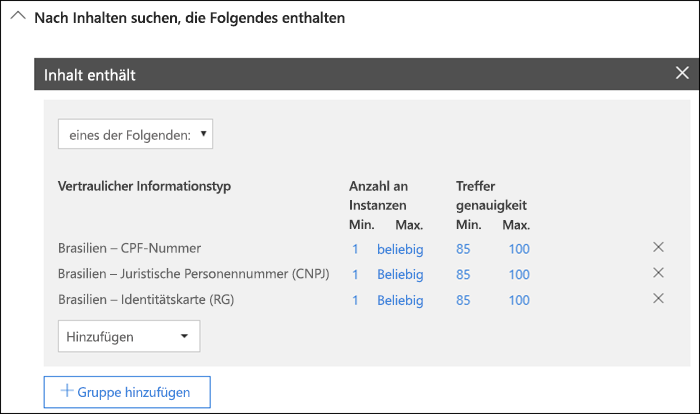
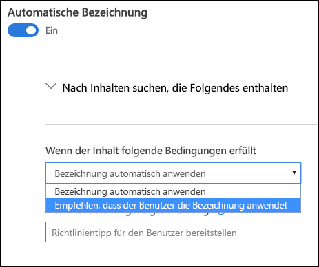
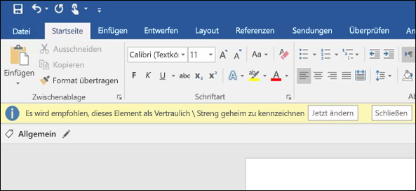

# Automatisches Anwenden einer Vertraulichkeitsbezeichnung auf Inhalte

Wenn Sie eine Vertraulichkeitsbezeichnung erstellen, können Sie diese Bezeichnung automatisch Inhalten mit vertraulichen Informationen zuweisen oder die Benutzer dazu auffordern, die von Ihnen empfohlene Bezeichnung anzuwenden.

Die Möglichkeit, Vertraulichkeitsbezeichnungen automatisch auf Inhalte anzuwenden, ist aus den folgenden Gründen wichtig:

- Sie müssen die Benutzer nicht schulen, damit sie alle Ihre Klassifizierungen kennen.

- Sie müssen sich nicht darauf verlassen, dass die Benutzer alle Inhalte richtig klassifizieren.

- Benutzer müssen nicht mehr über die Richtlinien Bescheid wissen, sondern können sich stattdessen auf ihre Arbeit konzentrieren.

Informationen zu den Lizenzanforderungen finden Sie unter [Vertraulichkeitsbezeichnungen in Office-Apps](sensitivity-labels-office-apps.md).

Die Bezeichnungseinstellungen sind verfügbar, wenn Sie eine Vertraulichkeitzbezeichnung im Microsoft 365 Compliance Center, Microsoft 365 Security Center oder Office 365 Security & Compliance Center unter **Klassifizierung** > **Vertraulichkeitsbezeichnungen** erstellen.

## Automatisches Anwenden einer Vertraulichkeitsbezeichnung basierend auf Kriterien

Eines der leistungsstärksten Features von Vertraulichkeitsbezeichnungen ist die Möglichkeit, sie automatisch auf Inhalte anzuwenden, die bestimmte Bedingungen erfüllen. In diesem Fall müssen die Personen in Ihrer Organisation die Vertraulichkeitsbezeichnungen nicht selber anwenden – dies erledigt Office 365 automatisch.

Sie können festlegen, dass Vertraulichkeitsbezeichnungen automatisch auf Inhalte angewendet werden, wenn bestimmte Typen vertraulicher Informationen enthalten sind. Wenn Se festlegen, dass eine Vertraulichkeitsbezeichnung automatisch angewendet werden soll, wird dieselbe Liste mit Typen vertraulicher Informationen angezeigt wie beim Erstellen einer DLP-Richtlinie (Data Loss Prevention, Verhinderung von Datenverlust). So können Sie z. B. automatisch die Bezeichnung „Streng vertraulich“ auf Inhalte anwenden, die personenbezogene Kundendaten wie Kreditkartennummern oder Sozialversicherungsnummern enthalten.

Nachdem Sie die Typen vertraulicher Informationen ausgewählt haben, können Sie die Kriterien eingrenzen, indem Sie die Instanzenanzahl oder Übereinstimmungsgenauigkeit ändern. Weitere Informationen finden Sie unter [Optimieren von Regeln, um die Übereinstimmung zu vereinfachen oder zu erschweren](data-loss-prevention-policies.md#tuning-rules-to-make-them-easier-or-harder-to-match).

Darüber hinaus können Sie auswählen, ob eine Bedingung alle vertraulichen Informationstypen oder nur einen dieser Typen erkennen muss. Und um Ihre Bedingungen flexibler oder komplexer zu gestalten, können Sie Gruppen hinzufügen und logische Operatoren zwischen den Gruppen verwenden. Weitere Informationen finden Sie unter [Gruppieren und logische Operatoren](data-loss-prevention-policies.md#grouping-and-logical-operators).

Wenn eine Vertraulichkeitsbezeichnung automatisch angewendet wird, wird dem Benutzer eine Benachrichtigung in der Office-App angezeigt. Sie können **OK** auswählen, um die Benachrichtigung zu schließen.

## Empfehlen des Anwendens einer Vertraulichkeitsbezeichnung

Wenn Sie es vorziehen, können Sie Ihren Benutzern empfehlen, die Bezeichnung anzuwenden. Mithilfe dieser Option können Ihre Benutzer die Klassifizierung und alle zugehörigen Schutzmaßnahmen akzeptieren oder die Empfehlung zurückweisen, wenn die Bezeichnung für ihr Dokument oder ihre E-Mail ungeeignet ist.

Empfohlene Bezeichnungen werden in Word, PowerPoint und Excel unterstützt (Azure Information Protection-Client für einheitliche Bezeichnungen muss installiert sein).

Im Folgenden finden Sie ein Beispiel für eine Aufforderung, wenn Sie Kriterien zum Anwenden einer Bezeichnung als empfohlene Aktion, und einen benutzerdefinierten Richtlinientipp. Sie können den Text festlegen, der im Richtlinientipp angezeigt wird.

## Anwenden automatischer oder empfohlener Bezeichnungen

- Die automatische Zuweisung von Bezeichnungen gilt für Word, Excel und PowerPoint beim Speichern eines Dokuments, und für Outlook beim Senden einer E-Mail. Diese Bedingungen erkennen vertrauliche Informationen im Text in Dokumenten und E-Mails sowie in Kopf- und Fußzeilen, aber nicht in der Betreffzeile oder E-Mail-Anlagen.

- Sie können keine automatische Klassifizierung für Dokumente und E-Mails verwenden, die zuvor manuell bezeichnet oder automatisch mit einer höheren Klassifizierung gekennzeichnet wurden. Denken Sie daran, dass Sie einem Dokument oder einer E-Mail-Nachricht nur eine einzige Vertraulichkeitsbezeichnung zuweisen können (zusätzlich zu einer einzigen Aufbewahrungsbezeichnung).

- Die empfohlene Klassifizierung gilt für Word, Excel und PowerPoint beim Speichern von Dokumenten.

- Sie können die empfohlene Klassifizierung für Dokumente, die zuvor mit einer höheren Klassifizierung gekennzeichnet wurden, nicht verwenden. Wenn der Inhalt bereits mit einer höheren Klassifizierung gekennzeichnet ist, wird dem Benutzer die Eingabeaufforderung mit der Empfehlung und dem Richtlinientipp nicht angezeigt.

## Auswerten mehrerer Kriterien, wenn sie für mehr als eine Bezeichnung zutreffen

Die Bezeichnungen werden je nach Position, die Sie in der Richtlinie festlegen, sortiert: die Bezeichnung an erster Stelle hat die niedrigste Position (am wenigsten vertraulich) und die Bezeichnung an letzter Stelle hat die höchste Position (am meisten vertraulich). Weitere Informationen zur Priorität finden Sie unter [Priorität der Bezeichnungen (Reihenfolge wesentlich)](sensitivity-labels.md#label-priority-order-matters).

## Konfigurieren Sie keine übergeordnete Bezeichnung, die automatisch angewendet oder empfohlen wird.

Denken Sie daran, dass Sie eine übergeordnete Bezeichnung (eine Bezeichnung mit Unterbezeichnungen) nicht auf Inhalt anwenden können. Stellen Sie sicher, dass Sie eine übergeordnete Bezeichnung nicht so konfigurieren, dass sie automatisch angewendet oder empfohlen wird, da die übergeordnete Bezeichnung nicht auf Inhalt in Office-Apps angewendet wird, die den Azure Information Protection-Client mit einheitlichen Bezeichnungen verwenden. Weitere Informationen zu übergeordneten Bezeichnungen und Unterbezeichnungen finden Sie unter [Unterbezeichnungen (Gruppierungsbezeichnungen)](sensitivity-labels.md#sublabels-grouping-labels).
