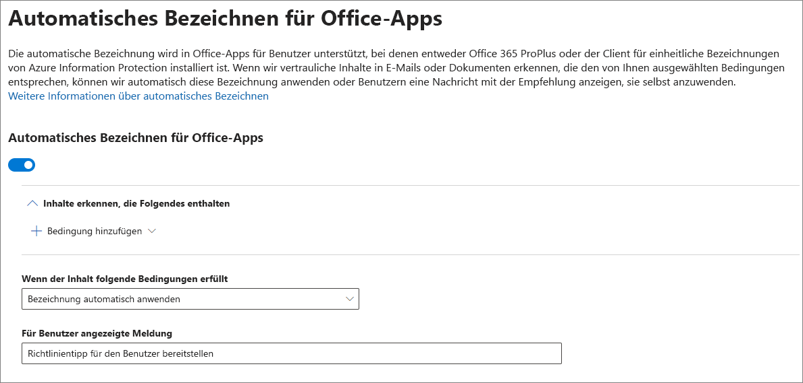

# Automatisches Anwenden einer Vertraulichkeitsbezeichnung auf InhalteApply a sensitivity label to content automatically

Wenn Sie eine Vertraulichkeitsbezeichnung erstellen, können Sie diese Bezeichnung automatisch Inhalten mit vertraulichen Informationen zuweisen oder die Benutzer dazu auffordern, die von Ihnen empfohlene Bezeichnung anzuwenden.When you create a sensitivity label, you can automatically assign that label to content containing sensitive information, or you can prompt users to apply the label that you recommend.

Die Möglichkeit, Vertraulichkeitsbezeichnungen automatisch auf Inhalte anzuwenden, ist aus den folgenden Gründen wichtig:The ability to apply sensitivity labels to content automatically is important because:

- Sie müssen die Benutzer nicht schulen, damit sie alle Ihre Klassifizierungen kennen.You don't need to train your users on all of your classifications.

- Sie müssen sich nicht darauf verlassen, dass die Benutzer alle Inhalte richtig klassifizieren.You don't need to rely on users to classify all content correctly.

- Benutzer müssen nicht mehr über Ihre Richtlinien Bescheid wissen, sondern können sich stattdessen auf ihre Arbeit konzentrieren.Users no longer need to know about your policies — they can instead focus on their work.

Informationen zu Lizenzanforderungen finden Sie unter [Abonnements- und Lizenzierungsanforderungen für Vertraulichkeitsbezeichnungen](sensitivity-labels-office-apps.md#subscription-and-licensing-requirements-for-sensitivity-labels).For information about license requirements, see [Subscription and licensing requirements for sensitivity labels](sensitivity-labels-office-apps.md#subscription-and-licensing-requirements-for-sensitivity-labels).

Die Bezeichnungseinstellungen sind verfügbar, wenn Sie eine Vertraulichkeitzbezeichnung im Microsoft 365 Compliance Center, Microsoft 365 Security Center oder Office 365 Security & Compliance Center unter **Klassifizierung** > **Vertraulichkeitsbezeichnungen** erstellen.The auto-labeling settings are available when you create a sensitivity label in the Microsoft 365 compliance center, Microsoft 365 security center, or Office 365 Security & Compliance Center under **Classification** > **Sensitivity labels**.

## Automatisches Anwenden einer Vertraulichkeitsbezeichnung basierend auf KriterienApply a sensitivity label automatically based on conditions

Eines der leistungsstärksten Features von Vertraulichkeitsbezeichnungen ist die Möglichkeit, sie automatisch auf Inhalte anzuwenden, die bestimmte Bedingungen erfüllen.One of the most powerful features of sensitivity labels is the ability to apply them automatically to content that matches certain conditions. In diesem Fall müssen die Personen in Ihrer Organisation die Vertraulichkeitsbezeichnungen nicht selber anwenden – dies erledigt Office 365 automatisch.In this case, people in your organization don't need to apply the sensitivity labels — Office 365 does the work for them.

Sie können festlegen, dass Vertraulichkeitsbezeichnungen automatisch auf Inhalte angewendet werden, wenn bestimmte Typen vertraulicher Informationen enthalten sind. Wenn Se festlegen, dass eine Vertraulichkeitsbezeichnung automatisch angewendet werden soll, wird dieselbe Liste mit Typen vertraulicher Informationen angezeigt wie beim Erstellen einer DLP-Richtlinie (Data Loss Prevention, Verhinderung von Datenverlust). So können Sie z. B. automatisch die Bezeichnung „Streng vertraulich“ auf Inhalte anwenden, die personenbezogene Kundendaten wie Kreditkartennummern oder Sozialversicherungsnummern enthalten.You can choose to apply sensitivity labels to content automatically when that content contains specific types of sensitive information. When you configure a sensitivity label to be applied automatically, you see the same list of sensitive information types as when you create a data loss prevention (DLP) policy. So you can, for example, automatically apply a Highly Confidential label to any content that contains customers' personally identifiable information (PII), such as credit card numbers or social security numbers.

Nachdem Sie die Typen vertraulicher Informationen ausgewählt haben, können Sie die Kriterien eingrenzen, indem Sie die Instanzenanzahl oder Übereinstimmungsgenauigkeit ändern.After you choose your sensitive information types, you can refine your condition by changing the instance count or match accuracy. Weitere Informationen finden Sie unter [Optimieren von Regeln, um die Übereinstimmung zu vereinfachen oder zu erschweren](data-loss-prevention-policies.md#tuning-rules-to-make-them-easier-or-harder-to-match).For more information, see [Tuning rules to make them easier or harder to match](data-loss-prevention-policies.md#tuning-rules-to-make-them-easier-or-harder-to-match).

Darüber hinaus können Sie auswählen, ob eine Bedingung alle vertraulichen Informationstypen oder nur einen dieser Typen erkennen muss.Further, you can choose whether a condition must detect all sensitive information types, or just one of them. Und um Ihre Bedingungen flexibler oder komplexer zu gestalten, können Sie Gruppen hinzufügen und logische Operatoren zwischen den Gruppen verwenden.And to make your conditions more flexible or complex, you can add groups and use logical operators between the groups. Weitere Informationen finden Sie unter [Gruppieren und logische Operatoren](data-loss-prevention-policies.md#grouping-and-logical-operators).For more information, see [Grouping and logical operators](data-loss-prevention-policies.md#grouping-and-logical-operators).

Wenn eine Vertraulichkeitsbezeichnung automatisch angewendet wird, wird dem Benutzer eine Benachrichtigung in der Office-App angezeigt. Sie können **OK** auswählen, um die Benachrichtigung zu schließen.When a sensitivity label is automatically applied, the user sees a notification in their Office app. They can choose **OK** to dismiss the notification.

## Empfehlen des Anwendens einer VertraulichkeitsbezeichnungRecommend that the user apply a sensitivity label

Wenn Sie es vorziehen, können Sie Ihren Benutzern empfehlen, die Bezeichnung anzuwenden.If you prefer, you can recommend to your users that they apply the label. Mithilfe dieser Option können Ihre Benutzer die Klassifizierung und alle zugehörigen Schutzmaßnahmen akzeptieren oder die Empfehlung zurückweisen, wenn die Bezeichnung für ihr Dokument oder ihre E-Mail ungeeignet ist.With this option, your users can accept the classification and any associated protection, or dismiss the recommendation if the label isn't suitable for their document or email.

Empfohlene Bezeichnungen werden in Word, PowerPoint und Excel unterstützt (Azure Information Protection-Client für einheitliche Bezeichnungen muss installiert sein).Recommended labels are supported in Word, PowerPoint, and Excel (and require that the Azure Information Protection unified labeling client is installed).

Im Folgenden finden Sie ein Beispiel für eine Aufforderung, wenn Sie Kriterien zum Anwenden einer Bezeichnung als empfohlene Aktion, und einen benutzerdefinierten Richtlinientipp. Sie können den Text festlegen, der im Richtlinientipp angezeigt wird.Here's an example of a prompt when you configure a condition to apply a label as a recommended action, with a custom policy tip. You can choose what text is displayed in the policy tip.

## Anwenden automatischer oder empfohlener BezeichnungenHow automatic or recommended labels are applied

- Die automatische Zuweisung von Bezeichnungen gilt für Word, Excel und PowerPoint beim Speichern eines Dokuments, und für Outlook beim Senden einer E-Mail.Automatic labeling applies to Word, Excel, and PowerPoint when you save a document, and to Outlook when you send an email. Diese Bedingungen erkennen vertrauliche Informationen im Text in Dokumenten und E-Mails sowie in Kopf- und Fußzeilen, aber nicht in der Betreffzeile oder E-Mail-Anlagen.These conditions detect sensitive information in the body text in documents and emails, and to headers and footers — but not in the subject line or attachments of email.

- Sie können keine automatische Klassifizierung für Dokumente und E-Mails verwenden, die zuvor manuell bezeichnet oder automatisch mit einer höheren Klassifizierung gekennzeichnet wurden.You can't use automatic classification for documents and emails that were previously manually labeled, or previously automatically labeled with a higher classification. Denken Sie daran, dass Sie einem Dokument oder einer E-Mail-Nachricht nur eine einzige Vertraulichkeitsbezeichnung zuweisen können (zusätzlich zu einer einzigen Aufbewahrungsbezeichnung).Remember, you can only apply a single sensitivity label to a document or email (in addition to a single retention label).

- Die empfohlene Klassifizierung gilt für Word, Excel und PowerPoint beim Speichern von Dokumenten.Recommended classification applies to Word, Excel, and PowerPoint when you save documents.

- Sie können die empfohlene Klassifizierung für Dokumente, die zuvor mit einer höheren Klassifizierung gekennzeichnet wurden, nicht verwenden.You can't use recommended classification for documents that were previously labeled with a higher classification. Wenn der Inhalt bereits mit einer höheren Klassifizierung gekennzeichnet ist, wird dem Benutzer die Eingabeaufforderung mit der Empfehlung und dem Richtlinientipp nicht angezeigt.When the content's already labeled with a higher classification, the user won't see the prompt with the recommendation and policy tip.

## Auswerten mehrerer Kriterien, wenn sie für mehr als eine Bezeichnung zutreffenHow multiple conditions are evaluated when they apply to more than one label

Die Bezeichnungen werden je nach Position, die Sie in der Richtlinie festlegen, sortiert: die Bezeichnung an erster Stelle hat die niedrigste Position (am wenigsten vertraulich) und die Bezeichnung an letzter Stelle hat die höchste Position (am meisten vertraulich). Weitere Informationen zur Priorität finden Sie unter [Priorität der Bezeichnungen (Reihenfolge wesentlich)](sensitivity-labels.md#label-priority-order-matters).The labels are ordered for evaluation according to their position that you specify in the policy: The label positioned first has the lowest position (least sensitive) and the label positioned last has the highest position (most sensitive). For more information on priority, see [Label priority (order matters)](sensitivity-labels.md#label-priority-order-matters).

## Konfigurieren Sie keine übergeordnete Bezeichnung, die automatisch angewendet oder empfohlen wird.Don't configure a parent label to be applied automatically or recommended

Denken Sie daran, dass Sie eine übergeordnete Bezeichnung (eine Bezeichnung mit Unterbezeichnungen) nicht auf Inhalt anwenden können.Remember, you can't apply a parent label (a label with sublabels) to content. Stellen Sie sicher, dass Sie eine übergeordnete Bezeichnung nicht so konfigurieren, dass sie automatisch angewendet oder empfohlen wird, da die übergeordnete Bezeichnung nicht auf Inhalt in Office-Apps angewendet wird, die den Azure Information Protection-Client mit einheitlichen Bezeichnungen verwenden.Make sure that you don't configure a parent label to be auto-applied or recommended, because the parent label won't be applied to content in Office apps that use the Azure Information Protection unified labeling client. Weitere Informationen zu übergeordneten Bezeichnungen und Unterbezeichnungen finden Sie unter [Unterbezeichnungen (Gruppierungsbezeichnungen)](sensitivity-labels.md#sublabels-grouping-labels).For more information on parent labels and sublabels, see [Sublabels (grouping labels)](sensitivity-labels.md#sublabels-grouping-labels).
