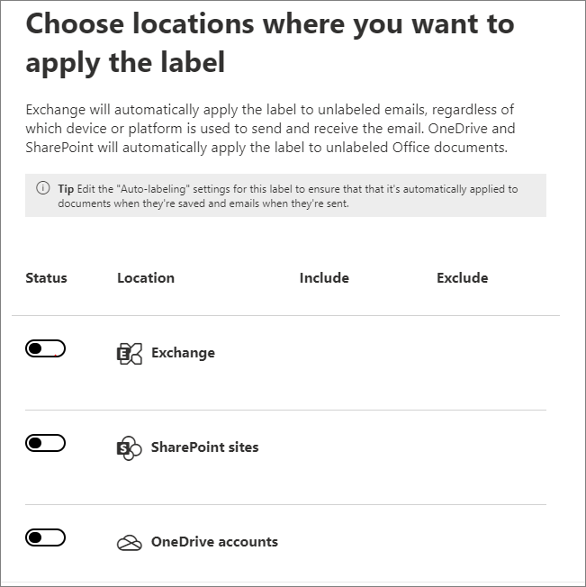
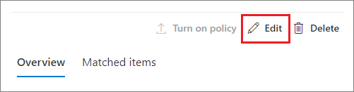

# <a name="apply-a-sensitivity-label-to-content-automatically"></a>Automatisches Anwenden einer Vertraulichkeitsbezeichnung auf Inhalte

>*[Microsoft 365-Lizenzierungsleitfaden für Sicherheit und Compliance](/office365/servicedescriptions/microsoft-365-service-descriptions/microsoft-365-tenantlevel-services-licensing-guidance/microsoft-365-security-compliance-licensing-guidance).*

> [!NOTE]
> Informationen zur automatischen Anwendung einer Vertraulichkeitsbezeichnung in Azure Purview (Vorschau) finden Sie unter [Automatische Beschriftung Ihrer Inhalte in Azure Purview](/azure/purview/create-sensitivity-label).

Wenn Sie ein Empfindlichkeitsetikett erstellen, können Sie dieses Etikett automatisch Dateien und E-Mails zuweisen, wenn es den von Ihnen angegebenen Bedingungen entspricht.

Diese Möglichkeit, Vertraulichkeitsbezeichnungen automatisch auf Inhalte anzuwenden, ist aus den folgenden Gründen wichtig:

- Sie müssen die Benutzer nicht schulen, damit sie alle Ihre Klassifizierungen kennen.

- Sie müssen sich nicht darauf verlassen, dass die Benutzer alle Inhalte richtig klassifizieren.

- Benutzer müssen nicht mehr über Ihre Richtlinien Bescheid wissen, sondern können sich stattdessen auf ihre Arbeit konzentrieren.

Wenn der Inhalt manuell bezeichnet wurde, wird diese Bezeichnung niemals durch eine automatische Bezeichnung ersetzt. Die automatische Bezeichnung kann jedoch eine [Bezeichnung mit niedrigerer Priorität](sensitivity-labels.md#label-priority-order-matters) ersetzen, die automatisch angewendet wurde.

Es gibt zwei unterschiedliche Methoden für die automatische Anwendung einer Vertraulichkeitsbezeichnung auf Inhalte in Microsoft 365:

- **Clientseitige Bezeichnung, wenn Benutzer Dokumente bearbeiten oder E-Mails verfassen (auch beantworten oder weiterleiten)**: Verwenden Sie ein Label, das für die automatische Bezeichnung für Dateien und E-Mails (einschließlich Word, Excel, PowerPoint und Outlook) konfiguriert ist. 
    
    Diese Methode unterstützt das Empfehlen einer Bezeichnung für Benutzer sowie das automatische Anwenden einer Bezeichnung. In beiden Fällen entscheidet der Benutzer aber, ob die Bezeichnung angenommen oder abgelehnt werden soll, um die richtige Bezeichnung von Inhalten zu gewährleisten. Diese clientseitige Beschriftung hat nur minimale Verzögerungen für Dokumente, da die Bezeichnung noch vor dem Speichern des Dokuments angewendet werden kann. Allerdings unterstützen nicht alle Client-Apps die automatische Bezeichnung. Diese Fähigkeit wird durch den Assistent für einheitliche Bezeichnungen von Azure Information Protection und [einige Versionen von Office](sensitivity-labels-office-apps.md#support-for-sensitivity-label-capabilities-in-apps) unterstützt. 
    
    Konfigurationsanweisungen finden Sie unter [Konfigurieren der automatischen Bezeichnung von Office-Apps](#how-to-configure-auto-labeling-for-office-apps) auf dieser Seite.

- **Dienstseitige Kennzeichnung, wenn der Inhalt bereits gespeichert (in SharePoint oder OneDrive) oder per E-Mail versandt (von Exchange Online verarbeitet) wurde**: Verwenden Sie eine automatische Bezeichnungsrichtlinie. 
    
    Möglicherweise wird sie auch automatische Bezeichnung für ruhende Daten (Dokumente in Microsoft Office SharePoint Online und OneDrive) und Daten im Transit (E-Mails, die von Exchange gesendet oder empfangen werden) genannt. Bei Exchange sind keine ruhenden E-Mail-Nachrichten enthalten (Postfächer).
    
    Da diese Bezeichnung eher von Diensten als von Anwendungen angewendet wird, müssen Sie sich keine Gedanken darüber machen, welche Apps-Benutzer über welche Version verfügen. Dies hat zur Folge, dass diese Funktion sofort in ihrer gesamten Organisation zur Verfügung steht, und sie eignet sich für Bezeichnungen jeder Größe. Richtlinien zum automatischen Bezeichnen unterstützen die empfohlene Bezeichnung nicht, da der Benutzer nicht mit dem Bezeichnungsprozess interagiert. Stattdessen führt der Administrator die Richtlinien im Simulationsmodus aus, um sicherzustellen, dass der Inhalt korrekt bezeichnet wird, bevor die Bezeichnung tatsächlich angewendet wird.
    
    Konfigurationsanweisungen finden Sie unter [Konfigurieren von Richtlinien zum automatischen Bezeichnen für Microsoft Office SharePoint Online, OneDrive und Exchange](#how-to-configure-auto-labeling-policies-for-sharepoint-onedrive-and-exchange) auf dieser Seite.
    
    Speziell für die automatische Bezeichnung von Microsoft Office SharePoint Online und OneDrive gilt:
    - Office-Dateien für Word, PowerPoint und Excel werden unterstützt. Das Open XML-Format wird unterstützt (z. B. DOCX und XLSX), aber nicht das Microsoft Office 97–2003-Format (z. B. DOC und XLS).
        - Diese Dateien können automatisch im Ruhezustand mit einer Bezeichnung versehen werden, bevor oder nachdem die Richtlinien für automatische Bezeichnungen erstellt wurden. Beachten Sie, dass Dateien nicht automatisch mit einer Bezeichnung versehen werden können, wenn sie Teil einer offenen Sitzung sind (d. h., wenn die Datei geöffnet ist).
    - Maximal 25.000 automatisch bezeichnete Dateien in Ihrem Mandanten pro Tag.
    - Maximal 10 Richtlinien zum automatischen Bezeichnen pro Mandant, die für jeweils bis zu 10 Websites (SharePoint oder OneDrive) vorgesehen sind.
    - Bestehende Werte für "Geändert", "Geändert von" und das Datum werden nicht aufgrund von automatischen Bezeichnungsrichtlinien geändert – sowohl für den Simulationsmodus als auch für den Zeitpunkt, zu dem Beschriftungen angewendet werden.
    - Wenn das Etikett die Verschlüsselung anwendet, ist der [Rechteverwaltungaussteller und Rechteverwaltungbesitzer](/azure/information-protection/configure-usage-rights#rights-management-issuer-and-rights-management-owner) das Konto, welches die Datei zuletzt geändert hat.

    Spezifisch für die automatische Bezeichnung für Exchange gilt:
    - Im Gegensatz zur manuellen oder automatischen Bezeichnung von Office-Apps werden Office-Anlagen (Word-, Excel- und PowerPoint-Dateien) ebenfalls auf die Bedingungen überprüft, die Sie in der Richtlinie zur automatischen Bezeichnung angeben. Wenn es eine Übereinstimmung gibt, wird die E-Mail-Adresse, aber nicht die Anlage bezeichnet.
        - Bei diesen Office-Dateien wird das Open XML-Format unterstützt (z. B. DOCX und XLSX), aber nicht das Microsoft Office 97–2003-Format (z. B. DOC und XLS).
    - Wenn Sie über Exchange-Mailflussregeln oder DLP-Richtlinien (Verhinderung von Datenverlust) verfügen, welche die IRM-Verschlüsselung anwenden: Wenn Inhalte durch diese Regeln oder Richtlinien und eine Richtlinie zum automatischen Bezeichnen identifiziert werden, wird die Bezeichnung angewendet. Wenn diese Bezeichnung Verschlüsselung anwendet, werden die IRM-Einstellungen aus den Exchange-E-Mail-Flussregeln oder DLP-Richtlinien ignoriert. Wenn diese Bezeichnung jedoch keine Verschlüsselung anwendet, werden die IRM-Einstellungen aus den E-Mail-Flussregeln oder DLP-Richtlinien zusätzlich zu der Bezeichnung angewendet.
    - E-Mails, die eine IRM-Verschlüsselung ohne Bezeichnung haben, werden durch eine Bezeichnung mit beliebigen Verschlüsselungseinstellungen ersetzt, wenn eine Übereinstimmung durch die Verwendung automatischer Bezeichnung vorliegt.
    - Eingehende E-Mails werden bezeichnet, wenn eine Übereinstimmung mit den Bedingungen für die automatische Bezeichnung vorliegt. Wenn die Bezeichnung für die Verschlüsselung konfiguriert ist, wird diese Verschlüsselung jedoch nicht angewendet.
    - Wenn über die Bezeichnung Verschlüsselung angewendet wird, ist der [Rights Management-Aussteller und -Besitzer](/azure/information-protection/configure-usage-rights#rights-management-issuer-and-rights-management-owner) jene Person, die diese E-Mail versendet.
    

## <a name="compare-auto-labeling-for-office-apps-with-auto-labeling-policies"></a>Vergleichen Sie das automatische Bezeichnen für Office-Anwendungen mit den Richtlinien für das automatische Bezeichnen

Verwenden Sie die folgende Tabelle, um die Unterschiede im Verhalten der beiden sich ergänzenden, automatischen Bezeichnungsmethoden zu erkennen:

|Feature oder Verhalten|Bezeichnungseinstellung: automatische Bezeichnung von Dateien und E-Mails  |Richtlinie: automatische Bezeichnung|
|:-----|:-----|:-----|
|App-Abhängigkeit|[Ja](sensitivity-labels-office-apps.md#support-for-sensitivity-label-capabilities-in-apps) |Nein \* |
|Nach Speicherort einschränken|Nein |Ja |
|Bedingungen: trainierbare Klassifizierungen|Ja |Nein |
|Bedingungen: Freigabeoptionen und zusätzliche E-Mail-Optionen|Nein |Ja |
|Empfehlungen, Richtlinien-Tooltipps und Benutzer-Außerkraftsetzungen|Ja |Nein |
|Simulationsmodus|Nein |Ja |
|Exchange-Anlagen auf Bedingungen geprüft|Nein | Ja|
|Visuelle Markierungen anwenden |Ja |Ja (nur E-Mail) |
|Außerkraftsetzen der IRM-Verschlüsselung ohne Bezeichnung angewendet|Ja, wenn der Benutzer das Mindestnutzungsrecht des Exportierens hat |Ja (nur E-Mail) |
|Bezeichnen eingehender E-Mails|Nein |Ja (Verschlüsselung nicht angewendet) |

\* Die Funktion „Automatisches Bezeichnen“ ist derzeit nicht in allen Regionen verfügbar. Wenn Ihr Mandant diese Funktion nicht unterstützt, wird die Registerkarte „Automatisches Bezeichnen“ im Admin Center für Bezeichnungen nicht angezeigt.

## <a name="how-multiple-conditions-are-evaluated-when-they-apply-to-more-than-one-label"></a>Bewerten mehrerer Kriterien, die für mehr als eine Bezeichnung zutreffen

Die Bezeichnungen werden je nach Position, die Sie in der Richtlinie festlegen, sortiert: die Bezeichnung an erster Stelle hat die niedrigste Position (am wenigsten vertraulich) und die Bezeichnung an letzter Stelle hat die höchste Position (am meisten vertraulich). Weitere Informationen zur Priorität finden Sie unter [Priorität der Bezeichnungen (Reihenfolge wesentlich)](sensitivity-labels.md#label-priority-order-matters).

## <a name="dont-configure-a-parent-label-to-be-applied-automatically-or-recommended"></a>Konfigurieren Sie keine übergeordnete Bezeichnung, die automatisch angewendet oder empfohlen wird.

Denken Sie daran, dass Sie eine übergeordnete Bezeichnung (eine Bezeichnung mit Unterbezeichnungen) nicht auf Inhalt anwenden können. Stellen Sie sicher, dass Sie eine übergeordnete Bezeichnung nicht so konfigurieren, dass sie automatisch angewendet oder in Office-Apps empfohlen wird, und wählen Sie keine übergeordnete Bezeichnung für eine Richtlinie zum automatischen Bezeichnen aus. Wenn Sie dies tun, wird die übergeordnete Bezeichnung nämlich nicht auf den Inhalt angewendet.

Wenn Sie automatische Bezeichnungen mit Unterbezeichnungen verwenden möchten, stellen Sie sicher, dass Sie sowohl die übergeordnete Bezeichnung als auch die Unterbezeichnung veröffentlichen.

Weitere Informationen zu übergeordneten Bezeichnungen und Unterbezeichnungen finden Sie unter [Unterbezeichnungen (Gruppierungsbezeichnungen)](sensitivity-labels.md#sublabels-grouping-labels).

## <a name="how-to-configure-auto-labeling-for-office-apps"></a>Konfigurieren der automatischen Zuweisung von Bezeichnungen für Office-Apps

Die automatische Zuweisung von Bezeichnungen in Office-Apps für Windows wird durch den Client mit einheitlichen Bezeichnungen von Azure Information Protection unterstützt. Für die integrierte Beschriftung in Office-Apps finden Sie diese Funktion unter [unterschiedliche Phasen der Verfügbarkeit für unterschiedliche Apps](sensitivity-labels-office-apps.md#support-for-sensitivity-label-capabilities-in-apps).

Die Einstellungen für das automatische Bezeichnen für Office-Apps sind verfügbar, wenn Sie [eine Vertraulichkeitsbezeichnung erstellen oder bearbeiten](create-sensitivity-labels.md). Stellen Sie sicher, dass **Dateien und E-Mails** für den Bereich der Bezeichnung ausgewählt ist: 


Wenn Sie den Assistenten durchlaufen, wird die Seite **Automatisches Bezeichnen für Dateien und E-Mails** angezeigt, auf der Sie aus einer Liste mit vertraulichen Informationstypen oder trainierbaren Klassifizierungsmerkmalen auswählen können:


Wenn eine Vertraulichkeitsbezeichnung automatisch angewendet wird, wird dem Benutzer eine Benachrichtigung in der Office-App angezeigt. Zum Beispiel:


### <a name="configuring-sensitive-info-types-for-a-label"></a>Konfigurieren von Typen vertraulicher Informationen für eine Bezeichnung

Wenn Sie die Option **Typen vertraulicher Informationen** auswählen, wird dieselbe Liste von vertraulichen Informationen wie beim Erstellen einer DLP-Richtlinie (Data Loss Prevention, Verhinderung von Datenverlust) angezeigt. So können Sie z. B. auf alle Inhalte, die personenbezogene Informationen von Kunden enthalten, wie z. B. Kreditkartennummern, Sozialversicherungsnummern oder Personalausweisnummern, automatisch die Bezeichnung "Streng vertraulich" anwenden:


Ähnlich wie bei der Konfiguration von DLP-Richtlinien können Sie dann Ihre Bedingung verfeinern, indem Sie die Anzahl der Instanzen und die Übereinstimmungsgenauigkeit ändern. Zum Beispiel:


Weitere Informationen zu diesen Konfigurationsoptionen finden Sie in der DLP-Dokumentation: [Optimieren von Regeln, um Übereinstimmungen zu vereinfachen oder zu erschweren](data-loss-prevention-policies.md#tuning-rules-to-make-them-easier-or-harder-to-match).

Darüber hinaus können Sie, ähnlich wie bei der Konfiguration der DLP-Richtlinien, auswählen, ob eine Bedingung alle vertraulichen Informationstypen oder nur einen dieser Typen erkennen muss. Und um Ihre Bedingungen flexibler oder komplexer zu gestalten, können Sie [Gruppen hinzufügen und logische Operatoren zwischen den Gruppen verwenden](data-loss-prevention-policies.md#grouping-and-logical-operators).

### <a name="configuring-trainable-classifiers-for-a-label"></a>Konfigurieren von trainierbaren Klassifizierungen für eine Bezeichnung

Diese Option befindet zurzeit in der Vorschau. Wenn Sie diese Option verwenden, stellen Sie sicher, dass Sie in Ihrem Mandanten mindestens eine andere Vertraulichkeitsbezeichnung veröffentlicht haben, die für die automatische Bezeichnung und die [Option "Vertrauliche Informationstypen"](#configuring-sensitive-info-types-for-a-label) konfiguriert ist.

Wenn Sie die Option **Trainierbare Klassifizierungen** auswählen, wählen Sie eine oder mehrere der integrierten trainierbaren Klassifizierungen von Microsoft aus. Wenn Sie eigene benutzerdefinierte trainierbare Klassifizierungen erstellt haben, können Sie diese auch auswählen:


> [!CAUTION]
> Die integrierte Klassifizierung **Anstößige Sprache** wird eingestellt, da sie eine große Anzahl falsch positiver Ergebnisse erzeugt hat. Verwenden Sie diese integrierte Klassifizierung nicht mehr, und ändern Sie Ihre Geschäftsprozesse entsprechend, falls sie derzeit noch verwendet wird. Wir empfehlen stattdessen die Verwendung der integrierten Klassifizierungen **Gezielte Belästigung**, **Obszönitäten** und **Bedrohung**.

Weitere Informationen über diese Klassifizierer finden Sie unter [Erfahren Sie mehr über trainierbare Klassifizierern](classifier-learn-about.md).

Während der Vorschauphase für diese Option unterstützen die folgenden Apps trainierbare Klassifizierungen für Vertraulichkeitsbezeichnungen:

- Microsoft 365-Apps for Enterprise ([vormals Office 365 ProPlus](/deployoffice/name-change)) für Windows, die jetzt im [Aktuellen Kanal](/deployoffice/overview-update-channels#current-channel-overview) in Version 2006 und höher bereitgestellt werden:
    - Word
    - Excel
    - PowerPoint

- Office für das Web-Apps, wenn Sie über [aktivierte Vertraulichkeitsbezeichnungen für Office-Dateien in SharePoint und OneDrive](sensitivity-labels-sharepoint-onedrive-files.md) verfügen:
    - Word
    - Excel
    - PowerPoint
    - Outlook

### <a name="recommend-that-the-user-applies-a-sensitivity-label"></a>Dem Benutzer wird das Anwenden einer Vertraulichkeitsbezeichnung empfohlen

Wenn Sie es vorziehen, können Sie Ihren Benutzern empfehlen, die Bezeichnung anzuwenden. Mithilfe dieser Option können Ihre Benutzer die Klassifizierung und alle zugehörigen Schutzmaßnahmen akzeptieren oder die Empfehlung zurückweisen, wenn die Bezeichnung für ihre Inhalte ungeeignet ist.


Im Folgenden finden Sie ein Beispiel für eine Aufforderung des Azure Information Protection-Clients mit einheitlichen Bezeichnungen, wenn Sie eine Bedingung zum Anwenden einer Bezeichnung als empfohlene Aktion konfigurieren, und einen benutzerdefinierten Richtlinientipp. Sie können den Text festlegen, der im Richtlinientipp angezeigt wird.


### <a name="when-automatic-or-recommended-labels-are-applied"></a>Anwenden automatischer oder empfohlener Bezeichnungen

Die Implementierung der automatischen und empfohlenen Bezeichnung in Office-Apps hängt davon ab, ob Sie eine in Office integrierte Bezeichnung oder den Azure Information Protection-Client mit einheitlichen Bezeichnungen verwenden. In beiden Fällen gilt jedoch:

- Sie können keine automatische Zuweisung von Bezeichnungen für Dokumente und E-Mails verwenden, die zuvor manuell bezeichnet oder automatisch mit einer höheren Vertraulichkeit gekennzeichnet wurden. Denken Sie daran, dass Sie einem Dokument oder einer E-Mail-Nachricht nur eine einzige Vertraulichkeitsbezeichnung zuweisen können (zusätzlich zu einer einzigen Aufbewahrungsbezeichnung).

- Sie können die empfohlenen Bezeichnungen für Dokumente oder E-Mails, die zuvor mit einer höheren Vertraulichkeit gekennzeichnet wurden, nicht verwenden. Wenn der Inhalt bereits mit einer höheren Vertraulichkeit gekennzeichnet ist, wird dem Benutzer die Eingabeaufforderung mit der Empfehlung und dem Richtlinientipp nicht angezeigt.

Spezifisch für integrierte Bezeichnungen:

- Nicht alle Office-Apps unterstützen automatische (und empfohlene) Bezeichnungen. Weitere Informationen finden Sie unter [Unterstützung der Funktion Vertraulichkeitsbezeichnungen in Apps](sensitivity-labels-office-apps.md#support-for-sensitivity-label-capabilities-in-apps).

- Bei empfohlenen Bezeichnungen in den Desktopversionen von Word wird der sensible Inhalt, der die Empfehlung ausgelöst hat, markiert, sodass Benutzer den sensiblen Inhalt überprüfen und entfernen können, anstatt die empfohlene Vertraulichkeitsbezeichnung anzuwenden.

- Ausführliche Informationen dazu, wie diese Bezeichnungen in Office-Apps angewendet werden, Beispielscreenshots und wie vertrauliche Informationen erkannt werden, finden Sie unter [Automatisches Anwenden oder Empfehlen von Vertraulichkeitsbezeichnungen für Ihre Dateien und E-Mails in Office](https://support.office.com/de-DE/article/automatically-apply-or-recommend-sensitivity-labels-to-your-files-and-emails-in-office-622e0d9c-f38c-470a-bcdb-9e90b24d71a1).

Spezifisch für Azure Information Protection-Clients mit einheitlichen Bezeichnungen:

-  Automatische und empfohlene Bezeichnungen gelten für Word, Excel und PowerPoint beim Speichern eines Dokuments, und für Outlook beim Senden einer E-Mail.

- Damit Outlook die empfohlenen Bezeichnungen unterstützt, müssen Sie zunächst eine [erweiterte Richtlinieneinstellung](/azure/information-protection/rms-client/clientv2-admin-guide-customizations#enable-recommended-classification-in-outlook) konfigurieren.

- Vertrauliche Informationen können im Text von Dokumenten und E-Mails sowie in Kopf- und Fußzeilen, aber nicht in der Betreffzeile oder E-Mail-Anlagen erkannt werden.

## <a name="how-to-configure-auto-labeling-policies-for-sharepoint-onedrive-and-exchange"></a>Konfigurieren von Richtlinien für die automatische Bezeichnung von Microsoft Office SharePoint Online, OneDrive und Exchange

Vergewissern Sie sich, dass Sie die Voraussetzungen kennen, bevor Sie automatische Bezeichnungsrichtlinien konfigurieren. 

### <a name="prerequisites-for-auto-labeling-policies"></a>Voraussetzungen für Richtlinien der automatischen Bezeichnung

- Simulationsmodus:
    - Die Überwachung von Microsoft 365 muss aktiviert sein. Wenn Sie die Überwachung aktivieren müssen oder sich nicht sicher sind, ob die Überwachung bereits aktiviert ist, lesen Sie [Aktivieren oder Deaktivieren der Überwachungsprotokollsuche](turn-audit-log-search-on-or-off.md).
    - Um die Dateiinhalte in der Quellansicht anzuzeigen, müssen Sie über die Rolle zur **Inhalts-Explorer-Inhaltsanzeige** verfügen. Globale Administratoren haben diese Rolle nicht standardmäßig. Wenn Sie nicht über diese Berechtigung verfügen, wird der Vorschaubereich nicht angezeigt, wenn Sie ein Element auf der Registerkarte **Übereinstimmende Elemente** auswählen.

- Automatisches Bezeichnen von Dateien in Microsoft Office SharePoint Online und OneDrive:
    - Sie haben [Vertraulichkeitsbezeichnungen für Office-Dateien in Microsoft Office SharePoint Online und OneDrive aktiviert](sensitivity-labels-sharepoint-onedrive-files.md).
    - Zum Zeitpunkt der Ausführung der Richtlinie zum automatischen Bezeichnen darf die Datei nicht von einem anderen Prozess oder Benutzer geöffnet sein. Eine Datei, die zur Bearbeitung ausgecheckt ist, fällt in diese Kategorie.

- Wenn Sie vorhaben, anstelle der integrierten Vertraulichkeitstypen [benutzerdefinierte sensible Informationstypen](sensitive-information-type-learn-about.md) zu verwenden: 
    - Benutzerdefinierte Vertraulichkeitsinformationstypen werden für Inhalte ausgewertet, die nach dem Speichern der benutzerdefinierten Vertraulichkeitsinformationstypen zu SharePoint oder OneDrive hinzugefügt wurden. 
    - Um neue benutzerdefinierte Typen sensibler Informationen zu testen, erstellen Sie diese, bevor Sie Ihre Richtlinie zum automatischen Bezeichnen erstellen, und erstellen Sie dann neue Dokumente mit Beispieldaten zum Testen.

- Eine oder mehrere Vertraulichkeitsbezeichnungen wurden [erstellt und veröffentlicht](create-sensitivity-labels.md) (für mindestens einen Benutzer), den Sie für Ihre Richtlinie zum automatischen Bezeichnen auswählen können. Für diese Bezeichnungen:
    - Es spielt keine Rolle, ob das automatische Bezeichnen in den Bezeichnungseinstellungen der Office-Anwendungen ein- oder ausgeschaltet ist, da diese Bezeichnungseinstellungen die Richtlinien für die automatische Bezeichnung ergänzen, wie in der Einführung erläutert.
    - Wenn die Etiketten, die Sie für die automatische Bezeichung verwenden möchten, für die Verwendung visueller Markierungen (Kopf- und Fußzeilen, Wasserzeichen) konfiguriert sind, beachten Sie, dass diese nicht auf Dokumente angewendet werden.
    - Wenn die Bezeichnungen [Verschlüsselungen](encryption-sensitivity-labels.md) anwenden, müssen diese für die Einstellung **Jetzt Berechtigungen zuweisen** konfiguriert sein.

### <a name="learn-about-simulation-mode"></a>Informationen zum Simulationsmodus

Der Simulationsmodus ist einzigartig für Richtlinien zum automatischen Bezeichnen und in den Arbeitsablauf eingearbeitet. Sie können Dokumente und E-Mails erst dann automatisch bezeichnen, wenn Ihre Richtlinie mindestens eine Simulation ausgeführt hat.

Workflow für die Richtlinie zum automatischen Bezeichnen:

1. Erstellen und konfigurieren Sie eine Richtlinie zum automatischen Bezeichnen.

2. Führen Sie die Richtlinie im Simulationsmodus aus. Dies kann bis zu 48 Stunden dauern.

3. Überprüfen Sie die Ergebnisse, und verfeinern Sie Ihre Richtlinie bei Bedarf. Führen Sie den Simulationsmodus erneut aus, und warten Sie, bis er erneut abgeschlossen ist.

4. Wiederholen Sie Schritt 3 nach Bedarf.

5. Stellen Sie die Richtlinie in der Produktion bereit.

Die simulierte Bereitstellung wird wie der WhatIf-Parameter für PowerShell ausgeführt. Die Ergebnisse werden so gemeldet, als ob die Richtlinie zum automatischen Bezeichnen Ihre ausgewählte Bezeichnung unter Verwendung der von Ihnen definierten Regeln angewendet hätte. Sie können dann bei Bedarf Ihre Genauigkeitsregeln verfeinern und die Simulation erneut ausführen. Da die automatische Bezeichnung für Exchange für E-Mails gilt, die gesendet und empfangen werden, und nicht für E-Mails, die in Postfächern gespeichert sind, erwarten Sie jedoch nicht, dass die Ergebnisse für E-Mails in einer Simulation konsistent sind, es sei denn, Sie sind in der Lage, genau die gleichen E-Mail-Nachrichten zu senden und zu empfangen.

Mit dem Simulationsmodus können Sie auch den Umfang Ihrer Richtlinie zum automatischen Bezeichnen vor dem Einsatz schrittweise vergrößern. Sie können z. B. mit einem einzigen Ort, wie z. B. einer Microsoft Office SharePoint Online-Website, mit einer einzigen Dokumentbibliothek beginnen. Erweitern Sie dann mit iterativen Änderungen den Geltungsbereich auf mehrere Standorte und dann auf einen anderen Standort, z. B. OneDrive.

Schließlich können Sie den Simulationsmodus verwenden, um einen Näherungswert für die Zeit zu erhalten, die für die Ausführung Ihrer Richtlinie zum automatischen Bezeichnen benötigt wird, um Ihnen bei der Planung und Terminierung zu helfen, wann diese ohne Simulationsmodus ausgeführt werden soll.

### <a name="creating-an-auto-labeling-policy"></a>Erstellen einer Richtlinie für die automatische Bezeichnung

1. Navigieren Sie im [Microsoft 365 Compliance Center](https://compliance.microsoft.com/) zu Vertraulichkeitsbezeichnungen:
    
    - **Lösungen** > **Informationsschutz**
    
    Wenn diese Option nicht sofort angezeigt wird, wählen Sie zunächst **Alle anzeigen** aus.

2. Wählen Sie die Registerkarte **Automatisches Bezeichnen** aus:
    
    
    
    > [!NOTE]
    > Wenn die Registerkarte **Automatisches Bezeichnen** nicht angezeigt wird, steht diese Funktion in Ihrer Region derzeit nicht zur Verfügung.

3. Wählen Sie **+ Richtlinie für die automatische Bezeichnung erstellen** aus. Dadurch wird der Assistent für neue Richtlinien gestartet:
    
    

4. Wählen Sie für die Seite **Informationen auswählen, auf die diese Bezeichnung angewendet werden soll**, eine der Vorlagen aus, z. B. **Finanzen** oder **Datenschutz**. Sie können die Suche verfeinern, indem Sie die Dropdownliste **Optionen anzeigen für** verwenden. Sie können aber auch **Benutzerdefinierte Richtlinie** auswählen, wenn die Vorlagen Ihren Anforderungen nicht entsprechen. Wählen Sie **Weiter** aus.

5. Für die Seite **Benennen Sie Ihre Richtlinie zum automatischen Bezeichnen**: Geben Sie einen eindeutigen Namen und optional eine Beschreibung an, um die automatisch angewandte Bezeichnung, die Speicherorte und Bedingungen zu identifizieren, die den zu bezeichnenden Inhalt identifizieren.

6. Für die Seite **Wählen Sie Orte aus, an denen Sie die Bezeichnung anwenden möchten**: Wählen und geben Sie Orte für Exchange, Microsoft Office SharePoint Online-Websites und OneDrive an. Wählen Sie dann **Weiter** aus.
    
    
    
    Sie müssen einzelne SharePoint-Websites und OneDrive-Konten angeben. In OneDrive hat die URL eines OneDrive-Benutzers das folgende Format: `https://<tenant name>-my.sharepoint.com/personal/<user_name>_<tenant name>_com`
    
    Beispielsweise bei einem Benutzer im Mandanten „Contoso“, der den Benutzernamen „rsimone“ hat: `https://contoso-my.sharepoint.com/personal/rsimone_contoso_onmicrosoft_com`
    
    Informationen zum Überprüfen der Syntax für Ihren Mandanten und zum Identifizieren von URLs für Benutzer finden Sie unter [Abrufen einer Liste aller Benutzer OneDrive-URLs in Ihrer Organisation](/onedrive/list-onedrive-urls).

7. Für die Seite **Allgemeine oder erweiterte Regeln einrichten**: Behalten Sie die Standardeinstellung **Allgemeine Regeln** bei, um Regeln zu definieren, mit denen zu bezeichnende Inhalte für alle ausgewählten Speicherorte identifiziert werden. Wenn Sie pro Speicherort unterschiedliche Regeln benötigen, wählen Sie **Erweiterte Regeln** aus. Wählen Sie dann **Weiter** aus.
    
    Die Regeln verwenden Bedingungen, die sensible Informationstypen und Freigabeoptionen umfassen:
    - Sie können integrierte und benutzerdefinierte Typen für vertrauliche Informationen auswählen.
    - Bei den freigegebenen Optionen können Sie **nur für Personen in meiner Organisation** oder **mit Personen außerhalb meiner Organisation** auswählen.
    
    Wenn Ihr einziger Speicherort **Exchange** ist oder Sie **Erweiterte Regeln** auswählen, können Sie zusätzliche Bedingungen auswählen:
    - IP-Adresse des Absenders lautet
    - Empfängerdomäne lautet
    - Empfänger lautet
    - Dateierweiterung der Anlage lautet
    - Anlage ist passwortgeschützt
    - Der Inhalt einer E-Mail-Anlage konnte nicht vollständig gescannt werden
    - Der Inhalt einer E-Mail-Anlage wurde nicht vollständig gescannt

8. Je nachdem, welche Einstellungen Sie bisher ausgewählt haben, können Sie nun neue Regeln unter Verwendung von Bedingungen und Ausnahmen erstellen.
    
    Die Konfigurationsoptionen für Typen sensibler Informationen sind die gleichen wie die, die Sie für das automatische Bezeichnen von Office-Anwendungen auswählen. Wenn Sie weitere Informationen benötigen, lesen Sie [Konfigurieren sensibler Informationstypen für eine Bezeichnung](#configuring-sensitive-info-types-for-a-label).
    
    Wenn Sie alle erforderlichen Regeln definiert und bestätigt haben, dass der Status "Aktiviert" lautet, wählen Sie **Weiter** aus, mit der Auswahl einer Bezeichnung fortzufahren, die automatisch angewendet werden soll.

11. Für die Seite **Wählen Sie eine Bezeichnung zum automatischen Bezeichnen aus**: Wählen Sie **+ Wählen Sie eine Bezeichnung aus**, eine Bezeichnung aus dem Bereich **Wählen Sie ein Vertraulichkeitsbezeichnung** und dann **Weiter** aus.

12. Für die Seite **Entscheiden, ob Sie die Richtlinie jetzt oder später testen möchten**: Wählen Sie **Richtlinie im Simulationsmodus ausführen** aus, wenn Sie bereit sind, die Richtlinie zum automatischen Anwenden von Bezeichnungen jetzt im Simulationsmodus auszuführen. Andernfalls wählen Sie **Richtlinie deaktiviert lassen** aus. Wählen Sie **Weiter** aus: 
    
    

13. Auf der Seite **Zusammenfassung**: Überprüfen Sie die Konfiguration Ihrer Richtlinie für die automatische Bezeichnung, nehmen Sie die erforderlichen Änderungen vor, und schließen Sie den Assistenten ab.

Unter **Informationsschutz** > **Automatisches Bezeichnen** wird jetzt Ihre Richtlinie zum automatischen Bezeichnen im Abschnitt **Simulation** oder **Aus** angezeigt, je nachdem, ob Sie ausgewählt haben, dass die Richtlinie im Simulationsmodus ausgeführt wird oder nicht. Wählen Sie Ihre Richtlinie aus, um die Details der Konfiguration und des Status zu sehen (z. B. **Richtliniensimulation wird noch ausgeführt**). Wählen Sie für Richtlinien im Simulationsmodus die Registerkarte **Übereinstimmende Elemente** aus, um zu sehen, welche E-Mails oder Dokumente den von Ihnen festgelegten Regeln entsprechen.

Sie können Ihre Richtlinie direkt über diese Oberfläche ändern:

- Wählen Sie für eine Richtlinie im Abschnitt **Aus** die Schaltfläche **Bearbeiten** aus.

- Wählen Sie für eine Richtlinie im Abschnitt **Simulation** auf einer der beiden Registerkarten die Schaltfläche **bearbeiten** oben auf der Seite aus:
    
    
    
    Wenn Sie die Richtlinie ohne Simulation ausführen möchten, wählen Sie die Option **Richtlinie aktivieren** aus.

Ihre Richtlinien werden fortlaufend ausgeführt, bis sie gelöscht werden. So beziehen die aktuellen Richtlinieneinstellungen beispielsweise neue und geänderte Dokumente ein.

Sie können die Ergebnisse der Richtlinie für die automatische Bezeichnung auch anzeigen, indem Sie [Inhalts-Explorer](data-classification-content-explorer.md) verwenden, wenn Sie über die entsprechenden [Berechtigungen](data-classification-content-explorer.md#permissions) verfügen:
- In der **Inhalts-Explorer-Listenanzeige** können Sie die Bezeichnung einer Datei anzeigen, aber nicht den Inhalt der Datei.
- **Inhalts-Explorer-Inhaltsanzeige** können Sie den Inhalt der Datei anzeigen.

> [!TIP]
> Sie können den Inhalts-Explorer auch verwenden, um Speicherorte zu identifizieren, die Dokumente mit vertraulichen Informationen, aber ohne Bezeichnungen enthalten. Anhand dieser Informationen können Sie diese Speicherorte ihrer Richtlinie zur automatischen Bezeichnung hinzufügen und die identifizierten Typen vertraulicher Informationen als Regeln aufnehmen.

### <a name="use-powershell-for-auto-labeling-policies"></a>PowerShell für automatische Bezeichnungsrichtlinien verwenden

Sie können [Security & Compliance Center PowerShell](/powershell/exchange/scc-powershell) verwenden, um automatische Bezeichnungsrichtlinien zu erstellen und zu konfigurieren. Dies bedeutet, dass Sie das Erstellen und Verwalten Ihrer automatischen Bezeichnungsrichtlinien vollständig mithilfe von Skripts durchführen können, was auch eine effizientere Methode zum Angeben mehrerer URLs für OneDrive-und SharePoint-Speicherorte darstellt.

Bevor Sie die Befehle in PowerShell ausführen, müssen Sie zunächst [eine Verbindung zu Security & Compliance Center PowerShell herstellen](/powershell/exchange/connect-to-scc-powershell).

So erstellen Sie eine neue automatische Bezeichnungsrichtlinie: 

```powershell
New-AutoSensitivityLabelPolicy -Name <AutoLabelingPolicyName> -SharePointLocation "<SharePointSiteLocation>" -ApplySensitivityLabel <Label> -Mode TestWithoutNotifications
```
Mit diesem Befehl wird eine automatische Bezeichnungsrichtlinie für eine von Ihnen angegebene SharePoint-Website erstellt. Verwenden Sie bei einem OneDrive-Speicherort stattdessen den Parameter *OneDriveLocation*. 

So fügen Sie einer vorhandenen automatischen Bezeichnungsrichtlinie weitere Websites hinzu:

```powershell
$spoLocations = @("<SharePointSiteLocation1>","<SharePointSiteLocation2>")
Set-AutoSensitivityLabelPolicy -Identity <AutoLabelingPolicyName> -AddSharePointLocation $spoLocations -ApplySensitivityLabel <Label> -Mode TestWithoutNotifications
```

Mit diesem Befehl werden die zusätzlichen SharePoint-URLs in einer Variablen angegeben, die dann der bestehenden automatischen Bezeichnungsrichtlinie hinzugefügt wird. Wenn Sie stattdessen OneDrive Speicherorte hinzufügen möchten, verwenden Sie den *AddOneDriveLocation*-Parameter mit einer anderen Variablen, z. B. *$OneDriveLocations*.

So erstellen Sie eine neue automatische Bezeichnungsrichtlinienregel:

```powershell
New-AutoSensitivityLabelRule -Policy <AutoLabelingPolicyName> -Name <AutoLabelingRuleName> -ContentContainsSensitiveInformation @{"name"= "a44669fe-0d48-453d-a9b1-2cc83f2cba77"; "mincount" = "2"} -Workload SharePoint
```

Bei einer vorhandenen automatischen Bezeichnungsrichtlinie wird mit diesem Befehl eine neue Richtlinienregel erstellt, um den vertraulichen Informationstyp **US-Sozialversicherungsnummer (SSN)** zu ermitteln, der die Entitäts-ID a44669fe-0d48-453d-a9b1-2cc83f2cba77 hat. Entitäts-IDs anderer vertraulicher Informationstypen finden Sie unter [Entitätsdefinitionen für vertrauliche Informationstypen](sensitive-information-type-entity-definitions.md).

Weitere Informationen zu den PowerShell-Cmdlets, die automatische Bezeichnungsrichtlinien unterstützen, deren verfügbare Parameter sowie einige Beispiele finden Sie in der folgenden Cmdlet-Hilfe:

- [Get-AutoSensitivityLabelPolicy](/powershell/module/exchange/get-autosensitivitylabelpolicy)
- [New-AutoSensitivityLabelPolicy](/powershell/module/exchange/new-autosensitivitylabelpolicy)
- [New-AutoSensitivityLabelRule](/powershell/module/exchange/new-autosensitivitylabelrule)
- [Remove-AutoSensitivityLabelPolicy](/powershell/module/exchange/remove-autosensitivitylabelpolicy)
- [Remove-AutoSensitivityLabelRule](/powershell/module/exchange/remove-autosensitivitylabelrule)
- [Set-AutoSensitivityLabelPolicy](/powershell/module/exchange/set-autosensitivitylabelpolicy)
- [Set-AutoSensitivityLabelRule](/powershell/module/exchange/set-autosensitivitylabelrule)