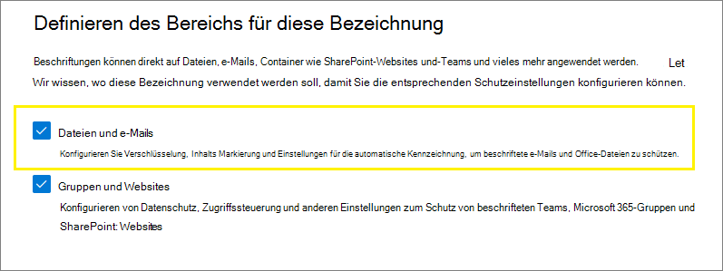
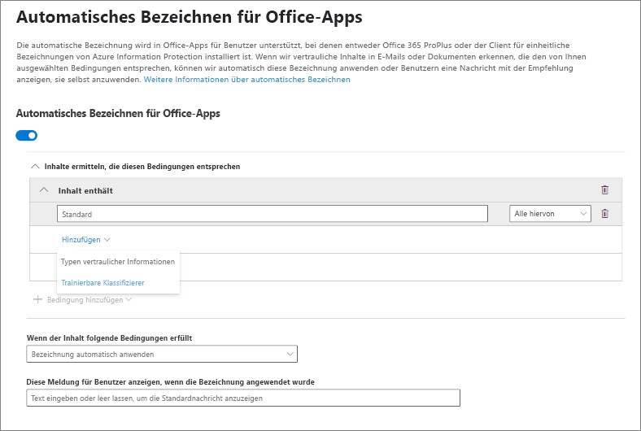
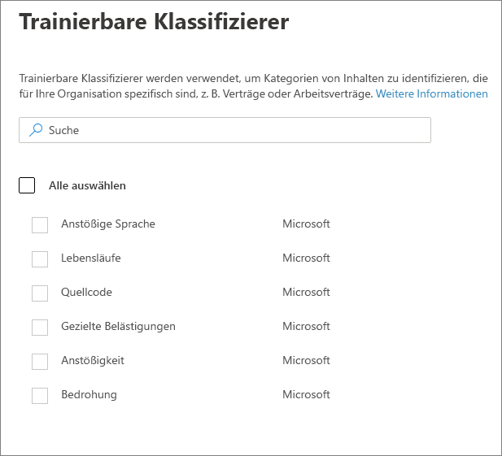
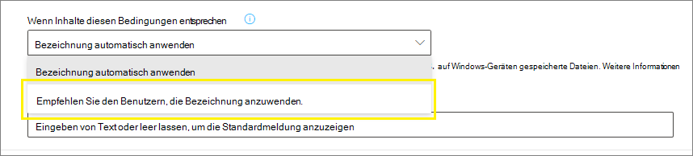
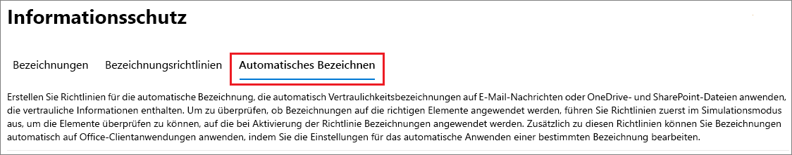
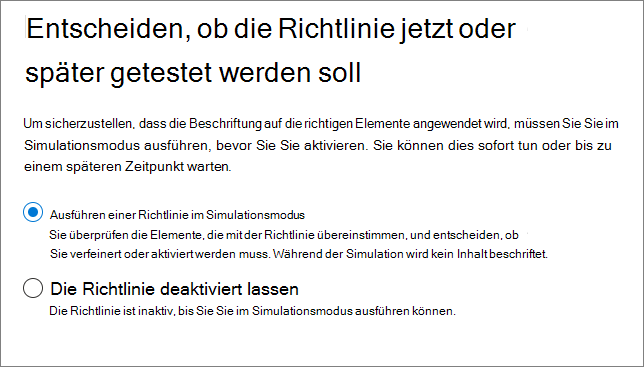

# <a name="apply-a-sensitivity-label-to-content-automatically"></a><span data-ttu-id="94707-103">Automatisches Anwenden einer Vertraulichkeitsbezeichnung auf Inhalte</span><span class="sxs-lookup"><span data-stu-id="94707-103">Apply a sensitivity label to content automatically</span></span>

><span data-ttu-id="94707-104">*[Microsoft 365-Lizenzierungsleitfaden für Sicherheit und Compliance](/office365/servicedescriptions/microsoft-365-service-descriptions/microsoft-365-tenantlevel-services-licensing-guidance/microsoft-365-security-compliance-licensing-guidance).*</span><span class="sxs-lookup"><span data-stu-id="94707-104">*[Microsoft 365 licensing guidance for security & compliance](/office365/servicedescriptions/microsoft-365-service-descriptions/microsoft-365-tenantlevel-services-licensing-guidance/microsoft-365-security-compliance-licensing-guidance).*</span></span>

> [!NOTE]
> <span data-ttu-id="94707-105">Informationen zur automatischen Anwendung einer Vertraulichkeitsbezeichnung in Azure Purview (Vorschau) finden Sie unter [Automatische Beschriftung Ihrer Inhalte in Azure Purview](/azure/purview/create-sensitivity-label).</span><span class="sxs-lookup"><span data-stu-id="94707-105">For information about automatically applying a sensitivity label in Azure Purview (preview), see [Automatically label your content in Azure Purview](/azure/purview/create-sensitivity-label).</span></span>

<span data-ttu-id="94707-106">Wenn Sie ein Empfindlichkeitsetikett erstellen, können Sie dieses Etikett automatisch Dateien und E-Mails zuweisen, wenn es den von Ihnen angegebenen Bedingungen entspricht.</span><span class="sxs-lookup"><span data-stu-id="94707-106">When you create a sensitivity label, you can automatically assign that label to files and emails when it matches conditions that you specify.</span></span>

<span data-ttu-id="94707-107">Diese Möglichkeit, Vertraulichkeitsbezeichnungen automatisch auf Inhalte anzuwenden, ist aus den folgenden Gründen wichtig:</span><span class="sxs-lookup"><span data-stu-id="94707-107">This ability to apply sensitivity labels to content automatically is important because:</span></span>

- <span data-ttu-id="94707-108">Sie müssen die Benutzer nicht schulen, damit sie alle Ihre Klassifizierungen kennen.</span><span class="sxs-lookup"><span data-stu-id="94707-108">You don't need to train your users when to use each of your classifications.</span></span>

- <span data-ttu-id="94707-109">Sie müssen sich nicht darauf verlassen, dass die Benutzer alle Inhalte richtig klassifizieren.</span><span class="sxs-lookup"><span data-stu-id="94707-109">You don't need to rely on users to classify all content correctly.</span></span>

- <span data-ttu-id="94707-110">Benutzer müssen nicht mehr über Ihre Richtlinien Bescheid wissen, sondern können sich stattdessen auf ihre Arbeit konzentrieren.</span><span class="sxs-lookup"><span data-stu-id="94707-110">Users no longer need to know about your policies—they can instead focus on their work.</span></span>

<span data-ttu-id="94707-111">Wenn der Inhalt manuell bezeichnet wurde, wird diese Bezeichnung niemals durch eine automatische Bezeichnung ersetzt.</span><span class="sxs-lookup"><span data-stu-id="94707-111">When content has been manually labeled, that label will never be replaced by automatic labeling.</span></span> <span data-ttu-id="94707-112">Die automatische Bezeichnung kann jedoch eine [Bezeichnung mit niedrigerer Priorität](sensitivity-labels.md#label-priority-order-matters) ersetzen, die automatisch angewendet wurde.</span><span class="sxs-lookup"><span data-stu-id="94707-112">However, automatic labeling can replace a [lower priority label](sensitivity-labels.md#label-priority-order-matters) that was automatically applied.</span></span>

<span data-ttu-id="94707-113">Es gibt zwei unterschiedliche Methoden für die automatische Anwendung einer Vertraulichkeitsbezeichnung auf Inhalte in Microsoft 365:</span><span class="sxs-lookup"><span data-stu-id="94707-113">There are two different methods for automatically applying a sensitivity label to content in Microsoft 365:</span></span>

- <span data-ttu-id="94707-114">**Clientseitige Bezeichnung, wenn Benutzer Dokumente bearbeiten oder E-Mails verfassen (auch beantworten oder weiterleiten)**: Verwenden Sie ein Label, das für die automatische Bezeichnung für Dateien und E-Mails (einschließlich Word, Excel, PowerPoint und Outlook) konfiguriert ist.</span><span class="sxs-lookup"><span data-stu-id="94707-114">**Client-side labeling when users edit documents or compose (also reply or forward) emails**: Use a label that's configured for auto-labeling for files and emails (includes Word, Excel, PowerPoint, and Outlook).</span></span> 
    
    <span data-ttu-id="94707-115">Diese Methode unterstützt das Empfehlen einer Bezeichnung für Benutzer sowie das automatische Anwenden einer Bezeichnung.</span><span class="sxs-lookup"><span data-stu-id="94707-115">This method supports recommending a label to users, as well as automatically applying a label.</span></span> <span data-ttu-id="94707-116">In beiden Fällen entscheidet der Benutzer aber, ob die Bezeichnung angenommen oder abgelehnt werden soll, um die richtige Bezeichnung von Inhalten zu gewährleisten.</span><span class="sxs-lookup"><span data-stu-id="94707-116">But in both cases, the user decides whether to accept or reject the label, to help ensure the correct labeling of content.</span></span> <span data-ttu-id="94707-117">Diese clientseitige Beschriftung hat nur minimale Verzögerungen für Dokumente, da die Bezeichnung noch vor dem Speichern des Dokuments angewendet werden kann.</span><span class="sxs-lookup"><span data-stu-id="94707-117">This client-side labeling has minimal delay for documents because the label can be applied even before the document is saved.</span></span> <span data-ttu-id="94707-118">Allerdings unterstützen nicht alle Client-Apps die automatische Bezeichnung.</span><span class="sxs-lookup"><span data-stu-id="94707-118">However, not all client apps support auto-labeling.</span></span> <span data-ttu-id="94707-119">Diese Fähigkeit wird durch den Assistent für einheitliche Bezeichnungen von Azure Information Protection und [einige Versionen von Office](sensitivity-labels-office-apps.md#support-for-sensitivity-label-capabilities-in-apps) unterstützt.</span><span class="sxs-lookup"><span data-stu-id="94707-119">This capability is supported by the Azure Information Protection unified labeling client, and [some versions of Office](sensitivity-labels-office-apps.md#support-for-sensitivity-label-capabilities-in-apps).</span></span> 
    
    <span data-ttu-id="94707-120">Konfigurationsanweisungen finden Sie unter [Konfigurieren der automatischen Bezeichnung von Office-Apps](#how-to-configure-auto-labeling-for-office-apps) auf dieser Seite.</span><span class="sxs-lookup"><span data-stu-id="94707-120">For configuration instructions, see [How to configure auto-labeling for Office apps](#how-to-configure-auto-labeling-for-office-apps) on this page.</span></span>

- <span data-ttu-id="94707-121">**Dienstseitige Kennzeichnung, wenn der Inhalt bereits gespeichert (in SharePoint oder OneDrive) oder per E-Mail versandt (von Exchange Online verarbeitet) wurde**: Verwenden Sie eine automatische Bezeichnungsrichtlinie.</span><span class="sxs-lookup"><span data-stu-id="94707-121">**Service-side labeling when content is already saved (in SharePoint or OneDrive) or emailed (processed by Exchange Online)**: Use an auto-labeling policy.</span></span> 
    
    <span data-ttu-id="94707-p103">Möglicherweise spricht man bei dieser Methode auch vom automatischen Bezeichnen von ruhenden Daten (Dokumente in Microsoft Office SharePoint Online und OneDrive) und Daten bei der Übertragung (E-Mails, die von Exchange gesendet oder empfangen werden). Bei Exchange sind keine ruhenden E-Mail-Nachrichten enthalten (Postfächer).</span><span class="sxs-lookup"><span data-stu-id="94707-p103">You might also hear this method referred to as auto-labeling for data at rest (documents in SharePoint and OneDrive) and data in transit (email that is sent or received by Exchange). For Exchange, it doesn't include emails at rest (mailboxes).</span></span>
    
    <span data-ttu-id="94707-124">Da diese Bezeichnung eher von Diensten als von Anwendungen angewendet wird, müssen Sie sich keine Gedanken darüber machen, welche Apps-Benutzer über welche Version verfügen.</span><span class="sxs-lookup"><span data-stu-id="94707-124">Because this labeling is applied by services rather than by applications, you don't need to worry about what apps users have and what version.</span></span> <span data-ttu-id="94707-125">Dies hat zur Folge, dass diese Funktion sofort in ihrer gesamten Organisation zur Verfügung steht, und sie eignet sich für Bezeichnungen jeder Größe.</span><span class="sxs-lookup"><span data-stu-id="94707-125">As a result, this capability is immediately available throughout your organization and suitable for labeling at scale.</span></span> <span data-ttu-id="94707-126">Richtlinien zum automatischen Bezeichnen unterstützen die empfohlene Bezeichnung nicht, da der Benutzer nicht mit dem Bezeichnungsprozess interagiert.</span><span class="sxs-lookup"><span data-stu-id="94707-126">Auto-labeling policies don't support recommended labeling because the user doesn't interact with the labeling process.</span></span> <span data-ttu-id="94707-127">Stattdessen führt der Administrator die Richtlinien im Simulationsmodus aus, um sicherzustellen, dass der Inhalt korrekt bezeichnet wird, bevor die Bezeichnung tatsächlich angewendet wird.</span><span class="sxs-lookup"><span data-stu-id="94707-127">Instead, the administrator runs the policies in simulation mode to help ensure the correct labeling of content before actually applying the label.</span></span>
    
    <span data-ttu-id="94707-128">Konfigurationsanweisungen finden Sie unter [Konfigurieren von Richtlinien zum automatischen Bezeichnen für Microsoft Office SharePoint Online, OneDrive und Exchange](#how-to-configure-auto-labeling-policies-for-sharepoint-onedrive-and-exchange) auf dieser Seite.</span><span class="sxs-lookup"><span data-stu-id="94707-128">For configuration instructions, see [How to configure auto-labeling policies for SharePoint, OneDrive, and Exchange](#how-to-configure-auto-labeling-policies-for-sharepoint-onedrive-and-exchange) on this page.</span></span>
    
    <span data-ttu-id="94707-129">Speziell für die automatische Bezeichnung von Microsoft Office SharePoint Online und OneDrive gilt:</span><span class="sxs-lookup"><span data-stu-id="94707-129">Specific to auto-labeling for SharePoint and OneDrive:</span></span>
    - <span data-ttu-id="94707-p105">Office-Dateien Word, PowerPoint und Excel werden unterstützt . Das Open XML-Format wird unterstützt (z. B. DOCX und XLSX), aber nicht das Microsoft Office 97–2003-Format (z. B. DOC und XLS).</span><span class="sxs-lookup"><span data-stu-id="94707-p105">Office files for Word, PowerPoint, and Excel are supported. Open XML format is supported (such as .docx and .xlsx) but not Microsoft Office 97-2003 format (such as .doc and .xls).</span></span>
        - <span data-ttu-id="94707-132">Diese Dateien können automatisch im Ruhezustand mit einer Bezeichnung versehen werden, bevor oder nachdem die Richtlinien für automatische Bezeichnungen erstellt wurden.</span><span class="sxs-lookup"><span data-stu-id="94707-132">These files can be auto-labeled at rest before or after the auto-labeling policies are created.</span></span> <span data-ttu-id="94707-133">Beachten Sie, dass Dateien nicht automatisch mit einer Bezeichnung versehen werden können, wenn sie Teil einer offenen Sitzung sind (d. h., wenn die Datei geöffnet ist).</span><span class="sxs-lookup"><span data-stu-id="94707-133">Note that files cannot be auto-labeled if they are part of an open session (the file is open).</span></span>
    - <span data-ttu-id="94707-134">Maximal 25.000 automatisch bezeichnete Dateien in Ihrem Mandanten pro Tag.</span><span class="sxs-lookup"><span data-stu-id="94707-134">Maximum of 25,000 automatically labeled files in your tenant per day.</span></span>
    - <span data-ttu-id="94707-135">Maximal 10 Richtlinien zum automatischen Bezeichnen pro Mandant, die für jeweils bis zu 10 Websites (SharePoint oder OneDrive) vorgesehen sind.</span><span class="sxs-lookup"><span data-stu-id="94707-135">Maximum of 10 auto-labeling policies per tenant, each targeting up to 10 sites (SharePoint or OneDrive).</span></span>
    - <span data-ttu-id="94707-136">Bestehende Werte für "Geändert", "Geändert von" und das Datum werden nicht aufgrund von automatischen Bezeichnungsrichtlinien geändert – sowohl für den Simulationsmodus als auch für den Zeitpunkt, zu dem Beschriftungen angewendet werden.</span><span class="sxs-lookup"><span data-stu-id="94707-136">Existing values for modified, modified by, and the date are not changed as a result of auto-labeling policies—for both simulation mode and when labels are applied.</span></span>
    - <span data-ttu-id="94707-137">Wenn das Etikett die Verschlüsselung anwendet, ist der [Rechteverwaltungaussteller und Rechteverwaltungbesitzer](/azure/information-protection/configure-usage-rights#rights-management-issuer-and-rights-management-owner) das Konto, welches die Datei zuletzt geändert hat.</span><span class="sxs-lookup"><span data-stu-id="94707-137">When the label applies encryption, the [Rights Management issuer and Rights Management owner](/azure/information-protection/configure-usage-rights#rights-management-issuer-and-rights-management-owner) is the account that last modified the file.</span></span>

    <span data-ttu-id="94707-138">Spezifisch für die automatische Bezeichnung für Exchange gilt:</span><span class="sxs-lookup"><span data-stu-id="94707-138">Specific to auto-labeling for Exchange:</span></span>
    - <span data-ttu-id="94707-p107">Im Gegensatz zum manuellen oder automatischen Bezeichnen von Office-Apps werden PDF-Anlagen sowie Office-Anlagen (Word-, Excel- und PowerPoint-Dateien) ebenfalls auf die Bedingungen überprüft, die Sie in der Richtlinie zum automatischen Bezeichnen angeben. Wenn es eine Übereinstimmung gibt, wird die E-Mail-Adresse, aber nicht die Anlage bezeichnet.</span><span class="sxs-lookup"><span data-stu-id="94707-p107">Unlike manual labeling or auto-labeling with Office apps, PDF attachments as well as Office attachments (Word, Excel, and PowerPoint files) are also scanned for the conditions you specify in your auto-labeling policy. When there is a match, the email is labeled but not the attachment.</span></span>
        - <span data-ttu-id="94707-141">Wenn bei PDF-Dateien auf der Bezeichnung eine Verschlüsselung angewendet wird, werden diese Dateien verschlüsselt, wenn Ihr Mandant [für PDF-Anlagen aktiviert ist](ome-faq.yml#are-pdf-file-attachments-supported-).</span><span class="sxs-lookup"><span data-stu-id="94707-141">For PDF files, if the label applies encryption, these files are encrypted when your tenant is [enabled for PDF attachments](ome-faq.yml#are-pdf-file-attachments-supported-).</span></span>
        - <span data-ttu-id="94707-p108">Bei diesen Office-Dateien wird das Open XML-Format unterstützt (z. B. DOCX und XLSX), aber nicht das Microsoft Office 97–2003-Format (z. B. DOC und XLS). Wenn auf der Bezeichnung eine Verschlüsselung angewendet wird, werden diese Dateien verschlüsselt.</span><span class="sxs-lookup"><span data-stu-id="94707-p108">For these Office files, Open XML format is supported (such as .docx and .xlsx) but not Microsoft Office 97-2003 format (such as .doc and .xls). If the label applies encryption, these files are encrypted.</span></span>
    - <span data-ttu-id="94707-144">Wenn Sie über Exchange-Mailflussregeln oder DLP-Richtlinien (Verhinderung von Datenverlust) verfügen, welche die IRM-Verschlüsselung anwenden: Wenn Inhalte durch diese Regeln oder Richtlinien und eine Richtlinie zum automatischen Bezeichnen identifiziert werden, wird die Bezeichnung angewendet.</span><span class="sxs-lookup"><span data-stu-id="94707-144">If you have Exchange mail flow rules or data loss prevention (DLP) policies that apply IRM encryption: When content is identified by these rules or policies and an auto-labeling policy, the label is applied.</span></span> <span data-ttu-id="94707-145">Wenn diese Bezeichnung Verschlüsselung anwendet, werden die IRM-Einstellungen aus den Exchange-E-Mail-Flussregeln oder DLP-Richtlinien ignoriert.</span><span class="sxs-lookup"><span data-stu-id="94707-145">If that label applies encryption, the IRM settings from the Exchange mail flow rules or DLP policies are ignored.</span></span> <span data-ttu-id="94707-146">Wenn diese Bezeichnung jedoch keine Verschlüsselung anwendet, werden die IRM-Einstellungen aus den E-Mail-Flussregeln oder DLP-Richtlinien zusätzlich zu der Bezeichnung angewendet.</span><span class="sxs-lookup"><span data-stu-id="94707-146">However, if that label doesn't apply encryption, the IRM settings from the mail flow rules or DLP policies are applied in addition to the label.</span></span>
    - <span data-ttu-id="94707-147">E-Mails, die eine IRM-Verschlüsselung ohne Bezeichnung haben, werden durch eine Bezeichnung mit beliebigen Verschlüsselungseinstellungen ersetzt, wenn eine Übereinstimmung durch die Verwendung automatischer Bezeichnung vorliegt.</span><span class="sxs-lookup"><span data-stu-id="94707-147">Email that has IRM encryption with no label will be replaced by a label with any encryption settings when there is a match by using auto-labeling.</span></span>
    - <span data-ttu-id="94707-148">Eingehende E-Mails werden bezeichnet, wenn eine Übereinstimmung mit den Bedingungen für automatische Bezeichnungen vorliegt:</span><span class="sxs-lookup"><span data-stu-id="94707-148">Incoming email is labeled when there is a match with your auto-labeling conditions:</span></span>
        - <span data-ttu-id="94707-149">Wenn die Bezeichnung jedoch für die [Verschlüsselung](encryption-sensitivity-labels.md) konfiguriert ist, wird diese Verschlüsselung jedoch nicht angewendet.</span><span class="sxs-lookup"><span data-stu-id="94707-149">If the label is configured for [encryption](encryption-sensitivity-labels.md), that encryption isn't applied.</span></span>
        - <span data-ttu-id="94707-150">Wenn die Bezeichnung so konfiguriert ist, dass sie [dynamische Markierungen](sensitivity-labels-office-apps.md#dynamic-markings-with-variables)anwendet, beachten Sie, dass sich dadurch Namen von Personen außerhalb Ihrer Organisation ergeben können.</span><span class="sxs-lookup"><span data-stu-id="94707-150">If the label is configured to apply [dynamic markings](sensitivity-labels-office-apps.md#dynamic-markings-with-variables), be aware that this can result in the names of people outside your organization.</span></span>
    - <span data-ttu-id="94707-151">Wenn über die Bezeichnung Verschlüsselung angewendet wird, ist der [Rights Management-Aussteller und -Besitzer](/azure/information-protection/configure-usage-rights#rights-management-issuer-and-rights-management-owner) jene Person, die diese E-Mail versendet.</span><span class="sxs-lookup"><span data-stu-id="94707-151">When the label applies encryption, the [Rights Management issuer and Rights Management owner](/azure/information-protection/configure-usage-rights#rights-management-issuer-and-rights-management-owner) is the person who sends the email.</span></span>
    

## <a name="compare-auto-labeling-for-office-apps-with-auto-labeling-policies"></a><span data-ttu-id="94707-152">Vergleichen Sie das automatische Bezeichnen für Office-Anwendungen mit den Richtlinien für das automatische Bezeichnen</span><span class="sxs-lookup"><span data-stu-id="94707-152">Compare auto-labeling for Office apps with auto-labeling policies</span></span>

<span data-ttu-id="94707-153">Verwenden Sie die folgende Tabelle, um die Unterschiede im Verhalten der beiden sich ergänzenden, automatischen Bezeichnungsmethoden zu erkennen:</span><span class="sxs-lookup"><span data-stu-id="94707-153">Use the following table to help you identify the differences in behavior for the two complementary automatic labeling methods:</span></span>

|<span data-ttu-id="94707-154">Feature oder Verhalten</span><span class="sxs-lookup"><span data-stu-id="94707-154">Feature or behavior</span></span>|<span data-ttu-id="94707-155">Bezeichnungseinstellung: automatische Bezeichnung von Dateien und E-Mails</span><span class="sxs-lookup"><span data-stu-id="94707-155">Label setting: Auto-labeling for files and emails</span></span>  |<span data-ttu-id="94707-156">Richtlinie: automatische Bezeichnung</span><span class="sxs-lookup"><span data-stu-id="94707-156">Policy: Auto-labeling</span></span>|
|:-----|:-----|:-----|
|<span data-ttu-id="94707-157">App-Abhängigkeit</span><span class="sxs-lookup"><span data-stu-id="94707-157">App dependency</span></span>|[<span data-ttu-id="94707-158">Ja</span><span class="sxs-lookup"><span data-stu-id="94707-158">Yes</span></span>](sensitivity-labels-office-apps.md#support-for-sensitivity-label-capabilities-in-apps) |<span data-ttu-id="94707-159">Nein \*</span><span class="sxs-lookup"><span data-stu-id="94707-159">No \*</span></span> |
|<span data-ttu-id="94707-160">Nach Speicherort einschränken</span><span class="sxs-lookup"><span data-stu-id="94707-160">Restrict by location</span></span>|<span data-ttu-id="94707-161">Nein</span><span class="sxs-lookup"><span data-stu-id="94707-161">No</span></span> |<span data-ttu-id="94707-162">Ja</span><span class="sxs-lookup"><span data-stu-id="94707-162">Yes</span></span> |
|<span data-ttu-id="94707-163">Bedingungen: trainierbare Klassifizierungen</span><span class="sxs-lookup"><span data-stu-id="94707-163">Conditions: Trainable classifiers</span></span>|<span data-ttu-id="94707-164">Ja</span><span class="sxs-lookup"><span data-stu-id="94707-164">Yes</span></span> |<span data-ttu-id="94707-165">Nein</span><span class="sxs-lookup"><span data-stu-id="94707-165">No</span></span> |
|<span data-ttu-id="94707-166">Bedingungen: Freigabeoptionen und zusätzliche E-Mail-Optionen</span><span class="sxs-lookup"><span data-stu-id="94707-166">Conditions: Sharing options and additional options for email</span></span>|<span data-ttu-id="94707-167">Nein</span><span class="sxs-lookup"><span data-stu-id="94707-167">No</span></span> |<span data-ttu-id="94707-168">Ja</span><span class="sxs-lookup"><span data-stu-id="94707-168">Yes</span></span> |
|<span data-ttu-id="94707-169">Empfehlungen, Richtlinien-Tooltipps und Benutzer-Außerkraftsetzungen</span><span class="sxs-lookup"><span data-stu-id="94707-169">Recommendations, policy tooltip, and user overrides</span></span>|<span data-ttu-id="94707-170">Ja</span><span class="sxs-lookup"><span data-stu-id="94707-170">Yes</span></span> |<span data-ttu-id="94707-171">Nein</span><span class="sxs-lookup"><span data-stu-id="94707-171">No</span></span> |
|<span data-ttu-id="94707-172">Simulationsmodus</span><span class="sxs-lookup"><span data-stu-id="94707-172">Simulation mode</span></span>|<span data-ttu-id="94707-173">Nein</span><span class="sxs-lookup"><span data-stu-id="94707-173">No</span></span> |<span data-ttu-id="94707-174">Ja</span><span class="sxs-lookup"><span data-stu-id="94707-174">Yes</span></span> |
|<span data-ttu-id="94707-175">Exchange-Anlagen auf Bedingungen geprüft</span><span class="sxs-lookup"><span data-stu-id="94707-175">Exchange attachments checked for conditions</span></span>|<span data-ttu-id="94707-176">Nein</span><span class="sxs-lookup"><span data-stu-id="94707-176">No</span></span> | <span data-ttu-id="94707-177">Ja</span><span class="sxs-lookup"><span data-stu-id="94707-177">Yes</span></span>|
|<span data-ttu-id="94707-178">Visuelle Markierungen anwenden</span><span class="sxs-lookup"><span data-stu-id="94707-178">Apply visual markings</span></span> |<span data-ttu-id="94707-179">Ja</span><span class="sxs-lookup"><span data-stu-id="94707-179">Yes</span></span> |<span data-ttu-id="94707-180">Ja (nur E-Mail)</span><span class="sxs-lookup"><span data-stu-id="94707-180">Yes (email only)</span></span> |
|<span data-ttu-id="94707-181">Außerkraftsetzen der IRM-Verschlüsselung ohne Bezeichnung angewendet</span><span class="sxs-lookup"><span data-stu-id="94707-181">Override IRM encryption applied without a label</span></span>|<span data-ttu-id="94707-182">Ja, wenn der Benutzer das Mindestnutzungsrecht des Exportierens hat</span><span class="sxs-lookup"><span data-stu-id="94707-182">Yes if the user has the minimum usage right of Export</span></span> |<span data-ttu-id="94707-183">Ja (nur E-Mail)</span><span class="sxs-lookup"><span data-stu-id="94707-183">Yes (email only)</span></span> |
|<span data-ttu-id="94707-184">Bezeichnen eingehender E-Mails</span><span class="sxs-lookup"><span data-stu-id="94707-184">Label incoming email</span></span>|<span data-ttu-id="94707-185">Nein</span><span class="sxs-lookup"><span data-stu-id="94707-185">No</span></span> |<span data-ttu-id="94707-186">Ja (Verschlüsselung nicht angewendet)</span><span class="sxs-lookup"><span data-stu-id="94707-186">Yes (encryption not applied)</span></span> |

<span data-ttu-id="94707-187">\* Die Funktion „Automatisches Bezeichnen“ ist derzeit nicht in allen Regionen verfügbar.</span><span class="sxs-lookup"><span data-stu-id="94707-187">\* Auto-labeling isn't currently available in all regions.</span></span> <span data-ttu-id="94707-188">Wenn Ihr Mandant diese Funktion nicht unterstützt, wird die Registerkarte „Automatisches Bezeichnen“ im Admin Center für Bezeichnungen nicht angezeigt.</span><span class="sxs-lookup"><span data-stu-id="94707-188">If your tenant can't support this functionality, the Auto-labeling tab isn't visible in the admin labeling center.</span></span>

## <a name="how-multiple-conditions-are-evaluated-when-they-apply-to-more-than-one-label"></a><span data-ttu-id="94707-189">Bewerten mehrerer Kriterien, die für mehr als eine Bezeichnung zutreffen</span><span class="sxs-lookup"><span data-stu-id="94707-189">How multiple conditions are evaluated when they apply to more than one label</span></span>

<span data-ttu-id="94707-p111">Die Bezeichnungen werden je nach Position, die Sie in der Richtlinie festlegen, sortiert: die Bezeichnung an erster Stelle hat die niedrigste Position (am wenigsten vertraulich) und die Bezeichnung an letzter Stelle hat die höchste Position (am meisten vertraulich). Weitere Informationen zur Priorität finden Sie unter [Priorität der Bezeichnungen (Reihenfolge wesentlich)](sensitivity-labels.md#label-priority-order-matters).</span><span class="sxs-lookup"><span data-stu-id="94707-p111">The labels are ordered for evaluation according to their position that you specify in the policy: The label positioned first has the lowest position (least sensitive) and the label positioned last has the highest position (most sensitive). For more information on priority, see [Label priority (order matters)](sensitivity-labels.md#label-priority-order-matters).</span></span>

## <a name="dont-configure-a-parent-label-to-be-applied-automatically-or-recommended"></a><span data-ttu-id="94707-192">Konfigurieren Sie keine übergeordnete Bezeichnung, die automatisch angewendet oder empfohlen wird.</span><span class="sxs-lookup"><span data-stu-id="94707-192">Don't configure a parent label to be applied automatically or recommended</span></span>

<span data-ttu-id="94707-193">Denken Sie daran, dass Sie eine übergeordnete Bezeichnung (eine Bezeichnung mit Unterbezeichnungen) nicht auf Inhalt anwenden können.</span><span class="sxs-lookup"><span data-stu-id="94707-193">Remember, you can't apply a parent label (a label with sublabels) to content.</span></span> <span data-ttu-id="94707-194">Stellen Sie sicher, dass Sie eine übergeordnete Bezeichnung nicht so konfigurieren, dass sie automatisch angewendet oder in Office-Apps empfohlen wird, und wählen Sie keine übergeordnete Bezeichnung für eine Richtlinie zum automatischen Bezeichnen aus.</span><span class="sxs-lookup"><span data-stu-id="94707-194">Make sure that you don't configure a parent label to be auto-applied or recommended in Office apps, and don't select a parent label for an auto-labeling policy.</span></span> <span data-ttu-id="94707-195">Wenn Sie dies tun, wird die übergeordnete Bezeichnung nämlich nicht auf den Inhalt angewendet.</span><span class="sxs-lookup"><span data-stu-id="94707-195">If you do, the parent label won't be applied to content.</span></span>

<span data-ttu-id="94707-196">Wenn Sie automatische Bezeichnungen mit Unterbezeichnungen verwenden möchten, stellen Sie sicher, dass Sie sowohl die übergeordnete Bezeichnung als auch die Unterbezeichnung veröffentlichen.</span><span class="sxs-lookup"><span data-stu-id="94707-196">To use automatic labeling with sublabels, make sure you publish both the parent label and the sublabel.</span></span>

<span data-ttu-id="94707-197">Weitere Informationen zu übergeordneten Bezeichnungen und Unterbezeichnungen finden Sie unter [Unterbezeichnungen (Gruppierungsbezeichnungen)](sensitivity-labels.md#sublabels-grouping-labels).</span><span class="sxs-lookup"><span data-stu-id="94707-197">For more information on parent labels and sublabels, see [Sublabels (grouping labels)](sensitivity-labels.md#sublabels-grouping-labels).</span></span>

## <a name="how-to-configure-auto-labeling-for-office-apps"></a><span data-ttu-id="94707-198">Konfigurieren der automatischen Zuweisung von Bezeichnungen für Office-Apps</span><span class="sxs-lookup"><span data-stu-id="94707-198">How to configure auto-labeling for Office apps</span></span>

<span data-ttu-id="94707-199">Die automatische Zuweisung von Bezeichnungen in Office-Apps für Windows wird durch den Client mit einheitlichen Bezeichnungen von Azure Information Protection unterstützt.</span><span class="sxs-lookup"><span data-stu-id="94707-199">Automatic labeling in Office apps for Windows is supported by the Azure Information Protection unified labeling client.</span></span> <span data-ttu-id="94707-200">Für die integrierte Beschriftung in Office-Apps finden Sie diese Funktion unter [unterschiedliche Phasen der Verfügbarkeit für unterschiedliche Apps](sensitivity-labels-office-apps.md#support-for-sensitivity-label-capabilities-in-apps).</span><span class="sxs-lookup"><span data-stu-id="94707-200">For built-in labeling in Office apps, this capability is in [different stages of availability for different apps](sensitivity-labels-office-apps.md#support-for-sensitivity-label-capabilities-in-apps).</span></span>

<span data-ttu-id="94707-201">Die Einstellungen für das automatische Bezeichnen für Office-Apps sind verfügbar, wenn Sie [eine Vertraulichkeitsbezeichnung erstellen oder bearbeiten](create-sensitivity-labels.md).</span><span class="sxs-lookup"><span data-stu-id="94707-201">The auto-labeling settings for Office apps are available when you [create or edit a sensitivity label](create-sensitivity-labels.md).</span></span> <span data-ttu-id="94707-202">Stellen Sie sicher, dass **Dateien und E-Mails** für den Bereich der Bezeichnung ausgewählt ist:</span><span class="sxs-lookup"><span data-stu-id="94707-202">Make sure **Files & emails** is selected for the label's scope:</span></span> 



<span data-ttu-id="94707-204">Wenn Sie den Assistenten durchlaufen, wird die Seite **Automatisches Bezeichnen für Dateien und E-Mails** angezeigt, auf der Sie aus einer Liste mit vertraulichen Informationstypen oder trainierbaren Klassifizierungsmerkmalen auswählen können:</span><span class="sxs-lookup"><span data-stu-id="94707-204">As you move through the wizard, you see the **Auto-labeling for files and emails** page where you can choose from a list of sensitive info types or trainable classifiers:</span></span>



<span data-ttu-id="94707-p115">Wenn eine Vertraulichkeitsbezeichnung automatisch angewendet wird, wird dem Benutzer eine Benachrichtigung in der Office-App angezeigt. Zum Beispiel:</span><span class="sxs-lookup"><span data-stu-id="94707-p115">When this sensitivity label is automatically applied, the user sees a notification in their Office app. For example:</span></span>


### <a name="configuring-sensitive-info-types-for-a-label"></a><span data-ttu-id="94707-209">Konfigurieren von Typen vertraulicher Informationen für eine Bezeichnung</span><span class="sxs-lookup"><span data-stu-id="94707-209">Configuring sensitive info types for a label</span></span>

<span data-ttu-id="94707-210">Wenn Sie die Option **Typen vertraulicher Informationen** auswählen, wird dieselbe Liste von vertraulichen Informationen wie beim Erstellen einer DLP-Richtlinie (Data Loss Prevention, Verhinderung von Datenverlust) angezeigt.</span><span class="sxs-lookup"><span data-stu-id="94707-210">When you select the **Sensitive info types** option, you see the same list of sensitive information types as when you create a data loss prevention (DLP) policy.</span></span> <span data-ttu-id="94707-211">So können Sie z. B. auf alle Inhalte, die personenbezogene Informationen von Kunden enthalten, wie z. B. Kreditkartennummern, Sozialversicherungsnummern oder Personalausweisnummern, automatisch die Bezeichnung "Streng vertraulich" anwenden:</span><span class="sxs-lookup"><span data-stu-id="94707-211">So you can, for example, automatically apply a Highly Confidential label to any content that contains customers' personal information, such as credit card numbers, social security numbers, or passport numbers:</span></span>


<span data-ttu-id="94707-p117">Ähnlich wie bei der Konfiguration von DLP-Richtlinien können Sie dann Ihre Bedingung verfeinern, indem Sie die Anzahl der Instanzen und die Übereinstimmungsgenauigkeit ändern. Zum Beispiel:</span><span class="sxs-lookup"><span data-stu-id="94707-p117">Similarly to when you configure DLP policies, you can then refine your condition by changing the instance count and match accuracy. For example:</span></span>


<span data-ttu-id="94707-216">Weitere Informationen zu diesen Konfigurationsoptionen finden Sie in der DLP-Dokumentation: [Optimieren von Regeln, um Übereinstimmungen zu vereinfachen oder zu erschweren](data-loss-prevention-policies.md#tuning-rules-to-make-them-easier-or-harder-to-match).</span><span class="sxs-lookup"><span data-stu-id="94707-216">You can learn more about these configuration options from the DLP documentation: [Tuning rules to make them easier or harder to match](data-loss-prevention-policies.md#tuning-rules-to-make-them-easier-or-harder-to-match).</span></span>

<span data-ttu-id="94707-217">Darüber hinaus können Sie, ähnlich wie bei der Konfiguration der DLP-Richtlinien, auswählen, ob eine Bedingung alle vertraulichen Informationstypen oder nur einen dieser Typen erkennen muss.</span><span class="sxs-lookup"><span data-stu-id="94707-217">Also similarly to DLP policy configuration, you can choose whether a condition must detect all sensitive information types, or just one of them.</span></span> <span data-ttu-id="94707-218">Und um Ihre Bedingungen flexibler oder komplexer zu gestalten, können Sie [Gruppen hinzufügen und logische Operatoren zwischen den Gruppen verwenden](data-loss-prevention-policies.md#grouping-and-logical-operators).</span><span class="sxs-lookup"><span data-stu-id="94707-218">And to make your conditions more flexible or complex, you can add [groups and use logical operators between the groups](data-loss-prevention-policies.md#grouping-and-logical-operators).</span></span>

### <a name="configuring-trainable-classifiers-for-a-label"></a><span data-ttu-id="94707-219">Konfigurieren von trainierbaren Klassifizierungen für eine Bezeichnung</span><span class="sxs-lookup"><span data-stu-id="94707-219">Configuring trainable classifiers for a label</span></span>

<span data-ttu-id="94707-220">Diese Option befindet zurzeit in der Vorschau.</span><span class="sxs-lookup"><span data-stu-id="94707-220">This option is currently in preview.</span></span> <span data-ttu-id="94707-221">Wenn Sie diese Option verwenden, stellen Sie sicher, dass Sie in Ihrem Mandanten mindestens eine andere Vertraulichkeitsbezeichnung veröffentlicht haben, die für die automatische Bezeichnung und die [Option "Vertrauliche Informationstypen"](#configuring-sensitive-info-types-for-a-label) konfiguriert ist.</span><span class="sxs-lookup"><span data-stu-id="94707-221">If you use this option, make sure you have published in your tenant at least one other sensitivity label that's configured for auto-labeling and the [sensitive info types option](#configuring-sensitive-info-types-for-a-label).</span></span>

<span data-ttu-id="94707-222">Wenn Sie die Option **Trainierbare Klassifizierungen** auswählen, wählen Sie eine oder mehrere der integrierten trainierbaren Klassifizierungen von Microsoft aus.</span><span class="sxs-lookup"><span data-stu-id="94707-222">When you select the **Trainable classifiers** option, select one or more of the built-in trainable classifiers from Microsoft.</span></span> <span data-ttu-id="94707-223">Wenn Sie eigene benutzerdefinierte trainierbare Klassifizierungen erstellt haben, können Sie diese auch auswählen:</span><span class="sxs-lookup"><span data-stu-id="94707-223">If you've created your own custom trainable classifiers, these are also available to select:</span></span>



> [!CAUTION]
> <span data-ttu-id="94707-225">Die integrierte Klassifizierung **Anstößige Sprache** wird eingestellt, da sie eine große Anzahl falsch positiver Ergebnisse erzeugt hat.</span><span class="sxs-lookup"><span data-stu-id="94707-225">We are deprecating the **Offensive Language** built-in classifier because it has been producing a high number of false positives.</span></span> <span data-ttu-id="94707-226">Verwenden Sie diese integrierte Klassifizierung nicht mehr, und ändern Sie Ihre Geschäftsprozesse entsprechend, falls sie derzeit noch verwendet wird.</span><span class="sxs-lookup"><span data-stu-id="94707-226">Don't use this built-in classifier and if you are currently using it, you should move your business processes off it.</span></span> <span data-ttu-id="94707-227">Wir empfehlen stattdessen die Verwendung der integrierten Klassifizierungen **Gezielte Belästigung**, **Obszönitäten** und **Bedrohung**.</span><span class="sxs-lookup"><span data-stu-id="94707-227">We recommend using the **Targeted Harassment**, **Profanity**, and **Threat** built-in classifiers instead.</span></span>

<span data-ttu-id="94707-228">Weitere Informationen über diese Klassifizierer finden Sie unter [Erfahren Sie mehr über trainierbare Klassifizierern](classifier-learn-about.md).</span><span class="sxs-lookup"><span data-stu-id="94707-228">For more information about these classifiers, see [Learn about trainable classifiers](classifier-learn-about.md).</span></span>

<span data-ttu-id="94707-229">Während der Vorschauphase für diese Option unterstützen die folgenden Apps trainierbare Klassifizierungen für Vertraulichkeitsbezeichnungen:</span><span class="sxs-lookup"><span data-stu-id="94707-229">During the preview period for this option, the following apps support trainable classifiers for sensitivity labels:</span></span>

- <span data-ttu-id="94707-230">Microsoft 365-Apps for Enterprise ([vormals Office 365 ProPlus](/deployoffice/name-change)) für Windows, die jetzt im [Aktuellen Kanal](/deployoffice/overview-update-channels#current-channel-overview) in Version 2006 und höher bereitgestellt werden:</span><span class="sxs-lookup"><span data-stu-id="94707-230">Microsoft 365 Apps for enterprise ([formerly Office 365 ProPlus](/deployoffice/name-change)) for Windows, now rolling out to the [Current Channel](/deployoffice/overview-update-channels#current-channel-overview) in version 2006 and later:</span></span>
    - <span data-ttu-id="94707-231">Word</span><span class="sxs-lookup"><span data-stu-id="94707-231">Word</span></span>
    - <span data-ttu-id="94707-232">Excel</span><span class="sxs-lookup"><span data-stu-id="94707-232">Excel</span></span>
    - <span data-ttu-id="94707-233">PowerPoint</span><span class="sxs-lookup"><span data-stu-id="94707-233">PowerPoint</span></span>

- <span data-ttu-id="94707-234">Office für das Web-Apps, wenn Sie über [aktivierte Vertraulichkeitsbezeichnungen für Office-Dateien in SharePoint und OneDrive](sensitivity-labels-sharepoint-onedrive-files.md) verfügen:</span><span class="sxs-lookup"><span data-stu-id="94707-234">Office for the web apps, when you have [enabled sensitivity labels for Office files in SharePoint and OneDrive](sensitivity-labels-sharepoint-onedrive-files.md):</span></span>
    - <span data-ttu-id="94707-235">Word</span><span class="sxs-lookup"><span data-stu-id="94707-235">Word</span></span>
    - <span data-ttu-id="94707-236">Excel</span><span class="sxs-lookup"><span data-stu-id="94707-236">Excel</span></span>
    - <span data-ttu-id="94707-237">PowerPoint</span><span class="sxs-lookup"><span data-stu-id="94707-237">PowerPoint</span></span>
    - <span data-ttu-id="94707-238">Outlook</span><span class="sxs-lookup"><span data-stu-id="94707-238">Outlook</span></span>

### <a name="recommend-that-the-user-applies-a-sensitivity-label"></a><span data-ttu-id="94707-239">Dem Benutzer wird das Anwenden einer Vertraulichkeitsbezeichnung empfohlen</span><span class="sxs-lookup"><span data-stu-id="94707-239">Recommend that the user applies a sensitivity label</span></span>

<span data-ttu-id="94707-p122">Wenn Sie es vorziehen, können Sie ihren Benutzern empfehlen, die Bezeichnung anzuwenden. Mit dieser Option können die Benutzer die Klassifizierung und alle zugehörigen Schutzbestimmungen akzeptieren oder die Empfehlung verwerfen, wenn die Bezeichnung für ihren Inhalt nicht geeignet ist.</span><span class="sxs-lookup"><span data-stu-id="94707-p122">If you prefer, you can recommend to your users that they apply the label. With this option, your users can accept the classification and any associated protection, or dismiss the recommendation if the label isn't suitable for their content.</span></span>



<span data-ttu-id="94707-p123">Im Folgenden finden Sie ein Beispiel für eine Aufforderung des Azure Information Protection-Clients für einheitliche Bezeichnungen, wenn Sie eine Bedingung zum Anwenden einer Bezeichnung als empfohlene Aktion konfigurieren, und einen benutzerdefinierten Richtlinientipp. Sie können den Text festlegen, der im Richtlinientipp angezeigt wird.</span><span class="sxs-lookup"><span data-stu-id="94707-p123">Here's an example of a prompt from the Azure Information Protection unified labeling client when you configure a condition to apply a label as a recommended action, with a custom policy tip. You can choose what text is displayed in the policy tip.</span></span>


### <a name="when-automatic-or-recommended-labels-are-applied"></a><span data-ttu-id="94707-246">Anwenden automatischer oder empfohlener Bezeichnungen</span><span class="sxs-lookup"><span data-stu-id="94707-246">When automatic or recommended labels are applied</span></span>

<span data-ttu-id="94707-p124">Die Implementierung automatischer und empfohlener Bezeichnungen in Office-Apps hängt davon ab, ob Sie in Office integrierte Bezeichnungen oder den Azure Information Protection-Client für einheitliche Bezeichnungen verwenden. In beiden Fällen gilt jedoch:</span><span class="sxs-lookup"><span data-stu-id="94707-p124">The implementation of automatic and recommended labeling in Office apps depend on whether you're using labeling that's built into Office, or the Azure Information Protection unified labeling client. In both cases, however:</span></span>

- <span data-ttu-id="94707-p125">Sie können keine automatischen Bezeichnungen für Dokumente und E-Mails verwenden, die zuvor manuell bezeichnet oder automatisch mit einer höheren Vertraulichkeit bezeichnet wurden. Denken Sie daran, dass Sie einem Dokument oder einer E-Mail-Nachricht nur eine einzige Vertraulichkeitsbezeichnung zuweisen können (zusätzlich zu einer einzigen Aufbewahrungsbezeichnung).</span><span class="sxs-lookup"><span data-stu-id="94707-p125">You can't use automatic labeling for documents and emails that were previously manually labeled, or previously automatically labeled with a higher sensitivity. Remember, you can only apply a single sensitivity label to a document or email (in addition to a single retention label).</span></span>

- <span data-ttu-id="94707-p126">Sie können die empfohlenen Bezeichnungen für Dokumente oder E-Mails, die zuvor mit einer höheren Vertraulichkeit gekennzeichnet wurden, nicht verwenden. Wenn der Inhalt bereits mit einer höheren Vertraulichkeit gekennzeichnet ist, wird dem Benutzer die Eingabeaufforderung mit der Empfehlung und dem Richtlinientipp nicht angezeigt.</span><span class="sxs-lookup"><span data-stu-id="94707-p126">You can't use recommended labeling for documents or emails that were previously labeled with a higher sensitivity. When the content's already labeled with a higher sensitivity, the user won't see the prompt with the recommendation and policy tip.</span></span>

<span data-ttu-id="94707-253">Spezifisch für integrierte Bezeichnungen:</span><span class="sxs-lookup"><span data-stu-id="94707-253">Specific to built-in labeling:</span></span>

- <span data-ttu-id="94707-254">Nicht alle Office-Apps unterstützen automatische (und empfohlene) Bezeichnungen.</span><span class="sxs-lookup"><span data-stu-id="94707-254">Not all Office apps support automatic (and recommended) labeling.</span></span> <span data-ttu-id="94707-255">Weitere Informationen finden Sie unter [Unterstützung der Funktion Vertraulichkeitsbezeichnungen in Apps](sensitivity-labels-office-apps.md#support-for-sensitivity-label-capabilities-in-apps).</span><span class="sxs-lookup"><span data-stu-id="94707-255">For more information, see [Support for sensitivity label capabilities in apps](sensitivity-labels-office-apps.md#support-for-sensitivity-label-capabilities-in-apps).</span></span>

- <span data-ttu-id="94707-256">Bei empfohlenen Bezeichnungen in den Desktopversionen von Word wird der sensible Inhalt, der die Empfehlung ausgelöst hat, markiert, sodass Benutzer den sensiblen Inhalt überprüfen und entfernen können, anstatt die empfohlene Vertraulichkeitsbezeichnung anzuwenden.</span><span class="sxs-lookup"><span data-stu-id="94707-256">For recommended labels in the desktop versions of Word, the sensitive content that triggered the recommendation is flagged so that users can review and remove the sensitive content instead of applying the recommended sensitivity label.</span></span>

- <span data-ttu-id="94707-257">Ausführliche Informationen dazu, wie diese Bezeichnungen in Office-Apps angewendet werden, Beispielscreenshots und wie vertrauliche Informationen erkannt werden, finden Sie unter [Automatisches Anwenden oder Empfehlen von Vertraulichkeitsbezeichnungen für Ihre Dateien und E-Mails in Office](https://support.office.com/de-DE/article/automatically-apply-or-recommend-sensitivity-labels-to-your-files-and-emails-in-office-622e0d9c-f38c-470a-bcdb-9e90b24d71a1).</span><span class="sxs-lookup"><span data-stu-id="94707-257">For details about how these labels are applied in Office apps, example screenshots, and how sensitive information is detected, see [Automatically apply or recommend sensitivity labels to your files and emails in Office](https://support.office.com/de-DE/article/automatically-apply-or-recommend-sensitivity-labels-to-your-files-and-emails-in-office-622e0d9c-f38c-470a-bcdb-9e90b24d71a1).</span></span>

<span data-ttu-id="94707-258">Spezifisch für Azure Information Protection-Clients mit einheitlichen Bezeichnungen:</span><span class="sxs-lookup"><span data-stu-id="94707-258">Specific to the Azure Information Protection unified labeling client:</span></span>

-  <span data-ttu-id="94707-259">Automatische und empfohlene Bezeichnungen gelten für Word, Excel und PowerPoint beim Speichern eines Dokuments, und für Outlook beim Senden einer E-Mail.</span><span class="sxs-lookup"><span data-stu-id="94707-259">Automatic and recommended labeling applies to Word, Excel, and PowerPoint when you save a document, and to Outlook when you send an email.</span></span>

- <span data-ttu-id="94707-260">Damit Outlook die empfohlenen Bezeichnungen unterstützt, müssen Sie zunächst eine [erweiterte Richtlinieneinstellung](/azure/information-protection/rms-client/clientv2-admin-guide-customizations#enable-recommended-classification-in-outlook) konfigurieren.</span><span class="sxs-lookup"><span data-stu-id="94707-260">For Outlook to support recommended labeling, you must first configure an [advanced policy setting](/azure/information-protection/rms-client/clientv2-admin-guide-customizations#enable-recommended-classification-in-outlook).</span></span>

- <span data-ttu-id="94707-261">Vertrauliche Informationen können im Text von Dokumenten und E-Mails sowie in Kopf- und Fußzeilen, aber nicht in der Betreffzeile oder E-Mail-Anlagen erkannt werden.</span><span class="sxs-lookup"><span data-stu-id="94707-261">Sensitive information can be detected in the body text in documents and emails, and to headers and footers—but not in the subject line or attachments of email.</span></span>

## <a name="how-to-configure-auto-labeling-policies-for-sharepoint-onedrive-and-exchange"></a><span data-ttu-id="94707-262">Konfigurieren von Richtlinien für die automatische Bezeichnung von Microsoft Office SharePoint Online, OneDrive und Exchange</span><span class="sxs-lookup"><span data-stu-id="94707-262">How to configure auto-labeling policies for SharePoint, OneDrive, and Exchange</span></span>

<span data-ttu-id="94707-263">Vergewissern Sie sich, dass Sie die Voraussetzungen kennen, bevor Sie automatische Bezeichnungsrichtlinien konfigurieren.</span><span class="sxs-lookup"><span data-stu-id="94707-263">Make sure you're aware of the prerequisites before you configure auto-labeling policies.</span></span> 

### <a name="prerequisites-for-auto-labeling-policies"></a><span data-ttu-id="94707-264">Voraussetzungen für Richtlinien der automatischen Bezeichnung</span><span class="sxs-lookup"><span data-stu-id="94707-264">Prerequisites for auto-labeling policies</span></span>

- <span data-ttu-id="94707-265">Simulationsmodus:</span><span class="sxs-lookup"><span data-stu-id="94707-265">Simulation mode:</span></span>
    - <span data-ttu-id="94707-266">Die Überwachung von Microsoft 365 muss aktiviert sein.</span><span class="sxs-lookup"><span data-stu-id="94707-266">Auditing for Microsoft 365 must be turned on.</span></span> <span data-ttu-id="94707-267">Wenn Sie die Überwachung aktivieren müssen oder sich nicht sicher sind, ob die Überwachung bereits aktiviert ist, lesen Sie [Aktivieren oder Deaktivieren der Überwachungsprotokollsuche](turn-audit-log-search-on-or-off.md).</span><span class="sxs-lookup"><span data-stu-id="94707-267">If you need to turn on auditing or you're not sure whether auditing is already on, see [Turn audit log search on or off](turn-audit-log-search-on-or-off.md).</span></span>
    - <span data-ttu-id="94707-268">Um die Datei- oder E-Mail-Inhalte in der Quellansicht anzuzeigen, müssen Sie über die Rolle zur **Inhalts-Explorer-Inhaltsanzeige** verfügen.</span><span class="sxs-lookup"><span data-stu-id="94707-268">To view file or email contents in the source view, you must have the **Content Explorer Content Viewer** role.</span></span> <span data-ttu-id="94707-269">Globale Administratoren haben diese Rolle nicht standardmäßig.</span><span class="sxs-lookup"><span data-stu-id="94707-269">Global admins don't have this role by default.</span></span> <span data-ttu-id="94707-270">Wenn Sie nicht über diese Berechtigung verfügen, wird der Vorschaubereich nicht angezeigt, wenn Sie ein Element auf der Registerkarte **Übereinstimmende Elemente** auswählen.</span><span class="sxs-lookup"><span data-stu-id="94707-270">If you don't have this permission, you don't see the preview pane when you select an item from the **Matched Items** tab.</span></span>

- <span data-ttu-id="94707-271">Automatisches Bezeichnen von Dateien in Microsoft Office SharePoint Online und OneDrive:</span><span class="sxs-lookup"><span data-stu-id="94707-271">To auto-label files in SharePoint and OneDrive:</span></span>
    - <span data-ttu-id="94707-272">Sie haben [Vertraulichkeitsbezeichnungen für Office-Dateien in Microsoft Office SharePoint Online und OneDrive aktiviert](sensitivity-labels-sharepoint-onedrive-files.md).</span><span class="sxs-lookup"><span data-stu-id="94707-272">You have [enabled sensitivity labels for Office files in SharePoint and OneDrive](sensitivity-labels-sharepoint-onedrive-files.md).</span></span>
    - <span data-ttu-id="94707-273">Zum Zeitpunkt der Ausführung der Richtlinie zum automatischen Bezeichnen darf die Datei nicht von einem anderen Prozess oder Benutzer geöffnet sein.</span><span class="sxs-lookup"><span data-stu-id="94707-273">At the time the auto-labeling policy runs, the file mustn't be open by another process or user.</span></span> <span data-ttu-id="94707-274">Eine Datei, die zur Bearbeitung ausgecheckt ist, fällt in diese Kategorie.</span><span class="sxs-lookup"><span data-stu-id="94707-274">A file that's checked out for editing falls into this category.</span></span>

- <span data-ttu-id="94707-275">Wenn Sie vorhaben, anstelle der integrierten Vertraulichkeitstypen [benutzerdefinierte sensible Informationstypen](sensitive-information-type-learn-about.md) zu verwenden:</span><span class="sxs-lookup"><span data-stu-id="94707-275">If you plan to use [custom sensitive information types](sensitive-information-type-learn-about.md) rather than the built-in sensitivity types:</span></span> 
    - <span data-ttu-id="94707-276">Benutzerdefinierte Vertraulichkeitsinformationstypen werden für Inhalte ausgewertet, die nach dem Speichern der benutzerdefinierten Vertraulichkeitsinformationstypen zu SharePoint oder OneDrive hinzugefügt wurden.</span><span class="sxs-lookup"><span data-stu-id="94707-276">Custom sensitivity information types are evaluated for content that is added to SharePoint or OneDrive after the custom sensitivity information types are saved.</span></span> 
    - <span data-ttu-id="94707-277">Um neue benutzerdefinierte Typen sensibler Informationen zu testen, erstellen Sie diese, bevor Sie Ihre Richtlinie zum automatischen Bezeichnen erstellen, und erstellen Sie dann neue Dokumente mit Beispieldaten zum Testen.</span><span class="sxs-lookup"><span data-stu-id="94707-277">To test new custom sensitive information types, create them before you create your auto-labeling policy, and then create new documents with sample data for testing.</span></span>

- <span data-ttu-id="94707-278">Eine oder mehrere Vertraulichkeitsbezeichnungen wurden [erstellt und veröffentlicht](create-sensitivity-labels.md) (für mindestens einen Benutzer), den Sie für Ihre Richtlinie zum automatischen Bezeichnen auswählen können.</span><span class="sxs-lookup"><span data-stu-id="94707-278">One or more sensitivity labels [created and published](create-sensitivity-labels.md) (to at least one user) that you can select for your auto-labeling policies.</span></span> <span data-ttu-id="94707-279">Für diese Bezeichnungen:</span><span class="sxs-lookup"><span data-stu-id="94707-279">For these labels:</span></span>
    - <span data-ttu-id="94707-280">Es spielt keine Rolle, ob das automatische Bezeichnen in den Bezeichnungseinstellungen der Office-Anwendungen ein- oder ausgeschaltet ist, da diese Bezeichnungseinstellungen die Richtlinien für die automatische Bezeichnung ergänzen, wie in der Einführung erläutert.</span><span class="sxs-lookup"><span data-stu-id="94707-280">It doesn't matter if the auto-labeling in Office apps label setting is turned on or off, because that label setting supplements auto-labeling policies, as explained in the introduction.</span></span>
    - <span data-ttu-id="94707-281">Wenn die Etiketten, die Sie für die automatische Bezeichung verwenden möchten, für die Verwendung visueller Markierungen (Kopf- und Fußzeilen, Wasserzeichen) konfiguriert sind, beachten Sie, dass diese nicht auf Dokumente angewendet werden.</span><span class="sxs-lookup"><span data-stu-id="94707-281">If the labels you want to use for auto-labeling are configured to use visual markings (headers, footers, watermarks), note that these are not applied to documents.</span></span>
    - <span data-ttu-id="94707-282">Wenn die Bezeichnungen [Verschlüsselung](encryption-sensitivity-labels.md) anwenden:</span><span class="sxs-lookup"><span data-stu-id="94707-282">If the labels apply [encryption](encryption-sensitivity-labels.md):</span></span>
        - <span data-ttu-id="94707-283">Wenn die Richtlinie für automatische Beschriftung Speicherorte für SharePoint oder OneDrive enthält, muss die Bezeichnung für die Einstellung als **Jetzt Berechtigungen zuweisen** konfiguriert werden.</span><span class="sxs-lookup"><span data-stu-id="94707-283">When the auto-labeling policy includes locations for SharePoint or OneDrive, the label must be configured for the **Assign permissions now** setting.</span></span>
        - <span data-ttu-id="94707-284">Wenn die Richtlinie für automatische Beschriftung nur für Exchange gilt, kann die Bezeichnung als **Jetzt Berechtigungen zuweisen** oder **Benutzer Berechtigungen zuweisen lassen** (für die Optionen "Nicht vorwärts" oder "Nur verschlüsseln") konfiguriert werden.</span><span class="sxs-lookup"><span data-stu-id="94707-284">When the auto-labeling policy is just for Exchange, the label can be configured for either **Assign permissions now** or **Let users assign permissions** (for the Do Not Forward or Encrypt-Only options).</span></span>

### <a name="learn-about-simulation-mode"></a><span data-ttu-id="94707-285">Informationen zum Simulationsmodus</span><span class="sxs-lookup"><span data-stu-id="94707-285">Learn about simulation mode</span></span>

<span data-ttu-id="94707-286">Der Simulationsmodus ist einzigartig für Richtlinien zum automatischen Bezeichnen und in den Arbeitsablauf eingearbeitet.</span><span class="sxs-lookup"><span data-stu-id="94707-286">Simulation mode is unique to auto-labeling policies and woven into the workflow.</span></span> <span data-ttu-id="94707-287">Sie können Dokumente und E-Mails erst dann automatisch bezeichnen, wenn Ihre Richtlinie mindestens eine Simulation ausgeführt hat.</span><span class="sxs-lookup"><span data-stu-id="94707-287">You can't automatically label documents and emails until your policy has run at least one simulation.</span></span>

<span data-ttu-id="94707-288">Workflow für die Richtlinie zum automatischen Bezeichnen:</span><span class="sxs-lookup"><span data-stu-id="94707-288">Workflow for an auto-labeling policy:</span></span>

1. <span data-ttu-id="94707-289">Erstellen und konfigurieren Sie eine Richtlinie zum automatischen Bezeichnen.</span><span class="sxs-lookup"><span data-stu-id="94707-289">Create and configure an auto-labeling policy.</span></span>

2. <span data-ttu-id="94707-290">Führen Sie die Richtlinie im Simulationsmodus aus. Dies kann bis zu 48 Stunden dauern.</span><span class="sxs-lookup"><span data-stu-id="94707-290">Run the policy in simulation mode, which can take 48 hours to complete.</span></span>

3. <span data-ttu-id="94707-291">Überprüfen Sie die Ergebnisse, und verfeinern Sie Ihre Richtlinie bei Bedarf.</span><span class="sxs-lookup"><span data-stu-id="94707-291">Review the results, and if necessary, refine your policy.</span></span> <span data-ttu-id="94707-292">Führen Sie den Simulationsmodus erneut aus, und warten Sie, bis er erneut abgeschlossen ist.</span><span class="sxs-lookup"><span data-stu-id="94707-292">Rerun simulation mode and wait for it to complete again.</span></span>

4. <span data-ttu-id="94707-293">Wiederholen Sie Schritt 3 nach Bedarf.</span><span class="sxs-lookup"><span data-stu-id="94707-293">Repeat step 3 as needed.</span></span>

5. <span data-ttu-id="94707-294">Stellen Sie die Richtlinie in der Produktion bereit.</span><span class="sxs-lookup"><span data-stu-id="94707-294">Deploy in production.</span></span>

<span data-ttu-id="94707-295">Die simulierte Bereitstellung wird wie der WhatIf-Parameter für PowerShell ausgeführt.</span><span class="sxs-lookup"><span data-stu-id="94707-295">The simulated deployment runs like the WhatIf parameter for PowerShell.</span></span> <span data-ttu-id="94707-296">Die Ergebnisse werden so gemeldet, als ob die Richtlinie zum automatischen Bezeichnen Ihre ausgewählte Bezeichnung unter Verwendung der von Ihnen definierten Regeln angewendet hätte.</span><span class="sxs-lookup"><span data-stu-id="94707-296">You see results reported as if the auto-labeling policy had applied your selected label, using the rules that you defined.</span></span> <span data-ttu-id="94707-297">Sie können dann bei Bedarf Ihre Genauigkeitsregeln verfeinern und die Simulation erneut ausführen.</span><span class="sxs-lookup"><span data-stu-id="94707-297">You can then refine your rules for accuracy if needed, and rerun the simulation.</span></span> <span data-ttu-id="94707-298">Da die automatische Bezeichnung für Exchange für E-Mails gilt, die gesendet und empfangen werden, und nicht für E-Mails, die in Postfächern gespeichert sind, erwarten Sie jedoch nicht, dass die Ergebnisse für E-Mails in einer Simulation konsistent sind, es sei denn, Sie sind in der Lage, genau die gleichen E-Mail-Nachrichten zu senden und zu empfangen.</span><span class="sxs-lookup"><span data-stu-id="94707-298">However, because auto-labeling for Exchange applies to emails that are sent and received, rather than emails stored in mailboxes, don't expect results for email in a simulation to be consistent unless you're able to send and receive the exact same email messages.</span></span>

<span data-ttu-id="94707-299">Mit dem Simulationsmodus können Sie auch den Umfang Ihrer Richtlinie zum automatischen Bezeichnen vor dem Einsatz schrittweise vergrößern.</span><span class="sxs-lookup"><span data-stu-id="94707-299">Simulation mode also lets you gradually increase the scope of your auto-labeling policy before deployment.</span></span> <span data-ttu-id="94707-300">Sie können z. B. mit einem einzigen Ort, wie z. B. einer Microsoft Office SharePoint Online-Website, mit einer einzigen Dokumentbibliothek beginnen.</span><span class="sxs-lookup"><span data-stu-id="94707-300">For example, you might start with a single location, such as a SharePoint site, with a single document library.</span></span> <span data-ttu-id="94707-301">Erweitern Sie dann mit iterativen Änderungen den Geltungsbereich auf mehrere Standorte und dann auf einen anderen Standort, z. B. OneDrive.</span><span class="sxs-lookup"><span data-stu-id="94707-301">Then, with iterative changes, increase the scope to multiple sites, and then to another location, such as OneDrive.</span></span>

<span data-ttu-id="94707-302">Schließlich können Sie den Simulationsmodus verwenden, um einen Näherungswert für die Zeit zu erhalten, die für die Ausführung Ihrer Richtlinie zum automatischen Bezeichnen benötigt wird, um Ihnen bei der Planung und Terminierung zu helfen, wann diese ohne Simulationsmodus ausgeführt werden soll.</span><span class="sxs-lookup"><span data-stu-id="94707-302">Finally, you can use simulation mode to provide an approximation of the time needed to run your auto-labeling policy, to help you plan and schedule when to run it without simulation mode.</span></span>

### <a name="creating-an-auto-labeling-policy"></a><span data-ttu-id="94707-303">Erstellen einer Richtlinie für die automatische Bezeichnung</span><span class="sxs-lookup"><span data-stu-id="94707-303">Creating an auto-labeling policy</span></span>

1. <span data-ttu-id="94707-304">Navigieren Sie im [Microsoft 365 Compliance Center](https://compliance.microsoft.com/) zu Vertraulichkeitsbezeichnungen:</span><span class="sxs-lookup"><span data-stu-id="94707-304">In the [Microsoft 365 compliance center](https://compliance.microsoft.com/), navigate to sensitivity labels:</span></span>
    
    - <span data-ttu-id="94707-305">**Lösungen** > **Informationsschutz**</span><span class="sxs-lookup"><span data-stu-id="94707-305">**Solutions** > **Information protection**</span></span>
    
    <span data-ttu-id="94707-306">Wenn diese Option nicht sofort angezeigt wird, wählen Sie zunächst **Alle anzeigen** aus.</span><span class="sxs-lookup"><span data-stu-id="94707-306">If you don't immediately see this option, first select **Show all**.</span></span>

2. <span data-ttu-id="94707-307">Wählen Sie die Registerkarte **Automatisches Bezeichnen** aus:</span><span class="sxs-lookup"><span data-stu-id="94707-307">Select the **Auto-labeling** tab:</span></span>
    
    
    
    > [!NOTE]
    > <span data-ttu-id="94707-309">Wenn die Registerkarte **Automatisches Bezeichnen** nicht angezeigt wird, steht diese Funktion in Ihrer Region derzeit nicht zur Verfügung.</span><span class="sxs-lookup"><span data-stu-id="94707-309">If you don't see the **Auto-labeling** tab, this functionality isn't currently available in your region.</span></span>

3. <span data-ttu-id="94707-310">Wählen Sie **+ Richtlinie für die automatische Bezeichnung erstellen** aus.</span><span class="sxs-lookup"><span data-stu-id="94707-310">Select **+ Create auto-labeling policy**.</span></span> <span data-ttu-id="94707-311">Dadurch wird der Assistent für neue Richtlinien gestartet:</span><span class="sxs-lookup"><span data-stu-id="94707-311">This starts the New policy wizard:</span></span>
    
    

4. <span data-ttu-id="94707-313">Wählen Sie für die Seite **Informationen auswählen, auf die diese Bezeichnung angewendet werden soll**, eine der Vorlagen aus, z. B. **Finanzen** oder **Datenschutz**.</span><span class="sxs-lookup"><span data-stu-id="94707-313">For the page **Choose info you want this label applied to**: Select one of the templates, such as **Financial** or **Privacy**.</span></span> <span data-ttu-id="94707-314">Sie können die Suche verfeinern, indem Sie die Dropdownliste **Optionen anzeigen für** verwenden.</span><span class="sxs-lookup"><span data-stu-id="94707-314">You can refine your search by using the **Show options for** dropdown.</span></span> <span data-ttu-id="94707-315">Sie können aber auch **Benutzerdefinierte Richtlinie** auswählen, wenn die Vorlagen Ihren Anforderungen nicht entsprechen.</span><span class="sxs-lookup"><span data-stu-id="94707-315">Or, select **Custom policy** if the templates don't meet your requirements.</span></span> <span data-ttu-id="94707-316">Wählen Sie **Weiter** aus.</span><span class="sxs-lookup"><span data-stu-id="94707-316">Select **Next**.</span></span>

5. <span data-ttu-id="94707-317">Für die Seite **Benennen Sie Ihre Richtlinie zum automatischen Bezeichnen**: Geben Sie einen eindeutigen Namen und optional eine Beschreibung an, um die automatisch angewandte Bezeichnung, die Speicherorte und Bedingungen zu identifizieren, die den zu bezeichnenden Inhalt identifizieren.</span><span class="sxs-lookup"><span data-stu-id="94707-317">For the page **Name your auto-labeling policy**: Provide a unique name, and optionally a description to help identify the automatically applied label, locations, and conditions that identify the content to label.</span></span>

6. <span data-ttu-id="94707-318">Für die Seite **Wählen Sie Orte aus, an denen Sie die Bezeichnung anwenden möchten**: Wählen und geben Sie Orte für Exchange, Microsoft Office SharePoint Online-Websites und OneDrive an.</span><span class="sxs-lookup"><span data-stu-id="94707-318">For the page **Choose locations where you want to apply the label**: Select and specify locations for Exchange, SharePoint sites, and OneDrive.</span></span> <span data-ttu-id="94707-319">Wählen Sie dann **Weiter** aus.</span><span class="sxs-lookup"><span data-stu-id="94707-319">Then select **Next**.</span></span>
    
    
    
    <span data-ttu-id="94707-321">Sie müssen einzelne SharePoint-Websites und OneDrive-Konten angeben.</span><span class="sxs-lookup"><span data-stu-id="94707-321">You must specify individual SharePoint sites and OneDrive accounts.</span></span> <span data-ttu-id="94707-322">In OneDrive hat die URL eines OneDrive-Benutzers das folgende Format: `https://<tenant name>-my.sharepoint.com/personal/<user_name>_<tenant name>_com`</span><span class="sxs-lookup"><span data-stu-id="94707-322">For OneDrive, the URL for a user's OneDrive account is in the following format: `https://<tenant name>-my.sharepoint.com/personal/<user_name>_<tenant name>_com`</span></span>
    
    <span data-ttu-id="94707-323">Beispielsweise bei einem Benutzer im Mandanten „Contoso“, der den Benutzernamen „rsimone“ hat: `https://contoso-my.sharepoint.com/personal/rsimone_contoso_onmicrosoft_com`</span><span class="sxs-lookup"><span data-stu-id="94707-323">For example, for a user in the contoso tenant that has a user name of "rsimone": `https://contoso-my.sharepoint.com/personal/rsimone_contoso_onmicrosoft_com`</span></span>
    
    <span data-ttu-id="94707-324">Informationen zum Überprüfen der Syntax für Ihren Mandanten und zum Identifizieren von URLs für Benutzer finden Sie unter [Abrufen einer Liste aller Benutzer OneDrive-URLs in Ihrer Organisation](/onedrive/list-onedrive-urls).</span><span class="sxs-lookup"><span data-stu-id="94707-324">To verify the syntax for your tenant and identify URLs for users, see [Get a list of all user OneDrive URLs in your organization](/onedrive/list-onedrive-urls).</span></span>

7. <span data-ttu-id="94707-325">Für die Seite **Allgemeine oder erweiterte Regeln einrichten**: Behalten Sie die Standardeinstellung **Allgemeine Regeln** bei, um Regeln zu definieren, mit denen zu bezeichnende Inhalte für alle ausgewählten Speicherorte identifiziert werden.</span><span class="sxs-lookup"><span data-stu-id="94707-325">For the **Set up common or advanced rules** page: Keep the default of **Common rules** to define rules that identify content to label across all your selected locations.</span></span> <span data-ttu-id="94707-326">Wenn Sie pro Speicherort unterschiedliche Regeln benötigen, wählen Sie **Erweiterte Regeln** aus.</span><span class="sxs-lookup"><span data-stu-id="94707-326">If you need different rules per location, select **Advanced rules**.</span></span> <span data-ttu-id="94707-327">Wählen Sie dann **Weiter** aus.</span><span class="sxs-lookup"><span data-stu-id="94707-327">Then select **Next**.</span></span>
    
    <span data-ttu-id="94707-328">Die Regeln verwenden Bedingungen, die sensible Informationstypen und Freigabeoptionen umfassen:</span><span class="sxs-lookup"><span data-stu-id="94707-328">The rules use conditions that include sensitive information types and sharing options:</span></span>
    - <span data-ttu-id="94707-329">Sie können integrierte und benutzerdefinierte Typen für vertrauliche Informationen auswählen.</span><span class="sxs-lookup"><span data-stu-id="94707-329">For sensitive information types, you can select both built-in and custom sensitive information types.</span></span>
    - <span data-ttu-id="94707-330">Bei den freigegebenen Optionen können Sie **nur für Personen in meiner Organisation** oder **mit Personen außerhalb meiner Organisation** auswählen.</span><span class="sxs-lookup"><span data-stu-id="94707-330">For the shared options, you can choose **only with people inside my organization** or **with people outside my organization**.</span></span>
    
    <span data-ttu-id="94707-331">Wenn Ihr einziger Speicherort **Exchange** ist oder Sie **Erweiterte Regeln** auswählen, können Sie zusätzliche Bedingungen auswählen:</span><span class="sxs-lookup"><span data-stu-id="94707-331">If your only location is **Exchange**, or if you select **Advanced rules**, there are additional conditions that you can select:</span></span>
    - <span data-ttu-id="94707-332">IP-Adresse des Absenders lautet</span><span class="sxs-lookup"><span data-stu-id="94707-332">Sender IP address is</span></span>
    - <span data-ttu-id="94707-333">Empfängerdomäne lautet</span><span class="sxs-lookup"><span data-stu-id="94707-333">Recipient domain is</span></span>
    - <span data-ttu-id="94707-334">Empfänger lautet</span><span class="sxs-lookup"><span data-stu-id="94707-334">Recipient is</span></span>
    - <span data-ttu-id="94707-335">Dateierweiterung der Anlage lautet</span><span class="sxs-lookup"><span data-stu-id="94707-335">Attachment's file extension is</span></span>
    - <span data-ttu-id="94707-336">Anlage ist passwortgeschützt</span><span class="sxs-lookup"><span data-stu-id="94707-336">Attachment is password protected</span></span>
    - <span data-ttu-id="94707-337">Der Inhalt einer E-Mail-Anlage konnte nicht vollständig gescannt werden</span><span class="sxs-lookup"><span data-stu-id="94707-337">Any email attachment's content could not be scanned</span></span>
    - <span data-ttu-id="94707-338">Der Inhalt einer E-Mail-Anlage wurde nicht vollständig gescannt</span><span class="sxs-lookup"><span data-stu-id="94707-338">Any email attachment's content didn't complete scanning</span></span>

8. <span data-ttu-id="94707-339">Je nachdem, welche Einstellungen Sie bisher ausgewählt haben, können Sie nun neue Regeln unter Verwendung von Bedingungen und Ausnahmen erstellen.</span><span class="sxs-lookup"><span data-stu-id="94707-339">Depending on your previous choices, you'll now have an opportunity to create new rules by using conditions and exceptions.</span></span>
    
    <span data-ttu-id="94707-340">Die Konfigurationsoptionen für Typen sensibler Informationen sind die gleichen wie die, die Sie für das automatische Bezeichnen von Office-Anwendungen auswählen.</span><span class="sxs-lookup"><span data-stu-id="94707-340">The configuration options for sensitive information types are the same as those you select for auto-labeling for Office apps.</span></span> <span data-ttu-id="94707-341">Wenn Sie weitere Informationen benötigen, lesen Sie [Konfigurieren sensibler Informationstypen für eine Bezeichnung](#configuring-sensitive-info-types-for-a-label).</span><span class="sxs-lookup"><span data-stu-id="94707-341">If you need more information, see [Configuring sensitive info types for a label](#configuring-sensitive-info-types-for-a-label).</span></span>
    
    <span data-ttu-id="94707-342">Wenn Sie alle erforderlichen Regeln definiert und bestätigt haben, dass der Status "Aktiviert" lautet, wählen Sie **Weiter** aus, mit der Auswahl einer Bezeichnung fortzufahren, die automatisch angewendet werden soll.</span><span class="sxs-lookup"><span data-stu-id="94707-342">When you have defined all the rules you need, and confirmed their status is on, select **Next** to move on to choosing a label to auto-apply.</span></span>

11. <span data-ttu-id="94707-343">Für die Seite **Wählen Sie eine Bezeichnung zum automatischen Bezeichnen aus**: Wählen Sie **+ Wählen Sie eine Bezeichnung aus**, eine Bezeichnung aus dem Bereich **Wählen Sie ein Vertraulichkeitsbezeichnung** und dann **Weiter** aus.</span><span class="sxs-lookup"><span data-stu-id="94707-343">For the **Choose a label to auto-apply** page: Select **+ Choose a label**, select a label from the **Choose a sensitivity label** pane, and then select **Next**.</span></span>

12. <span data-ttu-id="94707-344">Für die Seite **Entscheiden, ob Sie die Richtlinie jetzt oder später testen möchten**: Wählen Sie **Richtlinie im Simulationsmodus ausführen** aus, wenn Sie bereit sind, die Richtlinie zum automatischen Anwenden von Bezeichnungen jetzt im Simulationsmodus auszuführen.</span><span class="sxs-lookup"><span data-stu-id="94707-344">For the **Decide if you want to test out the policy now or later** page: Select **Run policy in simulation mode** if you're ready to run the auto-labeling policy now, in simulation mode.</span></span> <span data-ttu-id="94707-345">Andernfalls wählen Sie **Richtlinie deaktiviert lassen** aus.</span><span class="sxs-lookup"><span data-stu-id="94707-345">Otherwise, select **Leave policy turned off**.</span></span> <span data-ttu-id="94707-346">Wählen Sie **Weiter** aus:</span><span class="sxs-lookup"><span data-stu-id="94707-346">Select **Next**:</span></span> 
    
    

13. <span data-ttu-id="94707-348">Auf der Seite **Zusammenfassung**: Überprüfen Sie die Konfiguration Ihrer Richtlinie für die automatische Bezeichnung, nehmen Sie die erforderlichen Änderungen vor, und schließen Sie den Assistenten ab.</span><span class="sxs-lookup"><span data-stu-id="94707-348">For the **Summary** page: Review the configuration of your auto-labeling policy and make any changes that needed, and complete the wizard.</span></span>

<span data-ttu-id="94707-349">Unter **Informationsschutz** > **Automatisches Bezeichnen** wird jetzt Ihre Richtlinie zum automatischen Bezeichnen im Abschnitt **Simulation** oder **Aus** angezeigt, je nachdem, ob Sie ausgewählt haben, dass die Richtlinie im Simulationsmodus ausgeführt wird oder nicht.</span><span class="sxs-lookup"><span data-stu-id="94707-349">Now on the **Information protection** > **Auto-labeling** page, you see your auto-labeling policy in the **Simulation** or **Off** section, depending on whether you chose to run it in simulation mode or not.</span></span> <span data-ttu-id="94707-350">Wählen Sie Ihre Richtlinie aus, um die Details der Konfiguration und des Status zu sehen (z. B. **Richtliniensimulation wird noch ausgeführt**).</span><span class="sxs-lookup"><span data-stu-id="94707-350">Select your policy to see the details of the configuration and status (for example, **Policy simulation is still running**).</span></span> <span data-ttu-id="94707-351">Wählen Sie für Richtlinien im Simulationsmodus die Registerkarte **Übereinstimmende Elemente** aus, um zu sehen, welche E-Mails oder Dokumente den von Ihnen festgelegten Regeln entsprechen.</span><span class="sxs-lookup"><span data-stu-id="94707-351">For policies in simulation mode, select the **Matched items** tab to see which emails or documents matched the rules that you specified.</span></span>

<span data-ttu-id="94707-352">Sie können Ihre Richtlinie direkt über diese Oberfläche ändern:</span><span class="sxs-lookup"><span data-stu-id="94707-352">You can modify your policy directly from this interface:</span></span>

- <span data-ttu-id="94707-353">Wählen Sie für eine Richtlinie im Abschnitt **Aus** die Schaltfläche **Bearbeiten** aus.</span><span class="sxs-lookup"><span data-stu-id="94707-353">For a policy in the **Off** section, select the **Edit policy** button.</span></span>

- <span data-ttu-id="94707-354">Wählen Sie für eine Richtlinie im Abschnitt **Simulation** auf einer der beiden Registerkarten die Schaltfläche **bearbeiten** oben auf der Seite aus:</span><span class="sxs-lookup"><span data-stu-id="94707-354">For policy in the **Simulation** section, select the **Edit policy** option at the top of the page, from either tab:</span></span>
    
    
    
    <span data-ttu-id="94707-356">Wenn Sie die Richtlinie ohne Simulation ausführen möchten, wählen Sie die Option **Richtlinie aktivieren** aus.</span><span class="sxs-lookup"><span data-stu-id="94707-356">When you're ready to run the policy without simulation, select the **Turn on policy** option.</span></span>

<span data-ttu-id="94707-357">Ihre Richtlinien werden fortlaufend ausgeführt, bis sie gelöscht werden.</span><span class="sxs-lookup"><span data-stu-id="94707-357">Your auto-policies run continuously until they are deleted.</span></span> <span data-ttu-id="94707-358">So beziehen die aktuellen Richtlinieneinstellungen beispielsweise neue und geänderte Dokumente ein.</span><span class="sxs-lookup"><span data-stu-id="94707-358">For example, new and modified documents will be included with the current policy settings.</span></span>

<span data-ttu-id="94707-359">Sie können die Ergebnisse der Richtlinie für die automatische Bezeichnung auch anzeigen, indem Sie [Inhalts-Explorer](data-classification-content-explorer.md) verwenden, wenn Sie über die entsprechenden [Berechtigungen](data-classification-content-explorer.md#permissions) verfügen:</span><span class="sxs-lookup"><span data-stu-id="94707-359">You can also see the results of your auto-labeling policy by using [content explorer](data-classification-content-explorer.md) when you have the appropriate [permissions](data-classification-content-explorer.md#permissions):</span></span>
- <span data-ttu-id="94707-360">In der **Inhalts-Explorer-Listenanzeige** können Sie die Bezeichnung einer Datei anzeigen, aber nicht den Inhalt der Datei.</span><span class="sxs-lookup"><span data-stu-id="94707-360">**Content Explorer List Viewer** lets you see a file's label but not the file's contents.</span></span>
- <span data-ttu-id="94707-361">**Inhalts-Explorer-Inhaltsanzeige** können Sie den Inhalt der Datei anzeigen.</span><span class="sxs-lookup"><span data-stu-id="94707-361">**Content Explorer Content Viewer** lets you see the file's contents.</span></span>

> [!TIP]
> <span data-ttu-id="94707-362">Sie können den Inhalts-Explorer auch verwenden, um Speicherorte zu identifizieren, die Dokumente mit vertraulichen Informationen, aber ohne Bezeichnungen enthalten.</span><span class="sxs-lookup"><span data-stu-id="94707-362">You can also use content explorer to identify locations that have documents with sensitive information, but are unlabeled.</span></span> <span data-ttu-id="94707-363">Anhand dieser Informationen können Sie diese Speicherorte ihrer Richtlinie zur automatischen Bezeichnung hinzufügen und die identifizierten Typen vertraulicher Informationen als Regeln aufnehmen.</span><span class="sxs-lookup"><span data-stu-id="94707-363">Using this information, consider adding these locations to your auto-labeling policy, and include the identified sensitive information types as rules.</span></span>

### <a name="use-powershell-for-auto-labeling-policies"></a><span data-ttu-id="94707-364">PowerShell für automatische Bezeichnungsrichtlinien verwenden</span><span class="sxs-lookup"><span data-stu-id="94707-364">Use PowerShell for auto-labeling policies</span></span>

<span data-ttu-id="94707-365">Sie können [Security & Compliance Center PowerShell](/powershell/exchange/scc-powershell) verwenden, um automatische Bezeichnungsrichtlinien zu erstellen und zu konfigurieren.</span><span class="sxs-lookup"><span data-stu-id="94707-365">You can use [Security & Compliance Center PowerShell](/powershell/exchange/scc-powershell) to create and configure auto-labeling policies.</span></span> <span data-ttu-id="94707-366">Dies bedeutet, dass Sie das Erstellen und Verwalten Ihrer automatischen Bezeichnungsrichtlinien vollständig mithilfe von Skripts durchführen können, was auch eine effizientere Methode zum Angeben mehrerer URLs für OneDrive-und SharePoint-Speicherorte darstellt.</span><span class="sxs-lookup"><span data-stu-id="94707-366">This means you can fully script the creation and maintenance of your auto-labeling policies, which also provides a more efficient method of specifying multiple URLs for OneDrive and SharePoint locations.</span></span>

<span data-ttu-id="94707-367">Bevor Sie die Befehle in PowerShell ausführen, müssen Sie zunächst [eine Verbindung zu Security & Compliance Center PowerShell herstellen](/powershell/exchange/connect-to-scc-powershell).</span><span class="sxs-lookup"><span data-stu-id="94707-367">Before you run the commands in PowerShell, you must first [connect to Security & Compliance Center PowerShell](/powershell/exchange/connect-to-scc-powershell).</span></span>

<span data-ttu-id="94707-368">So erstellen Sie eine neue automatische Bezeichnungsrichtlinie:</span><span class="sxs-lookup"><span data-stu-id="94707-368">To create a new auto-labeling policy:</span></span> 

```powershell
New-AutoSensitivityLabelPolicy -Name <AutoLabelingPolicyName> -SharePointLocation "<SharePointSiteLocation>" -ApplySensitivityLabel <Label> -Mode TestWithoutNotifications
```
<span data-ttu-id="94707-369">Mit diesem Befehl wird eine automatische Bezeichnungsrichtlinie für eine von Ihnen angegebene SharePoint-Website erstellt.</span><span class="sxs-lookup"><span data-stu-id="94707-369">This command creates an auto-labeling policy for a SharePoint site that you specify.</span></span> <span data-ttu-id="94707-370">Verwenden Sie bei einem OneDrive-Speicherort stattdessen den Parameter *OneDriveLocation*.</span><span class="sxs-lookup"><span data-stu-id="94707-370">For a OneDrive location, use the *OneDriveLocation* parameter, instead.</span></span> 

<span data-ttu-id="94707-371">So fügen Sie einer vorhandenen automatischen Bezeichnungsrichtlinie weitere Websites hinzu:</span><span class="sxs-lookup"><span data-stu-id="94707-371">To add additional sites to an existing auto-labeling policy:</span></span>

```powershell
$spoLocations = @("<SharePointSiteLocation1>","<SharePointSiteLocation2>")
Set-AutoSensitivityLabelPolicy -Identity <AutoLabelingPolicyName> -AddSharePointLocation $spoLocations -ApplySensitivityLabel <Label> -Mode TestWithoutNotifications
```

<span data-ttu-id="94707-372">Mit diesem Befehl werden die zusätzlichen SharePoint-URLs in einer Variablen angegeben, die dann der bestehenden automatischen Bezeichnungsrichtlinie hinzugefügt wird.</span><span class="sxs-lookup"><span data-stu-id="94707-372">This command specifies the additional SharePoint URLs in a variable that is then added to an existing auto-labeling policy.</span></span> <span data-ttu-id="94707-373">Wenn Sie stattdessen OneDrive Speicherorte hinzufügen möchten, verwenden Sie den *AddOneDriveLocation*-Parameter mit einer anderen Variablen, z. B. *$OneDriveLocations*.</span><span class="sxs-lookup"><span data-stu-id="94707-373">To add OneDrive locations instead, use the *AddOneDriveLocation* parameter with a different variable, such as *$OneDriveLocations*.</span></span>

<span data-ttu-id="94707-374">So erstellen Sie eine neue automatische Bezeichnungsrichtlinienregel:</span><span class="sxs-lookup"><span data-stu-id="94707-374">To create a new auto-labeling policy rule:</span></span>

```powershell
New-AutoSensitivityLabelRule -Policy <AutoLabelingPolicyName> -Name <AutoLabelingRuleName> -ContentContainsSensitiveInformation @{"name"= "a44669fe-0d48-453d-a9b1-2cc83f2cba77"; "mincount" = "2"} -Workload SharePoint
```

<span data-ttu-id="94707-375">Bei einer vorhandenen automatischen Bezeichnungsrichtlinie wird mit diesem Befehl eine neue Richtlinienregel erstellt, um den vertraulichen Informationstyp **US-Sozialversicherungsnummer (SSN)** zu ermitteln, der die Entitäts-ID a44669fe-0d48-453d-a9b1-2cc83f2cba77 hat.</span><span class="sxs-lookup"><span data-stu-id="94707-375">For an existing auto-labeling policy, this command creates a new policy rule to detect the sensitive information type of **U.S. social security number (SSN)**, which has an entity ID of a44669fe-0d48-453d-a9b1-2cc83f2cba77.</span></span> <span data-ttu-id="94707-376">Entitäts-IDs anderer vertraulicher Informationstypen finden Sie unter [Entitätsdefinitionen für vertrauliche Informationstypen](sensitive-information-type-entity-definitions.md).</span><span class="sxs-lookup"><span data-stu-id="94707-376">To find the entity IDs for other sensitive information types, refer to [Sensitive information type entity definitions](sensitive-information-type-entity-definitions.md).</span></span>

<span data-ttu-id="94707-377">Weitere Informationen zu den PowerShell-Cmdlets, die automatische Bezeichnungsrichtlinien unterstützen, deren verfügbare Parameter sowie einige Beispiele finden Sie in der folgenden Cmdlet-Hilfe:</span><span class="sxs-lookup"><span data-stu-id="94707-377">For more information about the PowerShell cmdlets that support auto-labeling policies, their available parameters and some examples, see the following cmdlet help:</span></span>

- [<span data-ttu-id="94707-378">Get-AutoSensitivityLabelPolicy</span><span class="sxs-lookup"><span data-stu-id="94707-378">Get-AutoSensitivityLabelPolicy</span></span>](/powershell/module/exchange/get-autosensitivitylabelpolicy)
- [<span data-ttu-id="94707-379">New-AutoSensitivityLabelPolicy</span><span class="sxs-lookup"><span data-stu-id="94707-379">New-AutoSensitivityLabelPolicy</span></span>](/powershell/module/exchange/new-autosensitivitylabelpolicy)
- [<span data-ttu-id="94707-380">New-AutoSensitivityLabelRule</span><span class="sxs-lookup"><span data-stu-id="94707-380">New-AutoSensitivityLabelRule</span></span>](/powershell/module/exchange/new-autosensitivitylabelrule)
- [<span data-ttu-id="94707-381">Remove-AutoSensitivityLabelPolicy</span><span class="sxs-lookup"><span data-stu-id="94707-381">Remove-AutoSensitivityLabelPolicy</span></span>](/powershell/module/exchange/remove-autosensitivitylabelpolicy)
- [<span data-ttu-id="94707-382">Remove-AutoSensitivityLabelRule</span><span class="sxs-lookup"><span data-stu-id="94707-382">Remove-AutoSensitivityLabelRule</span></span>](/powershell/module/exchange/remove-autosensitivitylabelrule)
- [<span data-ttu-id="94707-383">Set-AutoSensitivityLabelPolicy</span><span class="sxs-lookup"><span data-stu-id="94707-383">Set-AutoSensitivityLabelPolicy</span></span>](/powershell/module/exchange/set-autosensitivitylabelpolicy)
- [<span data-ttu-id="94707-384">Set-AutoSensitivityLabelRule</span><span class="sxs-lookup"><span data-stu-id="94707-384">Set-AutoSensitivityLabelRule</span></span>](/powershell/module/exchange/set-autosensitivitylabelrule)