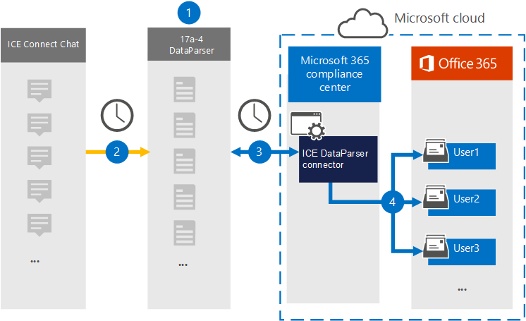

# Einrichten eines Connectors zum Archivieren von ICE-Verbinden Chatdaten (Vorschau)Set up a connector to archive ICE Connect Chat data (preview)

Verwenden Sie ice [DataParser](https://www.17a-4.com/ice-dataparser/) von 17a-4 LLC, um Daten aus ICE Verbinden Chat in Benutzerpostfächer in Ihrer Microsoft 365 Organisation zu importieren und zu archivieren.Use the [ICE DataParser](https://www.17a-4.com/ice-dataparser/) from 17a-4 LLC to import and archive data from ICE Connect Chat to user mailboxes in your Microsoft 365 organization. Der DataParser enthält einen ICE-Chat-Connector, der so konfiguriert ist, dass Elemente aus einer Datenquelle eines Drittanbieters erfasst und diese Elemente in Microsoft 365 importiert werden.The DataParser includes an ICE Chat connector that's configured to capture items from a third-party data source and import those items to Microsoft 365. Der ICE DataParser-Connector konvertiert ICE-Verbinden Chatdaten in ein E-Mail-Nachrichtenformat und importiert diese Elemente dann in Benutzerpostfächer in Microsoft 365.The ICE DataParser connector converts ICE Connect Chat data to an email message format and then imports those items to user mailboxes in Microsoft 365.

Nachdem ICE Verbinden Chatdaten in Benutzerpostfächern gespeichert wurden, können Sie Microsoft 365 Compliancefeatures wie Beweissicherung für juristische Zwecke, eDiscovery, Aufbewahrungsrichtlinien und Aufbewahrungsbezeichnungen sowie Kommunikationscompliance anwenden.After ICE Connect Chat data is stored in user mailboxes, you can apply Microsoft 365 compliance features such as Litigation Hold, eDiscovery, retention policies and retention labels, and communication compliance. Die Verwendung eines ICE DataParser-Connectors zum Importieren und Archivieren von Daten in Microsoft 365 kann Ihrer Organisation helfen, die Einhaltung von Behörden- und Behördlichen Richtlinien zu halten.Using an ICE DataParser connector to import and archive data in Microsoft 365 can help your organization stay compliant with government and regulatory policies.

## Übersicht über die Archivierung von ICE-ChatdatenOverview of archiving ICE Chat data

In der folgenden Übersicht wird der Prozess der Verwendung eines Datenkonnektors zum Archivieren von ICE Verbinden Chatdaten in Microsoft 365 erläutert.The following overview explains the process of using a data connector to archive ICE Connect Chat data in Microsoft 365.

1. Ihre Organisation arbeitet mit 17a-4 zusammen, um ice DataParser einzurichten und zu konfigurieren.Your organization works with 17a-4 to set up and configure the ICE DataParser.

2. In regelmäßigen Abständen werden ICE-Verbinden Chatelemente von DataParser gesammelt.On a regular basis, ICE Connect Chat items are collected by the DataParser. Der DataParser konvertiert auch den Inhalt einer Nachricht in ein E-Mail-Nachrichtenformat.The DataParser also converts the content of a message to an email message format.

3. Der ICE DataParser-Connector, den Sie im Microsoft 365 Compliance Center erstellen, stellt eine Verbindung mit DataParser her und überträgt die Nachrichten an einen sicheren Azure Storage Ort in der Microsoft-Cloud.The ICE DataParser connector that you create in the Microsoft 365 compliance center connects to DataParser and transfers the messages to a secure Azure Storage location in the Microsoft cloud.

4. Ein Unterordner im Posteingangsordner mit dem Namen **ICE DataParser** wird in den Benutzerpostfächern erstellt, und die ICE-Verbinden Chatelemente werden in diesen Ordner importiert.A subfolder in the Inbox folder named **ICE DataParser** is created in the user mailboxes, and the ICE Connect Chat items are imported to that folder. Der Connector bestimmt mithilfe des Werts der *E-Mail-Eigenschaft,* in welches Postfach Elemente importiert werden sollen.The connector determines which mailbox to import items to by using the value of the *Email* property. Jedes ICE-Verbinden Chatelement enthält diese Eigenschaft, die mit der E-Mail-Adresse jedes Teilnehmers aufgefüllt wird.Every ICE Connect Chat item contains this property, which is populated with the email address of every participant.

## Vor dem Einrichten eines ConnectorsBefore you set up a connector

- Erstellen Sie ein DataParser-Konto für Microsoft Connectors.Create a DataParser account for Microsoft connectors. Wenden Sie sich hierzu an [17a-4 LLC.](https://www.17a-4.com/contact/)To do this, contact [17a-4 LLC](https://www.17a-4.com/contact/). Sie müssen sich bei diesem Konto anmelden, wenn Sie den Connector in Schritt 1 erstellen.You need to sign into this account when you create the connector in Step 1.

- Der Benutzer, der den ICE DataParser-Connector in Schritt 1 erstellt (und in Schritt 3 abgeschlossen hat), muss der Rolle "Postfachimportexport" in Exchange Online zugewiesen werden.The user who creates the ICE DataParser connector in Step 1 (and completes it in Step 3) must be assigned to the Mailbox Import Export role in Exchange Online. Diese Rolle ist erforderlich, um Connectors auf der Seite **"Datenconnectors"** im Microsoft 365 Compliance Center hinzuzufügen.This role is required to add connectors on the **Data connectors** page in the Microsoft 365 compliance center. Standardmäßig ist diese Rolle keiner Rollengruppe in Exchange Online zugewiesen.By default, this role is not assigned to a role group in Exchange Online. Sie können die Rolle "Postfachimportexport" der Rollengruppe "Organisationsverwaltung" in Exchange Online hinzufügen.You can add the Mailbox Import Export role to the Organization Management role group in Exchange Online. Sie können auch eine Rollengruppe erstellen, die Rolle "Postfachimportexport" zuweisen und dann die entsprechenden Benutzer als Mitglieder hinzufügen.Or you can create a role group, assign the Mailbox Import Export role, and then add the appropriate users as members. Weitere Informationen finden Sie in den Abschnitten ["Erstellen von Rollengruppen"](/Exchange/permissions-exo/role-groups#create-role-groups) oder "Ändern von [Rollengruppen"](/Exchange/permissions-exo/role-groups#modify-role-groups) im Artikel "Verwalten von Rollengruppen in Exchange Online".For more information, see the [Create role groups](/Exchange/permissions-exo/role-groups#create-role-groups) or [Modify role groups](/Exchange/permissions-exo/role-groups#modify-role-groups) sections in the article "Manage role groups in Exchange Online".

## Schritt 1: Einrichten eines ICE DataParser-ConnectorsStep 1: Set up an ICE DataParser connector

Der erste Schritt besteht darin, auf die Seite "Datenconnectors" im Microsoft 365 Compliance Center zuzugreifen und einen 17a-4-Connector für ICE-Verbinden Chatdaten zu erstellen.The first step is to access to the Data connectors page in the Microsoft 365 compliance center and create a 17a-4 connector for ICE Connect Chat data.

1. Wechseln <https://compliance.microsoft.com> Sie zu **data connectors**  >  **ICE DataParser,** und klicken Sie dann darauf.Go to <https://compliance.microsoft.com> and then click **Data connectors** > **ICE DataParser**.

2. Klicken Sie auf der **Ice DataParser-Produktbeschreibungsseite** auf **Connector hinzufügen.**On the **ICE DataParser** product description page, click **Add connector**.

3. Klicken Sie auf der Seite **"Nutzungsbedingungen"** auf **"Annehmen".**On the **Terms of service** page, click **Accept**.

4. Geben Sie einen eindeutigen Namen ein, der den Connector identifiziert, und klicken Sie dann auf **"Weiter".**Enter a unique name that identifies the connector and then click **Next**.

5. Melden Sie sich bei Ihrem 17a-4-Konto an, und führen Sie die Schritte im ICE DataParser-Verbindungsassistenten aus.Sign in to your 17a-4 account and complete the steps in the ICE DataParser connection wizard.

## Schritt 2: Konfigurieren des ICE DataParser-ConnectorsStep 2: Configure the ICE DataParser connector

Arbeiten Sie mit der 17a-4-Unterstützung, um den ICE DataParser-Connector zu konfigurieren.Work with 17a-4 Support to configure the ICE DataParser connector.

## Schritt 3: Zuordnen von BenutzernStep 3: Map users

Der ICE DataParser-Connector ordnen Benutzer automatisch ihren Microsoft 365 E-Mail-Adressen zu, bevor Daten in Microsoft 365 importiert werden.The ICE DataParser connector will automatically map users to their Microsoft 365 email addresses before importing data to Microsoft 365.

## Schritt 4: Überwachen des ICE DataParser-ConnectorsStep 4: Monitor the ICE DataParser connector

Nachdem Sie einen ICE DataParser-Connector erstellt haben, können Sie den Connectorstatus im Microsoft 365 Compliance Center anzeigen.After you create an ICE DataParser connector, you can view the connector status in the Microsoft 365 compliance center.

1. Wechseln Sie in <https://compliance.microsoft.com> der linken Navigationsleiste zu "Datenconnectors", und klicken Sie auf **"Datenconnectors".**Go to <https://compliance.microsoft.com> and click **Data connectors** in the left nav.

2. Klicken Sie auf die Registerkarte **Connectors,** und wählen Sie dann den ICE DataParser-Connector aus, den Sie erstellt haben, um die Flyoutseite anzuzeigen, die die Eigenschaften und Informationen zum Connector enthält.Click the **Connectors** tab and then select the ICE DataParser connector that you created to display the flyout page, which contains the properties and information about the connector.

3. Klicken Sie unter **Connectorstatus mit Quelle** auf den Link **"Protokoll herunterladen",** um das Statusprotokoll für den Connector zu öffnen (oder zu speichern).Under **Connector status with source**, click the **Download log** link to open (or save) the status log for the connector. Dieses Protokoll enthält Daten, die in die Microsoft-Cloud importiert wurden.This log contains data that has been imported to the Microsoft cloud.

## Bekannte ProblemeKnown issues

Derzeit wird das Importieren von Anlagen oder Elementen, die größer als 10 MB sind, nicht unterstützt.At this time, we don't support importing attachments or items that are larger than 10 MB. Unterstützung für größere Elemente wird zu einem späteren Zeitpunkt verfügbar sein.Support for larger items will be available at a later date.
