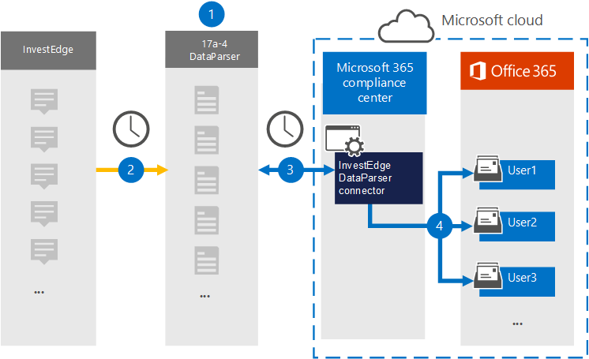

# Einrichten eines Connectors zum Archivieren von InvestEdge-Daten

Verwenden Sie ["InvestEdge DataParser"](https://www.17a-4.com/investedge-dataparser/) von 17a-4 LLC, um Daten aus "InvestEdge" in Benutzerpostfächer in Ihrer Microsoft 365 Organisation zu importieren und zu archivieren. The DataParser includes a InvestEdge connector that's configured to capture items from a third-party data source and import those items to Microsoft 365. Der InvestEdge DataParser-Connector konvertiert InvestEdge-Daten in ein E-Mail-Nachrichtenformat und importiert diese Elemente dann in Benutzerpostfächer in Microsoft 365.

Nachdem InvestEdge-Daten in Benutzerpostfächern gespeichert wurden, können Sie Microsoft 365 Compliancefeatures wie Beweissicherung für juristische Zwecke, eDiscovery, Aufbewahrungsrichtlinien und Aufbewahrungsbezeichnungen sowie Kommunikationscompliance anwenden. Die Verwendung eines InvestEdge-Connectors zum Importieren und Archivieren von Daten in Microsoft 365 kann Ihrer Organisation helfen, die Einhaltung von Regierungsrichtlinien und behördlichen Richtlinien zu halten.

## Übersicht über die Archivierung von InvestEdge-Daten

In der folgenden Übersicht wird der Prozess der Verwendung eines Datenkonnektors zum Archivieren von InvestEdge-Daten in Microsoft 365 erläutert.

1. Ihre Organisation arbeitet mit 17a-4 zusammen, um "InvestEdge DataParser" einzurichten und zu konfigurieren.

2. In regelmäßigen Abständen werden "InvestEdge"-Elemente von DataParser gesammelt. Der DataParser konvertiert auch den Inhalt einer Nachricht in ein E-Mail-Nachrichtenformat.

3. Der InvestEdge DataParser-Connector, den Sie im Microsoft 365 Compliance Center erstellen, stellt eine Verbindung mit DataParser her und überträgt die Nachrichten an einen sicheren Azure Storage Ort in der Microsoft-Cloud.

4. Ein Unterordner im Posteingangsordner mit dem Namen **"InvestEdge DataParser"** wird in den Benutzerpostfächern erstellt, und die "InvestEdge"-Elemente werden in diesen Ordner importiert. Der Connector bestimmt mithilfe des Werts der *E-Mail-Eigenschaft,* in welches Postfach Elemente importiert werden sollen. Jedes InvestEdge-Element enthält diese Eigenschaft, die mit der E-Mail-Adresse jedes Teilnehmers aufgefüllt wird.

## Vor dem Einrichten eines Connectors

- Erstellen Sie ein DataParser-Konto für Microsoft Connectors. Wenden Sie sich hierzu an [17a-4 LLC.](https://www.17a-4.com/contact/) Sie müssen sich bei diesem Konto anmelden, wenn Sie den Connector in Schritt 1 erstellen.

- Der Benutzer, der den InvestEdge DataParser-Connector in Schritt 1 erstellt (und in Schritt 3 abgeschlossen hat), muss der Rolle "Postfachimportexport" in Exchange Online zugewiesen werden. Diese Rolle ist erforderlich, um Connectors auf der Seite **"Datenconnectors"** im Microsoft 365 Compliance Center hinzuzufügen. Standardmäßig ist diese Rolle keiner Rollengruppe in Exchange Online zugewiesen. Sie können die Rolle "Postfachimportexport" der Rollengruppe "Organisationsverwaltung" in Exchange Online hinzufügen. Sie können auch eine Rollengruppe erstellen, die Rolle "Postfachimportexport" zuweisen und dann die entsprechenden Benutzer als Mitglieder hinzufügen. Weitere Informationen finden Sie in den Abschnitten ["Erstellen von Rollengruppen"](/Exchange/permissions-exo/role-groups#create-role-groups) oder "Ändern von [Rollengruppen"](/Exchange/permissions-exo/role-groups#modify-role-groups) im Artikel "Verwalten von Rollengruppen in Exchange Online".

## Schritt 1: Einrichten eines InvestEdge DataParser-Connectors

Der erste Schritt besteht darin, auf die Seite "Datenkonnektoren" im Microsoft 365 Compliance Center zuzugreifen und einen 17a-4-Connector für InvestEdge-Daten zu erstellen.

1. Wechseln Sie zu <https://compliance.microsoft.com> "Data Connectors InvestEdge DataParser", und klicken Sie dann auf **"Datenkonnektoren".**  >  

2. Klicken Sie auf der Seite **"InvestEdge DataParser-Produktbeschreibung"** auf **"Connector hinzufügen".**

3. Klicken Sie auf der Seite **"Nutzungsbedingungen"** auf **"Annehmen".**

4. Geben Sie einen eindeutigen Namen ein, der den Connector identifiziert, und klicken Sie dann auf **"Weiter".**

5. Melden Sie sich bei Ihrem 17a-4-Konto an, und führen Sie die Schritte im InvestEdge DataParser-Verbindungs-Assistenten aus.

## Schritt 2: Konfigurieren des "InvestEdge DataParser"-Connectors

Arbeiten Sie mit dem 17a-4-Support, um den InvestEdge DataParser-Connector zu konfigurieren.

## Schritt 3: Zuordnen von Benutzern

Der InvestEdge DataParser-Connector ordnen Benutzer automatisch ihren Microsoft 365 E-Mail-Adressen zu, bevor Daten in Microsoft 365 importiert werden.

## Schritt 4: Überwachen des InvestEdge DataParser-Connectors

Nachdem Sie einen InvestEdge DataParser-Connector erstellt haben, können Sie den Connectorstatus im Microsoft 365 Compliance Center anzeigen.

1. Wechseln Sie in <https://compliance.microsoft.com> der linken Navigationsleiste zu "Datenconnectors", und klicken Sie auf **"Datenconnectors".**

2. Klicken Sie auf die Registerkarte **Connectors,** und wählen Sie dann den Von Ihnen erstellten InvestEdge DataParser-Connector aus, um die Flyoutseite anzuzeigen, die die Eigenschaften und Informationen zum Connector enthält.

3. Klicken Sie unter **Connectorstatus mit Quelle** auf den Link **"Protokoll herunterladen",** um das Statusprotokoll für den Connector zu öffnen (oder zu speichern). Dieses Protokoll enthält Daten, die in die Microsoft-Cloud importiert wurden.

## Bekannte Probleme

Derzeit wird das Importieren von Anlagen oder Elementen, die größer als 10 MB sind, nicht unterstützt. Unterstützung für größere Elemente wird zu einem späteren Zeitpunkt verfügbar sein.
