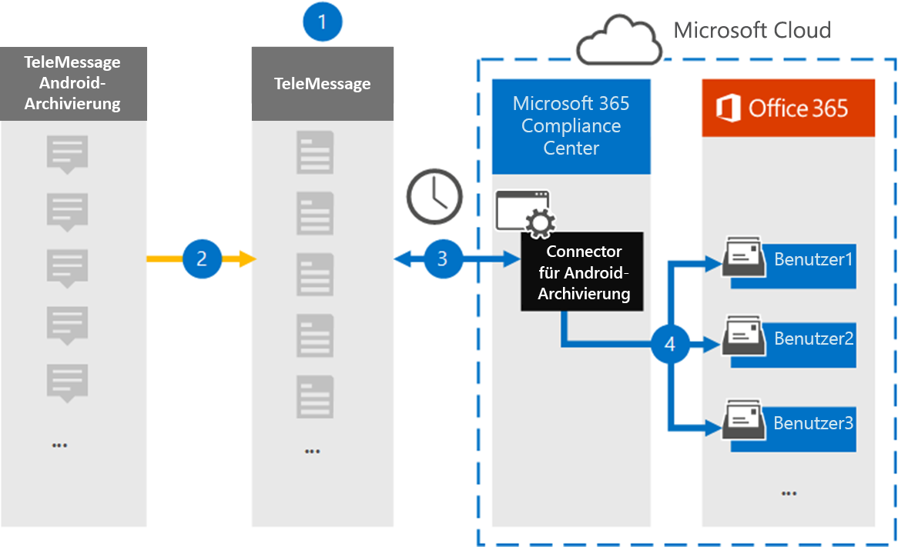

# Einrichten eines Connectors zum Archivieren von mobilen Android-Daten

Verwenden Sie einen TeleMessage Connector im Microsoft 365 Compliance Center, um SMS, MMS, Sprachanrufe und Anrufprotokolle von Android-Mobiltelefonen zu importieren und zu archivieren. Nachdem Sie einen Connector eingerichtet und konfiguriert haben, stellt er einmal täglich eine Verbindung mit dem Tele Nachrichtenkonto Ihrer Organisation her und importiert die mobile Kommunikation der Mitarbeiter mit dem TeleMessage Android Archiver auf Postfächer in Microsoft 365.

Nachdem Daten von Android-Mobiltelefonen in Benutzerpostfächern gespeichert sind, können Sie Microsoft 365-Compliance-Features wie Beweissicherungsverfahren, Inhaltssuche und Microsoft 365-Aufbewahrungsrichtlinien auf Android Archiver-Daten anwenden. Sie können beispielsweise die mobile Android Archiver-Kommunikation mithilfe der Inhaltssuche durchsuchen oder das Postfach, das die Daten des Android Archiver Connectors enthält, einer Depotbank in einem erweiterten eDiscovery-Fall zuordnen. Die Verwendung eines Android Archiver Connectors zum Importieren und Archivieren von Daten in Microsoft 365 kann dazu beitragen, dass Ihre Organisation mit behördlichen und behördlichen Richtlinien konform bleibt.

## Übersicht über die Archivierung von mobilen Android-Daten

In der folgenden Übersicht wird erläutert, wie Sie einen Connector zum Archivieren von Android-mobil Daten in Microsoft 365 verwenden.

1. Ihre Organisation arbeitet mit telemessaging zusammen, um einen Android Archiver Connector einzurichten. Weitere Informationen finden Sie unter [Android Archiver](https://www.telemessage.com/office365-activation-for-android-archiver/).

2. Einmal alle 24 Stunden werden SMS, MMS, Sprachanrufe und Anrufprotokolle von Android-Mobiltelefonen Ihrer Organisation auf die TeleMessage-Website kopiert.

3. Der Android Archiver Connector, den Sie im Microsoft 365 Compliance Center erstellen, stellt jeden Tag eine Verbindung mit der TeleMessage-Website her und überträgt die Android-Daten aus den vorherigen 24 Stunden an einen sicheren Azure-Speicherort in der Microsoft-Cloud. Der Connector wandelt auch die Android-Daten in ein e-Mail-Nachrichtenformat um.

4. Der Connector importiert die mobilen Kommunikationselemente in das Postfach eines bestimmten Benutzers. Ein neuer Ordner namens Android Archiver wird im Postfach des jeweiligen Benutzers erstellt, und die Elemente werden darin importiert. Der Connector wird mithilfe des Werts der *e-Mail-Adress* Eigenschaft des Benutzers zugeordnet. Jede e-Mail-Nachricht enthält diese Eigenschaft, die mit der e-Mail-Adresse jedes Teilnehmers der e-Mail-Nachricht aufgefüllt wird. Zusätzlich zur automatischen Benutzerzuordnung mithilfe des Werts der *e-Mail-Adress* Eigenschaft des Benutzers können Sie auch eine benutzerdefinierte Zuordnung definieren, indem Sie eine CSV-Zuordnungsdatei hochladen. Diese Zuordnungsdatei sollte die Mobiltelefonnummer des Benutzers und die entsprechende Microsoft 365-Postfachadresse für jeden Benutzer enthalten. Wenn Sie die automatische Benutzerzuordnung aktivieren und eine benutzerdefinierte Zuordnung bereitstellen, wird der Connector für jedes e-Mail-Element zuerst die benutzerdefinierte Zuordnungsdatei betrachten. Wenn kein gültiger Microsoft 365-Benutzer gefunden wird, der der Mobiltelefonnummer eines Benutzers entspricht, verwendet der Connector die e-Mail-Adresse des Benutzers des e-Mail-Elements. Wenn der Connector keinen gültigen Microsoft 365-Benutzer in der benutzerdefinierten Zuordnungsdatei oder der *e-Mail-Adresse des Benutzers* des e-Mail-Elements findet, wird das Element nicht importiert.

## Bevor Sie beginnen:

Einige der Implementierungsschritte, die zum Archivieren von Android-Kommunikationsdaten erforderlich sind, sind extern bei Microsoft 365 und müssen abgeschlossen sein, bevor Sie den Connector im Compliance Center erstellen können.

- Bestellen Sie den [Android Archiver-Dienst über telemessaging](https://www.telemessage.com/mobile-archiver/order-mobile-archiver-for-o365) , und erhalten Sie ein gültiges Verwaltungskonto für Ihre Organisation. Sie müssen sich bei diesem Konto anmelden, wenn Sie den Connector erstellen.

- Registrieren Sie alle Benutzer, die den Android Archiver-Dienst benötigen, im Konto "telemail". Achten Sie beim Registrieren von Benutzern darauf, dieselbe e-Mail-Adresse zu verwenden, die für Ihr Microsoft 365-Konto verwendet wird.

- Installieren und aktivieren Sie die telemail Android Archiver-App auf den Mobiltelefonen ihrer Mitarbeiter.

- Dem Benutzer, der einen Android Archiver-Connector erstellt, muss in Exchange Online die Rolle "Post Fach Import Export" zugewiesen sein. Dies ist für das Hinzufügen von Connectors auf der Seite " **Daten Konnektoren** " im Microsoft 365 Compliance Center erforderlich. Standardmäßig ist diese Rolle keiner Rollengruppe in Exchange Online zugewiesen. Sie können die Rolle "Post Fach Import exportieren" der Rollengruppe "Organisationsverwaltung" in Exchange Online hinzufügen. Sie können auch eine Rollengruppe erstellen, die Rolle "Post Fach Import Export" zuweisen und dann die entsprechenden Benutzer als Mitglieder hinzufügen. Weitere Informationen finden Sie im Abschnitt [Erstellen](https://docs.microsoft.com/Exchange/permissions-exo/role-groups#create-role-groups) von Rollengruppen oder [Ändern von Rollengruppen](https://docs.microsoft.com/Exchange/permissions-exo/role-groups#modify-role-groups) im Artikel "Verwalten von Rollengruppen in Exchange Online".

## Erstellen eines Android Archiver Connectors

Der letzte Schritt besteht darin, einen Android Archiver Connector im Microsoft 365 Compliance Center zu erstellen. Der Connector verwendet die von Ihnen bereitgestellten Informationen, um eine Verbindung mit der telemessaging-Website herzustellen und die Android-Kommunikation an die entsprechenden Benutzerpostfach-Felder in Microsoft 365 zu übertragen.

1. Wechseln [https://compliance.microsoft.com](https://compliance.microsoft.com) Sie zu und klicken Sie auf **Daten-Konnektoren**  >  **Android Archiver**.

2. Klicken Sie auf der Seite **Android Archiver** Produktbeschreibung auf **Connector hinzufügen**.

3. Klicken Sie auf der Seite **Nutzungsbedingungen** auf **annehmen**.

4. Geben Sie auf der Seite **Anmeldung bei TeleMessage** unter Schritt 3 die erforderlichen Informationen in die folgenden Felder ein, und klicken Sie dann auf **weiter**.

   - **Benutzername:** Ihren Benutzernamen für die e-Mail-Nachricht.

   - **Kennwort:** Ihr TeleMessage-Kennwort.

5. Nachdem Sie den Connector erstellt haben, schließen Sie das Popupfenster, und klicken Sie auf **weiter**.

6. Aktivieren Sie auf der Seite **Benutzerzuordnung** die Option Automatische Benutzerzuordnung, und klicken Sie auf **weiter**. Wenn Sie eine benutzerdefinierte Zuordnung benötigen, laden Sie eine CSV-Datei hoch, und klicken Sie auf **weiter**.

7. Überprüfen Sie Ihre Einstellungen, und klicken Sie dann auf **Fertig stellen** , um den Connector zu erstellen.

8. Wechseln Sie zur Registerkarte Konnektoren auf der Seite **Daten Konnektoren** , um den Fortschritt des Importvorgangs für den neuen Connector anzuzeigen.

## Bekannte Probleme

- Zurzeit wird das Importieren von Anlagen oder Elementen, die größer als 10 MB sind, nicht unterstützt. Unterstützung für größere Elemente wird zu einem späteren Zeitpunkt zur Verfügung stehen.
