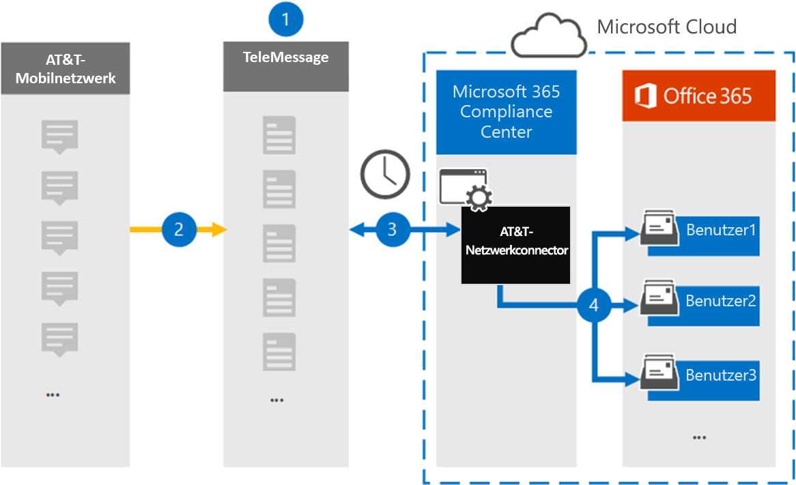

# Einrichten eines Connectors zum Archivieren bei&T-SMS/MMS-Daten (Vorschau)

Verwenden Sie einen TeleMessage Connector im Microsoft 365 Compliance Center, um SMS-und MMS-Daten aus dem Mobilfunknetz von&T zu importieren und zu archivieren. Nachdem Sie einen Connector eingerichtet und konfiguriert haben, stellt er eine Verbindung mit dem&T-Netzwerk Ihres Unternehmens täglich her und importiert SMS-und MMS-Daten in Postfächer in Microsoft 365.

Nachdem SMS-und MMS-Nachrichten in Benutzerpostfächern gespeichert wurden, können Sie Microsoft 365-Compliance-Features wie Beweissicherungsverfahren, Inhaltssuche und Microsoft 365-Aufbewahrungsrichtlinien auf&T-Netzwerkdaten anwenden. Sie können beispielsweise bei&t-Netzwerkdaten mithilfe der Inhaltssuche suchen oder das Postfach, das die at&t-Netzwerk connectordaten enthält, einer Depotbank in einem erweiterten eDiscovery-Fall zuordnen. Durch die Verwendung eines at&T-Netzwerk Connectors zum Importieren und Archivieren von Daten in Microsoft 365 können Sie Ihrer Organisation dabei helfen, mit behördlichen und behördlichen Richtlinien konform zu bleiben.

## Übersicht über die Archivierung bei&T-Netzwerkdaten

In der folgenden Übersicht wird der Vorgang der Verwendung eines Connectors zum Archivieren von&T-Netzwerkdaten in Microsoft 365 erläutert.

1. Ihre Organisation arbeitet mit TeleMessage zusammen, um einen at&T Network Connector einzurichten. Weitere Informationen finden Sie unter [&T Network Archiver](https://www.telemessage.com/office365-activation-for-atnt-network-archiver/).

2. Einmal alle 24 Stunden werden SMS-und MMS-Nachrichten aus dem&T-Netzwerk Ihrer Organisation an die TeleMessage-Website kopiert.

3. Der an&T Network Connector, den Sie im Microsoft 365 Compliance Center erstellen, stellt jeden Tag eine Verbindung mit der TeleMessage-Website her und überträgt die SMS-und MMS-Nachrichten aus den vorherigen 24 Stunden an einen sicheren Azure-Speicherort in der Microsoft-Cloud. Der Connector wandelt auch den Inhalt von SMS-und MMS-Nachrichten in ein e-Mail-Nachrichtenformat um.

4. Der Connector importiert die mobilen Kommunikationselemente in das Postfach bestimmter Benutzer. Ein neuer Ordner namens **at&T SMS/MMS Network Archiver** wird im Postfach des Benutzers erstellt, und die Elemente werden darin importiert. Der Connector führt diese Zuordnung mithilfe des Werts der *e-Mail-Adress* Eigenschaft des Benutzers aus. Jede SMS-und MMS-Nachricht enthält diese Eigenschaft, die mit der e-Mail-Adresse jedes Teilnehmers der Nachricht aufgefüllt wird.
 
   Zusätzlich zur automatischen Benutzerzuordnung mithilfe des Werts der *e-Mail-Adress* Eigenschaft des Benutzers können Sie auch eine benutzerdefinierte Zuordnung definieren, indem Sie eine CSV-Zuordnungsdatei hochladen. Diese Zuordnungsdatei enthält die Mobiltelefonnummer und die entsprechende Microsoft 365-e-Mail-Adresse für Benutzer in Ihrer Organisation. Wenn Sie sowohl die automatische Benutzerzuordnung als auch die benutzerdefinierte Zuordnung aktivieren, sucht der Connector für jedes e-Mail-Element zuerst die benutzerdefinierte Zuordnungsdatei. Wenn kein gültiger Microsoft 365-Benutzer gefunden wird, der einer Mobiltelefonnummer entspricht, verwendet der Connector die Werte in der e-Mail-Adress Eigenschaft des Elements, das er zu importieren versucht. Wenn der Connector keinen gültigen Microsoft 365-Benutzer in der benutzerdefinierten Zuordnungsdatei oder in der e-Mail-Adress Eigenschaft des e-Mail-Elements findet, wird das Element nicht importiert.

## Bevor Sie beginnen

Einige der erforderlichen Implementierungsschritte zum Archivieren bei&T-Netzwerkdaten liegen außerhalb von Microsoft 365 und müssen abgeschlossen sein, bevor Sie den Connector im Compliance Center erstellen können.

- Bestellen Sie den [mobilen Archivierungsdienst über telemessaging](https://www.telemessage.com/mobile-archiver/order-mobile-archiver-for-o365/) , und erhalten Sie ein gültiges Verwaltungskonto für Ihre Organisation. Sie müssen sich bei diesem Konto anmelden, wenn Sie den Connector im Compliance Center erstellen.

- Erhalten Sie Ihre unter&T-Konto-und Rechnungskontakt Details, damit Sie die Formulare für die Telefonnachrichten ausfüllen und den Nachrichten Archivierungsdienst unter&T bestellen können.

- Registrieren Sie alle Benutzer, die bei&T SMS/MMS-Netzwerk Archivierung in das TeleMessage-Konto benötigen. Achten Sie beim Registrieren von Benutzern darauf, dieselbe e-Mail-Adresse zu verwenden, die für Ihr Microsoft 365-Konto verwendet wird.

- Ihre Mitarbeiter müssen über unternehmenseigene und Unternehmens hafte Mobiltelefone im&T-Mobilfunknetz verfügen. Das Archivieren von Nachrichten in Microsoft 365 ist nicht für Mitarbeiter eigene Geräte oder "Bring your own Devices (BYOD)" zur Verfügung.

- Ihre Organisation muss einwilligen, dass der Office 365 Import Dienst auf Postfachdaten in Ihrer Organisation zugreifen kann. Sie müssen diese Zustimmung erteilen, wenn Sie den Connector erstellen. Um dieser Anforderung zuzustimmen, gehen Sie zu [dieser Seite](https://login.microsoftonline.com/common/oauth2/authorize?client_id=570d0bec-d001-4c4e-985e-3ab17fdc3073&response_type=code&redirect_uri=https://portal.azure.com/&nonce=1234&prompt=admin_consent), melden Sie sich mit den Anmeldeinformationen des globalen Administrators von Microsoft 365 an, und nehmen Sie dann die Anforderung an. Sie müssen diesen Schritt ausführen, bevor Sie erfolgreich einen at&T Network Connector erstellen können.

- Der Benutzer, der einen at&T-Netzwerk Connector erstellt, muss in Exchange Online die Rolle "Post Fach Import Export" zugewiesen haben. Dies ist für das Hinzufügen von Connectors auf der Seite " **Daten Konnektoren** " im Microsoft 365 Compliance Center erforderlich. Standardmäßig ist diese Rolle keiner Rollengruppe in Exchange Online zugewiesen. Sie können die Rolle "Post Fach Import exportieren" der Rollengruppe "Organisationsverwaltung" in Exchange Online hinzufügen. Sie können auch eine Rollengruppe erstellen, die Rolle "Post Fach Import Export" zuweisen und dann die entsprechenden Benutzer als Mitglieder hinzufügen. Weitere Informationen finden Sie im Abschnitt [Erstellen](https://docs.microsoft.com/Exchange/permissions-exo/role-groups#create-role-groups) von Rollengruppen oder [Ändern von Rollengruppen](https://docs.microsoft.com/Exchange/permissions-exo/role-groups#modify-role-groups) im Artikel "Verwalten von Rollengruppen in Exchange Online".

## Erstellen eines at&T-Netzwerk Connectors

Nachdem Sie die im vorherigen Abschnitt beschriebenen Voraussetzungen erfüllt haben, können Sie einen at&T Network Connector im Microsoft 365 Compliance Center erstellen. Der Connector verwendet die von Ihnen bereitgestellten Informationen, um eine Verbindung mit der telemessaging-Website herzustellen und SMS-und MMS-Nachrichten an die entsprechenden Benutzerpostfach-Postfächer in Microsoft 365 zu übertragen.

1. Wechseln Sie zu, [https://compliance.microsoft.com](https://compliance.microsoft.com/) und klicken Sie dann auf **Daten Konnektoren**  \  **bei&T-Netzwerk**.

2. Klicken Sie auf der Seite **&T-Netzwerkprodukt** Beschreibung auf **Connector hinzufügen**

3. Klicken Sie auf der Seite **Nutzungsbedingungen** auf **annehmen**.

4. Geben Sie auf der Seite **Anmeldung bei TeleMessage** unter Schritt 3 die erforderlichen Informationen in die folgenden Felder ein, und klicken Sie dann auf **weiter**.

   - **Benutzername:** Ihren Benutzernamen für die e-Mail-Nachricht.

   - **Kennwort:** Ihr TeleMessage-Kennwort.

5. Nachdem der Connector erstellt wurde, können Sie das Popupfenster schließen und zur nächsten Seite wechseln.

6. Aktivieren Sie auf der Seite **Benutzerzuordnung** die Option Automatische Benutzerzuordnung. Zum Aktivieren der benutzerdefinierten Zuordnung laden Sie eine CSV-Datei hoch, die die Benutzer Zuordnungsinformationen enthält, und klicken Sie dann auf **weiter**.

7. Geben Sie die Zustimmung des Administrators ein, und klicken Sie auf **weiter**.

   Um die Zustimmung des Administrators bereitzustellen, müssen Sie mit den Anmeldeinformationen eines Office 365 globalen Administrators angemeldet sein und dann die Zustimmungs Anforderung annehmen. Wenn Sie nicht als globaler Administrator angemeldet sind, können Sie zu [dieser Seite](https://login.microsoftonline.com/common/oauth2/authorize?client_id=570d0bec-d001-4c4e-985e-3ab17fdc3073&response_type=code&redirect_uri=https://portal.azure.com/&nonce=1234&prompt=admin_consent) wechseln und sich mit globalen Administratoranmeldeinformationen anmelden, um die Anforderung zu akzeptieren. 

8. Überprüfen Sie Ihre Einstellungen, und klicken Sie dann auf **Fertig stellen** , um den Connector zu erstellen.

9. Wechseln Sie zur Registerkarte **Connectors** auf der Seite **Daten Konnektoren** im Compliance Center, um den Fortschritt des Importvorgangs für den neuen Connector anzuzeigen.

## Bekannte Probleme

- Zurzeit wird kein Import von Anlagen unterstützt, die größer als 10 MB sind, aber die Unterstützung größerer Elemente wird zu einem späteren Zeitpunkt zur Verfügung stehen.
