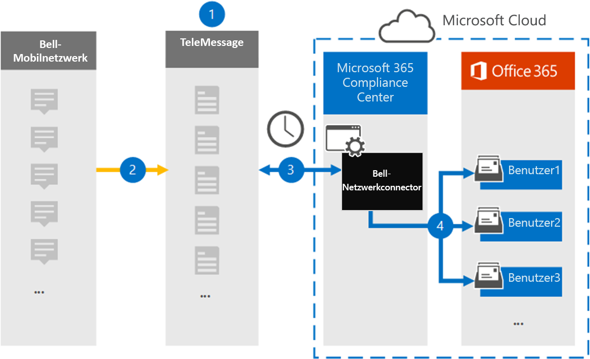

# Einrichten eines Connectors zum Archivieren von Bell Network-DatenSet up a connector to archive Bell Network data

Verwenden Sie einen TeleMessage-Connector im Microsoft 365 Compliance Center, um Sms- und MMS-Nachrichten (Short Messaging Service) aus dem Glockennetzwerk zu importieren und zu archivieren.Use a TeleMessage connector in the Microsoft 365 compliance center to import and archive Short Messaging Service (SMS) and Multimedia Messaging Service (MMS) messages from the Bell Network. Nachdem Sie einen Connector eingerichtet und konfiguriert haben, verbindet er sich einmal täglich mit dem Bell Network Ihrer Organisation und importiert SMS- und MMS-Nachrichten in Postfächer in Microsoft 365.After you set up and configure a connector, it connects to your organization's Bell Network once every day, and imports SMS and MMS messages to mailboxes in Microsoft 365.

Nachdem die SMS- und MMS-Nachrichten in Benutzerpostfächern gespeichert wurden, können Sie Microsoft 365-Compliancefeatures wie das Rechtsstreitigkeiten, die Inhaltssuche und Microsoft 365-Aufbewahrungsrichtlinien auf Bell Network-Daten anwenden.After the SMS and MMS messages are stored in user mailboxes, you can apply Microsoft 365 compliance features such as Litigation Hold, Content Search, and Microsoft 365 retention policies to Bell Network data. Sie können z. B. mithilfe der Inhaltssuche nach Bell Network SMS/MMS suchen oder das Postfach, das die Bell Network Connector-Daten enthält, einem Custodian in einem Advanced eDiscovery-Fall zuordnen.For example, you can search Bell Network SMS/MMS using Content Search or associate the mailbox that contains the Bell Network connector data with a custodian in an Advanced eDiscovery case. Die Verwendung eines Bell Network-Connectors zum Importieren und Archivieren von Daten in Microsoft 365 kann Dazu beitragen, dass Ihre Organisation den richtlinienkonformen Richtlinien von Behörden und Behörden entspricht.Using a Bell Network connector to import and archive data in Microsoft 365 can help your organization stay compliant with government and regulatory policies.

## Übersicht über die Archivierung von Bell Network-DatenOverview of archiving Bell Network data

In der folgenden Übersicht wird der Prozess der Verwendung eines Connectors zum Archivieren von Bell Network-Daten in Microsoft 365 erläutert.The following overview explains the process of using a connector to archive Bell Network data in Microsoft 365.

1. Ihre Organisation arbeitet mit TeleMessage und Bell zusammen, um einen Bell Network Connector zu einrichten.Your organization works with TeleMessage and Bell to set up a Bell Network connector. Weitere Informationen finden Sie unter [Bell Network Archiver](https://www.telemessage.com/office365-activation-for-bell-network-archiver).For more information, see [Bell Network Archiver](https://www.telemessage.com/office365-activation-for-bell-network-archiver).

2. Alle 24 Stunden werden SMS- und MMS-Nachrichten aus dem Bell Network Ihrer Organisation auf die TeleMessage-Website kopiert.Once every 24 hours, SMS and MMS messages from your organization’s Bell Network are copied to the TeleMessage site.

3. Der im Microsoft 365 Compliance Center erstellte Glockennetzwerkconnector stellt täglich eine Verbindung mit dem TeleMessage-Standort bereit und überträgt die SMS- und MMS-Nachrichten aus den vorherigen 24 Stunden an einen sicheren Azure Storage-Speicherort in der Microsoft Cloud.The Bell Network connector that you create in the Microsoft 365 compliance center connects to the TeleMessage site every day and transfers the SMS and MMS messages from the previous 24 hours to a secure Azure Storage location in the Microsoft Cloud. Der Connector konvertiert auch den Inhalt von SMS- und MMS-Nachrichten in ein E-Mail-Nachrichtenformat.The connector also converts the content of SMS and MMS messages to an email message format.

4. Der Connector importiert die mobilen Kommunikationselemente in das Postfach bestimmter Benutzer.The connector imports the mobile communication items to the mailbox of specific users. Ein neuer Ordner namens **Bell SMS/MMS Network Archiver** wird im Postfach eines bestimmten Benutzers erstellt, und die Elemente werden in das Postfach importiert.A new folder named **Bell SMS/MMS Network Archiver** is created in a specific user's mailbox and the items are imported to it. Der Connector führt diese Zuordnung mithilfe des Werts der E-Mail-Adresseigenschaft *des Benutzers* aus.The connector does this mapping by using the value of the *User’s Email address* property. Jede SMS- und MMS-Nachricht enthält diese Eigenschaft, die mit der E-Mail-Adresse jedes Teilnehmers der Nachricht aufgefüllt wird.Every SMS and MMS message contains this property, which is populated with the email address of every participant of the message.

   Neben der automatischen Benutzerzuordnung mithilfe  des Werts der E-Mail-Adresseigenschaft des Benutzers können Sie auch eine benutzerdefinierte Zuordnung definieren, indem Sie eine CSV-Zuordnungsdatei hochladen.In addition to automatic user mapping using the value of the *User’s Email address* property, you can also define a custom mapping by uploading a CSV mapping file. Diese Zuordnungsdatei enthält die Mobiltelefonnummer und die entsprechende Microsoft 365-E-Mail-Adresse für Benutzer in Ihrer Organisation.This mapping file contains the mobile phone number and corresponding Microsoft 365 email address for users in your organization. Wenn Sie sowohl die automatische Benutzerzuordnung als auch die benutzerdefinierte Zuordnung aktivieren, betrachtet der Connector zunächst für jedes Bell Network-Element die benutzerdefinierte Zuordnungsdatei.If you enable both automatic user mapping and custom mapping, for every Bell Network item the connector first looks at custom mapping file. Wenn er keinen gültigen Microsoft 365-Benutzer findet, der der Mobiltelefonnummer eines Benutzers entspricht, verwendet der Connector die Werte in der E-Mail-Adresseigenschaft des Elements, das importiert werden soll.If it doesn't find a valid Microsoft 365 user that corresponds to a user's mobile phone number, the connector will use the values in the email address property of the item it's trying to import. Wenn der Connector keinen gültigen Microsoft 365-Benutzer in der benutzerdefinierten Zuordnungsdatei oder in der E-Mail-Adresseigenschaft des Bell Network-Elements findet, wird das Element nicht importiert.If the connector doesn't find a valid Microsoft 365 user in either the custom mapping file or in the email address property of the Bell Network item, the item won't be imported.

## Bevor Sie beginnenBefore you begin

Einige der implementierungsschritte, die zum Archivieren von Bell Network-Daten erforderlich sind, sind außerhalb von Microsoft 365 und müssen abgeschlossen sein, bevor Sie einen Connector im Compliance Center erstellen können.Some of the implementation steps required to archive Bell Network data are external to Microsoft 365 and must be completed before you can create a connector in the compliance center.

- Bestellen Sie [den Bell Network Archiver-Dienst bei TeleMessage,](https://www.telemessage.com/mobile-archiver/order-mobile-archiver-for-o365/) und erhalten Sie ein gültiges Verwaltungskonto für Ihre Organisation.Order the [Bell Network Archiver service from TeleMessage](https://www.telemessage.com/mobile-archiver/order-mobile-archiver-for-o365/) and get a valid administration account for your organization. Sie müssen sich bei diesem Konto anmelden, wenn Sie den Connector im Compliance Center erstellen.You'll need to sign into this account when you create the connector in the compliance center.

- Rufen Sie Ihr Bell Network-Konto und Ihre Abrechnungskontaktdetails ab, damit Sie die TeleMessage-Onboardingformulare ausfüllen und den Nachrichtenarchivierungsdienst bei Bell bestellen können.Obtain your Bell Network account and billing contact details so you can fill-out the TeleMessage onboarding forms and order the message archiving service from Bell.

- Registrieren Sie alle Benutzer, für die eine Bell SMS/MMS-Netzwerkarchivierung erforderlich ist, im TeleMessage-Konto.Register all users that require Bell SMS/MMS Network archiving in the TeleMessage account. Verwenden Sie bei der Registrierung von Benutzern die gleiche E-Mail-Adresse, die für ihr Microsoft 365-Konto verwendet wird.When registering users, be sure to use the same email address that's used for their Microsoft 365 account.

- Ihre Mitarbeiter müssen über unternehmenseigene und unternehmensverlässige Mobiltelefone im Mobilfunknetzwerk Bell verfügen.Your employees must have corporate-owned and corporate-liable mobile phones on the Bell mobile network. Archivierungsnachrichten in Microsoft 365 sind nicht für Geräte im Besitz von Mitarbeitern oder "Bring Your Own Devices( BYOD) verfügbar.Archiving messages in Microsoft 365 isn't available for employee-owned or "Bring Your Own Devices (BYOD) devices.

- Dem Benutzer, der einen Bell Network Connector erstellt, muss die Rolle Postfachimportexport in Exchange Online zugewiesen werden.The user who creates a Bell Network connector must be assigned the Mailbox Import Export role in Exchange Online. Dies ist erforderlich, um Connectors auf der Seite **Datenconnectors** im Microsoft 365 Compliance Center hinzuzufügen.This is required to add connectors in the **Data connectors** page in the Microsoft 365 compliance center. Standardmäßig ist diese Rolle keiner Rollengruppe in Exchange Online zugewiesen.By default, this role isn't assigned to any role group in Exchange Online. Sie können die Rolle Postfachimportexport zur Rollengruppe Organisationsverwaltung in Exchange Online hinzufügen.You can add the Mailbox Import Export role to the Organization Management role group in Exchange Online. Sie können auch eine Rollengruppe erstellen, die Rolle Postfachimportexport zuweisen und dann die entsprechenden Benutzer als Mitglieder hinzufügen.Or you can create a role group, assign the Mailbox Import Export role, and then add the appropriate users as members. Weitere Informationen finden Sie in den Abschnitten Erstellen von [Rollengruppen](/Exchange/permissions-exo/role-groups#create-role-groups) oder [Ändern](/Exchange/permissions-exo/role-groups#modify-role-groups) von Rollengruppen im Artikel "Verwalten von Rollengruppen in Exchange Online".For more information, see the [Create role groups](/Exchange/permissions-exo/role-groups#create-role-groups) or [Modify role groups](/Exchange/permissions-exo/role-groups#modify-role-groups) sections in the article "Manage role groups in Exchange Online".

## Erstellen eines GlockennetzwerkconnectorCreate a Bell Network connector

Der letzte Schritt besteht im Erstellen eines Bell Network-Connectors im Microsoft 365 Compliance Center.The last step is to create a Bell Network connector in the Microsoft 365 compliance center. Der Connector verwendet die informationen, die Sie bereitstellen, um eine Verbindung mit dem TeleMessage-Standort herzustellen und SMS/MMS-Nachrichten an die entsprechenden Benutzerpostfächer in Microsoft 365 zu übertragen.The connector uses the information you provide to connect to the TeleMessage site and transfer SMS/ MMS messages to the corresponding user mailbox boxes in Microsoft 365.

1. Wechseln Sie [https://compliance.microsoft.com](https://compliance.microsoft.com) zu, und klicken Sie dann auf **Datenconnectors**  >  **Bell SMS/MMS Network Archiver**.Go to [https://compliance.microsoft.com](https://compliance.microsoft.com) and then click **Data connectors** > **Bell SMS/MMS Network Archiver**.

2. Klicken Sie **auf der Seite** Produktbeschreibung des Glockennetzwerks auf Connector **hinzufügen.**On the **Bell Network** product description page, click **Add connector**

3. Klicken Sie **auf der Seite Nutzungsbedingungen** auf **Akzeptieren**.On the **Terms of service** page, click **Accept**.

4. Geben Sie **auf der Seite Bei TeleMessage** anmelden unter Schritt 3 die erforderlichen Informationen in die folgenden Felder ein, und klicken Sie dann auf **Weiter**.On the **Login to TeleMessage** page, under Step 3, enter the required information in the following boxes and then click **Next**.

   - **Benutzername:** Ihr TeleMessage-Benutzername.**Username:** Your TeleMessage username.

   - **Kennwort:** Ihr TeleMessage-Kennwort.**Password:** Your TeleMessage password.

5. Nachdem der Connector erstellt wurde, können Sie das Popupfenster schließen und zur nächsten Seite wechseln.After the connector is created, you can close the pop-up window and go to the next page.

6. Aktivieren Sie **auf der Seite** Benutzerzuordnung die automatische Benutzerzuordnung.On the **User mapping** page, enable automatic user mapping. Laden Sie zum Aktivieren der benutzerdefinierten Zuordnung eine CSV-Datei hoch, die die Benutzerzuordnungsinformationen enthält, und klicken Sie dann auf **Weiter**.To enable custom mapping, upload a CSV file that contains the user mapping information, and then click **Next**.

7. Überprüfen Sie Ihre Einstellungen, und klicken Sie dann auf **Fertig stellen,** um den Connector zu erstellen.Review your settings, and then click **Finish** to create the connector.

8. Wechseln Sie zur **Registerkarte Connectors** auf der Seite **Datenconnectors** im Compliance Center, um den Fortschritt des Importvorgangs für den neuen Connector zu sehen.Go to the **Connectors** tab on the **Data connectors** page in the compliance center to see the progress of the import process for the new connector.

## Bekannte ProblemeKnown issues

- Derzeit wird das Importieren von Anlagen oder Elementen, die größer als 10 MB sind, nicht unterstützt.At this time, we don't support importing attachments or items that are larger than 10 MB. Unterstützung für größere Elemente wird zu einem späteren Zeitpunkt verfügbar sein.Support for larger items will be available at a later date.