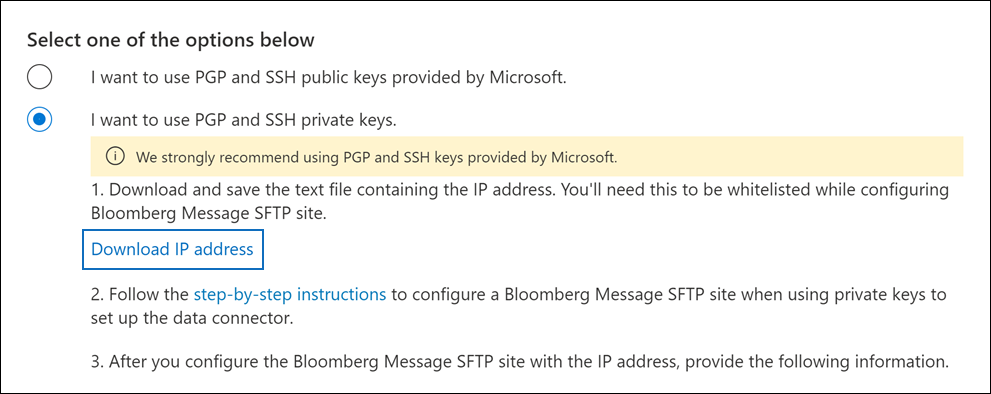

# Einrichten eines Connectors zum Archivieren von Bloomberg-NachrichtendatenSet up a connector to archive Bloomberg Message data

Verwenden Sie einen Datenconnector im Microsoft 365 Compliance Center, um E-Mail-Daten von Finanzdiensten aus dem [Bloomberg Message Collaboration](https://www.bloomberg.com/professional/product/collaboration/) Tool zu importieren und zu archivieren.Use a data connector in the Microsoft 365 compliance center to import and archive financial services email data from the [Bloomberg Message](https://www.bloomberg.com/professional/product/collaboration/) collaboration tool. Nachdem Sie einen Connector eingerichtet und konfiguriert haben, stellt er einmal täglich eine Verbindung mit der Bloomberg Secure FTP (SFTP)-Website Ihrer Organisation sicher und importiert E-Mail-Elemente in Postfächer in Microsoft 365.After you set up and configure a connector, it connects to your organization's Bloomberg secure FTP (SFTP) site once every day, and imports email items to mailboxes in Microsoft 365.

Nachdem Bloomberg-Nachrichtendaten in Benutzerpostfächern gespeichert wurden, können Sie Microsoft 365 Compliancefeatures wie z. B. Das Archivieren von Rechtsstreitigkeiten, die Inhaltssuche, die Archivierung vor Ort, die Überwachung, die Kommunikationskonformität und Microsoft 365 Aufbewahrungsrichtlinien auf Bloomberg Message-Daten anwenden.After Bloomberg Message data is stored in user mailboxes, you can apply Microsoft 365 compliance features such as Litigation hold, content search, In-place archiving, auditing, Communication compliance, and Microsoft 365 retention policies to Bloomberg Message data. Sie können beispielsweise Bloomberg-Nachrichten-E-Mails mithilfe des Inhaltssuchtools durchsuchen oder das Postfach, das die Bloomberg-Nachrichtendaten enthält, einem Verwahrer in einem Advanced eDiscovery zuordnen.For example, you can search Bloomberg Message emails using the content search tool or associate the mailbox that contains the Bloomberg Message data with a custodian in an Advanced eDiscovery case. Die Verwendung eines Bloomberg-Nachrichtenconnector zum Importieren und Archivieren von Daten in Microsoft 365 Kann Dazu beitragen, dass Ihre Organisation mit den richtlinienkonformen Richtlinien von Behörden und Behörden konform ist.Using a Bloomberg Message connector to import and archive data in Microsoft 365 can help your organization stay compliant with government and regulatory policies.

## Übersicht über die Archivierung von Bloomberg-NachrichtendatenOverview of archiving Bloomberg Message data

In der folgenden Übersicht wird der Prozess der Verwendung eines Connectors zum Archivieren von Bloomberg-Nachrichtendaten in Microsoft 365.The following overview explains the process of using a connector to archive Bloomberg Message data in Microsoft 365.

1. Ihre Organisation arbeitet mit Bloomberg zusammen, um eine Bloomberg-SFTP-Website zu einrichten.Your organization works with Bloomberg to set up a Bloomberg SFTP site. Sie arbeiten auch mit Bloomberg zusammen, um Bloomberg Message so zu konfigurieren, dass E-Mail-Nachrichten auf die Bloomberg SFTP-Website kopiert werden.You'll also work with Bloomberg to configure Bloomberg Message to copy email messages to the Bloomberg SFTP site.

2. Alle 24 Stunden werden E-Mail-Nachrichten von Bloomberg Message auf die Bloomberg SFTP-Website kopiert.Once every 24 hours, email messages from Bloomberg Message are copied to the Bloomberg SFTP site.

3. Der Bloomberg Message Connector, den Sie im Microsoft 365 Compliance Center erstellen, stellt täglich eine Verbindung mit der Bloomberg SFTP-Website sicher und überträgt die E-Mail-Nachrichten aus den vorherigen 24 Stunden an einen sicheren Azure Storage-Bereich in der Microsoft Cloud.The Bloomberg Message connector that you create in the Microsoft 365 compliance center connects to the Bloomberg SFTP site every day and transfers the email messages from the previous 24 hours to a secure Azure Storage area in the Microsoft Cloud.

4. Der Connector importiert die E-Mail-Nachrichtenelemente in das Postfach eines bestimmten Benutzers.The connector imports the email message items to the mailbox of a specific user. Im Postfach des jeweiligen Benutzers wird ein neuer Ordner namens BloombergMessage erstellt, in den die Elemente importiert werden.A new folder named BloombergMessage is created in the specific user's mailbox and the items will be imported to it.

   Der Connector verwendet dazu den Wert der CorporateEmailAddress-Eigenschaft.The connector does this by using the value of the CorporateEmailAddress property. Jede E-Mail-Nachricht enthält diese Eigenschaft, die mit der E-Mail-Adresse jedes Teilnehmers der E-Mail-Nachricht gefüllt wird.Every email message contains this property, which is populated with the email address of every participant of the email message. Neben der automatischen Benutzerzuordnung mithilfe des Werts der *CorporateEmailAddress-Eigenschaft* können Sie auch eine benutzerdefinierte Zuordnung definieren, indem Sie eine CSV-Zuordnungsdatei hochladen.In addition to automatic user mapping using the value of the *CorporateEmailAddress* property, you can also define a custom mapping by uploading a CSV mapping file. Diese Zuordnungsdatei enthält eine Bloomberg-UUID und die Microsoft 365 Postfachadresse für jeden Benutzer in Ihrer Organisation.This mapping file contains a Bloomberg UUID and the corresponding Microsoft 365 mailbox address for each user in your organization. Wenn Sie die automatische Benutzerzuordnung aktivieren und eine benutzerdefinierte Zuordnung bereitstellen, wird der Connector für jedes E-Mail-Element zunächst die datei für die benutzerdefinierte Zuordnung betrachten.If you enable automatic user mapping and provide a custom mapping, for every email item the connector will first look at the custom-mapping file. Wenn kein gültiger Benutzer Microsoft 365, der der Bloomberg-UUID eines Benutzers entspricht, verwendet der Connector die *CorporateEmailAddress-Eigenschaft* des E-Mail-Elements.If it doesn't find a valid Microsoft 365 user that corresponds to a user's Bloomberg UUID, the connector uses the *CorporateEmailAddress* property of the email item. Wenn der Connector keinen gültigen Microsoft 365 in der benutzerdefinierten Zuordnungsdatei oder der *CorporateEmailAddress-Eigenschaft* des E-Mail-Elements findet, wird das Element nicht importiert.If the connector doesn't find a valid Microsoft 365 user in either the custom-mapping file or the *CorporateEmailAddress* property of the email item, the item won't be imported.

## Vor dem Einrichten eines ConnectorsBefore you set up a connector

Einige der Implementierungsschritte, die zum Archivieren von Bloomberg-Nachrichtendaten erforderlich sind, sind außerhalb von Microsoft 365 und müssen abgeschlossen werden, bevor Sie den Connector im Compliance Center erstellen können.Some of the implementation steps required to archive Bloomberg Message data are external to Microsoft 365 and must be completed before you can create the connector in the compliance center.

- Zum Einrichten eines Bloomberg-Nachrichtenconnector müssen Sie Schlüssel und Schlüsselpassphrasen für Pretty Good Privacy (PGP) und Secure Shell (SSH) verwenden.To set up a Bloomberg Message connector, you have to use keys and key passphrases for Pretty Good Privacy (PGP) and Secure Shell (SSH). Diese Schlüssel werden verwendet, um die Bloomberg-SFTP-Website zu konfigurieren und vom Connector zum Herstellen einer Verbindung mit der Bloomberg-SFTP-Website zum Importieren von Daten in Microsoft 365.These keys are used to configure the Bloomberg SFTP site and used by the connector to connect to the Bloomberg SFTP site to import data to Microsoft 365. Der PGP-Schlüssel wird verwendet, um die Verschlüsselung von Daten zu konfigurieren, die von der Bloomberg -SFTP-Website an Microsoft 365.The PGP key is used to configure the encryption of data that's transferred from the Bloomberg SFTP site to Microsoft 365. Der SSH-Schlüssel wird verwendet, um eine sichere Shell zu konfigurieren, um eine sichere Remoteanmeldung zu ermöglichen, wenn der Connector eine Verbindung mit dem Bloomberg SFTP-Standort herstellt.The SSH key is used to configure secure shell to enable a secure remote login when the connector connects to the Bloomberg SFTP site.

  Beim Einrichten eines Connectors haben Sie die Möglichkeit, von Microsoft bereitgestellte öffentliche Schlüssel und Schlüsselpassphrasen zu verwenden, oder Sie können eigene private Schlüssel und Passphrasen verwenden.When setting up a connector, you have the option to use public keys and key passphrases provided by Microsoft or you can use your own private keys and passphrases. Es wird empfohlen, die von Microsoft bereitgestellten öffentlichen Schlüssel zu verwenden.We recommend that you use the public keys provided by Microsoft. Wenn Ihre Organisation jedoch bereits eine Bloomberg -SFTP-Website mit privaten Schlüsseln konfiguriert hat, können Sie einen Connector mit diesen privaten Schlüsseln erstellen.However, if your organization has already configured a Bloomberg SFTP site using private keys, then you can create a connector using these same private keys.

- Abonnieren Sie [Bloomberg Anywhere](https://www.bloomberg.com/professional/product/remote-access/?bbgsum-page=DG-WS-PROF-PROD-BBA).Subscribe to [Bloomberg Anywhere](https://www.bloomberg.com/professional/product/remote-access/?bbgsum-page=DG-WS-PROF-PROD-BBA). Dies ist erforderlich, damit Sie sich bei Bloomberg Anywhere anmelden können, um auf die Bloomberg SFTP-Website zu zugreifen, die Sie einrichten und konfigurieren müssen.This is required so that you can log in to Bloomberg Anywhere to access the Bloomberg SFTP site that you have to set up and configure.

- Richten Sie eine Bloomberg SFTP (Secure File Transfer Protocol)-Website ein.Set up a Bloomberg SFTP (Secure file transfer protocol) site. Nach der Zusammenarbeit mit Bloomberg zum Einrichten der SFTP-Website werden täglich Daten aus Bloomberg Message auf die SFTP-Website hochgeladen.After working with Bloomberg to set up the SFTP site, data from Bloomberg Message is uploaded to the SFTP site every day. Der connector, den Sie in Schritt 2 erstellen, stellt eine Verbindung mit dieser SFTP-Website und überträgt die E-Mail-Daten an Microsoft 365 Postfächer.The connector you create in Step 2 connects to this SFTP site and transfers the email data to Microsoft 365 mailboxes. SFTP verschlüsselt auch die Bloomberg-Nachrichtendaten, die während des Übertragungsprozesses an Postfächer gesendet werden.SFTP also encrypts the Bloomberg Message data that is sent to mailboxes during the transfer process.

  Weitere Informationen zu Bloomberg SFTP (auch *BB-SFTP genannt):*For information about Bloomberg SFTP (also called *BB-SFTP*):

  - Weitere Informationen finden Sie im Dokument "SFTP Connectivity Standards" unter [Bloomberg Support](https://www.bloomberg.com/professional/support/documentation/).See the "SFTP Connectivity Standards" document at [Bloomberg Support](https://www.bloomberg.com/professional/support/documentation/).

  - Wenden [Sie sich an den Bloomberg-Kundensupport](https://service.bloomberg.com/portal/sessions/new?utm_source=bloomberg-menu&utm_medium=csc).Contact [Bloomberg customer support](https://service.bloomberg.com/portal/sessions/new?utm_source=bloomberg-menu&utm_medium=csc).

- Nachdem Sie mit Bloomberg eine SFTP-Website eingerichtet haben, stellt Bloomberg Ihnen einige Informationen zur Verfügung, nachdem Sie auf die Bloomberg-Implementierungs-E-Mail-Nachricht antworten.After you work with Bloomberg to set up an SFTP site, Bloomberg will provide some information to you after you respond to the Bloomberg implementation email message. Speichern Sie eine Kopie der folgenden Informationen.Save a copy of the following information. Verwenden Sie ihn zum Einrichten eines Connectors in Schritt 3.You use it to set up a connector in Step 3.

  - Firmencode, der eine ID für Ihre Organisation ist und zur Anmeldung bei der Bloomberg SFTP-Website verwendet wird.Firm code, which is an ID for your organization and is used to log in to the Bloomberg SFTP site.

  - Kennwort für Ihre Bloomberg SFTP-WebsitePassword for your Bloomberg SFTP site

  - URL für Bloomberg SFTP-Website (z. B. sftp.bloomberg.com).URL for Bloomberg SFTP site (for example, sftp.bloomberg.com). Darüber hinaus kann Bloomberg auch eine entsprechende IP-Adresse für den Bloomberg SFTP-Standort bereitstellen, die auch zum Einrichten des Connectors verwendet werden kann.In addition, Bloomberg may also provide a corresponding IP address for the Bloomberg SFTP site, which also can be used to set up the connector.

  - Portnummer für Bloomberg SFTP-WebsitePort number for Bloomberg SFTP site

- Der Bloomberg-Nachrichtenconnector kann insgesamt 200.000 Elemente an einem einzigen Tag importieren.The Bloomberg Message connector can import a total of 200,000 items in a single day. Wenn mehr als 200.000 Elemente auf der SFTP-Website vorhanden sind, wird keines dieser Elemente in Microsoft 365.If there are more than 200,000 items on the SFTP site, none of those items will be imported to Microsoft 365.

- Dem Benutzer, der in Schritt 3 einen Bloomberg-Nachrichtenconnector erstellt (und der die öffentlichen Schlüssel und die IP-Adresse in Schritt 1 herunterlädt), muss die Rolle Postfachimportexport in Exchange Online.The user who creates a Bloomberg Message connector in Step 3 (and who downloads the public keys and IP address in Step 1) must be assigned the Mailbox Import Export role in Exchange Online. Dies ist erforderlich, um Connectors auf der Seite **Datenconnectors** im compliance center Microsoft 365 hinzufügen.This is required to add connectors in the **Data connectors** page in the Microsoft 365 compliance center. Standardmäßig ist diese Rolle keiner Rollengruppe in Exchange Online zugewiesen.By default, this role isn't assigned to any role group in Exchange Online. Sie können die Rolle Postfachimportexport zur Rollengruppe Organisationsverwaltung in der Exchange Online.You can add the Mailbox Import Export role to the Organization Management role group in Exchange Online. Sie können auch eine Rollengruppe erstellen, die Rolle Postfachimportexport zuweisen und dann die entsprechenden Benutzer als Mitglieder hinzufügen.Or you can create a role group, assign the Mailbox Import Export role, and then add the appropriate users as members. Weitere Informationen finden Sie in den Abschnitten [Erstellen](/Exchange/permissions-exo/role-groups#create-role-groups) von Rollengruppen oder [Ändern](/Exchange/permissions-exo/role-groups#modify-role-groups) von Rollengruppen im Artikel "Verwalten von Rollengruppen in Exchange Online".For more information, see the [Create role groups](/Exchange/permissions-exo/role-groups#create-role-groups) or [Modify role groups](/Exchange/permissions-exo/role-groups#modify-role-groups) sections in the article "Manage role groups in Exchange Online".

## Einrichten eines Connectors mithilfe öffentlicher SchlüsselSet up a connector using public keys

Die Schritte in diesem Abschnitt zeigen, wie Sie einen Bloomberg Message-Connector mithilfe der öffentlichen Schlüssel für Pretty Good Privacy (PGP) und Secure Shell (SSH) einrichten.The steps in this section show you how to set up a Bloomberg Message connector using the public keys for Pretty Good Privacy (PGP) and Secure Shell (SSH).

### Schritt 1: Abrufen öffentlicher PGP- und SSH-SchlüsselStep 1: Obtain PGP and SSH public keys

Der erste Schritt besteht im Abrufen einer Kopie der öffentlichen PGP- und SSH-Schlüssel.The first step is to obtain a copy of the PGP and SSH public keys. Sie verwenden diese Schlüssel in Schritt 2, um die Bloomberg-SFTP-Website so zu konfigurieren, dass der Connector (den Sie in Schritt 3 erstellen) eine Verbindung mit der SFTP-Website herstellen und die Bloomberg Message-E-Mail-Daten an Microsoft 365 übertragen.You use these keys in Step 2 to configure the Bloomberg SFTP site to allow the connector (that you create in Step 3) to connect to the SFTP site and transfer the Bloomberg Message email data to Microsoft 365 mailboxes. In diesem Schritt erhalten Sie auch eine IP-Adresse, die Sie beim Konfigurieren der Bloomberg SFTP-Website verwenden.You also obtain an IP address in this step, which you use when configuring the Bloomberg SFTP site.

1. Wechseln Sie <https://compliance.microsoft.com> zu, und klicken Sie **im** linken Navigations navi auf Datenconnectors.Go to <https://compliance.microsoft.com> and click **Data connectors** in the left nav.

2. Klicken Sie **auf der Seite** Datenconnectors unter **Bloomberg-Nachricht** auf **Anzeigen**.On the **Data connectors** page under **Bloomberg Message**, click **View**.

3. Klicken Sie auf der Seite Produktbeschreibung für **Bloomberg-Nachricht** auf **Connector hinzufügen.**On the **Bloomberg Message** product description page, click **Add connector**

4. Klicken Sie **auf der Seite Nutzungsbedingungen** auf **Akzeptieren**.On the **Terms of service** page, click **Accept**.

5. Klicken Sie **auf der Seite Anmeldeinformationen** für Inhaltsquelle hinzufügen auf Ich möchte öffentliche PGP- und SSH-Schlüssel von **Microsoft verwenden.**On the **Add credentials for content source** page, click **I want to use PGP and SSH public keys provided by Microsoft**.

   

6. Klicken Sie unter Schritt 1 auf die Schaltfläche **SSH** herunterladen, **PGP-Schlüssel** herunterladen und IP-Adresslinks herunterladen, um eine Kopie jeder Datei auf Ihrem lokalen Computer zu speichern. Under step 1, click the **Download SSH key**, **Download PGP key**, and **Download IP address** links to save a copy of each file to your local computer.

   

   Diese Dateien enthalten die folgenden Elemente, die zum Konfigurieren der Bloomberg -SFTP-Website in Schritt 2 verwendet werden:These files contain the following items that are used to configure the Bloomberg SFTP site in Step 2:

   - Öffentlicher PGP-Schlüssel: Dieser Schlüssel wird verwendet, um die Verschlüsselung von Daten zu konfigurieren, die von der Bloomberg -SFTP-Website an die Microsoft 365.PGP public key: This key is used to configure the encryption of data that's transferred from the Bloomberg SFTP site to Microsoft 365.

   - Öffentlicher SSH-Schlüssel: Dieser Schlüssel wird verwendet, um eine sichere Shell zu konfigurieren, um eine sichere Remoteanmeldung zu ermöglichen, wenn der Connector eine Verbindung mit dem Bloomberg SFTP-Standort herstellt.SSH public key: This key is used to configure secure shell to enable a secure remote login when the connector connects to the Bloomberg SFTP site.

   - IP-Adresse: Die Bloomberg-SFTP-Website ist so konfiguriert, dass Verbindungsanforderungen von dieser IP-Adresse akzeptiert werden.IP address: The Bloomberg SFTP site is configured to accept connection requests from this IP address. Dieselbe IP-Adresse wird vom Bloomberg Message Connector verwendet, um eine Verbindung mit der SFTP-Website herzustellen und Bloomberg Message-Daten an Microsoft 365.The same IP address is used by the Bloomberg Message connector to connect to the SFTP site and transfer Bloomberg Message data to Microsoft 365.

7. Klicken **Sie auf Abbrechen,** um den Assistenten zu schließen.Click **Cancel** to close the wizard. Sie kommen in Schritt 3 zu diesem Assistenten zurück, um den Connector zu erstellen.You come back to this wizard in Step 3 to create the connector.

### Schritt 2: Konfigurieren der Bloomberg SFTP-WebsiteStep 2: Configure the Bloomberg SFTP site

> [!NOTE]
> Wenn Ihre Organisation zuvor eine Bloomberg-SFTP-Website eingerichtet hat, um Instant Bloomberg-Daten mithilfe öffentlicher PGP- und SSH-Schlüssel zu archivieren, müssen Sie keine weitere einrichten.If your organization has previously set up a Bloomberg SFTP site to archive Instant Bloomberg data using public PGP and SSH keys, you don't have to set up another one. Sie können dieselbe SFTP-Website angeben, wenn Sie den Connector in Schritt 3 erstellen.You can specify the same SFTP site when you create the connector in Step 3.

Im nächsten Schritt verwenden Sie die öffentlichen PGP- und SSH-Schlüssel sowie die in Schritt 1 erhaltene IP-Adresse, um die PGP-Verschlüsselung und die SSH-Authentifizierung für den Bloomberg SFTP-Standort zu konfigurieren.The next step is to use the PGP and SSH public keys and the IP address that you obtained in Step 1 to configure PGP encryption and SSH authentication for the Bloomberg SFTP site. Auf diese Weise kann der in Schritt 3 erstellte Bloomberg-Nachrichtenconnector eine Verbindung mit der Bloomberg -SFTP-Website herstellen und Bloomberg Message-Daten an Microsoft 365.This lets the Bloomberg Message connector that you create in Step 3 connect to the Bloomberg SFTP site and transfer Bloomberg Message data to Microsoft 365. Sie müssen mit dem Bloomberg-Kundensupport zusammenarbeiten, um Ihre Bloomberg SFTP-Website einrichten zu können.You need to work with Bloomberg customer support to set up your Bloomberg SFTP site. Wenden [Sie sich an den Bloomberg-Kundensupport,](https://service.bloomberg.com/portal/sessions/new?utm_source=bloomberg-menu&utm_medium=csc) um Unterstützung zu erhalten.Contact [Bloomberg customer support](https://service.bloomberg.com/portal/sessions/new?utm_source=bloomberg-menu&utm_medium=csc) for assistance.

> [!IMPORTANT]
> Bloomberg empfiehlt, die drei Dateien, die Sie in Schritt 1 heruntergeladen haben, an eine E-Mail-Nachricht anfügen und diese an das Kundensupportteam zu senden, wenn Sie mit ihnen zusammenarbeiten, um Ihre Bloomberg -SFTP-Website einrichten.Bloomberg recommends that you attach the three files that you downloaded in Step 1 to an email message and send it to their customer support team when working with them to set up your Bloomberg SFTP site.

### Schritt 3: Erstellen eines Bloomberg-NachrichtenconnectorStep 3: Create a Bloomberg Message connector

Der letzte Schritt besteht im Erstellen eines Bloomberg-Nachrichtenconnector im Microsoft 365 Compliance Center.The last step is to create a Bloomberg Message connector in the Microsoft 365 compliance center. Der Connector verwendet die informationen, die Sie bereitstellen, um eine Verbindung mit der Bloomberg -SFTP-Website herzustellen und E-Mail-Nachrichten an die entsprechenden Benutzerpostfächer in Microsoft 365.The connector uses the information you provide to connect to the Bloomberg SFTP site and transfer email messages to the corresponding user mailbox boxes in Microsoft 365.

1. Wechseln Sie <https://compliance.microsoft.com> zu, und klicken Sie **im** linken Navigations navi auf Datenconnectors.Go to <https://compliance.microsoft.com> and click **Data connectors** in the left nav.

2. Klicken Sie **auf der Seite** Datenconnectors unter **Bloomberg-Nachricht** auf **Anzeigen**.On the **Data connectors** page under **Bloomberg Message**, click **View**.

3. Klicken Sie auf der Seite Produktbeschreibung für **Bloomberg-Nachricht** auf **Connector hinzufügen.**On the **Bloomberg Message** product description page, click **Add connector**

4. Klicken Sie **auf der Seite Nutzungsbedingungen** auf **Akzeptieren**.On the **Terms of service** page, click **Accept**.

5. Klicken Sie **auf der Seite Anmeldeinformationen** für Inhaltsquelle hinzufügen auf Ich möchte öffentliche PGP- und SSH-Schlüssel von **Microsoft verwenden.**On the **Add credentials for content source** page, click **I want to use PGP and SSH public keys provided by Microsoft**.

6. Geben Sie unter Schritt 3 die erforderlichen Informationen in die folgenden Felder ein, und klicken Sie dann **auf Verbindung überprüfen.**Under Step 3, enter the required information in the following boxes and then click **Validate connection**.

      - **Name:** Der Name für den Connector.**Name:** The name for the connector. Sie muss in Ihrer Organisation eindeutig sein.It must be unique in your organization.

      - **Firmencode:** Die ID für Ihre Organisation, die als Benutzername für die Bloomberg SFTP-Website verwendet wird.**Firm code:** The ID for your organization that is used as the username for the Bloomberg SFTP site.

      - **Kennwort:** Das Kennwort für die Bloomberg-SFTP-Website Ihrer Organisation.**Password:** The password for your organization's Bloomberg SFTP site.

      - **SFTP-URL:** Die URL für die Bloomberg-SFTP-Website (z. B. `sftp.bloomberg.com` ).**SFTP URL:** The URL for the Bloomberg SFTP site (for example, `sftp.bloomberg.com`). Sie können auch eine IP-Adresse für diesen Wert verwenden.You can also use an IP address for this value.

      - **SFTP-Port:** Die Portnummer für den Bloomberg SFTP-Standort.**SFTP port:** The port number for the Bloomberg SFTP site. Der Connector verwendet diesen Port, um eine Verbindung mit dem SFTP-Standort herzustellen.The connector uses this port to connect to the SFTP site.

7. Nachdem die Verbindung erfolgreich überprüft wurde, klicken Sie auf **Weiter**.After the connection is successfully validated, click **Next**.

8. Aktivieren Sie auf der Seite Benutzer zu benutzern **Microsoft 365 Bloomberg-Nachricht** zuordnen die automatische Benutzerzuordnung und stellen Sie bei Bedarf eine benutzerdefinierte Benutzerzuordnung zur Verfügung.On the **Map Bloomberg Message users to Microsoft 365 users** page, enable automatic user mapping and provide custom user mapping as required.

   > [!NOTE]
   > Der Connector importiert Nachrichtenelemente in das Postfach eines bestimmten Benutzers.The connector imports message items to the mailbox of a specific user. Im Postfach des jeweiligen Benutzers wird ein neuer Ordner namens **BloombergMessage** erstellt, in den die Elemente importiert werden.A new folder named **BloombergMessage** is created in the specific user's mailbox and the items will be imported to it. Der Connector verwendet den Wert der *CorporateEmailAddress-Eigenschaft.*The connector does by using the value of the *CorporateEmailAddress* property. Jede Chatnachricht enthält diese Eigenschaft, und die Eigenschaft wird mit der E-Mail-Adresse jedes Teilnehmers der Chatnachricht gefüllt.Every chat message contains this property, and the property is populated with the email address of every participant of the chat message. Neben der automatischen Benutzerzuordnung mithilfe des Werts der *CorporateEmailAddress-Eigenschaft* können Sie auch benutzerdefinierte Zuordnungen definieren, indem Sie eine CSV-Zuordnungsdatei hochladen.In addition to automatic user mapping using the value of the *CorporateEmailAddress* property, you can also define custom mapping by uploading a CSV mapping file. Die Zuordnungsdatei sollte die Bloomberg-UUID und die Microsoft 365 postfachadresse für jeden Benutzer enthalten.The mapping file should contain the Bloomberg UUID and corresponding Microsoft 365 mailbox address for each user. Wenn Sie die automatische Benutzerzuordnung aktivieren und eine benutzerdefinierte Zuordnung bereitstellen, wird für jedes Nachrichtenelement zunächst die benutzerdefinierte Zuordnungsdatei vom Connector angezeigt.If you enable automatic user mapping and provide a custom mapping, for every message item the connector will first look at custom mapping file. Wenn kein gültiger Benutzer Microsoft 365, der der Bloomberg-UUID eines Benutzers entspricht, verwendet der Connector die *CorporateEmailAddress-Eigenschaft* des Chatelements.If it doesn't find a valid Microsoft 365 user that corresponds to a user's Bloomberg UUID, the connector will use the *CorporateEmailAddress* property of the chat item. Wenn der Connector keinen gültigen Microsoft 365 in der benutzerdefinierten Zuordnungsdatei oder der *CorporateEmailAddress-Eigenschaft* des Nachrichtenelements findet, wird das Element nicht importiert.If the connector doesn't find a valid Microsoft 365 user in either the custom mapping file or the *CorporateEmailAddress* property of the message item, the item won't be imported.

9. Klicken **Sie auf Weiter,** überprüfen Sie Ihre Einstellungen, und klicken Sie dann auf **Fertig stellen,** um den Connector zu erstellen.Click **Next**, review your settings, and then click **Finish** to create the connector.

10. Wechseln Sie zur **Seite Datenconnectors,** um den Fortschritt des Importvorgangs für den neuen Connector zu sehen.Go to the **Data connectors** page to see the progress of the import process for the new connector. Klicken Sie auf den Connector, um die Flyoutseite mit Informationen zum Connector angezeigt zu werden.Click the connector to display the flyout page, which contains information about the connector.

## Einrichten eines Connectors mithilfe privater SchlüsselSet up a connector using private keys

Die Schritte in diesem Abschnitt zeigen, wie Sie einen Bloomberg-Nachrichtenconnector mit privaten PGP- und SSH-Schlüsseln einrichten.The steps in this section show you how to set up a Bloomberg Message connector using PGP and SSH private keys. Diese Connectoreinrichtungsoption ist für Organisationen vorgesehen, die bereits eine Bloomberg-SFTP-Website mithilfe privater Schlüssel konfiguriert haben.This connector setup option is intended for organizations that have already configured a Bloomberg SFTP site using private keys.

### Schritt 1: Abrufen einer IP-Adresse zum Konfigurieren der Bloomberg-SFTP-WebsiteStep 1: Obtain an IP address to configure the Bloomberg SFTP site

> [!NOTE]
> Wenn Ihre Organisation zuvor eine Bloomberg-SFTP-Website zum Archivieren von Instant Bloomberg-Daten mit privaten PGP- und SSH-Schlüsseln konfiguriert hat, müssen Sie keine andere konfigurieren.If your organization has previously configured a Bloomberg SFTP site to archive Instant Bloomberg data using PGP and SSH private keys, you don't have to configure another one. Sie können dieselbe SFTP-Website angeben, wenn Sie den Connector in Schritt 2 erstellen.You can specify the same SFTP site when you create the connector in Step 2.

Wenn Ihre Organisation private PGP- und SSH-Schlüssel zum Einrichten einer Bloomberg -SFTP-Website verwendet hat, müssen Sie eine IP-Adresse abrufen und sie dem Bloomberg-Kundensupport bereitstellen.If your organization has used PGP and SSH private keys to set up a Bloomberg SFTP site, then you have to obtain an IP address and provide it to Bloomberg customer support. Die Bloomberg -SFTP-Website muss so konfiguriert sein, dass Verbindungsanforderungen von dieser IP-Adresse akzeptiert werden.The Bloomberg SFTP site must be configured to accept  connection requests from this IP address. Dieselbe IP-Adresse wird vom Bloomberg Message Connector verwendet, um eine Verbindung mit der SFTP-Website herzustellen und Bloomberg Message-Daten an Microsoft 365.The same IP address is used by the Bloomberg Message connector to connect to the SFTP site and transfer Bloomberg Message data to Microsoft 365.

So rufen Sie die IP-Adresse ab:To obtain the IP address:

1. Wechseln Sie <https://compliance.microsoft.com> zu, und klicken Sie **im** linken Navigations navi auf Datenconnectors.Go to <https://compliance.microsoft.com> and click **Data connectors** in the left nav.

2. Klicken Sie **auf der Seite** Datenconnectors unter **Bloomberg-Nachricht** auf **Anzeigen**.On the **Data connectors** page under **Bloomberg Message**, click **View**.

3. Klicken Sie auf der Seite Produktbeschreibung für **Bloomberg-Nachricht** auf **Connector hinzufügen.**On the **Bloomberg Message** product description page, click **Add connector**

4. Klicken Sie **auf der Seite Nutzungsbedingungen** auf **Akzeptieren**.On the **Terms of service** page, click **Accept**.

5. Klicken Sie **auf der Seite Anmeldeinformationen** für Inhaltsquelle hinzufügen auf Ich möchte private PGP- und **SSH-Schlüssel verwenden.**On the **Add credentials for content source** page, click **I want to use PGP and SSH private keys**.

6. Klicken Sie unter Schritt 1 auf **IP-Adresse herunterladen,** um eine Kopie der IP-Adressdatei auf Ihrem lokalen Computer zu speichern.Under step 1, click **Download IP address** to save a copy of the IP address file to your local computer.

   

7. Klicken **Sie auf Abbrechen,** um den Assistenten zu schließen.Click **Cancel** to close the wizard. Sie kommen in Schritt 2 zu diesem Assistenten zurück, um den Connector zu erstellen.You come back to this wizard in Step 2 to create the connector.

Sie müssen mit dem Bloomberg-Kundensupport zusammenarbeiten, um Ihre Bloomberg -SFTP-Website so zu konfigurieren, dass Verbindungsanforderungen von dieser IP-Adresse akzeptiert werden.You need to work with Bloomberg customer support to configure your Bloomberg SFTP site to accept connection requests from this IP address. Wenden [Sie sich an den Bloomberg-Kundensupport,](https://service.bloomberg.com/portal/sessions/new?utm_source=bloomberg-menu&utm_medium=csc) um Unterstützung zu erhalten.Contact [Bloomberg customer support](https://service.bloomberg.com/portal/sessions/new?utm_source=bloomberg-menu&utm_medium=csc) for assistance.

### Schritt 2: Erstellen eines Bloomberg-NachrichtenconnectorStep 2: Create a Bloomberg Message connector

Nachdem Ihre Bloomberg -SFTP-Website konfiguriert wurde, besteht der nächste Schritt in der Erstellung eines Bloomberg Message-Connectors im Microsoft 365 Compliance Center.After your Bloomberg SFTP site is configured, the next step is to create a Bloomberg Message connector in the Microsoft 365 compliance center. Der Connector verwendet die informationen, die Sie bereitstellen, um eine Verbindung mit der Bloomberg -SFTP-Website herzustellen und E-Mail-Nachrichten an die entsprechenden Benutzerpostfächer in Microsoft 365.The connector uses the information you provide to connect to the Bloomberg SFTP site and transfer email messages to the corresponding user mailbox boxes in Microsoft 365. Stellen Sie zum Abschließen dieses Schritts sicher, dass Kopien derselben privaten Schlüssel und Schlüsselpassphrasen vorhanden sind, die Sie zum Einrichten Ihrer Bloomberg-SFTP-Website verwendet haben.To complete this step, be sure to have copies of the same private keys and key passphrases that you used to set up your Bloomberg SFTP site.

1. Wechseln Sie <https://compliance.microsoft.com> zu, und klicken Sie **im** linken Navigations navi auf Datenconnectors.Go to <https://compliance.microsoft.com> and click **Data connectors** in the left nav.

2. Klicken Sie **auf der Seite** Datenconnectors unter **Bloomberg-Nachricht** auf **Anzeigen**.On the **Data connectors** page under **Bloomberg Message**, click **View**.

3. Klicken Sie auf der Seite Produktbeschreibung für **Bloomberg-Nachricht** auf **Connector hinzufügen.**On the **Bloomberg Message** product description page, click **Add connector**

4. Klicken Sie **auf der Seite Nutzungsbedingungen** auf **Akzeptieren**.On the **Terms of service** page, click **Accept**.

5. Klicken Sie **auf der Seite Anmeldeinformationen** für Inhaltsquelle hinzufügen auf Ich möchte private PGP- und **SSH-Schlüssel verwenden.**On the **Add credentials for content source** page, click **I want to use PGP and SSH private keys**.

   

6. Geben Sie unter Schritt 3 die erforderlichen Informationen in die folgenden Felder ein, und klicken Sie dann **auf Verbindung überprüfen.**Under Step 3, enter the required information in the following boxes and then click **Validate connection**.

      - **Name:** Der Name für den Connector.**Name:** The name for the connector. Sie muss in Ihrer Organisation eindeutig sein.It must be unique in your organization.

      - **Firmencode:** Die ID für Ihre Organisation, die als Benutzername für die Bloomberg SFTP-Website verwendet wird.**Firm code:** The ID for your organization that is used as the username for the Bloomberg SFTP site.

      - **Kennwort:** Das Kennwort für die Bloomberg-SFTP-Website Ihrer Organisation.**Password:** The password for your organization's Bloomberg SFTP site.

      - **SFTP-URL:** Die URL für die Bloomberg-SFTP-Website (z. B. `sftp.bloomberg.com` ).**SFTP URL:** The URL for the Bloomberg SFTP site (for example, `sftp.bloomberg.com`). Sie können auch eine IP-Adresse für diesen Wert verwenden.You can also use an IP address for this value.

      - **SFTP-Port:** Die Portnummer für den Bloomberg SFTP-Standort.**SFTP port:** The port number for the Bloomberg SFTP site. Der Connector verwendet diesen Port, um eine Verbindung mit dem SFTP-Standort herzustellen.The connector uses this port to connect to the SFTP site.

      - **Privater PGP-Schlüssel:** Der private PGP-Schlüssel für die Bloomberg-SFTP-Website.**PGP private key:** The PGP private key for the Bloomberg SFTP site. Achten Sie darauf, den gesamten privaten Schlüsselwert, einschließlich der Anfangs- und Endzeilen des Schlüsselblocks, zu enthalten.Be sure to include the entire private key value, including the beginning and ending lines of the key block.

      - **PGP-Schlüsselpassphrase:** Die Passphrase für den privaten PGP-Schlüssel.**PGP key passphrase:** The passphrase for the PGP private key.

      - **Privater SSH-Schlüssel:** Der private SSH-Schlüssel für die Bloomberg-SFTP-Website.**SSH private key:** The SSH private key for the Bloomberg SFTP site. Achten Sie darauf, den gesamten privaten Schlüsselwert, einschließlich der Anfangs- und Endzeilen des Schlüsselblocks, zu enthalten.Be sure to include the entire private key value, including the beginning and ending lines of the key block.

      - **SSH-Schlüsselpassphrase:** Die Passphrase für den privaten SSH-Schlüssel.**SSH key passphrase:** The passphrase for the SSH private key.

7. Nachdem die Verbindung erfolgreich überprüft wurde, klicken Sie auf **Weiter**.After the connection is successfully validated, click **Next**.

8. Aktivieren Sie auf der Seite Benutzer zu benutzern **Microsoft 365 Bloomberg-Nachricht** zuordnen die automatische Benutzerzuordnung und stellen Sie bei Bedarf eine benutzerdefinierte Benutzerzuordnung zur Verfügung.On the **Map Bloomberg Message users to Microsoft 365 users** page, enable automatic user mapping and provide custom user mapping as required.

   > [!NOTE]
   > Der Connector importiert Nachrichtenelemente in das Postfach eines bestimmten Benutzers.The connector imports message items to the mailbox of a specific user. Im Postfach des jeweiligen Benutzers wird ein neuer Ordner namens **BloombergMessage** erstellt, in den die Elemente importiert werden.A new folder named **BloombergMessage** is created in the specific user's mailbox and the items will be imported to it. Der Connector verwendet den Wert der *CorporateEmailAddress-Eigenschaft.*The connector does by using the value of the *CorporateEmailAddress* property. Jede Chatnachricht enthält diese Eigenschaft, und die Eigenschaft wird mit der E-Mail-Adresse jedes Teilnehmers der Chatnachricht gefüllt.Every chat message contains this property, and the property is populated with the email address of every participant of the chat message. Neben der automatischen Benutzerzuordnung mithilfe des Werts der *CorporateEmailAddress-Eigenschaft* können Sie auch benutzerdefinierte Zuordnungen definieren, indem Sie eine CSV-Zuordnungsdatei hochladen.In addition to automatic user mapping using the value of the *CorporateEmailAddress* property, you can also define custom mapping by uploading a CSV mapping file. Die Zuordnungsdatei sollte die Bloomberg-UUID und die Microsoft 365 postfachadresse für jeden Benutzer enthalten.The mapping file should contain the Bloomberg UUID and corresponding Microsoft 365 mailbox address for each user. Wenn Sie die automatische Benutzerzuordnung aktivieren und eine benutzerdefinierte Zuordnung bereitstellen, wird für jedes Nachrichtenelement zunächst die benutzerdefinierte Zuordnungsdatei vom Connector angezeigt.If you enable automatic user mapping and provide a custom mapping, for every message item the connector will first look at custom mapping file. Wenn kein gültiger Benutzer Microsoft 365, der der Bloomberg-UUID eines Benutzers entspricht, verwendet der Connector die *CorporateEmailAddress-Eigenschaft* des Chatelements.If it doesn't find a valid Microsoft 365 user that corresponds to a user's Bloomberg UUID, the connector will use the *CorporateEmailAddress* property of the chat item. Wenn der Connector keinen gültigen Microsoft 365 in der benutzerdefinierten Zuordnungsdatei oder der *CorporateEmailAddress-Eigenschaft* des Nachrichtenelements findet, wird das Element nicht importiert.If the connector doesn't find a valid Microsoft 365 user in either the custom mapping file or the *CorporateEmailAddress* property of the message item, the item won't be imported.

9. Klicken **Sie auf Weiter,** überprüfen Sie Ihre Einstellungen, und klicken Sie dann auf **Fertig stellen,** um den Connector zu erstellen.Click **Next**, review your settings, and then click **Finish** to create the connector.

10. Wechseln Sie zur **Seite Datenconnectors,** um den Fortschritt des Importvorgangs für den neuen Connector zu sehen.Go to the **Data connectors** page to see the progress of the import process for the new connector. Klicken Sie auf den Connector, um die Flyoutseite mit Informationen zum Connector angezeigt zu werden.Click the connector to display the flyout page, which contains information about the connector.

## Bekannte ProblemeKnown issues

- Threading von bloomberg Message email imported to Microsoft 365 isn't supported.Threading of Bloomberg Message email imported to Microsoft 365 isn't supported. Einzelne Nachrichten, die an eine Person gesendet werden, werden importiert, werden jedoch nicht in einer Thread-Unterhaltung angezeigt.Individual messages sent to a person are imported, but they aren't presented in a threaded conversation. Microsoft arbeitet daran, Threading in späteren Versionen des Bloomberg Message Data Connectors zu unterstützen.Microsoft is working to support threading in later versions of the Bloomberg Message data connector.
