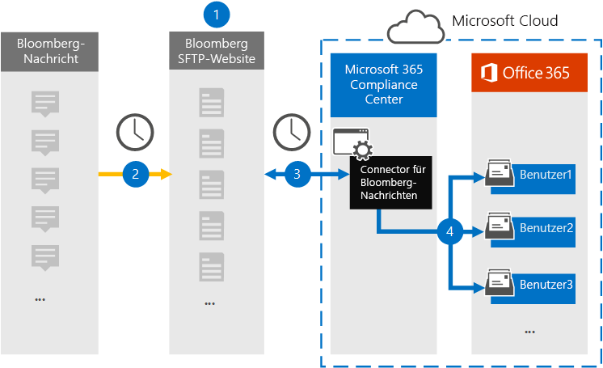

# Einrichten eines Connectors zum Archivieren von Bloomberg-Nachrichtendaten (Vorschau)

Verwenden Sie einen Daten Konnektor im Microsoft 365 Compliance Center zum Importieren und Archivieren von Finanz Dienstleistungs-e-Mail-Daten aus dem [Bloomberg-Nachrichten](https://www.bloomberg.com/professional/product/collaboration/) Zusammenarbeits Tool. Nachdem Sie einen Connector eingerichtet und konfiguriert haben, stellt er eine Verbindung mit der Bloomberg Secure FTP (SFTP)-Website Ihrer Organisation täglich her und importiert e-Mail-Elemente in Postfächer in Microsoft 365.

Nachdem Bloomberg-Nachrichtendaten in Benutzerpostfächern gespeichert wurden, können Sie Microsoft 365-Compliance-Features wie Beweissicherungsverfahren, Inhaltssuche, in-situ-Archivierung, Überwachung, Kommunikations Konformität und Microsoft 365-Aufbewahrungsrichtlinien auf Bloomberg-Nachrichtendaten anwenden. Beispielsweise können Sie Bloomberg-Nachrichten e-Mails mithilfe des Inhalts Such Tools durchsuchen oder das Postfach, das die Bloomberg-Nachrichtendaten enthält, einer Depotbank in einem erweiterten eDiscovery-Fall zuordnen. Die Verwendung eines Bloomberg-Nachrichten Connectors zum Importieren und Archivieren von Daten in Microsoft 365 kann dazu beitragen, dass Ihre Organisation mit behördlichen und behördlichen Richtlinien konform bleibt.

## Übersicht über das Archivieren von Bloomberg-Nachrichtendaten

In der folgenden Übersicht wird erläutert, wie Sie einen Connector zum Archivieren von Bloomberg-Nachrichtendaten in Microsoft 365 verwenden.

1. Ihre Organisation arbeitet mit Bloomberg zusammen, um eine Bloomberg SFTP-Website einzurichten. Sie werden auch mit Bloomberg zusammenarbeiten, um Bloomberg Message so zu konfigurieren, dass e-Mail-Nachrichten auf die Bloomberg SFTP-Website kopiert werden.

2. Einmal alle 24 Stunden werden e-Mail-Nachrichten von Bloomberg-Nachricht auf die Bloomberg SFTP-Website kopiert.

3. Der Bloomberg Message Connector, den Sie im Microsoft 365 Compliance Center erstellen, stellt jeden Tag eine Verbindung mit der Bloomberg SFTP-Website her und überträgt die e-Mail-Nachrichten aus den vorherigen 24 Stunden an einen sicheren Azure-Speicherbereich in der Microsoft-Cloud.

4. Der Connector importiert die e-Mail-Nachrichtenelemente in das Postfach eines bestimmten Benutzers. Ein neuer Ordner mit dem Namen BloombergMessage wird im Postfach des jeweiligen Benutzers erstellt, und die Elemente werden darin importiert. 

   Der Connector führt dies mithilfe des Werts der CorporateEmailAddress-Eigenschaft aus. Jede e-Mail-Nachricht enthält diese Eigenschaft, die mit der e-Mail-Adresse jedes Teilnehmers der e-Mail-Nachricht aufgefüllt wird. Zusätzlich zur automatischen Benutzerzuordnung mit dem Wert der *CorporateEmailAddress* -Eigenschaft können Sie auch eine benutzerdefinierte Zuordnung definieren, indem Sie eine CSV-Zuordnungsdatei hochladen. Diese Zuordnungsdatei enthält eine Bloomberg-UUID und die entsprechende Microsoft 365-Postfachadresse für jeden Benutzer in Ihrer Organisation. Wenn Sie die automatische Benutzerzuordnung aktivieren und eine benutzerdefinierte Zuordnung bereitstellen, wird der Connector für jedes e-Mail-Element zuerst die benutzerdefinierte Zuordnungsdatei betrachten. Wenn kein gültiger Microsoft 365-Benutzer gefunden wird, der der Bloomberg-UUID eines Benutzers entspricht, verwendet der Connector die *CorporateEmailAddress* -Eigenschaft des e-Mail-Elements. Wenn der Connector weder in der benutzerdefinierten Zuordnungsdatei noch in der *CorporateEmailAddress* -Eigenschaft des e-Mail-Elements einen gültigen Microsoft 365-Benutzer findet, wird das Element nicht importiert.

## Bevor Sie beginnen

Viele der Implementierungsschritte, die zum Archivieren von Bloomberg-Nachrichtendaten erforderlich sind, sind extern bei Microsoft 365 und müssen abgeschlossen sein, bevor Sie den Connector im Compliance Center erstellen können.

- Ihre Organisation muss einwilligen, dass der Office 365 Import Dienst auf Postfachdaten in Ihrer Organisation zugreifen kann. Um dieser Anforderung zuzustimmen, gehen Sie zu [dieser Seite](https://login.microsoftonline.com/common/oauth2/authorize?client_id=570d0bec-d001-4c4e-985e-3ab17fdc3073&response_type=code&redirect_uri=https://portal.azure.com/&nonce=1234&prompt=admin_consent), melden Sie sich mit den Anmeldeinformationen eines Office 365 globalen Administrators an, und nehmen Sie dann die Anforderung an. Sie müssen diesen Schritt ausführen, bevor Sie den Bloomberg Message Connector in Schritt 3 erfolgreich erstellen können.

- Abonnieren Sie [Bloomberg Anywhere](https://www.bloomberg.com/professional/product/remote-access/?bbgsum-page=DG-WS-PROF-PROD-BBA). Dies ist erforderlich, damit Sie sich bei Bloomberg Anywhere anmelden können, um auf die Bloomberg SFTP-Website zuzugreifen, die Sie einrichten und konfigurieren müssen.

- Richten Sie eine Bloomberg SFTP (Secure File Transfer Protocol)-Website ein. Nach der Arbeit mit Bloomberg, um die SFTP-Website einzurichten, werden die Daten aus Bloomberg-Nachricht jeden Tag auf die SFTP-Website hochgeladen. Der in Schritt 2 erstellte Connector stellt eine Verbindung mit dieser SFTP-Website her und überträgt die e-Mail-Daten an Microsoft 365-Postfächer. SFTP verschlüsselt auch die Bloomberg-Nachrichtendaten, die während des Übertragungsprozesses an Postfächer gesendet werden.

  Informationen zu Bloomberg SFTP (auch *BB-SFTP*genannt):

  - Siehe das Dokument "SFTP Connectivity Standards" unter [Bloomberg Support](https://www.bloomberg.com/professional/support/documentation/).

  - Wenden Sie sich an den [Bloomberg-Kundensupport](https://service.bloomberg.com/portal/sessions/new?utm_source=bloomberg-menu&utm_medium=csc).

   > [!NOTE]
   > Wenn Ihre Organisation bereits einen Connector zur Archivierung von Bloomberg-Daten bereitgestellt hat, müssen Sie keine andere SFTP-Website einrichten. Sie können die gleiche SFTP-Website für den Bloomberg Message Connector verwenden.

- Nachdem Sie mit Bloomberg zusammengearbeitet haben, um eine SFTP-Website einzurichten, stellt Bloomberg Ihnen einige Informationen zur Verfügung, nachdem Sie auf die e-Mail-Nachricht der Bloomberg-Implementierung reagiert haben. Speichern Sie eine Kopie der folgenden Informationen. Sie verwenden Sie, um einen Connector in Schritt 3 einzurichten.

  - Firm Code, der eine ID für Ihre Organisation ist und zur Anmeldung bei der Bloomberg SFTP-Website verwendet wird.

  - Kennwort für Ihre Bloomberg SFTP-Website

  - URL für Bloomberg SFTP-Website (beispielsweise SFTP.Bloomberg.com). Darüber hinaus kann Bloomberg auch eine entsprechende IP-Adresse für die Bloomberg SFTP-Website bereitstellen, die auch zum Einrichten des Connectors verwendet werden kann.

  - Port Nummer für Bloomberg SFTP-Website

- Der Benutzer, der in Schritt 3 einen Bloomberg-Nachrichten Konnektor erstellt (und der die öffentlichen Schlüssel und die IP-Adresse in Schritt 1 herunterlädt) muss die Rolle "Post Fach Import Export" in Exchange Online zugewiesen haben. Dies ist für das Hinzufügen von Connectors auf der Seite " **Daten Konnektoren** " im Microsoft 365 Compliance Center erforderlich. Standardmäßig ist diese Rolle keiner Rollengruppe in Exchange Online zugewiesen. Sie können die Rolle "Post Fach Import exportieren" der Rollengruppe "Organisationsverwaltung" in Exchange Online hinzufügen. Sie können auch eine Rollengruppe erstellen, die Rolle "Post Fach Import Export" zuweisen und dann die entsprechenden Benutzer als Mitglieder hinzufügen. Weitere Informationen finden Sie im Abschnitt [Erstellen](https://docs.microsoft.com/Exchange/permissions-exo/role-groups#create-role-groups) von Rollengruppen oder [Ändern von Rollengruppen](https://docs.microsoft.com/Exchange/permissions-exo/role-groups#modify-role-groups) im Artikel "Verwalten von Rollengruppen in Exchange Online".

## Schritt 1: Abrufen von öffentlichen SSH-und PGP-Schlüsseln

Der erste Schritt besteht darin, eine Kopie der öffentlichen Schlüssel für Secure Shell (SSH) und Pretty Good Privacy (PGP) zu erhalten. Sie verwenden diese Schlüssel in Schritt 2, um die Bloomberg-SFTP-Website so zu konfigurieren, dass der in Schritt 3 erstellte Connector eine Verbindung mit der SFTP-Website herstellen und die Bloomberg-Nachrichten e-Mail-Daten an Microsoft 365-Postfächerüber tragen kann. Außerdem erhalten Sie in diesem Schritt eine IP-Adresse, die Sie beim Konfigurieren der Bloomberg SFTP-Website verwenden.

1. Wechseln Sie zu [ https://compliance.microsoft.com\ ] ( https://compliance.microsoft.com) und klicken Sie im linken Navigationsbereich auf **Daten-Konnektoren** .

2. Klicken Sie auf der Seite **Daten Konnektoren** unter **Bloomberg-Nachricht**auf **Ansicht**.

3. Klicken Sie auf der Seite **Bloomberg-Nachrichten** Produktbeschreibung auf **Connector hinzufügen** .

4. Klicken Sie auf der Seite **Nutzungsbedingungen** auf **annehmen**.

5. Klicken Sie auf der **Website Anmeldeinformationen für Bloomberg SFTP** unter Schritt 1 auf den Link **SSH herunterladen**, **PGP-Schlüssel**herunterladen und **IP-Adress Links herunterladen** , um eine Kopie der einzelnen Dateien auf dem lokalen Computer zu speichern. Diese Dateien enthalten die folgenden Elemente, die zum Konfigurieren der Bloomberg SFTP-Website in Schritt 2 verwendet werden:

   - Öffentlicher SSH-Schlüssel: dieser Schlüssel wird zum Konfigurieren von Secure Shell (SSH) verwendet, um eine sichere Remoteanmeldung zu ermöglichen, wenn der Connector eine Verbindung mit der Bloomberg SFTP-Website herstellt.

   - Öffentlicher PGP-Schlüssel: dieser Schlüssel wird verwendet, um die Verschlüsselung von Daten zu konfigurieren, die von der Bloomberg SFTP-Website an Microsoft 365 übertragen werden.

   - IP-Adresse: die Bloomberg SFTP-Website ist so konfiguriert, dass Sie eine Verbindungsanforderung nur von dieser IP-Adresse akzeptiert, die von dem Bloomberg-Nachrichten Connector verwendet wird, den Sie in Schritt 3 erstellen.

6. Klicken Sie auf **Abbrechen** , um den Assistenten zu schließen. Sie kehren zu diesem Assistenten in Schritt 3 zurück, um den Connector zu erstellen.

## Schritt 2: Konfigurieren der Bloomberg SFTP-Website

> [!NOTE]
> Wenn Sie, wie bereits erwähnt, zuvor eine Bloomberg-SFTP-Website eingerichtet haben, um Bloomberg-Daten zu archivieren, müssen Sie kein weiteres einrichten. Sie können dieselbe SFTP-Website angeben, wenn Sie den Connector in Schritt 3 erstellen.

Der nächste Schritt besteht darin, die öffentlichen SSH-und PGP-Schlüssel sowie die IP-Adresse zu verwenden, die Sie in Schritt 1 zum Konfigurieren der SSH-Authentifizierung und der PGP-Verschlüsselung für die Bloomberg SFTP-Website erhalten haben. Dadurch kann der in Schritt 3 erstellte Bloomberg-Nachrichten Connector eine Verbindung mit der Bloomberg SFTP-Website herstellen und Bloomberg-Nachrichtendaten an Microsoft 365 übertragen. Sie müssen mit dem Bloomberg-Kundensupport zusammenarbeiten, um Ihre Bloomberg SFTP-Website einzurichten. Wenden Sie sich zur Unterstützung an den [Bloomberg-Kundensupport](https://service.bloomberg.com/portal/sessions/new?utm_source=bloomberg-menu&utm_medium=csc) .

> [!IMPORTANT]
> Bloomberg empfiehlt, dass Sie die drei Dateien, die Sie in Schritt 1 heruntergeladen haben, an eine e-Mail-Nachricht anfügen und diese an Ihren Kundensupport senden, wenn Sie mit Ihnen zusammenarbeiten, um Ihre Bloomberg SFTP-Website einzurichten.

## Schritt 3: Erstellen eines Bloomberg-Nachrichten Connectors

Der letzte Schritt besteht darin, einen Bloomberg-Nachrichten Connector im Microsoft 365 Compliance Center zu erstellen. Der Connector verwendet die von Ihnen bereitgestellten Informationen, um eine Verbindung mit der Bloomberg SFTP-Website herzustellen und e-Mail-Nachrichten an die entsprechenden Benutzer Postfache in Microsoft 365 zu übertragen.

1. Wechseln Sie zu, [https://compliance.microsoft.com](https://compliance.microsoft.com) und klicken Sie im linken Navigationsbereich auf **Daten-Konnektoren** .

2. Klicken Sie auf der Seite **Daten Konnektoren** unter **Bloomberg-Nachricht**auf **Ansicht**.

3. Klicken Sie auf der Seite **Bloomberg-Nachrichten** Produktbeschreibung auf **Connector hinzufügen** .

4. Klicken Sie auf der Seite **Nutzungsbedingungen** auf **annehmen**.

5. Geben Sie auf der Seite **Anmeldeinformationen für Bloomberg SFTP-Website hinzufügen** unter Schritt 3 die erforderlichen Informationen in die folgenden Felder ein, und klicken Sie dann auf **weiter**.

      - **Firm Code:** Die ID für Ihre Organisation, die als Benutzername für die Bloomberg SFTP-Website verwendet wird.

      - **Kennwort:** Das Kennwort für die Bloomberg SFTP-Website Ihrer Organisation.

      - **SFTP-URL:** Die URL für die Bloomberg-SFTP-Website (beispielsweise SFTP.Bloomberg.com).

      - **SFTP-Port:** Die Portnummer für die Bloomberg SFTP-Website. Der Connector verwendet diesen Port, um eine Verbindung mit der SFTP-Website herzustellen.

6. Aktivieren Sie auf der Seite **Benutzerzuordnung** die automatische Benutzerzuordnung, und geben Sie nach Bedarf Benutzerzuordnung an.

7. Klicken Sie auf **weiter**, überprüfen Sie Ihre Einstellungen, und klicken Sie dann auf vorbereiten, um den Connector zu erstellen.

8. Wechseln Sie zur Seite **Daten Konnektoren** , um den Fortschritt des Importvorgangs für den neuen Connector anzuzeigen.

## Bekannte Probleme

- Das Threading von Bloomberg-Nachrichten e-Mails, die in Microsoft 365 importiert werden, wird nicht unterstützt. Einzelne Nachrichten, die an eine Person gesendet werden, werden importiert, aber nicht in einer Thread-Unterhaltung dargestellt. Microsoft arbeitet an der Unterstützung des Threadings in späteren Versionen des Bloomberg-Nachrichtendaten-Konnektors.
