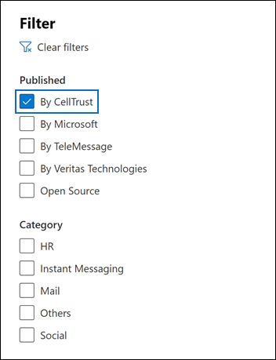

# Archivieren von Daten aus CellTrust SL2 in Microsoft 365

CellTrust SL2 erfasst Daten der mobilen Kommunikation und lässt sich in die führenden Archivierungstechnologien integrieren, um die Anforderungen für die elektronische Ermittlung für Vorschriften wie FINRA, HIPAA, FOIA und TCPA zu erfüllen. Der SL2-Datenkonnektor importiert mobile Kommunikationselemente in Microsoft 365. In diesem Artikel wird der Prozess der Integration von SL2 in Microsoft 365 mithilfe des CellTrust SL2-Datenkonnektors für die Archivierung beschrieben. Wenn Sie diesen Prozess abschließen, wird davon ausgegangen, dass Sie den CellTrust SL2-Dienst abonniert haben und mit der SL2-Architektur vertraut sind. Informationen zu SL2 finden Sie unter <www.celltrust.com>.

Nachdem Daten in Microsoft 365 in Benutzerpostfächer importiert wurden, können Sie Microsoft 365 Compliancefeatures wie Beweissicherung für juristische Zwecke, eDiscovery, Microsoft 365 Aufbewahrungsrichtlinien und Kommunikationscompliance anwenden. Die Verwendung des CellTrust SL2-Datenkonnektors zum Importieren und Archivieren von Daten in Microsoft 365 kann Ihrer Organisation helfen, die Einhaltung von Behörden- und Behördlichen Richtlinien zu halten.

## Übersicht über die Archivierung mit dem CellTrust SL2-Datenkonnektor

Die SL2-Plattform von CellTrust erfasst Kommunikationsdaten aus mehreren Quellen. SL2-Datenquellen sind entweder "Person-zu-Person" (P2P) oder "Application-to-Person" (A2P). Der in diesem Artikel beschriebene Prozess bezieht sich nur auf P2P-Datenquellen. Für alle P2P-Datenquellen ist mindestens eine Seite in der Zusammenarbeit ein SL2-Benutzer, der den SL2-Dienst abonniert hat. In der folgenden Übersicht wird der Prozess der Verwendung des CellTrust SL2-Datenkonnektors in Microsoft 365 erläutert.

1. SL2-Benutzer senden und empfangen Daten an und von SL2-Diensten in der Microsoft Azure Cloud.

2. Ihre Organisation verfügt über eine SL2-Domäne in der SL2 Cloud Service-Umgebung von CellTrust. Ihre Domäne kann eine oder mehrere Organisationseinheiten (OUs) aufweisen. Der SL2 Cloud Service überträgt Ihre Daten in einen äußerst sicheren Bereich auf der Microsoft Azure Plattform, sodass Ihre Daten niemals die Microsoft Azure Umgebung verlassen. Abhängig von Ihrem SL2-Plan (Enterprise, SMB oder Government) wird Ihre Domäne entweder auf Microsoft Azure Global oder Microsoft Azure Government gehostet.

3. Nachdem Sie den CellTrust SL2-Datenkonnektor, Ihre Domäne und OUs (unabhängig von Ihrem SL2-Plan) erstellt haben, beginnen Sie mit dem Senden von Daten an Microsoft 365. Der Datenfeed ist so strukturiert, dass berichte basierend auf Datenquellen, OUs oder der Domäne allein unterstützt werden. Daher benötigt Ihre Organisation nur einen Connector, um alle Ihre Datenquellen in Microsoft 365 zu feeden.

4. Der Connector erstellt unter jedem zugeordneten Benutzer einen Ordner mit einer entsprechenden Office 365 Lizenz mit dem Titel **CellTrust SL2.** Diese Zuordnung verbindet einen CellTrust SL2-Benutzer mithilfe einer E-Mail-Adresse mit einem Office 365 Postfach. Wenn eine Benutzer-ID in CellTrust SL2 keine Übereinstimmung in Office 365 hat, werden die Daten des Benutzers nicht archiviert.

## Vor dem Einrichten eines Connectors

- Stellen Sie sicher, dass Sie über eine Domäne in der CellTrust SL2-Clouddienstumgebung verfügen. Weitere Informationen zum Abrufen einer SL2-Produktions- oder Testdomäne erhalten Sie unter [CellTrust.](https://www.celltrust.com/contact-us/#form)

- Rufen Sie die Anmeldeinformationen ab, um auf das Administratorkonto für Ihre SL2-Domäne zuzugreifen.

- Der Benutzer, der den CellTrust SL2-Datenkonnektor in Schritt 1 erstellt (und in Schritt 3 abgeschlossen hat), muss der Rolle "Postfachimportexport" in Exchange Online zugewiesen werden. Diese Rolle ist erforderlich, um Connectors auf der Seite **"Datenconnectors"** im Microsoft 365 Compliance Center hinzuzufügen. Standardmäßig ist diese Rolle keiner Rollengruppe in Exchange Online zugewiesen. Sie können die Rolle "Postfachimportexport" der Rollengruppe "Organisationsverwaltung" in Exchange Online hinzufügen. Sie können auch eine Rollengruppe erstellen, die Rolle "Postfachimportexport" zuweisen und dann die entsprechenden Benutzer als Mitglieder hinzufügen. Weitere Informationen finden Sie in den Abschnitten ["Erstellen von Rollengruppen"](/Exchange/permissions-exo/role-groups#create-role-groups) oder "Ändern von [Rollengruppen"](/Exchange/permissions-exo/role-groups#modify-role-groups) im Artikel "Verwalten von Rollengruppen in Exchange Online".

## Schritt 1: Erstellen eines CellTrust SL2-Connectors

Der erste Schritt besteht darin, einen Datenkonnektor im Microsoft 365 Compliance Center zu erstellen.

1. Wechseln Sie im linken Navigationsbereich zu <https://compliance.microsoft.com> "Datenconnectors", und klicken Sie auf **"Datenconnectors".**

2. Klicken Sie auf der Registerkarte **"Übersicht"** auf **"Filtern",** wählen Sie **"Nach CellTrust" aus,** und wenden Sie dann den Filter an.

   

3. Klicken Sie auf **CellTrust SL2 (Vorschau).**

4. Klicken Sie auf der Seite **CellTrust SL2 (Vorschau)** auf **"Connector hinzufügen".**

5. Klicken Sie auf der Seite **"Nutzungsbedingungen"** auf **"Annehmen".**

6. Geben Sie einen eindeutigen Namen ein, der den Connector identifiziert, und klicken Sie dann auf **"Weiter".** Der von Ihnen eingegebene Name identifiziert den Connector auf der Seite **"Datenconnectors",** nachdem Sie ihn erstellt haben.

7. Klicken Sie auf der Seite **"Bei Ihrem CellTrust-Konto anmelden"** auf **"Bei CellTrust anmelden".** Sie werden zum **CellTrust-Portal für Microsoft 365** in einem neuen Browserfenster umgeleitet.

## Schritt 2: Auswählen der zu archivierenden Domänen oder Organisationseinheiten

Der nächste Schritt besteht darin, sich bei einem Administratorkonto für Ihre CellTrust SL2-Domäne anzumelden und die Domänen und OUs auszuwählen, die in Microsoft 365 archiviert werden sollen.

1. Wählen Sie auf der Seite CellTrust **Microsoft 365 Connector** Ihre Umgebung im SL2-Clouddienst aus, um eine Anmeldeseite anzuzeigen.

   In der Regel sollte eine Option angezeigt werden, die Ihre Umgebung darstellt. Wenn Sie jedoch Domänen in mehr als einer Umgebung haben, werden Optionen für jede Umgebung angezeigt. Nachdem Sie eine Auswahl getroffen haben, werden Sie zur SL2-Anmeldeseite umgeleitet.

2. Melden Sie sich mit den Anmeldeinformationen Ihres Domänen- oder OU-Administratorkontos an.

   Wenn Sie sich als SL2-Domänenadministrator anmelden, werden der Name Ihrer Domäne und die Organisationseinheiten in dieser Domäne angezeigt. Wenn Sie keine Organisationseinheiten haben, wird nur der Name Ihrer Domäne angezeigt. Wenn Sie sich als OE-Administrator anmelden, wird nur der Name Ihrer OE angezeigt.

3. Aktivieren Sie die Geschäftseinheiten, die Sie archivieren möchten. Wenn Sie die Domäne auswählen, werden die Organisationseinheiten nicht automatisch ausgewählt. Sie müssen jede ORGANISATIONSeinheit separat aktivieren, um sie zu archivieren.

   

4. Wenn Sie ihre Auswahl abgeschlossen haben, schließen Sie das Browserfenster, und kehren Sie zur Assistentenseite in Microsoft 365 Compliance Center zurück. Nach ein paar Sekunden geht der Assistent automatisch zum nächsten Schritt der Benutzerzuordnung über.

## Schritt 3: Zuordnen von Benutzern und Abschließen des Connector-Setups

Der letzte Schritt besteht darin, Benutzer zuzuordnen und die Connectoreinrichtung im Microsoft 365 Compliance Center abzuschließen.

1. Wählen Sie auf der Seite **"Benutzerzuordnung"** die Option **"Automatische Benutzerzuordnung aktivieren"** aus, wenn die E-Mail-Adresse für Benutzer in SL2 und Microsoft 365 identisch ist. Andernfalls sollten Sie E-Mail-Adressen manuell verwenden, indem Sie eine CSV-Datei hochladen, die die SL2-Adresse der Benutzer ihrer Microsoft 365 Adresse zuzuordnen.

2. Klicken Sie auf **"Weiter",** überprüfen Sie Ihre Einstellungen, und klicken Sie dann auf **"Fertig stellen",** um den Connector zu erstellen.

   Der neue Connector wird der Liste auf der Seite **"Datenconnectors"** hinzugefügt.

## Hilfe von CellTrust erhalten

Auf der [CellTrust-Kundensupportseite](https://www.celltrust.com/contact-us/#support) finden Sie Details zum Kontaktieren von CellTrust, um Hilfe beim Einrichten eines CellTrust SL2-Datenkonnektors zu erhalten.

## Weitere Informationen

- Ein Domänenadministrator kann einen Connector für die Domäne oder beliebige Organisationseinheiten in dieser Domäne einrichten. Wenn Sie das OU-Administratorkonto verwenden, können Sie nur einen Connector für diese bestimmte OE einrichten.

- Um die oben beschriebenen Schritte erfolgreich ausführen zu können, muss Ihnen eine Microsoft 365 E5-Lizenz zugewiesen sein und über die entsprechenden Microsoft Office Administratorrechte verfügen.

- Um den neuen Connector zu testen, senden Sie eine Textnachricht über Ihre mobile SL2-App oder über Ihr SL2-Portal. Wechseln Sie zu Ihrem Microsoft 365 Postfach, und öffnen Sie den Ordner **"CellTrust SL2"** in Ihrem Posteingang. Es kann einige Minuten dauern, bis die Textnachrichten in Ihrem Postfach angezeigt werden.

- Viele Gesetze und Vorschriften erfordern, dass die elektronische Kommunikation so aufbewahrt wird, dass sie auf Anforderung als Nachweis erstellt werden kann. Electronic Discovery (eDiscovery) wird verwendet, um die Produktion elektronischer Kommunikation einzuhalten. Enterprise EIA-Lösungen (Information Archiving, Informationsarchivierung) sind für die Durchführung von eDiscovery konzipiert und bieten Features wie die Verwaltung von Aufbewahrungsrichtlinien, die Datenklassifizierung und die Inhaltsüberwachung. Microsoft 365 bietet eine langfristige Aufbewahrungslösung für die Einhaltung der Vorschriften und Standards, die sich auf Ihre Organisation auswirken.

- Der In diesem Dokument verwendete Begriff *"Archivierung"* bezieht sich auf die Archivierung im Kontext der Verwendung innerhalb einer Enterprise Lösung für die Informationsarchivierung (Information Archiving, EIA). EIA-Lösungen verfügen über eDiscovery-Features, die Dokumente für juristische Verfahren, Rechtsstreitigkeiten, Audits und Untersuchungen erstellen. Die Archivierung im Kontext der Sicherung und Wiederherstellung, die für die Notfallwiederherstellung und geschäftskontinuität verwendet wird, ist nicht die beabsichtigte Verwendung des Begriffs in diesem Dokument.
