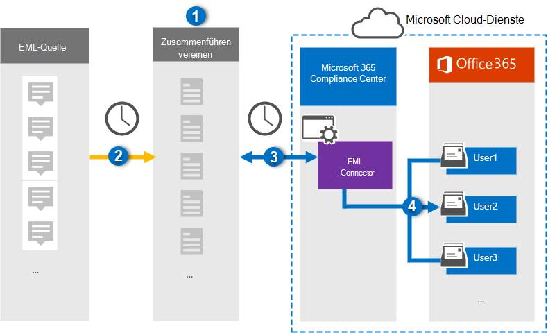

# Einrichten eines Connectors zum Archivieren von eml-DatenSet up a connector to archive EML data

Verwenden Sie einen Globanet-Connector im Microsoft 365 Compliance Center, um eml-Daten in Benutzerpostfächer in Ihrer Microsoft 365-Organisation zu importieren und zu archivieren.Use a Globanet connector in the Microsoft 365 compliance center to import and archive EML data to user mailboxes in your Microsoft 365 organization. EML ist die Dateierweiterung für eine e-Mail-Nachricht, die in einer Datei gespeichert ist.EML is the file extension for an email message saved to a file. Der Connector wandelt den Inhalt eines Elements aus dem Quellformat in ein e-Mail-Nachrichtenformat um und importiert dann das Element in ein Benutzerpostfach.The connector converts the content of an item from the source format to an email message format and then imports the item to a user mailbox.

Nachdem EML-Nachrichten in Benutzerpostfächern gespeichert wurden, können Sie Microsoft 365-Kompatibilitätsfeatures wie Beweissicherungsverfahren, eDiscovery-und Aufbewahrungsrichtlinien sowie Aufbewahrungs Bezeichnungen anwenden.After EML messages are stored in user mailboxes, you can apply Microsoft 365 compliance features such as Litigation Hold, eDiscovery, and retention policies and retention labels. Die Verwendung eines eml-Konnektors zum Importieren und Archivieren von Daten in Microsoft 365 kann dazu beitragen, dass Ihre Organisation mit behördlichen und behördlichen Richtlinien konform bleibt.Using an EML connector to import and archive data in Microsoft 365 can help your organization stay compliant with government and regulatory policies.

## Übersicht über das Archivieren von eml-DatenOverview of archiving EML data

In der folgenden Übersicht wird der Vorgang der Verwendung eines Connectors zum Archivieren von eml-Daten in Microsoft 365 erläutert.The following overview explains the process of using a connector to archive EML data in Microsoft 365.

1. Ihre Organisation arbeitet mit der EML-Quelle zusammen, um eine EML-Website einzurichten und zu konfigurieren.Your organization works with the EML source to set up and configure an EML site.

2. Alle 24 Stunden werden Inhaltselemente aus der EML-Quelle auf die Globanet Merge1-Website kopiert.Once every 24 hours, content items from the EML source are copied to the Globanet Merge1 site. Während dieses Prozesses wird der Inhalt einer EML-Datei in ein e-Mail-Nachrichtenformat konvertiert.During this process, the content of an EML file is converted to an email message format.

3. Der EML-Connector, den Sie im Microsoft 365 Compliance Center erstellen, stellt jeden Tag eine Verbindung mit der Globanet Merge1-Website her und überträgt die Nachrichten an einen sicheren Azure-Speicherort in der Microsoft-Cloud.The EML connector that you create in the Microsoft 365 compliance center, connects to the Globanet Merge1 site every day and transfers the messages to a secure Azure Storage location in the Microsoft cloud.

4. Der Connector importiert die konvertierten Nachrichtenelemente in die Postfächer bestimmter Benutzer, wobei der Wert der *Email* -Eigenschaft des in [Schritt 3](#step-3-map-users-and-complete-the-connector-setup)beschriebenen automatischen Benutzer Zuordnungsprozesses verwendet wird.The connector imports the converted message items to the mailboxes of specific users using the value of the *Email* property of the automatic user mapping process that's described in [Step 3](#step-3-map-users-and-complete-the-connector-setup). Während dieses Prozesses wird ein Unterordner im Posteingang-Ordner mit dem Namen **eml** in den Benutzerpostfächern erstellt, und die EML-Elemente werden in diesen Ordner importiert.During this process, a subfolder in the Inbox folder named **EML** is created in the user mailboxes, and the EML items are imported to that folder. Der Connector bestimmt anhand des Werts der *Email* -Eigenschaft, in welches Postfach Elemente importiert werden sollen.The connector determines which mailbox to import items to by using the value of the *Email* property. Jede Nachricht enthält diese Eigenschaft, die mit der e-Mail-Adresse jedes Teilnehmers des Inhaltselements aufgefüllt wird.Every message contains this property, which is populated with the email address of every participant of the content item.

## Bevor Sie beginnen:Before you begin

- Erstellen Sie ein Globanet-Merge1-Konto für Microsoft-Connectors.Create a Globanet Merge1 account for Microsoft connectors. Um ein Konto zu erstellen, wenden Sie sich an den [Globanet-Kunden Support](https://globanet.com/ms-connectors-contact).To create an account, contact [Globanet Customer Support](https://globanet.com/ms-connectors-contact). Sie melden sich bei diesem Konto an, wenn Sie den Connector in Schritt 1 erstellen.You will sign into this account when you create the connector in Step 1.

- Der Benutzer, der den eml-Konnektor in Schritt 1 erstellt (und in Schritt 3 vervollständigt wird), muss der Rolle "Post Fach Import Export" in Exchange Online zugewiesen sein.The user who creates the EML connector in Step 1 (and completes it in Step 3) must be assigned to the Mailbox Import Export role in Exchange Online. Diese Rolle ist für das Hinzufügen von Connectors auf der Seite **Daten Konnektoren** im Microsoft 365 Compliance Center erforderlich.This role is required to add connectors on the **Data connectors** page in the Microsoft 365 compliance center. Diese Rolle ist in Exchange Online standardmäßig keiner Rollengruppe zugewiesen.By default, this role is not assigned to a role group in Exchange Online. Sie können die Rolle "Post Fach Import exportieren" der Rollengruppe "Organisationsverwaltung" in Exchange Online hinzufügen.You can add the Mailbox Import Export role to the Organization Management role group in Exchange Online. Sie können auch eine Rollengruppe erstellen, die Rolle "Post Fach Import Export" zuweisen und dann die entsprechenden Benutzer als Mitglieder hinzufügen.Or you can create a role group, assign the Mailbox Import Export role, and then add the appropriate users as members. Weitere Informationen finden Sie im Abschnitt [Erstellen](https://docs.microsoft.com/Exchange/permissions-exo/role-groups#create-role-groups) von Rollengruppen oder [Ändern von Rollengruppen](https://docs.microsoft.com/Exchange/permissions-exo/role-groups#modify-role-groups) im Artikel "Verwalten von Rollengruppen in Exchange Online".For more information, see the [Create role groups](https://docs.microsoft.com/Exchange/permissions-exo/role-groups#create-role-groups) or [Modify role groups](https://docs.microsoft.com/Exchange/permissions-exo/role-groups#modify-role-groups) sections in the article "Manage role groups in Exchange Online".

## Schritt 1: Einrichten eines eml-ConnectorsStep 1: Set up an EML Connector

Der erste Schritt besteht darin, auf die Seite " **Daten Konnektoren** " im Microsoft 365 Compliance Center zuzugreifen und einen Connector für eml-Daten zu erstellen.The first step is to access to the **Data Connectors** page in the Microsoft 365 compliance center and create a connector for EML data.

1. Wechseln Sie zu, [https://compliance.microsoft.com](https://compliance.microsoft.com/) und klicken Sie dann auf **Daten Konnektoren**  >  **eml**.Go to [https://compliance.microsoft.com](https://compliance.microsoft.com/) and then click **Data connectors** > **EML**.

2. Klicken Sie auf der Seite **eml** -Produktbeschreibung auf **Connector hinzufügen**.On the **EML** product description page, click **Add connector**.

3. Klicken Sie auf der Seite **Nutzungsbedingungen** auf **annehmen**.On the **Terms of service** page, click **Accept**.

4. Geben Sie einen eindeutigen Namen ein, der den Connector identifiziert, und klicken Sie dann auf **weiter**.Enter a unique name that identifies the connector, and then click **Next**.

5. Melden Sie sich bei Ihrem Merge1-Konto an, um den Connector zu konfigurieren.Sign in to your Merge1 account to configure the connector.

## Schritt 2: Konfigurieren des eml-Konnektors auf der Globanet Merge1-WebsiteStep 2: Configure the EML connector on the Globanet Merge1 site

Der zweite Schritt besteht darin, den eml-Konnektor auf der Globanet Merge1-Website zu konfigurieren.The second step is to configure the EML connector on the Globanet Merge1 site. Informationen zum Konfigurieren des eml-Konnektors finden Sie unter [Merge1 Third-Party Connectors User Guide](https://docs.ms.merge1.globanetportal.com/Merge1%20Third-Party%20Connectors%20EML%20User%20Guide%20.pdf).For information about configuring  the EML connector, see [Merge1 Third-Party Connectors User Guide](https://docs.ms.merge1.globanetportal.com/Merge1%20Third-Party%20Connectors%20EML%20User%20Guide%20.pdf).

Nachdem Sie auf **& Ende speichern** klicken, wird die Seite **Benutzerzuordnung** im Connector-Assistenten im Microsoft 365 Compliance Center angezeigt.After you click **Save & Finish**, the **User mapping** page in the connector wizard in the Microsoft 365 compliance center is displayed.

## Schritt 3: Zuordnen von Benutzern und Abschließen des Connector-SetupsStep 3: Map users and complete the connector setup

Führen Sie die folgenden Schritte aus, um Benutzer zuzuordnen und das Connector-Setup im Microsoft 365 Compliance Center abzuschließen:To map users and complete the connector setup in the Microsoft 365 compliance center, follow these steps:

1. Aktivieren Sie auf der Seite **externe Benutzer auf Microsoft 365-Benutzer zuordnen** die Option Automatische Benutzerzuordnung.On the **Map external users to Microsoft 365 users** page, enable automatic user mapping. Die EML-Quellelemente enthalten eine Eigenschaft mit dem Namen " *e-Mail*", die e-Mail-Adressen für Benutzer in Ihrer Organisation enthält.The EML source items include a property called *Email*, which contains email addresses for users in your organization. Wenn der Connector diese Adresse einem Microsoft 365-Benutzer zuordnen kann, werden die EML-Elemente in das Postfach dieses Benutzers importiert.If the connector can associate this address with a Microsoft 365 user, the EML items are imported to that user’s mailbox.

2. Klicken Sie auf **weiter**, überprüfen Sie Ihre Einstellungen, und wechseln Sie dann zur Seite **Daten Konnektoren** , um den Fortschritt des Importvorgangs für den neuen Connector anzuzeigen.Click **Next**, review your settings, and then go to the **Data connectors** page to see the progress of the import process for the new connector.

## Schritt 4: Überwachen des eml-ConnectorsStep 4: Monitor the EML connector

Nachdem Sie den eml-Connector erstellt haben, können Sie den Connectorstatus im Microsoft 365 Compliance Center anzeigen.After you create the EML connector, you can view the connector status in the Microsoft 365 compliance center.

1. Wechseln Sie zu, [https://compliance.microsoft.com](https://compliance.microsoft.com) und klicken Sie im linken Navigationsbereich auf **Daten-Konnektoren** .Go to [https://compliance.microsoft.com](https://compliance.microsoft.com) and click **Data connectors** in the left nav.

2. Klicken Sie auf die Registerkarte **Connectors** , und wählen Sie dann den **eml** -Konnektor aus, um die Flyout-Seite anzuzeigen.Click the **Connectors** tab and then select the **EML** connector to display the flyout page. Diese Seite enthält die Eigenschaften und Informationen zum Connector.This page contains the properties and information about the connector.

3. Klicken Sie unter **Connectorstatus with Source** auf den Link **Download Protokoll** , um das Statusprotokoll für den Connector zu öffnen (oder zu speichern).Under **Connector status with source**, click the **Download log** link to open (or save) the status log for the connector. Dieses Protokoll enthält Informationen zu den Daten, die in die Microsoft-Cloud importiert wurden.This log contains information about the data that has been imported to the Microsoft cloud.

## Bekannte ProblemeKnown issues

- Zurzeit wird das Importieren von Anlagen oder Elementen, die größer als 10 MB sind, nicht unterstützt.At this time, we don't support importing attachments or items that are larger than 10 MB. Unterstützung für größere Elemente wird zu einem späteren Zeitpunkt zur Verfügung stehen.Support for larger items will be available at a later date.
