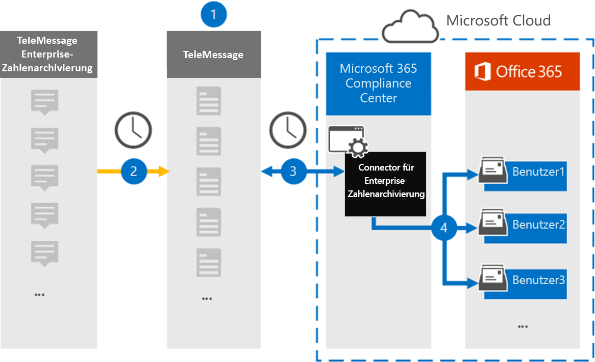

# Einrichten eines Connectors zum Archivieren von Enterprise-Nummern Daten (Vorschau)

Verwenden Sie einen TeleMessage Connector im Microsoft 365 Compliance Center zum Importieren und Archivieren von Kurznachrichtendienst (SMS) und MMS (Multimedia Messaging Service)-Nachrichten, Chatnachrichten, Sprachanruf Aufzeichnungen und Anrufprotokollen aus dem Enterprise-Nummern Archivierungsdienst. Nachdem Sie einen Connector eingerichtet und konfiguriert haben, stellt er einmal täglich eine Verbindung mit dem Tele Nachrichtenkonto Ihrer Organisation her und importiert die mobilen Kommunikationsdaten von Mitarbeitern, die das TeleMessage Enterprise Number Archiver verwenden, auf Postfächer in Microsoft 365.

Nach der Speicherung der Daten in Benutzerpostfächern für den Unternehmensnummern-Nachrichtendienst können Sie Microsoft 365-Compliance-Features wie Beweissicherungsverfahren, Inhaltssuche, in-situ-Archivierung, Überwachung, Kommunikations Konformität und Microsoft 365-Aufbewahrungsrichtlinien auf Unternehmensnummern-Archivierungsdaten anwenden. Beispielsweise können Sie die TeleMessage Enterprise Number Archiver SMS, MMS und Voice Call mithilfe der Inhaltssuche durchsuchen oder das Postfach, das die Daten des Archivierungs-Konnektors enthält, einer Depotbank in einem erweiterten eDiscovery-Fall zuordnen. Die Verwendung eines Archivierungs-Konnektors für Unternehmen zum Importieren und Archivieren von Daten in Microsoft 365 kann dazu beitragen, dass Ihre Organisation mit behördlichen und behördlichen Richtlinien konform bleibt.

## Übersicht über die Archivierung von Enterprise-Nummern Daten

In der folgenden Übersicht wird der Vorgang der Verwendung eines Connectors zum Archivieren von Unternehmensnetzwerk Daten in Microsoft 365 erläutert.

1. Ihre Organisation arbeitet mit TeleMessage zusammen, um einen Archivierungs-Konnektor für Unternehmensnummern einzurichten. Weitere Informationen finden Sie [hier](https://www.telemessage.com/office365-activation-for-enterprise-number-archiver/).

2. Der mit dem Enterprise Number Archiver Connector, den Sie im Microsoft 365 Compliance Center erstellen, wird täglich eine Verbindung mit der telemessaging-Website hergestellt, und die e-Mail-Nachrichten aus den vorherigen 24 Stunden werden an einen sicheren Azure-Speicherbereich in der Microsoft-Cloud übertragen.

3. Der Connector importiert die mobilen Kommunikationselemente in das Postfach eines bestimmten Benutzers. Ein neuer Ordner mit dem Namen Enterprise Number Archiver wird im Postfach des jeweiligen Benutzers erstellt, und die Elemente werden darin importiert. Der Connector wird mithilfe des Werts der *e-Mail-Adress* Eigenschaft des Benutzers zugeordnet. Jede e-Mail-Nachricht enthält diese Eigenschaft, die mit der e-Mail-Adresse jedes Teilnehmers der e-Mail-Nachricht aufgefüllt wird. Zusätzlich zur automatischen Benutzerzuordnung mithilfe des Werts der *e-Mail-Adress* Eigenschaft des Benutzers können Sie auch eine benutzerdefinierte Zuordnung definieren, indem Sie eine CSV-Zuordnungsdatei hochladen. Diese Zuordnungsdatei sollte die Mobiltelefonnummer des Benutzers und die entsprechende Microsoft 365-Postfachadresse für jeden Benutzer enthalten. Wenn Sie die automatische Benutzerzuordnung aktivieren und eine benutzerdefinierte Zuordnung bereitstellen, wird der Connector für jedes e-Mail-Element zuerst die benutzerdefinierte Zuordnungsdatei betrachten. Wenn kein gültiger Microsoft 365-Benutzer gefunden wird, der der Mobiltelefonnummer eines Benutzers entspricht, verwendet der Connector die e-Mail-Adresse des Benutzers des e-Mail-Elements. Wenn der Connector keinen gültigen Microsoft 365-Benutzer in der benutzerdefinierten Zuordnungsdatei oder der *e-Mail-Adresse des Benutzers* des e-Mail-Elements findet, wird das Element nicht importiert.

## Bevor Sie beginnen

Viele der erforderlichen Implementierungsschritte zum Archivieren von Unternehmensnummern-Archivierungsdaten liegen außerhalb von Microsoft 365 und müssen abgeschlossen sein, bevor Sie den Connector im Compliance Center erstellen können.

- Bestellen Sie den [Enterprise Number Archiver-Dienst über telemessaging](https://www.telemessage.com/mobile-archiver/order-mobile-archiver-for-o365) , und erhalten Sie ein gültiges Verwaltungskonto für Ihre Organisation. Sie müssen sich bei diesem Konto anmelden, wenn Sie den Connector im Compliance Center erstellen.

- Registrieren Sie alle Benutzer, die die Enterprise Number SMS/MMS-Netzwerk Archivierung in das TeleMessage-Konto benötigen. Achten Sie beim Registrieren von Benutzern darauf, dieselbe e-Mail-Adresse zu verwenden, die für Ihr Microsoft 365-Konto verwendet wird.

- Installieren und aktivieren Sie die TeleMessage Enterprise Number Archiver-App auf den Mobiltelefonen ihrer Mitarbeiter.

- Ihre Organisation muss einwilligen, dass der Office 365 Import Dienst auf Postfachdaten in Ihrer Organisation zugreifen kann. Sie müssen diese Zustimmung erteilen, wenn Sie den Connector erstellen. Um dieser Anforderung zuzustimmen, gehen Sie zu [dieser Seite](https://login.microsoftonline.com/common/oauth2/authorize?client_id=570d0bec-d001-4c4e-985e-3ab17fdc3073&response_type=code&redirect_uri=https://portal.azure.com/&nonce=1234&prompt=admin_consent), melden Sie sich mit den Anmeldeinformationen eines Office 365 globalen Administrators an, und nehmen Sie dann die Anforderung an. Sie müssen diesen Schritt ausführen, bevor Sie einen Bell Network Connector erfolgreich erstellen können.

- Dem Benutzer, der einen Archivierungs-Konnektor für Unternehmen erstellt, muss in Exchange Online die Rolle "Post Fach Import Export" zugewiesen sein. Dies ist für das Hinzufügen von Connectors auf der Seite " **Daten Konnektoren** " im Microsoft 365 Compliance Center erforderlich. Standardmäßig ist diese Rolle keiner Rollengruppe in Exchange Online zugewiesen. Sie können die Rolle "Post Fach Import exportieren" der Rollengruppe "Organisationsverwaltung" in Exchange Online hinzufügen. Sie können auch eine Rollengruppe erstellen, die Rolle "Post Fach Import Export" zuweisen und dann die entsprechenden Benutzer als Mitglieder hinzufügen. Weitere Informationen finden Sie im Abschnitt [Erstellen](https://docs.microsoft.com/Exchange/permissions-exo/role-groups#create-role-groups) von Rollengruppen oder [Ändern von Rollengruppen](https://docs.microsoft.com/Exchange/permissions-exo/role-groups#modify-role-groups) im Artikel "Verwalten von Rollengruppen in Exchange Online".

## Erstellen eines Archivierungs-Konnektors für Unternehmensnummern

Nachdem Sie die im vorherigen Abschnitt beschriebenen Voraussetzungen erfüllt haben, können Sie einen Archivierungs-Konnektor für Unternehmensnummern im Microsoft 365 Compliance Center erstellen. Der Connector verwendet die von Ihnen bereitgestellten Informationen, um eine Verbindung mit der telemessaging-Website herzustellen und SMS-, MMS-und Sprachanruf Nachrichten an die entsprechenden Benutzerpostfach-Postfächer in Microsoft 365 zu übertragen.

1. Wechseln [https://compliance.microsoft.com](https://compliance.microsoft.com/) Sie zu und klicken Sie dann auf **Data Connectors** \> **Enterprise Number Archiver**.

2. Klicken Sie auf der Seite **Enterprise Number Archiver** -Produktbeschreibung auf **Connector hinzufügen** .

3. Klicken Sie auf der Seite **Nutzungsbedingungen** auf **annehmen**.

4. Geben Sie auf der Seite **Anmeldung bei TeleMessage** unter Schritt 3 die erforderlichen Informationen in die folgenden Felder ein, und klicken Sie dann auf **weiter**.

   - **Benutzername:** Ihren Benutzernamen für die e-Mail-Nachricht.

   - **Kennwort:** Ihr TeleMessage-Kennwort.

5. Nachdem der Connector erstellt wurde, können Sie das Popupfenster schließen und zur nächsten Seite wechseln.

6. Aktivieren Sie auf der Seite **Benutzerzuordnung** die Option Automatische Benutzerzuordnung. Zum Aktivieren der benutzerdefinierten Zuordnung laden Sie eine CSV-Datei hoch, die die Benutzer Zuordnungsinformationen enthält, und klicken Sie dann auf **weiter**.

7. Geben Sie die Zustimmung des Administrators ein, und klicken Sie auf **weiter**.

   Um die Zustimmung des Administrators bereitzustellen, müssen Sie mit den Anmeldeinformationen eines Office 365 globalen Administrators angemeldet sein und dann die Zustimmungs Anforderung annehmen. Wenn Sie nicht als globaler Administrator angemeldet sind, können Sie zu [dieser Seite](https://login.microsoftonline.com/common/oauth2/authorize?client_id=570d0bec-d001-4c4e-985e-3ab17fdc3073&response_type=code&redirect_uri=https://portal.azure.com/&nonce=1234&prompt=admin_consent) wechseln und sich mit globalen Administratoranmeldeinformationen anmelden, um die Anforderung zu akzeptieren.

8. Überprüfen Sie Ihre Einstellungen, und klicken Sie dann auf **Fertig stellen** , um den Connector zu erstellen.

9. Wechseln Sie zur Registerkarte Konnektoren auf der Seite **Daten Konnektoren** , um den Fortschritt des Importvorgangs für den neuen Connector anzuzeigen.

## Bekannte Probleme

- Der Connector importiert kein Element, das größer als 10 MB ist.
