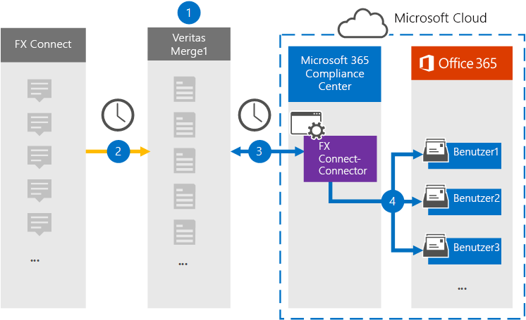

# Einrichten eines Connectors zum Archivieren von FX Connect-DatenSet up a connector to archive FX Connect data

Verwenden Sie einen Globanet-Connector im Microsoft 365 Compliance Center, um Daten von der FX Connect-Plattform für die Zusammenarbeit in Benutzerpostfächer in Ihrer Microsoft 365-Organisation zu importieren und zu archivieren.Use a Globanet connector in the Microsoft 365 compliance center to import and archive data from the FX Connect collaboration platform to user mailboxes in your Microsoft 365 organization. Das Programm bietet einen [FX Connect-Connector,](https://globanet.com/fx-connect/) der für die Erfassung von FX Connect-Elementen und den Import dieser Elemente in Microsoft 365 konfiguriert ist.Globanet provides an [FX Connect](https://globanet.com/fx-connect/) connector that is configured to capture FX Connect items and import those items to Microsoft 365. Der Connector konvertiert den Inhalt aus FX Connect, z. B. Gewerken, Nachrichten und anderen Details aus dem FX Connect-Konto Ihrer Organisation, in ein E-Mail-Nachrichtenformat und importiert diese Elemente dann in das Postfach des Benutzers in Microsoft 365.The connector converts the content from FX Connect, such as  trades, messages, and other details from your organization's FX Connect account, to an email message format and then imports those items to the user's mailbox in Microsoft 365.

Nachdem FX Connect-Daten in Benutzerpostfächern gespeichert wurden, können Sie Microsoft 365-Compliancefeatures anwenden, wie z. B. Litigation Hold, eDiscovery, Aufbewahrungsrichtlinien und Aufbewahrungsbezeichnungen sowie Kommunikationskonformität.After FX Connect data is stored in user mailboxes, you can apply Microsoft 365 compliance features such as Litigation Hold, eDiscovery, retention policies and retention labels, and communication compliance. Die Verwendung eines FX Connect-Connectors zum Importieren und Archivieren von Daten in Microsoft 365 kann Dazu beitragen, dass Ihre Organisation den richtlinienkonformen Richtlinien von Behörden und Behörden entspricht.Using an FX Connect connector to import and archive data in Microsoft 365 can help your organization stay compliant with government and regulatory policies.

## Übersicht über die Archivierung von FX Connect-DatenOverview of archiving FX Connect data

In der folgenden Übersicht wird der Prozess der Verwendung eines Connectors zum Archivieren der FX Connect-Informationen in Microsoft 365 erläutert.The following overview explains the process of using a connector to archive the FX Connect information in Microsoft 365.

1. Ihre Organisation arbeitet mit FX Connect zusammen, um eine FX Connect-Website zu einrichten und zu konfigurieren.Your organization works with FX Connect to set up and configure an FX Connect site.

2. Einmal alle 24 Stunden werden Elemente aus FX Connect-Konten auf die Website "Globenet Merge1" kopiert.Once every 24 hours, items from FX Connect accounts are copied to the Globanet Merge1 site. Der Connector konvertiert auch die FX Connect-Elemente in ein E-Mail-Nachrichtenformat.The connector also converts the FX Connect items to an email message format.

3. Der fx Connect-Connector, den Sie im Microsoft 365 Compliance Center erstellen, stellt jeden Tag eine Verbindung mit dem Standort "GlobeNet Merge1" bereit und überträgt die FX Connect-Elemente an einen sicheren Azure Storage-Speicherort in der Microsoft-Cloud.The FX Connect connector that you create in the Microsoft 365 compliance center, connects to the Globanet Merge1 site every day and transfers the FX Connect items to a secure Azure Storage location in the Microsoft cloud.

4. Der Connector importiert Elemente in die Postfächer bestimmter Benutzer mithilfe des Werts der *Email-Eigenschaft* der automatischen Benutzerzuordnung, wie in [Schritt 3 beschrieben.](#step-3-map-users-and-complete-the-connector-setup)The connector imports items to the mailboxes of specific users by using the value of the *Email* property of the automatic user mapping as described in [Step 3](#step-3-map-users-and-complete-the-connector-setup). In den Benutzerpostfächern wird ein Unterordner im Posteingangsordner mit dem Namen **FX Connect** erstellt, und die Elemente werden in diesen Ordner importiert.A subfolder in the Inbox folder named **FX Connect** is created in the user mailboxes, and the items are imported to that folder. Der Connector verwendet dazu den Wert der *Email-Eigenschaft.*The connector does this by using the value of the *Email* property. Jedes FX Connect-Element enthält diese Eigenschaft, die mit der E-Mail-Adresse jedes Teilnehmers des Elements gefüllt wird.Every FX Connect item contains this property, which is populated with the email address of every participant of the item.

## Bevor Sie beginnenBefore you begin

- Erstellen Sie ein Konto für das Merge1-Konto von "GlobeNet Merge1" für Microsoft-Connectors.Create a Globanet Merge1 account for Microsoft connectors.  Um ein Konto zu erstellen, wenden Sie sich an [den Kundensupport von "Globenet".](https://globanet.com/ms-connectors-contact)To create an account, contact [Globanet Customer Support](https://globanet.com/ms-connectors-contact). Sie melden sich bei diesem Konto an, wenn Sie den Connector in Schritt 1 erstellen.You will sign into this account when you create the connector in Step 1.

- Der Benutzer, der den FX Connect-Connector in Schritt 1 erstellt (und in Schritt 3 abgeschlossen) muss der Rolle Postfachimportexport in Exchange Online zugewiesen werden.The user who creates the FX Connect connector in Step 1 (and completes it in Step 3) must be assigned to the Mailbox Import Export role in Exchange Online. Diese Rolle ist erforderlich, um Connectors auf der Seite **Datenconnectors** im Microsoft 365 Compliance Center hinzuzufügen.This role is required to add connectors on the **Data connectors** page in the Microsoft 365 compliance center. Diese Rolle ist standardmäßig nicht einer Rollengruppe in Exchange Online zugewiesen.By default, this role is not assigned to a role group in Exchange Online. Sie können die Rolle Postfachimportexport zur Rollengruppe Organisationsverwaltung in Exchange Online hinzufügen.You can add the Mailbox Import Export role to the Organization Management role group in Exchange Online. Sie können auch eine Rollengruppe erstellen, die Rolle Postfachimportexport zuweisen und dann die entsprechenden Benutzer als Mitglieder hinzufügen.Or you can create a role group, assign the Mailbox Import Export role, and then add the appropriate users as members. Weitere Informationen finden Sie in den Abschnitten Erstellen von [Rollengruppen](/Exchange/permissions-exo/role-groups#create-role-groups) oder [Ändern](/Exchange/permissions-exo/role-groups#modify-role-groups) von Rollengruppen im Artikel "Verwalten von Rollengruppen in Exchange Online".For more information, see the [Create role groups](/Exchange/permissions-exo/role-groups#create-role-groups) or [Modify role groups](/Exchange/permissions-exo/role-groups#modify-role-groups) sections in the article "Manage role groups in Exchange Online".

## Schritt 1: Einrichten des FX Connect-ConnectorsStep 1: Set up the FX Connect connector

Der erste Schritt besteht im Zugriff auf die Seite **Datenconnectors** im Microsoft 365 Compliance Center und dem Erstellen eines Connectors für FX Connect-Daten.The first step is to access to the **Data Connectors** page in the Microsoft 365 compliance center and create a connector for FX Connect data.

1. Wechseln Sie [https://compliance.microsoft.com](https://compliance.microsoft.com/) zu, und klicken Sie dann auf **Datenconnectors**  >  **FX Connect**.Go to [https://compliance.microsoft.com](https://compliance.microsoft.com/) and then click **Data connectors** > **FX Connect**.

2. Klicken Sie **auf der Seite** Fx Connect-Produktbeschreibung auf **Connector hinzufügen.**On the **FX Connect** product description page, click **Add connector**.

3. Klicken Sie **auf der Seite Nutzungsbedingungen** auf **Akzeptieren**.On the **Terms of service** page, click **Accept**.

4. Geben Sie einen eindeutigen Namen ein, der den Connector identifiziert, und klicken Sie dann auf **Weiter**.Enter a unique name that identifies the connector, and then click **Next**.

5. Melden Sie sich bei Ihrem Merge1-Konto an, um den Connector zu konfigurieren.Sign in to your Merge1 account to configure the connector.

## Schritt 2: Konfigurieren des FX Connect-Connectors auf der Website "Globenet Merge1"Step 2: Configure the FX Connect connector on the Globanet Merge1 site

Der zweite Schritt besteht im Konfigurieren des FX Connect-Connectors auf dem Merge1-Standort.The second step is to configure the FX Connect connector on the Merge1 site. Informationen zum Konfigurieren des FX Connect-Connectors finden Sie unter [Merge1-Benutzerhandbuch](https://docs.ms.merge1.globanetportal.com/Merge1%20Third-Party%20Connectors%20FX%20Connect%20User%20Guide%20.pdf)für Drittanbieterconnectors .For information about how to configure the FX Connect connector, see [Merge1 Third-Party Connectors User Guide](https://docs.ms.merge1.globanetportal.com/Merge1%20Third-Party%20Connectors%20FX%20Connect%20User%20Guide%20.pdf).

Nachdem Sie auf **& Beenden** klicken, wird die Seite Benutzerzuordnung im Connector-Assistenten im Microsoft 365 Compliance Center angezeigt. After you click **Save & Finish**, the **User mapping** page in the connector wizard in the Microsoft 365 compliance center is displayed.

## Schritt 3: Zuordnung von Benutzern und Abschließen der ConnectoreinrichtungStep 3: Map users and complete the connector setup

Führen Sie die folgenden Schritte aus, um Benutzer zu zuordnungen und die Connectoreinrichtung im Microsoft 365 Compliance Center abzuschließen:To map users and complete the connector setup in the Microsoft 365 compliance center, follow these steps:

1. Aktivieren Sie auf der **Seite Fx Connect-Benutzer mit Microsoft 365-Benutzern** zuordnen die automatische Benutzerzuordnung.On the **Map FX Connect users to Microsoft 365 users** page, enable automatic user mapping. Die FX Connect-Elemente enthalten eine Eigenschaft namens *Email*, die E-Mail-Adressen für Benutzer in Ihrer Organisation enthält.The FX Connect items include a property called *Email*, which contains email addresses for users in your organization. Wenn der Connector diese Adresse einem Microsoft 365-Benutzer zuordnen kann, werden die Elemente in das Postfach dieses Benutzers importiert.If the connector can associate this address with a Microsoft 365 user, the items are imported to that user’s mailbox.

2. Klicken **Sie auf Weiter,** überprüfen Sie  Ihre Einstellungen, und wechseln Sie dann zur Seite Datenconnectors, um den Fortschritt des Importvorgangs für den neuen Connector zu sehen.Click **Next**, review your settings, and then go to the **Data connectors** page to see the progress of the import process for the new connector.

## Schritt 4: Überwachen des FX Connect-ConnectorsStep 4: Monitor the FX Connect connector

Nachdem Sie den FX Connect-Connector erstellt haben, können Sie den Connectorstatus im Microsoft 365 Compliance Center anzeigen.After you create the FX Connect connector, you can view the connector status in the Microsoft 365 compliance center.

1. Wechseln Sie <https://compliance.microsoft.com/> zu, und klicken Sie **im** linken Navigations navi auf Datenconnectors.Go to <https://compliance.microsoft.com/> and click **Data connectors** in the left nav.

2. Klicken Sie auf **die** Registerkarte Connectors, und wählen Sie dann den **FX Connect-Connector** aus, um die Flyoutseite anzeigen zu können.Click the **Connectors** tab and then select the **FX Connect** connector to display the flyout page. Diese Seite enthält die Eigenschaften und Informationen zum Connector.This page contains the properties and information about the connector.

3. Klicken **Sie unter Connectorstatus mit Quelle** auf den Link **Protokoll** herunterladen, um das Statusprotokoll für den Connector zu öffnen (oder zu speichern).Under **Connector status with source**, click the **Download log** link to open (or save) the status log for the connector. Dieses Protokoll enthält Daten, die in die Microsoft Cloud importiert wurden.This log contains data that has been imported to the Microsoft cloud.

## Bekannte ProblemeKnown issues

- Derzeit wird das Importieren von Anlagen oder Elementen, die größer als 10 MB sind, nicht unterstützt.At this time, we don't support importing attachments or items that are larger than 10 MB. Unterstützung für größere Elemente wird zu einem späteren Zeitpunkt verfügbar sein.Support for larger items will be available at a later date.