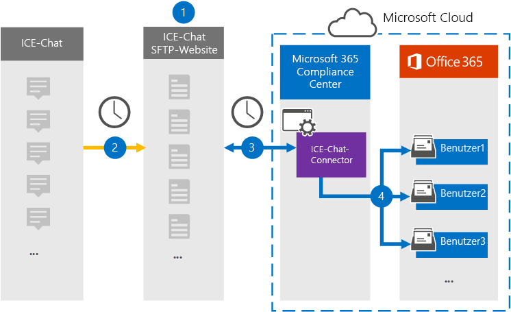

# Einrichten eines Connectors zum Archivieren von Ice-Chat Daten (Vorschau)Set up a connector to archive ICE Chat data (preview)

Verwenden Sie einen systemeigenen Connector im Microsoft 365 Compliance Center zum Importieren und Archivieren von Finanz Dienstleistungs-Chat Daten aus dem ICE Chat-Zusammenarbeits Tool.Use a native connector in the Microsoft 365 compliance center to import and archive financial services chat data from the ICE Chat collaboration tool. Nachdem Sie einen Connector eingerichtet und konfiguriert haben, stellt er eine Verbindung mit der ICE Chat Secure FTP (SFTP)-Website Ihrer Organisation einmal täglich her, wandelt den Inhalt von Chat Nachrichten in ein e-Mail-Nachrichtenformat um und importiert diese Elemente anschließend in Postfächer in Microsoft 365.After you set up and configure a connector, it connects to your organization's ICE Chat secure FTP (SFTP) site once every day, converts the content of chat messages to an email message format, and then import those items to mailboxes in Microsoft 365.

Nachdem Ice-Chat Daten in Benutzerpostfächern gespeichert wurden, können Sie Microsoft 365-Compliance-Features wie Beweissicherungsverfahren, eDiscovery, Archivierung, Überwachung, Kommunikations Konformität und Microsoft 365-Aufbewahrungsrichtlinien auf Ice-Chatdaten anwenden.After ICE chat data is stored in user mailboxes, you can apply Microsoft 365 compliance features such as litigation hold, eDiscovery, archiving, auditing, communication compliance, and Microsoft 365 retention policies to ICE Chat data. Sie können beispielsweise Ice-Chatnachrichten mithilfe der Inhaltssuche durchsuchen oder das Postfach, das die Ice-Chat Daten enthält, einer Depotbank in einem erweiterten eDiscovery-Fall zuordnen.For example, you can search ICE Chat messages using content search or associate the mailbox that contains the ICE Chat data with a custodian in an Advanced eDiscovery case. Die Verwendung eines ICE-Chat-Konnektors zum Importieren und Archivieren von Daten in Microsoft 365 kann dazu beitragen, dass Ihre Organisation mit behördlichen und behördlichen Richtlinien konform bleibt.Using an ICE Chat connector to import and archive data in Microsoft 365 can help your organization stay compliant with government and regulatory policies.

## Übersicht über die Archivierung von Ice-Chat DatenOverview of archiving ICE Chat data

In der folgenden Übersicht wird erläutert, wie Sie einen Connector zum Archivieren von Ice-Chat Daten in Microsoft 365 verwenden.The following overview explains the process of using a connector to archive ICE chat data in Microsoft 365.

1. Ihre Organisation arbeitet mit ICE Chat zusammen, um eine Ice Chat SFTP-Website einzurichten.Your organization works with ICE Chat to set up an ICE Chat SFTP site. Sie können auch mit ICE Chat zusammenarbeiten, um den ICE Chat so zu konfigurieren, dass Chatnachrichten in Ihre Ice Chat SFTP-Website kopiert werden.You'll also work with ICE Chat to configure ICE Chat to copy chat messages to your ICE Chat SFTP site.

2. Einmal alle 24 Stunden werden Chatnachrichten von Ice Chat auf Ihre Ice Chat SFTP-Website kopiert.Once every 24 hours, chat messages from ICE Chat are copied to your ICE Chat SFTP site.

3. Der ICE Chat Connector, den Sie im Microsoft 365 Compliance Center erstellen, stellt jeden Tag eine Verbindung mit der ICE Chat SFTP-Website her und überträgt die Chat Nachrichten aus den vorherigen 24 Stunden an einen sicheren Azure-Speicherort in der Microsoft-Cloud.The ICE Chat connector that you create in the Microsoft 365 compliance center connects to the ICE Chat SFTP site every day and transfers the chat messages from the previous 24 hours to a secure Azure Storage location in the Microsoft Cloud. Der Connector wandelt auch den Inhalt einer Chat Massage in ein e-Mail-Nachrichtenformat um.The connector also converts the content of a chat massage to an email message format.

4. Der Connector importiert Chatnachrichten Elemente in die Postfächer bestimmter Benutzer.The connector imports chat message items to the mailboxes of specific users. In den Benutzerpostfächern wird ein neuer Ordner mit dem Namen **Ice Chat** erstellt, und die Chatnachrichten Elemente werden in diesen Ordner importiert.A new folder named **ICE Chat** will be created in the user mailboxes and the chat message items will be imported to that folder. Der Connector verwendet den Wert der Eigenschaften *SenderEmail* und *RecipientEmail* .The connector does by using the value of the *SenderEmail* and *RecipientEmail* properties. Jede Chatnachricht enthält diese Eigenschaften, die mit der e-Mail-Adresse des Absenders und allen Empfängern/Teilnehmern der Chatnachricht aufgefüllt werden.Every chat message contains these properties, which are populated with email address of the sender and every recipient/participant of the chat message.

   Zusätzlich zur automatischen Benutzerzuordnung, die die Werte der *SenderEmail* -und der *RecipientEmail* -Eigenschaft verwendet (was bedeutet, dass der Connector eine Chatnachricht in das Postfach des Absenders und die Postfächer jedes Empfängers importiert), können Sie auch benutzerdefinierte Benutzerzuordnungen definieren, indem Sie eine CSV-Zuordnungsdatei hochladen.In addition to automatic user mapping that uses the values of the *SenderEmail* and *RecipientEmail* property (which means that the connector imports a chat message to the sender's mailbox and the mailboxes of every recipient), you can also define custom user mapping by uploading a CSV mapping file. Diese Zuordnungsdatei enthält den ICE Chat *ImId* und die entsprechende Microsoft 365-Postfachadresse für jeden Benutzer in Ihrer Organisation.This mapping file contains the ICE Chat *ImId* and the corresponding Microsoft 365 mailbox address for every user in your organization. Wenn Sie die automatische Benutzerzuordnung aktivieren und eine benutzerdefinierte Zuordnungsdatei bereitstellen, wird der Connector für jedes Chat Element zuerst die benutzerdefinierte Zuordnungsdatei betrachten.If you enable automatic user mapping and provide a custom-mapping file, for every chat item the connector will first look at the custom-mapping file. Wenn ein gültiges Microsoft 365-Benutzerkonto, das dem ICE Chat-ImId eines Benutzers entspricht, nicht gefunden wird, verwendet der Connector die *SenderEmail* -und *RecipientEmail* -Eigenschaften des Chat Elements, um das Element in die Postfächer der Chat Teilnehmer zu importieren.If it doesn't find a valid Microsoft 365 user account that corresponds to a user's ICE Chat ImId, the connector will use the *SenderEmail* and *RecipientEmail* properties of the chat item to import the item to the mailboxes of the chat participants. Wenn der Connector weder in der benutzerdefinierten Zuordnungsdatei noch in den Eigenschaften *SenderEmail* und *RecipientEmail* einen gültigen Microsoft 365-Benutzer findet, wird das Element nicht importiert.If the connector doesn't find a valid Microsoft 365 user in either the custom-mapping file or the *SenderEmail* and *RecipientEmail* properties, the item won't be imported.

## Bevor Sie beginnenBefore you begin

Viele der erforderlichen Implementierungsschritte zum Archivieren von Ice-Chat Daten liegen außerhalb von Microsoft 365 und müssen abgeschlossen sein, bevor Sie den Connector im Compliance Center erstellen können.Many of the implementation steps required to archive ICE Chat data are external to Microsoft 365 and must be completed before you can create the connector in the compliance center.

- Ihre Organisation muss einwilligen, dass der Office 365 Import Dienst auf Postfachdaten in Ihrer Organisation zugreifen kann.Your organization must consent to allow the Office 365 Import service to access mailbox data in your organization. Um dieser Anforderung zuzustimmen, gehen Sie zu [dieser Seite](https://login.microsoftonline.com/common/oauth2/authorize?client_id=570d0bec-d001-4c4e-985e-3ab17fdc3073&response_type=code&redirect_uri=https://portal.azure.com/&nonce=1234&prompt=admin_consent), melden Sie sich mit den Anmeldeinformationen eines Office 365 globalen Administrators an, und nehmen Sie dann die Anforderung an.To consent to this request, go to [this page](https://login.microsoftonline.com/common/oauth2/authorize?client_id=570d0bec-d001-4c4e-985e-3ab17fdc3073&response_type=code&redirect_uri=https://portal.azure.com/&nonce=1234&prompt=admin_consent), sign in with the credentials of an Office 365 global admin, and then accept the request. Sie müssen diesen Schritt ausführen, bevor Sie den ICE Chat Connector in Schritt 3 erfolgreich erstellen können.You must complete this step before you can successfully create the ICE Chat connector in Step 3.

- Ice Chat berechnet ihren Kunden Gebühren für externe Compliance.ICE Chat charges their customers a fee for external compliance. Ihre Organisation sollte sich an die Ice Chat Sales Group wenden, um zu diskutieren und die Ice Chat Data Services-Vereinbarung zu unterzeichnen, die Sie unter erhalten können [https://www.theice.com/publicdocs/agreements/ICE\_Data\_Services\_Agreement.pdf](https://www.theice.com/publicdocs/agreements/ICE\_Data\_Services\_Agreement.pdf) .Your organization should contact the ICE Chat sales group to discuss, and to sign the ICE Chat data services agreement, which you can obtain at [https://www.theice.com/publicdocs/agreements/ICE\_Data\_Services\_Agreement.pdf](https://www.theice.com/publicdocs/agreements/ICE\_Data\_Services\_Agreement.pdf). Diese Vereinbarung besteht zwischen Ice Chat und Ihrer Organisation und umfasst keine Microsoft.This agreement is between ICE Chat and your organization and does not involve Microsoft. Nachdem Sie in Schritt 2 eine Ice Chat SFTP-Website eingerichtet haben, stellt Ice Chat die FTP-Anmeldeinformationen direkt in Ihrer Organisation bereit.After you set up an ICE Chat SFTP site in Step 2, ICE Chat provides the FTP credentials directly to your organization. Anschließend sollten Sie diese Anmeldeinformationen bei der Einrichtung des Connectors in Schritt 3 an Microsoft weitergeben.Then you who would provide those credentials to Microsoft when setting up the connector in Step 3.

- Sie müssen eine Ice Chat SFTP-Website einrichten, bevor Sie den Connector in Schritt 3 erstellen.You must set up an ICE Chat SFTP site before creating the connector in Step 3. Nach der Arbeit mit ICE Chat, um die SFTP-Website einzurichten, werden Daten aus dem ICE-Chat jeden Tag auf die SFTP-Website hochgeladen.After working with ICE Chat to set up the SFTP site, data from ICE Chat is uploaded to the SFTP site every day. Der in Schritt 3 erstellte Connector stellt eine Verbindung mit dieser SFTP-Website her und überträgt die Chat Daten an Microsoft 365-Postfächer.The connector you create in Step 3 connects to this SFTP site and transfers the chat data to Microsoft 365 mailboxes. SFTP verschlüsselt auch die Ice-Chat-Daten, die während des Übertragungsprozesses an Postfächer gesendet werden.SFTP also encrypts the ICE Chat data that's sent to mailboxes during the transfer process.

- Der Administrator, der in Schritt 3 den ICE-Chat-Konnektor erstellt (und der die öffentlichen Schlüssel und die IP-Adresse in Schritt 1 herunterlädt) muss in Exchange Online die Rolle "Post Fach Import Export" zugewiesen haben.The admin who creates the ICE Chat connector in Step 3 (and who downloads the public keys and IP address in Step 1) must be assigned the Mailbox Import Export role in Exchange Online. Diese Rolle ist für das Hinzufügen von Connectors auf der Seite **Daten Konnektoren** im Microsoft 365 Compliance Center erforderlich.This role is required to add connectors on the **Data connectors** page in the Microsoft 365 compliance center. Standardmäßig ist diese Rolle keiner Rollengruppe in Exchange Online zugewiesen.By default, this role isn't assigned to any role group in Exchange Online. Sie können die Rolle "Post Fach Import exportieren" der Rollengruppe "Organisationsverwaltung" in Exchange Online hinzufügen.You can add the Mailbox Import Export role to the Organization Management role group in Exchange Online. Sie können auch eine Rollengruppe erstellen, die Rolle "Post Fach Import Export" zuweisen und dann die entsprechenden Benutzer als Mitglieder hinzufügen.Or you can create a role group, assign the Mailbox Import Export role, and then add the appropriate users as members. Weitere Informationen finden Sie im Abschnitt [Erstellen](https://docs.microsoft.com/Exchange/permissions-exo/role-groups#create-role-groups) von Rollengruppen oder [Ändern von Rollengruppen](https://docs.microsoft.com/Exchange/permissions-exo/role-groups#modify-role-groups) im Artikel "Verwalten von Rollengruppen in Exchange Online".For more information, see the [Create role groups](https://docs.microsoft.com/Exchange/permissions-exo/role-groups#create-role-groups) or [Modify role groups](https://docs.microsoft.com/Exchange/permissions-exo/role-groups#modify-role-groups) sections in the article "Manage role groups in Exchange Online".

## Schritt 1: Abrufen von öffentlichen SSH-und PGP-SchlüsselnStep 1: Obtain SSH and PGP public keys

Der erste Schritt besteht darin, eine Kopie der öffentlichen Schlüssel für Secure Shell (SSH) und Pretty Good Privacy (PGP) zu erhalten.The first step is to obtain a copy of the public keys for Secure Shell (SSH) and Pretty Good Privacy (PGP). Sie verwenden diese Schlüssel in Schritt 2, um die Website Ice Chat SFTP so zu konfigurieren, dass der in Schritt 3 erstellte Connector die Verbindung zur SFTP-Website herstellen und die Ice-Chatdaten an Microsoft 365-Postfächerüber tragen kann.You use these keys in Step 2 to configure the ICE Chat SFTP site to allow the connector (that you create in Step 3) to connect to the SFTP site and transfer the ICE Chat data to Microsoft 365 mailboxes. Außerdem erhalten Sie in diesem Schritt eine IP-Adresse, die Sie beim Konfigurieren der ICE Chat SFTP-Website verwenden.You will also obtain an IP address in this step, which you use when configuring the ICE Chat SFTP site.

1. Wechseln Sie zu, [https://compliance.microsoft.com](https://compliance.microsoft.com) und klicken Sie im linken Navigationsbereich auf **Daten-Konnektoren** .Go to [https://compliance.microsoft.com](https://compliance.microsoft.com) and click **Data connectors** in the left nav.

2. Klicken Sie auf der Seite **Daten Konnektoren (Vorschau)** unter **Ice Chat**auf **Ansicht**.On the **Data connectors (preview)** page under **ICE Chat**, click **View**.

3. Klicken Sie auf der Seite **Ice Chat** auf **Connector hinzufügen**.On the **ICE Chat** page, click **Add connector**.

4. Klicken Sie auf der Seite **Nutzungsbedingungen** auf **annehmen**.On the **Terms of service** page, click **Accept**.

5. Klicken Sie auf der Seite **Anmeldeinformationen für ICE Chat SFTP-Website hinzufügen** unter Schritt 1 auf den Link **SSH herunterladen**, **PGP-Schlüssel**herunterladen und **IP-Adress Links herunterladen** , um eine Kopie der einzelnen Dateien auf dem lokalen Computer zu speichern.On the **Add credentials for ICE Chat SFTP site** page under step 1, click the **Download SSH key**, **Download PGP key**, and **Download IP address** links to save a copy of each file to your local computer. Diese Dateien enthalten die folgenden Elemente, die zum Konfigurieren der ICE Chat SFTP-Website in Schritt 2 verwendet werden:These files contain the following items that are used to configure the ICE Chat SFTP site in Step 2:

   - Öffentlicher SSH-Schlüssel: dieser Schlüssel wird zum Konfigurieren von Secure SSH verwendet, um eine sichere Remoteanmeldung zu ermöglichen, wenn der Connector eine Verbindung mit der ICE Chat SFTP-Website herstellt.SSH public key: This key is used to configure Secure SSH to enable a secure remote login when the connector connects to the ICE Chat SFTP site.

   - Öffentlicher PGP-Schlüssel: dieser Schlüssel wird verwendet, um die Verschlüsselung von Daten zu konfigurieren, die von der ICE Chat SFTP-Website an Microsoft 365 übertragen werden.PGP public key: This key is used to configure the encryption of data that's transferred from the ICE Chat SFTP site to Microsoft 365.

   - IP-Adresse: die Ice Chat SFTP-Website ist so konfiguriert, dass Sie eine Verbindungsanforderung nur von dieser IP-Adresse akzeptiert, die von dem ICE-Chat-Konnektor verwendet wird, den Sie in Schritt 3 erstellen.IP address: The ICE Chat SFTP site is configured to accept a connection request only from this IP address, which is used by the ICE Chat connector that you create in Step 3.

6. Klicken Sie auf **Abbrechen** , um den Assistenten zu schließen.Click **Cancel** to close the wizard. Sie kehren zu diesem Assistenten in Schritt 3 zurück, um den Connector zu erstellen.You come back to this wizard in Step 3 to create the connector.

## Schritt 2: Konfigurieren der ICE Chat SFTP-WebsiteStep 2: Configure the ICE Chat SFTP site

Der nächste Schritt besteht darin, die öffentlichen SSH-und PGP-Schlüssel sowie die IP-Adresse, die Sie in Schritt 1 erhalten haben, zum Konfigurieren der SSH-Authentifizierung und der PGP-Verschlüsselung für die Ice Chat SFTP-Website zu verwenden.The next step is to use the SSH and PGP public keys and the IP address that you obtained in Step 1 to configure SSH authentication and PGP encryption for the ICE Chat SFTP site. Auf diese Weise können Sie den in Schritt 3 erstellten Ice-Chat-Konnektor mit der ICE Chat SFTP-Website verbinden und Ice-Chat Daten an Microsoft 365 übertragen.This lets the ICE Chat connector that you create in Step 3 connect to the ICE Chat SFTP site and transfer ICE Chat data to Microsoft 365. Sie müssen mit dem ICE Chat-Kundensupport zusammenarbeiten, um Ihre Ice Chat SFTP-Website einzurichten.You need to work with ICE Chat customer support to set up your ICE Chat SFTP site.

## Schritt 3: Erstellen eines ICE Chat ConnectorsStep 3: Create an ICE Chat connector

Der letzte Schritt ist das Erstellen eines ICE-Chat-Konnektors im Microsoft 365 Compliance Center.The last step is to create an ICE Chat connector in the Microsoft 365 compliance center. Der Connector verwendet die von Ihnen bereitgestellten Informationen, um eine Verbindung zur Ice Chat SFTP-Website herzustellen und Chat Nachrichten an die entsprechenden Benutzerpostfach-Postfächer in Microsoft 365 zu übertragen.The connector uses the information you provide to connect to the ICE Chat SFTP site and transfer chat messages to the corresponding user mailbox boxes in Microsoft 365.

1. Wechseln Sie zu, [https://compliance.microsoft.com](https://compliance.microsoft.com) und klicken Sie im linken Navigationsbereich auf **Daten-Konnektoren** .Go to [https://compliance.microsoft.com](https://compliance.microsoft.com) and click **Data connectors** in the left nav.

2. Klicken Sie auf der Seite **Daten Konnektoren** unter **Ice Chat**auf **Ansicht**.On the **Data connectors** page under **ICE Chat**, click **View**.

3. Klicken Sie auf der Seite **Ice Chat** auf **Connector hinzufügen**.On the **ICE Chat** page, click **Add connector**.

4. Klicken Sie auf der Seite **Nutzungsbedingungen** auf **annehmen**.On the **Terms of service** page, click **Accept**.

5. Geben Sie auf der Seite **Anmeldeinformationen für ICE Chat SFTP-Website hinzufügen** unter Schritt 3 die erforderlichen Informationen in die folgenden Felder ein, und klicken Sie dann auf **Verbindung überprüfen**.On the **Add credentials for ICE Chat SFTP site** page, under Step 3, enter the required information in the following boxes and then click **Validate connection**.

   - **Firm Code:** Die ID für Ihre Organisation, die als Benutzername für die Ice Chat SFTP-Website verwendet wird.**Firm code:** The ID for your organization, which is used as the username for the ICE Chat SFTP site.

   - **Kennwort:** Das Kennwort für Ihre Ice Chat SFTP-Website.**Password:** The password for your ICE Chat SFTP site.

   - **SFTP-URL:** Die URL für die Ice Chat SFTP-Website (beispielsweise SFTP.theice.com).**SFTP URL:** The URL for the ICE Chat SFTP site (for example, sftp.theice.com).

   - **SFTP-Port:** Die Portnummer für die Ice Chat SFTP-Website.**SFTP port:** The port number for the ICE Chat SFTP site. Der Connector verwendet diesen Port, um eine Verbindung mit der SFTP-Website herzustellen.The connector uses this port to connect to the SFTP site.

6. Nachdem die Verbindung überprüft wurde, klicken Sie auf **weiter**.After the connection is validated, click **Next**.

7. Aktivieren Sie auf der Seite **externe Benutzer für Microsoft 365-Benutzer zuordnen** die Option Automatische Benutzerzuordnung, und geben Sie nach Bedarf eine Benutzerzuordnung an.On the **Map external users to Microsoft 365 users** page, enable automatic user mapping and provide custom user mapping as required. Auf dieser Seite können Sie eine Kopie der CSV-Datei für die Benutzerzuordnung herunterladen.You can download a copy of the user-mapping CSV file on this page. Sie können die Benutzerzuordnungen der Datei hinzufügen und diese dann hochladen.You can add the user mappings to the file and then upload it.

   > [!NOTE]
   > Wie bereits erläutert, enthält die CSV-Datei für die benutzerdefinierte Zuordnungsdatei die Ice-Chat-Imid und die entsprechende Microsoft 365-Postfachadresse für jeden Benutzer.As previously explained, custom mapping file CSV file contains the ICE Chat imid and corresponding Microsoft 365 mailbox address for each user. Wenn Sie die automatische Benutzerzuordnung aktivieren und eine benutzerdefinierte Zuordnung bereitstellen, wird der Connector für jedes Chat Element zuerst die benutzerdefinierte Zuordnungsdatei betrachten.If you enable automatic user mapping and provide a custom mapping, for every chat item, the connector will first look at custom mapping file. Wenn kein gültiger Microsoft 365-Benutzer gefunden wird, der dem ICE Chat-Imid eines Benutzers entspricht, importiert der Connector das Element in die Postfächer für die Benutzer, die in den Eigenschaften *SenderEmail* und *RecipientEmail* des Chat Elements angegeben sind.If it doesn't find a valid Microsoft 365 user that corresponds to a user's ICE Chat imid, the connector will import the item to the mailboxes for the users specified in the *SenderEmail* and *RecipientEmail* properties of the chat item. Wenn der Connector keinen gültigen Microsoft 365-Benutzer durch eine automatische oder benutzerdefinierte Benutzerzuordnung findet, wird das Element nicht importiert.If the connector doesn't find a valid Microsoft 365 user by either automatic or custom user mapping, the item won't be imported.

8. Klicken Sie auf **weiter**, überprüfen Sie Ihre Einstellungen, und klicken Sie dann auf **Fertig stellen** , um den Connector zu erstellen.Click **Next**, review your settings, and then click **Finish** to create the connector.

9. Wechseln Sie zur Seite **Daten Konnektoren** , um den Fortschritt des Importvorgangs für den neuen Connector anzuzeigen.Go to the **Data connectors** page to see the progress of the import process for the new connector.
