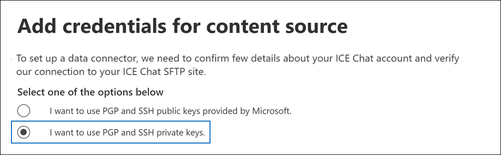
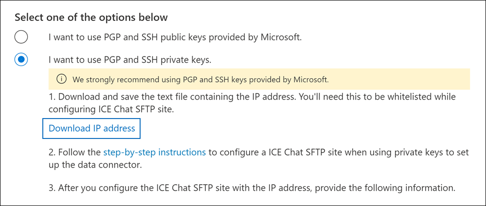

# Einrichten eines Connectors zum Archivieren von ICE Chat-DatenSet up a connector to archive ICE Chat data

Verwenden Sie einen systemeigenen Connector im Microsoft 365 Compliance Center zum Importieren und Archivieren von Finanzdienstchatdaten aus dem ICE Chat Collaboration Tool.Use a native connector in the Microsoft 365 compliance center to import and archive financial services chat data from the ICE Chat collaboration tool. Nachdem Sie einen Connector eingerichtet und konfiguriert haben, stellt er einmal täglich eine Verbindung mit der SECURE FTP (SECURE FTP)-Website (SECURE FTP) Ihrer Organisation sicher, konvertiert den Inhalt von Chatnachrichten in ein E-Mail-Nachrichtenformat und importiert diese Elemente dann in Postfächer in Microsoft 365.After you set up and configure a connector, it connects to your organization's ICE Chat secure FTP (SFTP) site once every day, converts the content of chat messages to an email message format, and then import those items to mailboxes in Microsoft 365.

Nachdem ICE-Chatdaten in Benutzerpostfächern gespeichert wurden, können Sie Microsoft 365 Compliancefeatures wie z. B. Das Archivieren von Rechtsstreitigkeiten, eDiscovery, Archivierung, Überwachung, Kommunikationskonformität und Microsoft 365 Aufbewahrungsrichtlinien auf ICE Chat-Daten anwenden.After ICE chat data is stored in user mailboxes, you can apply Microsoft 365 compliance features such as litigation hold, eDiscovery, archiving, auditing, communication compliance, and Microsoft 365 retention policies to ICE Chat data. Sie können z. B. ICE Chat-Nachrichten mithilfe der Inhaltssuche durchsuchen oder das Postfach, das die ICE Chat-Daten enthält, einem Custodian in einem Advanced eDiscovery zuordnen.For example, you can search ICE Chat messages using content search or associate the mailbox that contains the ICE Chat data with a custodian in an Advanced eDiscovery case. Die Verwendung eines ICE-Chatconnector zum Importieren und Archivieren von Daten in Microsoft 365 kann Dazu beitragen, dass Ihre Organisation die Richtlinien von Behörden und Behörden einhalten kann.Using an ICE Chat connector to import and archive data in Microsoft 365 can help your organization stay compliant with government and regulatory policies.

## Übersicht über die Archivierung von ICE Chat-DatenOverview of archiving ICE Chat data

In der folgenden Übersicht wird der Prozess der Verwendung eines Connectors zum Archivieren von ICE-Chatdaten in Microsoft 365.The following overview explains the process of using a connector to archive ICE chat data in Microsoft 365.

1. Ihre Organisation arbeitet mit ICE Chat zusammen, um eine ICE Chat -SFTP-Website zu einrichten.Your organization works with ICE Chat to set up an ICE Chat SFTP site. Sie arbeiten auch mit ICE Chat zusammen, um ICE Chat so zu konfigurieren, dass Chatnachrichten auf Ihre ICE Chat SFTP-Website kopiert werden.You'll also work with ICE Chat to configure ICE Chat to copy chat messages to your ICE Chat SFTP site.

2. Einmal alle 24 Stunden werden Chatnachrichten aus dem ICE Chat auf Ihre ICE Chat SFTP-Website kopiert.Once every 24 hours, chat messages from ICE Chat are copied to your ICE Chat SFTP site.

3. Der ice chat connector, den Sie im Microsoft 365 Compliance Center erstellen, verbindet sich täglich mit dem ICE Chat SFTP-Standort und überträgt die Chatnachrichten aus den vorherigen 24 Stunden an einen sicheren Azure Storage-Speicherort in der Microsoft-Cloud.The ICE Chat connector that you create in the Microsoft 365 compliance center connects to the ICE Chat SFTP site every day and transfers the chat messages from the previous 24 hours to a secure Azure Storage location in the Microsoft cloud. Der Connector konvertiert auch den Inhalt einer Chat-Chat-Chats in ein E-Mail-Nachrichtenformat.The connector also converts the content of a chat massage to an email message format.

4. Der Connector importiert Chatnachrichtenelemente in die Postfächer bestimmter Benutzer.The connector imports chat message items to the mailboxes of specific users. In den **Benutzerpostfächern** wird ein neuer Ordner namens ICE Chat erstellt, und die Chatnachrichtenelemente werden in diesen Ordner importiert.A new folder named **ICE Chat** is created in the user mailboxes and the chat message items are imported to that folder. Der Connector verwendet den Wert der *Eigenschaften SenderEmail* und *RecipientEmail.*The connector does by using the value of the *SenderEmail* and *RecipientEmail* properties. Jede Chatnachricht enthält diese Eigenschaften, die mit der E-Mail-Adresse des Absenders und jedem Empfänger/Teilnehmer der Chatnachricht gefüllt werden.Every chat message contains these properties, which are populated with email address of the sender and every recipient/participant of the chat message.

   Neben der automatischen Benutzerzuordnung, die die Werte der *Eigenschaft SenderEmail* und *RecipientEmail* verwendet (d. h. der Connector importiert eine Chatnachricht in das Postfach des Absenders und die Postfächer jedes Empfängers), können Sie auch eine benutzerdefinierte Benutzerzuordnung definieren, indem Sie eine CSV-Zuordnungsdatei hochladen.In addition to automatic user mapping that uses the values of the *SenderEmail* and *RecipientEmail* property (which means that the connector imports a chat message to the sender's mailbox and the mailboxes of every recipient), you can also define custom user mapping by uploading a CSV mapping file. Diese Zuordnungsdatei enthält die ICE Chat *ImId* und die Microsoft 365 Postfachadresse für jeden Benutzer in Ihrer Organisation.This mapping file contains the ICE Chat *ImId* and the corresponding Microsoft 365 mailbox address for every user in your organization. Wenn Sie die automatische Benutzerzuordnung aktivieren und eine benutzerdefinierte Zuordnungsdatei bereitstellen, wird für jedes Chatelement zunächst die datei für die benutzerdefinierte Zuordnung vom Connector angezeigt.If you enable automatic user mapping and provide a custom-mapping file, for every chat item the connector will first look at the custom-mapping file. Wenn kein gültiges Microsoft 365-Benutzerkonto gefunden wird, das der ICE Chat-ImId eines Benutzers entspricht, verwendet der Connector die *Eigenschaften SenderEmail* und *RecipientEmail* des Chatelements, um das Element in die Postfächer der Chatteilnehmer zu importieren.If it doesn't find a valid Microsoft 365 user account that corresponds to a user's ICE Chat ImId, the connector will use the *SenderEmail* and *RecipientEmail* properties of the chat item to import the item to the mailboxes of the chat participants. Wenn der Connector keinen gültigen Microsoft 365 in der benutzerdefinierten Zuordnungsdatei oder den Eigenschaften *SenderEmail* und *RecipientEmail* findet, wird das Element nicht importiert.If the connector doesn't find a valid Microsoft 365 user in either the custom-mapping file or the *SenderEmail* and *RecipientEmail* properties, the item won't be imported.

## Vor dem Einrichten eines ConnectorsBefore you set up a connector

Einige der Implementierungsschritte, die zum Archivieren von ICE -Chat-Daten erforderlich sind, sind Microsoft 365 und müssen abgeschlossen werden, bevor Sie den Connector im Compliance Center erstellen können.Some of the implementation steps required to archive ICE Chat data are external to Microsoft 365 and must be completed before you can create the connector in the compliance center.

- ICE Chat berechnet seinen Kunden eine Gebühr für externe Compliance.ICE Chat charges their customers a fee for external compliance. Ihre Organisation sollte sich an die ICE Chat-Vertriebsgruppe wenden, um zu diskutieren und den ICE Chat-Datendienstevertrag zu unterzeichnen, den Sie unter erhalten [https://www.theice.com/publicdocs/agreements/ICE\_Data\_Services\_Agreement.pdf](https://www.theice.com/publicdocs/agreements/ICE\_Data\_Services\_Agreement.pdf) können.Your organization should contact the ICE Chat sales group to discuss, and to sign the ICE Chat data services agreement, which you can obtain at [https://www.theice.com/publicdocs/agreements/ICE\_Data\_Services\_Agreement.pdf](https://www.theice.com/publicdocs/agreements/ICE\_Data\_Services\_Agreement.pdf). Diese Vereinbarung besteht zwischen ICE Chat und Ihrer Organisation und schließt Microsoft nicht ein.This agreement is between ICE Chat and your organization and does not involve Microsoft. Nachdem Sie eine ICE Chat -SFTP-Website in Schritt 2 eingerichtet haben, stellt ICE Chat die FTP-Anmeldeinformationen direkt für Ihre Organisation zur Verfügung.After you set up an ICE Chat SFTP site in Step 2, ICE Chat provides the FTP credentials directly to your organization. Anschließend stellen Sie microsoft diese Anmeldeinformationen beim Einrichten des Connectors in Schritt 3 zur Verfügung.Then you who would provide those credentials to Microsoft when setting up the connector in Step 3.

- Sie müssen einen ICE Chat -SFTP-Standort einrichten, bevor Sie den Connector in Schritt 3 erstellen.You must set up an ICE Chat SFTP site before creating the connector in Step 3. Nach der Arbeit mit ICE Chat zum Einrichten der SFTP-Website werden täglich Daten aus ICE Chat auf den SFTP-Standort hochgeladen.After working with ICE Chat to set up the SFTP site, data from ICE Chat is uploaded to the SFTP site every day. Der connector, den Sie in Schritt 3 erstellen, stellt eine Verbindung mit dieser SFTP-Website und überträgt die Chatdaten an Microsoft 365 Postfächer.The connector you create in Step 3 connects to this SFTP site and transfers the chat data to Microsoft 365 mailboxes. SFTP verschlüsselt auch die ICE Chat-Daten, die während des Übertragungsprozesses an Postfächer gesendet werden.SFTP also encrypts the ICE Chat data that's sent to mailboxes during the transfer process.

- Zum Einrichten eines ICE-Chatconnector müssen Sie Schlüssel und Schlüsselpassphrasen für Pretty Good Privacy (PGP) und Secure Shell (SSH) verwenden.To set up an ICE Chat connector, you have to use keys and key passphrases for Pretty Good Privacy (PGP) and Secure Shell (SSH). Diese Schlüssel werden verwendet, um den ICE Chat SFTP-Standort zu konfigurieren und vom Connector zum Herstellen einer Verbindung mit dem ICE Chat SFTP-Standort zum Importieren von Daten Microsoft 365.These keys are used to configure the ICE Chat SFTP site and used by the connector to connect to the ICE Chat SFTP site to import data to Microsoft 365. Der PGP-Schlüssel wird verwendet, um die Verschlüsselung von Daten zu konfigurieren, die vom ICE Chat SFTP-Standort an die Microsoft 365.The PGP key is used to configure the encryption of data that's transferred from the ICE Chat SFTP site to Microsoft 365. Der SSH-Schlüssel wird verwendet, um eine sichere Shell zu konfigurieren, um eine sichere Remoteanmeldung zu ermöglichen, wenn der Connector eine Verbindung mit dem ICE Chat SFTP-Standort herstellt.The SSH key is used to configure secure shell to enable a secure remote login when the connector connects to the ICE Chat SFTP site.

  Beim Einrichten eines Connectors haben Sie die Möglichkeit, von Microsoft bereitgestellte öffentliche Schlüssel und Schlüsselpassphrasen zu verwenden, oder Sie können eigene private Schlüssel und Passphrasen verwenden.When setting up a connector, you have the option to use public keys and key passphrases provided by Microsoft or you can use your own private keys and passphrases. Es wird empfohlen, die von Microsoft bereitgestellten öffentlichen Schlüssel zu verwenden.We recommend that you use the public keys provided by Microsoft. Wenn Ihre Organisation jedoch bereits einen ICE Chat -SFTP-Standort mit privaten Schlüsseln konfiguriert hat, können Sie einen Connector mit diesen privaten Schlüsseln erstellen.However, if your organization has already configured an ICE Chat SFTP site using private keys, then you can create a connector using these same private keys.

- Der ICE Chat Connector kann insgesamt 200.000 Elemente an einem einzigen Tag importieren.The ICE Chat connector can import a total of 200,000 items in a single day. Wenn mehr als 200.000 Elemente auf der SFTP-Website vorhanden sind, wird keines dieser Elemente in Microsoft 365.If there are more than 200,000 items on the SFTP site, none of those items will be imported to Microsoft 365.

- Dem Administrator, der den ICE-Chatconnector in Schritt 3 erstellt (und der die öffentlichen Schlüssel und die IP-Adresse in Schritt 1 herunterlädt), muss die Rolle Postfachimportexport in Exchange Online.The admin who creates the ICE Chat connector in Step 3 (and who downloads the public keys and IP address in Step 1) must be assigned the Mailbox Import Export role in Exchange Online. Diese Rolle ist erforderlich, um Connectors auf der Seite **Datenconnectors** im compliance center Microsoft 365 hinzufügen.This role is required to add connectors on the **Data connectors** page in the Microsoft 365 compliance center. Standardmäßig ist diese Rolle keiner Rollengruppe in Exchange Online zugewiesen.By default, this role isn't assigned to any role group in Exchange Online. Sie können die Rolle Postfachimportexport zur Rollengruppe Organisationsverwaltung in der Exchange Online.You can add the Mailbox Import Export role to the Organization Management role group in Exchange Online. Sie können auch eine Rollengruppe erstellen, die Rolle Postfachimportexport zuweisen und dann die entsprechenden Benutzer als Mitglieder hinzufügen.Or you can create a role group, assign the Mailbox Import Export role, and then add the appropriate users as members. Weitere Informationen finden Sie in den Abschnitten [Erstellen](/Exchange/permissions-exo/role-groups#create-role-groups) von Rollengruppen oder [Ändern](/Exchange/permissions-exo/role-groups#modify-role-groups) von Rollengruppen im Artikel "Verwalten von Rollengruppen in Exchange Online".For more information, see the [Create role groups](/Exchange/permissions-exo/role-groups#create-role-groups) or [Modify role groups](/Exchange/permissions-exo/role-groups#modify-role-groups) sections in the article "Manage role groups in Exchange Online".

## Einrichten eines Connectors mithilfe öffentlicher SchlüsselSet up a connector using public keys

Die Schritte in diesem Abschnitt zeigen, wie Sie einen ICE-Chatconnector mithilfe der öffentlichen Schlüssel für Pretty Good Privacy (PGP) und Secure Shell (SSH) einrichten.The steps in this section show you how to set up an ICE Chat connector using the public keys for Pretty Good Privacy (PGP) and Secure Shell (SSH).

### Schritt 1: Abrufen öffentlicher PGP- und SSH-SchlüsselStep 1: Obtain PGP and SSH public keys

Der erste Schritt besteht im Abrufen einer Kopie der öffentlichen Schlüssel für Pretty Good Privacy (PGP) und Secure Shell (SSH).The first step is to obtain a copy of the public keys for Pretty Good Privacy (PGP) and Secure Shell (SSH). Sie verwenden diese Schlüssel in Schritt 2, um den ICE Chat SFTP-Standort so zu konfigurieren, dass der Connector (den Sie in Schritt 3 erstellen) eine Verbindung mit dem SFTP-Standort herstellen und die ICE Chat-Daten an Microsoft 365 übertragen.You use these keys in Step 2 to configure the ICE Chat SFTP site to allow the connector (that you create in Step 3) to connect to the SFTP site and transfer the ICE Chat data to Microsoft 365 mailboxes. In diesem Schritt erhalten Sie auch eine IP-Adresse, die Sie beim Konfigurieren des ICE Chat SFTP-Standorts verwenden.You will also obtain an IP address in this step, which you use when configuring the ICE Chat SFTP site.

1. Wechseln Sie [https://compliance.microsoft.com](https://compliance.microsoft.com) zu, und klicken Sie **im** linken Navigations navi auf Datenconnectors.Go to [https://compliance.microsoft.com](https://compliance.microsoft.com) and click **Data connectors** in the left nav.

2. Klicken Sie **auf der Seite Datenconnectors** unter **ICE Chat** auf **Anzeigen**.On the **Data connectors** page under **ICE Chat**, click **View**.

3. Klicken Sie **auf der Seite ICE-Chat** auf **Connector hinzufügen.**On the **ICE Chat** page, click **Add connector**.

4. Klicken Sie **auf der Seite Nutzungsbedingungen** auf **Akzeptieren**.On the **Terms of service** page, click **Accept**.

5. Klicken Sie **auf der Seite Anmeldeinformationen** für Inhaltsquelle hinzufügen auf Ich möchte öffentliche PGP- und SSH-Schlüssel von **Microsoft verwenden.**On the **Add credentials for content source** page, click **I want to use PGP and SSH public keys provided by Microsoft**.

   

6. Klicken Sie unter Schritt 1 auf die Schaltfläche **SSH** herunterladen, **PGP-Schlüssel** herunterladen und IP-Adresslinks herunterladen, um eine Kopie jeder Datei auf Ihrem lokalen Computer zu speichern. Under step 1, click the **Download SSH key**, **Download PGP key**, and **Download IP address** links to save a copy of each file to your local computer.

   

   Diese Dateien enthalten die folgenden Elemente, die zum Konfigurieren der ICE Chat -SFTP-Website in Schritt 2 verwendet werden:These files contain the following items that are used to configure the ICE Chat SFTP site in Step 2:

   - Öffentlicher PGP-Schlüssel: Dieser Schlüssel wird verwendet, um die Verschlüsselung von Daten zu konfigurieren, die vom ICE Chat SFTP-Standort in die Microsoft 365.PGP public key: This key is used to configure the encryption of data that's transferred from the ICE Chat SFTP site to Microsoft 365.

   - Öffentlicher SSH-Schlüssel: Dieser Schlüssel wird verwendet, um Secure SSH zu konfigurieren, um eine sichere Remoteanmeldung zu ermöglichen, wenn der Connector eine Verbindung mit dem ICE Chat SFTP-Standort herstellt.SSH public key: This key is used to configure Secure SSH to enable a secure remote login when the connector connects to the ICE Chat SFTP site.

   - IP-Adresse: Der ICE Chat SFTP-Standort ist so konfiguriert, dass er eine Verbindungsanforderung nur von dieser IP-Adresse akzeptiert, die vom ice chat connector verwendet wird, den Sie in Schritt 3 erstellen.IP address: The ICE Chat SFTP site is configured to accept a connection request only from this IP address, which is used by the ICE Chat connector that you create in Step 3.

7. Klicken **Sie auf Abbrechen,** um den Assistenten zu schließen.Click **Cancel** to close the wizard. Sie kommen in Schritt 3 zu diesem Assistenten zurück, um den Connector zu erstellen.You come back to this wizard in Step 3 to create the connector.

### Schritt 2: Konfigurieren der ICE Chat -SFTP-WebsiteStep 2: Configure the ICE Chat SFTP site

Der nächste Schritt besteht in der Verwendung der öffentlichen PGP- und SSH-Schlüssel und der IP-Adresse, die Sie in Schritt 1 erhalten haben, um die PGP-Verschlüsselung und die SSH-Authentifizierung für den ICE Chat SFTP-Standort zu konfigurieren.The next step is to use the PGP and SSH public keys and the IP address that you obtained in Step 1 to configure PGP encryption and SSH authentication for the ICE Chat SFTP site. Auf diese Weise kann der in Schritt 3 erstellte ICE Chat-Connector eine Verbindung mit dem ICE Chat -SFTP-Standort herstellen und ICE Chat-Daten an Microsoft 365.This lets the ICE Chat connector that you create in Step 3 connect to the ICE Chat SFTP site and transfer ICE Chat data to Microsoft 365. Sie müssen mit dem ICE Chat-Kundensupport zusammenarbeiten, um Ihre ICE Chat SFTP-Website einrichten zu können.You need to work with ICE Chat customer support to set up your ICE Chat SFTP site.

### Schritt 3: Erstellen eines ICE-ChatconnectorStep 3: Create an ICE Chat connector

Der letzte Schritt besteht im Erstellen eines ICE-Chatconnector im Microsoft 365 Compliance Center.The last step is to create an ICE Chat connector in the Microsoft 365 compliance center. Der Connector verwendet die informationen, die Sie bereitstellen, um eine Verbindung mit der ICE Chat SFTP-Website herzustellen und Chatnachrichten an die entsprechenden Benutzerpostfächer in der Microsoft 365.The connector uses the information you provide to connect to the ICE Chat SFTP site and transfer chat messages to the corresponding user mailbox boxes in Microsoft 365.

1. Wechseln Sie [https://compliance.microsoft.com](https://compliance.microsoft.com) zu, und klicken Sie **im** linken Navigations navi auf Datenconnectors.Go to [https://compliance.microsoft.com](https://compliance.microsoft.com) and click **Data connectors** in the left nav.

2. Klicken Sie **auf der Seite Datenconnectors** unter **ICE Chat** auf **Anzeigen**.On the **Data connectors** page under **ICE Chat**, click **View**.

3. Klicken Sie **auf der Seite ICE-Chat** auf **Connector hinzufügen.**On the **ICE Chat** page, click **Add connector**.

4. Klicken Sie **auf der Seite Nutzungsbedingungen** auf **Akzeptieren**.On the **Terms of service** page, click **Accept**.

5. Klicken Sie **auf der Seite Anmeldeinformationen** für Inhaltsquelle hinzufügen auf Ich möchte öffentliche PGP- und **SSH-Schlüssel verwenden.**On the **Add credentials for content source** page, click **I want to use PGP and SSH public keys**.

6. Geben Sie unter Schritt 3 die erforderlichen Informationen in die folgenden Felder ein, und klicken Sie dann **auf Verbindung überprüfen.**Under Step 3, enter the required information in the following boxes and then click **Validate connection**.

   - **Firmencode:** Die ID für Ihre Organisation, die als Benutzername für die ICE Chat SFTP-Website verwendet wird.**Firm code:** The ID for your organization, which is used as the username for the ICE Chat SFTP site.

   - **Kennwort:** Das Kennwort für Ihre ICE Chat SFTP-Website.**Password:** The password for your ICE Chat SFTP site.

   - **SFTP-URL:** Die URL für die ICE Chat SFTP-Website (z. B. `sftp.theice.com` ).**SFTP URL:** The URL for the ICE Chat SFTP site (for example, `sftp.theice.com`). Sie können auch eine IP-Adresse für diesen Wert verwenden.You can also use an IP address for this value.

   - **SFTP-Port:** Die Portnummer für den ICE Chat SFTP-Standort.**SFTP port:** The port number for the ICE Chat SFTP site. Der Connector verwendet diesen Port, um eine Verbindung mit dem SFTP-Standort herzustellen.The connector uses this port to connect to the SFTP site.

7. Nachdem die Verbindung erfolgreich überprüft wurde, klicken Sie auf **Weiter**.After the connection is successfully validated, click **Next**.

8. Aktivieren Sie auf der Seite Externe **Benutzer Microsoft 365 Benutzer zuordnen** die automatische Benutzerzuordnung, und stellen Sie bei Bedarf eine benutzerdefinierte Benutzerzuordnung zur Verfügung.On the **Map external users to Microsoft 365 users** page, enable automatic user mapping and provide custom user mapping as required. Sie können eine Kopie der BENUTZERzuordnungs-CSV-Datei auf dieser Seite herunterladen.You can download a copy of the user-mapping CSV file on this page. Sie können die Benutzerzuordnungen der Datei hinzufügen und dann hochladen.You can add the user mappings to the file and then upload it.

   > [!NOTE]
   > Wie bereits erläutert, enthält die benutzerdefinierte Zuordnungsdatei -CSV-Datei die ICE Chat-Imid und Microsoft 365 Postfachadresse für jeden Benutzer.As previously explained, custom mapping file CSV file contains the ICE Chat imid and corresponding Microsoft 365 mailbox address for each user. Wenn Sie die automatische Benutzerzuordnung aktivieren und eine benutzerdefinierte Zuordnung bereitstellen, wird für jedes Chatelement zunächst die benutzerdefinierte Zuordnungsdatei vom Connector angezeigt.If you enable automatic user mapping and provide a custom mapping, for every chat item, the connector will first look at custom mapping file. Wenn kein gültiger Microsoft 365-Benutzer gefunden wird, der der ICE Chat-Imid eines Benutzers entspricht, importiert der Connector das Element in die Postfächer für die Benutzer, die in den Eigenschaften *SenderEmail* und *RecipientEmail* des Chatelements angegeben sind.If it doesn't find a valid Microsoft 365 user that corresponds to a user's ICE Chat imid, the connector will import the item to the mailboxes for the users specified in the *SenderEmail* and *RecipientEmail* properties of the chat item. Wenn der Connector keinen gültigen Benutzer Microsoft 365 automatische oder benutzerdefinierte Benutzerzuordnung findet, wird das Element nicht importiert.If the connector doesn't find a valid Microsoft 365 user by either automatic or custom user mapping, the item won't be imported.

9. Klicken **Sie auf Weiter,** überprüfen Sie Ihre Einstellungen, und klicken Sie dann auf **Fertig stellen,** um den Connector zu erstellen.Click **Next**, review your settings, and then click **Finish** to create the connector.

10. Wechseln Sie zur **Seite Datenconnectors,** um den Fortschritt des Importvorgangs für den neuen Connector zu sehen.Go to the **Data connectors** page to see the progress of the import process for the new connector.

## Einrichten eines Connectors mithilfe privater SchlüsselSet up a connector using private keys

Die Schritte in diesem Abschnitt zeigen, wie Sie einen ICE-Chatconnector mit privaten PGP- und SSH-Schlüsseln einrichten.The steps in this section show you how to set up an ICE Chat connector using PGP and SSH private keys. Diese Connectoreinrichtungsoption ist für Organisationen vorgesehen, die bereits eine ICE Chat -SFTP-Website mit privaten Schlüsseln konfiguriert haben.This connector setup option is intended for organizations that have already configured an ICE Chat SFTP site using private keys.

### Schritt 1: Abrufen einer IP-Adresse zum Konfigurieren der ICE Chat -SFTP-WebsiteStep 1: Obtain an IP address to configure the ICE Chat SFTP site

Wenn Ihre Organisation private PGP- und SSH-Schlüssel zum Einrichten eines ICE Chat -SFTP-Standorts verwendet hat, müssen Sie eine IP-Adresse abrufen und diese dem ICE Chat-Kundensupport bereitstellen.If your organization has used PGP and SSH private keys to set up an ICE Chat SFTP site, then you have to obtain an IP address and provide it to ICE Chat customer support. Der ICE Chat SFTP-Standort muss so konfiguriert sein, dass Verbindungsanforderungen von dieser IP-Adresse akzeptiert werden.The ICE Chat SFTP site must be configured to accept  connection requests from this IP address. Dieselbe IP-Adresse wird vom ICE-Chatconnector verwendet, um eine Verbindung mit dem SFTP-Standort herzustellen und ICE Chat-Daten an Microsoft 365.The same IP address is used by the ICE Chat connector to connect to the SFTP site and transfer ICE Chat data to Microsoft 365.

So rufen Sie die IP-Adresse ab:To obtain the IP address:

1. Wechseln Sie <https://compliance.microsoft.com> zu, und klicken Sie **im** linken Navigations navi auf Datenconnectors.Go to <https://compliance.microsoft.com> and click **Data connectors** in the left nav.

2. Klicken Sie **auf der Seite Datenconnectors** unter **ICE Chat** auf **Anzeigen**.On the **Data connectors** page under **ICE Chat**, click **View**.

3. Klicken Sie auf der **Seite Ice Chat-Produktbeschreibung** auf Connector **hinzufügen.**On the **ICE Chat** product description page, click **Add connector**

4. Klicken Sie **auf der Seite Nutzungsbedingungen** auf **Akzeptieren**.On the **Terms of service** page, click **Accept**.

5. Klicken Sie **auf der Seite Anmeldeinformationen** für Inhaltsquelle hinzufügen auf Ich möchte private PGP- und **SSH-Schlüssel verwenden.**On the **Add credentials for content source** page, click **I want to use PGP and SSH private keys**.

   

6. Klicken Sie unter Schritt 1 auf **IP-Adresse herunterladen,** um eine Kopie der IP-Adressdatei auf Ihrem lokalen Computer zu speichern.Under step 1, click **Download IP address** to save a copy of the IP address file to your local computer.

   

7. Klicken **Sie auf Abbrechen,** um den Assistenten zu schließen.Click **Cancel** to close the wizard. Sie kommen in Schritt 2 zu diesem Assistenten zurück, um den Connector zu erstellen.You come back to this wizard in Step 2 to create the connector.

Sie müssen mit dem ICE Chat-Kundensupport zusammenarbeiten, um Ihre ICE Chat -SFTP-Website so zu konfigurieren, dass Verbindungsanforderungen von dieser IP-Adresse akzeptiert werden.You need to work with ICE Chat customer support to configure your ICE Chat SFTP site to accept connection requests from this IP address.

### Schritt 2: Erstellen eines ICE-ChatconnectorStep 2: Create an ICE Chat connector

Nachdem Ihre ICE Chat -SFTP-Website konfiguriert wurde, besteht der nächste Schritt in der Erstellung eines ICE Chat-Connectors im Microsoft 365 Compliance Center.After your ICE Chat SFTP site is configured, the next step is to create an ICE Chat connector in the Microsoft 365 compliance center. Der Connector verwendet die informationen, die Sie bereitstellen, um eine Verbindung mit der ICE Chat -SFTP-Website herzustellen und E-Mail-Nachrichten an die entsprechenden Benutzerpostfächer in der Microsoft 365.The connector uses the information you provide to connect to the ICE Chat SFTP site and transfer email messages to the corresponding user mailbox boxes in Microsoft 365. Stellen Sie zum Abschließen dieses Schritts sicher, dass Kopien derselben privaten Schlüssel und Schlüsselpassphrasen vorhanden sind, die Sie zum Einrichten Ihrer ICE Chat SFTP-Website verwendet haben.To complete this step, be sure to have copies of the same private keys and key passphrases that you used to set up your ICE Chat SFTP site.

1. Wechseln Sie <https://compliance.microsoft.com> zu, und klicken Sie **im** linken Navigations navi auf Datenconnectors.Go to <https://compliance.microsoft.com> and click **Data connectors** in the left nav.

2. Klicken Sie **auf der Seite Datenconnectors** unter **ICE Chat** auf **Anzeigen**.On the **Data connectors** page under **ICE Chat**, click **View**.

3. Klicken Sie auf der **Seite Ice Chat-Produktbeschreibung** auf Connector **hinzufügen.**On the **ICE Chat** product description page, click **Add connector**

4. Klicken Sie **auf der Seite Nutzungsbedingungen** auf **Akzeptieren**.On the **Terms of service** page, click **Accept**.

5. Klicken Sie **auf der Seite Anmeldeinformationen** für Inhaltsquelle hinzufügen auf Ich möchte private PGP- und **SSH-Schlüssel verwenden.**On the **Add credentials for content source** page, click **I want to use PGP and SSH private keys**.

6. Geben Sie unter Schritt 3 die erforderlichen Informationen in die folgenden Felder ein, und klicken Sie dann **auf Verbindung überprüfen.**Under Step 3, enter the required information in the following boxes and then click **Validate connection**.

      - **Name:** Der Name für den Connector.**Name:** The name for the connector. Sie muss in Ihrer Organisation eindeutig sein.It must be unique in your organization.

      - **Firmencode:** Die ID für Ihre Organisation, die als Benutzername für die ICE Chat SFTP-Website verwendet wird.**Firm code:** The ID for your organization that is used as the username for the ICE Chat SFTP site.

      - **Kennwort:** Das Kennwort für die ICE Chat-SFTP-Website Ihrer Organisation.**Password:** The password for your organization's ICE Chat SFTP site.

      - **SFTP-URL:** Die URL für die ICE Chat SFTP-Website (z. B. `sftp.theice.com` ).**SFTP URL:** The URL for the ICE Chat SFTP site (for example, `sftp.theice.com`). Sie können auch eine IP-Adresse für diesen Wert verwenden.You can also use an IP address for this value.

      - **SFTP-Port:** Die Portnummer für den ICE Chat SFTP-Standort.**SFTP port:** The port number for the ICE Chat SFTP site. Der Connector verwendet diesen Port, um eine Verbindung mit dem SFTP-Standort herzustellen.The connector uses this port to connect to the SFTP site.

      - **Privater PGP-Schlüssel:** Der private PGP-Schlüssel für den ICE Chat SFTP-Standort.**PGP private key:** The PGP private key for the ICE Chat SFTP site. Achten Sie darauf, den gesamten privaten Schlüsselwert, einschließlich der Anfangs- und Endzeilen des Schlüsselblocks, zu enthalten.Be sure to include the entire private key value, including the beginning and ending lines of the key block.

      - **PGP-Schlüsselpassphrase:** Die Passphrase für den privaten PGP-Schlüssel.**PGP key passphrase:** The passphrase for the PGP private key.

      - **Privater SSH-Schlüssel:** Der private SSH-Schlüssel für den ICE Chat SFTP-Standort.**SSH private key:** The SSH private key for the ICE Chat SFTP site. Achten Sie darauf, den gesamten privaten Schlüsselwert, einschließlich der Anfangs- und Endzeilen des Schlüsselblocks, zu enthalten.Be sure to include the entire private key value, including the beginning and ending lines of the key block.

      - **SSH-Schlüsselpassphrase:** Die Passphrase für den privaten SSH-Schlüssel.**SSH key passphrase:** The passphrase for the SSH private key.

7. Nachdem die Verbindung erfolgreich überprüft wurde, klicken Sie auf **Weiter**.After the connection is successfully validated, click **Next**.

8. Aktivieren Sie auf der Seite **Ice-Chat-Benutzer Microsoft 365 Benutzer** zuordnen die automatische Benutzerzuordnung und stellen Sie bei Bedarf eine benutzerdefinierte Benutzerzuordnung zur Verfügung.On the **Map ICE Chat users to Microsoft 365 users** page, enable automatic user mapping and provide custom user mapping as required.

   > [!NOTE]
   > Wie bereits erläutert, enthält die benutzerdefinierte Zuordnungsdatei -CSV-Datei die ICE Chat-Imid und Microsoft 365 Postfachadresse für jeden Benutzer.As previously explained, custom mapping file CSV file contains the ICE Chat imid and corresponding Microsoft 365 mailbox address for each user. Wenn Sie die automatische Benutzerzuordnung aktivieren und eine benutzerdefinierte Zuordnung bereitstellen, wird für jedes Chatelement zunächst die benutzerdefinierte Zuordnungsdatei vom Connector angezeigt.If you enable automatic user mapping and provide a custom mapping, for every chat item, the connector will first look at custom mapping file. Wenn kein gültiger Microsoft 365-Benutzer gefunden wird, der der ICE Chat-Imid eines Benutzers entspricht, importiert der Connector das Element in die Postfächer für die Benutzer, die in den Eigenschaften *SenderEmail* und *RecipientEmail* des Chatelements angegeben sind.If it doesn't find a valid Microsoft 365 user that corresponds to a user's ICE Chat imid, the connector will import the item to the mailboxes for the users specified in the *SenderEmail* and *RecipientEmail* properties of the chat item. Wenn der Connector keinen gültigen Benutzer Microsoft 365 automatische oder benutzerdefinierte Benutzerzuordnung findet, wird das Element nicht importiert.If the connector doesn't find a valid Microsoft 365 user by either automatic or custom user mapping, the item won't be imported.

9. Klicken **Sie auf Weiter,** überprüfen Sie Ihre Einstellungen, und klicken Sie dann auf **Fertig stellen,** um den Connector zu erstellen.Click **Next**, review your settings, and then click **Finish** to create the connector.

10. Wechseln Sie zur **Seite Datenconnectors,** um den Fortschritt des Importvorgangs für den neuen Connector zu sehen.Go to the **Data connectors** page to see the progress of the import process for the new connector. Klicken Sie auf den Connector, um die Flyoutseite mit Informationen zum Connector angezeigt zu werden.Click the connector to display the flyout page, which contains information about the connector.
