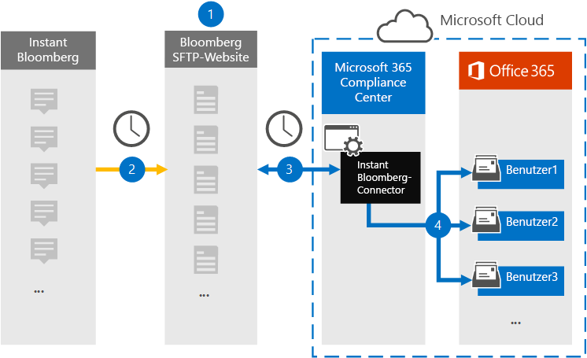
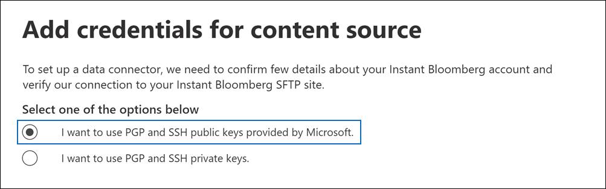

# Einrichten eines Connectors zum Archivieren von Instant Bloomberg-Daten

Verwenden Sie einen systemeigenen Connector im Microsoft 365 Compliance Center zum Importieren und Archivieren von Chatdaten für Finanzdienste aus dem [Instant Bloomberg-Tool](https://www.bloomberg.com/professional/product/collaboration/) für die Zusammenarbeit. Nachdem Sie einen Connector eingerichtet und konfiguriert haben, stellt er einmal täglich eine Verbindung mit der Bloomberg Secure FTP Site (SFTP) Ihrer Organisation sicher, konvertiert den Inhalt von Chatnachrichten in ein E-Mail-Nachrichtenformat und importiert diese Elemente dann in Postfächer in Microsoft 365.

Nachdem Instant Bloomberg-Daten in Benutzerpostfächern gespeichert wurden, können Sie Microsoft 365 Compliancefeatures wie z. B. Rechtsstreitigkeiten, Inhaltssuche, In-Place-Archivierung, Überwachung, Kommunikationskonformität und Microsoft 365-Aufbewahrungsrichtlinien auf Instant Bloomberg-Daten anwenden. Sie können z. B. Chatnachrichten von Instant Bloomberg mithilfe der Inhaltssuche durchsuchen oder das Postfach, das die Instant Bloomberg-Daten enthält, einem Verwahrer in einem Advanced eDiscovery zuordnen. Die Verwendung eines Instant Bloomberg-Connectors zum Importieren und Archivieren von Daten in Microsoft 365 Kann Dazu beitragen, dass Ihre Organisation mit den richtlinienkonformen Richtlinien von Behörden und Behörden konform ist.

## Übersicht über die Archivierung von Instant Bloomberg-Daten

In der folgenden Übersicht wird der Prozess der Verwendung eines Connectors zum Archivieren von Instant Bloomberg-Chatdaten in Microsoft 365. 

1. Ihre Organisation arbeitet mit Bloomberg zusammen, um eine Bloomberg-SFTP-Website zu einrichten. Sie arbeiten auch mit Bloomberg zusammen, um Instant Bloomberg so zu konfigurieren, dass Chatnachrichten auf Ihre Bloomberg SFTP-Website kopiert werden.

2. Einmal alle 24 Stunden werden Chatnachrichten von Instant Bloomberg auf die Bloomberg SFTP-Website kopiert.

3. Der Instant Bloomberg-Connector, den Sie im Microsoft 365 Compliance Center erstellen, stellt täglich eine Verbindung mit der Bloomberg -SFTP-Website sicher und überträgt die Chatnachrichten aus den vorherigen 24 Stunden an einen sicheren Azure Storage-Bereich in der Microsoft Cloud. Der Connector konvertiert auch den Inhalt einer Chat-Chat-Chats in ein E-Mail-Nachrichtenformat.

4. Der Connector importiert die Chatnachrichtenelemente in das Postfach eines bestimmten Benutzers. Im Postfach des jeweiligen Benutzers wird ein neuer Ordner namens InstantBloomberg erstellt, in den die Elemente importiert werden. Der Connector verwendet dazu den Wert der *CorporateEmailAddress-Eigenschaft.* Jede Chatnachricht enthält diese Eigenschaft, die mit der E-Mail-Adresse jedes Teilnehmers der Chatnachricht gefüllt wird. Neben der automatischen Benutzerzuordnung mithilfe des Werts der *CorporateEmailAddress-Eigenschaft* können Sie auch eine benutzerdefinierte Zuordnung definieren, indem Sie eine CSV-Zuordnungsdatei hochladen. Diese Zuordnungsdatei sollte eine Bloomberg-UUID und die Microsoft 365 postfachadresse für jeden Benutzer enthalten. Wenn Sie die automatische Benutzerzuordnung aktivieren und eine benutzerdefinierte Zuordnung bereitstellen, wird der Connector für jedes Chatelement zunächst die Datei mit der benutzerdefinierten Zuordnung betrachten. Wenn kein gültiger Benutzer Microsoft 365, der der Bloomberg-UUID eines Benutzers entspricht, verwendet der Connector die *CorporateEmailAddress-Eigenschaft* des Chatelements. Wenn der Connector keinen gültigen Microsoft 365 in der benutzerdefinierten Zuordnungsdatei oder der *CorporateEmailAddress-Eigenschaft* des Chatelements findet, wird das Element nicht importiert.

## Vor dem Einrichten eines Connectors

Einige der Implementierungsschritte, die zum Archivieren von Instant Bloomberg-Daten erforderlich sind, sind außerhalb von Microsoft 365 und müssen abgeschlossen werden, bevor Sie den Connector im Compliance Center erstellen können.

- Zum Einrichten eines Instant Bloomberg-Connectors müssen Sie Schlüssel und Schlüsselpassphrasen für Pretty Good Privacy (PGP) und Secure Shell (SSH) verwenden. Diese Schlüssel werden verwendet, um die Bloomberg-SFTP-Website zu konfigurieren und vom Connector zum Herstellen einer Verbindung mit der Bloomberg-SFTP-Website zum Importieren von Daten in Microsoft 365. Der PGP-Schlüssel wird verwendet, um die Verschlüsselung von Daten zu konfigurieren, die von der Bloomberg -SFTP-Website an Microsoft 365. Der SSH-Schlüssel wird verwendet, um eine sichere Shell zu konfigurieren, um eine sichere Remoteanmeldung zu ermöglichen, wenn der Connector eine Verbindung mit dem Bloomberg SFTP-Standort herstellt.

  Beim Einrichten eines Connectors haben Sie die Möglichkeit, von Microsoft bereitgestellte öffentliche Schlüssel und Schlüsselpassphrasen zu verwenden, oder Sie können eigene private Schlüssel und Passphrasen verwenden. Es wird empfohlen, die von Microsoft bereitgestellten öffentlichen Schlüssel zu verwenden. Wenn Ihre Organisation jedoch bereits eine Bloomberg -SFTP-Website mit privaten Schlüsseln konfiguriert hat, können Sie einen Connector mit diesen privaten Schlüsseln erstellen.

- Abonnieren Sie [Bloomberg Anywhere](https://www.bloomberg.com/professional/product/remote-access/?bbgsum-page=DG-WS-PROF-PROD-BBA). Dies ist erforderlich, damit Sie sich bei Bloomberg Anywhere anmelden können, um auf die Bloomberg SFTP-Website zu zugreifen, die Sie einrichten und konfigurieren müssen.

- Richten Sie eine Bloomberg SFTP (Secure File Transfer Protocol)-Website ein. Nach der Zusammenarbeit mit Bloomberg zum Einrichten der SFTP-Website werden die Daten von Instant Bloomberg täglich auf die SFTP-Website hochgeladen. Der connector, den Sie in Schritt 2 erstellen, stellt eine Verbindung mit dieser SFTP-Website und überträgt die Chatdaten an Microsoft 365 Postfächer. SFTP verschlüsselt auch die Chatdaten von Instant Bloomberg, die während des Übertragungsprozesses an Postfächer gesendet werden.

  Weitere Informationen zu Bloomberg SFTP (auch *BB-SFTP genannt):*

  - Weitere Informationen finden Sie im Dokument "SFTP Connectivity Standards" unter [Bloomberg Support](https://www.bloomberg.com/professional/support/documentation/).

  - Wenden [Sie sich an den Bloomberg-Kundensupport](https://service.bloomberg.com/portal/sessions/new?utm_source=bloomberg-menu&utm_medium=csc).

  Nachdem Sie mit Bloomberg eine SFTP-Website eingerichtet haben, stellt Bloomberg Ihnen einige Informationen zur Verfügung, nachdem Sie auf die Bloomberg-Implementierungs-E-Mail-Nachricht antworten. Speichern Sie eine Kopie der folgenden Informationen. Verwenden Sie ihn zum Einrichten eines Connectors in Schritt 3.

  - Firmencode, der eine ID für Ihre Organisation ist und zur Anmeldung bei der Bloomberg SFTP-Website verwendet wird.

  - Kennwort für Ihre Bloomberg SFTP-Website

  - URL für Bloomberg SFTP-Website (z. B. sftp.bloomberg.com)

  - Portnummer für Bloomberg SFTP-Website

- Der Instant Bloomberg-Connector kann insgesamt 200.000 Elemente an einem einzigen Tag importieren. Wenn mehr als 200.000 Elemente auf der SFTP-Website vorhanden sind, wird keines dieser Elemente in Microsoft 365.

- Dem Benutzer, der in Schritt 3 einen Instant Bloomberg-Connector erstellt (und der die öffentlichen Schlüssel und die IP-Adresse in Schritt 1 herunterlädt), muss die Rolle Postfachimportexport in Exchange Online. Dies ist erforderlich, um Connectors auf der Seite **Datenconnectors** im compliance center Microsoft 365 hinzufügen. Standardmäßig ist diese Rolle keiner Rollengruppe in Exchange Online zugewiesen. Sie können die Rolle Postfachimportexport zur Rollengruppe Organisationsverwaltung in der Exchange Online. Sie können auch eine Rollengruppe erstellen, die Rolle Postfachimportexport zuweisen und dann die entsprechenden Benutzer als Mitglieder hinzufügen. Weitere Informationen finden Sie in den Abschnitten [Erstellen](/Exchange/permissions-exo/role-groups#create-role-groups) von Rollengruppen oder [Ändern](/Exchange/permissions-exo/role-groups#modify-role-groups) von Rollengruppen im Artikel "Verwalten von Rollengruppen in Exchange Online".

## Einrichten eines Connectors mithilfe öffentlicher Schlüssel

Die Schritte in diesem Abschnitt zeigen, wie Sie einen Instant Bloomberg-Connector mithilfe der öffentlichen Schlüssel für Pretty Good Privacy (PGP) und Secure Shell (SSH) einrichten.

### Schritt 1: Abrufen von PGP und SSH und öffentlichen Schlüsseln

Der erste Schritt besteht im Abrufen einer Kopie der öffentlichen Schlüssel für Pretty Good Privacy (PGP) und Secure Shell (SSH). Sie verwenden diese Schlüssel in Schritt 2, um die Bloomberg-SFTP-Website so zu konfigurieren, dass der Connector (den Sie in Schritt 3 erstellen) eine Verbindung mit der SFTP-Website herstellen und die Chatdaten von Instant Bloomberg an Microsoft 365 übertragen. In diesem Schritt erhalten Sie auch eine IP-Adresse, die Sie beim Konfigurieren der Bloomberg SFTP-Website verwenden.

1. Wechseln Sie <https://compliance.microsoft.com> zu, und klicken Sie **im** linken Navigations navi auf Datenconnectors.

2. Klicken Sie **auf der** Seite Datenconnectors unter **Instant Bloomberg** auf **Ansicht**.

3. Klicken Sie **auf der Seite Instant Bloomberg-Produktbeschreibung** auf Connector **hinzufügen.**

4. Klicken Sie **auf der Seite Nutzungsbedingungen** auf **Akzeptieren**.

5. Klicken Sie **auf der Seite Anmeldeinformationen** für Inhaltsquelle hinzufügen auf Ich möchte öffentliche PGP- und SSH-Schlüssel von **Microsoft verwenden.**

   

6. Klicken Sie unter Schritt 1 auf die Schaltfläche **SSH** herunterladen, **PGP-Schlüssel** herunterladen und IP-Adresslinks herunterladen, um eine Kopie jeder Datei auf Ihrem lokalen Computer zu speichern. 

   

   Diese Dateien enthalten die folgenden Elemente, die zum Konfigurieren der Bloomberg -SFTP-Website in Schritt 2 verwendet werden:

   - Öffentlicher PGP-Schlüssel: Dieser Schlüssel wird verwendet, um die Verschlüsselung von Daten zu konfigurieren, die von der Bloomberg -SFTP-Website an die Microsoft 365.

   - Öffentlicher SSH-Schlüssel: Dieser Schlüssel wird verwendet, um eine sichere Shell zu konfigurieren, um eine sichere Remoteanmeldung zu ermöglichen, wenn der Connector eine Verbindung mit dem Bloomberg SFTP-Standort herstellt.

   - IP-Adresse: Die Bloomberg-SFTP-Website ist so konfiguriert, dass Verbindungsanforderungen von dieser IP-Adresse akzeptiert werden. Dieselbe IP-Adresse wird vom Instant Bloomberg-Connector verwendet, um eine Verbindung mit dem SFTP-Standort herzustellen und Instant Bloomberg-Daten an die Microsoft 365.

7. Klicken **Sie auf Abbrechen,** um den Assistenten zu schließen. Sie kommen in Schritt 3 zu diesem Assistenten zurück, um den Connector zu erstellen.

### Schritt 2: Konfigurieren der Bloomberg SFTP-Website

Im nächsten Schritt verwenden Sie die öffentlichen PGP- und SSH-Schlüssel sowie die in Schritt 1 erhaltene IP-Adresse, um die PGP-Verschlüsselung und die SSH-Authentifizierung für den Bloomberg SFTP-Standort zu konfigurieren. Dadurch kann der in Schritt 3 erstellte Instant Bloomberg-Connector eine Verbindung mit der Bloomberg -SFTP-Website herstellen und Instant Bloomberg-Daten an Microsoft 365. Sie müssen mit dem Bloomberg-Kundensupport zusammenarbeiten, um Ihre Bloomberg SFTP-Website einrichten zu können. Wenden [Sie sich an den Bloomberg-Kundensupport,](https://service.bloomberg.com/portal/sessions/new?utm_source=bloomberg-menu&utm_medium=csc) um Unterstützung zu erhalten. 

> [!IMPORTANT]
> Bloomberg empfiehlt, die drei Dateien, die Sie in Schritt 1 heruntergeladen haben, an eine E-Mail-Nachricht anfügen und diese an das Kundensupportteam zu senden, wenn Sie mit ihnen zusammenarbeiten, um Ihre Bloomberg -SFTP-Website einrichten.

### Schritt 3: Erstellen eines Instant Bloomberg-Connectors

Der letzte Schritt besteht im Erstellen eines Instant Bloomberg-Connectors im Microsoft 365 Compliance Center. Der Connector verwendet die informationen, die Sie bereitstellen, um eine Verbindung mit der Bloomberg -SFTP-Website herzustellen und Chatnachrichten an die entsprechenden Benutzerpostfächer in Microsoft 365.

1. Wechseln Sie <https://compliance.microsoft.com> zu, und klicken Sie dann auf **Datenconnectors**  >  **Instant Bloomberg**.

2. Klicken Sie **auf der Seite Instant Bloomberg-Produktbeschreibung** auf Connector **hinzufügen.**

3. Klicken Sie **auf der Seite Nutzungsbedingungen** auf **Akzeptieren**.

4. Geben Sie auf der Seite Anmeldeinformationen für **Bloomberg SFTP-Website** hinzufügen unter Schritt 3 die erforderlichen Informationen in die folgenden Felder ein, und klicken Sie dann auf **Weiter**.

    - **Firmencode:** Die ID für Ihre Organisation, die als Benutzername für die Bloomberg SFTP-Website verwendet wird.

    - **Kennwort:** Kennwort für bloomberg SFTP-Website.

    - **SFTP-URL:** Die URL für bloomberg SFTP-Website (z. B. `sftp.bloomberg.com` ). Sie können auch eine IP-Adresse für diesen Wert verwenden.

    - **SFTP-Port:** Die Portnummer für den Bloomberg SFTP-Standort. Der Connector verwendet diesen Port, um eine Verbindung mit dem SFTP-Standort herzustellen.

5. Wählen Sie auf der Seite Zu **importierende** Datentypen auswählen die erforderlichen Datentypen aus, die neben Nachrichten importiert werden **sollen.**

6. Aktivieren Sie auf der Seite Sofort **bloomberg-Benutzer Microsoft 365** Benutzer zuordnen die automatische Benutzerzuordnung und stellen Sie bei Bedarf benutzerdefinierte Benutzerzuordnungen zur Verfügung.

   > [!NOTE]
   > Der Connector importiert die Chatnachrichtenelemente in das Postfach eines bestimmten Benutzers. Im Postfach des jeweiligen Benutzers wird ein neuer Ordner namens **InstantBloomberg** erstellt, in den die Elemente importiert werden. Der Connector verwendet den Wert der *CorporateEmailAddress-Eigenschaft.* Jede Chatnachricht enthält diese Eigenschaft, und die Eigenschaft wird mit der E-Mail-Adresse jedes Teilnehmers der Chatnachricht gefüllt. Neben der automatischen Benutzerzuordnung mithilfe des Werts der *CorporateEmailAddress-Eigenschaft* können Sie auch benutzerdefinierte Zuordnungen definieren, indem Sie eine CSV-Zuordnungsdatei hochladen. Die Zuordnungsdatei sollte die Bloomberg-UUID und die Microsoft 365 postfachadresse für jeden Benutzer enthalten. Wenn Sie die automatische Benutzerzuordnung aktivieren und eine benutzerdefinierte Zuordnung bereitstellen, wird für jedes Chatelement zunächst die benutzerdefinierte Zuordnungsdatei vom Connector angezeigt. Wenn kein gültiger Benutzer Microsoft 365, der der Bloomberg-UUID eines Benutzers entspricht, verwendet der Connector die *CorporateEmailAddress-Eigenschaft* des Chatelements. Wenn der Connector keinen gültigen benutzer Microsoft 365 in der benutzerdefinierten Zuordnungsdatei oder der *CorporateEmailAddress-Eigenschaft* des Chatelements findet, wird das Element nicht importiert.

7. Klicken **Sie auf Weiter,** überprüfen Sie Ihre Einstellungen, und klicken Sie dann auf **Fertig stellen,** um den Connector zu erstellen.

8. Wechseln Sie zur **Seite Datenconnectors,** um den Fortschritt des Importvorgangs für den neuen Connector zu sehen. Klicken Sie auf den Connector, um die Flyoutseite mit Informationen zum Connector angezeigt zu werden.

## Einrichten eines Connectors mithilfe privater Schlüssel

Die Schritte in diesem Abschnitt zeigen, wie Sie einen Instant Bloomberg-Connector mithilfe von privaten PGP- und SSH-Schlüsseln einrichten. Diese Connectoreinrichtungsoption ist für Organisationen vorgesehen, die bereits eine Bloomberg-SFTP-Website mithilfe privater Schlüssel konfiguriert haben.

### Schritt 1: Abrufen einer IP-Adresse zum Konfigurieren der Bloomberg-SFTP-Website

> [!NOTE]
> Wenn Ihre Organisation zuvor eine Bloomberg-SFTP-Website zum Archivieren von Bloomberg-Nachrichtendaten mit privaten PGP- und SSH-Schlüsseln konfiguriert hat, müssen Sie keine weitere konfigurieren. Sie können dieselbe SFTP-Website angeben, wenn Sie den Connector in Schritt 2 erstellen.

Wenn Ihre Organisation private PGP- und SSH-Schlüssel zum Einrichten einer Bloomberg -SFTP-Website verwendet hat, müssen Sie eine IP-Adresse abrufen und sie dem Bloomberg-Kundensupport bereitstellen. Die Bloomberg -SFTP-Website muss so konfiguriert sein, dass Verbindungsanforderungen von dieser IP-Adresse akzeptiert werden. Dieselbe IP-Adresse wird vom Instant Bloomberg-Connector verwendet, um eine Verbindung mit dem SFTP-Standort herzustellen und Instant Bloomberg-Daten an die Microsoft 365.

So rufen Sie die IP-Adresse ab:

1. Wechseln Sie <https://compliance.microsoft.com> zu, und klicken Sie **im** linken Navigations navi auf Datenconnectors.

2. Klicken Sie **auf der** Seite Datenconnectors unter **Instant Bloomberg** auf **Ansicht**.

3. Klicken Sie **auf der Seite Instant Bloomberg-Produktbeschreibung** auf Connector **hinzufügen.**

4. Klicken Sie **auf der Seite Nutzungsbedingungen** auf **Akzeptieren**.

5. Klicken Sie **auf der Seite Anmeldeinformationen** für Inhaltsquelle hinzufügen auf Ich möchte private PGP- und **SSH-Schlüssel verwenden.**

6. Klicken Sie unter Schritt 1 auf **IP-Adresse herunterladen,** um eine Kopie der IP-Adressdatei auf Ihrem lokalen Computer zu speichern.

   

7. Klicken **Sie auf Abbrechen,** um den Assistenten zu schließen. Sie kommen in Schritt 2 zu diesem Assistenten zurück, um den Connector zu erstellen.

Sie müssen mit dem Bloomberg-Kundensupport zusammenarbeiten, um Ihre Bloomberg -SFTP-Website so zu konfigurieren, dass Verbindungsanforderungen von dieser IP-Adresse akzeptiert werden. Wenden [Sie sich an den Bloomberg-Kundensupport,](https://service.bloomberg.com/portal/sessions/new?utm_source=bloomberg-menu&utm_medium=csc) um Unterstützung zu erhalten.

### Schritt 2: Erstellen eines Instant Bloomberg-Connectors

Nachdem Ihre Bloomberg -SFTP-Website konfiguriert wurde, besteht der nächste Schritt in der Erstellung eines Instant Bloomberg-Connectors im Microsoft 365 Compliance Center. Der Connector verwendet die informationen, die Sie bereitstellen, um eine Verbindung mit der Bloomberg -SFTP-Website herzustellen und E-Mail-Nachrichten an die entsprechenden Benutzerpostfächer in Microsoft 365. Stellen Sie zum Abschließen dieses Schritts sicher, dass Kopien derselben privaten Schlüssel und Schlüsselpassphrasen vorhanden sind, die Sie zum Einrichten Ihrer Bloomberg-SFTP-Website verwendet haben.

1. Wechseln Sie <https://compliance.microsoft.com> zu, und klicken Sie **im** linken Navigations navi auf Datenconnectors.

2. Klicken Sie **auf der** Seite Datenconnectors unter **Instant Bloomberg** auf **Ansicht**.

3. Klicken Sie **auf der Seite Instant Bloomberg-Produktbeschreibung** auf Connector **hinzufügen.**

4. Klicken Sie **auf der Seite Nutzungsbedingungen** auf **Akzeptieren**.

5. Klicken Sie **auf der Seite Anmeldeinformationen** für Inhaltsquelle hinzufügen auf Ich möchte private PGP- und **SSH-Schlüssel verwenden.**

   

6. Geben Sie unter Schritt 3 die erforderlichen Informationen in die folgenden Felder ein, und klicken Sie dann **auf Verbindung überprüfen.**

      - **Name:** Der Name für den Connector. Sie muss in Ihrer Organisation eindeutig sein.

      - **Firmencode:** Die ID für Ihre Organisation, die als Benutzername für die Bloomberg SFTP-Website verwendet wird.

      - **Kennwort:** Das Kennwort für die Bloomberg-SFTP-Website Ihrer Organisation.

      - **SFTP-URL:** Die URL für die Bloomberg-SFTP-Website (z. B. `sftp.bloomberg.com` ). Sie können auch eine IP-Adresse für diesen Wert verwenden.

      - **SFTP-Port:** Die Portnummer für den Bloomberg SFTP-Standort. Der Connector verwendet diesen Port, um eine Verbindung mit dem SFTP-Standort herzustellen.

      - **Privater PGP-Schlüssel:** Der private PGP-Schlüssel für die Bloomberg-SFTP-Website. Achten Sie darauf, den gesamten privaten Schlüsselwert, einschließlich der Anfangs- und Endzeilen des Schlüsselblocks, zu enthalten.

      - **PGP-Schlüsselpassphrase:** Die Passphrase für den privaten PGP-Schlüssel.

      - **Privater SSH-Schlüssel:** Der private SSH-Schlüssel für die Bloomberg-SFTP-Website. Achten Sie darauf, den gesamten privaten Schlüsselwert, einschließlich der Anfangs- und Endzeilen des Schlüsselblocks, zu enthalten.

      - **SSH-Schlüsselpassphrase:** Die Passphrase für den privaten SSH-Schlüssel.

7. Nachdem die Verbindung erfolgreich überprüft wurde, klicken Sie auf **Weiter**.

8. Aktivieren Sie auf der Seite Sofort **bloomberg-Benutzer Microsoft 365** Benutzer zuordnen die automatische Benutzerzuordnung und stellen Sie bei Bedarf eine benutzerdefinierte Benutzerzuordnung zur Verfügung.

   > [!NOTE]
   > Der Connector importiert die Chatnachrichtenelemente in das Postfach eines bestimmten Benutzers. Im Postfach des jeweiligen Benutzers wird ein neuer Ordner namens **InstantBloomberg** erstellt, in den die Elemente importiert werden. Der Connector verwendet den Wert der *CorporateEmailAddress-Eigenschaft.* Jede Chatnachricht enthält diese Eigenschaft, und die Eigenschaft wird mit der E-Mail-Adresse jedes Teilnehmers der Chatnachricht gefüllt. Neben der automatischen Benutzerzuordnung mithilfe des Werts der *CorporateEmailAddress-Eigenschaft* können Sie auch benutzerdefinierte Zuordnungen definieren, indem Sie eine CSV-Zuordnungsdatei hochladen. Die Zuordnungsdatei sollte die Bloomberg-UUID und die Microsoft 365 postfachadresse für jeden Benutzer enthalten. Wenn Sie die automatische Benutzerzuordnung aktivieren und eine benutzerdefinierte Zuordnung bereitstellen, wird für jedes Chatelement zunächst die benutzerdefinierte Zuordnungsdatei vom Connector angezeigt. Wenn kein gültiger Benutzer Microsoft 365, der der Bloomberg-UUID eines Benutzers entspricht, verwendet der Connector die *CorporateEmailAddress-Eigenschaft* des Chatelements. Wenn der Connector keinen gültigen benutzer Microsoft 365 in der benutzerdefinierten Zuordnungsdatei oder der *CorporateEmailAddress-Eigenschaft* des Chatelements findet, wird das Element nicht importiert.

9. Klicken **Sie auf Weiter,** überprüfen Sie Ihre Einstellungen, und klicken Sie dann auf **Fertig stellen,** um den Connector zu erstellen.

10. Wechseln Sie zur **Seite Datenconnectors,** um den Fortschritt des Importvorgangs für den neuen Connector zu sehen. Klicken Sie auf den Connector, um die Flyoutseite mit Informationen zum Connector angezeigt zu werden.
