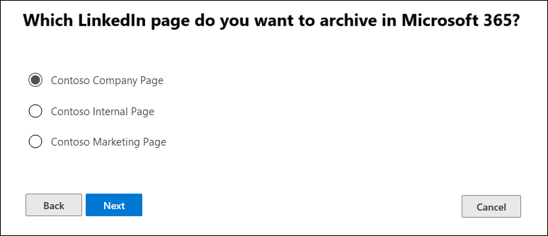

# Einrichten eines Connectors zum Archivieren von LinkedIn-DatenSet up a connector to archive LinkedIn data

Verwenden Sie einen Connector im Microsoft 365 Compliance Center, um Daten aus LinkedIn Unternehmensseiten zu importieren und zu archivieren.Use a connector in the Microsoft 365 compliance center to import and archive data from LinkedIn Company pages. Nachdem Sie einen Connector eingerichtet und konfiguriert haben, wird er alle 24 Stunden mit dem Konto für die bestimmte Seite des LinkedIn Unternehmens verbunden.After you set up and configure a connector, it connects to the account for the specific LinkedIn Company page once every 24 hours. Der Connector konvertiert die Nachrichten, die auf die Unternehmensseite gesendet werden, in eine e-Mail-Nachricht und importiert diese Elemente dann in ein Postfach in Microsoft 365.The connector converts the messages posted to the Company page to an email message, and then imports those items to a mailbox in Microsoft 365.

Nachdem die Daten der LinkedIn Unternehmensseite in einem Postfach gespeichert wurden, können Sie Microsoft 365-Kompatibilitätsfeatures wie Beweissicherungsverfahren, Inhaltssuche, in-situ-Archivierung, Überwachung und Microsoft 365-Aufbewahrungsrichtlinien auf LinkedIn-Daten anwenden.After the LinkedIn Company page data is stored in a mailbox, you can apply Microsoft 365 compliance features such as Litigation Hold, Content Search, In-Place Archiving, Auditing, and Microsoft 365 retention policies to LinkedIn data. Sie können beispielsweise mithilfe der Inhaltssuche nach diesen Elementen suchen oder das Speicher Postfach einer Depotbank in einem erweiterten eDiscovery-Fall zuordnen.For example, you can search for these items using Content Search or associate the storage mailbox with a custodian in an Advanced eDiscovery case. Das Erstellen eines Connectors zum Importieren und Archivieren von LinkedIn Daten in Microsoft 365 kann dazu beitragen, dass Ihre Organisation mit behördlichen und behördlichen Richtlinien konform bleibt.Creating a connector to import and archive LinkedIn data in Microsoft 365 can help your organization stay compliant with government and regulatory policies.

## Bevor Sie beginnenBefore you  begin

- Ihre Organisation muss einwilligen, dass der Office 365 Import Dienst auf Postfachdaten in Ihrer Organisation zugreifen kann.Your organization must consent to allow the Office 365 Import service to access mailbox data in your organization. Um dieser Anforderung zuzustimmen, gehen Sie zu [dieser Seite](https://login.microsoftonline.com/common/oauth2/authorize?client_id=570d0bec-d001-4c4e-985e-3ab17fdc3073&response_type=code&redirect_uri=https://portal.azure.com/&nonce=1234&prompt=admin_consent), melden Sie sich mit den Anmeldeinformationen eines globalen Administrators von Microsoft 365 an, und nehmen Sie dann die Anforderung an.To consent to this request, go to [this page](https://login.microsoftonline.com/common/oauth2/authorize?client_id=570d0bec-d001-4c4e-985e-3ab17fdc3073&response_type=code&redirect_uri=https://portal.azure.com/&nonce=1234&prompt=admin_consent), sign in with the credentials of an Microsoft 365 global admin, and then accept the request.

- Dem Benutzer, der einen Unternehmensseiten-Konnektor für LinkedIn erstellt, muss in Exchange Online die Rolle "Post Fach Import/-Export" zugewiesen sein.The user who creates a LinkedIn Company Page connector must be assigned the Mailbox Import Export role in Exchange Online. Dies ist für das Hinzufügen von Connectors auf der Seite " **Daten Konnektoren** " im Microsoft 365 Compliance Center erforderlich.This is required to add connectors in the **Data connectors** page in the Microsoft 365 compliance center. Standardmäßig ist diese Rolle keiner Rollengruppe in Exchange Online zugewiesen.By default, this role isn't assigned to any role group in Exchange Online. Sie können die Rolle "Post Fach Import exportieren" der Rollengruppe "Organisationsverwaltung" in Exchange Online hinzufügen.You can add the Mailbox Import Export role to the Organization Management role group in Exchange Online. Sie können auch eine Rollengruppe erstellen, die Rolle "Post Fach Import Export" zuweisen und dann die entsprechenden Benutzer als Mitglieder hinzufügen.Or you can create a role group, assign the Mailbox Import Export role, and then add the appropriate users as members. Weitere Informationen finden Sie im Abschnitt [Erstellen](https://docs.microsoft.com/Exchange/permissions-exo/role-groups#create-role-groups) von Rollengruppen oder [Ändern von Rollengruppen](https://docs.microsoft.com/Exchange/permissions-exo/role-groups#modify-role-groups) im Artikel "Verwalten von Rollengruppen in Exchange Online".For more information, see the [Create role groups](https://docs.microsoft.com/Exchange/permissions-exo/role-groups#create-role-groups) or [Modify role groups](https://docs.microsoft.com/Exchange/permissions-exo/role-groups#modify-role-groups) sections in the article "Manage role groups in Exchange Online".

- Sie müssen über die Anmeldeinformationen (e-Mail-Adresse oder Telefonnummer und das Kennwort) eines LinkedIn-Benutzerkontos verfügen, das ein Administratorkonto für die Seite LinkedIn Company ist, die Sie archivieren möchten.You must have the sign-in credentials (email address or phone number and password) of a LinkedIn user account that is an admin for the LinkedIn Company Page that you want to archive. Sie verwenden diese Anmeldeinformationen, um sich beim Einrichten des Connectors bei LinkedIn anzumelden.You use these credentials to sign in to LinkedIn when setting up the connector.

## Erstellen eines LinkedIn ConnectorsCreate a LinkedIn connector

1. Wechseln Sie <https://compliance.microsoft.com> zu, und klicken Sie dann auf **Daten Konnektoren** > **LinkedIn Unternehmensseiten**.Go to <https://compliance.microsoft.com> and then click **Data connectors** > **LinkedIn Company pages**.

2. Klicken Sie auf der Produktseite des **LinkedIn Unternehmensseiten** auf **Connector hinzufügen**.On the **LinkedIn company pages** product page, click **Add connector**.

3. Wählen Sie auf der Seite **Nutzungsbedingungen** die Option **akzeptieren**aus.On the **Terms of service** page, select **Accept**.

4. Klicken Sie auf der Seite **mit LinkedIn anmelden** auf **mit LinkedIn anmelden**.On the **Sign in with LinkedIn** page, click **Sign in with LinkedIn**.

   Die LinkedIn-Anmeldeseite wird angezeigt.The LinkedIn sign in page is displayed.

   

5. Geben Sie auf der Seite LinkedIn anmelden die e-Mail-Adresse (oder Telefonnummer) und das Kennwort für das LinkedIn-Konto ein, das der Unternehmensseite zugeordnet ist, die Sie archivieren möchten, und klicken Sie dann auf **Anmelden**.On the LinkedIn sign in page, enter the email address (or phone number) and password for the LinkedIn account associated with the company page that you want to archive, and then click **Sign in**.

   Eine Assistentenseite wird mit einer Liste aller LinkedIn Unternehmensseiten angezeigt, die dem Konto zugeordnet sind, mit dem Sie sich angemeldet haben.A wizard page is displayed with a list of all LinkedIn Company Pages associated with the account that you signed in to. Ein Connector kann nur für eine Unternehmensseite konfiguriert werden.A connector can only be configured for one company page. Wenn Ihre Organisation über mehrere LinkedIn Unternehmensseiten verfügt, müssen Sie für jeden eine Verbindung erstellen.If your organization has multiple LinkedIn Company Pages, you have to create a connector for each one.

   

6. Wählen Sie die Unternehmensseite aus, von der Sie Elemente archivieren möchten, und klicken Sie dann auf **weiter**.Select the company page that you want to archive items from, and then click **Next**.

7. Auf der Seite **Filter festlegen** können Sie einen Filter anwenden, um Elemente anfänglich zu importieren, die ein bestimmtes Alter aufweisen.On the **Set filters** page, you can apply a filter to initially import items that are a certain age. Wählen Sie ein Alter aus, und klicken Sie dann auf **weiter**.Select an age, and then click **Next**.

8. Klicken Sie auf der Seite Speicherort **auswählen** auf in das Feld, wählen Sie die e-Mail-Adresse eines Microsoft 365-Postfachs aus, in das die LinkedIn Elemente importiert werden sollen, und klicken Sie dann auf **weiter**.On the **Choose storage location** page, click in the box, select the email address of an Microsoft 365 mailbox that the LinkedIn items will be imported to, and then click **Next**. Elemente werden in den Ordner Posteingang in diesem Postfach importiert.Items are imported to the inbox folder in this mailbox.

9. Klicken Sie im die **Zustimmung des Administrators bereit**stellen auf **Zustimmung erteilen** , und führen Sie dann die Schritte aus.On the **Provide admin consent**, click **Provide consent** and then follow the steps. Sie müssen ein globaler Administrator sein, um die Zustimmung des Office 365-Import Diensts für den Zugriff auf Daten in Ihrer Organisation zu geben.You must be a global admin to provide consent for the Office 365 Import service to access data in your organization.

10. Klicken Sie auf **weiter** , um die Connectoreinstellungen zu überprüfen, und klicken Sie dann auf **Fertig stellen** , um das Connector-Setup abzuschließen.Click **Next** to review the connector settings and then click **Finish** to complete the connector setup.

Nachdem Sie den Connector erstellt haben, können Sie zur Seite **Daten Konnektoren** zurückkehren, um den Fortschritt des Importvorgangs für den neuen Connector anzuzeigen (Wählen Sie bei Bedarf **Aktualisieren** aus, um die Liste der Connectors zu aktualisieren).After you create the connector, you can go back to the **Data connectors** page to see the progress of the import process for the new connector (select **Refresh** if necessary to update the list of connectors). Der Wert in der Spalte **Status** **wartet auf den Start**.The value in the **Status** column is **Waiting to start**. Es dauert bis zu 24 Stunden, bis der erste Importvorgang gestartet wurde.It takes up to 24 hours for the initial import process to be started. Nachdem der Connector zum ersten Mal ausgeführt und die LinkedIn-Elemente importiert hat, wird der Connector alle 24 Stunden ausgeführt und importiert alle neuen Elemente, die in den vorherigen 24 Stunden auf der Seite "LinkedIn Company" erstellt wurden.After the first time the connector runs and imports the LinkedIn items, the connector will run once every 24 hours and import any new items that are created on the LinkedIn Company Page in the previous 24 hours.

Um weitere Details anzuzeigen, wählen Sie den Konnektor in der Liste auf der Seite **Daten Konnektoren** aus, um die Flyout-Seite anzuzeigen.To view more details, select the connector in the list on the **Data connectors** page to display the flyout page. Unter **Status**gibt der angezeigte Datumsbereich den Altersfilter an, der beim Erstellen des Konnektors ausgewählt wurde.Under **Status**, the date range that's displayed indicates the age filter that was selected when the connector was created. 

## Weitere InformationenMore information

LinkedIn-Elemente werden in den Unterordner LinkedIn im Posteingang des Speicher Postfachs in Microsoft 365 importiert.LinkedIn items are imported to the LinkedIn subfolder in the inbox of the storage mailbox in Microsoft 365. Sie werden als e-Mail-Nachrichten angezeigt.They appear as email messages.
