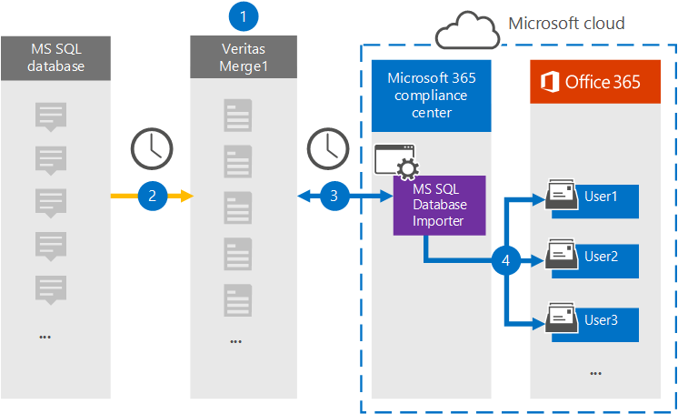

# Einrichten eines Connectors zum Archivieren von Daten aus ms SQL Database

Verwenden Sie einen Kugelnnetzconnector im Microsoft 365 Compliance Center, um Daten aus MS SQL Database in Benutzerpostfächer in Ihrer Microsoft 365-Organisation zu importieren und zu archivieren. Mit Einem MS SQL Database Importer Connector, der so konfiguriert ist, dass Elemente aus einer Datenbank mithilfe einer XML-Konfigurationsdatei erfasst und in Microsoft 365 importiert werden, bietet Ihnen Das Programm einen MS-SQL-Datenbankimportconnector. Der Connector konvertiert Inhalte aus MS SQL Database in ein E-Mail-Nachrichtenformat und importiert diese Elemente dann in Benutzerpostfächer in Microsoft 365.

Nachdem Inhalte aus MS SQL in Benutzerpostfächern gespeichert wurden, können Sie Microsoft 365-Compliancefeatures wie z. B. Litigation Hold, eDiscovery, Aufbewahrungsrichtlinien und Aufbewahrungsbezeichnungen anwenden. Die Verwendung eines MS SQL-Datenbankconnector zum Importieren und Archivieren von Daten in Microsoft 365 kann Dazu beitragen, dass Ihre Organisation den richtlinienkonformen Richtlinien von Behörden und Behörden entspricht.

## Übersicht über die Archivierung der SQL Ms

In der folgenden Übersicht wird der Prozess der Verwendung eines Connectors zum Archivieren von MS-SQL in Microsoft 365 erläutert.

1. Ihre Organisation arbeitet mit einem Ms SQL-Datenbankanbieter zusammen, um eine MS SQL datenbankwebsite zu einrichten und zu konfigurieren.

2. Alle 24 Stunden werden ms SQL Datenbankelemente auf die Website "GlobeNet Merge1" kopiert. Der Connector konvertiert diesen Inhalt auch in ein E-Mail-Nachrichtenformat.

3. Der ms SQL-Datenbankimporterconnector, den Sie im Microsoft 365 Compliance Center erstellen, stellt täglich eine Verbindung mit dem Standort "GlobeNet Merge1" bereit und überträgt die Nachrichten an einen sicheren Azure Storage-Speicherort in der Microsoft-Cloud.

4. Der Connector importiert die konvertierten MS SQL Database-Elemente mithilfe des Werts der *Email-Eigenschaft* der automatischen Benutzerzuordnung in die Postfächer bestimmter Benutzer, wie in [Schritt 3 beschrieben.](#step-3-map-users-and-complete-the-connector-setup) In den Benutzerpostfächern wird ein Unterordner im Posteingangsordner **"MS SQL Database Importer"** erstellt, und die Elemente werden in diesen Ordner importiert. Der Connector bestimmt mithilfe des Werts der Email-Eigenschaft, in welches Postfach Elemente *importiert werden.* Jedes Element aus der MS SQL-Datenbank enthält diese Eigenschaft, die mit der E-Mail-Adresse jedes Teilnehmers des Elements aufgefüllt wird.

## Bevor Sie beginnen

- Erstellen Sie ein Konto für das Merge1-Konto von "GlobeNet Merge1" für Microsoft-Connectors. Um ein Konto zu erstellen, wenden Sie sich an [den Kundensupport von "Globenet".](https://globanet.com/contact-us/) Sie müssen sich bei diesem Konto anmelden, wenn Sie den Connector in Schritt 1 erstellen.

- Der Benutzer, der den Ms SQL Database Importer Connector in Schritt 1 erstellt (und in Schritt 3 abgeschlossen) muss der Rolle Postfachimportexport in Exchange Online zugewiesen werden. Diese Rolle ist erforderlich, um Connectors auf der Seite Datenconnectors im Microsoft 365 Compliance Center hinzuzufügen. Diese Rolle ist standardmäßig keinem Rollengruppen in Exchange Online zugewiesen. Sie können die Rolle Postfachimportexport zur Rollengruppe Organisationsverwaltung in Exchange Online hinzufügen. Sie können auch eine Rollengruppe erstellen, die Rolle Postfachimportexport zuweisen und dann die entsprechenden Benutzer als Mitglieder hinzufügen. Weitere Informationen finden Sie in den Abschnitten Erstellen von [Rollengruppen](/Exchange/permissions-exo/role-groups#create-role-groups) oder [Ändern](/Exchange/permissions-exo/role-groups#modify-role-groups) von Rollengruppen im Artikel "Verwalten von Rollengruppen in Exchange Online".

## Schritt 1: Einrichten des Ms SQL Database Importer Connector

Der erste Schritt besteht im Zugriff auf die Seite **Datenconnectors** im Microsoft365 Compliance Center und erstellen Sie einen Connector für die MS SQL Database.

1. Wechseln Sie [https://compliance.microsoft.com](https://compliance.microsoft.com) zu, und klicken Sie dann auf **Datenconnectors**  >  **MS SQL Database Importer**.

2. Klicken Sie **auf SQL Seite "MS SQL Database Importer"** auf **Neuen Connector hinzufügen.**

3. Klicken Sie **auf der Seite Nutzungsbedingungen** auf **Akzeptieren**.

4. Geben Sie einen eindeutigen Namen ein, der den Connector identifiziert, und klicken Sie dann auf **Weiter**.

5. Melden Sie sich bei Ihrem Merge1-Konto an, um den Connector zu konfigurieren.

## Schritt 2: Konfigurieren des Ms SQL-Datenbankimporteurconnector auf dem Standort "Globenet Merge1"

Der zweite Schritt besteht im Konfigurieren des MS SQL Database Importer Connector auf dem Merge1-Standort. Informationen zum Konfigurieren des MS-SQL-Datenbankimporteurs finden Sie unter [Merge1 Third-Party Connectors User Guide](https://docs.ms.merge1.globanetportal.com/Merge1%20Third-Party%20Connectors%20MS%20SQL%20Database%20Importer%20User%20Guide%20.pdf).

Nachdem Sie auf **& Beenden** klicken, wird die Seite Benutzerzuordnung im Connector-Assistenten im Microsoft 365 Compliance Center angezeigt. 

## Schritt 3: Zuordnung von Benutzern und Abschließen der Connectoreinrichtung

Führen Sie die folgenden Schritte aus, um Benutzer zu zuordnungen und die Connectoreinrichtung abzuschließen:

1. Aktivieren Sie **auf der Seite SQL Datenbankimportebenutzer zu Microsoft 365-Benutzern** zuordnen die automatische Benutzerzuordnung. Die Ms SQL Database-Elemente enthalten eine Eigenschaft namens *Email*, die E-Mail-Adressen für Benutzer in Ihrer Organisation enthält. Wenn der Connector diese Adresse einem Microsoft 365-Benutzer zuordnen kann, werden die Elemente in das Postfach dieses Benutzers importiert.

2. Klicken **Sie auf Weiter,** überprüfen  Sie Ihre Einstellungen, und wechseln Sie zur Seite Datenconnectors, um den Fortschritt des Importvorgangs für den neuen Connector zu sehen.

## Schritt 4: Überwachen des Ms SQL Database Importer Connector

Nachdem Sie den Ms SQL Database Importer Connector erstellt haben, können Sie den Connectorstatus im Microsoft 365 Compliance Center anzeigen.

1. Wechseln Sie <https://compliance.microsoft.com/> zu, und klicken Sie **im** linken Navigations navi auf Datenconnectors.

2. Klicken Sie **auf die** Registerkarte Connectors, und wählen Sie dann den Ms **SQL Database** **Importer Connector** aus, um die Flyoutseite mit den Eigenschaften und Informationen zum Connector angezeigt zu werden.

3. Klicken **Sie unter Connectorstatus mit Quelle** auf den Link **Protokoll** herunterladen, um das Statusprotokoll für den Connector zu öffnen (oder zu speichern). Dieses Protokoll enthält Daten, die in die Microsoft Cloud importiert wurden.

## Bekannte Probleme

- Derzeit wird das Importieren von Anlagen oder Elementen, die größer als 10 MB sind, nicht unterstützt. Unterstützung für größere Elemente wird zu einem späteren Zeitpunkt verfügbar sein.