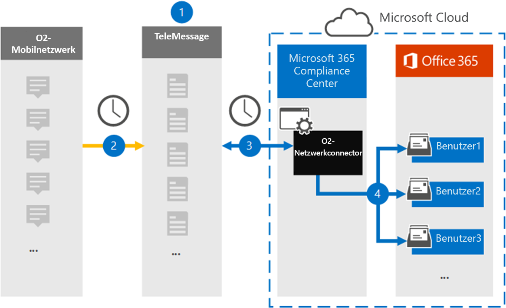

# Einrichten eines Connectors zum Archivieren von O2-Netzwerkdaten

Verwenden Sie einen TeleMessage-Konnektor im Microsoft 365 Compliance Center, um SMS-Nachrichten (Short Messaging Service) und Sprachanrufe aus dem O2-Mobilfunknetz zu importieren und zu archivieren. Nachdem Sie einen Connector eingerichtet und konfiguriert haben, stellt er einmal täglich eine Verbindung mit dem O2-Netzwerk Ihrer Organisation her und importiert SMS-und Sprachanrufe in Postfächer in Microsoft 365.

Nachdem SMS-Nachrichten und Sprachanrufe in Benutzerpostfächern gespeichert wurden, können Sie Microsoft 365-Kompatibilitätsfeatures wie Beweissicherungsverfahren, Inhaltssuche und Microsoft 365-Aufbewahrungsrichtlinien auf O2-Netzwerkdaten anwenden. Sie können beispielsweise O2-Netzwerk-SMS-Nachrichten und-Anrufe mithilfe der Inhaltssuche durchsuchen oder das Postfach, das O2-Netzwerkdaten enthält, einer Depotbank in einem erweiterten eDiscovery-Fall zuordnen. Durch die Verwendung eines O2-Netzwerk Connectors zum Importieren und Archivieren von Daten in Microsoft 365 können Sie Ihrer Organisation dabei helfen, mit behördlichen und behördlichen Richtlinien konform zu bleiben.

## Übersicht über die Archivierung von O2-Netzwerkdaten

In der folgenden Übersicht wird der Vorgang der Verwendung eines Connectors zum Archivieren von O2-Netzwerkdaten in Microsoft 365 erläutert.

1. Ihre Organisation arbeitet mit TeleMessage und O2 zusammen, um einen O2-Netzwerkstecker einzurichten. Weitere Informationen finden Sie unter [O2 Network Archiver](https://www.telemessage.com/office365-activation-for-o2-network-archiver).

2. Einmal alle 24 Stunden werden SMS-Nachrichten und Sprachanrufe aus dem O2-Netzwerk Ihrer Organisation an die TeleMessage-Website kopiert.

3. Der O2-Netzwerk Connector, den Sie im Microsoft 365 Compliance Center erstellen, stellt jeden Tag eine Verbindung mit der TeleMessage-Website her und überträgt die SMS-Nachrichten und Sprachanrufe aus den vorherigen 24 Stunden an einen sicheren Azure-Speicherort in der Microsoft-Cloud. Der Connector wandelt auch den Inhalt von SMS-Nachrichten und Sprachanrufen in ein e-Mail-Nachrichtenformat um.

4. Der Connector importiert die mobilen Kommunikationselemente in das Postfach bestimmter Benutzer. Ein neuer Ordner namens **O2 SMS und Voice Network Archiver** wird im Postfach eines bestimmten Benutzers erstellt, und die Elemente werden darin importiert. Der Connector führt diese Zuordnung mithilfe des Werts der *e-Mail-Adress* Eigenschaft des Benutzers aus. Jede SMS-Nachricht und jeder Sprachanruf enthält diese Eigenschaft, die mit der e-Mail-Adresse jedes Teilnehmers der Nachricht aufgefüllt wird.

   Zusätzlich zur automatischen Benutzerzuordnung mithilfe des Werts der *e-Mail-Adress* Eigenschaft des Benutzers können Sie auch eine benutzerdefinierte Zuordnung definieren, indem Sie eine CSV-Zuordnungsdatei hochladen. Diese Zuordnungsdatei enthält die Mobiltelefonnummer und die entsprechende Microsoft 365-e-Mail-Adresse für Benutzer in Ihrer Organisation. Wenn Sie sowohl die automatische Benutzerzuordnung als auch die benutzerdefinierte Zuordnung aktivieren, sucht der Connector für jedes O2-Element zuerst die benutzerdefinierte Zuordnungsdatei. Wenn kein gültiger Microsoft 365-Benutzer gefunden wird, der der Mobiltelefonnummer eines Benutzers entspricht, verwendet der Connector die Werte in der e-Mail-Adress Eigenschaft des Elements, das er zu importieren versucht. Wenn der Connector einen gültigen Microsoft 365-Benutzer weder in der benutzerdefinierten Zuordnungsdatei noch in der e-Mail-Adress Eigenschaft des O2-Elements findet, wird das Element nicht importiert.

## Bevor Sie beginnen:

Einige der erforderlichen Implementierungsschritte zum Archivieren von O2-Netzwerkdaten liegen außerhalb von Microsoft 365 und müssen abgeschlossen sein, bevor Sie einen Connector im Compliance Center erstellen können.

- Bestellen Sie den [O2 Network Archiver-Dienst über telemessaging](https://www.telemessage.com/mobile-archiver/order-mobile-archiver-for-o365/) , und erhalten Sie ein gültiges Verwaltungskonto für Ihre Organisation. Sie müssen sich bei diesem Konto anmelden, wenn Sie den Connector im Compliance Center erstellen.

- Holen Sie sich Ihr O2-Netzwerkkonto und ihre Rechnungskontakt Details, damit Sie die Formulare für die Telefonnachrichten ausfüllen und den Nachrichten Archivierungsdienst von O2 bestellen können.

- Registrieren Sie alle Benutzer, die O2-SMS und die Archivierung von VoIP-Netzwerken im TeleMessage-Konto benötigen. Achten Sie beim Registrieren von Benutzern darauf, dieselbe e-Mail-Adresse zu verwenden, die für Ihr Microsoft 365-Konto verwendet wird.

- Ihre Mitarbeiter müssen unternehmenseigene und Unternehmens hafte Mobiltelefone im O2-Mobilfunknetz haben. Das Archivieren von Nachrichten in Microsoft 365 ist nicht für Mitarbeiter eigene Geräte oder "Bring your own Devices (BYOD)" zur Verfügung.

- Dem Benutzer, der einen O2-Netzwerk Connector erstellt, muss in Exchange Online die Rolle "Post Fach Import Export" zugewiesen sein. Dies ist für das Hinzufügen von Connectors auf der Seite " **Daten Konnektoren** " im Microsoft 365 Compliance Center erforderlich. Standardmäßig ist diese Rolle keiner Rollengruppe in Exchange Online zugewiesen. Sie können die Rolle "Post Fach Import exportieren" der Rollengruppe "Organisationsverwaltung" in Exchange Online hinzufügen. Sie können auch eine Rollengruppe erstellen, die Rolle "Post Fach Import Export" zuweisen und dann die entsprechenden Benutzer als Mitglieder hinzufügen. Weitere Informationen finden Sie im Abschnitt [Erstellen](https://docs.microsoft.com/Exchange/permissions-exo/role-groups#create-role-groups) von Rollengruppen oder [Ändern von Rollengruppen](https://docs.microsoft.com/Exchange/permissions-exo/role-groups#modify-role-groups) im Artikel "Verwalten von Rollengruppen in Exchange Online".

## Erstellen eines O2-Netzwerk Connectors

Nachdem Sie die im vorherigen Abschnitt beschriebenen Voraussetzungen erfüllt haben, können Sie einen O2-Netzwerk-Konnektor im Microsoft 365 Compliance Center erstellen. Der Connector verwendet die von Ihnen bereitgestellten Informationen, um eine Verbindung mit der telemessaging-Website herzustellen und um SMS-Nachrichten und Sprachanrufe an die entsprechenden Benutzer Postfache in Microsoft 365 zu übertragen.

1. Wechseln [https://compliance.microsoft.com](https://compliance.microsoft.com/) Sie zu und klicken Sie dann auf **Data Connectors** \> **O2 Network**.

2. Klicken Sie auf der Seite **O2-Netzwerk** Produktbeschreibung auf **Connector hinzufügen** .

3. Klicken Sie auf der Seite **Nutzungsbedingungen** auf **annehmen**.

4. Geben Sie auf der Seite **Anmeldung bei TeleMessage** unter Schritt 3 die erforderlichen Informationen in die folgenden Felder ein, und klicken Sie dann auf **weiter**.

   - **Benutzername:** Ihren Benutzernamen für die e-Mail-Nachricht.

   - **Kennwort:** Ihr TeleMessage-Kennwort.

5. Nachdem der Connector erstellt wurde, können Sie das Popupfenster schließen und zur nächsten Seite wechseln.

6. Aktivieren Sie auf der Seite **Benutzerzuordnung** die Option Automatische Benutzerzuordnung, und klicken Sie auf **weiter**. Wenn Sie eine benutzerdefinierte Zuordnung benötigen, laden Sie eine CSV-Datei hoch, und klicken Sie auf **weiter**.

7. Überprüfen Sie Ihre Einstellungen, und klicken Sie dann auf **Fertig stellen** , um den Connector zu erstellen.

8. Wechseln Sie zur Registerkarte Konnektoren auf der Seite **Daten Konnektoren** , um den Fortschritt des Importvorgangs für den neuen Connector anzuzeigen.

## Bekannte Probleme

- Zurzeit wird das Importieren von Anlagen oder Elementen, die größer als 10 MB sind, nicht unterstützt. Unterstützung für größere Elemente wird zu einem späteren Zeitpunkt zur Verfügung stehen.
