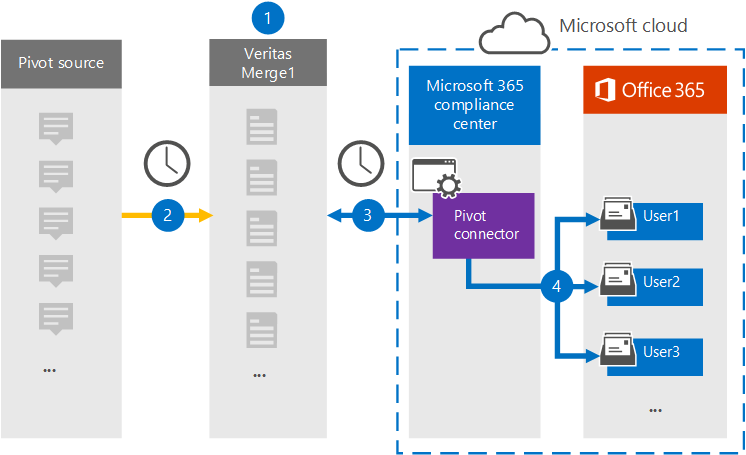

# Einrichten eines Connectors zum Archivieren von PivotTable-Daten

Verwenden Sie einen Globanet-Connector im Microsoft 365 Compliance Center, um Daten aus der Pivot-Plattform in Benutzerpostfächer in Ihrer Microsoft 365-Organisation zu importieren und zu archivieren. Globanet bietet Ihnen einen [Pivot](https://globanet.com/pivot/) -Konnektor, der so konfiguriert ist, dass Elemente aus der Drittanbieter-Datenquelle (regelmäßig) erfasst und dann diese Elemente nach Microsoft 365 importiert werden. Pivot ist eine Instant Messaging-Plattform, die die Zusammenarbeit mit den Finanzmarktteilnehmern ermöglicht. Der Connector wandelt Elemente wie Chatnachrichten von den Pivot-Konten eines Benutzers in ein e-Mail-Nachrichtenformat um und importiert diese Elemente in die Benutzerpostfächer in Microsoft 365.

Nachdem pivotdaten in Benutzerpostfächern gespeichert wurden, können Sie Microsoft 365-Compliance-Features wie Beweissicherungsverfahren, eDiscovery, Aufbewahrungsrichtlinien und Aufbewahrungs Bezeichnungen sowie die Kompatibilität der Kommunikation anwenden. Die Verwendung eines Pivot-Konnektors zum Importieren und Archivieren von Daten in Microsoft 365 kann dazu beitragen, dass Ihre Organisation mit behördlichen und behördlichen Richtlinien konform bleibt.

## Übersicht über die Archivierung von Pivot-Daten

In der folgenden Übersicht wird erläutert, wie Sie einen Connector zum Archivieren der pivotdaten in Microsoft 365 verwenden.

1. Ihre Organisation arbeitet mit Pivot zusammen, um eine Pivot-Quellwebsite einzurichten und zu konfigurieren.

2. Alle 24 Stunden werden Pivot-Elemente in die Globanet-Merge1-Website kopiert. Der Connector wandelt auch die Pivot-Elemente in ein e-Mail-Nachrichtenformat um.

3. Der Pivot-Konnektor, den Sie im Microsoft 365 Compliance Center erstellen, stellt jeden Tag eine Verbindung mit der Globanet Merge1-Website her und überträgt die Pivot-Elemente an einen sicheren Azure-Speicherort in der Microsoft-Cloud.

4. Der Connector importiert die Pivot-Elemente in die Postfächer bestimmter Benutzer, indem er den Wert der *Email* -Eigenschaft der automatischen Benutzerzuordnung wie in [Schritt 3](#step-3-map-users-and-complete-the-connector-setup)beschrieben verwendet. Ein Unterordner im Ordner "Posteingang" mit dem Namen " **Pivot** " wird in den Benutzerpostfächern erstellt, und die Elemente werden in diesen Ordner importiert. Der Connector verwendet den Wert der *Email* -Eigenschaft. Jedes Pivot-Element enthält diese Eigenschaft, die mit der e-Mail-Adresse jedes Teilnehmers des Elements aufgefüllt wird.

## Bevor Sie beginnen

- Erstellen Sie ein Globanet-Merge1-Konto für Microsoft-Connectors. Wenden Sie sich dazu an den [Globanet-Kunden Support](https://globanet.com/ms-connectors-contact/). Sie müssen sich bei diesem Konto anmelden, wenn Sie den Connector in Schritt 1 erstellen.

- Der Benutzer, der den Pivot-Konnektor in Schritt 1 erstellt (und in Schritt 3 vervollständigt) muss der Rolle "Post Fach Import Export" in Exchange Online zugewiesen sein. Diese Rolle ist für das Hinzufügen von Connectors auf der Seite Daten Konnektoren im Microsoft 365 Compliance Center erforderlich. Diese Rolle ist in Exchange Online standardmäßig keiner Rollengruppe zugewiesen. Sie können die Rolle "Post Fach Import exportieren" der Rollengruppe "Organisationsverwaltung" in Exchange Online hinzufügen. Sie können auch eine Rollengruppe erstellen, die Rolle "Post Fach Import Export" zuweisen und dann die entsprechenden Benutzer als Mitglieder hinzufügen. Weitere Informationen finden Sie im Abschnitt [Erstellen](https://docs.microsoft.com/Exchange/permissions-exo/role-groups#create-role-groups) von Rollengruppen oder [Ändern von Rollengruppen](https://docs.microsoft.com/Exchange/permissions-exo/role-groups#modify-role-groups) im Artikel "Verwalten von Rollengruppen in Exchange Online".

## Schritt 1: Einrichten des Pivot-Konnektors

Der erste Schritt besteht darin, auf die Seite " **Daten Konnektoren** " im Microsoft Compliance Center zuzugreifen und einen Connector für pivotdaten zu erstellen.

1. Wechseln Sie zu, [https://compliance.microsoft.com](https://compliance.microsoft.com/) und klicken Sie dann auf **Daten Verbinder**  >  **Pivot** .

2. Klicken Sie auf der Seite **Pivot** -Produktbeschreibung auf **Connector hinzufügen** .

3. Klicken Sie auf der Seite **Nutzungsbedingungen** auf **annehmen** .

4. Geben Sie einen eindeutigen Namen ein, der den Connector identifiziert, und klicken Sie dann auf **weiter** .

5. Melden Sie sich bei Ihrem Merge1-Konto an, um den Connector zu konfigurieren.

## Schritt 2: Konfigurieren des Pivot-Konnektors auf der Globanet-Merge1-Website

Im zweiten Schritt konfigurieren Sie den Pivot-Konnektor auf der Merge1-Website. Informationen zum Konfigurieren des Pivot-Konnektors auf der Globanet Merge1-Website finden Sie unter [Merge1 Third-Party Connectors User Guide](https://docs.ms.merge1.globanetportal.com/Merge1%20Third-Party%20Connectors%20Pivot%20User%20Guide%20.pdf).

Nachdem Sie auf **& fertig stellen** klicken, werden Sie zurück zum Microsoft 365 Compliance Center auf die Seite **Benutzerzuordnung** im Connector-Assistenten umgeleitet.

## Schritt 3: Zuordnen von Benutzern und Abschließen des Connector-Setups

Führen Sie die folgenden Schritte aus, um Benutzer zuzuordnen und das Connector-Setup im Microsoft 356 Compliance Center abzuschließen:

1. Aktivieren Sie auf der Seite PivotTable-Benutzer **auf Microsoft 365-Benutzer zuordnen** die Option Automatische Benutzerzuordnung. Die Pivot-Elemente enthalten eine Eigenschaft mit dem Namen " *e-Mail* ", die e-Mail-Adressen für Benutzer in Ihrer Organisation enthält. Wenn der Connector diese Adresse einem Microsoft 365-Benutzer zuordnen kann, werden die Elemente in das Postfach dieses Benutzers importiert.

2. Klicken Sie auf der Seite **Administrator Zustimmung** auf **Zustimmung erteilen** . Sie werden zur Microsoft-Website umgeleitet. Klicken Sie auf **akzeptieren** , um die Zustimmung zu erteilen.

   Ihre Organisation muss einwilligen, dass der Office 365 Import Dienst auf Postfachdaten in Ihrer Organisation zugreifen kann. Um die Zustimmung des Administrators bereitzustellen, müssen Sie mit den Anmeldeinformationen eines globalen Administrators von Microsoft 365 angemeldet sein und dann die Zustimmungs Anforderung annehmen. Wenn Sie nicht als globaler Administrator angemeldet sind, können Sie zu [dieser Seite](https://login.microsoftonline.com/common/oauth2/authorize?client_id=570d0bec-d001-4c4e-985e-3ab17fdc3073&response_type=code&redirect_uri=https://portal.azure.com/&nonce=1234&prompt=admin_consent) wechseln und sich mit globalen Administratoranmeldeinformationen anmelden, um die Anforderung zu akzeptieren.

3. Klicken Sie auf **weiter** , überprüfen Sie Ihre Einstellungen, und wechseln Sie zur Seite **Daten Konnektoren** , um den Fortschritt des Importvorgangs für den neuen Connector anzuzeigen.

## Schritt 4: Überwachen des Pivot-Konnektors

Nachdem Sie den Pivot-Konnektor erstellt haben, können Sie den Connectorstatus im Microsoft 365 Compliance Center anzeigen.

1. Wechseln Sie zu, [https://compliance.microsoft.com](https://compliance.microsoft.com) und klicken Sie im linken Navigationsbereich auf **Daten-Konnektoren** .

2. Klicken Sie auf die Registerkarte **Verbinder** , und wählen Sie dann den **Pivot** -Konnektor aus, um die Flyout-Seite anzuzeigen, die die Eigenschaften und Informationen zum Connector enthält.

3. Klicken Sie unter **Connectorstatus with Source** auf den Link **Download Protokoll** , um das Statusprotokoll für den Connector zu öffnen (oder zu speichern). Dieses Protokoll enthält Daten, die in die Microsoft-Cloud importiert wurden.

## Bekannte Probleme

- Zurzeit wird das Importieren von Anlagen oder Elementen, die größer als 10 MB sind, nicht unterstützt. Unterstützung für größere Elemente wird zu einem späteren Zeitpunkt zur Verfügung stehen.
