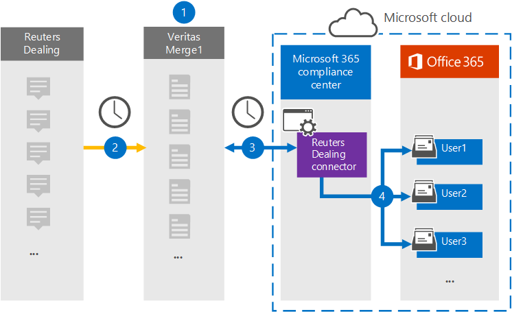

# Einrichten eines Connectors zum Archivieren von Reuters Dealing-Daten

Verwenden Sie einen Connectors vom Microsoft 365, um Daten von der Reuters Dealing-Plattform in Benutzerpostfächer in Ihrer Organisation Microsoft 365 archivieren. Mit Einem [Reuters](https://globanet.com/reuters-dealing/) Dealing-Connector, der so konfiguriert ist, dass Elemente aus der Datenquelle eines Drittanbieters erfasst werden (regelmäßig) und diese Elemente dann in die Microsoft 365. Der Connector wandelt die Kommunikation über das Reuters Dealing-Konto in ein E-Mail-Nachrichtenformat um und importiert diese Elemente dann in das Postfach des Benutzers in Microsoft 365.

Nachdem Reuters Dealing-Daten in Benutzerpostfächern gespeichert wurden, können Sie Microsoft 365 Compliancefeatures wie z. B. Litigation Hold, eDiscovery, Aufbewahrungsrichtlinien und Aufbewahrungsbezeichnungen und Kommunikationskonformität anwenden. Die Verwendung eines Reuters Dealing-Connectors zum Importieren und Archivieren von Daten in Microsoft 365 kann Dazu beitragen, dass Ihre Organisation die Richtlinien von Behörden und Behörden einhalten kann.

## Übersicht über die Archivierung von Reuters Dealing-Daten

In der folgenden Übersicht wird der Prozess der Verwendung eines Connectors zum Archivieren der Reuters Dealing-Daten in Microsoft 365.

1. Ihre Organisation arbeitet mit Reuters Dealing zusammen, um eine Reuters Dealing-Website zu einrichten und zu konfigurieren.

2. Einmal alle 24 Stunden werden Reuters Dealing-Elemente auf die Website "Reuters Merge1" kopiert. Der Connector konvertiert die Elemente auch in ein E-Mail-Nachrichtenformat.

3. Der Reuters Dealing-Connector, den Sie im Microsoft 365 Compliance Center erstellen, stellt jeden Tag eine Verbindung mit der Website von Veritas Merge1 her und überträgt den Inhalt an einen sicheren Azure Storage-Speicherort in der Microsoft-Cloud.

4. Der Connector importiert Elemente in die Postfächer bestimmter Benutzer mithilfe des Werts der *Email-Eigenschaft* der automatischen Benutzerzuordnung, wie in [Schritt 3 beschrieben.](#step-3-map-users-and-complete-the-connector-setup) In den Benutzerpostfächern wird ein Unterordner im Posteingangsordner mit dem Namen **Reuters Dealing** erstellt, und die Elemente werden in diesen Ordner importiert. Der Connector bestimmt mithilfe des Werts der Email-Eigenschaft, in welches Postfach Elemente *importiert werden.* Jedes Reuters Dealing-Element enthält diese Eigenschaft, die mit der E-Mail-Adresse jedes Teilnehmers des Elements aufgefüllt wird.

## Bevor Sie beginnen

- Erstellen Sie ein Konto für Denkdruck1 für Microsoft Connectors. Wenden Sie sich zum Erstellen eines Kontos an [den Kundensupport von Veritas](https://globanet.com/contact-us). Sie müssen sich bei diesem Konto anmelden, wenn Sie den Connector in Schritt 1 erstellen.

- Der Benutzer, der den Reuters Dealing-Connector in Schritt 1 erstellt (und ihn in Schritt 3 abgeschlossen hat), muss der Rolle Postfachimportexport in Exchange Online. Diese Rolle ist erforderlich, um Connectors auf der Seite **Datenconnectors** im compliance center Microsoft 365 hinzufügen. Diese Rolle ist standardmäßig keinem Rollengruppen in der Exchange Online. Sie können die Rolle Postfachimportexport zur Rollengruppe Organisationsverwaltung in der Exchange Online. Sie können auch eine Rollengruppe erstellen, die Rolle Postfachimportexport zuweisen und dann die entsprechenden Benutzer als Mitglieder hinzufügen. Weitere Informationen finden Sie in den Abschnitten [Erstellen](/Exchange/permissions-exo/role-groups#create-role-groups) von Rollengruppen oder [Ändern](/Exchange/permissions-exo/role-groups#modify-role-groups) von Rollengruppen im Artikel "Verwalten von Rollengruppen in Exchange Online".

## Schritt 1: Einrichten des Reuters Dealing-Connectors

Der erste Schritt besteht  im Zugriff auf die Seite Datenconnectors im Microsoft 365 und erstellen Sie einen Connector für Reuters Dealing-Daten.

1. Wechseln Sie [https://compliance.microsoft.com](https://compliance.microsoft.com/) zu, und klicken Sie dann auf **Datenconnectors**  >  **Reuters Dealing**.

2. Klicken Sie auf der **Seite Reuters Dealing** product description auf **Connector hinzufügen.**

3. Klicken Sie **auf der Seite Nutzungsbedingungen** auf **Akzeptieren**.

4. Geben Sie einen eindeutigen Namen ein, der den Connector identifiziert, und klicken Sie dann auf **Weiter**.

5. Melden Sie sich bei Ihrem Merge1-Konto an, um den Connector zu konfigurieren.

## Schritt 2: Konfigurieren des Reuters Dealing-Connectors auf der Website "Merge1"

Der zweite Schritt besteht in der Konfiguration des Reuters Dealing-Connectors auf dem Standort "Merge1". Informationen zum Konfigurieren des Reuters Dealing-Connectors finden Sie unter [Merge1 Third-Party Connectors User Guide](https://docs.ms.merge1.globanetportal.com/Merge1%20Third-Party%20Connectors%20Reuters%20Dealing%20User%20Guide%20.pdf).

Nachdem Sie auf **Speichern &** Fertig  stellen geklickt haben, wird die Seite Benutzerzuordnung im Connector-Assistenten im Microsoft 365 Compliance Center angezeigt.

## Schritt 3: Zuordnung von Benutzern und Abschließen der Connectoreinrichtung

Führen Sie die folgenden Schritte aus, um Benutzer zu zuordnungen und die Connectoreinrichtung im Microsoft 365 Compliance Center abzuschließen:

1. Aktivieren Sie **auf der Seite Map Reuters Dealing users to Microsoft 365 users** die automatische Benutzerzuordnung.

   Reuters Dealing items include a property called *Email*, which contains email addresses for users in your organization. Wenn der Connector diese Adresse einem Microsoft 365 zuordnen kann, werden die Elemente in das Postfach dieses Benutzers importiert.

2. Klicken **Sie auf Weiter,** überprüfen  Sie Ihre Einstellungen, und wechseln Sie zur Seite Datenconnectors, um den Fortschritt des Importvorgangs für den neuen Connector zu sehen.

## Schritt 4: Überwachen des Reuters Dealing-Connectors

Nachdem Sie den Reuters Dealing-Connector erstellt haben, können Sie den Connectorstatus im Microsoft 365 anzeigen.

1. Wechseln Sie [https://compliance.microsoft.com](https://compliance.microsoft.com/) zu, und klicken Sie **im** linken Navigations navi auf Datenconnectors.

2. Klicken Sie **auf die Registerkarte** Connectors, und wählen Sie dann den **Reuters Dealing-Connector** aus, um die Flyoutseite mit den Eigenschaften und Informationen zum Connector angezeigt zu werden.

3. Klicken **Sie unter Connectorstatus mit Quelle** auf den Link **Protokoll** herunterladen, um das Statusprotokoll für den Connector zu öffnen (oder zu speichern). Dieses Protokoll enthält Daten, die in die Microsoft Cloud importiert wurden.

## Bekannte Probleme

- Derzeit wird das Importieren von Anlagen oder Elementen, die größer als 10 MB sind, nicht unterstützt. Unterstützung für größere Elemente wird zu einem späteren Zeitpunkt verfügbar sein.