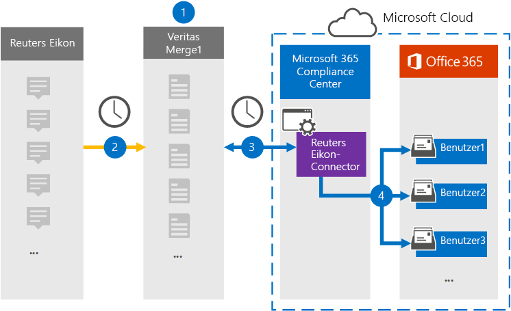

# Einrichten eines Connectors zum Archivieren von Reuters-Eikon-Daten

Verwenden Sie einen Connectors für Denkdaten im Microsoft 365 Compliance Center, um Daten von der Reuters Eikon-Plattform in Benutzerpostfächer in Ihrer Microsoft 365-Organisation zu importieren und zu archivieren. Mit Einem Reuters -Eikon-Connector, der so konfiguriert ist, dass Elemente aus der Datenquelle eines Drittanbieters (regelmäßig) erfasst und in Microsoft 365 importiert werden, wird ein [Reuters-Eikon-Connector](https://globanet.com/eikon/) zur Hand genommen. Der Connector konvertiert inhalte wie Personennachrichten, Gruppenchats, Anlagen und Haftungsausschlüsse aus dem Reuters-Eikon-Konto eines Benutzers in ein E-Mail-Nachrichtenformat und importiert diese Elemente dann in das Postfach des Benutzers in Microsoft 365.

Nachdem Reuters-Eikon-Daten in Benutzerpostfächern gespeichert wurden, können Sie Microsoft 365-Compliancefeatures wie z. B. Litigation Hold, eDiscovery, Aufbewahrungsrichtlinien und Aufbewahrungsbezeichnungen sowie Kommunikationskonformität anwenden. Die Verwendung eines Reuters-Eikon-Connectors zum Importieren und Archivieren von Daten in Microsoft 365 kann Dazu beitragen, dass Ihre Organisation die Behördlichen und behördlichen Richtlinien einhalten kann.

## Übersicht über archivierungs-Reuters-Eikon-Daten

In der folgenden Übersicht wird der Prozess der Verwendung eines Connectors zum Archivieren von Reuters Eikon-Daten in Microsoft 365 erläutert.

1. Ihre Organisation arbeitet mit Reuters Eikon zusammen, um eine Reuters Eikon-Website zu einrichten und zu konfigurieren.

2. Alle 24 Stunden werden Reuters-Eikon-Elemente auf die Website "Reuters Merge1" kopiert. Der Connector konvertiert auch Reuters Eikon-Elemente in ein E-Mail-Nachrichtenformat.

3. Der Reuters-Eikon-Connector, den Sie im Microsoft 365 Compliance Center erstellen, stellt täglich eine Verbindung mit der Website von Veritas Merge1 her und überträgt den Inhalt an einen sicheren Azure Storage-Speicherort in der Microsoft-Cloud.

4. Der Connector importiert Elemente in die Postfächer bestimmter Benutzer mithilfe des Werts der *Email-Eigenschaft* der automatischen Benutzerzuordnung, wie in [Schritt 3 beschrieben.](#step-3-map-users-and-complete-the-connector-setup) In den Benutzerpostfächern wird ein Unterordner im Posteingangsordner mit dem Namen **Reuters Eikon** erstellt, und die Elemente werden in diesen Ordner importiert. Der Connector bestimmt mithilfe des Werts der Email-Eigenschaft, in welches Postfach Elemente *importiert werden.* Jedes Reuters Eikon-Element enthält diese Eigenschaft, die mit der E-Mail-Adresse jedes Teilnehmers des Elements aufgefüllt wird.

## Bevor Sie beginnen

- Erstellen Sie ein Konto für Denkdruck1 für Microsoft Connectors. Wenden Sie sich zum Erstellen eines Kontos an [den Kundensupport von Veritas](https://globanet.com/ms-connectors-contact). Sie melden sich bei diesem Konto an, wenn Sie den Connector in Schritt 1 erstellen.

- Der Benutzer, der den Reuters -Eikon-Connector in Schritt 1 erstellt (und in Schritt 3 abgeschlossen) muss der Rolle Postfachimportexport in Exchange Online zugewiesen werden. Diese Rolle ist erforderlich, um Connectors auf der Seite **Datenconnectors** im Microsoft 365 Compliance Center hinzuzufügen. Diese Rolle ist standardmäßig nicht einer Rollengruppe in Exchange Online zugewiesen. Sie können die Rolle Postfachimportexport zur Rollengruppe Organisationsverwaltung in Exchange Online hinzufügen. Sie können auch eine Rollengruppe erstellen, die Rolle Postfachimportexport zuweisen und dann die entsprechenden Benutzer als Mitglieder hinzufügen. Weitere Informationen finden Sie in den Abschnitten Erstellen von [Rollengruppen](/Exchange/permissions-exo/role-groups#create-role-groups) oder [Ändern](/Exchange/permissions-exo/role-groups#modify-role-groups) von Rollengruppen im Artikel "Verwalten von Rollengruppen in Exchange Online".

## Schritt 1: Einrichten des Reuters-Eikon-Connectors

Der erste Schritt besteht im Zugriff auf die Seite **Datenconnectors** im Microsoft 365 Compliance Center und erstellen Sie einen Connector für Reuters Eikon-Daten.

1. Wechseln Sie [https://compliance.microsoft.com](https://compliance.microsoft.com/) zu, und klicken Sie dann auf **Datenconnectors**  >  **Reuters Eikon**.

2. Klicken Sie auf der **Seite Reuters Eikon-Produktbeschreibung** auf **Connector hinzufügen.**

3. Klicken Sie **auf der Seite Nutzungsbedingungen** auf **Akzeptieren**.

4. Geben Sie einen eindeutigen Namen ein, der den Connector identifiziert, und klicken Sie dann auf **Weiter**.

5. Melden Sie sich bei Ihrem Merge1-Konto an, um den Connector zu konfigurieren.

## Schritt 2: Konfigurieren des Reuters-Eikon-Connectors auf dem Standort "Merge1"

Der zweite Schritt besteht in der Konfiguration des Reuters-Eikon-Connectors auf dem Merge1-Standort. Informationen zum Konfigurieren des Reuters-Eikon-Connectors auf der Website "Merge1" finden Sie unter [Merge1-Benutzerhandbuch für Drittanbieterconnectors](https://docs.ms.merge1.globanetportal.com/Merge1%20Third-Party%20Connectors%20Reuters%20Eikon%20User%20Guide%20.pdf).

Nachdem Sie auf **& Beenden** klicken, wird die Seite Benutzerzuordnung im Connector-Assistenten im Microsoft 365 Compliance Center angezeigt. 

## Schritt 3: Zuordnung von Benutzern und Abschließen der Connectoreinrichtung

Führen Sie die folgenden Schritte aus, um Benutzer zu zuordnungen und die Connectoreinrichtung im Microsoft 365 Compliance Center abzuschließen:

1. Aktivieren Sie auf der Seite Externe **Benutzer zu Microsoft 365-Benutzern** zuordnen die automatische Benutzerzuordnung. Die Reuters -Eikon-Elemente enthalten eine Eigenschaft namens *Email*, die E-Mail-Adressen für Benutzer in Ihrer Organisation enthält. Wenn der Connector diese Adresse einem Microsoft 365-Benutzer zuordnen kann, werden die Elemente in das Postfach dieses Benutzers importiert.

2. Klicken **Sie auf Weiter,** überprüfen Sie  Ihre Einstellungen, und wechseln Sie dann zur Seite Datenconnectors, um den Fortschritt des Importvorgangs für den neuen Connector zu sehen.

## Schritt 4: Überwachen des Reuters-Eikon-Connectors

Nachdem Sie den Reuters Eikon-Connector erstellt haben, können Sie den Connectorstatus im Microsoft 365 Compliance Center anzeigen.

1. Wechseln Sie [https://compliance.microsoft.com](https://compliance.microsoft.com) zu, und klicken Sie **im** linken Navigations navi auf Datenconnectors.

2. Klicken Sie auf **die** Registerkarte Connectors, und wählen Sie dann **den Reuters-Eikon-Connector** aus, um die Flyoutseite anzeigen zu können. Diese Seite enthält die Eigenschaften und Informationen zum Connector.

3. Klicken **Sie unter Connectorstatus mit Quelle** auf den Link **Protokoll** herunterladen, um das Statusprotokoll für den Connector zu öffnen (oder zu speichern). Dieses Protokoll enthält Informationen zu den Daten, die in die Microsoft Cloud importiert wurden.

## Bekannte Probleme

- Derzeit wird das Importieren von Anlagen oder Elementen, die größer als 10 MB sind, nicht unterstützt. Unterstützung für größere Elemente wird zu einem späteren Zeitpunkt verfügbar sein.