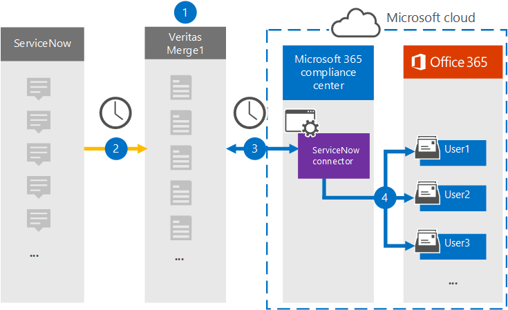

# Einrichten eines Connectors zum Archivieren von ServiceNow-DatenSet up a connector to archive ServiceNow data

Verwenden Sie einen Globanet-Connector im Microsoft 365 Compliance Center, um Daten von der ServiceNow-Plattform in Benutzerpostfächer in Ihrer Microsoft 365-Organisation zu importieren und zu archivieren.Use a Globanet connector in the Microsoft 365 compliance center to import and archive data from the ServiceNow platform to user mailboxes in your Microsoft 365 organization. Das Programm Bietet einen [ServiceNow-Connector,](https://globanet.com/servicenow/) der Elemente aus der Datenquelle eines Drittanbieters erfasst und diese Elemente in Microsoft 365 importiert.Globanet provides a [ServiceNow](https://globanet.com/servicenow/) connector that captures items from the third-party data source and import those items to Microsoft 365. Der Connector konvertiert die Inhalte wie Livenachrichten, Anlagen und Beiträge aus ServiceNow in ein E-Mail-Nachrichtenformat und importiert diese Elemente dann in Benutzerpostfächer in Microsoft 365.The connector converts the content such as live messages, attachments, and posts from ServiceNow to an email message format and then imports those items to user mailboxes in Microsoft 365.

Nachdem ServiceNow-Daten in Benutzerpostfächern gespeichert wurden, können Sie Microsoft 365-Compliancefeatures wie z. B. Litigation Hold, eDiscovery, Aufbewahrungsrichtlinien und Aufbewahrungsbezeichnungen anwenden.After ServiceNow data is stored in user mailboxes, you can apply Microsoft 365 compliance features such as Litigation Hold, eDiscovery, retention policies, and retention labels. Die Verwendung eines ServiceNow-Connectors zum Importieren und Archivieren von Daten in Microsoft 365 kann Dazu beitragen, dass Ihre Organisation den richtlinienkonformen Richtlinien von Behörden und Behörden entspricht.Using a ServiceNow connector to import and archive data in Microsoft 365 can help your organization stay compliant with government and regulatory policies.

## Übersicht über die Archivierung von ServiceNow-DatenOverview of archiving ServiceNow data

In der folgenden Übersicht wird der Prozess der Verwendung eines Connectors zum Archivieren der ServiceNow-Daten in Microsoft 365 erläutert.The following overview explains the process of using a connector to archive the ServiceNow data in Microsoft 365.

1. Ihre Organisation arbeitet mit ServiceNow zusammen, um eine ServiceNow-Website zu einrichten und zu konfigurieren.Your organization works with ServiceNow to set up and configure a ServiceNow site.

2. Einmal alle 24 Stunden werden ServiceNow-Elemente auf die Website "Globenet Merge1" kopiert.Once every 24 hours, ServiceNow items are copied to the Globanet Merge1 site. Der Connector konvertiert auch ServiceNow-Elemente in ein E-Mail-Nachrichtenformat.The connector also converts ServiceNow items to an email message format.

3. Der ServiceNow-Connector, den Sie im Microsoft 365 Compliance Center erstellen, stellt jeden Tag eine Verbindung mit der Website von GlobeNet Merge1 bereit und überträgt die ServiceNow-Inhalte an einen sicheren Azure Storage-Speicherort in der Microsoft-Cloud.The ServiceNow connector that you create in the Microsoft 365 compliance center connects to the Globanet Merge1 site every day and transfers the ServiceNow content to a secure Azure Storage location in the Microsoft cloud.

4. Der Connector importiert die konvertierten Elemente in die Postfächer bestimmter Benutzer mithilfe des Werts der *Email-Eigenschaft* der automatischen Benutzerzuordnung, wie in [Schritt 3 beschrieben.](#step-3-map-users-and-complete-the-connector-setup)The connector imports the converted items to the mailboxes of specific users using the value of the *Email* property of the automatic user mapping as described in [Step 3](#step-3-map-users-and-complete-the-connector-setup). In den Benutzerpostfächern wird ein Unterordner im Posteingangsordner **"ServiceNow"** erstellt, und Elemente werden in diesen Ordner importiert.A subfolder in the Inbox folder named **ServiceNow** is created in the user mailboxes, and items are imported to that folder. Der Connector bestimmt mithilfe des Werts der Email-Eigenschaft, in welches Postfach Elemente *importiert werden.*The connector determines which mailbox to import items to by using the value of the *Email* property. Jedes ServiceNow-Element enthält diese Eigenschaft, die mit der E-Mail-Adresse jedes Teilnehmers des Elements aufgefüllt wird.Every ServiceNow item contains this property, which is populated with the email address of every participant of the item.

## Bevor Sie beginnenBefore you begin

- Erstellen Sie ein Merge1-Konto für Microsoft Connectors.Create a Merge1 account for Microsoft connectors. Um ein Konto zu erstellen, wenden Sie sich an [den Kundensupport von "Globenet".](https://globanet.com/contact-us/)To create an account, contact [Globanet Customer Support](https://globanet.com/contact-us/). Sie müssen sich bei diesem Konto anmelden, wenn Sie den Connector in Schritt 1 erstellen.You need to sign into this account when you create the connector in Step 1.

- Erstellen Sie eine ServiceNow-Anwendung zum Abrufen von Daten aus Ihrem ServiceNow-Konto.Create a ServiceNow application to fetch data from your ServiceNow account. Schrittweise Anleitungen zum Erstellen der Anwendung finden Sie unter [Merge1 Third-Party Connectors User Guide](https://docs.ms.merge1.globanetportal.com/Merge1%20Third-Party%20Connectors%20ServiceNow%20User%20Guide%20.pdf).For step-by step instructions about creating the application, see [Merge1 Third-Party Connectors User Guide](https://docs.ms.merge1.globanetportal.com/Merge1%20Third-Party%20Connectors%20ServiceNow%20User%20Guide%20.pdf).

- Der Benutzer, der den ServiceNow-Connector in Schritt 1 erstellt (und in Schritt 3 abgeschlossen) muss der Rolle Postfachimportexport in Exchange Online zugewiesen sein.The user who creates the ServiceNow connector in Step 1 (and completes it in Step 3) must be assigned to the Mailbox Import Export role in Exchange Online. Diese Rolle ist erforderlich, um Connectors auf der Seite **Datenconnectors** im Microsoft 365 Compliance Center hinzuzufügen.This role is required to add connectors on the **Data connectors** page in the Microsoft 365 compliance center. Standardmäßig ist diese Rolle keiner Rollengruppe in Exchange Online zugewiesen.By default, this role isn't assigned to any role group in Exchange Online. Sie können die Rolle Postfachimportexport zur Rollengruppe Organisationsverwaltung in Exchange Online hinzufügen.You can add the Mailbox Import Export role to the Organization Management role group in Exchange Online. Sie können auch eine Rollengruppe erstellen, die Rolle Postfachimportexport zuweisen und dann die entsprechenden Benutzer als Mitglieder hinzufügen.Or you can create a role group, assign the Mailbox Import Export role, and then add the appropriate users as members. Weitere Informationen finden Sie in den Abschnitten Erstellen von [Rollengruppen](/Exchange/permissions-exo/role-groups#create-role-groups) oder [Ändern](/Exchange/permissions-exo/role-groups#modify-role-groups) von Rollengruppen im Artikel "Verwalten von Rollengruppen in Exchange Online".For more information, see the [Create role groups](/Exchange/permissions-exo/role-groups#create-role-groups) or [Modify role groups](/Exchange/permissions-exo/role-groups#modify-role-groups) sections in the article "Manage role groups in Exchange Online".

## Schritt 1: Einrichten des ServiceNow-ConnectorsStep 1: Set up the ServiceNow connector

Der erste Schritt besteht im Zugriff auf die Seite **Datenconnectors** im Microsoft 365 Compliance Center und erstellen Sie einen Connector für ServiceNow-Daten.The first step is to access to the **Data Connectors** page in the Microsoft 365 compliance center and create a connector for ServiceNow data.

1. Wechseln Sie [https://compliance.microsoft.com](https://compliance.microsoft.com/) zu, und klicken Sie dann auf **Datenconnectors**  >  **ServiceNow**.Go to [https://compliance.microsoft.com](https://compliance.microsoft.com/) and then click **Data connectors** > **ServiceNow**.

2. Klicken Sie **auf der Seite ServiceNow-Produktbeschreibung** auf **Connector hinzufügen.**On the **ServiceNow** product description page, click **Add connector**.

3. Klicken Sie **auf der Seite Nutzungsbedingungen** auf **Akzeptieren**.On the **Terms of service** page, click **Accept**.

4. Geben Sie einen eindeutigen Namen ein, der den Connector identifiziert, und klicken Sie dann auf **Weiter**.Enter a unique name that identifies the connector, and then click **Next**.

5. Melden Sie sich bei Ihrem Merge1-Konto an, um den Connector zu konfigurieren.Sign in to your Merge1 account to configure the connector.

## Schritt 2: Konfigurieren von ServiceNow auf der Website "Globenet Merge1"Step 2: Configure the ServiceNow on the Globanet Merge1 site

Der zweite Schritt besteht in der Konfiguration des ServiceNow-Connectors auf dem Standort "Globenet Merge1".The second step is to configure the ServiceNow connector on the Globanet Merge1 site. Informationen zum Konfigurieren des ServiceNow-Connectors finden Sie unter [Merge1 Third-Party Connectors User Guide](https://docs.ms.merge1.globanetportal.com/Merge1%20Third-Party%20Connectors%20ServiceNow%20User%20Guide%20.pdf).For information about how to configure the ServiceNow connector, see [Merge1 Third-Party Connectors User Guide](https://docs.ms.merge1.globanetportal.com/Merge1%20Third-Party%20Connectors%20ServiceNow%20User%20Guide%20.pdf).

Nachdem Sie auf & Beenden  **klicken,** wird die Seite Benutzerzuordnung im Connector-Assistenten im Microsoft 365 Compliance Center angezeigt.After you click **Save & Finish,** the **User mapping** page in the connector wizard in the Microsoft 365 compliance center is displayed.

## Schritt 3: Zuordnung von Benutzern und Abschließen der ConnectoreinrichtungStep 3: Map users and complete the connector setup

Führen Sie die folgenden Schritte aus, um Benutzer zu zuordnungen und die Connectoreinrichtung im Microsoft 365 Compliance Center abzuschließen:To map users and complete the connector setup in the Microsoft 365 compliance center, follow these steps:

1. Aktivieren Sie auf der Seite **Benutzer microsoft 365-Benutzern Zuordnen** von Benutzern zu Microsoft 365 die automatische Benutzerzuordnung.On the **Map ServiceNow users to Microsoft 365 users** page, enable automatic user mapping. Die ServiceNow-Elemente enthalten eine Eigenschaft namens *Email*, die E-Mail-Adressen für Benutzer in Ihrer Organisation enthält.The ServiceNow items include a property called *Email*, which contains email addresses for users in your organization. Wenn der Connector diese Adresse einem Microsoft 365-Benutzer zuordnen kann, werden die Elemente in das Postfach dieses Benutzers importiert.If the connector can associate this address with a Microsoft 365 user, the items are imported to that user's mailbox.

2. Klicken **Sie auf Weiter,** überprüfen Sie  Ihre Einstellungen, und wechseln Sie dann zur Seite Datenconnectors, um den Fortschritt des Importvorgangs für den neuen Connector zu sehen.Click **Next**, review your settings, and then go to the **Data connectors** page to see the progress of the import process for the new connector.

## Schritt 4: Überwachen des ServiceNow-ConnectorsStep 4: Monitor the ServiceNow connector

Nachdem Sie den ServiceNow-Connector erstellt haben, können Sie den Connectorstatus im Microsoft 365 Compliance Center anzeigen.After you create the ServiceNow connector, you can view the connector status in the Microsoft 365 compliance center.

1. Wechseln Sie [https://compliance.microsoft.com](https://compliance.microsoft.com/) zu, und klicken Sie **im** linken Navigations navi auf Datenconnectors.Go to [https://compliance.microsoft.com](https://compliance.microsoft.com/) and click **Data connectors** in the left nav.

2. Klicken Sie **auf die Registerkarte** Connectors, und wählen Sie dann den **ServiceNow-Connector** aus, um die Flyoutseite mit den Eigenschaften und Informationen zum Connector angezeigt zu werden.Click the **Connectors** tab and then select the **ServiceNow** connector to display the flyout page, which contains the properties and information about the connector.

3. Klicken **Sie unter Connectorstatus mit Quelle** auf den Link **Protokoll** herunterladen, um das Statusprotokoll für den Connector zu öffnen (oder zu speichern).Under **Connector status with source**, click the **Download log** link to open (or save) the status log for the connector. Dieses Protokoll enthält Daten, die in die Microsoft Cloud importiert wurden.This log contains data that has been imported to the Microsoft cloud.

## Bekannte ProblemeKnown issues

- Derzeit wird das Importieren von Anlagen oder Elementen, die größer als 10 MB sind, nicht unterstützt.At this time, we don't support importing attachments or items that are larger than 10 MB. Unterstützung für größere Elemente wird zu einem späteren Zeitpunkt verfügbar sein.Support for larger items will be available at a later date.