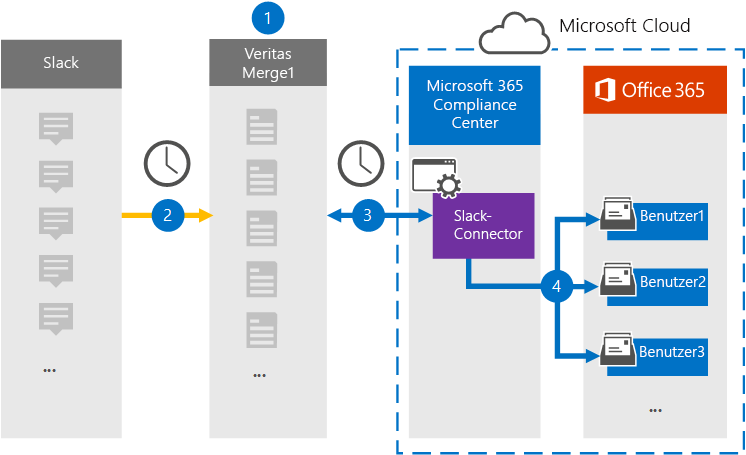

# Einrichten eines Connectors zum Archivieren von Slack eDiscovery-DatenSet up a connector to archive Slack eDiscovery data

Verwenden Sie einen Globanet-Connector im Microsoft 365 Compliance Center, um Drittanbieterdaten aus sozialen Medien, Chatnachrichten und Plattformen für die Dokumentzusammenarbeit in Postfächer in Ihrer Microsoft 365-Organisation zu importieren und zu archivieren.Use a Globanet connector in the Microsoft 365 compliance center to import and archive third-party data from social media, instant messaging, and document collaboration platforms to mailboxes in your Microsoft 365 organization. Das Programm Bietet einen [Slack-Connector,](https://globanet.com/slack/) der so konfiguriert ist, dass Elemente aus der Datenquelle eines Drittanbieters (regelmäßig) erfasst und anschließend in Microsoft 365 importiert werden.Globanet provides a [Slack](https://globanet.com/slack/) connector that's configured to capture items from the third-party data source (on a regular basis) and then import those items to Microsoft 365. Slack zieht Nachrichten und Dateien aus der Slack-API, konvertiert sie in ein E-Mail-Nachrichtenformat und importiert das Element dann in Benutzerpostfächer.Slack pulls messages and files from the Slack API and converts them to an email message format and then imports the item to user mailboxes.

Nachdem Slack eDiscovery-Daten in Benutzerpostfächern gespeichert wurden, können Sie Microsoft 365-Compliancefeatures wie z. B. Das Rechtsstreitigkeitensverfahren, eDiscovery, Aufbewahrungsrichtlinien und Aufbewahrungsbezeichnungen und die Kommunikationskonformität anwenden.After Slack eDiscovery data is stored in user mailboxes, you can apply Microsoft 365 compliance features such as Litigation Hold, eDiscovery, retention policies and retention labels, and communication compliance. Die Verwendung eines Slack-Connectors zum Importieren und Archivieren von Daten in Microsoft 365 kann Dazu beitragen, dass Ihre Organisation den richtlinienkonformen Richtlinien von Behörden und Behörden entspricht.Using a Slack connector to import and archive data in Microsoft 365 can help your organization stay compliant with government and regulatory policies.

## Übersicht über die Archivierung von Slack eDiscovery-DatenOverview of archiving Slack eDiscovery data

In der folgenden Übersicht wird der Prozess der Verwendung eines Connectors zum Archivieren der Slack-Informationen in Microsoft 365 erläutert.The following overview explains the process of using a connector to archive the Slack information in Microsoft 365.

1. Ihre Organisation arbeitet mit Slack zusammen, um einen Slack-Standort zu einrichten und zu konfigurieren.Your organization works with Slack to set up and configure a Slack site.

2. Einmal alle 24 Stunden werden Chatnachrichten von Slack eDiscovery auf die Website "GlobeNet Merge1" kopiert.Once every 24 hours, chat messages from Slack eDiscovery are copied to the Globanet Merge1 site. Der Connector konvertiert auch den Inhalt einer Chatnachricht in ein E-Mail-Nachrichtenformat.The connector also converts the content of a chat message to an email message format.

3. Der Slack eDiscovery-Connector, den Sie im Microsoft 365 Compliance Center erstellen, stellt jeden Tag eine Verbindung mit der Website "Globenet Merge1" bereit und überträgt die Chatnachrichten an einen sicheren Azure Storage-Speicherort in der Microsoft-Cloud.The Slack eDiscovery connector that you create in the Microsoft 365 compliance center, connects to the Globanet Merge1 site every day and transfers the chat messages to a secure Azure Storage location in the Microsoft cloud.

4. Der Connector importiert die konvertierten Chatnachrichtenelemente mithilfe des Werts der *Email-Eigenschaft* und der automatischen Benutzerzuordnung in die Postfächer bestimmter Benutzer, wie in Schritt 3 beschrieben.The connector imports the converted chat message items to the mailboxes of specific users using the value of the *Email* property and automatic user mapping, as described in Step 3. In den Benutzerpostfächern wird ein neuer Unterordner im Posteingangsordner mit dem Namen **Slack eDiscovery** erstellt, und die Chatnachrichtenelemente werden in diesen Ordner importiert.A new subfolder in the Inbox folder named **Slack eDiscovery** is created in the user mailboxes, and the chat message items are imported to that folder. Der Connector bestimmt mithilfe des Werts der Email-Eigenschaft, in welches Postfach Elemente *importiert werden.*The connector determines which mailbox to import items to by using the value of the *Email* property. Jede Chatnachricht enthält diese Eigenschaft, die mit der E-Mail-Adresse jedes Teilnehmers der Chatnachricht gefüllt wird.Every chat message contains this property, which is populated with the email address of every participant of the chat message.

## Bevor Sie beginnenBefore you begin

- Erstellen Sie ein Konto für das Merge1-Konto von "GlobeNet Merge1" für Microsoft-Connectors.Create a Globanet Merge1 account for Microsoft connectors. Um ein Konto zu erstellen, wenden Sie sich an [den Kundensupport von "Globenet".](https://globanet.com/ms-connectors-contact)To create an account, contact [Globanet Customer Support](https://globanet.com/ms-connectors-contact). Sie melden sich bei diesem Konto an, wenn Sie den Connector in Schritt 1 erstellen.You will sign into this account when you create the connector in Step 1.

- Rufen Sie den Benutzernamen und das Kennwort für das Slack-Unternehmenskonto Ihrer Organisation ab.Obtain the username and password for your organization's Slack enterprise account. Sie müssen sich bei diesem Konto in Schritt 2 anmelden, wenn Sie Slack konfigurieren.You'll need to sign into this account in Step 2 when you configure Slack.

- Der Benutzer, der den Slack eDiscovery-Connector in Schritt 1 erstellt (und ihn in Schritt 3 abgeschlossen hat), muss der Rolle Postfachimportexport in Exchange Online zugewiesen werden.The user who creates the Slack eDiscovery connector in Step 1 (and completes it in Step 3) must be assigned to the Mailbox Import Export role in Exchange Online. Diese Rolle ist erforderlich, um Connectors auf der Seite **Datenconnectors** im Microsoft 365 Compliance Center hinzuzufügen.This role is required to add connectors on the **Data connectors** page in the Microsoft 365 compliance center. Diese Rolle ist standardmäßig nicht einer Rollengruppe in Exchange Online zugewiesen.By default, this role is not assigned to a role group in Exchange Online. Sie können die Rolle Postfachimportexport zur Rollengruppe Organisationsverwaltung in Exchange Online hinzufügen.You can add the Mailbox Import Export role to the Organization Management role group in Exchange Online. Sie können auch eine Rollengruppe erstellen, die Rolle Postfachimportexport zuweisen und dann die entsprechenden Benutzer als Mitglieder hinzufügen.Or you can create a role group, assign the Mailbox Import Export role, and then add the appropriate users as members. Weitere Informationen finden Sie in den Abschnitten Erstellen von [Rollengruppen](/Exchange/permissions-exo/role-groups#create-role-groups) oder [Ändern](/Exchange/permissions-exo/role-groups#modify-role-groups) von Rollengruppen im Artikel "Verwalten von Rollengruppen in Exchange Online".For more information, see the [Create role groups](/Exchange/permissions-exo/role-groups#create-role-groups) or [Modify role groups](/Exchange/permissions-exo/role-groups#modify-role-groups) sections in the article "Manage role groups in Exchange Online".

## Schritt 1: Einrichten des Slack eDiscovery-ConnectorsStep 1: Set up the Slack eDiscovery connector

Der erste Schritt besteht im Zugriff auf die Seite **Datenconnectors** im Microsoft 365 Compliance Center und dem Erstellen eines Connectors für Pufferdaten.The first step is to access to the **Data Connectors** page in the Microsoft 365 compliance center and create a connector for Slack data.

1. Wechseln Sie [https://compliance.microsoft.com](https://compliance.microsoft.com/) zu, und klicken Sie dann auf   >  **Datenconnectors Slack eDiscovery**.Go to [https://compliance.microsoft.com](https://compliance.microsoft.com/) and then click **Data connectors** > **Slack eDiscovery**.

2. Klicken Sie **auf der Seite Produktbeschreibung für Slack eDiscovery** auf **Connector hinzufügen.**On the **Slack eDiscovery** product description page, click **Add connector**.

3. Klicken Sie **auf der Seite Nutzungsbedingungen** auf **Akzeptieren**.On the **Terms of service** page, click **Accept**.

4. Geben Sie einen eindeutigen Namen ein, der den Connector identifiziert, und klicken Sie dann auf **Weiter**.Enter a unique name that identifies the connector, and then click **Next**.

5. Melden Sie sich bei Ihrem Merge1-Konto an, um den Connector zu konfigurieren.Sign in to your Merge1 account to configure the connector.

## Schritt 2: Konfigurieren von Slack eDiscoveryStep 2: Configure Slack eDiscovery

Der zweite Schritt besteht im Konfigurieren des Slack eDiscovery-Connectors auf dem Merge1-Standort.The second step is to configure the Slack eDiscovery connector on the Merge1 site. Weitere Informationen zum Konfigurieren des Slack eDiscovery-Connectors auf der Website von "Globenet Merge1" finden Sie unter [Merge1 Third-Party Connectors User Guide](https://docs.ms.merge1.globanetportal.com/Merge1%20Third-Party%20Connectors%20Slack%20eDiscovery%20User%20Guide.pdf).For more information about how to configure the Slack eDiscovery connector on the Globanet Merge1 site, see [Merge1 Third-Party Connectors User Guide](https://docs.ms.merge1.globanetportal.com/Merge1%20Third-Party%20Connectors%20Slack%20eDiscovery%20User%20Guide.pdf).

Nachdem Sie auf **& Beenden** klicken, wird die Seite Benutzerzuordnung im Connector-Assistenten im Microsoft 365 Compliance Center angezeigt. After you click **Save & Finish**, the **User mapping** page in the connector wizard in the Microsoft 365 compliance center is displayed.

## Schritt 3: Zuordnung von Benutzern und Abschließen der ConnectoreinrichtungStep 3: Map users and complete the connector setup

1. Aktivieren Sie auf der Seite Externe **Benutzer zu Microsoft 365-Benutzern** zuordnen die automatische Benutzerzuordnung.On the **Map external users to Microsoft 365 users** page, enable automatic user mapping.

   Slack eDiscovery-Elemente enthalten eine Eigenschaft namens *Email*, die E-Mail-Adressen für Benutzer in Ihrer Organisation enthält.Slack eDiscovery items include a property called *Email*, which contains email addresses for users in your organization. Wenn der Connector diese Adresse einem Microsoft 365-Benutzer zuordnen kann, werden die Elemente in das Postfach dieses Benutzers importiert.If the connector can associate this address with a Microsoft 365 user, the items are imported to that user's mailbox.

2. Klicken **Sie auf Weiter,** überprüfen  Sie Ihre Einstellungen, und wechseln Sie zur Seite Datenconnectors, um den Fortschritt des Importvorgangs für den neuen Connector zu sehen.Click **Next**, review your settings, and go to the **Data connectors** page to see the progress of the import process for the new connector.

## Schritt 4: Überwachen des Slack eDiscovery-ConnectorsStep 4: Monitor the Slack eDiscovery connector

Nachdem Sie den Slack eDiscovery-Connector erstellt haben, können Sie den Connectorstatus im Microsoft 365 Compliance Center anzeigen.After you create the Slack eDiscovery connector, you can view the connector status in the Microsoft 365 compliance center.

1. Wechseln Sie [https://compliance.microsoft.com](https://compliance.microsoft.com) zu, und klicken Sie **im** linken Navigations navi auf Datenconnectors.Go to [https://compliance.microsoft.com](https://compliance.microsoft.com) and click **Data connectors** in the left nav.

2. Klicken Sie auf **die** Registerkarte Connectors, und wählen Sie dann **den Slack eDiscovery-Connector** aus, um die Flyoutseite anzeigen zu können.Click the **Connectors** tab and then select the **Slack eDiscovery** connector to display the flyout page. Diese Seite enthält die Eigenschaften und Informationen zum Connector.This page contains the properties and information about the connector.

3. Klicken **Sie unter Connectorstatus mit Quelle** auf den Link **Protokoll** herunterladen, um das Statusprotokoll für den Connector zu öffnen (oder zu speichern).Under **Connector status with source**, click the **Download log** link to open (or save) the status log for the connector. Dieses Protokoll enthält Informationen zu den Daten, die in die Microsoft Cloud importiert wurden.This log contains information about the data that has been imported to the Microsoft cloud.

## Bekannte ProblemeKnown issues

- Derzeit wird das Importieren von Anlagen oder Elementen, die größer als 10 MB sind, nicht unterstützt.At this time, we don't support importing attachments or items that are larger than 10 MB. Unterstützung für größere Elemente wird zu einem späteren Zeitpunkt verfügbar sein.Support for larger items will be available at a later date.