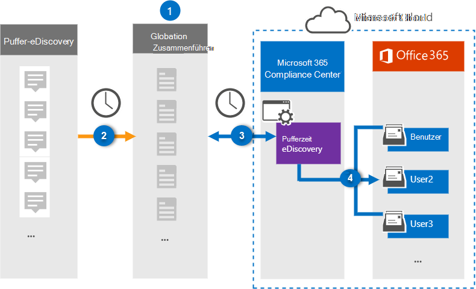

# Einrichten eines Connectors zum Archivieren von Puffer eDiscovery-Daten (Vorschau)

Verwenden Sie einen Globanet-Connector im Microsoft 365 Compliance Center zum Importieren und Archivieren von drittanbieterdaten aus Social Media-, Instant Messaging-und Dokument Zusammenarbeits Plattformen zu Postfächern in Ihrer Microsoft 365-Organisation. Globanet bietet einen Puffer-eDiscovery-Konnektor, der so konfiguriert ist, dass er Elemente aus der Drittanbieter-Datenquelle (regelmäßig) erfasst und diese Elemente dann nach Microsoft 365 importiert. Slack eDiscovery ruft Nachrichten und Dateien aus der Slack-API ab und wandelt sie in ein e-Mail-Nachrichtenformat um und importiert dann das Element in Benutzerpostfächer.

Nachdem Sie eDiscovery-Daten in Benutzerpostfächern gespeichert haben, können Sie Microsoft 365-Compliance-Features wie Beweissicherungsverfahren, eDiscovery, Aufbewahrungsrichtlinien und Aufbewahrungs Bezeichnungen sowie die Kompatibilität der Kommunikation anwenden. Die Verwendung eines Puffer-eDiscovery-Konnektors zum Importieren und Archivieren von Daten in Microsoft 365 kann dazu beitragen, dass Ihre Organisation mit behördlichen und behördlichen Richtlinien konform bleibt.

## Übersicht über das Archivieren von Puffer eDiscovery-Daten

In der folgenden Übersicht wird erläutert, wie Sie einen Connector zum Archivieren der Slack-eDiscovery-Informationen in Microsoft 365 verwenden.

1. Ihre Organisation arbeitet mit Slack eDiscovery, um eine Slackline-eDiscovery-Website einzurichten und zu konfigurieren.

2. Alle 24 Stunden werden Chatnachrichten von slack eDiscovery auf die Globanet Merge1-Website kopiert. Der Connector wandelt auch den Inhalt einer Chatnachricht in ein e-Mail-Nachrichtenformat um.

3. Der Slack eDiscovery Connector, den Sie im Microsoft 365 Compliance Center erstellen, stellt jeden Tag eine Verbindung mit der Globanet Merge1-Website her und überträgt die Chatnachrichten an einen sicheren Azure-Speicherort in der Microsoft-Cloud.

4. Der Connector importiert die konvertierten Chatnachrichten Elemente in die Postfächer bestimmter Benutzer, wobei der Wert der *e-Mail* -Eigenschaft und die automatische Benutzerzuordnung, wie in Schritt 3 beschrieben, verwendet werden. Ein neuer Unterordner im Posteingangsordner mit dem Namen **Slack eDiscovery** wird in den Benutzerpostfächern erstellt, und die Chatnachrichten Elemente werden in diesen Ordner importiert. Der Connector verwendet den Wert der *Email* -Eigenschaft. Jede Chatnachricht enthält diese Eigenschaft, die mit der e-Mail-Adresse jedes Teilnehmers der Chatnachricht aufgefüllt wird.

## Bevor Sie beginnen:

- Erstellen Sie ein Globanet-Merge1-Konto, indem Sie die allgemeinen Geschäftsbedingungen für den Slack eDiscovery Connector akzeptieren. Wenden Sie sich dazu an den [Globanet-Kunden Support](https://globanet.com/contact-us). Sie müssen sich bei diesem Konto anmelden, wenn Sie den Connector in Schritt 1 erstellen.

- Rufen Sie den Benutzernamen und das Kennwort für das Slack Enterprise-Konto Ihrer Organisation ab. Wenn Sie Slack eDiscovery konfigurieren, müssen Sie sich in Schritt 2 bei diesem Konto anmelden.

- Der Benutzer, der den Puffer-eDiscovery-Konnektor in Schritt 1 erstellt (und diesen in Schritt 3 abschließt) muss der Rolle "Post Fach Import Export" in Exchange Online zugewiesen sein. Diese Rolle ist für das Hinzufügen von Connectors auf der Seite **Daten Konnektoren** im Microsoft 365 Compliance Center erforderlich. Diese Rolle ist in Exchange Online standardmäßig keiner Rollengruppe zugewiesen. Sie können die Rolle "Post Fach Import exportieren" der Rollengruppe "Organisationsverwaltung" in Exchange Online hinzufügen. Sie können auch eine Rollengruppe erstellen, die Rolle "Post Fach Import Export" zuweisen und dann die entsprechenden Benutzer als Mitglieder hinzufügen. Weitere Informationen finden Sie im Abschnitt [Erstellen](https://docs.microsoft.com/Exchange/permissions-exo/role-groups#create-role-groups) von Rollengruppen oder [Ändern von Rollengruppen](https://docs.microsoft.com/Exchange/permissions-exo/role-groups#modify-role-groups) im Artikel "Verwalten von Rollengruppen in Exchange Online".

## Schritt 1: Einrichten des Puffer-eDiscovery-Konnektors

Der erste Schritt besteht im Zugriff auf die Seite " **Daten Konnektoren** " im Microsoft 365 Compliance Center und Erstellen eines Connectors für Puffer-eDiscovery-Daten.

1. Wechseln Sie zu, [https://compliance.microsoft.com](https://compliance.microsoft.com/) und klicken Sie dann auf **Data Connectors**  >  **Slack eDiscovery**.

2. Klicken Sie auf der Seite "eDiscovery-Produktbeschreibung für **Slack** " auf **Connector hinzufügen**.

3. Klicken Sie auf der Seite **Nutzungsbedingungen** auf **annehmen**.

4. Geben Sie einen eindeutigen Namen ein, der den Connector identifiziert, und klicken Sie dann auf **weiter**.

5. Melden Sie sich bei Ihrem Merge1-Konto an, um den Connector zu konfigurieren.

## Schritt 2: Konfigurieren von slack eDiscovery

Im zweiten Schritt konfigurieren Sie den Slack eDiscovery Connector auf der Merge1-Website. Weitere Informationen zum Konfigurieren des Puffer-eDiscovery-Konnektors auf der Globanet Merge1-Website finden Sie unter [Merge1 Third-Party Connectors User Guide](https://docs.ms.merge1.globanetportal.com/Merge1%20Third-Party%20Connectors%20Slack%20eDiscovery%20User%20Guide.pdf).

Nachdem Sie auf **& fertig stellen**klicken, werden Sie zurück zum Microsoft 365 Compliance Center auf die Seite **Benutzerzuordnung** im Connector-Assistenten umgeleitet.

## Schritt 3: Zuordnen von Benutzern und Abschließen des Connector-Setups

1. Aktivieren Sie auf der Seite **externe Benutzer auf Microsoft 365-Benutzer zuordnen** die Option Automatische Benutzerzuordnung.

   Zu den Puffer-eDiscovery-Elementen gehört eine Eigenschaft mit dem Namen " *e-Mail*", die e-Mail-Adressen für Benutzer in Ihrer Organisation enthält. Wenn der Connector diese Adresse einem Microsoft 365-Benutzer zuordnen kann, werden die Elemente in das Postfach dieses Benutzers importiert.

2. Klicken Sie auf der Seite **Administrator Zustimmung** auf die Schaltfläche **Zustimmung erteilen** . Sie werden zur Microsoft-Website umgeleitet. Klicken Sie auf **akzeptieren** , um die Zustimmung zu erteilen.

   Ihre Organisation muss einwilligen, dass der Office 365 Import Dienst auf Postfachdaten in Ihrer Organisation zugreifen kann. Um die Zustimmung des Administrators bereitzustellen, müssen Sie mit den Anmeldeinformationen eines globalen Administrators von Microsoft 365 angemeldet sein und dann die Zustimmungs Anforderung annehmen. Wenn Sie nicht als globaler Administrator angemeldet sind, können Sie zu [dieser Seite](https://login.microsoftonline.com/common/oauth2/authorize?client_id=570d0bec-d001-4c4e-985e-3ab17fdc3073&response_type=code&redirect_uri=https://portal.azure.com/&nonce=1234&prompt=admin_consent) wechseln und sich mit globalen Administratoranmeldeinformationen anmelden, um die Anforderung zu akzeptieren.

3. Klicken Sie auf **weiter**, überprüfen Sie Ihre Einstellungen, und wechseln Sie zur Seite **Daten Konnektoren** , um den Fortschritt des Importvorgangs für den neuen Connector anzuzeigen.

## Schritt 4: Überwachen des Puffer-eDiscovery-Konnektors

Nachdem Sie den Slack eDiscovery Connector erstellt haben, können Sie den Connectorstatus im Microsoft 365 Compliance Center anzeigen.

1. Wechseln Sie zu, [https://compliance.microsoft.com](https://compliance.microsoft.com) und klicken Sie im linken Navigationsbereich auf **Daten-Konnektoren** .

2. Klicken Sie auf die Registerkarte **Connectors** , und wählen Sie dann den **Puffer-eDiscovery** -Konnektor aus, um die Flyout-Seite anzuzeigen, die die Eigenschaften und Informationen zum Connector enthält.

3. Klicken Sie unter **Connectorstatus with Source**auf den Link **Download Protokoll** , um das Statusprotokoll für den Connector zu öffnen (oder zu speichern). Dieses Protokoll enthält Informationen zu den Daten, die in die Microsoft-Cloud importiert wurden.

## Bekannte Probleme

- Zurzeit wird kein Import von Anlagen unterstützt, die größer als 10 MB sind, aber die Unterstützung größerer Elemente wird zu einem späteren Zeitpunkt zur Verfügung stehen.
