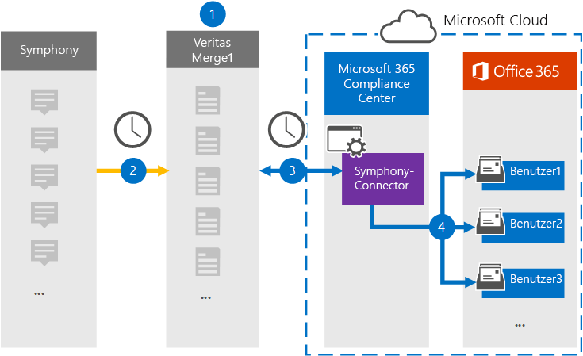

# Einrichten eines Connectors zum Archivieren von Symphonie Daten

Verwenden Sie einen Globanet-Connector im Microsoft 365 Compliance Center, um Symphonie Daten in Benutzerpostfächer in Ihrer Microsoft 365-Organisation zu importieren und zu archivieren. Symphony ist eine Plattform für Messaging und Zusammenarbeit, die in der Finanzdienstleistungsbranche verwendet wird. Globanet bietet einen [Symphony](https://globanet.com/symphony) Data Connector im Microsoft 365 Compliance Center, den Sie konfigurieren können, um Elemente aus der Drittanbieter-Datenquelle (regelmäßig) aufzuzeichnen und diese Elemente dann in Benutzerpostfächer zu importieren. Der Connector wandelt den Inhalt eines Elements aus dem Symphony-Konto in ein e-Mail-Nachrichtenformat um und importiert dann das Element in ein Postfach in Microsoft 365.

Nachdem die Sinfonie Kommunikation in Benutzerpostfächern gespeichert wurde, können Sie Microsoft 365-Compliance-Features wie Beweissicherungsverfahren, eDiscovery, Aufbewahrungsrichtlinien und Aufbewahrungs Bezeichnungen sowie die Kompatibilität der Kommunikation anwenden. Die Verwendung eines Symphony Connectors zum Importieren und Archivieren von Daten in Microsoft 365 kann dazu beitragen, dass Ihre Organisation mit behördlichen und behördlichen Richtlinien konform bleibt.

## Übersicht über die Archivierung von Symphony-Daten

In der folgenden Übersicht wird erläutert, wie Sie einen Daten Konnektor zum Archivieren von Symphonie Kommunikation in Microsoft 365 verwenden.

1. Ihre Organisation arbeitet mit Symphony zusammen, um eine Symphonie-Website einzurichten und zu konfigurieren.

2. Alle 24 Stunden werden Chatnachrichten von Symphony auf die Globanet Merge1-Website kopiert. Der Connector wandelt auch den Inhalt einer Chatnachricht in ein e-Mail-Nachrichtenformat um.

3. Der Symphony Connector, den Sie im Microsoft 365 Compliance Center erstellen, stellt jeden Tag eine Verbindung mit der Globanet Merge1-Website her und überträgt die Nachrichten an einen sicheren Azure-Speicherort in der Microsoft-Cloud.

4. Der Connector importiert die konvertierten Nachrichtenelemente in die Postfächer bestimmter Benutzer, wobei der Wert der *Email* -Eigenschaft der automatischen Benutzerzuordnung wie in Schritt 3 beschrieben wird. Ein neuer Unterordner im Posteingangsordner " **Symphony** " wird in den Benutzerpostfächern erstellt, und die Nachrichtenelemente werden in diesen Ordner importiert. Der Connector bestimmt anhand des Werts der *Email* -Eigenschaft, in welches Postfach Elemente importiert werden sollen. Jede Chatnachricht enthält diese Eigenschaft, die mit der e-Mail-Adresse für jeden Teilnehmer aufgefüllt wird.

## Bevor Sie beginnen:

- Erstellen Sie ein Globanet-Merge1-Konto für Microsoft-Connectors. Um ein Konto zu erstellen, wenden Sie sich an den [Globanet-Kunden Support](https://globanet.com/ms-connectors-contact). Sie melden sich bei diesem Konto an, wenn Sie den Connector in Schritt 1 erstellen.

- Der Benutzer, der den Symphony Connector in Schritt 1 erstellt (und in Schritt 3 vervollständigt) muss der Rolle "Post Fach Import Export" in Exchange Online zugewiesen sein. Diese Rolle ist für das Hinzufügen von Connectors auf der Seite **Daten Konnektoren** im Microsoft 365 Compliance Center erforderlich. Diese Rolle ist in Exchange Online standardmäßig keiner Rollengruppe zugewiesen. Sie können die Rolle "Post Fach Import exportieren" der Rollengruppe "Organisationsverwaltung" in Exchange Online hinzufügen. Sie können auch eine Rollengruppe erstellen, die Rolle "Post Fach Import Export" zuweisen und dann die entsprechenden Benutzer als Mitglieder hinzufügen. Weitere Informationen finden Sie im Abschnitt [Erstellen](https://docs.microsoft.com/Exchange/permissions-exo/role-groups#create-role-groups) von Rollengruppen oder [Ändern von Rollengruppen](https://docs.microsoft.com/Exchange/permissions-exo/role-groups#modify-role-groups) im Artikel "Verwalten von Rollengruppen in Exchange Online".

## Schritt 1: Einrichten des Symphony Connectors

Der erste Schritt besteht darin, auf die Seite " **Daten Konnektoren** " im Microsoft 365 Compliance Center zuzugreifen und einen Connector für Symphony-Daten zu erstellen.

1. Wechseln Sie zu, [https://compliance.microsoft.com](https://compliance.microsoft.com/) und klicken Sie dann auf **Data Connectors**  >  **Symphony** .

2. Klicken Sie auf der Seite **Symphony** Product Description auf **Connector hinzufügen** .

3. Klicken Sie auf der Seite **Nutzungsbedingungen** auf **annehmen** .

4. Geben Sie einen eindeutigen Namen ein, der den Connector identifiziert, und klicken Sie dann auf **weiter** .

5. Melden Sie sich bei Ihrem Merge1-Konto an, um den Connector zu konfigurieren.

## Konfigurieren des Symphony Connectors auf der Globanet Merge1-Website

Der zweite Schritt besteht darin, den Symphony Connector auf der Merge1-Website zu konfigurieren. Weitere Informationen zum Konfigurieren des Symphony Connectors auf der Globanet Merge1-Website finden Sie unter [Merge1 Third-Party Connectors User Guide](https://docs.ms.merge1.globanetportal.com/Merge1%20Third-Party%20Connectors%20Symphony%20User%20Guide%20.pdf).

Nachdem Sie auf **& Ende speichern** klicken, wird die Seite **Benutzerzuordnung** im Connector-Assistenten im Microsoft 365 Compliance Center angezeigt.

## Schritt 3: Zuordnen von Benutzern und Abschließen des Connector-Setups

Führen Sie die folgenden Schritte aus, um Benutzer zuzuordnen und das Connector-Setup im Microsoft 365 Compliance Center abzuschließen:

1. Aktivieren Sie auf der Seite **externe Benutzer auf Microsoft 365-Benutzer zuordnen** die Option Automatische Benutzerzuordnung. Die Symphony-Elemente enthalten eine Eigenschaft mit dem Namen " *e-Mail* ", die e-Mail-Adressen für Benutzer in Ihrer Organisation enthält. Wenn der Connector diese Adresse einem Microsoft 365-Benutzer zuordnen kann, werden die Elemente in das Postfach dieses Benutzers importiert.

2. Klicken Sie auf der Seite **Administrator Zustimmung** auf **Zustimmung erteilen** . Sie werden zur Microsoft-Website umgeleitet. Klicken Sie auf **akzeptieren** , um die Zustimmung zu erteilen.

   Ihre Organisation muss einwilligen, dass der Office 365 Import Dienst auf Postfachdaten in Ihrer Organisation zugreifen kann. Um die Zustimmung des Administrators bereitzustellen, müssen Sie mit den Anmeldeinformationen eines globalen Administrators von Microsoft 365 angemeldet sein und dann die Zustimmungs Anforderung annehmen. Wenn Sie nicht als globaler Administrator angemeldet sind, können Sie zu [dieser Seite](https://login.microsoftonline.com/common/oauth2/authorize?client_id=570d0bec-d001-4c4e-985e-3ab17fdc3073&response_type=code&redirect_uri=https://portal.azure.com/&nonce=1234&prompt=admin_consent) wechseln und sich mit globalen Administratoranmeldeinformationen anmelden, um die Anforderung zu akzeptieren.

3. Klicken Sie auf **weiter** , überprüfen Sie Ihre Einstellungen, und wechseln Sie dann zur Seite **Daten Konnektoren** , um den Fortschritt des Importvorgangs für den neuen Connector anzuzeigen.

## Schritt 4: Überwachen des Symphony Connectors

Nachdem Sie den Symphony Connector erstellt haben, können Sie den Connectorstatus im Microsoft 365 Compliance Center anzeigen.

1. Wechseln Sie zu, [https://compliance.microsoft.com](https://compliance.microsoft.com) und klicken Sie im linken Navigationsbereich auf **Daten-Konnektoren** .

2. Klicken Sie auf die Registerkarte **Connectors** , und wählen Sie dann den **Symphony** Connector aus, um die Flyout-Seite anzuzeigen. Diese Seite enthält die Eigenschaften und Informationen zum Connector.

3. Klicken Sie unter **Connectorstatus with Source** auf den Link **Download Protokoll** , um das Statusprotokoll für den Connector zu öffnen (oder zu speichern). Dieses Protokoll enthält Informationen zu den Daten, die in die Microsoft-Cloud importiert wurden.

## Bekannte Probleme

- Zurzeit wird das Importieren von Anlagen oder Elementen, die größer als 10 MB sind, nicht unterstützt. Unterstützung für größere Elemente wird zu einem späteren Zeitpunkt zur Verfügung stehen.
