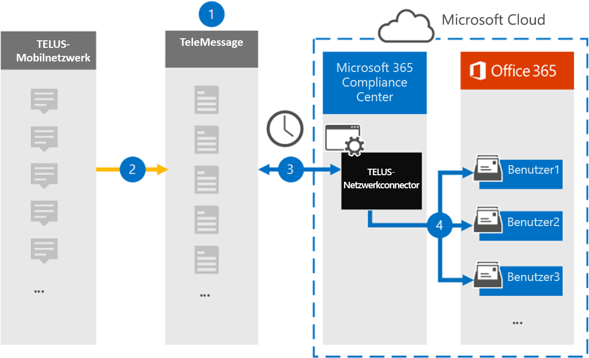

# Einrichten eines Connectors zum Archivieren von TELUS-Netzwerkdaten

Verwenden Sie den TeleMessage-Connector im Microsoft 365 Compliance Center, um Short Messaging Service (SMS)-Daten aus dem TELUS-Netzwerk Ihrer Organisation zu importieren und zu archivieren. Nachdem Sie einen Connector eingerichtet und konfiguriert haben, stellt er einmal täglich eine Verbindung mit dem TELUS-Netzwerk Ihrer Organisation her und importiert SMS Daten in Postfächer in Microsoft 365.

Nachdem SMS Nachrichten in Benutzerpostfächern gespeichert wurden, können Sie Microsoft 365 Compliancefeatures wie Beweissicherung, Inhaltssuche und Microsoft 365 Aufbewahrungsrichtlinien auf TELUS-Daten anwenden. Sie können z. B. TELUS SMS Nachrichten mithilfe der Inhaltssuche durchsuchen oder das Postfach, das die TELUS-Daten enthält, einem Verwahrer in einem Advanced eDiscovery Fall zuordnen. Die Verwendung eines TELUS-Netzwerkkonnektors zum Importieren und Archivieren von Daten in Microsoft 365 kann Ihrer Organisation helfen, die Einhaltung behördlicher und behördlicher Richtlinien zu halten.

## Übersicht über die Archivierung von TELUS-Netzwerkdaten

In der folgenden Übersicht wird der Prozess der Verwendung eines Connectors zum Archivieren von TELUS-Netzwerkdaten in Microsoft 365 erläutert.

1. Ihre Organisation arbeitet mit TeleMessage und TELUS zusammen, um einen TELUS-Netzwerkconnector einzurichten. Weitere Informationen finden Sie unter [TELUS Network Archiver](https://www.telemessage.com/office365-activation-for-telus-network-archiver/).

2. In Echtzeit werden SMS Nachrichten aus dem TELUS-Netzwerk Ihrer Organisation auf die TeleMessage-Website kopiert.

3. Der TELUS-Netzwerkconnector, den Sie im Microsoft 365 Compliance Center erstellen, stellt täglich eine Verbindung mit der TeleMessage-Website her und überträgt die SMS Nachrichten aus den letzten 24 Stunden an einen sicheren Azure Storage Standort in der Microsoft-Cloud. Der Connector konvertiert auch den Inhalt von SMS Nachrichten in ein E-Mail-Nachrichtenformat.

4. Der Connector importiert die Mobilen Kommunikationselemente in das Postfach eines bestimmten Benutzers. Ein neuer Ordner mit dem Namen **TELUS SMS Netzwerkarchivierer** wird im Postfach des bestimmten Benutzers erstellt, und die Elemente werden in das Postfach importiert. Der Connector verwendet die Zuordnung mithilfe des Werts der *E-Mail-Adresseigenschaft des Benutzers.* Jede SMS Nachricht enthält diese Eigenschaft, die mit der E-Mail-Adresse jedes Teilnehmers der SMS Nachricht aufgefüllt wird.

   Zusätzlich zur automatischen Benutzerzuordnung mithilfe des Werts der *E-Mail-Adresseigenschaft* des Benutzers können Sie auch eine benutzerdefinierte Zuordnung implementieren, indem Sie eine CSV-Zuordnungsdatei hochladen. Diese Zuordnungsdatei enthält die Mobiltelefonnummer und die entsprechende Microsoft 365 E-Mail-Adresse für Benutzer in Ihrer Organisation. Wenn Sie sowohl die automatische Benutzerzuordnung als auch die benutzerdefinierte Zuordnung aktivieren, untersucht der Connector zunächst für jedes TELUS-Element die benutzerdefinierte Zuordnungsdatei. Wenn kein gültiger Microsoft 365 Benutzer gefunden wird, der der Mobiltelefonnummer eines Benutzers entspricht, verwendet der Connector die Werte in der E-Mail-Adresseigenschaft des Elements, das importiert werden soll. Wenn der Connector keinen gültigen Microsoft 365 Benutzer in der benutzerdefinierten Zuordnungsdatei oder in der E-Mail-Adresseigenschaft des TELUS-Elements findet, wird das Element nicht importiert.

## Vor dem Einrichten eines Connectors

Einige der Implementierungsschritte, die zum Archivieren von TELUS-Netzwerkdaten erforderlich sind, befinden sich außerhalb Microsoft 365 und müssen abgeschlossen werden, bevor Sie einen Connector im Compliance Center erstellen können.

- Order the [TELUS Network Archiver service from TeleMessage](https://www.telemessage.com/mobile-archiver/order-mobile-archiver-for-o365) and get a valid administration account for your organization. Sie müssen sich bei diesem Konto anmelden, wenn Sie den Connector im Compliance Center erstellen.

- Beziehen Sie Ihre TELUS-Netzwerkkonto- und Abrechnungskontaktdetails, damit Sie die TeleMessage-Onboardingformulare ausfüllen und den Nachrichtenarchivierungsdienst von TELUS bestellen können.

- Registrieren Sie alle Benutzer, die TELUS SMS Netzwerkarchivierung benötigen, im TeleMessage-Konto. Achten Sie beim Registrieren von Benutzern darauf, die gleiche E-Mail-Adresse zu verwenden, die für ihr Microsoft 365 Konto verwendet wird.

- Ihre Mitarbeiter müssen über unternehmenseigene und unternehmenseigene Mobiltelefone imTELUS-Mobilnetzwerk verfügen. Archivierungsnachrichten in Microsoft 365 sind für Byod-Geräte (Bring Your Own Devices) von Mitarbeitern nicht verfügbar.

- Dem Benutzer, der einen TELUS-Netzwerkconnector erstellt, muss die Rolle "Postfachimportexport" in Exchange Online zugewiesen werden. Dies ist erforderlich, um Connectors auf der Seite **"Datenconnectors"** im Microsoft 365 Compliance Center hinzuzufügen. Standardmäßig ist diese Rolle keiner Rollengruppe in Exchange Online zugewiesen. Sie können die Rolle "Postfachimportexport" der Rollengruppe "Organisationsverwaltung" in Exchange Online hinzufügen. Sie können auch eine Rollengruppe erstellen, die Rolle "Postfachimportexport" zuweisen und dann die entsprechenden Benutzer als Mitglieder hinzufügen. Weitere Informationen finden Sie in den Abschnitten ["Erstellen von Rollengruppen"](/Exchange/permissions-exo/role-groups#create-role-groups) oder "Ändern von [Rollengruppen"](/Exchange/permissions-exo/role-groups#modify-role-groups) im Artikel "Verwalten von Rollengruppen in Exchange Online".

- Dieser Datenkonnektor ist in GCC Umgebungen in der Microsoft 365 US Government-Cloud verfügbar. Drittanbieteranwendungen und -dienste umfassen möglicherweise das Speichern, Übertragen und Verarbeiten der Kundendaten Ihrer Organisation auf Drittanbietersystemen, die sich außerhalb der Microsoft 365-Infrastruktur befinden und daher nicht unter die Verpflichtungen zur einhaltung der Microsoft 365 und zum Datenschutz fallen. Microsoft macht keine Darstellung, dass die Verwendung dieses Produkts zum Herstellen einer Verbindung mit Drittanbieteranwendungen impliziert, dass diese Drittanbieteranwendungen FEDRAMP-konform sind.

## Erstellen eines TELUS-Netzwerkconnectors

Nachdem Sie die im vorherigen Abschnitt beschriebenen Voraussetzungen erfüllt haben, können Sie einen TELUS-Netzwerkconnector im Microsoft 365 Compliance Center erstellen. Der Connector verwendet die von Ihnen bereitgestellten Informationen, um eine Verbindung mit der TeleMessage-Website herzustellen und SMS Nachrichten an die entsprechenden Benutzerpostfachfelder in Microsoft 365 zu übertragen.

1. Wechseln [https://compliance.microsoft.com](https://compliance.microsoft.com/) Sie zu **"Datenconnectors** TELUS Network", und klicken Sie dann auf  >  **"Datenconnectors".**

2. Klicken Sie auf der **Telus Network-Produktbeschreibungsseite** auf **"Connector hinzufügen".**

3. Klicken Sie auf der Seite **"Nutzungsbedingungen"** auf **"Annehmen".**

4. Geben Sie auf der Seite **"Bei TeleMessage anmelden"** unter Schritt 3 die erforderlichen Informationen in die folgenden Felder ein, und klicken Sie dann auf **"Weiter".**

   - **Benutzername:** Ihr TeleMessage-Benutzername.

   - **Kennwort:** Ihr TeleMessage-Kennwort.

5. Nachdem der Connector erstellt wurde, können Sie das Popupfenster schließen und zur nächsten Seite wechseln.

6. Aktivieren Sie auf der Seite **"Benutzerzuordnung"** die automatische Benutzerzuordnung, und klicken Sie auf **"Weiter".** Falls Sie eine csv-Datei mit benutzerdefinierter Zuordnung hochladen möchten, klicken Sie auf **"Weiter".**

7. Überprüfen Sie Ihre Einstellungen, und klicken Sie dann auf **Fertig stellen,** um den Connector zu erstellen.

8. Wechseln Sie zur Registerkarte Connectors auf der Seite **"Datenconnectors",** um den Fortschritt des Importvorgangs für den neuen Connector anzuzeigen.

## Bekannte Probleme

- Derzeit wird das Importieren von Anlagen oder Elementen, die größer als 10 MB sind, nicht unterstützt. Unterstützung für größere Elemente wird zu einem späteren Zeitpunkt verfügbar sein.
