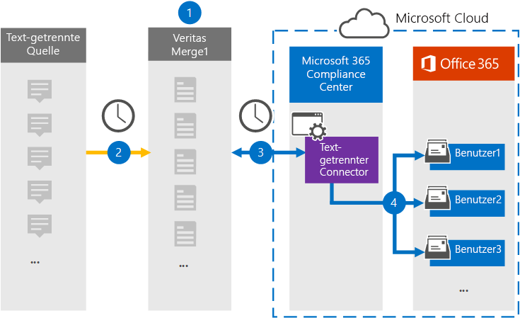

# Einrichten eines Connectors zum Archivieren von Text getrennten Daten (Vorschau)

Verwenden Sie einen Globanet-Connector im Microsoft 365 Compliance Center, um Text getrennte Daten in Benutzerpostfächer in Ihrer Microsoft 365-Organisation zu importieren und zu archivieren. [Globanet](https://globanet.com/merge1/) stellt einen Text getrennten Connector bereit, der zum Erfassen von Elementen aus einer Drittanbieter-Datenquelle (regelmäßig) und zum Importieren dieser Elemente in Microsoft 365 konfiguriert ist. Der Connector wandelt Inhalte aus der Text getrennten Datenquelle in ein e-Mail-Nachrichtenformat um und importiert diese Elemente dann in das Postfach des Benutzers in Microsoft 365.

Nachdem Text getrennte Daten in Benutzerpostfächern gespeichert wurden, können Sie Microsoft 365-Compliance-Features wie Beweissicherungsverfahren, eDiscovery, Aufbewahrungsrichtlinien und Aufbewahrungs Bezeichnungen sowie die Kompatibilität der Kommunikation anwenden. Die Verwendung eines Zoom-Besprechungs-Konnektors zum Importieren und Archivieren von Daten in Microsoft 365 kann dazu beitragen, dass Ihre Organisation mit behördlichen und behördlichen Richtlinien konform bleibt.

Nach der Archivierung kann die Text getrennte Quell Kommunikation beibehalten, auf die Einhaltung der Richtlinien überwacht und für eDiscovery und die interne Information Governance abgerufen werden.

## Übersicht über die Archivierung der Text getrennten Quelle

In der folgenden Übersicht wird erläutert, wie Sie mithilfe eines Konnektors die Text getrennten Quellinformationen in Microsoft 365 archivieren.

1. Ihre Organisation arbeitet mit der Text getrennten Quelle zusammen, um eine Text getrennte Website einzurichten und zu konfigurieren.

2. Alle 24 Stunden werden Chatnachrichten von der Text getrennten Quelle auf die Globanet Merge1-Website kopiert. Der Connector wandelt auch den Inhalt in ein e-Mail-Nachrichtenformat um.

3. Der durch Text getrennte Connector, den Sie im Microsoft 365 Compliance Center erstellen, stellt jeden Tag eine Verbindung mit der Globanet Merge1-Website her und überträgt die Nachrichten an einen sicheren Azure-Speicherort in der Microsoft-Cloud.

4. Der Connector importiert die konvertierten Nachrichtenelemente in die Postfächer bestimmter Benutzer, wobei der Wert der *Email* -Eigenschaft der automatischen Benutzerzuordnung wie in Schritt 3 beschrieben wird. Ein neuer Unterordner im Posteingangsordner mit dem Namen " **Text-Delimited** " wird in den Benutzerpostfächern erstellt, und die Nachrichtenelemente werden in diesen Ordner importiert. Der Connector verwendet den Wert der *Email* -Eigenschaft. Jede Nachricht enthält diese Eigenschaft, die mit der e-Mail-Adresse jedes Teilnehmers der Nachricht aufgefüllt wird.

## Vorabinformationen

- Erstellen Sie ein Globanet-Merge1-Konto für Microsoft-Connectors. Wenden Sie sich dazu an den [Globanet-Kunden Support](https://globanet.com/ms-connectors-contact). Sie müssen sich bei diesem Konto anmelden, wenn Sie den Connector in Schritt 1 erstellen.

- Der Benutzer, der den Text getrennten Connector in Schritt 1 erstellt (und in Schritt 3 vervollständigt wird), muss der Rolle "Post Fach Import/-Export" in Exchange Online zugewiesen sein. Diese Rolle ist für das Hinzufügen von Connectors auf der Seite **Daten Konnektoren** im Microsoft 365 Compliance Center erforderlich. Diese Rolle ist in Exchange Online standardmäßig keiner Rollengruppe zugewiesen. Sie können die Rolle "Post Fach Import exportieren" der Rollengruppe "Organisationsverwaltung" in Exchange Online hinzufügen. Sie können auch eine Rollengruppe erstellen, die Rolle "Post Fach Import Export" zuweisen und dann die entsprechenden Benutzer als Mitglieder hinzufügen. Weitere Informationen finden Sie im Abschnitt [Erstellen](https://docs.microsoft.com/Exchange/permissions-exo/role-groups#create-role-groups) von Rollengruppen oder [Ändern von Rollengruppen](https://docs.microsoft.com/Exchange/permissions-exo/role-groups#modify-role-groups) im Artikel "Verwalten von Rollengruppen in Exchange Online".

## Schritt 1: Einrichten des Text getrennten Connectors

Der erste Schritt besteht darin, auf die Seite " **Daten Konnektoren** " im Microsoft 365 Compliance Center zuzugreifen und einen Connector für Text getrennte Daten zu erstellen.

1. Wechseln Sie zu, [https://compliance.microsoft.com](https://compliance.microsoft.com/) und klicken Sie dann auf **Daten Konnektoren**mit  >  **Trenn**Zeichen.

2. Klicken Sie auf der Seite mit den **Text Trennzeichen** für Produktbeschreibungen auf **Connector hinzufügen**.

3. Klicken Sie auf der Seite **Nutzungsbedingungen** auf **annehmen**.

4. Geben Sie einen eindeutigen Namen ein, der den Connector identifiziert, und klicken Sie dann auf **weiter**.

5. Melden Sie sich bei Ihrem Merge1-Konto an, um den Connector zu konfigurieren.

## Schritt 2: Konfigurieren des Text getrennten Konnektors auf der Globanet-Merge1-Website

Der zweite Schritt besteht darin, den Text getrennten Connector in der Merge1-Website zu konfigurieren. Informationen zum Konfigurieren des Text getrennten Konnektors auf der Globanet-Merge1-Website finden Sie unter [Merge1 Third-Party Connectors User Guide](https://docs.ms.merge1.globanetportal.com/Merge1%20Third-Party%20Connectors%20Text-Delimited%20User%20Guide%20.pdf).

Nachdem Sie auf **& fertig stellen**klicken, werden Sie zum Microsoft 365 Compliance Center auf die Seite **Benutzerzuordnung** des Connector-Assistenten zurückgegeben.

## Schritt 3: Zuordnen von Benutzern und Abschließen des Connector-Setups

Führen Sie die folgenden Schritte aus, um Benutzer zuzuordnen und das Connector-Setup im Microsoft 365 Compliance Center abzuschließen:

1. Aktivieren Sie auf der Seite **externe Benutzer auf Microsoft 365-Benutzer zuordnen** die Option Automatische Benutzerzuordnung. Die Text getrennten Quellelemente enthalten eine Eigenschaft mit dem Namen " *e-Mail*", die e-Mail-Adressen für Benutzer in Ihrer Organisation enthält. Wenn der Connector diese Adresse einem Microsoft 365-Benutzer zuordnen kann, werden die Elemente in das Postfach dieses Benutzers importiert.

2. Klicken Sie auf der Seite **Administrator Zustimmung** auf die Schaltfläche **Zustimmung erteilen** . Sie werden zur Microsoft-Website umgeleitet. Klicken Sie auf **akzeptieren** , um die Zustimmung zu erteilen.

   Ihre Organisation muss einwilligen, dass der Office 365 Import Dienst auf Postfachdaten in Ihrer Organisation zugreifen kann. Um die Zustimmung des Administrators bereitzustellen, müssen Sie mit den Anmeldeinformationen eines globalen Administrators von Microsoft 365 angemeldet sein und dann die Zustimmungs Anforderung annehmen. Wenn Sie nicht als globaler Administrator angemeldet sind, können Sie zu [dieser Seite](https://login.microsoftonline.com/common/oauth2/authorize?client_id=570d0bec-d001-4c4e-985e-3ab17fdc3073&response_type=code&redirect_uri=https://portal.azure.com/&nonce=1234&prompt=admin_consent) wechseln und sich mit globalen Administratoranmeldeinformationen anmelden, um die Anforderung zu akzeptieren.

3. Klicken Sie auf **weiter**, überprüfen Sie Ihre Einstellungen, und wechseln Sie dann zur Seite **Daten Konnektoren** , um den Fortschritt des Importvorgangs für den neuen Connector anzuzeigen.

## Schritt 4: Überwachen des Text getrennten Connectors

Nachdem Sie den Text getrennten Connector erstellt haben, können Sie den Connectorstatus im Microsoft 365 Compliance Center anzeigen.

1. Wechseln Sie zu, [https://compliance.microsoft.com](https://compliance.microsoft.com) und klicken Sie im linken Navigationsbereich auf **Daten-Konnektoren** .

2. Klicken Sie auf die Registerkarte **Connectors** , und wählen Sie dann den **Text getrennten** Verbinder aus, um die Flyout-Seite anzuzeigen, die die Eigenschaften und Informationen zum Connector enthält.

3. Klicken Sie unter **Connectorstatus with Source**auf den Link **Download Protokoll** , um das Statusprotokoll für den Connector zu öffnen (oder zu speichern). Dieses Protokoll enthält Informationen zu den Daten, die in die Microsoft-Cloud importiert wurden.

## Bekannte Probleme

- Zurzeit wird kein Import von Anlagen unterstützt, die größer als 10 MB sind, aber die Unterstützung größerer Elemente wird zu einem späteren Zeitpunkt zur Verfügung stehen.
