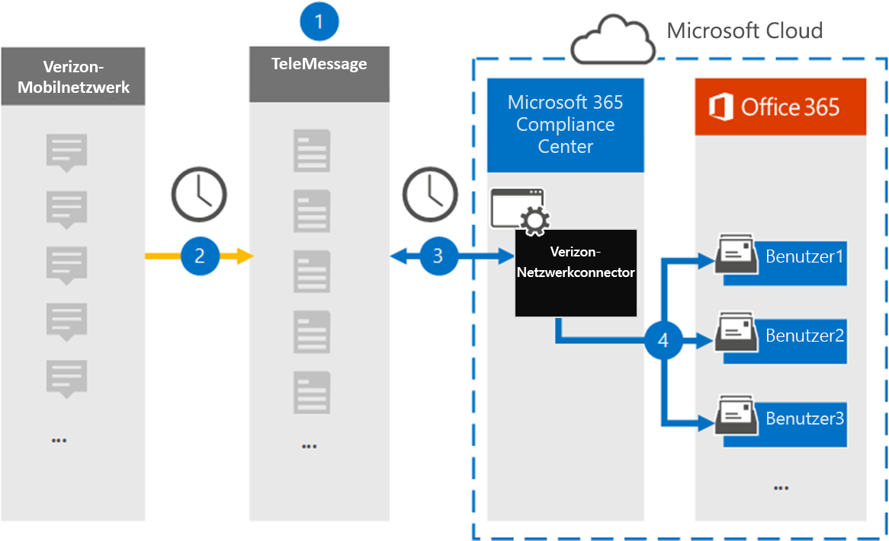

# Einrichten eines Connectors zum Archivieren von Verizon-NetzwerkdatenSet up a connector to archive Verizon Network data

Verwenden Sie den TeleMessage-Connector im Microsoft 365 Compliance Center zum Importieren und Archivieren von Short Messaging Service (SMS) und Multimedia Messaging Service (MMS)-Daten aus Verizon Network.Use the TeleMessage connector in the Microsoft 365 compliance center to import and archive Short Messaging Service (SMS) and Multimedia Messaging Service (MMS) data from Verizon Network. Nachdem Sie einen Connector eingerichtet und konfiguriert haben, stellt er einmal täglich eine Verbindung mit dem Verizon Network Ihrer Organisation und importiert SMS- und MMS-Daten in Postfächer in Microsoft 365.After you set up and configure a connector, it connects to your organization's Verizon Network once every day and imports SMS and MMS data to mailboxes in Microsoft 365.

Nachdem Verizon Network Connector-Daten in Benutzerpostfächern gespeichert wurden, können Sie Microsoft 365 Compliancefeatures wie z. B. Das Aufbewahrungsverfahren für Rechtsstreitigkeiten, die Inhaltssuche und Microsoft 365 Aufbewahrungsrichtlinien auf Verizon-Daten anwenden.After Verizon Network connector data is stored in user mailboxes, you can apply Microsoft 365 compliance features such as Litigation Hold, Content Search, and Microsoft 365 retention policies to Verizon data. Sie können z. B. Verizon-SMS- und MMS-Nachrichten mithilfe der Inhaltssuche durchsuchen oder das Postfach, das Verizon-Netzwerkdaten enthält, einem Verwahrer in einem Advanced eDiscovery zuordnen.For example, you can search Verizon SMS and MMS messages using Content Search or associate the mailbox that contains Verizon Network data with a custodian in an Advanced eDiscovery case. Die Verwendung eines Verizon-Netzwerkconnector zum Importieren und Archivieren von Daten in Microsoft 365 Kann Dazu beitragen, dass Ihre Organisation die Richtlinien von Behörden und Behörden einhalten kann.Using a Verizon Network connector to import and archive data in Microsoft 365 can help your organization stay compliant with government and regulatory policies.

## Übersicht über die Archivierung von Verizon-NetzwerkdatenOverview of archiving Verizon Network data

In der folgenden Übersicht wird der Prozess der Verwendung eines Connectors zum Archivieren von Verizon Network-Daten in Microsoft 365.The following overview explains the process of using a connector to archive Verizon Network data in Microsoft 365.

1. Ihre Organisation arbeitet mit TeleMessage und Verizon zusammen, um einen Verizon-Netzwerkconnector zu einrichten.Your organization works with TeleMessage and Verizon to set up a Verizon Network connector. Weitere Informationen finden Sie unter [Verizon Network Archiver](https://www.telemessage.com/office365-activation-for-verizon-network-archiver/).For more information, see [Verizon Network Archiver](https://www.telemessage.com/office365-activation-for-verizon-network-archiver/).

2. Alle 24 Stunden werden SMS und MMS-Nachrichten aus dem Verizon Network Ihrer Organisation auf die TeleMessage-Website kopiert.Once every 24 hours, SMS and MMS messages from your organization’s Verizon Network are copied to the TeleMessage site.

3. Der verizon-Netzwerkconnector, den Sie im Microsoft 365 Compliance Center erstellen, verbindet sich täglich mit dem TeleMessage-Standort und überträgt die SMS- und MMS-Nachrichten aus den vorherigen 24 Stunden an einen sicheren Azure Storage-Standort in der Microsoft-Cloud.The Verizon Network connector that you create in the Microsoft 365 compliance center connects to the TeleMessage site every day and transfers the SMS and MMS messages from the previous 24 hours to a secure Azure Storage location in the Microsoft cloud. Der Connector konvertiert auch den Inhalt von SMS und MMS-Nachrichten in ein E-Mail-Nachrichtenformat.The connector also converts the content of SMS and MMS messages to an email message format.

4. Der Connector importiert die mobilen Kommunikationselemente in das Postfach eines bestimmten Benutzers.The connector imports the mobile communication items to the mailbox of a specific user. Ein neuer Ordner namens **Verizon SMS/MMS Network Archiver** wird im Postfach des bestimmten Benutzers erstellt, und die Elemente werden in das Postfach importiert.A new folder named **Verizon SMS/MMS Network Archiver** is created in the specific user's mailbox and the items are imported to it. Der Connector führt diese Zuordnung mithilfe des Werts der E-Mail-Adresseigenschaft *des Benutzers* aus.The connector does this mapping by using the value of the *User’s Email address* property. Jede SMS und MMS-Nachricht enthält diese Eigenschaft, die mit der E-Mail-Adresse jedes Teilnehmers der Nachricht aufgefüllt wird.Every SMS and MMS message contains this property, which is populated with the email address of every participant of the message.

   Neben der automatischen Benutzerzuordnung mithilfe  des Werts der E-Mail-Adresseigenschaft des Benutzers können Sie auch benutzerdefinierte Zuordnungen implementieren, indem Sie eine CSV-Zuordnungsdatei hochladen.In addition to automatic user mapping using the value of the *User’s Email address* property, you can also implement custom mapping by uploading a CSV mapping file. Diese Zuordnungsdatei enthält die Mobiltelefonnummer und die Microsoft 365 E-Mail-Adresse für Benutzer in Ihrer Organisation.This mapping file contains the mobile phone number and corresponding Microsoft 365 email address for users in your organization. Wenn Sie sowohl die automatische Benutzerzuordnung als auch die benutzerdefinierte Zuordnung aktivieren, betrachtet der Connector zunächst für jedes Verizon-Element die benutzerdefinierte Zuordnungsdatei.If you enable both automatic user mapping and custom mapping, for every Verizon item the connector first looks at custom mapping file. Wenn kein gültiger benutzer Microsoft 365, der der Mobiltelefonnummer eines Benutzers entspricht, verwendet der Connector die Werte in der E-Mail-Adresse-Eigenschaft des Elements, das importiert werden soll.If it doesn't find a valid Microsoft 365 user that corresponds to a user's mobile phone number, the connector will use the values in the email address property of the item it's trying to import. Wenn der Connector keinen gültigen Microsoft 365 in der benutzerdefinierten Zuordnungsdatei oder in der E-Mail-Adresseigenschaft des Verizon-Elements findet, wird das Element nicht importiert.If the connector doesn't find a valid Microsoft 365 user in either the custom mapping file or in the email address property of the Verizon item, the item won't be imported.

## Bevor Sie beginnenBefore you begin

Einige der Implementierungsschritte, die zum Archivieren von Verizon-Netzwerkdaten erforderlich sind, sind außerhalb von Microsoft 365 und müssen abgeschlossen werden, bevor Sie einen Connector im Compliance Center erstellen können.Some of the implementation steps required to archive Verizon Network data are external to Microsoft 365 and must be completed before you can create a connector in the compliance center.

- Bestellen Sie [den Verizon Network Archiver-Dienst bei TeleMessage,](https://www.telemessage.com/mobile-archiver/order-mobile-archiver-for-o365) und erhalten Sie ein gültiges Verwaltungskonto für Ihre Organisation.Order the [Verizon Network Archiver service from TeleMessage](https://www.telemessage.com/mobile-archiver/order-mobile-archiver-for-o365) and get a valid administration account for your organization. Sie müssen sich bei diesem Konto anmelden, wenn Sie den Connector im Compliance Center erstellen.You'll need to sign into this account when you create the connector in the compliance center.

- Rufen Sie Ihre Verizon Network-Konto- und Abrechnungskontaktdetails ab, damit Sie die TeleMessage-Onboardingformulare ausfüllen und den Nachrichtenarchivierungsdienst bei Verizon bestellen können.Obtain your Verizon Network account and billing contact details so you can fill-out the TeleMessage onboarding forms and order the message archiving service from Verizon.

- Registrieren Sie alle Benutzer, die Verizon-SMS und MMS-Archivierung benötigen, im TeleMessage-Konto.Register all users that require Verizon SMS and MMS archiving in the TeleMessage account. Achten Sie beim Registrieren von Benutzern darauf, die gleiche E-Mail-Adresse zu verwenden, die für ihr Konto Microsoft 365 wird.When registering users, be sure to use the same email address that's used for their Microsoft 365 account.

- Ihre Mitarbeiter müssen über unternehmenseigene und unternehmensverlässige Mobiltelefone im Verizon-Mobilfunknetz verfügen.Your employees must have corporate-owned and corporate-liable mobile phones on the Verizon mobile network. Archivierungsnachrichten in Microsoft 365 nicht für Geräte im Besitz von Mitarbeitern oder Bring Your Own Devices (BYOD) verfügbar.Archiving messages in Microsoft 365 isn't available for employee-owned or Bring Your Own Devices (BYOD) devices.

- Dem Benutzer, der einen Verizon-Netzwerkconnector erstellt, muss die Rolle Postfachimportexport in der Exchange Online.The user who creates a Verizon Network connector must be assigned the Mailbox Import Export role in Exchange Online. Dies ist erforderlich, um Connectors auf der Seite **Datenconnectors** im compliance center Microsoft 365 hinzufügen.This is required to add connectors in the **Data connectors** page in the Microsoft 365 compliance center. Standardmäßig ist diese Rolle keiner Rollengruppe in Exchange Online zugewiesen.By default, this role isn't assigned to any role group in Exchange Online. Sie können die Rolle Postfachimportexport zur Rollengruppe Organisationsverwaltung in der Exchange Online.You can add the Mailbox Import Export role to the Organization Management role group in Exchange Online. Sie können auch eine Rollengruppe erstellen, die Rolle Postfachimportexport zuweisen und dann die entsprechenden Benutzer als Mitglieder hinzufügen.Or you can create a role group, assign the Mailbox Import Export role, and then add the appropriate users as members. Weitere Informationen finden Sie in den Abschnitten [Erstellen](/Exchange/permissions-exo/role-groups#create-role-groups) von Rollengruppen oder [Ändern](/Exchange/permissions-exo/role-groups#modify-role-groups) von Rollengruppen im Artikel "Verwalten von Rollengruppen in Exchange Online".For more information, see the [Create role groups](/Exchange/permissions-exo/role-groups#create-role-groups) or [Modify role groups](/Exchange/permissions-exo/role-groups#modify-role-groups) sections in the article "Manage role groups in Exchange Online".

## Erstellen eines Verizon-NetzwerkconnectorCreate a Verizon Network connector

Nachdem Sie die im vorherigen Abschnitt beschriebenen Voraussetzungen erfüllt haben, können Sie verizon Network connector im Microsoft 365 erstellen.After you've completed the prerequisites described in the previous section, you can create Verizon Network connector in the Microsoft 365 compliance center. Der Connector verwendet die informationen, die Sie bereitstellen, um eine Verbindung mit der TeleMessage-Website herzustellen und SMS- und MMS-Nachrichten an die entsprechenden Benutzerpostfächer in Microsoft 365.The connector uses the information you provide to connect to the TeleMessage site and transfer SMS and MMS messages to the corresponding user mailbox boxes in Microsoft 365.

1. Wechseln Sie [https://compliance.microsoft.com](https://compliance.microsoft.com) zu, und klicken Sie dann auf **Datenconnectors**  >  **Verizon Network**.Go to [https://compliance.microsoft.com](https://compliance.microsoft.com) and then click **Data connectors** > **Verizon Network**.

2. Klicken Sie **auf der Seite Produktbeschreibung für Verizon Network** auf Connector **hinzufügen.**On the **Verizon Network** product description page, click **Add connector**

3. Klicken Sie **auf der Seite Nutzungsbedingungen** auf **Akzeptieren**.On the **Terms of service** page, click **Accept**.

4. Geben Sie **auf der Seite Bei TeleMessage** anmelden unter Schritt 3 die erforderlichen Informationen in die folgenden Felder ein, und klicken Sie dann auf **Weiter**.On the **Login to TeleMessage** page, under Step 3, enter the required information in the following boxes and then click **Next**.
  
   - **Benutzername:** Ihr TeleMessage-Benutzername.**Username:** Your TeleMessage username.

   - **Kennwort:** Ihr TeleMessage-Kennwort.**Password:** Your TeleMessage password.

5. Nachdem der Connector erstellt wurde, können Sie das Popupfenster schließen und zur nächsten Seite wechseln.After the connector is created, you can close the pop-up window and go to the next page.

6. Aktivieren Sie **auf der Seite** Benutzerzuordnung die automatische Benutzerzuordnung, und klicken Sie auf **Weiter**.On the **User mapping** page, enable automatic user mapping and click **Next**. Falls Sie eine benutzerdefinierte Zuordnung benötigen, laden Sie eine CSV-Datei hoch, und klicken Sie auf **Weiter**.In case you need custom mapping upload a CSV file, and click **Next**.

7. Überprüfen Sie Ihre Einstellungen, und klicken Sie dann auf **Fertig stellen,** um den Connector zu erstellen.Review your settings, and then click **Finish** to create the connector.

8. Wechseln Sie auf der Seite **Datenconnectors** zur Registerkarte Connectors, um den Fortschritt des Importvorgangs für den neuen Connector zu sehen.Go to the Connectors tab in **Data connectors** page to see the progress of the import process for the new connector.

## Bekannte ProblemeKnown issues

- Derzeit wird das Importieren von Anlagen oder Elementen, die größer als 10 MB sind, nicht unterstützt.At this time, we don't support importing attachments or items that are larger than 10 MB. Unterstützung für größere Elemente wird zu einem späteren Zeitpunkt verfügbar sein.Support for larger items will be available at a later date.