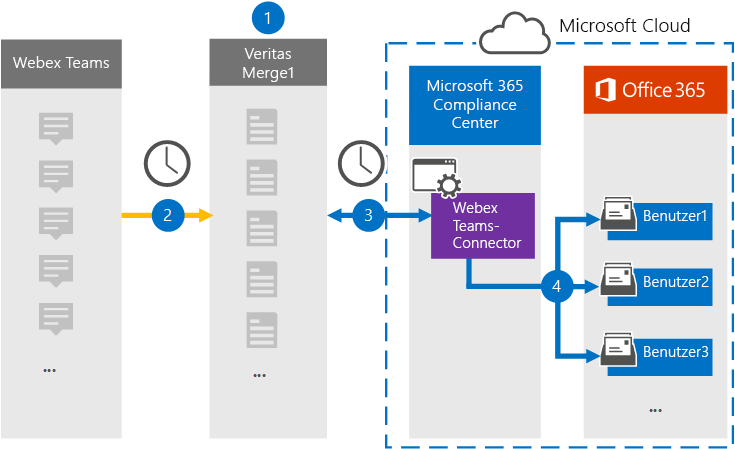

# Einrichten eines Connectors zum Archivieren von WebEx-Teams-Daten (Vorschau)Set up a connector to archive Webex Teams data (preview)

Verwenden Sie einen Globanet-Connector im Microsoft 365 Compliance Center, um Daten aus WebEx-Teams in Benutzerpostfächer in Ihrer Microsoft 365-Organisation zu importieren und zu archivieren.Use a Globanet connector in the Microsoft 365 compliance center to import and archive data from Webex Teams to user mailboxes in your Microsoft 365 organization. Globanet bietet einen [WebEx Teams](https://globanet.com/webex-teams/) -Connector, der zum Erfassen von WebEx-Teams-Kommunikations Elementen und zum Importieren dieser Daten in Microsoft 365 konfiguriert ist.Globanet provides a [Webex Teams](https://globanet.com/webex-teams/) connector that is configured to capture Webex Teams communication items and import them to Microsoft 365. Der Connector wandelt Inhalte aus WebEx-Teams, wie 1:1-Chats, Gruppenunterhaltungen, Kanal Unterhaltungen und Anlagen aus dem WebEx Teams Ihres Unternehmens, in ein e-Mail-Nachrichtenformat um und importiert diese Elemente dann in das Postfach des Benutzers in Microsoft 365.The connector converts content from Webex Teams, such as 1:1 chats, group conversations, channel conversations, and attachments from your organization's Webex Teams account, to an email message format and then imports those items to the user's mailbox in Microsoft 365.

Nachdem die Daten von WebEx Teams in Benutzerpostfächern gespeichert wurden, können Sie Microsoft 365-Compliance-Features wie Beweissicherungsverfahren, eDiscovery, Aufbewahrungsrichtlinien und Aufbewahrungs Bezeichnungen sowie die Kompatibilität der Kommunikation anwenden.After Webex Teams data is stored in user mailboxes, you can apply Microsoft 365 compliance features such as Litigation Hold, eDiscovery, retention policies and retention labels, and communication compliance. Die Verwendung eines WebEx Teams-Connectors zum Importieren und Archivieren von Daten in Microsoft 365 kann dazu beitragen, dass Ihre Organisation mit behördlichen und behördlichen Richtlinien konform bleibt.Using a Webex Teams connector to import and archive data in Microsoft 365 can help your organization stay compliant with government and regulatory policies.

## Übersicht über das Archivieren von WebEx-TeamsOverview of archiving Webex Teams

In der folgenden Übersicht wird der Vorgang der Verwendung eines Connectors zum Archivieren von WebEx-Teams-Daten in Microsoft 365 erläutert.The following overview explains the process of using a connector to archive Webex Teams data in Microsoft 365.

1. Ihre Organisation arbeitet mit WebEx-Teams zusammen, um eine WebEx Teams-Website einzurichten und zu konfigurieren.Your organization works with Webex Teams to set up and configure a Webex Teams site.

2. Einmal alle 24 Stunden werden WebEx Teams-Elemente auf die Globanet Merge1-Website kopiert.Once every 24 hours, Webex Teams items are copied to the Globanet Merge1 site. Der Connector wandelt auch die WebEx Teams-Elemente in ein e-Mail-Nachrichtenformat um.The connector also converts the Webex Teams items to an email message format.

3. Der WebEx Teams-Connector, den Sie im Microsoft 365 Compliance Center erstellen, stellt jeden Tag eine Verbindung mit dem Globanet Merge1 her und überträgt die Produkte von WebEx Teams an einen sicheren Azure-Speicherort in der Microsoft-Cloud.The Webex Teams connector that you create in the Microsoft 365 compliance center, connects to the Globanet Merge1 every day, and transfers the Webex Teams items to a secure Azure Storage location in the Microsoft cloud.

4. Der Connector importiert Elemente in die Postfächer bestimmter Benutzer, indem er den Wert der *Email* -Eigenschaft der automatischen Benutzerzuordnung wie in [Schritt 3](#step-3-map-users-and-complete-the-connector-setup)beschrieben verwendet.The connector imports items to the mailboxes of specific users by using the value of the *Email* property of the automatic user mapping as described in [Step 3](#step-3-map-users-and-complete-the-connector-setup). Ein Unterordner im Ordner "Posteingang" mit dem Namen " **WebEx Teams** " wird in den Benutzerpostfächern erstellt, und die Elemente werden in diesen Ordner importiert.A subfolder in the Inbox folder named **Webex Teams** is created in the user mailboxes, and the items are imported to that folder. Der Connector verwendet den Wert der *Email* -Eigenschaft.The connector does this by using the value of the *Email* property. Jedes WebEx Teams-Element enthält diese Eigenschaft, die mit der e-Mail-Adresse jedes Teilnehmers des Elements aufgefüllt wird.Every Webex Teams item contains this property, which is populated with the email address of every participant of the item.

## Bevor Sie beginnen:Before you begin

- Erstellen Sie ein Globanet-Merge1-Konto, indem Sie die allgemeinen Geschäftsbedingungen für einen WebEx Teams-Connector akzeptieren.Create a Globanet Merge1 account by accepting the terms and conditions for a Webex Teams connector. Wenden Sie sich dazu an den [Globanet-Kunden Support](https://globanet.com/contact-us).To do this, contact [Globanet Customer Support](https://globanet.com/contact-us). Sie müssen sich bei diesem Konto anmelden, wenn Sie den Connector in Schritt 1 erstellen.You need to sign into this account when you create the connector in Step 1.

- Erstellen Sie eine Anwendung [https://developer.webex.com/](https://developer.webex.com) zum Abrufen von Daten aus Ihrem WebEx Teams-Konto.Create an application at [https://developer.webex.com/](https://developer.webex.com) to fetch data from your Webex Teams account. Eine Schritt-für-Schritt-Anleitung zum Erstellen der Anwendung finden Sie unter [Merge1 Third-Party Connectors User Guide](https://docs.ms.merge1.globanetportal.com/Merge1%20Third-Party%20Connectors%20Webex%20Teams%20User%20Guide%20.pdf) .For step-by step instructions about creating the application, see [Merge1 Third-Party Connectors User Guide](https://docs.ms.merge1.globanetportal.com/Merge1%20Third-Party%20Connectors%20Webex%20Teams%20User%20Guide%20.pdf)

   Wenn Sie diese Anwendung erstellen, generiert die WebEx-Plattform eine Reihe eindeutiger Anmeldeinformationen.When you create this application, the Webex platform generates a set of unique credentials. Diese Anmeldeinformationen werden in Schritt 2 verwendet, wenn Sie den WebEx Teams-Connector auf der globalen Merge1-Website konfigurieren.These credentials are used in Step 2 when you configure the Webex Teams connector on the Global Merge1 site.

- Der Benutzer, der den WebEx Teams-Connector in Schritt 1 erstellt (und diesen in Schritt 3 ausführt) muss der Rolle "Post Fach Import Export" in Exchange Online zugewiesen sein.The user who creates the Webex Teams connector in Step 1 (and completes it in Step 3) must be assigned to the Mailbox Import Export role in Exchange Online. Diese Rolle ist für das Hinzufügen von Connectors auf der Seite **Daten Konnektoren** im Microsoft 365 Compliance Center erforderlich.This role is required to add connectors on the **Data connectors** page in the Microsoft 365 compliance center. Diese Rolle ist in Exchange Online standardmäßig keiner Rollengruppe zugewiesen.By default, this role is not assigned to any role group in Exchange Online. Sie können die Rolle "Post Fach Import exportieren" der Rollengruppe "Organisationsverwaltung" in Exchange Online hinzufügen.You can add the Mailbox Import Export role to the Organization Management role group in Exchange Online. Sie können auch eine Rollengruppe erstellen, die Rolle "Post Fach Import Export" zuweisen und dann die entsprechenden Benutzer als Mitglieder hinzufügen.Or you can create a role group, assign the Mailbox Import Export role, and then add the appropriate users as members. Weitere Informationen finden Sie im Abschnitt [Erstellen](https://docs.microsoft.com/Exchange/permissions-exo/role-groups#create-role-groups) von Rollengruppen oder [Ändern von Rollengruppen](https://docs.microsoft.com/Exchange/permissions-exo/role-groups#modify-role-groups) im Artikel "Verwalten von Rollengruppen in Exchange Online".For more information, see the [Create role groups](https://docs.microsoft.com/Exchange/permissions-exo/role-groups#create-role-groups) or [Modify role groups](https://docs.microsoft.com/Exchange/permissions-exo/role-groups#modify-role-groups) sections in the article "Manage role groups in Exchange Online".

## Schritt 1: Einrichten des WebEx Teams-ConnectorsStep 1: Set up the Webex Teams connector

Der erste Schritt besteht darin, Zugriff auf die **Daten Konnektoren** zu erhalten und den [WebEx Teams](https://globanet.com/webex-teams/) -Connector einzurichten.The first step is to gain access to the **Data Connectors** and set up the [Webex Teams](https://globanet.com/webex-teams/) connector.

1. Wechseln Sie zu, [https://compliance.microsoft.com](https://compliance.microsoft.com/) und klicken Sie dann auf **Daten Konnektoren**für  >  **WebEx Teams**.Go to [https://compliance.microsoft.com](https://compliance.microsoft.com/) and then click **Data connectors** > **Webex Teams**.

2. Klicken Sie auf der Seite Produktbeschreibung für **WebEx-Teams** auf **Connector hinzufügen**.On the **Webex Teams** product description page, click **Add connector**.

3. Klicken Sie auf der Seite **Nutzungsbedingungen** auf **annehmen**.On the **Terms of service** page, click **Accept**.

4. Geben Sie einen eindeutigen Namen ein, der den Connector identifiziert, und klicken Sie dann auf **weiter**.Enter a unique name that identifies the connector, and then click **Next**.

5. Melden Sie sich bei Ihrem Merge1-Konto an, um den Connector zu konfigurieren.Sign in to your Merge1 account to configure the connector.

## Schritt 2: Konfigurieren des WebEx Teams-Connectors auf der Globanet Merge1-WebsiteStep 2: Configure the Webex Teams connector on the Globanet Merge1 site

Der zweite Schritt besteht darin, den WebEx Teams-Connector auf der Merge1-Website zu konfigurieren.The second step is to configure the Webex Teams connector on the Merge1 site. Informationen zum Konfigurieren des WebEx Teams-Connectors finden Sie unter [Merge1 Third-Party Connectors User Guide](https://docs.ms.merge1.globanetportal.com/Merge1%20Third-Party%20Connectors%20Webex%20Teams%20User%20Guide%20.pdf).For information about how to configure the Webex Teams connector, see [Merge1 Third-Party Connectors User Guide](https://docs.ms.merge1.globanetportal.com/Merge1%20Third-Party%20Connectors%20Webex%20Teams%20User%20Guide%20.pdf).

Nachdem Sie auf **& fertig stellen**klicken, werden Sie zurück zum Microsoft 365 Compliance Center auf die Seite **Benutzerzuordnung** im Connector-Assistenten umgeleitet.After you click **Save & Finish**, you are directed back to the Microsoft 365 compliance center, to the **User mapping** page in the connector wizard.

## Schritt 3: Zuordnen von Benutzern und Abschließen des Connector-SetupsStep 3: Map users and complete the connector setup

Führen Sie die folgenden Schritte aus, um Benutzer zuzuordnen und das Connector-Setup im Microsoft 365 Compliance Center abzuschließen:To map users and complete the connector setup in the Microsoft 365 compliance center, follow these steps:

1. Aktivieren Sie auf der Seite **WebEx Teams-Benutzer auf Microsoft 365-Benutzer zuordnen** die Option Automatische Benutzerzuordnung.On the **Map Webex Teams users to Microsoft 365 users** page, enable automatic user mapping. Die WebEx Teams-Elemente enthalten eine Eigenschaft mit dem Namen " *e-Mail*", die e-Mail-Adressen für Benutzer in Ihrer Organisation enthält.The Webex Teams items include a property called *Email*, which contains email addresses for users in your organization. Wenn der Connector diese Adresse einem Microsoft 365-Benutzer zuordnen kann, werden die Elemente in das Postfach dieses Benutzers importiert.If the connector can associate this address with a Microsoft 365 user, the items are imported to that user’s mailbox.

2. Klicken Sie auf der Seite **Administrator Zustimmung** auf die Schaltfläche **Zustimmung erteilen** .On the **Admin Consent** page, click the **Provide Consent** button. Sie werden zur Microsoft-Website umgeleitet.You will be redirected to the Microsoft site. Klicken Sie auf **akzeptieren** , um die Zustimmung zu erteilen.Click **Accept** to provide the consent.
  
   Ihre Organisation muss einwilligen, dass der Office 365 Import Dienst auf Postfachdaten in Ihrer Organisation zugreifen kann.Your organization must consent to allow the Office 365 Import service to access mailbox data in your organization. Um die Zustimmung des Administrators bereitzustellen, müssen Sie mit den Anmeldeinformationen eines globalen Administrators von Microsoft 365 angemeldet sein und dann die Zustimmungs Anforderung annehmen.To provide admin consent, you must be signed in with the credentials of a Microsoft 365 global admin, and then accept the consent request. Wenn Sie nicht als globaler Administrator angemeldet sind, können Sie zu [dieser Seite](https://login.microsoftonline.com/common/oauth2/authorize?client_id=570d0bec-d001-4c4e-985e-3ab17fdc3073&response_type=code&redirect_uri=https://portal.azure.com/&nonce=1234&prompt=admin_consent) wechseln und sich mit globalen Administratoranmeldeinformationen anmelden, um die Anforderung zu akzeptieren.If you aren't signed in as a global admin, you can go to [this page](https://login.microsoftonline.com/common/oauth2/authorize?client_id=570d0bec-d001-4c4e-985e-3ab17fdc3073&response_type=code&redirect_uri=https://portal.azure.com/&nonce=1234&prompt=admin_consent) and sign in using global admin credentials to accept the request.

3. Klicken Sie auf **weiter**, überprüfen Sie Ihre Einstellungen, und wechseln Sie dann zur Seite **Daten Konnektoren** , um den Fortschritt des Importvorgangs für den neuen Connector anzuzeigen.Click **Next**, review your settings, and then go to the **Data connectors** page to see the progress of the import process for the new connector.

## Schritt 4: Überwachen des WebEx Teams-ConnectorsStep 4: Monitor the Webex Teams connector

Nachdem Sie den WebEx Teams-Connector erstellt haben, können Sie den Connectorstatus im Microsoft 365 Compliance Center anzeigen.After you create the Webex Teams connector, you can view the connector status in the Microsoft 365 compliance center.

1. Wechseln Sie zu, [https://compliance.microsoft.com](https://compliance.microsoft.com) und klicken Sie im linken Navigationsbereich auf **Daten-Konnektoren** .Go to [https://compliance.microsoft.com](https://compliance.microsoft.com) and click **Data connectors** in the left nav.

2. Klicken Sie auf die Registerkarte **Connectors** , und wählen Sie den **WebEx Teams** -Konnektor aus, um die Flyout-Seite mit den Eigenschaften und Informationen zum Connector anzuzeigen.Click the **Connectors** tab and then select the **Webex Teams** connector to display the flyout page, which contains the properties and information about the connector.

3. Klicken Sie unter **Connectorstatus with Source**auf den Link **Download Protokoll** , um das Statusprotokoll für den Connector zu öffnen (oder zu speichern).Under **Connector status with source**, click the **Download log** link to open (or save) the status log for the connector. Dieses Protokoll enthält Informationen zu den Daten, die in die Microsoft-Cloud importiert wurden.This log contains information about the data that has been imported to the Microsoft cloud.

## Bekannte ProblemeKnown issues

- Zurzeit wird kein Import von Anlagen unterstützt, die größer als 10 MB sind, aber die Unterstützung größerer Elemente wird zu einem späteren Zeitpunkt zur Verfügung stehen.At this time, we don't support importing attachments larger than 10 MB but support for larger items will be available at a later date.
