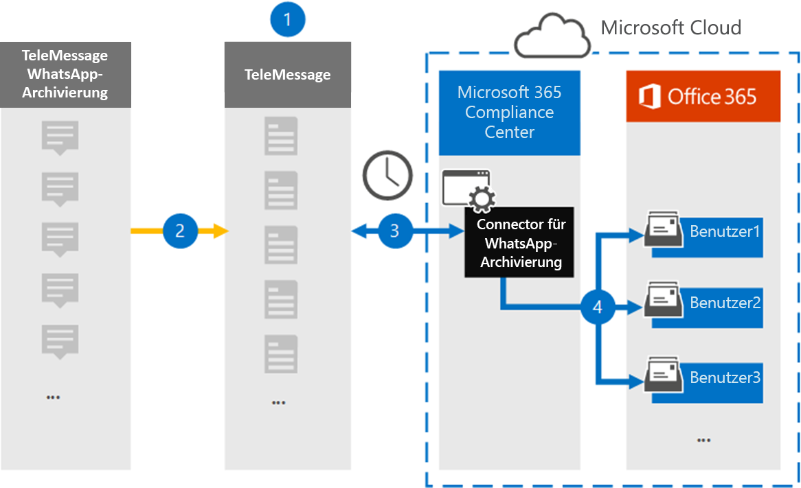

# Einrichten eines Connectors zum Archivieren von WhatsApp-Daten (Vorschau)

Verwenden Sie den TeleMessage Connector im Microsoft 365 Compliance Center, um WhatsApp-Anrufe, Chats, Anhänge, Dateien und gelöschte Nachrichten zu importieren und zu archivieren. Nachdem Sie einen Connector eingerichtet und konfiguriert haben, stellt er einmal täglich eine Verbindung mit dem Tele Nachrichtenkonto Ihrer Organisation her und importiert die mobile Kommunikation der Mitarbeiter mit dem TeleMessage whatsapp-Telefon Archiver oder dem TeleMessage whatsapp Cloud Archiver zu Postfächern in Microsoft 365.

Nachdem WhatsApp-Daten in Benutzerpostfächern gespeichert wurden, können Sie Microsoft 365-Compliance-Features wie Beweissicherungsverfahren, Inhaltssuche und Microsoft 365-Aufbewahrungsrichtlinien auf Verizon-Daten anwenden. Beispielsweise können Sie whatsapp-Nachrichten mithilfe der Inhaltssuche durchsuchen oder das Postfach, das whatsapp-Nachrichten enthält, einer Depotbank in einem erweiterten eDiscovery-Fall zuordnen. Die Verwendung eines WhatsApp-Connectors zum Importieren und Archivieren von Daten in Microsoft 365 kann dazu beitragen, dass Ihre Organisation mit behördlichen und behördlichen Richtlinien konform bleibt.

## Übersicht über die Archivierung von WhatsApp-Daten

In der folgenden Übersicht wird der Vorgang der Verwendung eines Connectors zum Archivieren von WhatsApp-Daten in Microsoft 365 erläutert.

1. Ihre Organisation arbeitet mit TeleMessage zusammen, um einen WhatsApp Archiver-Konnektor einzurichten. Weitere Informationen finden Sie unter [WhatsApp Archiver](https://www.telemessage.com/office365-activation-for-whatsapp-archiver).

2. Einmal alle 24 Stunden werden die WhatsApp-Daten Ihrer Organisation auf die TeleMessage-Website kopiert.

3. Der whatsapp-Connector, den Sie im Microsoft 365 Compliance Center erstellen, stellt jeden Tag eine Verbindung mit der TeleMessage-Website her und überträgt WhatsApp-Daten aus den vorherigen 24 Stunden an einen sicheren Azure-Speicherort in der Microsoft-Cloud. Der Connector wandelt auch die Inhalts-WhatsApp-Daten in ein e-Mail-Nachrichtenformat um.

4. Der Connector importiert WhatsApp-Daten in das Postfach eines bestimmten Benutzers. Ein neuer Ordner mit dem Namen **WhatsApp Archiver** wird im Postfach des jeweiligen Benutzers erstellt, und die Elemente werden darin importiert. Der Connector führt diese Zuordnung mithilfe des Werts der *e-Mail-Adress* Eigenschaft des Benutzers aus. Jede WhatsApp-Nachricht enthält diese Eigenschaft, die mit der e-Mail-Adresse jedes Teilnehmers der Nachricht aufgefüllt wird.

   Zusätzlich zur automatischen Benutzerzuordnung mithilfe des Werts der *e-Mail-Adress* Eigenschaft des Benutzers können Sie auch eine benutzerdefinierte Zuordnung implementieren, indem Sie eine CSV-Zuordnungsdatei hochladen. Diese Zuordnungsdatei enthält die Mobiltelefonnummer und die entsprechende Microsoft 365-e-Mail-Adresse für Benutzer in Ihrer Organisation. Wenn Sie sowohl die automatische Benutzerzuordnung als auch die benutzerdefinierte Zuordnung aktivieren, sucht der Connector für jedes WhatsApp-Element zuerst die benutzerdefinierte Zuordnungsdatei. Wenn kein gültiger Microsoft 365-Benutzer gefunden wird, der der Mobiltelefonnummer eines Benutzers entspricht, verwendet der Connector die Werte in der e-Mail-Adress Eigenschaft des Elements, das er zu importieren versucht. Wenn der Connector einen gültigen Microsoft 365-Benutzer weder in der benutzerdefinierten Zuordnungsdatei noch in der e-Mail-Adress Eigenschaft des WhatsApp-Elements findet, wird das Element nicht importiert.

## Bevor Sie beginnen

Einige der Implementierungsschritte, die zum Archivieren von WhatsApp-Kommunikationsdaten erforderlich sind, sind extern bei Microsoft 365 und müssen abgeschlossen sein, bevor Sie den Connector im Compliance Center erstellen können.

- Bestellen Sie den [WhatsApp Archiver-Dienst über telemessaging](https://www.telemessage.com/mobile-archiver/order-mobile-archiver-for-o365) , und erhalten Sie ein gültiges Verwaltungskonto für Ihre Organisation. Sie müssen sich bei diesem Konto anmelden, wenn Sie den Connector im Compliance Center erstellen.

- Registrieren Sie alle Benutzer, die WhatsApp-Archivierung benötigen, im TeleMessage-Konto. Achten Sie beim Registrieren von Benutzern darauf, dieselbe e-Mail-Adresse zu verwenden, die für Ihr Microsoft 365-Konto verwendet wird.

- Installieren Sie die [app "WhatsApp Phone Archiver](https://www.telemessage.com/mobile-archiver/whatsapp-phone-archiver-2/) " für Tele Nachrichten auf den Mobiltelefonen ihrer Mitarbeiter, und aktivieren Sie Sie. Alternativ können Sie die regulären whatsapp-oder whatsapp-Business-Apps auf den Mobiltelefonen ihrer Mitarbeiter installieren und den WhatsApp Cloud Archiver-Dienst aktivieren, indem Sie einen QR-Code auf der Website für telemessages scannen. Weitere Informationen finden Sie unter [WhatsApp Cloud Archiver](https://www.telemessage.com/mobile-archiver/whatsapp-archiver/whatsapp-cloud-archiver/).

- Ihre Organisation muss einwilligen, dass der Office 365 Import Dienst auf Postfachdaten in Ihrer Organisation zugreifen kann. Sie müssen diese Zustimmung erteilen, wenn Sie den Connector erstellen. Um dieser Anforderung zuzustimmen, gehen Sie zu [dieser Seite](https://login.microsoftonline.com/common/oauth2/authorize?client_id=570d0bec-d001-4c4e-985e-3ab17fdc3073&response_type=code&redirect_uri=https://portal.azure.com/&nonce=1234&prompt=admin_consent), melden Sie sich mit den Anmeldeinformationen des globalen Administrators von Microsoft 365 an, und nehmen Sie dann die Anforderung an. Sie müssen diesen Schritt ausführen, bevor Sie Verizon Network Connector erfolgreich erstellen können.

- Dem Benutzer, der einen Verizon-Netzwerk Connector erstellt, muss in Exchange Online die Rolle "Post Fach Import/-Export" zugewiesen sein. Dies ist für das Hinzufügen von Connectors auf der Seite " **Daten Konnektoren** " im Microsoft 365 Compliance Center erforderlich. Standardmäßig ist diese Rolle keiner Rollengruppe in Exchange Online zugewiesen. Sie können die Rolle "Post Fach Import exportieren" der Rollengruppe "Organisationsverwaltung" in Exchange Online hinzufügen. Sie können auch eine Rollengruppe erstellen, die Rolle "Post Fach Import Export" zuweisen und dann die entsprechenden Benutzer als Mitglieder hinzufügen. Weitere Informationen finden Sie im Abschnitt [Erstellen](https://docs.microsoft.com/Exchange/permissions-exo/role-groups#create-role-groups) von Rollengruppen oder [Ändern von Rollengruppen](https://docs.microsoft.com/Exchange/permissions-exo/role-groups#modify-role-groups) im Artikel "Verwalten von Rollengruppen in Exchange Online".

## Erstellen eines WhatsApp Archiver-Connectors

Nachdem Sie die im vorherigen Abschnitt beschriebenen Voraussetzungen erfüllt haben, können Sie den WhatsApp-Connector im Microsoft 365 Compliance Center erstellen. Der Connector verwendet die von Ihnen bereitgestellten Informationen, um eine Verbindung mit der TeleMessage-Website herzustellen und die WhatsApp-Daten an die entsprechenden Benutzerpostfach-Felder in Microsoft 365 zu übertragen.

1. Wechseln Sie zu, [https://compliance.microsoft.com](https://compliance.microsoft.com/) und klicken Sie dann auf **Daten Konnektoren**  >  **WhatsApp Archiver**.

2. Klicken Sie auf der Seite **WhatsApp Archiver** -Produktbeschreibung auf **Connector hinzufügen** .

3. Klicken Sie auf der Seite **Nutzungsbedingungen** auf **annehmen**.

4. Geben Sie auf der Seite **Anmeldung bei TeleMessage** unter Schritt 3 die erforderlichen Informationen in die folgenden Felder ein, und klicken Sie dann auf **weiter**.

   - **Benutzername:** Ihren Benutzernamen für die e-Mail-Nachricht.

   - **Kennwort:** Ihr TeleMessage-Kennwort.

5. Nachdem der Connector erstellt wurde, können Sie das Popupfenster schließen und zur nächsten Seite wechseln.

6. Aktivieren Sie auf der Seite **Benutzerzuordnung** die Option Automatische Benutzerzuordnung, und klicken Sie auf **weiter**. Wenn Sie eine benutzerdefinierte Zuordnung benötigen, laden Sie eine CSV-Datei hoch, und klicken Sie auf **weiter**.

7. Geben Sie die Zustimmung des Administrators ein, und klicken Sie auf **weiter**.

   Um die Zustimmung des Administrators bereitzustellen, müssen Sie mit den Anmeldeinformationen eines Office 365 globalen Administrators angemeldet sein und dann die Zustimmungs Anforderung annehmen. Wenn Sie nicht als globaler Administrator angemeldet sind, können Sie zu [dieser Seite](https://login.microsoftonline.com/common/oauth2/authorize?client_id=570d0bec-d001-4c4e-985e-3ab17fdc3073&response_type=code&redirect_uri=https://portal.azure.com/&nonce=1234&prompt=admin_consent) wechseln und sich mit globalen Administratoranmeldeinformationen anmelden, um die Anforderung zu akzeptieren.

8. Überprüfen Sie Ihre Einstellungen, und klicken Sie dann auf **Fertig stellen** , um den Connector zu erstellen.

9. Wechseln Sie zur Registerkarte Konnektoren auf der Seite **Daten Konnektoren** , um den Fortschritt des Importvorgangs für den neuen Connector anzuzeigen.

## Bekannte Probleme

- Zurzeit wird kein Import von Anlagen unterstützt, die größer als 10 MB sind, aber die Unterstützung größerer Elemente wird zu einem späteren Zeitpunkt zur Verfügung stehen.
