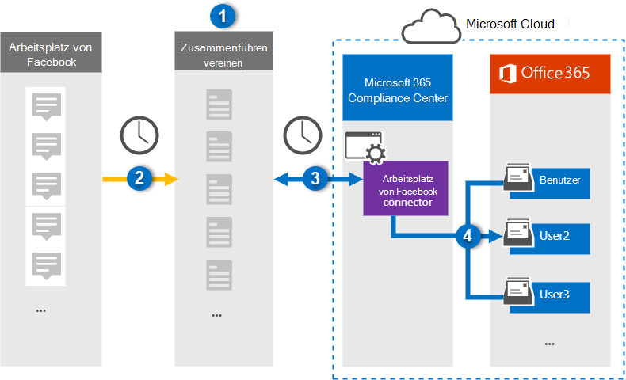

# Einrichten eines Connectors zum Archivieren von Workplace aus Facebook-Daten

Verwenden Sie im Microsoft 365 Compliance Center einen Globanet-Connector, um Daten aus Workplace von Facebook in Benutzerpostfächer in Ihrer Microsoft 365-Organisation zu importieren und zu archivieren. Das Unternehmen Bietet einen [Workplace from Facebook-Connector,](https://globanet.com/workplace/) der so konfiguriert ist, dass Elemente aus der Datenquelle eines Drittanbieters (regelmäßig) erfasst und in Microsoft 365 importiert werden. Der Connector konvertiert inhalte wie Chats, Anlagen, Beiträge und Videos von Workplace in ein E-Mail-Nachrichtenformat und importiert diese Elemente dann in Benutzerpostfächer in Microsoft 365.

Nachdem Workplace-Daten in Benutzerpostfächern gespeichert wurden, können Sie Microsoft 365-Compliancefeatures anwenden, wie z. B. Litigation Hold, eDiscovery, Aufbewahrungsrichtlinien und Aufbewahrungsbezeichnungen sowie Kommunikationskonformität. Die Verwendung von Workplace from Facebook Connector zum Importieren und Archivieren von Daten in Microsoft 365 kann Dazu beitragen, dass Ihre Organisation den richtlinienkonformen Richtlinien von Behörden und Behörden entspricht.

## Übersicht über die Archivierung workplace aus Facebook-Daten

In der folgenden Übersicht wird der Prozess der Verwendung eines Connectors zum Archivieren von Workplace-Daten in Microsoft 365 erläutert.

1. Ihre Organisation arbeitet mit Workplace von Facebook zusammen, um eine Workplace-Website zu einrichten und zu konfigurieren.

2. Einmal alle 24 Stunden werden Elemente aus Workplace auf die Website "Globenet Merge1" kopiert. Der Connector konvertiert auch den Inhalt dieser Elemente in ein E-Mail-Nachrichtenformat.

3. Der Workplace from Facebook-Connector, den Sie im Microsoft 365 Compliance Center erstellen, stellt täglich eine Verbindung mit dem "GlobeNet Merge1" bereit und überträgt die Workplace-Elemente an einen sicheren Azure Storage-Speicherort in der Microsoft-Cloud.

4. Der Connector importiert die konvertierten Elemente mithilfe des Werts der *Email-Eigenschaft* der automatischen Benutzerzuordnung in die Postfächer bestimmter Benutzer, wie in Schritt 3 beschrieben. Ein Unterordner im Posteingangsordner Workplace **von Facebook** wird erstellt, und die Workplace-Elemente werden in diesen Ordner importiert. Der Connector verwendet dazu den Wert der *Email-Eigenschaft.* Jedes Workplace-Element enthält diese Eigenschaft, die mit der E-Mail-Adresse jedes Chat- oder Beitragteilnehmers gefüllt wird.

## Bevor Sie beginnen

- Erstellen Sie ein Konto für das Merge1-Konto von "GlobeNet Merge1" für Microsoft-Connectors. Wenden Sie sich zum Erstellen dieses Kontos an [den Kundensupport von "Globenet".](https://globanet.com/ms-connectors-contact) Sie melden sich bei diesem Konto an, wenn Sie den Connector in Schritt 1 erstellen.

- Erstellen Sie eine benutzerdefinierte Integration unter, um Daten aus Workplace über https://my.workplace.com/work/admin/apps/ APIs für Compliance- und eDiscovery-Zwecke abzurufen.

   Beim Erstellen der Integration generiert die Workplace-Plattform eine Reihe eindeutiger Anmeldeinformationen, die zum Generieren von Token verwendet werden, die für die Authentifizierung verwendet werden. Diese Token werden im Assistenten zum Konfigurieren des Workplace from Facebook-Connectors in Schritt 2 verwendet. Schritt-für-Schritt-Anweisungen zum Erstellen der Anwendungen finden Sie unter [Merge1 Third-Party Connectors User Guide](https://docs.ms.merge1.globanetportal.com/Merge1%20Third-Party%20Connectors%20Workplace%20from%20Facebook%20User%20Guide%20.pdf).

- Der Benutzer, der den Workplace from Facebook Connector in Schritt 1 erstellt (und in Schritt 3 abgeschlossen) muss der Rolle Postfachimportexport in Exchange Online zugewiesen werden. Diese Rolle ist erforderlich, um Connectors auf der Seite **Datenconnectors** im Microsoft 365 Compliance Center hinzuzufügen. Diese Rolle ist standardmäßig nicht einer Rollengruppe in Exchange Online zugewiesen. Sie können die Rolle Postfachimportexport zur Rollengruppe Organisationsverwaltung in Exchange Online hinzufügen. Sie können auch eine Rollengruppe erstellen, die Rolle Postfachimportexport zuweisen und dann die entsprechenden Benutzer als Mitglieder hinzufügen. Weitere Informationen finden Sie in den Abschnitten Erstellen von [Rollengruppen](/Exchange/permissions-exo/role-groups#create-role-groups) oder [Ändern](/Exchange/permissions-exo/role-groups#modify-role-groups) von Rollengruppen im Artikel "Verwalten von Rollengruppen in Exchange Online".

## Schritt 1: Einrichten des Workplace from Facebook-Connectors

Der erste Schritt besteht im Zugriff auf die Seite **Datenconnectors** im Microsoft 365 Compliance Center und dem Erstellen eines Connectors für Workplace-Daten.

1. Wechseln Sie [https://compliance.microsoft.com](https://compliance.microsoft.com/) zu, und klicken Sie dann auf **Datenconnectors**  >  **Arbeitsplatz aus Facebook**.

2. Klicken Sie **auf der Seite Workplace from Facebook** product description auf Connector **hinzufügen.**

3. Klicken Sie **auf der Seite Nutzungsbedingungen** auf **Akzeptieren**.

4. Geben Sie einen eindeutigen Namen ein, der den Connector identifiziert, und klicken Sie dann auf **Weiter**.

5. Melden Sie sich bei Ihrem Merge1-Konto an, um den Connector zu konfigurieren.

## Schritt 2: Konfigurieren des Workplace from Facebook-Connectors auf der Website "Globenet Merge1"

Der zweite Schritt besteht in der Konfiguration des Workplace from Facebook-Connectors auf der Merge1-Website. Informationen zum Konfigurieren des Workplace von Facebook-Connectors finden Sie unter [Merge1 Third-Party Connectors User Guide](https://docs.ms.merge1.globanetportal.com/Merge1%20Third-Party%20Connectors%20Workplace%20from%20Facebook%20User%20Guide%20.pdf).

Nachdem Sie auf **& Beenden** klicken, wird die Seite Benutzerzuordnung im Connector-Assistenten im Microsoft 365 Compliance Center angezeigt. 

## Schritt 3: Zuordnung von Benutzern und Abschließen der Connectoreinrichtung

Führen Sie die folgenden Schritte aus, um Benutzer zu zuordnungen und die Connectoreinrichtung im Microsoft 365 Compliance Center abzuschließen:

1. Aktivieren Sie auf der Seite Externe **Benutzer zu Microsoft 365-Benutzern** zuordnen die automatische Benutzerzuordnung. Die Workplace-Elemente enthalten eine Eigenschaft namens *E-Mail,* die E-Mail-Adressen für Benutzer in Ihrer Organisation enthält. Wenn der Connector diese Adresse einem Microsoft 365-Benutzer zuordnen kann, werden die Elemente in das Postfach dieses Benutzers importiert.

2. Klicken **Sie auf Weiter,** überprüfen Sie  Ihre Einstellungen, und wechseln Sie dann zur Seite Datenconnectors, um den Fortschritt des Importvorgangs für den neuen Connector zu sehen.

## Schritt 4: Überwachen des Arbeitsplatzes über den Facebook-Connector

Nachdem Sie den Workplace from Facebook Connector erstellt haben, können Sie den Connectorstatus im Microsoft 365 Compliance Center anzeigen.

1. Wechseln Sie [https://compliance.microsoft.com](https://compliance.microsoft.com) zu, und klicken Sie **im** linken Navigations navi auf Datenconnectors.

2. Klicken Sie auf **die Registerkarte** Connectors, und wählen Sie dann workplace **from Facebook** connector aus, um die Flyoutseite anzeigen zu können. Diese Seite enthält die Eigenschaften und Informationen zum Connector.

3. Klicken **Sie unter Connectorstatus mit Quelle** auf den Link **Protokoll** herunterladen, um das Statusprotokoll für den Connector zu öffnen (oder zu speichern). Dieses Protokoll enthält Informationen zu den Daten, die in die Microsoft Cloud importiert wurden.

## Bekannte Probleme

- Derzeit wird das Importieren von Anlagen oder Elementen, die größer als 10 MB sind, nicht unterstützt. Unterstützung für größere Elemente wird zu einem späteren Zeitpunkt verfügbar sein.