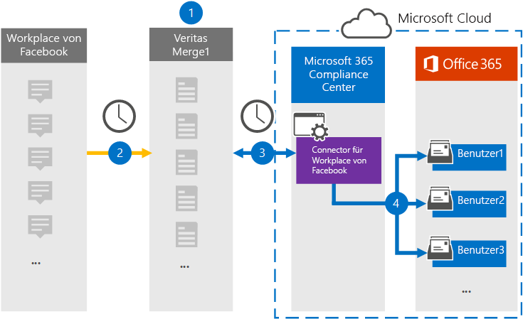

# Einrichten eines Connectors zum Archivieren von Workplace aus Facebook-DatenSet up a connector to archive Workplace from Facebook data

Verwenden Sie einen Connectors vom Microsoft 365, um Daten aus Workplace von Facebook in Benutzerpostfächer in Ihrer Organisation Microsoft 365 archivieren.Use a Veritas connector in the Microsoft 365 compliance center to import and archive data from Workplace from Facebook to user mailboxes in your Microsoft 365 organization. Mit Einem [Workplace from Facebook-Connector,](https://globanet.com/workplace/) der so konfiguriert ist, dass Elemente aus der Datenquelle eines Drittanbieters (regelmäßig) erfasst und in die Datenbank importiert Microsoft 365.Veritas provides a [Workplace from Facebook](https://globanet.com/workplace/) connector that is configured to capture items from the third-party data source (on a regular basis) and import those items to Microsoft 365. Der Connector konvertiert inhalte wie Chats, Anlagen, Beiträge und Videos von Workplace in ein E-Mail-Nachrichtenformat und importiert diese Elemente dann in Benutzerpostfächer in Microsoft 365.The connector converts the content such as chats, attachments, posts, and videos from Workplace to an email message format and then imports those items to user mailboxes in Microsoft 365.

Nachdem Workplace-Daten in Benutzerpostfächern gespeichert wurden, können Sie Microsoft 365 Compliancefeatures wie z. B. Litigation Hold, eDiscovery, Aufbewahrungsrichtlinien und Aufbewahrungsbezeichnungen und Kommunikationskonformität anwenden.After Workplace data is stored in user mailboxes, you can apply Microsoft 365 compliance features such as Litigation Hold, eDiscovery, retention policies and retention labels, and communication compliance. Die Verwendung von Workplace from Facebook Connector zum Importieren und Archivieren von Daten in Microsoft 365 kann Dazu beitragen, dass Ihre Organisation die Richtlinien von Behörden und Behörden einhalten kann.Using Workplace from Facebook connector to import and archive data in Microsoft 365 can help your organization stay compliant with government and regulatory policies.

## Übersicht über die Archivierung workplace aus Facebook-DatenOverview of archiving Workplace from Facebook data

In der folgenden Übersicht wird der Prozess der Verwendung eines Connectors zum Archivieren von Workplace-Daten in Microsoft 365.The following overview explains the process of using a connector to archive Workplace data in Microsoft 365.

1. Ihre Organisation arbeitet mit Workplace von Facebook zusammen, um eine Workplace-Website zu einrichten und zu konfigurieren.Your organization works with Workplace from Facebook to set up and configure a Workplace site.

2. Einmal alle 24 Stunden werden Elemente aus Workplace auf die Website "Merge1" kopiert.Once every 24 hours, items from Workplace are copied to the Veritas Merge1 site. Der Connector konvertiert auch den Inhalt dieser Elemente in ein E-Mail-Nachrichtenformat.The connector also converts the content of these items to an email message format.

3. Der Workplace from Facebook-Connector, den Sie im Microsoft 365 Compliance Center erstellen, stellt jeden Tag eine Verbindung mit dem Unternehmen Vom Merge1 her und überträgt die Workplace-Elemente an einen sicheren Azure Storage-Speicherort in der Microsoft-Cloud.The Workplace from Facebook connector that you create in the Microsoft 365 compliance center, connects to the Veritas Merge1 every day, and transfers the Workplace items to a secure Azure Storage location in the Microsoft cloud.

4. Der Connector importiert die konvertierten Elemente mithilfe des Werts der *Email-Eigenschaft* der automatischen Benutzerzuordnung in die Postfächer bestimmter Benutzer, wie in Schritt 3 beschrieben.The connector imports the converted items to the mailboxes of specific users using the value of the *Email* property of the automatic user mapping as described in Step 3. Ein Unterordner im Posteingangsordner Workplace **von Facebook** wird erstellt, und die Workplace-Elemente werden in diesen Ordner importiert.A subfolder in the Inbox folder named **Workplace from Facebook** is created, and the Workplace items are imported to that folder. Der Connector verwendet dazu den Wert der *Email-Eigenschaft.*The connector does this by using the value of the *Email* property. Jedes Workplace-Element enthält diese Eigenschaft, die mit der E-Mail-Adresse jedes Chat- oder Beitragteilnehmers gefüllt wird.Every Workplace item contains this property, which is populated with the email address of every chat or post participant.

## Bevor Sie beginnenBefore you begin

- Erstellen Sie ein Konto für Denkdruck1 für Microsoft Connectors.Create a Veritas Merge1 account for Microsoft connectors. Wenden Sie sich zum Erstellen dieses Kontos an [den Kundensupport von Veritas](https://globanet.com/ms-connectors-contact).To create this account, contact [Veritas Customer Support](https://globanet.com/ms-connectors-contact). Sie melden sich bei diesem Konto an, wenn Sie den Connector in Schritt 1 erstellen.You will sign into this account when you create the connector in Step 1.

- Erstellen Sie eine benutzerdefinierte Integration unter, um Daten aus Workplace über https://my.workplace.com/work/admin/apps/ APIs für Compliance- und eDiscovery-Zwecke abzurufen.Create a custom integration at https://my.workplace.com/work/admin/apps/ to retrieve data from Workplace via APIs for compliance and eDiscovery purposes.

   Beim Erstellen der Integration generiert die Workplace-Plattform eine Reihe eindeutiger Anmeldeinformationen, die zum Generieren von Token verwendet werden, die für die Authentifizierung verwendet werden.When creating the integration, the Workplace platform generates a set of unique credentials used to generate tokens that are used for authentication. Diese Token werden im Assistenten zum Konfigurieren des Workplace from Facebook-Connectors in Schritt 2 verwendet.These tokens are used in the Workplace from Facebook connector configuration wizard in Step 2. Schritt-für-Schritt-Anweisungen zum Erstellen der Anwendungen finden Sie unter [Merge1 Third-Party Connectors User Guide](https://docs.ms.merge1.globanetportal.com/Merge1%20Third-Party%20Connectors%20Workplace%20from%20Facebook%20User%20Guide%20.pdf).For step-by step instructions about how to create the applications, see [Merge1 Third-Party Connectors User Guide](https://docs.ms.merge1.globanetportal.com/Merge1%20Third-Party%20Connectors%20Workplace%20from%20Facebook%20User%20Guide%20.pdf).

- Der Benutzer, der den Workplace from Facebook-Connector in Schritt 1 erstellt (und in Schritt 3 abgeschlossen) muss der Rolle Postfachimportexport in Exchange Online.The user who creates the Workplace from Facebook connector in Step 1 (and completes it in Step 3) must be assigned to the Mailbox Import Export role in Exchange Online. Diese Rolle ist erforderlich, um Connectors auf der Seite **Datenconnectors** im compliance center Microsoft 365 hinzufügen.This role is required to add connectors on the **Data connectors** page in the Microsoft 365 compliance center. Diese Rolle ist standardmäßig nicht einer Rollengruppe in der Exchange Online.By default, this role is not assigned to a role group in Exchange Online. Sie können die Rolle Postfachimportexport zur Rollengruppe Organisationsverwaltung in der Exchange Online.You can add the Mailbox Import Export role to the Organization Management role group in Exchange Online. Sie können auch eine Rollengruppe erstellen, die Rolle Postfachimportexport zuweisen und dann die entsprechenden Benutzer als Mitglieder hinzufügen.Or you can create a role group, assign the Mailbox Import Export role, and then add the appropriate users as members. Weitere Informationen finden Sie in den Abschnitten [Erstellen](/Exchange/permissions-exo/role-groups#create-role-groups) von Rollengruppen oder [Ändern](/Exchange/permissions-exo/role-groups#modify-role-groups) von Rollengruppen im Artikel "Verwalten von Rollengruppen in Exchange Online".For more information, see the [Create role groups](/Exchange/permissions-exo/role-groups#create-role-groups) or [Modify role groups](/Exchange/permissions-exo/role-groups#modify-role-groups) sections in the article "Manage role groups in Exchange Online".

## Schritt 1: Einrichten des Workplace from Facebook-ConnectorsStep 1: Set up the Workplace from Facebook connector

Der erste Schritt besteht  im Zugriff auf die Seite Datenconnectors im Microsoft 365 Compliance Center und erstellen Sie einen Connector für Workplace-Daten.The first step is to access to the **Data Connectors** page in the Microsoft 365 compliance center and create a connector for Workplace data.

1. Wechseln Sie [https://compliance.microsoft.com](https://compliance.microsoft.com/) zu, und klicken Sie dann auf **Datenconnectors**  >  **Arbeitsplatz aus Facebook**.Go to [https://compliance.microsoft.com](https://compliance.microsoft.com/) and then click **Data connectors** > **Workplace from Facebook**.

2. Klicken Sie **auf der Seite Workplace from Facebook** product description auf Connector **hinzufügen.**On the **Workplace from Facebook** product description page, click **Add connector**.

3. Klicken Sie **auf der Seite Nutzungsbedingungen** auf **Akzeptieren**.On the **Terms of service** page, click **Accept**.

4. Geben Sie einen eindeutigen Namen ein, der den Connector identifiziert, und klicken Sie dann auf **Weiter**.Enter a unique name that identifies the connector, and then click **Next**.

5. Melden Sie sich bei Ihrem Merge1-Konto an, um den Connector zu konfigurieren.Sign in to your Merge1 account to configure the connector.

## Schritt 2: Konfigurieren des Workplace from Facebook-Connectors auf der Website "Merge1"Step 2: Configure the Workplace from Facebook connector on the Veritas Merge1 site

Der zweite Schritt besteht in der Konfiguration des Workplace from Facebook-Connectors auf der Merge1-Website.The second step is to configure the Workplace from Facebook connector on the Merge1 site. Informationen zum Konfigurieren des Workplace von Facebook-Connectors finden Sie unter [Merge1 Third-Party Connectors User Guide](https://docs.ms.merge1.globanetportal.com/Merge1%20Third-Party%20Connectors%20Workplace%20from%20Facebook%20User%20Guide%20.pdf).For information about how to configure the Workplace from Facebook connector, see [Merge1 Third-Party Connectors User Guide](https://docs.ms.merge1.globanetportal.com/Merge1%20Third-Party%20Connectors%20Workplace%20from%20Facebook%20User%20Guide%20.pdf).

Nachdem Sie auf **Speichern &** Fertig  stellen geklickt haben, wird die Seite Benutzerzuordnung im Connector-Assistenten im Microsoft 365 Compliance Center angezeigt.After you click **Save & Finish**, the **User mapping** page in the connector wizard in the Microsoft 365 compliance center is displayed.

## Schritt 3: Zuordnung von Benutzern und Abschließen der ConnectoreinrichtungStep 3: Map users and complete the connector setup

Führen Sie die folgenden Schritte aus, um Benutzer zu zuordnungen und die Connectoreinrichtung im Microsoft 365 Compliance Center abzuschließen:To map users and complete the connector setup in the Microsoft 365 compliance center, follow these steps:

1. Aktivieren Sie auf der Seite Externe **Benutzer Microsoft 365 Benutzer zuordnen** die automatische Benutzerzuordnung.On the **Map external users to Microsoft 365 users** page, enable automatic user mapping. Die Workplace-Elemente enthalten eine Eigenschaft namens *E-Mail,* die E-Mail-Adressen für Benutzer in Ihrer Organisation enthält.The Workplace items include a property called *Email* that contains email addresses for users in your organization. Wenn der Connector diese Adresse einem Microsoft 365 zuordnen kann, werden die Elemente in das Postfach dieses Benutzers importiert.If the connector can associate this address with a Microsoft 365 user, the items are imported to that user’s mailbox.

2. Klicken **Sie auf Weiter,** überprüfen Sie  Ihre Einstellungen, und wechseln Sie dann zur Seite Datenconnectors, um den Fortschritt des Importvorgangs für den neuen Connector zu sehen.Click **Next**, review your settings, and then go to the **Data connectors** page to see the progress of the import process for the new connector.

## Schritt 4: Überwachen des Arbeitsplatzes über den Facebook-ConnectorStep 4: Monitor the Workplace from Facebook connector

Nachdem Sie den Workplace from Facebook Connector erstellt haben, können Sie den Connectorstatus im Microsoft 365 anzeigen.After you create the Workplace from Facebook connector, you can view the connector status in the Microsoft 365 compliance center.

1. Wechseln Sie [https://compliance.microsoft.com](https://compliance.microsoft.com) zu, und klicken Sie **im** linken Navigations navi auf Datenconnectors.Go to [https://compliance.microsoft.com](https://compliance.microsoft.com) and click **Data connectors** in the left nav.

2. Klicken Sie auf **die Registerkarte** Connectors, und wählen Sie dann workplace **from Facebook** connector aus, um die Flyoutseite anzeigen zu können.Click the **Connectors** tab and then select the **Workplace from Facebook** connector to display the flyout page. Diese Seite enthält die Eigenschaften und Informationen zum Connector.This page contains the properties and information about the connector.

3. Klicken **Sie unter Connectorstatus mit Quelle** auf den Link **Protokoll** herunterladen, um das Statusprotokoll für den Connector zu öffnen (oder zu speichern).Under **Connector status with source**, click the **Download log** link to open (or save) the status log for the connector. Dieses Protokoll enthält Informationen zu den Daten, die in die Microsoft Cloud importiert wurden.This log contains information about the data that has been imported to the Microsoft cloud.

## Bekannte ProblemeKnown issues

- Derzeit wird das Importieren von Anlagen oder Elementen, die größer als 10 MB sind, nicht unterstützt.At this time, we don't support importing attachments or items that are larger than 10 MB. Unterstützung für größere Elemente wird zu einem späteren Zeitpunkt verfügbar sein.Support for larger items will be available at a later date.