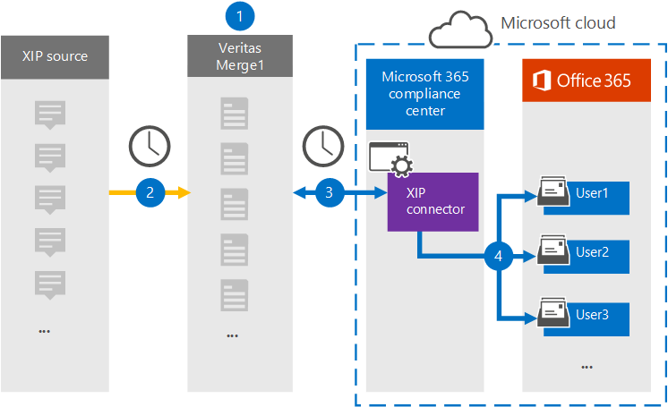

# Einrichten eines Connectors zum Archivieren von XIP-QuelldatenSet up a connector to archive XIP source data

Verwenden Sie einen Connectors für Denkdaten im Microsoft 365 Compliance Center, um Daten von der XIP-Quellplattform in Benutzerpostfächer in Ihrer Microsoft 365-Organisation zu importieren und zu archivieren.Use a Veritas connector in the Microsoft 365 compliance center to import and archive data from the XIP source platform to user mailboxes in your Microsoft 365 organization. Mit einem XIP-Connector, der die Verwendung einer XIP-Datei zum Importieren von Elementen in Microsoft 365 ermöglicht, wird ein [XIP-Connector](https://globanet.com/xip/) zur Verfeinerung von Elementen in Microsoft 365 verwendet.Veritas provides a [XIP](https://globanet.com/xip/) connector that allows using an XIP file to import items to Microsoft 365. Eine XIP-Datei ähnelt einer ZIP-Datei, ermöglicht jedoch die Verwendung einer digitalen Signatur.An XIP file is similar to a ZIP file, but allows for a digital signature to be used. Die digitale Signatur wird durch den 1.1-Merge von Veritas überprüft, bevor die XIP-Quelldatei extrahiert wird.The digital signature is verified by the Veritas Merge 1 before the XIP source file is extracted. Der Connector konvertiert den Inhalt aus der XIP-Quelldatei in ein E-Mail-Nachrichtenformat und importiert diese Elemente dann in das Postfach des Benutzers in Microsoft 365.The connector converts the content from the XIP source file to an email message format and then imports those items to the user's mailbox in Microsoft 365.

Nachdem XIP-Quelldaten in Benutzerpostfächern gespeichert wurden, können Sie Microsoft 365-Compliancefeatures wie z. B. Litigation Hold, eDiscovery, Aufbewahrungsrichtlinien und Aufbewahrungsbezeichnungen und Kommunikationskonformität anwenden.After XIP source data is stored in user mailboxes, you can apply Microsoft 365 compliance features such as Litigation Hold, eDiscovery, retention policies and retention labels, and communication compliance. Die Verwendung eines XIP-Connectors zum Importieren und Archivieren von Daten in Microsoft 365 kann Dazu beitragen, dass Ihre Organisation die Richtlinien von Behörden und Behörden einhalten kann.Using an XIP connector to import and archive data in Microsoft 365 can help your organization stay compliant with government and regulatory policies.

## Übersicht über die Archivierung der XIP-QuelldatenOverview of archiving the XIP source data

In der folgenden Übersicht wird der Prozess der Verwendung eines Connectors zum Archivieren der XIP-Quelldaten in Microsoft 365 erläutert.The following overview explains the process of using a connector to archive the XIP source data in Microsoft 365.

1. Ihre Organisation arbeitet mit der XIP-Quelle zusammen, um eine XIP-Website zu einrichten und zu konfigurieren.Your organization works with the XIP source to set up and configure an XIP site.

2. Einmal alle 24 Stunden werden XIP-Quellelemente auf die Website "Merge1" kopiert.Once every 24 hours, XIP source items are copied to the Veritas Merge1 site. Der Connector konvertiert den Inhalt auch in ein E-Mail-Nachrichtenformat.The connector also converts the content to an email message format.

3. Der XIP-Connector, den Sie im Microsoft 365 Compliance Center erstellen, stellt jeden Tag eine Verbindung mit dem Standort Von -Merge1 her und überträgt die Nachrichten an einen sicheren Azure Storage-Speicherort in der Microsoft-Cloud.The XIP connector that you create in the Microsoft 365 compliance center, connects to the Veritas Merge1 site every day and transfers the messages to a secure Azure Storage location in the Microsoft cloud.

4. Der Connector importiert die konvertierten Nachrichtenelemente mithilfe des Werts der *Email-Eigenschaft* der automatischen Benutzerzuordnung in die Postfächer bestimmter Benutzer, wie in [Schritt 3 beschrieben.](#step-3-map-users-and-complete-the-connector-setup)The connector imports the converted message items to the mailboxes of specific users using the value of the *Email* property of the automatic user mapping as described in [Step 3](#step-3-map-users-and-complete-the-connector-setup). In den Benutzerpostfächern wird ein Unterordner im Posteingangsordner **namens XIP** erstellt, und die Elemente werden in diesen Ordner importiert.A subfolder in the Inbox folder named **XIP** is created in the user mailboxes, and the items are imported to that folder. Der Connector bestimmt mithilfe des Werts der Email-Eigenschaft, in welches Postfach Elemente *importiert werden.*The connector determines which mailbox to import items to by using the value of the *Email* property. Jedes Quellelement enthält diese Eigenschaft, die mit der E-Mail-Adresse jedes Teilnehmers gefüllt wird.Every source item contains this property, which is populated with the email address of every participant.

## Bevor Sie beginnenBefore you begin

- Erstellen Sie ein Konto für Denkdruck1 für Microsoft Connectors.Create a Veritas Merge1 account for Microsoft connectors. Wenden Sie sich zum Erstellen eines Kontos an [den Kundensupport von Veritas](https://www.veritas.com/content/support/).To create an account, contact [Veritas Customer Support](https://www.veritas.com/content/support/). Sie müssen sich bei diesem Konto anmelden, wenn Sie den Connector in Schritt 1 erstellen.You need to sign into this account when you create the connector in Step 1.

- Der Benutzer, der den XIP-Connector in Schritt 1 erstellt (und in Schritt 3 abgeschlossen) muss der Rolle Postfachimportexport in Exchange Online zugewiesen sein.The user who creates the XIP connector in Step 1 (and completes it in Step 3) must be assigned to the Mailbox Import Export role in Exchange Online. Diese Rolle ist erforderlich, um Connectors auf der Seite Datenconnectors im Microsoft 365 Compliance Center hinzuzufügen.This role is required to add connectors on the Data connectors page in the Microsoft 365 compliance center. Diese Rolle ist standardmäßig keinem Rollengruppen in Exchange Online zugewiesen.By default, this role is not assigned to any role group in Exchange Online. Sie können die Rolle Postfachimportexport zur Rollengruppe Organisationsverwaltung in Exchange Online hinzufügen.You can add the Mailbox Import Export role to the Organization Management role group in Exchange Online. Sie können auch eine Rollengruppe erstellen, die Rolle Postfachimportexport zuweisen und dann die entsprechenden Benutzer als Mitglieder hinzufügen.Or you can create a role group, assign the Mailbox Import Export role, and then add the appropriate users as members. Weitere Informationen finden Sie in den Abschnitten Erstellen von [Rollengruppen](/Exchange/permissions-exo/role-groups#create-role-groups) oder [Ändern](/Exchange/permissions-exo/role-groups#modify-role-groups) von Rollengruppen im Artikel "Verwalten von Rollengruppen in Exchange Online".For more information, see the [Create role groups](/Exchange/permissions-exo/role-groups#create-role-groups) or [Modify role groups](/Exchange/permissions-exo/role-groups#modify-role-groups) sections in the article "Manage role groups in Exchange Online".

## Schritt 1: Einrichten des XIP-ConnectorsStep 1: Set up the XIP connector

Der erste Schritt besteht im Zugriff auf die Seite **Datenconnectors** im Microsoft365 Compliance Center und dem Erstellen eines Connectors für die XIP-Quelldaten.The first step is to access to the **Data Connectors** page in the Microsoft365 compliance center and create a connector for the XIP source data.

1. Wechseln Sie [https://compliance.microsoft.com](https://compliance.microsoft.com/) zu, und klicken Sie dann auf **Datenconnectors** \> **XIP**.Go to [https://compliance.microsoft.com](https://compliance.microsoft.com/) and then click **Data connectors** \> **XIP**.

2. Klicken Sie **auf der Seite XIP-Produktbeschreibung** auf Neuen **Connector hinzufügen.**On the **XIP** product description page, click **Add new connector**.

3. Klicken Sie **auf der Seite Nutzungsbedingungen** auf **Akzeptieren**.On the **Terms of service** page, click **Accept**.

4. Geben Sie einen eindeutigen Namen ein, der den Connector identifiziert, und klicken Sie dann auf **Weiter**.Enter a unique name that identifies the connector, and then click **Next**.

5. Melden Sie sich bei Ihrem Merge1-Konto an, um den Connector zu konfigurieren.Sign in to your Merge1 account to configure the connector.

## Schritt 2: Konfigurieren des XIP-Connectors auf der Website "Merge1" von "Veritas Merge1"Step 2: Configure the XIP connector on the Veritas Merge1 site

Der zweite Schritt besteht in der Konfiguration des XIP-Connectors auf dem Merge1-Standort.The second step is to configure the XIP connector on the Merge1 site. Informationen zum Konfigurieren des XIP-Connectors finden Sie unter [Merge1 Third-Party Connectors User Guide](https://docs.ms.merge1.globanetportal.com/Merge1%20Third-Party%20Connectors%20XIP%20User%20Guide%20.pdf).For information about how to configure the XIP connector, see [Merge1 Third-Party Connectors User Guide](https://docs.ms.merge1.globanetportal.com/Merge1%20Third-Party%20Connectors%20XIP%20User%20Guide%20.pdf).

Nachdem Sie auf **& Beenden** klicken, wird die Seite Benutzerzuordnung im Connector-Assistenten im Microsoft 365 Compliance Center angezeigt. After you click **Save & Finish**, the **User mapping** page in the connector wizard in the Microsoft 365 compliance center is displayed.

## Schritt 3: Zuordnung von Benutzern und Abschließen der ConnectoreinrichtungStep 3: Map users and complete the connector setup

Führen Sie die folgenden Schritte aus, um Benutzer zu zuordnungen und die Connectoreinrichtung abzuschließen:To map users and complete the connector setup, follow these steps:

1. Aktivieren Sie auf der Seite **XIP-Benutzer zu Microsoft 365-Benutzern** zuordnen die automatische Benutzerzuordnung.On the **Map XIP users to Microsoft 365 users** page, enable automatic user mapping. Die XIP-Quellelemente enthalten eine Eigenschaft namens *Email*, die E-Mail-Adressen für Benutzer in Ihrer Organisation enthält.The XIP source items include a property called *Email*, which contains email addresses for users in your organization. Wenn der Connector diese Adresse einem Microsoft 365-Benutzer zuordnen kann, werden die Elemente in das Postfach dieses Benutzers importiert.If the connector can associate this address with a Microsoft 365 user, the items are imported to that user’s mailbox.

2. Klicken **Sie auf Weiter,** überprüfen  Sie Ihre Einstellungen, und wechseln Sie zur Seite Datenconnectors, um den Fortschritt des Importvorgangs für den neuen Connector zu sehen.Click **Next**, review your settings, and go to the **Data connectors** page to see the progress of the import process for the new connector.

## Schritt 4: Überwachen des XIP-ConnectorsStep 4: Monitor the XIP connector

Nachdem Sie den XIP-Connector erstellt haben, können Sie den Connectorstatus im Microsoft 365 Compliance Center anzeigen.After you create the XIP connector, you can view the connector status in the Microsoft 365 compliance center.

1. Wechseln Sie [https://compliance.microsoft.com](https://compliance.microsoft.com/) zu, und klicken Sie **im** linken Navigations navi auf Datenconnectors.Go to [https://compliance.microsoft.com](https://compliance.microsoft.com/) and click **Data connectors** in the left nav.

2. Klicken Sie **auf die** Registerkarte Connectors, und wählen Sie dann den **XIP-Connector** aus, um die Flyoutseite mit den Eigenschaften und Informationen zum Connector anzeigen zu können.Click the **Connectors** tab and then select the **XIP** connector to display the flyout page, which contains the properties and information about the connector.

3. Klicken **Sie unter Connectorstatus mit Quelle** auf den Link **Protokoll** herunterladen, um das Statusprotokoll für den Connector zu öffnen (oder zu speichern).Under **Connector status with source**, click the **Download log** link to open (or save) the status log for the connector. Dieses Protokoll enthält Daten, die in die Microsoft Cloud importiert wurden.This log contains data that has been imported to the Microsoft cloud.

## Bekannte ProblemeKnown issues

- Derzeit wird das Importieren von Anlagen oder Elementen, die größer als 10 MB sind, nicht unterstützt.At this time, we don't support importing attachments or items that are larger than 10 MB. Unterstützung für größere Elemente wird zu einem späteren Zeitpunkt verfügbar sein.Support for larger items will be available at a later date.