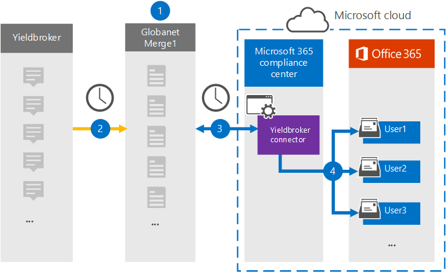

# Einrichten eines Connectors zum Archivieren von Yieldbroker-DatenSet up a connector to archive Yieldbroker data

Verwenden Sie einen Connectors vom Microsoft 365, um Daten aus dem Yieldbroker in Benutzerpostfächer in Ihrer organisation Microsoft 365 archivieren.Use a Veritas connector in the Microsoft 365 compliance center to import and archive data from the Yieldbroker to user mailboxes in your Microsoft 365 organization. Mit Einem [Yieldbroker-Connector,](https://globanet.com/yieldbroker/) der für die Erfassung von Elementen aus der Datenquelle eines Drittanbieters und das Importieren dieser Elemente in die Microsoft 365.Veritas provides you with a [Yieldbroker](https://globanet.com/yieldbroker/) connector that's configured to capture items from the third-party data source and import those items to Microsoft 365. Der Connector konvertiert den Inhalt aus Yieldbroker in ein E-Mail-Nachrichtenformat und importiert diese Elemente dann in das Postfach des Benutzers in Microsoft 365.The connector converts the content from Yieldbroker to an email message format and then imports those items to the user’s mailbox in Microsoft 365.

Nachdem Yieldbroker in Benutzerpostfächern gespeichert wurde, können Sie Microsoft 365 Compliancefeatures wie z. B. Litigation Hold, eDiscovery, Aufbewahrungsrichtlinien und Aufbewahrungsbezeichnungen anwenden.After Yieldbroker is stored in user mailboxes, you can apply Microsoft 365 compliance features such as Litigation Hold, eDiscovery, retention policies, and retention labels. Die Verwendung eines Yieldbroker-Connectors zum Importieren und Archivieren von Daten in Microsoft 365 kann Dazu beitragen, dass Ihre Organisation die Richtlinien von Behörden und Behörden einhalten kann.Using a Yieldbroker connector to import and archive data in Microsoft 365 can help your organization stay compliant with government and regulatory policies.

## Übersicht über die Archivierung von Yieldbroker-DatenOverview of archiving Yieldbroker data

In der folgenden Übersicht wird der Prozess der Verwendung eines Connectors zum Archivieren der Yieldbroker-Daten in Microsoft 365.The following overview explains the process of using a connector to archive the Yieldbroker data in Microsoft 365.

1. Ihre Organisation arbeitet mit dem Yieldbroker zusammen, um eine Yieldbroker-Website zu einrichten und zu konfigurieren.Your organization works with the Yieldbroker to set up and configure a Yieldbroker site.

2. Alle 24 Stunden werden Yieldbroker-Elemente auf die Website "Merge1" kopiert.Once every 24 hours, Yieldbroker items are copied to the Veritas Merge1 site. Der Connector konvertiert den Inhalt auch in ein E-Mail-Nachrichtenformat.The connector also converts the content to an email message format.

3. Der yieldbroker-Connector, den Sie im Microsoft 365 Compliance Center erstellen, stellt jeden Tag eine Verbindung mit dem Standort Von -Merge1 her und überträgt die Nachrichten an einen sicheren Azure Storage-Speicherort in der Microsoft-Cloud.The Yieldbroker connector that you create in the Microsoft 365 compliance center, connects to the Veritas Merge1 site every day and transfers the messages to a secure Azure Storage location in the Microsoft cloud.

4. Der Connector importiert die konvertierten Yieldbroker-Elemente mithilfe des Werts der *Email-Eigenschaft* der automatischen Benutzerzuordnung in die Postfächer bestimmter Benutzer, wie in [Schritt 3 beschrieben.](#step-3-map-users-and-complete-the-connector-setup)The connector imports the converted Yieldbroker items to the mailboxes of specific users using the value of the *Email* property of the automatic user mapping as described in [Step 3](#step-3-map-users-and-complete-the-connector-setup). In den Benutzerpostfächern wird ein Unterordner im Posteingangsordner mit dem Namen **Yieldbroker** erstellt, und die Elemente werden in diesen Ordner importiert.A subfolder in the Inbox folder named **Yieldbroker** is created in the user mailboxes, and the items are imported to that folder. Der Connector bestimmt mithilfe des Werts der Email-Eigenschaft, in welches Postfach Elemente *importiert werden.*The connector determines which mailbox to import items to by using the value of the *Email* property. Jede Yieldbroker-Eigenschaft enthält diese Eigenschaft, die mit der E-Mail-Adresse jedes Teilnehmers des Elements aufgefüllt wird.Every Yieldbroker contains this property, which is populated with the email address of every participant of the item.

## Bevor Sie beginnenBefore you begin

- Erstellen Sie ein Konto für Denkdruck1 für Microsoft Connectors.Create a Veritas Merge1 account for Microsoft connectors. Wenden Sie sich zum Erstellen eines Kontos an [den Kundensupport von Veritas](https://www.veritas.com/content/support/).To create an account, contact [Veritas Customer Support](https://www.veritas.com/content/support/). Sie müssen sich bei diesem Konto anmelden, wenn Sie den Connector in Schritt 1 erstellen.You need to sign into this account when you create the connector in Step 1.

- Der Benutzer, der den Yieldbroker-Connector in Schritt 1 erstellt (und ihn in Schritt 3 abgeschlossen hat), muss der Rolle Postfachimportexport in Exchange Online.The user who creates the Yieldbroker connector in Step 1 (and completes it in Step 3) must be assigned to the Mailbox Import Export role in Exchange Online. Diese Rolle ist erforderlich, um Connectors auf der Seite Datenconnectors im compliance center Microsoft 365 hinzufügen.This role is required to add connectors on the Data connectors page in the Microsoft 365 compliance center. Diese Rolle ist standardmäßig keinem Rollengruppen in der Exchange Online.By default, this role is not assigned to any role group in Exchange Online. Sie können die Rolle Postfachimportexport zur Rollengruppe Organisationsverwaltung in der Exchange Online.You can add the Mailbox Import Export role to the Organization Management role group in Exchange Online. Sie können auch eine Rollengruppe erstellen, die Rolle Postfachimportexport zuweisen und dann die entsprechenden Benutzer als Mitglieder hinzufügen.Or you can create a role group, assign the Mailbox Import Export role, and then add the appropriate users as members. Weitere Informationen finden Sie in den Abschnitten [Erstellen](/Exchange/permissions-exo/role-groups#create-role-groups) von Rollengruppen oder [Ändern](/Exchange/permissions-exo/role-groups#modify-role-groups) von Rollengruppen im Artikel "Verwalten von Rollengruppen in Exchange Online".For more information, see the [Create role groups](/Exchange/permissions-exo/role-groups#create-role-groups) or [Modify role groups](/Exchange/permissions-exo/role-groups#modify-role-groups) sections in the article "Manage role groups in Exchange Online".

## Schritt 1: Einrichten des Yieldbroker-ConnectorsStep 1: Set up the Yieldbroker connector

Der erste Schritt besteht  im Zugriff auf die Seite Datenconnectors im Microsoft 365 Compliance Center und erstellen Sie einen Connector für das Yieldbroker-Konto.The first step is to access to the **Data Connectors** page in the Microsoft 365 compliance center and create a connector for the Yieldbroker.

1. Wechseln Sie [https://compliance.microsoft.com](https://compliance.microsoft.com/) zu, und klicken Sie dann auf **Datenconnectors** &gt; **Yieldbroker**.Go to [https://compliance.microsoft.com](https://compliance.microsoft.com/) and then click **Data connectors** &gt; **Yieldbroker**.

2. Klicken Sie auf der Seite Produktbeschreibung von **Yieldbroker** auf **Neuen Connector hinzufügen.**On the **Yieldbroker** product description page, click **Add new connector**.

3. Klicken Sie **auf der Seite Nutzungsbedingungen** auf **Akzeptieren**.On the **Terms of service** page, click **Accept**.

4. Geben Sie einen eindeutigen Namen ein, der den Connector identifiziert, und klicken Sie dann auf **Weiter**.Enter a unique name that identifies the connector, and then click **Next**.

5. Melden Sie sich bei Ihrem Merge1-Konto an, um den Connector zu konfigurieren.Sign in to your Merge1 account to configure the connector.

## Schritt 2: Konfigurieren des Yieldbroker-Connectors auf dem Standort "Merge1"Step 2: Configure the Yieldbroker connector on the Veritas Merge1 site

Der zweite Schritt besteht in der Konfiguration des Yieldbroker-Connectors auf dem Merge1-Standort.The second step is to configure the Yieldbroker connector on the Merge1 site. Informationen zum Konfigurieren des Yieldbroker finden Sie unter [Merge1 Third-Party Connectors User Guide](https://docs.ms.merge1.globanetportal.com/Merge1%20Third-Party%20Connectors%20Yieldbroker%20User%20Guide%20.pdf).For information about how to configure the Yieldbroker, see [Merge1 Third-Party Connectors User Guide](https://docs.ms.merge1.globanetportal.com/Merge1%20Third-Party%20Connectors%20Yieldbroker%20User%20Guide%20.pdf).

Nachdem Sie auf **Speichern &** Fertig  stellen geklickt haben, wird die Seite Benutzerzuordnung im Connector-Assistenten im Microsoft 365 Compliance Center angezeigt.After you click **Save & Finish**, the **User mapping** page in the connector wizard in the Microsoft 365 compliance center is displayed.

## Schritt 3: Zuordnung von Benutzern und Abschließen der ConnectoreinrichtungStep 3: Map users and complete the connector setup

Führen Sie die folgenden Schritte aus, um Benutzer zu zuordnungen und die Connectoreinrichtung abzuschließen:To map users and complete the connector setup, follow these steps:

1. Aktivieren Sie auf der Seite **Yieldbroker-Benutzer Microsoft 365 Benutzer** zuordnen die automatische Benutzerzuordnung.On the **Map Yieldbroker users to Microsoft 365 users** page, enable automatic user mapping. Die Yieldbroker-Elemente enthalten eine Eigenschaft namens *Email*, die E-Mail-Adressen für Benutzer in Ihrer Organisation enthält.The Yieldbroker items include a property called *Email*, which contains email addresses for users in your organization. Wenn der Connector diese Adresse einem Microsoft 365 zuordnen kann, werden die Elemente in das Postfach dieses Benutzers importiert.If the connector can associate this address with a Microsoft 365 user, the items are imported to that user’s mailbox.

2. Klicken **Sie auf Weiter,** überprüfen  Sie Ihre Einstellungen, und wechseln Sie zur Seite Datenconnectors, um den Fortschritt des Importvorgangs für den neuen Connector zu sehen.Click **Next**, review your settings, and go to the **Data connectors** page to see the progress of the import process for the new connector.

## Schritt 4: Überwachen des Yieldbroker-ConnectorsStep 4: Monitor the Yieldbroker connector

Nachdem Sie den Yieldbroker-Connector erstellt haben, können Sie den Connectorstatus im Microsoft 365 anzeigen.After you create the Yieldbroker connector, you can view the connector status in the Microsoft 365 compliance center.

1. Wechseln Sie [https://compliance.microsoft.com](https://compliance.microsoft.com/) zu, und klicken Sie **im** linken Navigations navi auf Datenconnectors.Go to [https://compliance.microsoft.com](https://compliance.microsoft.com/) and click **Data connectors** in the left nav.

2. Klicken Sie **auf die Registerkarte** Connectors, und wählen Sie dann den **Yieldbroker-Connector** aus, um die Flyoutseite mit den Eigenschaften und Informationen zum Connector anzeigen zu können.Click the **Connectors** tab and then select the **Yieldbroker** connector to display the flyout page, which contains the properties and information about the connector.

3. Klicken **Sie unter Connectorstatus mit Quelle** auf den Link **Protokoll** herunterladen, um das Statusprotokoll für den Connector zu öffnen (oder zu speichern).Under **Connector status with source**, click the **Download log** link to open (or save) the status log for the connector. Dieses Protokoll enthält Daten, die in die Microsoft Cloud importiert wurden.This log contains data that has been imported to the Microsoft cloud.

## Bekannte ProblemeKnown issues

- Derzeit wird das Importieren von Anlagen oder Elementen, die größer als 10 MB sind, nicht unterstützt.At this time, we don't support importing attachments or items that are larger than 10 MB. Unterstützung für größere Elemente wird zu einem späteren Zeitpunkt verfügbar sein.Support for larger items will be available at a later date.