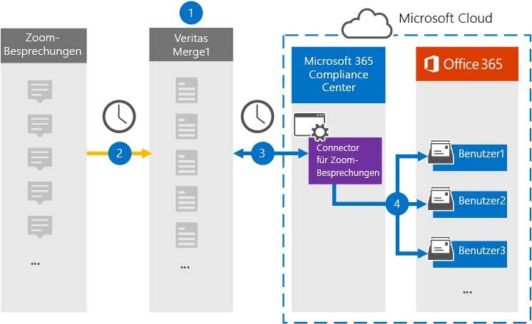

# Einrichten eines Connectors zum Archivieren von ZoombesprechungsdatenSet up a connector to archive Zoom Meetings data

Verwenden Sie einen Connectors vom Microsoft 365, um Daten aus Zoombesprechungen in Benutzerpostfächer in Ihrer Organisation zu importieren und Microsoft 365 archivieren.Use a Veritas connector in the Microsoft 365 compliance center to import and archive data from Zoom Meetings to user mailboxes in your Microsoft 365 organization. Mit Einem [Connector für Zoombesprechungen](https://globanet.com/zoom/) wird ein Connector für Zoombesprechungen zum Erfassen von Elementen aus der Datenquelle eines Drittanbieters (regelmäßig) und zum Importieren dieser Elemente in Microsoft 365.Veritas provides a [Zoom Meetings](https://globanet.com/zoom/) connector that is configured to capture items from the third-party data source (on a regular basis) and import those items to Microsoft 365. Der Connector konvertiert den Inhalt der Besprechungen (einschließlich Chats, aufgezeichnete Dateien und Metadaten) aus dem Konto "Besprechungen zoomen" in ein E-Mail-Nachrichtenformat und importiert diese Elemente dann in Benutzerpostfächer in Microsoft 365.The connector converts the content of the meetings (including chats, recorded files, and metadata) from the Zoom Meetings account to an email message format and then imports those items to user mailboxes in Microsoft 365.

Nachdem Zoombesprechungsdaten in Benutzerpostfächern gespeichert wurden, können Sie Microsoft 365 Compliancefeatures wie z. B. Litigation Hold, eDiscovery, Aufbewahrungsrichtlinien und Aufbewahrungsbezeichnungen und Kommunikationskonformität anwenden.After Zoom Meetings data is stored in user mailboxes, you can apply Microsoft 365 compliance features such as Litigation Hold, eDiscovery, retention policies and retention labels, and communication compliance. Die Verwendung eines Zoombesprechungsconnector zum Importieren und Archivieren von Daten in Microsoft 365 Kann Dazu beitragen, dass Ihre Organisation mit den richtlinienkonformen Richtlinien von Behörden und Behörden konform ist.Using a Zoom Meetings connector to import and archive data in Microsoft 365 can help your organization stay compliant with government and regulatory policies.

## Übersicht über die Archivierung von Zoom-BesprechungsdatenOverview of archiving Zoom Meetings data

In der folgenden Übersicht wird der Prozess der Verwendung eines Connectors zum Archivieren von Zoombesprechungsdaten in Microsoft 365.The following overview explains the process of using a connector to archive Zoom Meetings data in Microsoft 365.

1. Ihre Organisation arbeitet mit Zoombesprechungen zusammen, um eine Zoombesprechungswebsite einrichten und konfigurieren zu können.Your organization works with Zoom Meetings to set up and configure a Zoom Meetings site.

2. Einmal alle 24 Stunden werden Besprechungselemente aus Zoombesprechungen auf die Website "Merge1" kopiert.Once every 24 hours, meeting items from Zoom Meetings are copied to the Veritas Merge1 site. Der Connector konvertiert auch den Inhalt der Besprechungen in ein E-Mail-Nachrichtenformat.The connector also converts the content of the meetings to an email message format.

3. Der Connector für Zoombesprechungen, den Sie im Microsoft 365 Compliance Center erstellen, stellt täglich eine Verbindung mit dem Merge1 von Veritas her und überträgt die Besprechungsnachrichten an einen sicheren Azure Storage-Speicherort in der Microsoft-Cloud.The Zoom Meetings connector that you create in the Microsoft 365 compliance center, connects to the Veritas Merge1 every day, and transfers the meeting messages to a secure Azure Storage location in the Microsoft cloud.

4. Der Connector importiert die konvertierten Besprechungselemente mithilfe des Werts der *Email-Eigenschaft* und der automatischen Benutzerzuordnung in die Postfächer bestimmter Benutzer, wie in Schritt 3 beschrieben.The connector imports the converted meeting items to the mailboxes of specific users using the value of the *Email* property and automatic user mapping, as described in Step 3. In Benutzerpostfächern wird ein neuer Unterordner im Posteingangsordner mit dem Namen **Zoom Besprechungen** erstellt, und die Besprechungselemente werden in diesen Ordner importiert.A new subfolder in the Inbox folder named **Zoom Meetings** is created in user mailboxes, and the meeting items are imported to that folder. Der Connector verwendet dazu den Wert der *Email-Eigenschaft.*The connector does this by using the value of the *Email* property. Jedes Besprechungselement enthält diese Eigenschaft, die mit der E-Mail-Adresse jedes Teilnehmers der Besprechung gefüllt wird.Every meeting item contains this property, which is populated with the email address of every participant of the meeting.

## Bevor Sie beginnenBefore you begin

- Erstellen Sie ein Konto für Denkdruck1 für Microsoft Connectors.Create a Veritas Merge1 account for Microsoft connectors. Wenden Sie sich zum Erstellen dieses Kontos an [den Kundensupport von Veritas](https://globanet.com/ms-connectors-contact).To create this account, contact [Veritas Customer Support](https://globanet.com/ms-connectors-contact). Sie melden sich bei diesem Konto an, wenn Sie den Connector in Schritt 1 erstellen.You will sign into this account when you create the connector in Step 1.

- Rufen Sie den Benutzernamen und das Kennwort für das Zoom Business- oder Zoom-Enterprise Ihrer Organisation ab.Obtain the username and password for your organization's Zoom Business or Zoom Enterprise account. Sie müssen sich in Schritt 2 bei diesem Konto anmelden, wenn Sie den Connector für Zoombesprechungen konfigurieren.You'll need to sign into this account in Step 2 when you configure the Zoom Meetings connector.

- Erstellen Sie die folgenden Anwendungen im [Zoom Marketplace:](https://marketplace.zoom.us)Create the following applications in the [Zoom Marketplace](https://marketplace.zoom.us):

  - OAuth-AnwendungOAuth application

  - JWT-AnwendungJWT application

  Nachdem Sie diese Anwendungen erstellt haben, generiert die Zoom-Plattform eine Reihe eindeutiger Anmeldeinformationen, die zum Generieren der Token verwendet werden.After you create these applications, the Zoom platform generates a set of unique credentials used to generate the tokens. Diese Token werden verwendet, um den Connector zu authentifizieren, wenn er eine Verbindung mit Ihrem Zoomkonto herstellt und Elemente auf die Merge1-Website kopiert.These tokens are used to authenticate the connector when it connects to your Zoom account and copies items to the Merge1 site. Sie verwenden diese Token, wenn Sie den Zoomconnector in Schritt 2 konfigurieren.You will use these tokens when you configure the Zoom connector in Step 2.

  Schrittweise Anweisungen zum Erstellen der OAuth- und JWT-Anwendungen finden Sie unter [Merge1 Third-Party Connectors User Guide](https://docs.ms.merge1.globanetportal.com/Merge1%20Third-Party%20Connectors%20Zoom%20Meetings%20User%20Guide%20.pdf).For step-by step instructions on how to create the OAuth and JWT applications, see [Merge1 Third-Party Connectors User Guide](https://docs.ms.merge1.globanetportal.com/Merge1%20Third-Party%20Connectors%20Zoom%20Meetings%20User%20Guide%20.pdf).

- Der Benutzer, der den Zoombesprechungsconnector in Schritt 1 erstellt (und in Schritt 3 abgeschlossen) muss der Rolle Postfachimportexport in Exchange Online.The user who creates the Zoom Meetings connector in Step 1 (and completes it in Step 3) must be assigned to the Mailbox Import Export role in Exchange Online. Diese Rolle ist erforderlich, um Connectors auf der Seite **Datenconnectors** im compliance center Microsoft 365 hinzufügen.This role is required to add connectors on the **Data connectors** page in the Microsoft 365 compliance center. Diese Rolle ist standardmäßig nicht einer Rollengruppe in der Exchange Online.By default, this role is not assigned to a role group in Exchange Online. Sie können die Rolle Postfachimportexport zur Rollengruppe Organisationsverwaltung in der Exchange Online.You can add the Mailbox Import Export role to the Organization Management role group in Exchange Online. Sie können auch eine Rollengruppe erstellen, die Rolle Postfachimportexport zuweisen und dann die entsprechenden Benutzer als Mitglieder hinzufügen.Or you can create a role group, assign the Mailbox Import Export role, and then add the appropriate users as members. Weitere Informationen finden Sie in den Abschnitten [Erstellen](/Exchange/permissions-exo/role-groups#create-role-groups) von Rollengruppen oder [Ändern](/Exchange/permissions-exo/role-groups#modify-role-groups) von Rollengruppen im Artikel "Verwalten von Rollengruppen in Exchange Online".For more information, see the [Create role groups](/Exchange/permissions-exo/role-groups#create-role-groups) or [Modify role groups](/Exchange/permissions-exo/role-groups#modify-role-groups) sections in the article "Manage role groups in Exchange Online".

## Schritt 1: Einrichten des Connectors für ZoombesprechungenStep 1: Set up the Zoom Meetings connector

Der erste Schritt besteht im Zugriff auf die **Datenconnectors** im Microsoft 365 Compliance Center und erstellen Sie einen Connector für Zoombesprechungen.The first step is to access the **Data Connectors** in the Microsoft 365 compliance center and create a Zoom Meetings connector.

1. Wechseln Sie [https://compliance.microsoft.com](https://compliance.microsoft.com/) zu, und klicken Sie dann auf **Datenconnectors**  >  **Zoom Besprechungen**.Go to [https://compliance.microsoft.com](https://compliance.microsoft.com/) and then click **Data connectors** > **Zoom Meetings**.

2. Klicken Sie **auf der** Seite Produktbeschreibung für Zoombesprechungen auf **Connector hinzufügen.**On the **Zoom Meetings** product description page, click **Add connector**.

3. Klicken Sie **auf der Seite Nutzungsbedingungen** auf **Akzeptieren**.On the **Terms of service** page, click **Accept**.

4. Geben Sie einen eindeutigen Namen ein, der den Connector identifiziert, und klicken Sie dann auf **Weiter**.Enter a unique name that identifies the connector, and then click **Next**.

5. Melden Sie sich bei Ihrem Merge1-Konto an, um den Connector zu konfigurieren.Sign in to your Merge1 account to configure the connector.

## Schritt 2: Konfigurieren des Connectors für ZoombesprechungenStep 2: Configure the Zoom Meetings connector

Der zweite Schritt besteht im Konfigurieren des Zoombesprechungsconnector auf dem Merge1-Standort.The second step is to configure the Zoom Meetings connector on the Merge1 site. Weitere Informationen zum Konfigurieren des Zoombesprechungsconnectors auf der Website "Merge1" finden Sie unter [Merge1-Benutzerhandbuch für Drittanbieterconnectors](https://docs.ms.merge1.globanetportal.com/Merge1%20Third-Party%20Connectors%20Zoom%20Meetings%20User%20Guide%20.pdf).For more information about how to configure the Zoom Meetings connector on the Veritas Merge1 site, see [Merge1 Third-Party Connectors User Guide](https://docs.ms.merge1.globanetportal.com/Merge1%20Third-Party%20Connectors%20Zoom%20Meetings%20User%20Guide%20.pdf).

Nachdem Sie auf **Speichern &** Fertig  stellen geklickt haben, wird die Seite Benutzerzuordnung im Connector-Assistenten im Microsoft 365 Compliance Center angezeigt.After you click **Save & Finish**, the **User mapping** page in the connector wizard in the Microsoft 365 compliance center is displayed.

## Schritt 3: Zuordnung von Benutzern und Abschließen der ConnectoreinrichtungStep 3: Map users and complete the connector setup

1. Aktivieren Sie auf der Seite Externe **Benutzer Microsoft 365 Benutzer zuordnen** die automatische Benutzerzuordnung.On the **Map external users to Microsoft 365 users** page, enable automatic user mapping.

   Zoom Besprechungselemente enthalten eine Eigenschaft namens *E-Mail,* die E-Mail-Adressen für Benutzer in Ihrer Organisation enthält.Zoom Meetings items include a property called *Email* that contains email addresses for users in your organization. Wenn der Connector diese Adresse einem Microsoft 365 zuordnen kann, werden die Elemente in das Postfach dieses Benutzers importiert.If the connector can associate this address with a Microsoft 365 user, the items are imported to that user's mailbox

2. Klicken **Sie auf Weiter,** überprüfen  Sie Ihre Einstellungen, und wechseln Sie zur Seite Datenconnectors, um den Fortschritt des Importvorgangs für den neuen Connector zu sehen.Click **Next**, review your settings, and go to the **Data connectors** page to see the progress of the import process for the new connector.

## Schritt 4: Überwachen des Connectors für ZoombesprechungenStep 4: Monitor the Zoom Meetings connector

Nachdem Sie den Connector für Zoombesprechungen erstellt haben, können Sie den Connectorstatus im Microsoft 365 anzeigen.After you create the Zoom Meetings connector, you can view the connector status in the Microsoft 365 compliance center.

1. Wechseln Sie [https://compliance.microsoft.com](https://compliance.microsoft.com) zu, und klicken Sie **im** linken Navigations navi auf Datenconnectors.Go to [https://compliance.microsoft.com](https://compliance.microsoft.com) and click **Data connectors** in the left nav.

2. Klicken Sie auf **die Registerkarte** Connectors, und wählen Sie dann den Connector **für Zoombesprechungen** aus, um die Flyoutseite anzeigen zu können.Click the **Connectors** tab and then select the **Zoom Meetings** connector to display the flyout page. Diese Seite enthält die Eigenschaften und Informationen zum Connector.This page contains the properties and information about the connector.

3. Klicken **Sie unter Connectorstatus mit Quelle** auf den Link **Protokoll** herunterladen, um das Statusprotokoll für den Connector zu öffnen (oder zu speichern).Under **Connector status with source**, click the **Download log** link to open (or save) the status log for the connector. Dieses Protokoll enthält Informationen zu den Daten, die in die Microsoft Cloud importiert wurden.This log contains information about the data that has been imported to the Microsoft cloud.

## Bekannte ProblemeKnown issues

- Derzeit wird das Importieren von Anlagen oder Elementen, die größer als 10 MB sind, nicht unterstützt.At this time, we don't support importing attachments or items that are larger than 10 MB. Unterstützung für größere Elemente wird zu einem späteren Zeitpunkt verfügbar sein.Support for larger items will be available at a later date.

- Damit der Connector für Zoombesprechungen funktioniert, müssen Sie beim Einrichten von Zoombesprechungen Aufzeichnungen aktivieren.For the Zoom Meetings connector to work, you must enable recordings when setting up Zoom Meetings.