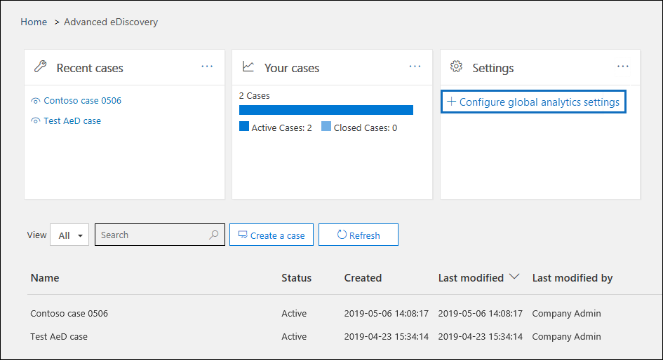
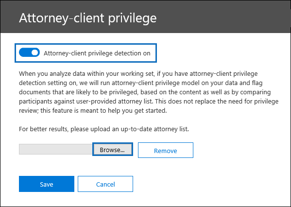
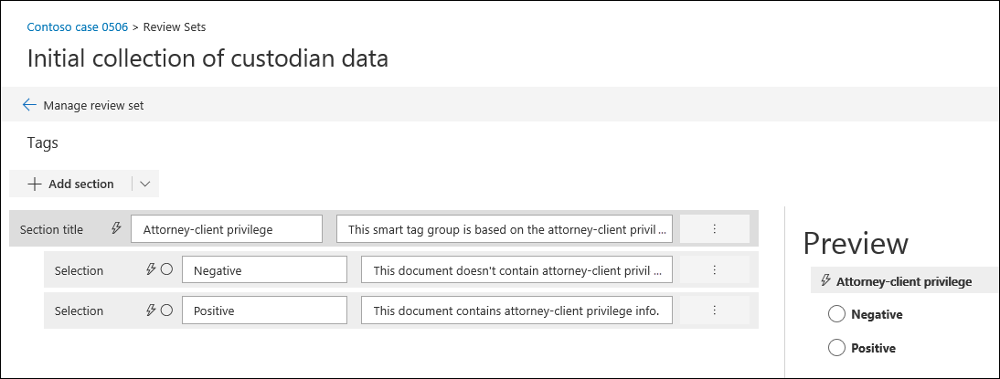

# Einrichten der Erkennung von Anwalts Mandanten-Berechtigungen in Advanced eDiscoverySet up attorney-client privilege detection in Advanced eDiscovery

Ein wichtiger und kostspieliger Aspekt der Überprüfungsphase eines eDiscovery-Prozesses besteht darin, Dokumente für privilegierte Inhalte zu überprüfen.A major and costly aspect of the review phase of any eDiscovery process is reviewing documents for privileged content. Advanced eDiscovery bietet eine maschinelle Lern basierte Erkennung von privilegierten Inhalten, um diesen Prozess effizienter zu gestalten.Advanced eDiscovery provides machine learning-based detection of privileged content to make this process more efficient. Dieses Feature wird als *Anwalts Client-Berechtigungs Erkennung*bezeichnet.This feature is called *attorney-client privilege detection*.

## Wie funktioniert das?How does it work?

Wenn die Erkennung der Anwalts-Client-Rechte aktiviert ist, werden alle Dokumente in einem Überprüfungs Satzes vom Anwalt-Client-Berechtigungs Erkennungs Modell verarbeitet, wenn Sie [die Daten](analyzing-data-in-review-set.md) im Überprüfungspaket analysieren.When attorney-client privilege detection is enabled, all documents in a review set will be processed by the attorney-client privilege detection model when you [analyze the data](analyzing-data-in-review-set.md) in the review set. Das Modell sucht zwei Dinge:The model looks for two things:

- Privilegierte Inhalte – das Modell verwendet Maschinelles Lernen, um die Wahrscheinlichkeit zu ermitteln, dass das Dokumentinhalte enthält, die in der Natur legal sind.Privileged content – The model uses machine learning to determine the likelihood that the document contains content that is legal in nature.

- Teilnehmer – im Rahmen der Einrichtung der Anwalts-Client-Berechtigungs Erkennung müssen Sie eine Liste der Anwälte für Ihre Organisation übermitteln.Participants – As part of setting up attorney-client privilege detection, you have to submit a list of attorneys for your organization. Das Modell vergleicht dann die Teilnehmer des Dokuments mit der anwaltsliste, um festzustellen, ob ein Dokument mindestens einen Anwalts Teilnehmer hat.The model then compares the participants of the document with the attorney list to determine if a document has at least one attorney participant.

Das Modell erzeugt für jedes Dokument die folgenden drei Eigenschaften:The model produces the following three properties for every document:

- **AttorneyClientPrivilegeScore:** Die Wahrscheinlichkeit, dass das Dokument in der Natur legal ist; die Werte für die Partitur liegen zwischen **0** und **1**.**AttorneyClientPrivilegeScore:** The likelihood the document is legal in nature; the values for the score are between **0** and **1**.

- **HasAttorney:** Diese Eigenschaft wird auf **true** festgelegt, wenn einer der Dokument Teilnehmer in der anwaltsliste aufgeführt ist; Andernfalls ist der Wert **false**.**HasAttorney:** This property is set to **true** if one of the document participants is listed in the attorney list; otherwise the value is **false**. Der Wert ist auch auf " **false** " festgelegt, wenn Ihre Organisation keine anwaltsliste hochgeladen hat.The value is also set to **false** if your organization didn't upload an attorney list.

- **Isprivilege:** Diese Eigenschaft wird auf **true** festgelegt, wenn der Wert für **AttorneyClientPrivilegeScore** oberhalb des Schwellenwerts liegt *oder* wenn das Dokument über einen Anwalts Teilnehmer verfügt; Andernfalls wird der Wert auf **false**festgelegt.**IsPrivilege:** This property is set to **true** if the value for **AttorneyClientPrivilegeScore** is above the threshold *or* if the document has an attorney participant; otherwise the value is set to **false**.

Diese Eigenschaften (und die entsprechenden Werte) werden den Datei Metadaten der Dokumente in einem Überprüfungs Satzes hinzugefügt, wie im folgenden Screenshot dargestellt:These properties (and their corresponding values) are added to the file metadata of the documents in a review set, as shown in the following screenshot:

Diese drei Eigenschaften können auch innerhalb eines Überprüfungs Satzes durchsucht werden.These three properties are also searchable within a review set. Weitere Informationen finden Sie unter [Abfragen der Daten in einem Überprüfungs Satzes](review-set-search.md).For more information, see [Query the data in a review set](review-set-search.md).

## Einrichten des Erkennungs Modells für Anwalts Client-BerechtigungenSet up the attorney-client privilege detection model

Um das Erkennungs Modell für das Attorney-Client-Privileg zu aktivieren, muss Ihre Organisation es aktivieren und dann eine anwaltsliste hochladen.To enable the attorney-client privilege detection model, your organization has to turn it on and then upload an attorney list.

### Schritt 1: Aktivieren der Erkennung der Anwalts Client-BerechtigungenStep 1: Turn on attorney-client privilege detection

Eine Person, die ein eDiscovery-Administrator in Ihrer Organisation ist (ein Mitglied der Untergruppe eDiscovery Administrator in der Rollengruppe eDiscovery-Manager), muss das Modell in ihren erweiterten eDiscovery-Fällen verfügbar machen.A person who is an eDiscovery Administrator in your organization (a member of the eDiscovery Administrator subgroup in the eDiscovery Manager role group) must make the model available in your Advanced eDiscovery cases.

1. Wechseln Sie im Security & Compliance Center zu **eDiscovery > Advanced eDiscovery**.In the Security & Compliance Center, go to **eDiscovery > Advanced eDiscovery**.

2. Klicken Sie auf der Seite für die **Erweiterte eDiscovery** -Homepage auf der Kachel **Einstellungen** auf **globale Analyse Einstellungen konfigurieren**.On the **Advanced eDiscovery** home page, in the **Settings** tile, click **Configure global analytics settings**.

   

3. Wählen Sie auf der Registerkarte **Analytics-Einstellungen** die Option **Attorney-Client-Berechtigungen verwalten**aus.On the **Analytics settings** tab, select **Manage attorney-client privilege setting**.

4. Verwenden Sie auf der Seite " **Attorney-Client-Privilege-** Flyout" die Umschaltfläche, um das Feature zu aktivieren, und wählen Sie dann **Speichern**aus.On the **Attorney-client privilege** flyout page, use the toggle to turn on the feature and then select **Save**.

### Schritt 2: Hochladen einer Liste von Anwälten (optional)Step 2: Upload a list of attorneys (optional)

Um das Erkennungs Modell "Attorney-Client-Berechtigung" vollständig zu nutzen und die Ergebnisse des " **hat Attorney** " oder der **potenziell privilegierten** Erkennung zu verwenden, die zuvor beschrieben wurde, wird empfohlen, eine Liste mit e-Mail-Adressen für die Anwälte und das juristische Personal hochzuladen, die für Ihre Organisation arbeiten.To take full advantage of the attorney-client privilege detection model and use the results of the **Has Attorney** or **Potentially Privileged** detection that was previously described, we recommend that you upload a list of email addresses for the lawyers and legal personnel who work for your organization. 

So laden Sie eine anwaltsliste für das Erkennungs Modell "Attorney-Client-Berechtigung" hoch:To upload an attorney list for use by the attorney-client privilege detection model:

1. Erstellen Sie eine CSV-Datei (ohne Kopfzeile), und fügen Sie die e-Mail-Adresse für jede entsprechende Person in einer separaten Zeile hinzu.Create a .csv file (without a header row) and add the email address for each appropriate person on a separate line. Speichern Sie diese Datei auf Ihrem lokalen Computer.Save this file to your local computer.

2. Wählen Sie auf der Website für die **Erweiterte eDiscovery** -Startseite in der Kachel **Einstellungen** die Option **experimentelle Features konfigurieren**aus, und wählen Sie dann **Attorney-Client-Berechtigungseinstellung verwalten**aus.On the **Advanced eDiscovery** home page, in the **Settings** tile, select **Configure experimental features**, and then select **Manage attorney-client privilege setting**.

   Die Seite " **Attorney-Client-Privilege** " wird angezeigt, und die Option " **Anwalt-Client-Berechtigung erkennen** " ist aktiviert.The **Attorney-client privilege** page is displayed, and the **Attorney-client privilege detection** toggle is turned on.

   

3. Wählen Sie **Durchsuchen** aus, und suchen Sie die CSV-Datei, die Sie in Schritt 1 erstellt haben, und wählen Sie Sie aus.Select **Browse** and then find and select the .csv file that you created in step 1.

4. Wählen Sie **Speichern** aus, um die anwaltsliste hochzuladen.Select **Save** to upload the attorney list.

## Verwenden des Erkennungs Modells für Anwalts Client-BerechtigungenUse the attorney-client privilege detection model

Führen Sie die Schritte in diesem Abschnitt aus, um die Erkennung von Anwalts Mandanten-Berechtigungen für Dokumente in einem Überprüfungs Sätze zu verwenden.Follow the steps in this section to use attorney-client privilege detection for documents in a review set.

### Schritt 1: Erstellen einer smarttaggruppe mit dem Anwalt-Client-Berechtigungs Erkennungs ModellStep 1: Create a smart tag group with attorney-client privilege detection model

Eine der wichtigsten Methoden zum Anzeigen der Ergebnisse der Erkennung von Anwalts Client-Berechtigungen in Ihrem Überprüfungsprozess ist die Verwendung einer smarttaggruppe.One of the primary ways to see the results of attorney-client privilege detection in your review process is by using a smart tag group. Eine smarttaggruppe gibt die Ergebnisse der Anwalts-Client-Berechtigungs Erkennung an und zeigt die Ergebnisse Inline neben den Tags in einer smarttaggruppe an.A smart tag group indicates the results of the attorney-client privilege detection and shows the results in-line next to the tags in a smart tag group. Auf diese Weise können Sie während der Dokumentüberprüfung schnell potenziell privilegierte Dokumente identifizieren.This lets you quickly identify potentially privileged documents during document review. Darüber hinaus können Sie die Tags in der smarttaggruppe auch verwenden, um Dokumente als privilegiertes oder als nicht privilegiertes Tag zu kennzeichnen.Additionally, you can also use the tags in the smart tag group to tag documents as privileged or non-privileged. Weitere Informationen zu Smarttags finden Sie unter [Einrichten von Smart Tags in Advanced eDiscovery](smart-tags.md).For more information about smart tags, see [Set up smart tags in Advanced eDiscovery](smart-tags.md).

1. Wählen Sie in der Überprüfungsgruppe, die die Dokumente enthält, die Sie in Schritt 1 analysiert haben, die Option **Review-Gruppe verwalten** aus, und wählen Sie dann **Tags verwalten**aus.In the review set that contains the documents that you analyzed in Step 1, select **Manage review set** and then select **Manage tags**.
 
2. Wählen Sie unter **Tags**die Dropdown Seite neben **Gruppe hinzufügen** aus, und wählen Sie dann **smarttaggruppe hinzufügen**aus.Under **Tags**, select the pull-down next to **Add group** and then select **Add smart tag group**.

   

3. Wählen Sie auf der Seite **Modell für Smarttag auswählen** die Option neben **Anwalt-Client-Privileg** **auswählen** aus.On the **Choose a model for your smart tag** page, choose **Select** next to **Attorney-client privilege**.

   Es wird eine Transpondergruppe namens " **Attorney-Client Privilege** " angezeigt.A tag group named **Attorney-client privilege** is displayed. Sie enthält zwei untergeordnete Tags mit dem Namen " **positiv** " und " **negativ**", die den möglichen Ergebnissen entsprechen, die das Modell erzeugt.It contains two child tags named **Positive** and **Negative**, which correspond to the possible results produced by the model.

   

3. Benennen Sie die Tag-Gruppe und die Tags entsprechend ihrer Überprüfung um.Rename the tag group and tags as appropriate for your review. Sie können beispielsweise " **positiv** " in " **privilegierte** " und " **negativ** " in " **nicht privilegierte**" umbenennen.For example, you can rename **Positive** to **Privileged** and **Negative** to **Not privileged**.

### Schritt 2: Analysieren eines Überprüfungs SatzesStep 2: Analyze a review set

Wenn Sie die Dokumente in einem Überprüfungs Satzes analysieren, wird auch das Clientzugriffs Berechtigungs-Erkennungs Modell ausgeführt und die entsprechenden Eigenschaften (beschrieben in [How is it work?](#how-does-it-work) wird jedem Dokument in der Überprüfungsgruppe hinzugefügt.When you analyze the documents in a review set, the attorney-client privilege detection model will also run and the corresponding properties (described in [How does it work?](#how-does-it-work) will be added to every document in the review set. Weitere Informationen zum Analysieren von Daten in Überprüfungs Sätzen finden Sie unter [Analysieren von Daten in einer Überprüfungsgruppe in Advanced eDiscovery](analyzing-data-in-review-set.md).For more information about analyzing data in review set, see [Analyze data in a review set in Advanced eDiscovery](analyzing-data-in-review-set.md).

### Schritt 3: Verwenden der smarttaggruppe zur Überprüfung von privilegierten InhaltenStep 3: Use the smart tag group for review of privileged content

Nach der Analyse des Überprüfungs Satzes und der Einrichtung von Smarttags besteht der nächste Schritt darin, die Dokumente zu überprüfen.After analyzing the review set and setting up smart tags, the next step is to review the documents. Wenn das Modell festgestellt hat, dass das Dokument möglicherweise privilegiert ist, zeigt das entsprechende Smarttag im **taggingbereich** die folgenden Ergebnisse an, die von der Berechtigung "Anwalt-Client-Erkennung" erzeugt werden:If the model has determined the document is potentially privileged, the corresponding smart tag in the **Tagging panel** will indicate the following results produced by the attorney-client privilege detection:

- Wenn das Dokumentinhalt enthält, der möglicherweise zulässig ist, wird der **rechtliche Inhalt** der Bezeichnung neben dem entsprechenden Smarttag angezeigt (in diesem Fall das standardmäßige **positive** Tag).If the document has content that may be legal in nature, the label **Legal content** is displayed next to the corresponding smart tag (which in this case is the default **Positive** tag).

- Wenn das Dokument über einen Teilnehmer verfügt, der in der anwaltsliste Ihrer Organisation gefunden wird, wird der Bezeichnungs **Anwalt** neben dem entsprechenden Smarttag angezeigt (in diesem Fall ist dies auch das standardmäßige **positive** Tag).If the document has a participant who is found in your organization's attorney list, the label **Attorney** is displayed next to the corresponding smart tag (which in this case is also the default **Positive** tag).

- Wenn das Dokumentinhalte enthält, die möglicherweise legal sind *und* ein Teilnehmer in der anwaltsliste gefunden wird, werden sowohl die **rechtlichen Inhalte** als auch rechts **Anwalts** Bezeichnungen angezeigt.If the document has content that may be legal in nature *and* has a participant found in the attorney list, both the **Legal content**  and **Attorney** labels are displayed. 

Wenn das Modell feststellt, dass ein Dokument keine Inhalte enthält, die in der Natur legal sind oder keinen Teilnehmer aus der anwaltsliste enthalten, wird im taggingbereich keine Bezeichnung angezeigt.If the model determines that a document doesn't contain content that is legal in nature or doesn't contain a participant from the attorney list, then neither label is displayed in the tagging panel.

Die folgenden Screenshots zeigen beispielsweise zwei Dokumente.For example, the following screenshots show two documents. Der erste enthält Inhalte, die in der Natur legal sind und einen Teilnehmer in der Liste der Rechtsanwälte gefunden haben.The first one contains content that is legal in nature and has a participant found in the list of attorneys. Der zweite enthält weder und daher keine Beschriftungen angezeigt.The second contains neither and therefore doesn't display any labels.

Nachdem Sie ein Dokument überprüft haben, um festzustellen, ob es privilegierte Inhalte enthält, können Sie das Dokument mit dem entsprechenden Tag versehen.After you review a document to see if it contains privileged content, you can tag the document with the appropriate tag.
